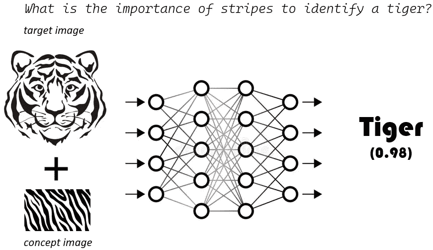
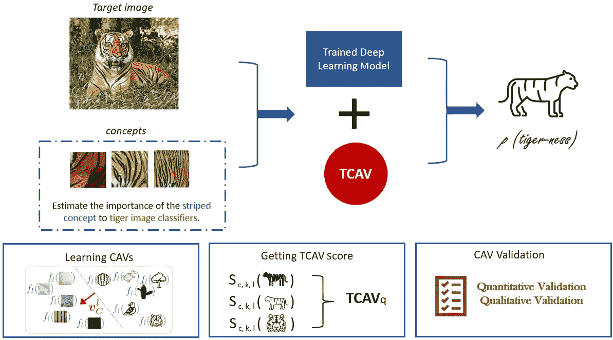
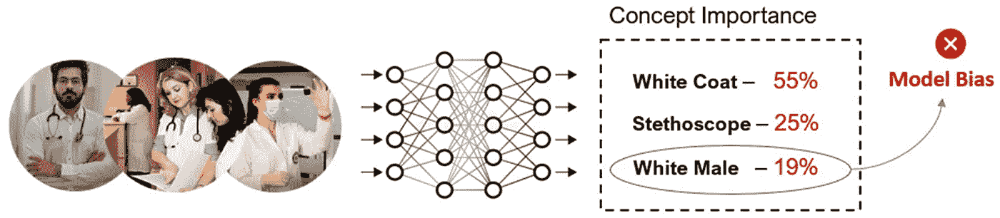
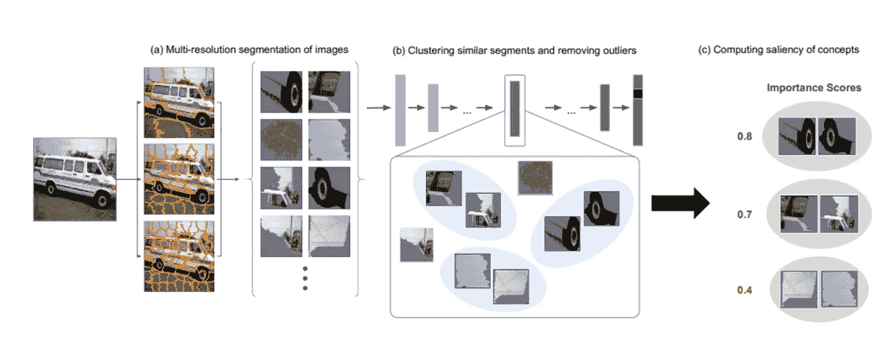
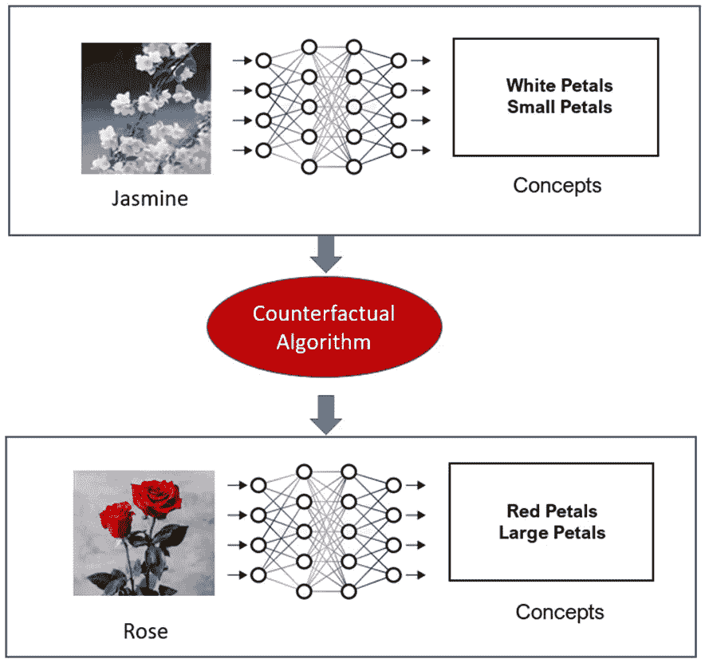

# 使用谷歌 AI 的 TCAV 进行可解释 AI

> 原文：[`towardsdatascience.com/explainable-ai-with-tcav-from-google-ai-5408adf905e`](https://towardsdatascience.com/explainable-ai-with-tcav-from-google-ai-5408adf905e)

## 使用基于概念的解释解释深度神经网络

 [Aditya Bhattacharya](https://adib0073.medium.com/?source=post_page-----5408adf905e--------------------------------)

·发表于[Towards Data Science](https://towardsdatascience.com/?source=post_page-----5408adf905e--------------------------------) ·13 分钟阅读·2023 年 2 月 18 日

--

图片来源：[Pixabay](https://pixabay.com/illustrations/tick-tock-tiktok-network-computer-7730760/)

[**可解释人工智能 (XAI)**](https://amzn.to/3cY4c2h) 是人工智能 (AI) 的一个子领域，旨在开发能够向人类提供清晰且易于理解的决策过程解释的 AI 系统。XAI 的目标是使 AI 变得更加透明、可信、负责任和伦理。XAI 在增加 AI 应用方面至关重要，尤其是在医疗保健、金融和执法等高风险领域。在这些领域，理解 AI 系统如何得出特定决策或建议至关重要。

XAI 中使用了各种技术，包括模型透明性、基于规则的系统以及如 LIME 和 SHAP 等模型无关的方法。XAI 方法可以根据 AI 系统的类型、应用领域和所需的可解释性水平有所不同。总体而言，XAI 是一个至关重要的领域，用于开发可以信任并在现实世界应用中有效且伦理地使用的 AI 系统。

如果你想在短短 45 分钟的视频中获得 XAI 的简要介绍，你可以观看我在**2021 年 AI 加速器节 APAC**上发表的关于 XAI 的过去的一个讲座：

可解释 AI：使机器学习和深度学习模型更具可解释性（作者讲座）

目前流行的 [XAI 方法](https://amzn.to/3J2QNnz) 如 LIME 和 SHAP 的一个主要限制是，这些方法与非技术性终端用户解释观察的方式不是非常一致和直观。例如，如果你有一张装满可乐的玻璃的图像，并使用 LIME 和 SHAP 解释一个正确将图像分类为可乐的黑箱模型，LIME 和 SHAP 都会突出显示图像中导致模型正确预测的区域。但如果你让一个非技术用户描述这张图像，用户会因为玻璃中含有一种类似可乐饮料的深色碳酸液体而将其归类为可乐。换句话说，人类倾向于用已知的*概念*来解释任何观察结果。

[**概念激活向量（TCAV）测试**](https://arxiv.org/pdf/1711.11279.pdf) 也采用了类似的方法，用于通过已知的*人类概念*解释模型预测。因此，在这篇文章中，我们将探讨如何利用 TCAV 提供基于概念的人性化解释。与 LIME 和 SHAP 不同，TCAV 超越了*特征归因*，参考诸如*颜色*、*性别*、*种族*、*形状*、*任何已知对象*或*抽象概念*等来解释模型预测。我们将在这篇文章中讨论有关 TCAV 的以下主题：

+   直观理解 TCAV

+   TCAV 与其他 XAI 框架的区别

+   基于概念的解释的潜在应用

在这篇文章中，我将提到我书中讨论的一些 XAI 框架 [**应用机器学习可解释性技术**](https://amzn.to/3cY4c2h)**。**

 [## 应用机器学习可解释性技术：使 ML 模型在实际中可解释和可信…

### 应用机器学习可解释性技术：使 ML 模型在实际中可解释和可信…

www.amazon.com](https://www.amazon.com/Applied-Machine-Learning-Explainability-Techniques/dp/1803246154?_encoding=UTF8&pd_rd_w=Wr6SJ&content-id=amzn1.sym.716a1ed9-074f-4780-9325-0019fece3c64&pf_rd_p=716a1ed9-074f-4780-9325-0019fece3c64&pf_rd_r=6P2PM599T97MRG7NZD9J&pd_rd_wg=m4qUW&pd_rd_r=6e349d93-5ba0-4bfe-9055-905c0153fe58&linkCode=li3&tag=adib0073-20&linkId=35506e1847de5c011fc57aa66c2b1d8e&language=en_US&ref_=as_li_ss_il&source=post_page-----5408adf905e--------------------------------)

现在是开始的时候了！

# TCAV 简介

**使用概念激活向量（TCAV）**是一种 XAI 方法，用于了解神经网络模型在预测时使用了哪些信号。TCAV 展示了高层次概念（例如，颜色、性别、种族）对预测类别的重要性，类似于人类的沟通方式！TCAV 提供了一种通常适用于一个感兴趣类别的解释，而不仅仅是单张图片（全局解释）。例如，对于给定的类别，我们可以展示种族或性别对 InceptionV3 分类的影响程度。即使种族或性别标签也并非训练输入的一部分！

该算法依赖于**概念激活向量（CAV）**，它利用人类友好的概念来解释机器学习模型的内部状态。从更技术的角度来看，TCAV 使用**方向导数**来量化对模型预测有重要影响的人类友好型高层次概念的重要性。例如，在描述发型时，*卷发*、*直发*或*发色*等概念可以被 TCAV 使用。这些用户定义的概念并不是算法在训练过程中使用的数据集的输入特征。

[应用机器学习可解释性技术：使机器学习模型对实际应用可解释和可信赖](https://www.amazon.com/Applied-Machine-Learning-Explainability-Techniques/dp/1803246154?_encoding=UTF8&pd_rd_w=Wr6SJ&content-id=amzn1.sym.716a1ed9-074f-4780-9325-0019fece3c64&pf_rd_p=716a1ed9-074f-4780-9325-0019fece3c64&pf_rd_r=6P2PM599T97MRG7NZD9J&pd_rd_wg=m4qUW&pd_rd_r=6e349d93-5ba0-4bfe-9055-905c0153fe58&linkCode=li3&tag=adib0073-20&linkId=35506e1847de5c011fc57aa66c2b1d8e&language=en_US&ref_=as_li_ss_il&source=post_page-----5408adf905e--------------------------------)

### [应用机器学习可解释性技术：使机器学习模型对实际应用可解释和可信赖](https://www.amazon.com/Applied-Machine-Learning-Explainability-Techniques/dp/1803246154?_encoding=UTF8&pd_rd_w=Wr6SJ&content-id=amzn1.sym.716a1ed9-074f-4780-9325-0019fece3c64&pf_rd_p=716a1ed9-074f-4780-9325-0019fece3c64&pf_rd_r=6P2PM599T97MRG7NZD9J&pd_rd_wg=m4qUW&pd_rd_r=6e349d93-5ba0-4bfe-9055-905c0153fe58&linkCode=li3&tag=adib0073-20&linkId=35506e1847de5c011fc57aa66c2b1d8e&language=en_US&ref_=as_li_ss_il&source=post_page-----5408adf905e--------------------------------)

[应用机器学习可解释性技术：使机器学习模型对实际应用可解释和可信赖](https://www.amazon.com/Applied-Machine-Learning-Explainability-Techniques/dp/1803246154?_encoding=UTF8&pd_rd_w=Wr6SJ&content-id=amzn1.sym.716a1ed9-074f-4780-9325-0019fece3c64&pf_rd_p=716a1ed9-074f-4780-9325-0019fece3c64&pf_rd_r=6P2PM599T97MRG7NZD9J&pd_rd_wg=m4qUW&pd_rd_r=6e349d93-5ba0-4bfe-9055-905c0153fe58&linkCode=li3&tag=adib0073-20&linkId=35506e1847de5c011fc57aa66c2b1d8e&language=en_US&ref_=as_li_ss_il&source=post_page-----5408adf905e--------------------------------)

其他流行的 XAI 方法，如 LIME 和 SHAP，依赖于模型认为重要的特征。没有为解释性添加自定义用户定义概念作为输入特征的空间。下图展示了 TCAV 解决的关键问题：

TCAV 解决的关键问题 — *一个概念在预测输出中的重要性是什么？* （图片作者）

# 使用抽象概念进行解释

到现在为止，你可能已经对使用抽象概念进行解释的方法有了直观的理解。但你认为这为什么是一种有效的方法？

让我们再举一个例子。假设你正在构建一个基于深度学习的图像分类器，用于从图像中检测医生。在应用 TCAV 后，假设你发现*白人男性*的*概念重要性*最大，其次是*听诊器*和*白色大褂*。听诊器和白色大褂的概念重要性是预期中的，但*白人男性*的高概念重要性表明数据集存在偏差。因此，TCAV 可以帮助评估训练模型的**公平性**。

本质上，CAV 的目标是估计一个概念（如颜色、性别和种族）对预测训练模型的重要性，即使这些*概念*在模型训练过程中没有被使用。这是因为 TCAV 从少量示例样本中学习*概念*。

例如，为了学习一个*性别*概念，TCAV 需要一些具有*男性*概念的数据实例和一些*非男性*示例。因此，TCAV 可以定量估计训练模型对该类特定*概念*的敏感性。

在生成解释时，TCAV 会将数据点扰动到一个对人类可理解的*概念*，因此这是一种**全球扰动方法**。接下来，让我们尝试了解 TCAV 的主要目标。

# TCAV 的目标

我发现 TCAV 的方法与其他解释方法相比非常独特。一个主要原因是这个框架的开发者设立了与我对人类友好解释的理解相一致的明确目标。以下是 TCAV 设立的目标：

+   **可访问性**：TCAV 的开发者希望这种方法对任何终端用户都能可访问，无论他们是否了解机器学习或数据科学。

+   **定制化**：该框架可以适应任何用户定义的概念。这不仅限于训练过程中考虑的概念。

+   **插件准备**：开发者希望这种方法可以在不需要重新训练或微调已经训练好的机器学习模型的情况下进行工作。

+   **全局可解释性**：TCAV 可以通过单一的定量度量解释整个类别或数据集的多个样本。它不局限于数据实例的局部可解释性。

现在我们知道使用 TCAV 可以实现什么，让我们讨论 TCAV 的一般工作方法。

# TCAV 的方法

在这一部分，我们将更深入地讨论 TCAV 的工作原理。这个算法的整体工作可以通过以下方法进行总结：

+   应用方向导数来定量估计训练的机器学习模型对各种用户定义概念的预测敏感性。

+   计算最终的定量解释，称为**TCAVq 量度**，无需任何模型重新训练或微调。这个量度是每个概念对每个模型预测类别的相对重要性。

TCAV 用于估计老虎图像分类器中条纹概念重要性的 approach（图片由作者提供）

现在，我将尝试进一步简化 TCAV 的方法，而不使用太多数学概念。假设我们有一个从图像中识别斑马的模型。

要应用 TCAV，可以采取以下方法：

1.  **定义感兴趣的概念**：第一步是考虑感兴趣的概念。对于我们的斑马分类器，我们可以拥有一组表示该概念的示例（例如黑色条纹在识别斑马时很重要），或者我们可以拥有一个标记了概念的独立数据集。这一步的主要好处是它不限制算法使用模型所用的特征。即使是非技术用户或领域专家也可以根据现有知识定义概念。

1.  **学习概念激活向量**：算法尝试通过训练线性分类器来区分由概念实例生成的激活与存在于任何层中的实例，从而在激活层空间中学习一个向量。因此，**CAV** 被定义为将带有概念的实例和没有概念的实例在模型激活中分开的超平面的正常投影。对于我们的斑马分类器，CAV 帮助区分表示 *黑色条纹* 的表征和不表示 *黑色条纹* 的表征。

1.  **估计方向导数**：方向导数用于量化模型预测对某个概念的敏感性。因此，对于我们的斑马分类器，方向导数帮助我们测量 *黑色条纹* 表征在预测斑马时的重要性。与使用逐像素显著性的显著性图不同，方向导数是在整个数据集或一组输入上计算的，但针对特定概念。这有助于提供全局视角以进行解释。

1.  **估计 TCAV 分数**：为了量化特定类别的概念重要性，计算 TCAV 分数 (**TCAVq**)。这个指标有助于测量定义概念对模型特定激活层的正面或负面影响。

1.  **CAV 验证**：CAV 可以从随机选择的数据中生成。但不幸的是，这可能不会产生有意义的概念。因此，为了改进生成的概念，TCAV 会运行多次迭代，以从不同的数据批次中寻找概念，而不是仅在单一数据批次上训练一次 CAV。然后，使用 *双侧 t 检验* 进行 **统计显著性测试**，以选择统计上显著的概念。还会进行必要的修正，例如 *邦费罗尼修正*，以控制假发现率。

因此，我们已经涵盖了 TCAV 算法的直观工作原理。接下来，让我们讨论 TCAV 如何实际应用。

[## Applied Machine Learning Explainability Techniques: Make ML models explainable and trustworthy for…](https://www.amazon.com/Applied-Machine-Learning-Explainability-Techniques/dp/1803246154?_encoding=UTF8&pd_rd_w=Wr6SJ&content-id=amzn1.sym.716a1ed9-074f-4780-9325-0019fece3c64&pf_rd_p=716a1ed9-074f-4780-9325-0019fece3c64&pf_rd_r=6P2PM599T97MRG7NZD9J&pd_rd_wg=m4qUW&pd_rd_r=6e349d93-5ba0-4bfe-9055-905c0153fe58&linkCode=li3&tag=adib0073-20&linkId=35506e1847de5c011fc57aa66c2b1d8e&language=en_US&ref_=as_li_ss_il&source=post_page-----5408adf905e--------------------------------)

### Applied Machine Learning Explainability Techniques: Make ML models explainable and trustworthy for practical…

[## Applied Machine Learning Explainability Techniques: Make ML models explainable and trustworthy for…](https://www.amazon.com/Applied-Machine-Learning-Explainability-Techniques/dp/1803246154?_encoding=UTF8&pd_rd_w=Wr6SJ&content-id=amzn1.sym.716a1ed9-074f-4780-9325-0019fece3c64&pf_rd_p=716a1ed9-074f-4780-9325-0019fece3c64&pf_rd_r=6P2PM599T97MRG7NZD9J&pd_rd_wg=m4qUW&pd_rd_r=6e349d93-5ba0-4bfe-9055-905c0153fe58&linkCode=li3&tag=adib0073-20&linkId=35506e1847de5c011fc57aa66c2b1d8e&language=en_US&ref_=as_li_ss_il&source=post_page-----5408adf905e--------------------------------)

# TCAV 与其他 XAI 方法的区别

现在，让我们总结一下 TCAV 与流行的 XAI 方法如 LIME 和 SHAP 的不同之处。

+   XAI 框架如 LIME 可能会为同一类别的两个数据实例生成相互矛盾的解释。而 TCAV 生成的解释不仅对单一数据实例是准确的，还对整个类别是准确的。这是 TCAV 相较于 LIME 的一个主要优势，这增加了用户对解释方法的信任。

+   基于概念的解释更接近于人类对未知观察的解释，而不是像 LIME 和 SHAP 采用的基于特征的解释。因此，TCAV 生成的解释确实更加符合人类的思维方式。

+   基于特征的解释局限于模型中使用的特征。要引入任何新的特征以进行模型解释，我们需要重新训练模型，而基于概念的解释则更具灵活性，不受限于模型训练期间使用的特征。要引入一个新概念，我们不需要重新训练模型。只需准备必要的数据集来生成概念即可。

+   模型解释性并不是 TCAV 唯一的好处。TCAV 可以帮助在训练过程中发现问题，例如数据集不平衡导致对数据集的偏倚。事实上，概念重要性可以作为比较模型的一个指标。

# TCAV 的当前限制

不幸的是，就像这个美丽世界中的一切一样，即使是 TCAV 也并非完美无瑕！虽然 TCAV 以其独特的方式存在，但 TCAV 也有一些限制，这些限制限制了它在模型解释性方面的广泛应用。下面讨论了一些 TCAV 目前的主要限制：

+   目前，基于概念的解释方法使用 TCAV 仅限于神经网络。为了增加其采用率，TCAV 需要一种可以与*经典机器学习算法*（如*决策树*、*支持向量机*和*集成学习算法*）一起使用的实现。LIME 和 SHAP 可以应用于经典 ML 算法，以解决标准 ML 问题，这可能也是 LIME 和 SHAP 被更广泛采用的原因。类似地，对于文本数据，TCAV 的应用也非常有限。

+   TCAV 对*数据漂移*、*对抗性影响*和*其他数据质量问题*非常敏感。如果你使用 TCAV，你需要确保训练数据、推理数据，甚至概念数据具有类似的统计特性。否则，生成的概念可能会受到噪声或数据不纯问题的影响：

+   *Guillaume Alain* 和 *Yoshua Bengio* 在他们的论文 *Understanding intermediate layers using linear classifier probes* ([`arxiv.org/abs/1610.01644`](https://arxiv.org/abs/1610.01644)) 中，对将 TCAV 应用于较浅的神经网络表示了一些担忧。许多类似的研究论文建议，较深层次的概念相比于较浅网络中的概念更具可分性，因此 TCAV 的使用主要限于深度神经网络。

+   准备概念数据集可能是一个具有挑战性和昂贵的任务。尽管你不需要 ML 知识来准备概念数据集，但在实践中，你也不会期望任何普通终端用户花时间为任何自定义用户定义的概念创建一个注释概念数据集。

+   我认为 TCAV Python 框架在被用于任何生产级系统之前需要进一步改进。依我之见，在撰写本章节时，该框架需要进一步成熟，以便可以轻松地与任何生产级 ML 系统配合使用。

 [## 应用机器学习可解释性技术：让 ML 模型在实践中可解释和可信赖……](https://www.amazon.com/Applied-Machine-Learning-Explainability-Techniques/dp/1803246154?_encoding=UTF8&pd_rd_w=Wr6SJ&content-id=amzn1.sym.716a1ed9-074f-4780-9325-0019fece3c64&pf_rd_p=716a1ed9-074f-4780-9325-0019fece3c64&pf_rd_r=6P2PM599T97MRG7NZD9J&pd_rd_wg=m4qUW&pd_rd_r=6e349d93-5ba0-4bfe-9055-905c0153fe58&linkCode=li3&tag=adib0073-20&linkId=35506e1847de5c011fc57aa66c2b1d8e&language=en_US&ref_=as_li_ss_il&source=post_page-----5408adf905e--------------------------------)

### 应用机器学习可解释性技术：让 ML 模型在实践中可解释和可信赖……

[www.amazon.com](https://www.amazon.com/Applied-Machine-Learning-Explainability-Techniques/dp/1803246154?_encoding=UTF8&pd_rd_w=Wr6SJ&content-id=amzn1.sym.716a1ed9-074f-4780-9325-0019fece3c64&pf_rd_p=716a1ed9-074f-4780-9325-0019fece3c64&pf_rd_r=6P2PM599T97MRG7NZD9J&pd_rd_wg=m4qUW&pd_rd_r=6e349d93-5ba0-4bfe-9055-905c0153fe58&linkCode=li3&tag=adib0073-20&linkId=35506e1847de5c011fc57aa66c2b1d8e&language=en_US&ref_=as_li_ss_il&source=post_page-----5408adf905e--------------------------------)

所有这些限制确实可以解决，使 TCAV 成为一个更强大的框架，得到广泛采用。你也可以联系 TCAV 框架的作者和开发者，为开源社区做贡献！在下一节中，我们将讨论一些基于概念的解释的潜在应用。

# 基于概念的解释的潜在应用

我确实看到基于概念的解释（如 TCAV）的巨大潜力！在本节中，你将接触到一些基于概念的解释的潜在应用，这些应用可能是整个 AI 社区的重要研究主题，如下所示：

+   **AI 中透明度和公平性的估计**：对黑箱 AI 模型的大多数监管担忧与性别、肤色和种族等概念有关。基于概念的解释实际上可以帮助估计一个 AI 算法在这些抽象概念方面是否公平。检测 AI 模型的偏见实际上可以提高它们的透明度，并帮助解决某些监管问题。例如，在医生使用深度学习模型的情况下，TCAV 可以用于检测模型是否对特定性别、肤色或种族有偏见，因为理想情况下，这些概念对模型的决策不应重要。对这些概念的高概念重要性表示存在偏见。

TCAV 可以用于根据概念重要性检测模型偏见（图片由作者提供）

+   **使用 CAV 进行对抗攻击检测**：如果你查看 TCAV 研究论文的附录 ([`arxiv.org/pdf/1711.11279.pdf`](https://arxiv.org/pdf/1711.11279.pdf))，作者提到实际样本和对抗样本的概念重要性是相当不同的。这意味着如果图像受到对抗攻击的影响，概念重要性也会改变。因此，CAVs 可以成为检测对抗攻击的潜在方法。

+   **基于概念的图像聚类**：使用 CAVs 根据相似概念对图像进行聚类可以是一个有趣的应用。基于深度学习的图像搜索引擎是一个常见的应用，其中聚类或相似性算法被应用于特征向量，以定位相似的图像。然而，这些是基于特征的方法。同样，使用 CAVs 应用基于概念的图像聚类也是一种潜在的可能性。

+   **自动化基于概念的解释 (ACE)**：*Ghorbani, Amirata*、*James Wexler*、*James Zou* 和 *Been Kim* 在他们的研究工作 *面向自动化基于概念的解释* 中提到了一种自动化版本的 TCAV，该版本会遍历训练图像并自动发现显著的概念。这项工作很有趣，因为我认为它在识别标记错误的训练数据方面可能有重要应用。在工业应用中，获得完美标记的策划数据集是极具挑战性的。这个问题可以通过 ACE 很大程度上解决。

来源 — [*面向自动化基于概念的解释*, **Ghorbani 等**](https://arxiv.org/abs/1902.03129)

+   **基于概念的反事实解释**：另一种重要的 XAI 方法是 **反事实解释 (CFE)**，它可以通过建议对输入特征进行更改，从而改变整体结果，来生成可操作的见解。CFE 提供了翻转预测类别所需的最小特征值。然而，CFE 是一种基于特征的解释方法。研究一个基于概念的反事实解释将是一个非常有趣的课题，它离人类友好的解释更近了一步。目前还没有现成的算法或框架能够帮助我们实现这一点，但这可能是计算机视觉中基于概念的方法的一个有用应用。

基于概念的反事实示例（作者提供的图片）

我觉得这是一个广阔的研究领域，通过基于概念的解释提出颠覆性的应用的潜力巨大。我真诚地希望越来越多的研究人员和 AI 开发者开始关注这一领域，以在未来几年取得重大进展！因此，我们已到达本文的结尾。

 [## 应用机器学习可解释性技术：使 ML 模型在实践中可解释和可信…]

### 应用机器学习可解释性技术：使 ML 模型在实践中可解释和可信…

www.amazon.com](https://www.amazon.com/Applied-Machine-Learning-Explainability-Techniques/dp/1803246154?_encoding=UTF8&pd_rd_w=Wr6SJ&content-id=amzn1.sym.716a1ed9-074f-4780-9325-0019fece3c64&pf_rd_p=716a1ed9-074f-4780-9325-0019fece3c64&pf_rd_r=6P2PM599T97MRG7NZD9J&pd_rd_wg=m4qUW&pd_rd_r=6e349d93-5ba0-4bfe-9055-905c0153fe58&linkCode=li3&tag=adib0073-20&linkId=35506e1847de5c011fc57aa66c2b1d8e&language=en_US&ref_=as_li_ss_il&source=post_page-----5408adf905e--------------------------------)

# 总结

本文涵盖了 TCAV 的概念，一种新颖的方法，以及 Google AI 开发的框架。你已经获得了对 TCAV 的概念性理解，了解了 TCAV 的一些关键优势和局限性，最后，我们讨论了一些关于使用基于概念的解释解决潜在研究问题的有趣想法。我推荐阅读这本书：**“**[**应用机器学习可解释性技术**](https://amzn.to/3cY4c2h)**”**，并探索 [GitHub 仓库](https://github.com/PacktPublishing/Applied-Machine-Learning-Explainability-Techniques) 以获取实际代码示例。

# 作者在 TDS 上的其他 XAI 相关文章：

1.  你应该了解的关键可解释 AI Python 框架

1.  解释性机器学习在文本数据训练模型中的应用：结合 SHAP 与 Transformer 模型

1.  EUCA — 一种有效的 XAI 框架，使人工智能更接近终端用户

1.  了解 SHAP 和用于可解释 AI 的 Shapley 值的工作原理

1.  如何使用 LIME 解释图像分类器

 [## 应用机器学习可解释性技术：让机器学习模型变得可解释和可信…](https://www.amazon.com/Applied-Machine-Learning-Explainability-Techniques/dp/1803246154?_encoding=UTF8&pd_rd_w=Wr6SJ&content-id=amzn1.sym.716a1ed9-074f-4780-9325-0019fece3c64&pf_rd_p=716a1ed9-074f-4780-9325-0019fece3c64&pf_rd_r=6P2PM599T97MRG7NZD9J&pd_rd_wg=m4qUW&pd_rd_r=6e349d93-5ba0-4bfe-9055-905c0153fe58&linkCode=li3&tag=adib0073-20&linkId=35506e1847de5c011fc57aa66c2b1d8e&language=en_US&ref_=as_li_ss_il&source=post_page-----5408adf905e--------------------------------)

### 应用机器学习可解释性技术：让机器学习模型在实际应用中变得可解释和可信…

[www.amazon.com](https://www.amazon.com/Applied-Machine-Learning-Explainability-Techniques/dp/1803246154?_encoding=UTF8&pd_rd_w=Wr6SJ&content-id=amzn1.sym.716a1ed9-074f-4780-9325-0019fece3c64&pf_rd_p=716a1ed9-074f-4780-9325-0019fece3c64&pf_rd_r=6P2PM599T97MRG7NZD9J&pd_rd_wg=m4qUW&pd_rd_r=6e349d93-5ba0-4bfe-9055-905c0153fe58&linkCode=li3&tag=adib0073-20&linkId=35506e1847de5c011fc57aa66c2b1d8e&language=en_US&ref_=as_li_ss_il&source=post_page-----5408adf905e--------------------------------)

# 参考文献

1.  [应用机器学习解释性技术](https://amzn.to/3cY4c2h)

1.  书籍《应用机器学习解释性技术》的 GitHub 仓库 — [`github.com/PacktPublishing/Applied-Machine-Learning-Explainability-Techniques/`](https://github.com/PacktPublishing/Applied-Machine-Learning-Explainability-Techniques/)

1.  特征归因之外的可解释性：使用概念激活向量（TCAV）进行定量测试：[`arxiv.org/pdf/1711.11279.pdf`](https://arxiv.org/pdf/1711.11279.pdf)

1.  TCAV Python 框架 — [`github.com/tensorflow/tcav`](https://github.com/tensorflow/tcav)

1.  Koh 等人，《概念瓶颈模型》：[`arxiv.org/abs/2007.04612`](https://arxiv.org/abs/2007.04612)

1.  Guillaume Alain 和 Yoshua Bengio，《使用线性分类器探针理解中间层》：[`arxiv.org/abs/1610.01644`](https://arxiv.org/abs/1610.01644)

1.  Ghorbani, Amirata, James Wexler, James Zou 和 Been Kim，《朝向自动化概念基础解释》：[`arxiv.org/abs/1902.03129`](https://arxiv.org/abs/1902.03129)

1.  章节 10.3 检测概念，Molnar, C.（2022）。《可解释机器学习：黑箱模型可解释性的指南（第 2 版）》：[`christophm.github.io/interpretable-ml-book/detecting-concepts.html`](https://christophm.github.io/interpretable-ml-book/detecting-concepts.html)
