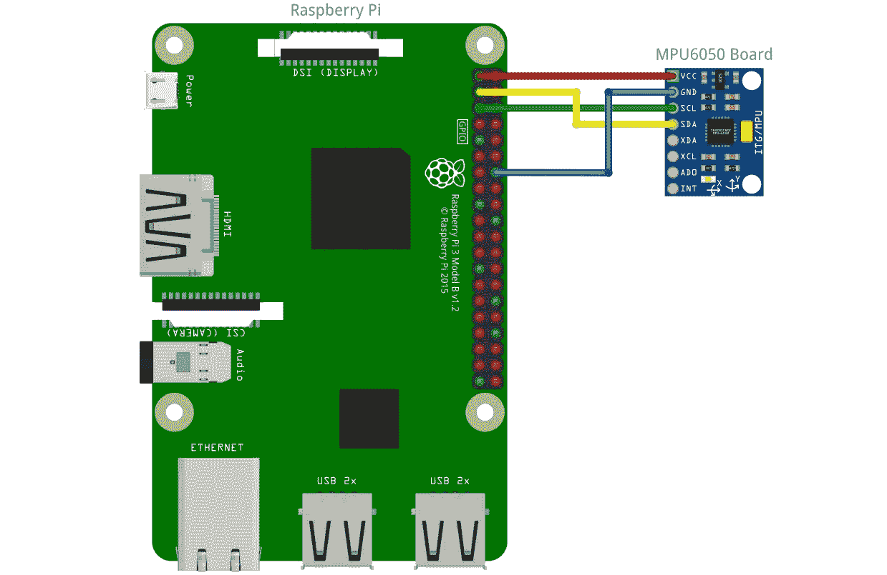
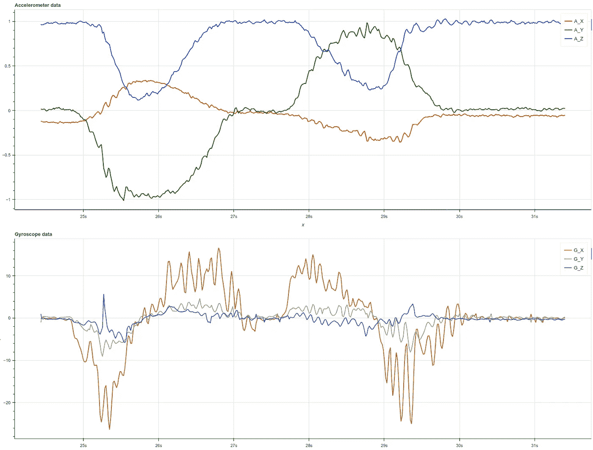
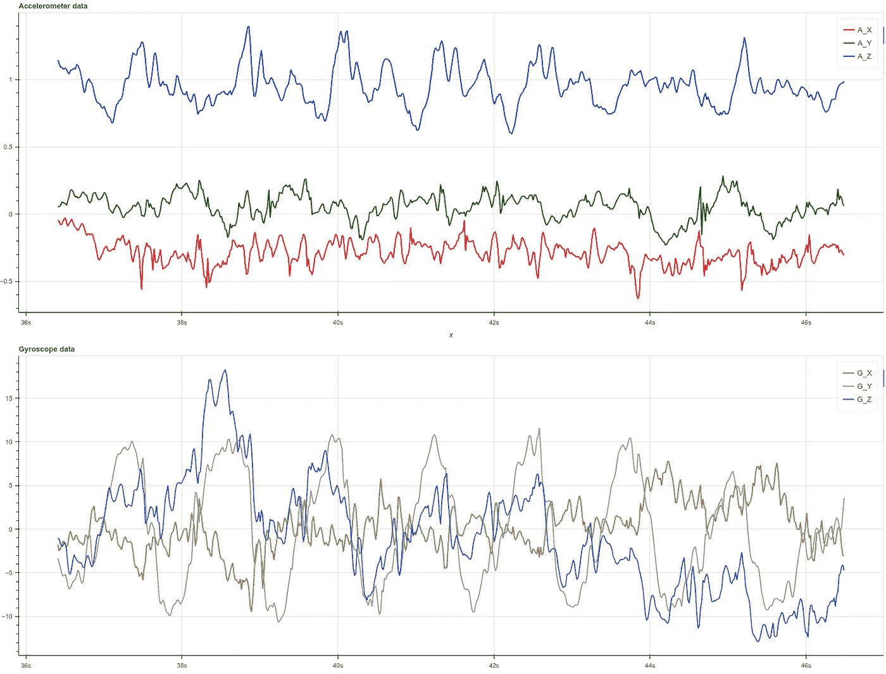
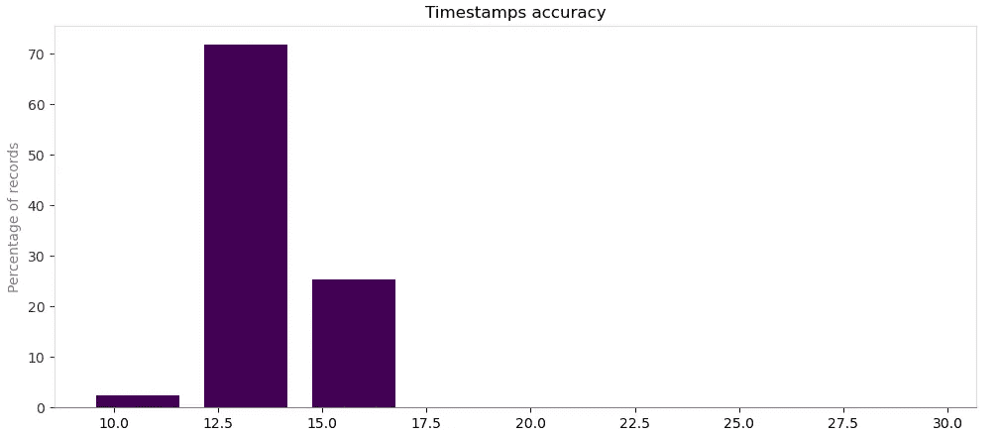
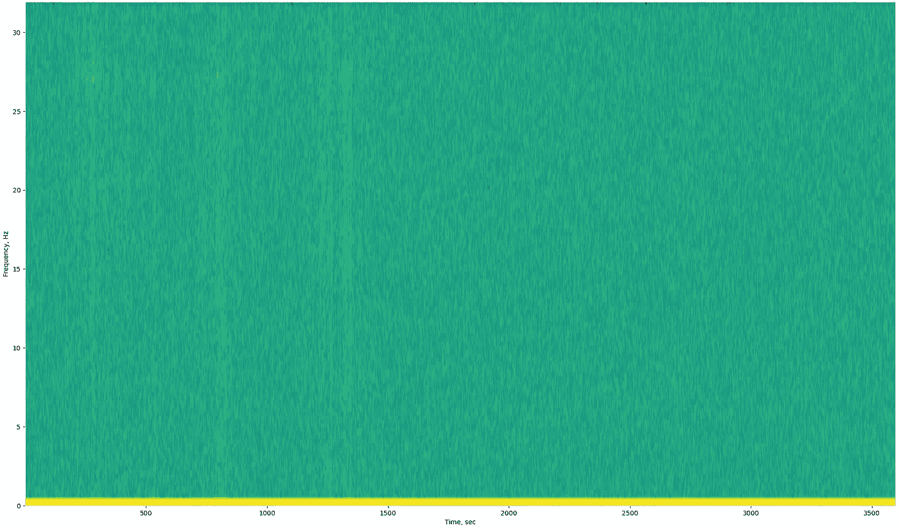
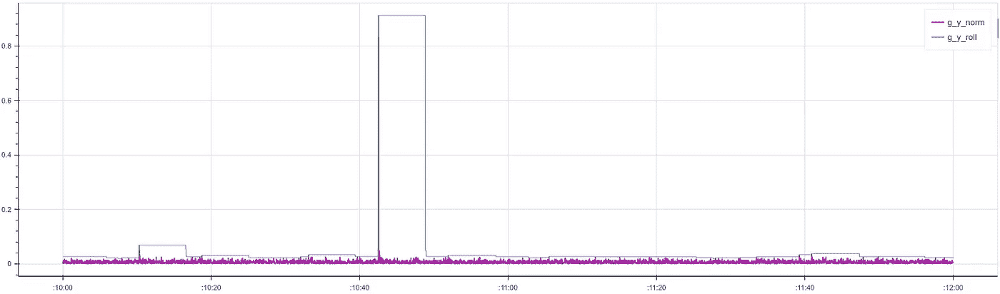
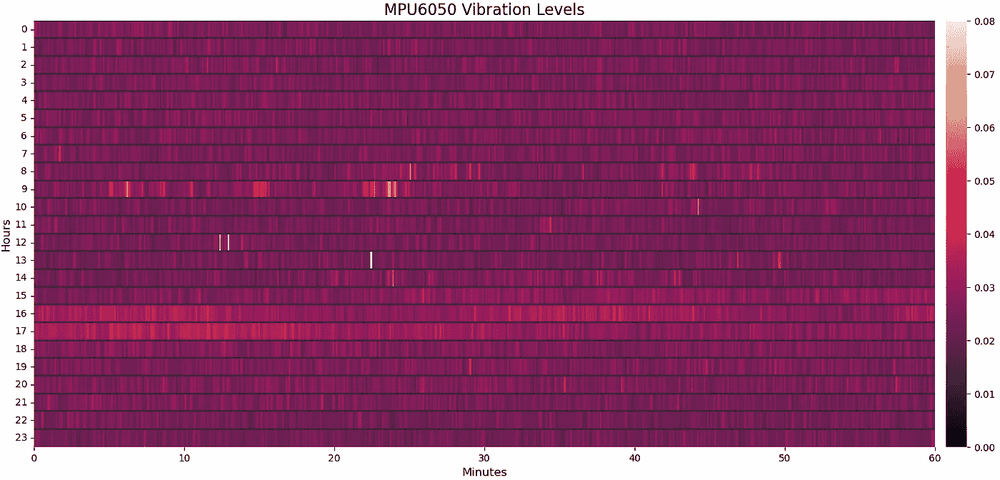
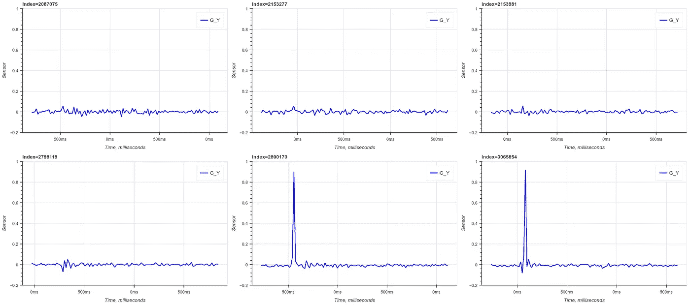
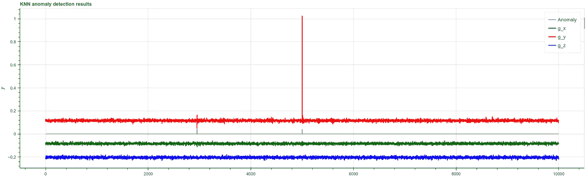

# MEMS 传感器数据的探索性分析

> 原文：[`towardsdatascience.com/exploratory-analysis-of-mems-sensor-data-bbfc0aa0a887`](https://towardsdatascience.com/exploratory-analysis-of-mems-sensor-data-bbfc0aa0a887)

## 从 MPU6050 传感器读取、收集和分析数据

[](https://dmitryelj.medium.com/?source=post_page-----bbfc0aa0a887--------------------------------)[](https://towardsdatascience.com/?source=post_page-----bbfc0aa0a887--------------------------------) [Dmitrii Eliuseev](https://dmitryelj.medium.com/?source=post_page-----bbfc0aa0a887--------------------------------)

·发布于 [Towards Data Science](https://towardsdatascience.com/?source=post_page-----bbfc0aa0a887--------------------------------) ·阅读时间 13 分钟·2023 年 8 月 19 日

--

MEMS（微电机械系统）传感器广泛应用于不同的场景，从游戏控制器和智能手机到无人机。在这篇文章中，我将展示如何连接陀螺仪和加速度计传感器、可以从中获取的数据类型以及如何处理和可视化这些数据。

让我们开始吧。

## 硬件

MPU-6050 是一个 6 轴传感器，结合了 3 轴陀螺仪、3 轴加速度计和 I2C 接口。正如数据表中所写，它广泛用于平板电脑和智能手机。当我们的智能手机或智能手表在锻炼时计算步数和卡路里时，实际上使用的是 MEMS 传感器的数据。但是像这样的传感器不仅仅可以用于运动。我决定将传感器放在我家中几天，看看是否能够检测和分析我所住的建筑物中的各种振动。

如果我们想在几天内收集数据，Raspberry Pi 是一个很好的解决方案。Raspberry Pi 是一个便宜的（30-50 美元）单板计算机；它功耗低，拥有大量引脚来连接不同类型的硬件。可以在亚马逊上以 3-5 美元的价格订购一个 MPU-6050 原型板。传感器本身使用 I2C 总线进行数据传输，只需 4 根线即可将其连接到 Raspberry Pi：



连接图示，作者提供的图片

在使用传感器之前，应该在 Raspbian 操作系统上启用 I2C 总线（关于如何将 MPU6050 连接到 Raspberry Pi 的教程足够多，所以我在这里跳过“硬件”细节）。连接传感器后，我创建了一个简单的 Python 应用程序，读取传感器数据并将其“原样”写入日志文件中：

```py
from datetime import datetime
import smbus
import math
import time

# MPU6050 Registers
PWR_MGMT_1   = 0x6B
SMPLRT_DIV   = 0x19
CONFIG       = 0x1A
GYRO_CONFIG  = 0x1B
INT_ENABLE   = 0x38
ACCEL_XOUT_H = 0x3B
ACCEL_YOUT_H = 0x3D
ACCEL_ZOUT_H = 0x3F
GYRO_XOUT_H  = 0x43
GYRO_YOUT_H  = 0x45
GYRO_ZOUT_H  = 0x47

bus = smbus.SMBus(1)
address = 0x68

def device_init():
    """ Init the MPU-6050 """
    bus.write_byte_data(address, SMPLRT_DIV, 0x4)
    bus.write_byte_data(address, PWR_MGMT_1, 1)
    bus.write_byte_data(address, CONFIG, 0)
    bus.write_byte_data(address, GYRO_CONFIG, 24)
    bus.write_byte_data(address, INT_ENABLE, 1)

def read_byte(reg):
    """ Read 1 byte from the sensor """
    return bus.read_byte_data(address, reg)

def read_word(reg):
    """ Read 2 bytes from the sensor """ 
    h = bus.read_byte_data(address, reg)
    l = bus.read_byte_data(address, reg + 1)
    value = (h << 8) + l
    return value

def read_word_2c(reg):
    """ Read and convert the data """
    val = read_word(reg)
    return -((65535 - val) + 1) if val >= 0x8000 else val

def device_read():
    """ Get accel and gyro data """
    g_x = read_word_2c(GYRO_XOUT_H) / 131
    g_y = read_word_2c(GYRO_YOUT_H) / 131
    g_z = read_word_2c(GYRO_ZOUT_H) / 131
    a_x = read_word_2c(ACCEL_XOUT_H) / 16384
    a_y = read_word_2c(ACCEL_YOUT_H) / 16384
    a_z = read_word_2c(ACCEL_ZOUT_H) / 16384
    return g_x, g_y, g_z, a_x, a_y, a_z

if __name__ == "__main__":
    device_init()
    device_read()

    while True:
        timestamp = datetime.now().strftime('%Y-%m-%d %H:%M:%S.%f')
        gyro_x1, gyro_y1, gyro_z1, accel_x1, accel_y1, accel_z1 = device_read()
        gyro_x2, gyro_y2, gyro_z2, accel_x2, accel_y2, accel_z2 = device_read()
        g_x, g_y, g_z = (gyro_x1 + gyro_x2)/2, (gyro_y1 + gyro_y2)/2, (gyro_z1 + gyro_z2)/2
        a_x, a_y, a_z = (accel_x1 + accel_x2)/2, (accel_y1 + accel_y2)/2, (accel_z1 + accel_z2)/2
        s_data = f"{timestamp},{g_x: .7f},{g_y: .7f},{g_z: .7f},{a_x: .7f},{a_y: .7f},{a_z: .7f}"

        # Save to log file
        log_filename = datetime.now().strftime('%Y-%m-%d.log')
        with open(log_filename, "a", encoding="ascii") as log_out:
            log_out.write(s_data + "\n")
```

在“生产”场景中，我们可以将数据发送到 Kafka 主题或其他任何云服务提供商，但对于“家庭”测试，只需在后台运行应用程序即可：

```py
nohup python3 accel_read.py >/dev/null 2>&1 &
```

之后，我们可以让 Raspberry Pi 运行几天。

从代码中我们可以看到，所有的日志文件都有一个“YYYY-MM-DD”的模式。我们可以使用 `scp` 从 Raspberry Pi 下载这些文件：

```py
scp pi@raspberrypi3:/home/pi/Documents/AccelData/2023-08-01.log data
```

现在让我们看看我们可以获得什么样的数据。

## 总体见解

首先，让我们看看陀螺仪和加速度计的数据是什么样的。我们需要包含所需的库：

```py
import pandas as pd

from bokeh.plotting import figure, show
from bokeh.models import Range1d, DatetimeTickFormatter
from bokeh.io import output_notebook
from bokeh.layouts import row, column, gridplot
output_notebook()
```

现在让我们将 CSV 文件加载到 Pandas 数据框中，并使用 [Bokeh](https://github.com/bokeh/bokeh) 绘制它：

```py
df_sample = pd.read_csv("mpu6050.csv", 
                        header=None, 
                        names=["timestamp", "g_x", "g_y", "g_z", "a_x", "a_y", "a_z"],
                        parse_dates=["timestamp"])
display(df_sample)
```

这个样本包含了在 6 秒内收集的记录，数据值如下所示：


正如我们所见，我们可以从传感器中每秒获得约 60 次测量。让我们绘制数据：

```py
timestamps = df_sample['timestamp']
# Accelerometer data
p1 = figure(title="Accelerometer data", x_axis_type='datetime', 
            x_axis_label='x', y_axis_label='y', width=1600, height=600)
p1.line(timestamps, df_sample["a_x"], legend_label="A_X", line_width=2, color="red")
p1.line(timestamps, df_sample["a_y"], legend_label="A_Y", line_width=2, color="green")
p1.line(timestamps, df_sample["a_z"], legend_label="A_Z", line_width=2, color="blue")
# Gyroscope data
p2 = figure(title="Gyroscope data", x_axis_type='datetime', 
            x_axis_label='x', y_axis_label='y', width=1600, height=600)
p2.line(timestamps, df_sample["g_x"], legend_label="G_X", line_width=2, color="#AA8822")
p2.line(timestamps, df_sample["g_y"], legend_label="G_Y", line_width=2, color="#AA88AA")
p2.line(timestamps, df_sample["g_z"], legend_label="G_Z", line_width=2, color="#2288AA")
show(column(p1, p2))
```

顺便提一下，Bokeh 库非常适合绘制这样的数据。结果是，至少在我的计算机上，当点数超过几千时，Matplotlib 几乎“崩溃”了。与此同时，Bokeh 可以处理在一个图表中多达 100 万条记录的数据。

输出结果如下所示：



加速度计和陀螺仪数据，图片来源于作者

了解**陀螺仪和加速度计之间的区别**也很重要。加速度计（上图）测量的是*静态加速度*，包括来自地球重力的作用。在这个例子中，我慢慢地在手中旋转板子，所有三个 X、Y 和 Z 轴的值都在成比例地变化。陀螺仪测量的是*瞬时动量*，围绕每个轴的旋转。这些数据看起来像是加速度计数据的导数；当运动开始时，会出现一个峰值，然后数值回到零。

我原本不打算在本文中分析步态数据，但一些读者可能仍然对**人类步态的原始传感器数据**感兴趣：



人类步态的加速度计和陀螺仪数据，图片来源于作者

正如我们所见，特别是在陀螺仪数据图中，这种模式很容易检测。为了本文的目的，更具挑战性的是看看我们是否能够检测到数据中更微小的变化，比如建筑物的振动。

## 数据分析

在前面的步骤中，我们了解了如何制作一个简单的应用程序来收集传感器数据，并对这些数据有了一个大致的了解。现在，让我们更详细地看看可以发现哪些有趣的模式。对于所有后续的示例，我将使用在 24 小时内收集的数据。

**1\. 时间戳准确性**

作为提醒，传感器数据是通过在 Raspberry Pi 上运行的 Python 应用程序收集的。Raspberry Pi 本身运行的是 Linux，而不是实时操作系统。首先，让我们看看我们拥有的时间戳准确性。

```py
df = pd.read_csv("data/2023-08-06.log", header=None, 
                 names=["timestamp", "g_x", "g_y", "g_z", "a_x", "a_y", "a_z"], parse_dates=["timestamp"])

t_diff = df["timestamp"].diff().dt.total_seconds()[1:]
diff_mean = t_diff.mean()
print(diff_mean, 1/diff_mean)

#> 0.0156 63.81
```

我在 24 小时内收集了 5,513,693 条记录；总文件大小约为 500 MBytes。正如我们所见，时间戳之间的平均差异为 0.015 秒，平均 fps 约为 64。它的稳定性如何？让我们创建一个**时间差直方图**：

```py
t_diff = df["timestamp"].diff().dt.total_seconds()[1:]

h, bins = np.histogram(t_diff.values, bins=1024)
print(list(zip(h, bins))[:100])

#> [(159712, 0.010), (5349277, 0.015), (4134, 0.0199), (293, 0.02462), 
#>  (96, 0.0293), (28, 0.0339), (10, 0.0386), (7, 0.043), (21, 0.048),
#>  ...
#>  (1, 0.1650), (1, 0.1697), (0, 0.1743), (1, 0.1790), (0, 0.1837), ...]

# Convert X to milliseconds and normalize Y to 0..100%
n_total = sum(h)
h = 100*h/n_total
bins *= 1000

# Create the bar plot
fig, ax = plt.subplots(1, 1, figsize=(10, 5))
ax.bar(bins[0:8], h[0:8], color='#440154', width=2.0)
ax.yaxis.label.set_color('gray')
ax.spines['left'].set_color('#DDDDDD')
ax.spines['right'].set_color('#DDDDDD')
ax.spines['top'].set_color('#DDDDDD')
ax.spines['bottom'].set_color('gray')
ax.xaxis.label.set_color('black')
ax.yaxis.label.set_color('gray')
ax.tick_params(axis='y', colors='#303030')
plt.xlabel("Timestamp difference, milliseconds")
plt.ylabel("Percentage of records")
plt.title("Timestamps accuracy")
plt.show()
```

我们可以看到，Raspbian 确实不是一个实时操作系统，但其准确性足够满足我们的任务：



时间戳差异（毫秒），图片由作者提供

5,349,277 条记录（超过 70%）具有约 0.015 秒（15 毫秒）的延迟，只有不到 50 条记录（0.001%）的间隔长于 0.01 秒（100 毫秒）。

**2\. 声谱图**

让我们来看看更有趣的部分。显然，我们无法用肉眼分析 500 万条记录。让我们建立一个声谱图，以便查看频率域中是否存在一些异常：

```py
def draw_sonogram(df_out: pd.DataFrame, t_start: datetime.datetime, t_end: datetime.datetime):
    """ Draw a sonogram from the dataframe """
    values = df_["g_y"].values
    t_diff = df_['timestamp'].diff().dt.total_seconds()[1:].mean()  # 0.015s ~ 50Hz

    fig, ax = plt.subplots(1, 1, figsize=(24, 14))
    ax.specgram(values, NFFT=256, Fs=1/t_diff, noverlap=50, scale="dB")
    plt.ylabel('Frequency, Hz')
    plt.xlabel('Time, sec')
    plt.show()

draw_sonogram(df, datetime.time(9,0,0), datetime.time(10,0,0))
```

声谱图基于快速傅里叶变换（FFT），将值从“时间域”转换为“频率域”。声谱图上的最大频率约为 30 Hz，根据奈奎斯特定理，这相当于采样率的一半。手动计算可能需要很多工作，但 Matplotlib 的“*specgram*”方法为我们完成了所有工作。结果如下：



传感器数据的声谱图，图片由作者提供

如我们所见，图表上有一些斑点，但我居住的建筑物没有明显的共振频率。但对于其他类型的建筑（电动机、机器、桥梁等），这种类型的分析可能很有用。

**3\. 热图**

如果我们想在振动数据中找到一些模式，查看时间轴上的信号幅度是有意义的。但记录太多，将它们绘制在一条线上效果不好。在这种情况下，热图会更好。

为了制作热图，我使用了三个步骤来预处理数据：

+   归一化。我提取了均值并取了绝对值：

```py
df_ = df.copy()
df_["g_y_norm"] = (df_["g_y"] - df_["g_y"].mean()).abs()
```

+   对滚动周期取最大值。这部分稍微复杂一些。在振动数据中，可能会出现短暂的 1–2 秒峰值。这些小峰值在 24 小时时间轴上不可见，所以我决定使用以下代码进行“滚动最大值”处理：

```py
N = 400
df_["g_y_roll"] = df_['g_y_norm'].rolling(N).max()
```

实际上，它看起来是这样的：



数据处理示例，图片由作者提供

在这个例子中，我将滚动的样本数设置为 400。我们将有一个比短小（紫色）峰值更大的点在热图上。

热图本身可以使用 Seaborn 的“heatmap”方法来显示。下面是包括预处理和绘制的完整代码：

```py
import seaborn as sns

def draw_heatmap(df: pd.DataFrame):
    """ Draw a heatmap from a dataframe """
    # Normalization and applying the rolling maximum
    df_ = df.copy()
    N = 400
    df_["g_y_norm"] = (df_["g_y"] - df_["g_y"].mean()).abs()
    df_["g_y_roll"] = df_['g_y_norm'].rolling(N).max()
    df_ = df_.iloc[::N, :]  # Keep each Nth element

    # Reshape all items to (24, N) matrix for heatmap
    items_all = df_["g_y_roll"].values[2:]
    items_per_hour = items_all.shape[0]//24
    items_reshaped = items_all[:items_per_hour*24].reshape((24, -1))

    # Horizontal labels
    hor_ticks = 6

    # Draw
    fig, ax = plt.subplots(figsize=(30, 8))
    sns.heatmap(items_reshaped, vmin=0, vmax=0.08, 
                cbar_kws={"orientation": "vertical", "pad": 0.01}, ax=ax)
    ax.hlines(list(range(24)), *ax.get_xlim(), colors="#303030")
    plt.xticks(rotation=0)
    ax.set_xticks(np.linspace(0, items_per_hour, hor_ticks+1))
    ax.set_xticklabels([10*n for n in range(hor_ticks+1)])
    plt.title('MPU6050 Vibration Levels', fontsize=16)
    plt.xlabel('Minutes', fontsize=12)
    plt.yticks(rotation=0)
    plt.ylabel('Hours', fontsize=12)
    plt.show()

draw_heatmap(df)
```

最终图像如下：



MPU6050 振动数据热图，图片由作者提供

正如我们所见，将所有 24 小时的数据放在一张图中更加“说明性”。例如，我们可以很容易地看到交通振动，它发生在早上 9 点和下午 4 点到 6 点之间。

我没有实现亮度调整；可以通过调整 *sns.heatmap* 调用的 *vmin* 和 *vmax* 参数在代码中手动更改。数据本身没有缺口，缺失值的处理在这里没有实现。

**4\. 异常检测**

在热图上，我们可以看到一些有趣的模式，比如晚间交通造成的振动。我们还可以看到一些明亮的白点——有趣的是知道它是什么。

为了检测这些“异常”，我们将尝试两种方法。首先，我们可以直接找到大于阈值的数据。作为第二种方法，我们可以使用像 Python Outlier Detection (PyOD) 这样的现成库。让我们测试一下这两种方法！

**基于阈值的过滤** 是直接的。作为阈值，我选择了一个大值（7 个标准差），因此随机获得这种振动水平的概率极小。至于过滤本身，Pandas 已经拥有所有需要的方法：

```py
df_ = df.copy()
df_["g_y_norm"] = (df_["g_y"] - df_["g_y"].mean()).abs()
std_y = df_["g_y_norm"].std()
threshold = 7*std_y

df_filtered = df_.index[df_['g_y_norm'] >= threshold]
print(df_filtered)
# > [2087075, 2153277, 2153981, 2798119, 2800170, 2800171, 
# > 3065854, 3065855,3065856, 3065858]
```

输出为数组索引。但有些项目过于接近；例如，索引 3065854 和 3065855 确实表示相同的事件。为了过滤数组，我创建了一个辅助方法来删除冗余项目：

```py
def shrink_array(data: Any, num_samples: int) -> List:
    """ Remove too close items from array. Example: [1, 2, 3, 10, 20] => [1, 10, 20] """
    out = data[:1]
    for val in data[1:]:
        if val > out[-1] + num_samples:
            out.append(val)
    return out

indexes = shrink_array(df_filtered.values.tolist(), num_samples=500)
print(indexes)
# > [2087075, 2153277, 2153981, 2798119, 2800170, 3065854]
```

这里的参数“num_samples”用作标准；所有接近此值的数组项将从列表中删除。

现在，我们可以使用 Bokeh 显示结果：

```py
from bokeh.layouts import gridplot

def make_plot(df_out: pd.DataFrame, title: str):
    """ Show graph data """
    timestamps = pd.to_datetime(df_out['timestamp'].values).to_pydatetime()
    p = figure(title=title, x_axis_type='datetime', 
               x_axis_label='x', y_axis_label='y', 
               width=600, height=400)
    p.line(timestamps, df_out["g_y"].values - df_out["g_y"].mean(), 
           legend_label="G_Y", line_width=1, color="blue")
    p.xaxis.formatter=DatetimeTickFormatter(seconds="%H:%M:%S")
    p.y_range = Range1d(-1.0, 1.0)
    return p

plots = []
for ind in indexes:
    plots.append(make_plot(df_[ind - 20:ind + 100], title=f"Index={ind}"))

show(gridplot(np.array_split(plots, 2)))
```

输出如下所示：



由阈值检测到的异常，图像由作者提供

作为本文的最后一步，让我们使用 [**Python Outlier Detection (PyOD)**](https://github.com/yzhao062/pyod) 库来寻找异常。这个库实现了 40 多种算法；我将展示其中之一，仅仅是为了让读者了解其工作原理。我将使用基于邻近的 KNN（k 最近邻）算法，它使用到第 k 个最近邻的距离作为异常值评分。

首先，我们需要使用一些数据来拟合算法。为此，我使用了之前找到的一个索引：

```py
from pyod.models.knn import KNN

pos_train = 2087075
df_ = df[pos_train - 100000:pos_train + 100000]
fit_data = df_[["g_x", "g_y", "g_z"]].to_numpy()

clf = KNN(contamination=0.0001)
clf.fit(fit_data)
```

正如我们所见，使用 PyOD 和我的“天真”方法之间有两个主要区别。首先，PyOD 可以分析 *多变量数据*，因此我们可以使用传感器的所有三个轴。其次，根据我们的领域知识，我们需要指定一个 *污染* 率。我在寻找非常罕见且短暂的事件，这些事件可能每几个小时发生一次，因此我将此值设置为 0.0001。

当检测器训练完成后，我们可以简单地使用“predict”方法来处理另一组数据并获取结果：

```py
pos_test = 2800170
df_test = df[["g_x", "g_y", "g_z"]][pos_test - 5000:pos_test + 5000]
data = df_test.to_numpy()
y_pred = clf.predict(data)  # Outlier labels (0 or 1)
```

为了以可视化形式查看结果，让我们在同一图表上绘制输入和预测：

```py
# Draw
x = np.arange(0, len(y_pred))
y = y_pred
y1 = df_test["g_x"]
y2 = df_test["g_y"]
y3 = df_test["g_z"]
p = figure(title="KNN anomaly detection results", 
           x_axis_label='x', y_axis_label='y', 
           width=1600, height=500)
p.line(x, 0.04*y, legend_label="Anomaly", line_width=2, color="gray")
p.line(x, y1, legend_label="g_x", line_width=2, color="green")
p.line(x, y2, legend_label="g_y", line_width=2, color="red")
p.line(x, y3, legend_label="g_z", line_width=2, color="blue")
show(p)
```

这里的红色、绿色和蓝色线条表示传感器数据，灰色线条是预测结果，小的峰值显示了检测到异常值的索引：



异常检测与 PyOD，作者提供的图片

它有效。正如之前所述，PyOD 中有 [40 多种算法](https://github.com/yzhao062/pyod#implemented-algorithms)可供使用。欢迎有兴趣的读者自行测试其他算法。如果有人希望在相同的数据集上测试这些算法，请在下方评论，我会分享一个临时链接。

## 结论

在这篇文章中，我解释了如何将 MPU6050 MEMS 传感器连接到树莓派单板计算机，并在几天内收集来自建筑物的振动数据。然后我们以不同的方式分析了这些数据，比如在时间轴和热图上绘制原始数据、在频域中构建声谱图，并应用异常检测算法。这对于现代城市环境的研究可能很有趣；例如，交通引起的振动在图表上非常明显（我实际上很惊讶 MPU6050，这个传感器主要设计用于智能手机和游戏控制器，竟然能可靠地检测到如此微小的振动）。甚至有可能检测到如地震这样的稀有事件，尽管对于这种事件，拥有至少两个地点的数据会更可靠。振动分析也可以用于预测机器如电动机或涡轮机的故障。实际应用的可能性非常大。

总的来说，进行这个实验以及使用“真实”硬件和其数据是很有趣的。遗憾的是，我必须承认关于硬件和物联网中的数据科学和数据分析的文章和帖子数量微乎其微，不仅在 TDS 上如此，在其他网站上也是如此。我希望这个故事能稍微改变这种不平衡，向读者展示与硬件打交道也可以很有趣。

感谢阅读。如果你喜欢这个故事，欢迎 [订阅](https://medium.com/@dmitryelj/membership) Medium，你将会收到我新文章发布的通知，并且可以完全访问来自其他作者的成千上万的故事。
