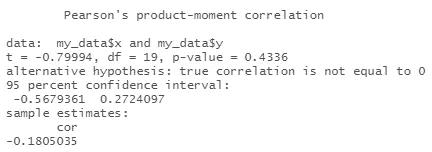
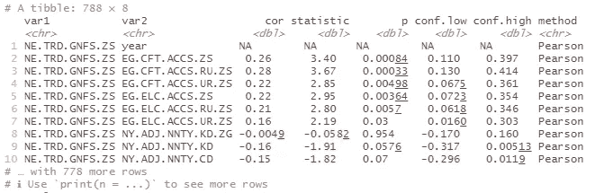
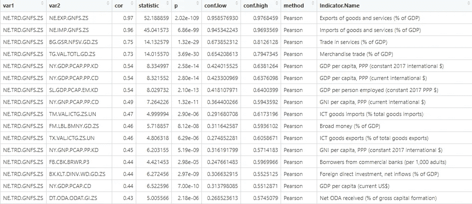
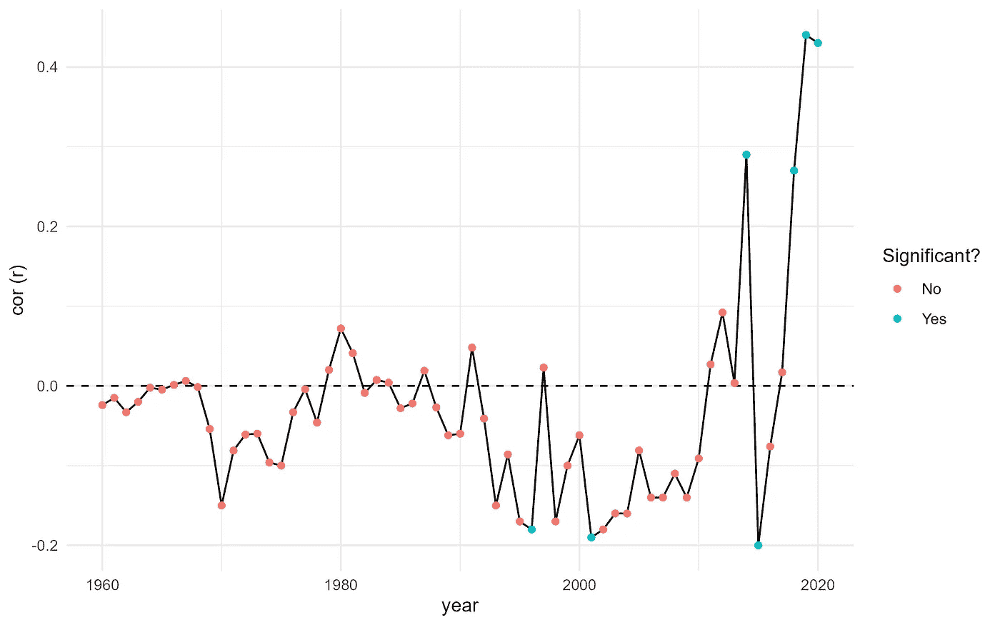

# 在 R 中的探索性相关分析

> 原文：[`towardsdatascience.com/exploratory-correlational-analysis-in-r-c99449b2e3f8?source=collection_archive---------5-----------------------#2023-05-05`](https://towardsdatascience.com/exploratory-correlational-analysis-in-r-c99449b2e3f8?source=collection_archive---------5-----------------------#2023-05-05)

## 无痛且友好的 tidyverse 相关分析，使用 rstatix

[](https://medium.com/@mapes.brendan?source=post_page-----c99449b2e3f8--------------------------------)[](https://towardsdatascience.com/?source=post_page-----c99449b2e3f8--------------------------------) [Brendan Mapes](https://medium.com/@mapes.brendan?source=post_page-----c99449b2e3f8--------------------------------)

·

[关注](https://medium.com/m/signin?actionUrl=https%3A%2F%2Fmedium.com%2F_%2Fsubscribe%2Fuser%2F225e9dd00ec5&operation=register&redirect=https%3A%2F%2Ftowardsdatascience.com%2Fexploratory-correlational-analysis-in-r-c99449b2e3f8&user=Brendan+Mapes&userId=225e9dd00ec5&source=post_page-225e9dd00ec5----c99449b2e3f8---------------------post_header-----------) 发表在 [Towards Data Science](https://towardsdatascience.com/?source=post_page-----c99449b2e3f8--------------------------------) · 7 分钟阅读 · 2023 年 5 月 5 日 [](https://medium.com/m/signin?actionUrl=https%3A%2F%2Fmedium.com%2F_%2Fvote%2Ftowards-data-science%2Fc99449b2e3f8&operation=register&redirect=https%3A%2F%2Ftowardsdatascience.com%2Fexploratory-correlational-analysis-in-r-c99449b2e3f8&user=Brendan+Mapes&userId=225e9dd00ec5&source=-----c99449b2e3f8---------------------clap_footer-----------)

--

[](https://medium.com/m/signin?actionUrl=https%3A%2F%2Fmedium.com%2F_%2Fbookmark%2Fp%2Fc99449b2e3f8&operation=register&redirect=https%3A%2F%2Ftowardsdatascience.com%2Fexploratory-correlational-analysis-in-r-c99449b2e3f8&source=-----c99449b2e3f8---------------------bookmark_footer-----------)

图片由 [Armand Khoury](https://unsplash.com/@armand_khoury?utm_source=medium&utm_medium=referral) 提供，来源于 [Unsplash](https://unsplash.com/?utm_source=medium&utm_medium=referral)

相关分析是探索两个或更多变量之间关系的最基本且基础的方法之一。你可能已经使用 R 进行了某些相关分析，结果可能看起来像这样：

```py
cor_results <- cor.test(my_data$x, my_data$y,
                        method = "pearson")

cor_results
```

输出可能如下所示：



这是使用基本 R 对你预先选择的两个变量进行简单相关分析的方法。

但如果你真的不知道自己在寻找什么怎么办？如果你仅仅是在进行一些[探索性数据分析](https://www.ibm.com/topics/exploratory-data-analysis)的阶段，你可能不知道自己感兴趣的变量是什么，或者可能想要寻找关联的地方。在这种情况下，能够选择一个感兴趣的变量，然后对比包含多个、甚至数百个变量的数据集，以找出进一步分析的良好起点，可能会很有帮助。由于[rstatix](https://github.com/kassambara)包的开发者[kassambara](https://github.com/kassambara)的帮助，现在有一种快速且相对无痛的方法来做到这一点。

## 获取数据

例如，我将使用来自世界银行的[世界发展指标](https://data.worldbank.org/)（WDI）数据集的数据——这是一个关于全球发展指标的开放访问数据存储库。我们可以从上述链接的网站访问 WDI，但也有一个[适用于此的 R 包](https://github.com/vincentarelbundock/WDI)——

```py
install.packages("WDI")
library(WDI)
```

可以使用 WDI()函数从 WDI 中导入特定的数据系列，但由于我们感兴趣的是涵盖大量变量之间可能关系的探索性分析，我将批量下载整个数据库……

```py
bulk <- WDIbulk(timeout = 600)
```

假设我们有兴趣尝试找出与贸易量更多的国家（相对于其经济规模）可能相关的其他国家特征，并且我们也对 2020 年的数据感兴趣。

一旦我们确定了正确的变量（这里我将使用[贸易占 GDP 的百分比](https://data.worldbank.org/indicator/NE.TRD.GNFS.ZS)），我们需要对数据进行一些清理。我们将创建一个可以过滤的年度系列列表，然后应用另一个过滤步骤，以确保我们只使用在分析中有足够观察值的变量（在下面的示例中，任意设置为 n>100）。

```py
# Create a filtered set with only annual variables
filtered <- bulk$Series %>% filter(Periodicity == "Annual")

# Create a list of variables to correlate against trade levels
bulk$Data %>% 
  filter(Indicator.Code %in% c(filtered$Series.Code)) %>% 
  filter(year == 2020) %>% 
  group_by(Indicator.Code) %>%
  filter(!is.na(value)) %>% 
  count() %>% 
  arrange(n) %>% 
  filter(n>100) -> vars_list
```

## 运行分析

现在我们有一个变量列表——大约 790 个——来查看哪些可能与我们的贸易水平变量相关。手动运行这些，或者用 R 的 cor.test()循环处理，将需要永远的时间。这时 rstatix 中的 cor_test()函数就显得非常重要——它运行得相当快，相关分析的输出被转储到 tibble 格式中（便于进一步的操作和分析），并且这些函数支持管道操作，意味着我们可以将过滤、变换和执行步骤组合到一个管道框架中，也可以为 rstatix 的分组输出组合变量输入（稍后我们将查看一些例子）。

因此，为了运行分析：

```py
# Because WDI contains regional data as well, we'll create a list that only has country codes, and filter our input based on that list
countries <- bulk$Country %>% filter(!Region == "") %>% as_tibble()

bulk$Data %>% 
  filter(Indicator.Code %in% c(vars_list$Indicator.Code)) %>%
  filter(year == 2020) %>%
  filter(Country.Code %in% c(countries$Country.Code)) %>% 
  select(-Indicator.Name) %>% 
  pivot_wider(names_from = Indicator.Code,
              values_from = value) %>% 
  cor_test(NE.TRD.GNFS.ZS, 
           method = "pearson",
           use = "complete.obs") -> results

results
```

这会填充一个 tidy 的 tibble，其中包含变量配对、相关系数（*r*）、t 统计量、置信水平（*p*）以及低和高置信度估计。对于我们上面的示例运行，它看起来是这样的：



因为输出是一个 tibble，我们可以按照我们想要的方式对其进行排序和分解。让我们用变量名称和描述制作一个关键字，将其加入到我们的输出数据中，过滤掉只有在 *p* > 0.05 水平上显著的变量对，然后查看哪个变量具有最高的 *r* 值：

```py
indicator_explanation <- bulk$Series %>% select(Series.Code, Indicator.Name, Short.definition) %>% as_tibble()

results %>% 
  left_join(indicator_explanation, c("var2" = "Series.Code")) %>% 
  arrange(desc(cor)) %>%
  filter(p<0.05) %>% 
  View()
```



一些相关性最高的变量不会令人惊讶——例如，整体贸易在各国之间与服务贸易和商品贸易高度正相关。其他的可能更为意外——比如贸易水平与一个国家作为总资本形成百分比的官方发展援助（援助资金）（通常用作[援助“依赖性”指标](https://data.worldbank.org/indicator/DT.ODA.ODAT.GI.ZS)——上图中的底部行）之间的中等高正相关（*r* = 0.43）。

## 分组分析

那么，如果我们想深入研究这种关系呢？例如——如果我们查看 2020 年以外的其他年份，这种关系是否仍然强烈？这时，cor_test() 的管道友好特性再次显得非常有用。

让我们过滤掉初始数据，只包括我们感兴趣的两个指标，然后按年份对数据进行分组，再将其传递到 cor_test() 中：

```py
bulk$Data %>% 
  filter(Indicator.Code %in% c("NE.TRD.GNFS.ZS", "DT.ODA.ODAT.GI.ZS")) %>% 
  filter(Country.Code %in% c(countries$Country.Code)) %>% 
  select(-Indicator.Name) %>% 
  filter(year<2021) %>% 
  pivot_wider(names_from = Indicator.Code,
              values_from = value) %>%
  group_by(year) %>%
  cor_test(NE.TRD.GNFS.ZS, DT.ODA.ODAT.GI.ZS,
           method = "pearson",
           use = "complete.obs") -> results_time
```

这将给我们提供每年观察到的两个变量之间的相关性数据（我筛选了数据，只包括 2021 年之前的年份，因为 ODA 数据仅到 2020 年为止）。而且由于相关性数据以整洁的方式存储，我们可以轻松地运行附加代码来可视化我们的结果：

```py
results_time %>% 
  mutate(`Significant?` = if_else(p<0.05, "Yes", "No")) %>% 
  ggplot(aes(x = year, y = cor)) +
  geom_hline(yintercept = 0, 
             linetype = "dashed") +
  geom_line() + 
  ylab("cor (r)") +
  geom_point(aes(color = `Significant?`)) +
  theme_minimal()
```

在这里我们可以看到，历史上这两个变量之间几乎没有任何关系（除了偶尔几年的弱负相关），但在过去几年中，相关性呈现出显著且正向的趋势：



那这意味着什么呢？就贸易和援助之间的任何潜在问题而言——我们需要做更多的研究。毕竟，C[相关性并不意味着因果关系](https://www.britannica.com/topic/causation)，但这是一个很好的假设生成器——接受援助的国家是否变得越来越注重贸易？还是援助分配的模式转向更倾向于那些贸易更多的国家？这些都是我们可以探索的新方向。这些快速的相关性分析可以成为趋势分析或信号发现的一个非常有用的工具——而拥有一个友好的 tidyverse 方法来完成这项工作确实避免了潜在的麻烦。

就我们快速、轻松地进行一些有用的探索性分析的能力而言，我们可以看到 rstatix 是一个有用的附加包。然而，rstatix 中的 cor_test() 也有一些缺点 —

1.  与“[correlation](https://cran.r-project.org/web/packages/correlation/correlation.pdf)”包中提供的更多方法相比，你只能使用 Pearson (r*)*、Spearman (ρ) 和 Kendall (τ) 相关性方法。不过，这些方法对于普通用户来说是最常见的，应该足以满足基本分析需求。

1.  置信区间仅在 Pearson’s r 的输出中报告。这意味着如果需要 Spearman’s rho 或 Kendall’s tau 的置信区间，则需要额外的代码。

1.  样本大小和自由度未被报告，这可能会让用户感到烦恼，例如当用户的目标是基于不同分组的段落开发多个报告时。

但这些通常不适用于普通用户。此外，除了 cor_test() 外，rstatix 还提供了大量其他函数用于各种统计测试和程序，下次你需要进行一些探索性统计分析时，绝对值得深入了解一下这些函数——为开发者点赞。

注意：*想更深入了解 rstatix 与其他 R 中相关性分析包之间的差异，感兴趣的读者可以查看：* [*https://www.r-bloggers.com/2021/01/correlation-analysis-in-r-part-2-performing-and-reporting-correlation-analysis/*](https://www.r-bloggers.com/2021/01/correlation-analysis-in-r-part-2-performing-and-reporting-correlation-analysis/)

喜欢这个故事吗？[关注我](https://medium.com/@mapes.brendan)在 Medium 上，或者在[LinkedIn](https://www.linkedin.com/in/mapesbrendan/)或[Twitter](https://twitter.com/MapesBrendan)上与我联系。
