# Google Sheets 中的探索性数据分析

> 原文：[`towardsdatascience.com/exploratory-data-analysis-in-google-sheets-5df4d0e4d2dd`](https://towardsdatascience.com/exploratory-data-analysis-in-google-sheets-5df4d0e4d2dd)

## 比较 Google Sheets 和 Pandas 方法

[](https://dmitryelj.medium.com/?source=post_page-----5df4d0e4d2dd--------------------------------)[](https://towardsdatascience.com/?source=post_page-----5df4d0e4d2dd--------------------------------) [Dmitrii Eliuseev](https://dmitryelj.medium.com/?source=post_page-----5df4d0e4d2dd--------------------------------)

·发布于 [Towards Data Science](https://towardsdatascience.com/?source=post_page-----5df4d0e4d2dd--------------------------------) ·8 分钟阅读·2023 年 7 月 14 日

--


图片由作者生成

使用现代工具如 Pandas 或 Jupyter 处理数据总是很愉快。但让我们想象一下，如果一个同事或朋友要求进行数据分析，但他或她不是技术人员，不使用 Python 或 Jupyter，也没有 Tableau、Power BI 或其他花哨（但遗憾的是不免费的）服务的账户。在这种情况下，使用 Google Sheets 处理数据可以是一个不错的变通方法，原因有几个：

+   Google 在全球范围内使用；在撰写本文时，已有超过 18 亿用户拥有 Google 账户。现在几乎每个人都有 Google 账户，文档共享将变得非常容易。

+   Google 的生态系统是安全可靠的。它支持双重身份验证和现代安全标准，即使是私人数据集也可以在有限的人群中共享。

+   最后但同样重要的是，这个解决方案是免费的，不需要额外的费用。作为额外的好处，Google Sheets 在浏览器中运行，不需要安装任何软件，并且可以在 Windows、Linux、OSX 或甚至智能手机等任何平台上使用。

在本文中，我将使用 Pandas 进行基本的探索性数据分析，然后我们将重复这一过程在 Google Sheets 中，看看效果如何。

## 数据来源

为了增加趣味性，我们来使用一个真实的数据集。我们将制作一个计算太阳能电池板生成的能量的工具。为此，我将使用 PVGIS（欧洲委员会光伏地理信息系统）数据，可以通过 [这个 URL](https://re.jrc.ec.europa.eu/pvg_tools/en/#MR) 免费访问（CC BY 4.0 许可）：

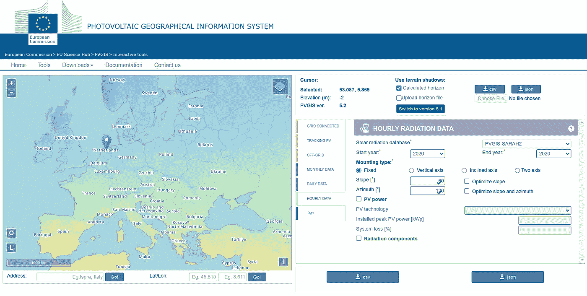

PVGIS 接口，图片由作者生成

使用这个页面，我们可以下载太阳辐射数据，从而计算能量生成。正如截图所示，我们可以选择不同年份和不同地点的小时数据。下载数据后，让我们在 Pandas 中使用它。

## Pandas 中的 EDA

让我们从 Pandas 中的探索性数据分析（EDA）开始。使用熟悉的工具总是更容易，这也能让我们验证结果。首先，让我们加载数据集：

```py
import pandas as pd
import datetime

df_eu = pd.read_csv("EUTimeseries_53.087_5.859_SA2_60deg_120deg_2020_2020.csv", 
                    skiprows=8).dropna()
display(df_eu)
```

代码不言自明。CSV 文件的开头有评论和空行，因此我使用了“skiprows=8”来跳过不需要的数据；这就是读取文件所需的唯一“调整”。

输出如下：

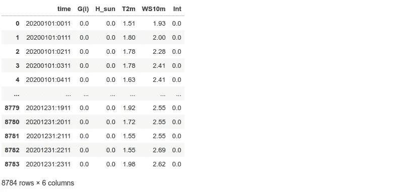

太阳辐射数据集，图片由作者提供

我们有 8784 行，代表每小时收集的数据。根据[文档](https://joint-research-centre.ec.europa.eu/photovoltaic-geographical-information-system-pvgis/pvgis-tools/hourly-radiation_en)，“G(i)”是以瓦特/平方米为单位的太阳辐射；其他参数，如风速或温度，对我们的任务没有用。时间戳不是标准的，让我们将字符串值转换为日期和时间对象。我还需要将“G(i)”值从*字符串*转换为*浮点数*：

```py
def str_to_date(d: str):
    """ Convert string to datetime object """
    try:
        return datetime.datetime.strptime(d, '%Y%m%d:%H%M')
    except:
        return None

def str_to_float(f: str):
    """ Convert string value to float """
    try:
        return float(f)
    except:
        return None

df_eu['time'] = df_eu['time'].map(str_to_date)
df_eu['G(i)'] = df_eu['G(i)'].map(str_to_float)
```

现在我们可以进行所需的计算。数据集包含以瓦特每平方米为单位的太阳辐射数据。数据是以每小时间隔收集的，我们只需将值除以 1000 就能将瓦特转换为千瓦时（kWh）。为了得到最终的千瓦时输出，我们还需要知道太阳能板的数量及每个面板的尺寸和效率（这些数据可以在太阳能板的数据表中找到）：

```py
panels_amount = 1
panel_size_m2 = 2.5
panel_efficiency = 0.18

df_eu["kWh"] = panels_amount * panel_size_m2 * panel_efficiency * df_eu['G(i)'] / 1000
```

现在我们可以进行一些数据探索。让我们找出**每天的太阳能发电量**，例如，夏天的六月一号。我将使用 Bokeh Python 库来绘制结果：

```py
from bokeh.io import show, output_notebook
from bokeh.models import ColumnDataSource
from bokeh.plotting import figure
output_notebook()

df_day = df_eu[df_eu['time'].dt.date == datetime.date(2020, 6, 1)]

source = ColumnDataSource(df_day)
p = figure(width=1600, height=600, x_axis_type='datetime',
           title="Solar Panels Generation Per Day, kWh")
p.vbar(x='time', top='kWh', width=datetime.timedelta(minutes=50), source=source)
p.xgrid.grid_line_color = None
p.xaxis.ticker.desired_num_ticks = 12
p.y_range.start = 0
p.y_range.end = 0.4
show(p)
```

输出如下：

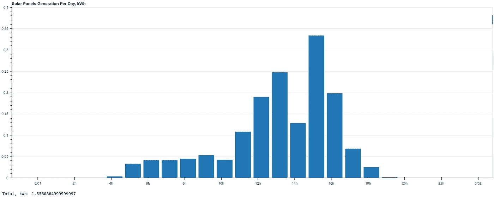

六月的每日太阳能板发电量，图片由作者提供

计算**总发电量**也很简单：

```py
print("Total, kWh:", df_day["kWh"].sum())

> Total, kWh: 1.5560864999999997
```

我们的太阳能板在六月每天产生了 1.56 千瓦时。相比之下，同一面板在十二月的发电量要低得多：

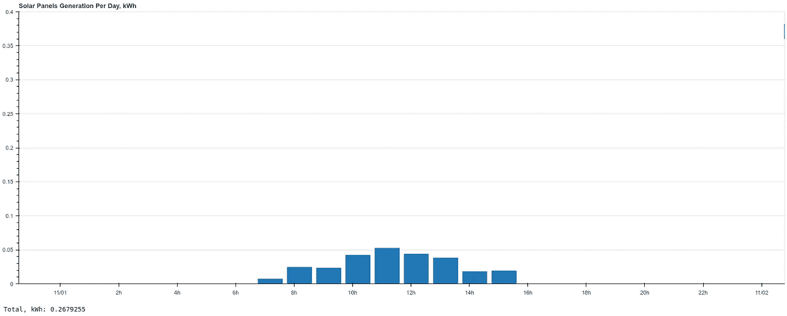

十二月的每日太阳能板发电量，图片由作者提供

让我们查看**每年的发电量**并计算总输出。为此，我将按月对数据框进行分组：

```py
df_eu["month"] = df_eu["time"].dt.month
df_eu_month = df_eu[["month", "kWh"]].groupby(["month"], as_index=False).sum()
display(df_eu_month.style.hide(axis="index"))
```

输出如下：

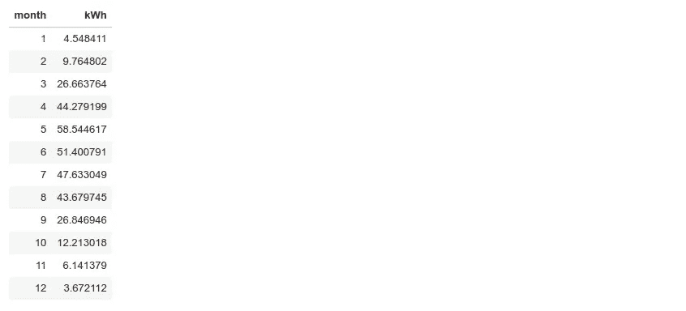

按月分组的太阳能板发电量，图片由作者提供

作为最后一步，让我们查看图表：

```py
source = ColumnDataSource(data=dict(months=df_eu_month["month"], 
                                    values=df_eu_month["kWh"]))
p = figure(width=1600, height=600, 
           title="Solar Panels Generation Per Year, kWh")
p.vbar(x='months', top='values', width=0.95, source=source)
p.xgrid.grid_line_color = None
p.xaxis.ticker.desired_num_ticks = 12
show(p) 
```

输出：

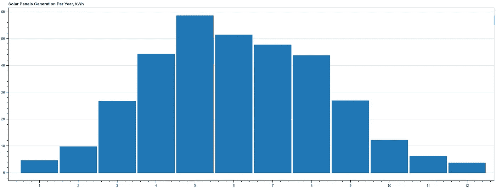

每年太阳能板发电量，图片由作者提供

正如我们所见，冬季和夏季月份之间存在显著差异。

最后，让我们计算**全年总电力生成量**：

```py
print("Total, kWh:", df_eu["kWh"].sum())

> Total, kWh: 335.38783499999994
```

我们的 2.5 平方米太阳能板总共产生了 335 千瓦时电力。

现在，让我们完成 Python 编码，看看如何在 Google Sheets 中实现相同的操作。

## Google Sheets

一般来说，我们的数据处理流程将与在 Pandas 中的处理方式相同。我们需要加载数据集，转换列值，过滤和分组值以查看结果。实际上，当我们知道自己*想做什么*时，我们可以以“跨平台”的方式思考，这使得处理变得更加容易。

首先，让我们加载数据集。我在 Google Sheets 中创建了一个包含两个标签页的文档，“Source”和“Calculation”，并将 CSV 文件导入了“Source”标签页：

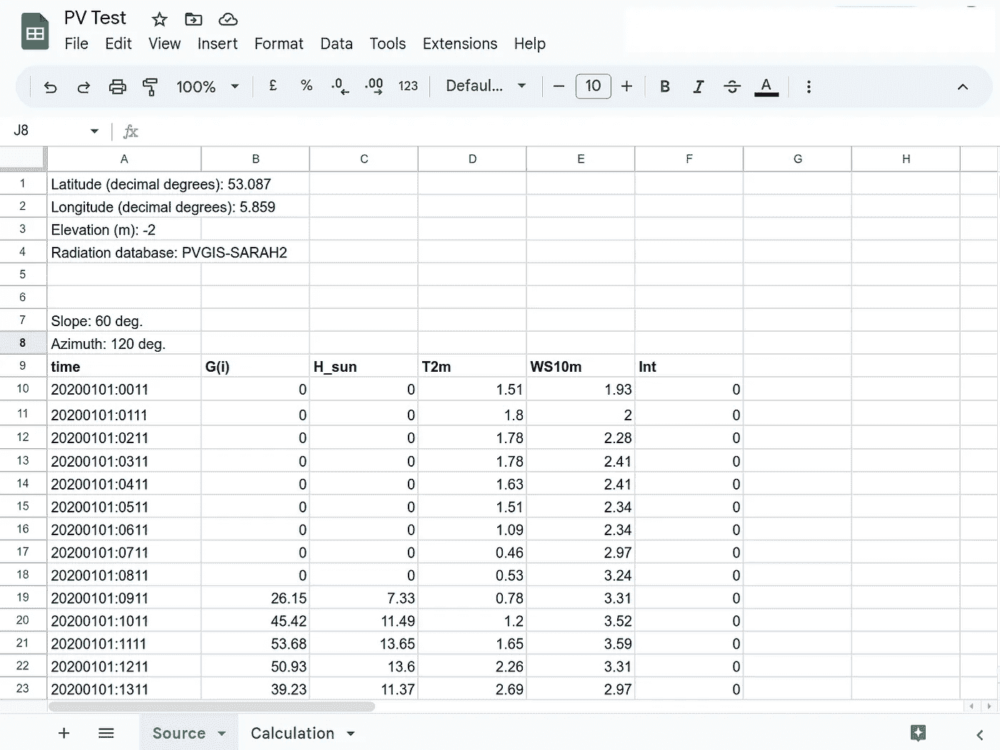

Google Sheets 中的数据集，图像由作者提供

现在我们需要按月份对值进行分组。让我们**提取月份值**从时间戳列。在 Pandas 中，我们是这样做的：

```py
df_eu["time"] = df_eu['time'].map(str_to_date)
df_eu["month"] = df_eu["time"].dt.month
```

在 Google Sheets 中，我在 G10 单元格中添加了这个公式：

```py
=ArrayFormula(MID(A10:A8793, 5, 2))
```

在这里，G10 是第一个单元格，结果将位于此处，A10:A8793 是我们的时间戳数据。“MID”函数从字符串中提取月份（“20200101:0011” 是非标准时间戳，使用子字符串更容易），而“ArrayFormula”方法会将这个函数自动应用到整个表格中。输入公式后，Google Sheets 会自动为我们创建一个新列。

同样，让我们从“G(i)”创建一个“kWh”列。在 Pandas 中，我们是这样做的：

```py
df_eu["kWh"] = df_eu['G(i)'] / 1000
```

在 Google Sheets 中，它的工作方式几乎相同。我在 H10 单元格中添加了这个公式：

```py
=ArrayFormula(B10:B8793/1000)
```

作为最后的预处理步骤，让我们将*“Month”*和“*kWh”*的名称输入为标题。结果应该是这样的：

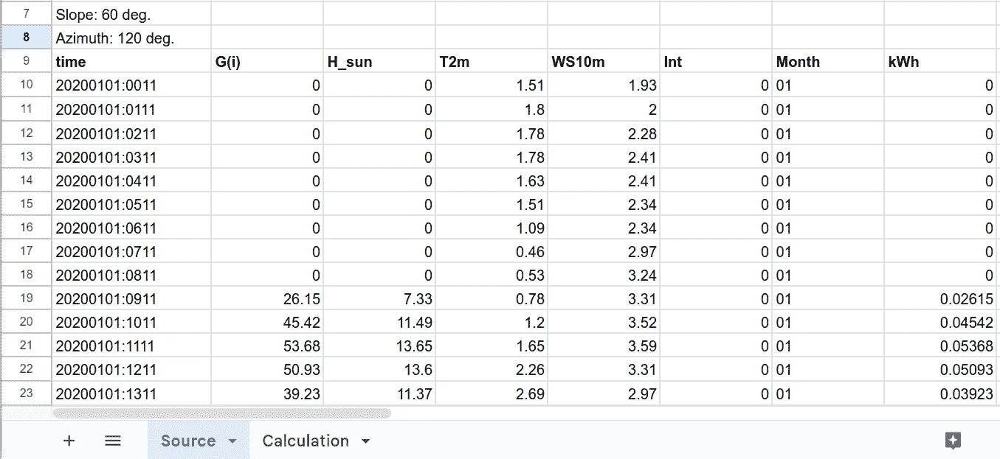

在 Google Sheets 中添加的列，图像由作者提供

我们有一个“月份”列，现在我们可以**按月份分组数据**。在 Pandas 中称为“groupby”的操作，在 Google Sheets 中可以使用“数据透视表”来完成。让我们创建一个新的数据透视表，并将“Source!A9:H8793”作为数据源。在这里，“Source”是第一个标签页的名称，A9:H8793 是我们的数据。表格编辑器将自动检测列名，我们可以选择“Month”作为“行”并将“kWh”作为“值”：

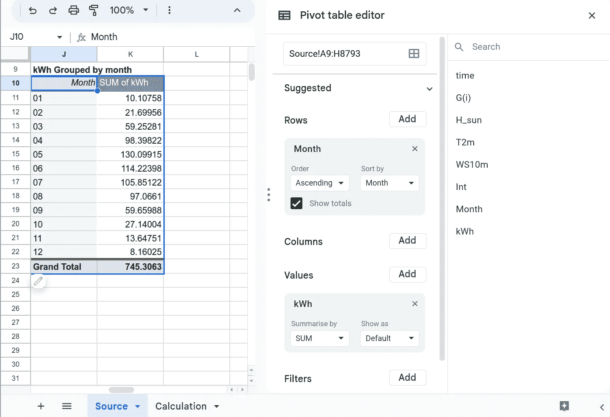

按月份分组的 kWh 值，图像由作者提供

结果显示在截图中。实际上，它与我们在 Pandas 中做的非常接近：

```py
df_eu_month = df_eu[["month", "kWh"]].groupby(["month"], as_index=False).sum()
```

我们的数据集已经准备好了；让我们进行所需的计算。在“Calculation”标签页中，我将使用前面三个单元格作为太阳能电池板的“变量”（B1 单元格），每个面板的尺寸（B2 单元格）和面板效率（B3 单元格）。然后我可以通过添加一个公式来计算总生成量：

```py
=ArrayFormula(B1*B2*B3*Source!K11:K22)
```

“Source!” 是我们第一个包含数据源的标签页的链接，K11–K22 是按月份分组的数据所在的单元格。我们的新结果将放在 B7–B18 单元格中，我们还可以计算**总生成量**：

```py
=SUM(B7:B18)
```

添加额外的标签和图表很容易；这不需要任何公式，我将在这里跳过这一部分。我们最终按月份分组的生成数据应该是这样的：

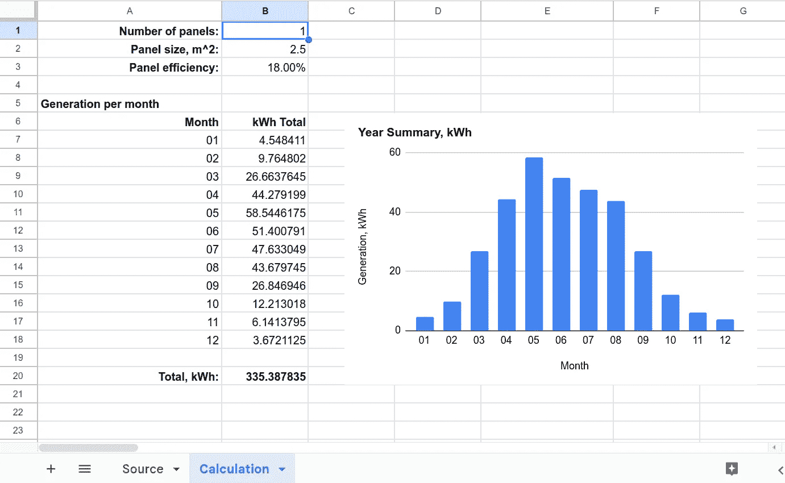

太阳能电池板每年的发电量，作者提供的图片

显然，结果必须与我们在 Pandas 中得到的结果相同；否则，就有问题。Google Sheets 的用户界面是互动的；我们可以更改太阳能电池板的数量或面板效率，Google Sheets 将自动重新计算所有结果。

我们最后的数据探索步骤是获取**特定日期的电力生成**。为此，我将把所需日期放入“A24”单元格，并使用两个单元格来显示结果。第一个单元格将包含时间，第二个单元格将包含能量值：

```py
=FILTER(MID(Source!A10:A8793, 10, 4), SEARCH(A24, Source!A10:A8793))

=FILTER(B1*B2*B3*Source!H10:H8793, SEARCH(A24, Source!A10:A8793))
```

在这里，*SEARCH(A24, Source!A10:A8793)*是应用于源表的过滤器；第一个公式用于获取一天中的时间，第二个公式用于计算 kWh 的能量。可以选择添加标签和摘要。最终页面可能如下所示：

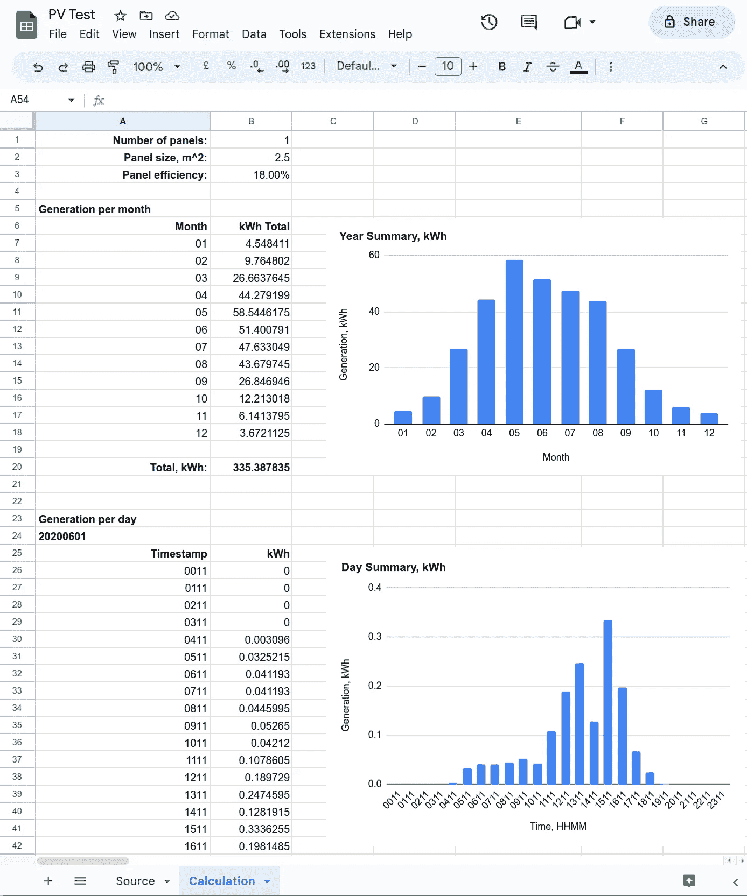

## 结论

在这篇文章中，我们在 Google Sheets 中导入了太阳能发电数据集，并能够计算和可视化不同的参数，如每月或特定日期的太阳能电池板发电量。这个表格是互动的，任何没有技术或编程技能的人都可以使用。最后但同样重要的是，这个解决方案没有成本，文档可以安全地与任何拥有 Google 账户的人分享。

显然，社区里对“Excel 中的数据科学”有很多玩笑，我并不鼓励任何人将 Google Sheets 作为主要的生产工具。但对于需要与他人共享结果或制作简单数据处理界面的简单场景，它可以是一个不错的补充。正如我们所见，基本操作如制作图表、数据分组或提取子字符串效果良好。

感谢阅读。如果你喜欢这个故事，欢迎[订阅](https://medium.com/@dmitryelj/membership)Medium，你将收到我新文章发布的通知，并且可以完全访问其他作者的成千上万的故事。
