# 探索性数据分析：我们对 YouTube 频道了解多少（第一部分）

> 原文：[`towardsdatascience.com/exploratory-data-analysis-what-do-we-know-about-youtube-channels-3688c5cbc438`](https://towardsdatascience.com/exploratory-data-analysis-what-do-we-know-about-youtube-channels-3688c5cbc438)

## 使用 Pandas 和 YouTube 数据 API 获取统计见解

[](https://dmitryelj.medium.com/?source=post_page-----3688c5cbc438--------------------------------)[](https://towardsdatascience.com/?source=post_page-----3688c5cbc438--------------------------------) [Dmitrii Eliuseev](https://dmitryelj.medium.com/?source=post_page-----3688c5cbc438--------------------------------)

·发表于[Towards Data Science](https://towardsdatascience.com/?source=post_page-----3688c5cbc438--------------------------------) ·20 分钟阅读·2023 年 10 月 28 日

--


照片由 Glenn Carstens-Peters 拍摄，[Unsplash](https://unsplash.com/photos/turned-on-flat-screen-television-EOQhsfFBhRk)

如今，活跃的 YouTube 用户超过 27 亿，对于很多人来说，YouTube 不仅仅是娱乐，更是重要的收入来源。但它是如何运作的呢？不同的 YouTube 频道可以获得多少观看次数或订阅者？借助 Python、Pandas 和 YouTube 数据 API，我们可以获得一些有趣的见解。

## 方法论

本文将分为几个部分：

+   使用 YouTube 数据 API。通过这个 API，我们将能够获取不同搜索请求的 YouTube 频道列表。对于每个频道，我们将获得有关视频数量、观看次数和订阅者的信息。

+   获取我们感兴趣的频道列表。这只能完成一次。

+   收集频道数据。为了获得统计见解，我们需要在一段时间内收集数据。

+   数据分析。

不再赘述，让我们开始吧。

## 1\. YouTube 数据 API

首先，对于所有对从大型网络如 YouTube 收集数据感兴趣的人来说，有一个好消息：YouTube API 是免费的，我们无需支付费用。要开始使用这个 API，我们需要两个步骤：

+   打开[`console.cloud.google.com`](https://console.cloud.google.com/)并创建一个新项目。我之前在那里有一个旧项目，但在一段时间不活动后，它的所有 API 限制都被重置为零，我找不到重置的方法。因此，创建一个新项目更为简单。


Google Cloud Console，图片由作者提供

+   前往“API 和服务”并启用“YouTube 数据 API”。打开 API，进入“凭据”并创建一个 API 密钥。如果一切设置正确，配额页面将如下所示：

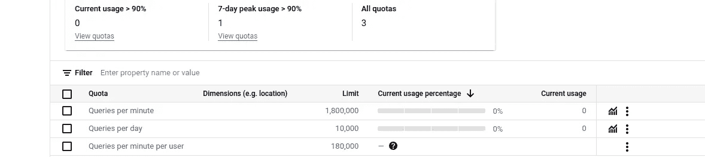

YouTube API 配额，作者提供的图片

就这样；之后，我们可以开始发起 API 请求以获取 YouTube 数据。至于限制，免费配额为每天 10,000 次查询。计算这个配额有点复杂，因为它基于“内部”YouTube 查询，而不仅仅是 API 调用的数量。搜索请求是“重”的，例如，获取关于“智能手机评测”这一短语的 500 个频道的列表将消耗约 7,000 个“单位”。因此，我们每天只能用一个 API 密钥进行一次这样的搜索。但免费层允许我们拥有**12 个项目**，每个项目有单独的配额。所以任务比较简单，但我们仍需要将请求数量合理限制在一定范围内。

数据收集管道将包括两种类型的 API 调用：

+   首先，我们将创建一个关于不同主题的 YouTube 频道列表。这只需要做一次。

+   其次，我们可以获取每个频道的观看次数和订阅者数。我将使用 Apache Airflow 来运行这个任务，至少运行一周，每天两次。

## **2\. 获取 YouTube 频道**

在第一步中，我们启用了 YouTube API。现在，让我们创建一个我们感兴趣的频道列表。为了进行搜索，我将使用 [python-youtube](https://github.com/sns-sdks/python-youtube) 库的 `search_by_keywords` 方法。作为示例，查询“猫”的输出如下所示：

```py
{
  "kind": "youtube#searchListResponse",
  "etag": "h_RGyvb98m0yrxBgG0Q21J0ch94",
  "nextPageToken": "CAIQAA",
  "regionCode": "UK",
  "pageInfo": {
    "totalResults": 19544,
    "resultsPerPage": 10
  },
  "items": [
    {
      "kind": "youtube#searchResult",
      "etag": "N6_OLAdw4hCq2.....",
      "id": {
        "kind": "youtube#channel",
        "channelId": "UCoV0b7wU....."
      },
      "snippet": {
        "publishedAt": "2016-11-07T04:54:33Z",
        "channelId": "UCoV0b7....",
        "title": "1 stoner 3 cats",
        "description": "MUST BE 18 OR OLDER FOR THIS CHANNEL...",
        "thumbnails": {
          "default": {
            "url": "https://yt3.ggpht.com/ytc/APkrFKZKfv..."
          },
          "medium": {
            "url": "https://yt3.ggpht.com/ytc/APkrFKZKfv..."
          },
          "high": {
            "url": "https://yt3.ggpht.com/ytc/APkrFKZKfvuGIwwg..."
          }
        },
        "channelTitle": "1 stoner 3 cats",
        "liveBroadcastContent": "upcoming",
        "publishTime": "2016-11-07T04:54:33Z"
      }
    },
    ...
  ],
  "prevPageToken": null
}
```

在这里，我们关注 `title`、`channelId` 和 `publishedAt` 参数。我们还可以看到 `totalResults` 值，这个值等于 19544。不过，遗憾的是，YouTube API 是为终端用户而设计的，而不是为了分析。我们不能获取*所有*关于“猫”的 YouTube 频道；这个 API 仅返回由 YouTube 推荐系统生成的 400-500 个频道的列表。

我们可以使用一个简单的程序，该程序针对特定短语进行 YouTube 查询并将结果保存到 CSV 文件中：

```py
import datetime
import logging
from pyyoutube import Api  # pip3 install python-youtube

def save_log(log_filename: str, s_data: str):
    """ Save string to the log file """
    with open(log_filename, "a", encoding="utf-8") as log_out:
        log_out.write(s_data + "\n")

def search_by_keywords(api: Api, search_str: str, page_token: str):
    """ Get YouTube channels list for a search phrase """
    count = 10
    limit = 25000
    parts = ["snippet"]
    res = api.search_by_keywords(q=search_str, limit=limit, count=count,
                                region_code="UK",
                                relevance_language="en",
                                search_type="channel", 
                                order="title",
                                page_token=page_token, parts=parts,
                                return_json=True)
    return res

def get_channels(api: Api, search_str: str):
    """ Get YouTube channels list and save results in CSV file """
    time_str = datetime.datetime.now().strftime('%Y-%m-%d-%H-%M-%S')
    log_file = f"{search_str.replace(' ', '-')}-{time_str}.csv"
    logging.debug(f"Log file name: {log_file}")
    save_log(log_file, "channelId;publishedAt;title")

    res = search_by_keywords(api, search_str, page_token=None)
    next_page_token = res["nextPageToken"]
    num_items = 0
    while next_page_token is not None:
        for item in res['items']:
            title = item['snippet']['title'].replace(";", " ").replace("  ", " ")
            description = item['snippet']['description'].replace(";", " ").replace("  ", " ")
            log_str = f"{item['id']['channelId']};{item['snippet']['publishedAt']};{title} {description}"
            logging.debug(log_str)
            save_log(log_file, log_str)

            num_items += 1

        next_page_token = res["nextPageToken"]
        logging.debug(f"{num_items} items saved to {log_file}")

        res = search_by_keywords(api, search_str, page_token=next_page_token)
        next_page_token = res["nextPageToken"]

if __name__ == "__main__":
    logging.basicConfig(level=logging.DEBUG,
                        format='[%(asctime)-15s] %(message)s')

    key1 = "XXXXX"   
    youtube_api = Api(api_key=key1)
    get_channels(youtube_api, search_str="cats")
```

作为输出，我们将获得如下所示的 CSV 文件：

```py
channelId;publishedAt;title
UCoV0b7wUJ2...;2016-11-07T04:54:33Z;1 stoner 3 cats MUST BE ...
UCbm5zxzNPh...;2013-08-07T12:34:48Z;10 Cats ...
UCWflB-GzVa...;2013-09-25T10:39:41Z;13 Cats - Topic ...
UCiNQyjPsO9-c2C7eOGZhYXg;2023-10-09T22:51:37Z;2 CATS NO RULES ...
```

现在，我们可以使用不同的查询进行搜索。这只能做一次；频道 ID 不会改变。为了本文的目的，我使用了这些查询：

+   “猫”

+   “Dogs”

+   “化妆教程”

+   “摄影”

+   “智能手机评测”

+   “街头摄影”

结果是，我在 CSV 文件中保存了一个频道列表（每个查询大约 500 条记录），总共有大约 3000 个 YouTube 频道。

## **3\. 获取频道详细信息**

下一步，我们需要获取每个频道的统计数据。为此，我将使用相同 [python-youtube](https://github.com/sns-sdks/python-youtube) 库中的 `get_channel_info` 方法：

```py
def get_channel_info(api: Any,
                     file_out: str,
                     channel_id: str,
                     channel_title: str) -> int:
    """ Get YouTube channel statistics """
    res = api.get_channel_info(channel_id=channel_id, parts=["statistics"], return_json=True)
    n_count = 0
    if "items" in res:
        time_str = datetime.datetime.now().strftime('%Y-%m-%d-%H-%M-%S')
        for item in res["items"]:
            ch_id = item["id"]
            statistics = item["statistics"]
            views = statistics["viewCount"]
            subscribers = statistics["subscriberCount"]
            videos = statistics["videoCount"]
            s_out = f"{time_str};{ch_id};{channel_title};{views};{subscribers};{videos}"
            logging.debug(f"Saving: {s_out}")
            save_log(file_out, s_out)
            n_count += 1
    return n_count
```

可以这样使用这种方法：

```py
api = Api(api_key="...")
get_channel_info(api, "cats_09_24.csv",
                 channel_id="UCbm5zxzNPh...",
                 channel_title="CATS NO RULES Its a Cats Life")
```

作为输出，我们将获得一个包含所需值的 CSV 文件：

```py
timestamp;channelId;title;views;subscribers;videos
2023-10-09-19-42-19;UCoV0b7wUJ2...;1 stoner 3 cats MUST BE ...;14;2;6
2023-10-09-19-42-19;UCbm5zxzNPh...;CATS NO RULES Its a Cats Life;24;5;3
```

**数据收集** 现在，我们知道如何获取 YouTube 频道列表以及如何获取频道详细信息，例如观看次数和订阅者数量。但查看这些值的*动态*和它们如何随时间变化是很有趣的。YouTube 有一个单独的[Analytics API](https://developers.google.com/youtube/analytics/channel_reports)，可以用于报告。然而，正如 API 文档中所写，“授权请求的用户必须是频道的拥有者”，因此对我们的任务来说是无用的。我们唯一的方法是收集一段时间的数据；1-2 周看起来是一个很好的时间段。

数据收集可以通过不同方式进行，我决定使用**Apache Airflow**，并在我的树莓派上安装了它。事实证明，树莓派是一个出色的数据科学工具，用于数据收集，我已经在几个爱好项目中使用过它。这台$50 的单板计算机仅消耗 2W 功率，静音，没有风扇，并且在 4 核 CPU 上运行完整的 Ubuntu。Raspbian OS 的配置细节超出了本文的范围；有兴趣的读者可以阅读我之前的 TDS 文章：

[](/collecting-data-with-apache-airflow-on-a-raspberry-pi-0ac3f72e377f?source=post_page-----3688c5cbc438--------------------------------) ## 在树莓派上使用 Apache Airflow 进行数据收集

### 一台树莓派就是你所需要的一切

towardsdatascience.com

## 4\. 探索性数据分析

**预处理**

最后，我们即将进入本文的有趣部分：让我们看看从收集的数据中可以获得什么样的见解。我将使用 Pandas 进行数据处理，使用 Matplotlib 和 Seaborn 绘制图表。

首先，让我们加载之前收集的数据。文件可以使用`scp`命令从树莓派中复制（这里，*10.14.24.168*是设备地址，“pi”是标准的 Raspbian 用户名）：

```py
scp pi@10.14.24.168:/home/pi/airflow/data/*.csv data
```

Apache Airflow 每天执行代码两次，每次运行后保存一个带时间戳的 CSV 文件。一周后，我得到了一堆大约 80K 记录的 CSV 文件。让我们加载所有文件，并将它们合并到 Pandas 数据框中：

```py
import glob
import pandas as pd
import seaborn as sns
import matplotlib.pyplot as plt
import matplotlib.dates as mdates

channel_files = glob.glob("data/channel*.csv")
channels_data = []
for file_in in channel_files:
    channels_data.append(pd.read_csv(file_in, delimiter=';',
                                     parse_dates=['timestamp'],
                                     date_format="%Y-%m-%d-%H-%M-%S"))

df_channels = pd.concat(channels_data)
```

结果如下所示：

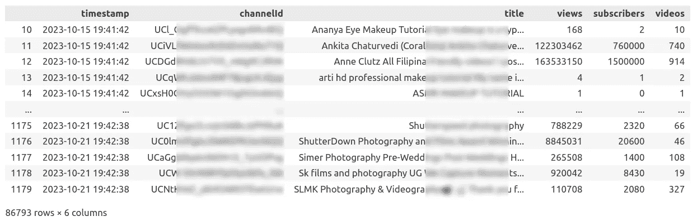

带有时间序列数据的数据框，图片由作者提供

作为提醒，在文章开头，我还收集了用于不同搜索请求的**频道列表**（“智能手机”、“猫”、“狗”等）。让我们将这个列表加载到第二个数据框中：

```py
def load_channels(files: List, subject: str) -> pd.DataFrame:
    """ Load and combine dataframe from several files """
    dataframes = []
    for csv in files:
        df = pd.read_csv(csv, delimiter=";", parse_dates=["publishedAt"])
        df["subject"] = subject
        dataframes.append(df)
    return pd.concat(dataframes).drop_duplicates(subset=["channelId"])

smartphones = load_channels(["smartphone-channels.csv"], subject="Smartphones")
dogs = load_channels(["dogs-channels.csv"], subject="Dogs")
cats = load_channels(["cats-channels.csv"], subject="Cats")
...

channels_all = pd.concat([smartphones, makeup, photography,
                          streetphotography, cats,
                          dogs]).drop_duplicates(subset=["channelId"])
```

加载频道列表可以实现自动化，但我只有 6 个类别，所以直接硬编码它们非常简单。我还添加了一个“subject”列来保存类别名称（重要的是要提到，“subject”不是由频道拥有者给出的“官方”频道类别，而是在搜索请求中使用的名称）。

此时，我们有两个 Pandas 数据框：一个包含基本频道数据（ID、标题和创建日期），另一个包含时间序列数据，包括观看次数、视频数量和订阅者数。让我们将这两个数据框 **合并** 在一起，以 `channelId` 作为键：

```py
df_channels = df_channels.merge(
                  channels_all[["channelId", "publishedAt", "subject"]],
                  on=['channelId'],
                  how='left') 
```

现在，我们准备开始有趣的部分了！让我们用 Seaborn 和 Matplotlib 可视化不同类型的数据。

**4.1 观看次数和订阅者数量** 作为热身，让我们按观看次数排序 YouTube 频道：

```py
df_channels_ = df_channels.drop_duplicates(subset=["channelId"]).sort_values(by=['views'], ascending=False).copy()
df_channels_["views"]  = df_channels_["views"].apply(lambda val: f"{val:,.0f}")
df_channels_["subscribers"]  = df_channels_["subscribers"].apply(lambda val: f"{val:,.0f}")
display(df_channels_)
```

结果如下：

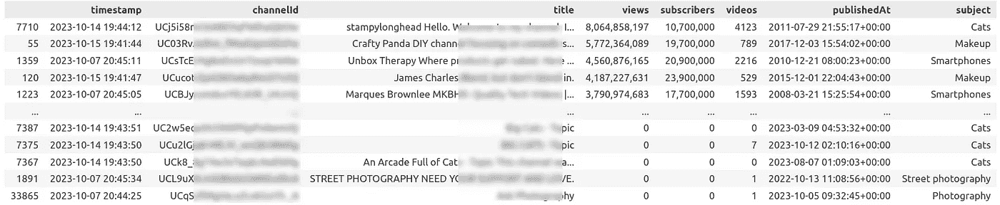

YouTube 频道，按观看次数排序，作者提供的图片

我们可以看到数值之间的差异非常大。列表中的顶级频道拥有数十亿的观看次数和数百万的订阅者。实际的数字大到我不得不在列中添加了上千个“,”分隔符！

题外话，我为什么不使用 [Pandas Styler](https://pandas.pydata.org/docs/user_guide/style.html) 对象呢？确实，这样写代码很简单：

```py
display(df_channels_.style.format(thousands="."))
```

结果显示在小型数据框上效果很好。但至少在 Visual Studio Code 中，改变样式后，数据框不再显示为头、尾和“…”了，Visual Studio 总是显示所有 3030 行。如果有人知道解决方案，请在下面的评论中写出来。

看到数据框很不错，但图形形式会更清晰。让我们使用条形图绘制 **观看次数**：

```py
decimation = 10
df_channels__ = df_channels_.reset_index(drop=True).iloc[::decimation, :]

sns.set(rc={'figure.figsize': (18, 6)})
sns.set_style("whitegrid")
fig, ax = plt.subplots()
sns.barplot(df_channels__, x=df_channels__.index, y="views", width=0.9, ax=ax)
ax.set(title='YouTube channels views',
       xticks=range(0, df_channels__.shape[0], 50),
       ylim=(0, None),
       xlabel='Channel №',
       ylabel='Views Total')
ax.ticklabel_format(style='plain', axis="y")
ax.yaxis.set_major_formatter(FuncFormatter(lambda x, p: format(int(x), ',')))
sns.despine(left=True)
plt.show()
```

绘图很简单，但需要一些小调整。再次，我使用了 `FuncFormatter` 添加“,”千位分隔符；否则，数字太大，不便于阅读。我还添加了 `decimation=10` 参数来减少数据框中的记录数；否则，垂直条形图太小了。尽管如此，我们可以看到该区域几乎是空的：

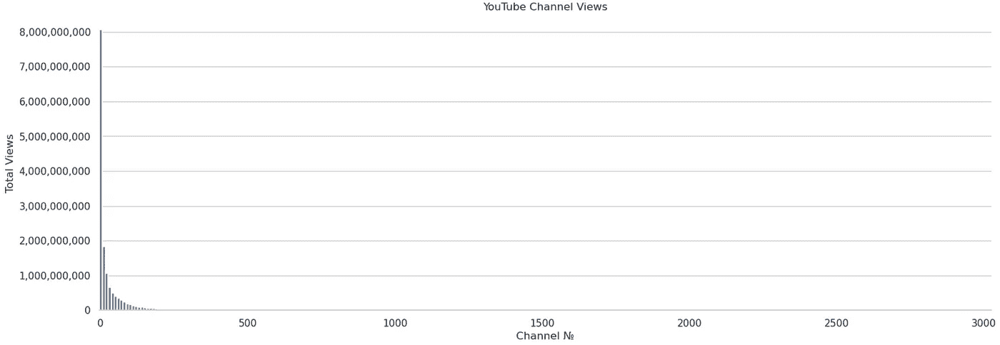

显然，通过使用 `ylim` 参数很容易调整纵坐标刻度，但我特意将其保留为这样，以便读者能够看到“顶级”频道与“其他”频道之间的真实差异。分布非常偏斜。几个顶级频道的观看次数达到数十亿，而与之相比，其他频道几乎不可见。在我列出的约 3000 个频道中，前 5%的频道拥有 95%的总观看次数。

我们还可以绘制 **订阅者数量**，其形状与之前的图表相同：

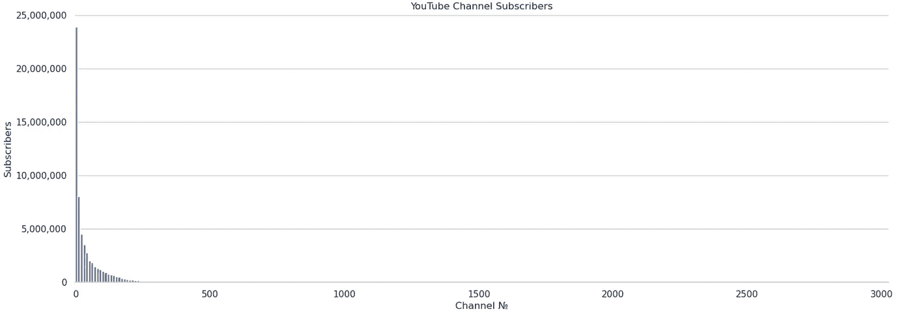

让我们使用 **百分位数** 获取更准确的数据：

```py
display(df_channels_[["views", "subscribers"]].quantile(
    [0.01, 0.05, 0.25, 0.5, 0.75, 0.95, 0.99]
).style.format("{:,.0f}"))
```

输出看起来是这样的：


四分位数数据，作者提供的图片

50 百分位数（或 0.5 分位数）是一个数字，显示了 50%的所有值低于该数字。例如，所有订阅者值的 50 百分位数仅为 16。这意味着尽管顶端的数字如同 Googleplex 一般，列表中 50%的频道订阅者数少于 16！这可能令人惊讶，但我们可以通过按订阅者数量对数据框进行排序并查看中间值来轻松验证这一点：

```py
df_channels_ = df_channels.drop_duplicates(subset=["channelId"]).sort_values(by=['subscribers'], ascending=False).reset_index(drop=True)
display(df_channels_[df_channels_.shape[0]//2:])
```

结果确认了上表的正确性：

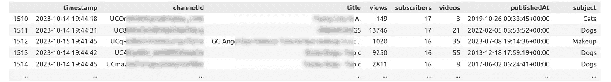

数据框的中间部分，作者提供的图片

所有这些数值可以让我们对预期的观看次数和订阅者数量有一个大致的了解。但是在这里，我只分析了我收集的 3030 个频道。我们能得到一个*YouTube 频道总数*，比如说，1 百万和 10 万订阅者的频道总数吗？我没有找到答案，这可能是 YouTube 的秘密，就像 Tinder 上男女用户的真实比例一样；）显然，YouTube 推荐系统有一个将“顶级”频道和“其他”频道混合在搜索结果中的算法，给新手提供了被观众看到的机会。

**4.2 每注册日期的订阅者数量** 了解某个 YouTube 频道是否有 1,000,000 次观看或订阅者很有趣，但频道主们多快能达到这个值呢？在 YouTube Data API 中，每个频道都有一个“[publishedAt](https://developers.google.com/youtube/v3/docs/channels)”参数，代表频道的创建日期。我们无法获取特定频道的历史数据，但我们可以通过**散点图**比较不同创建日期的频道。我还将用不同颜色区分不同类别，并添加平均线。

```py
upper_limit = 1_000_000

df_channels_ = df_channels.drop_duplicates(subset=["channelId"]).copy()
df_channels_["subscribers_clipped"] = df_channels["subscribers"].clip(upper=upper_limit)

sns.set(rc={'figure.figsize': (18, 8)})
sns.set_style("white")
palette = sns.color_palette("bright")

fig, ax = plt.subplots()
# Add scatter plot and average lines
for ind, subj_str in enumerate(df_channels_["subject"].unique()):
    df_subj = df_channels_[df_channels_["subject"] == subj_str]
    # Draw scatter plot
    markers = ["o" , "s" , "p" , "h"]
    sns.scatterplot(data=df_subj, x="publishedAt", y="subscribers_clipped",
                    color=palette[ind],
                    marker=markers[ind % len(markers)],
                    label=subj_str,
                    ax=ax)

    # Draw average
    col_avg = df_subj["subscribers"].mean()
    linestyles = ["--", ":", "-."]
    linestyle = linestyles[ind % len(linestyles)]
    ax.axhline(col_avg, color=palette[ind], label=subj_str + " Avg", linestyle=linestyle, linewidth=1.0, alpha=0.6)

ax.set(title='Channel Subscribers',
       xlabel='Registration Date',
       ylabel='Subscribers',
       ylim=(0, upper_limit)
       )
ax.ticklabel_format(style='plain', axis="y")
ax.xaxis.set_major_locator(mdates.MonthLocator(interval=12))
ax.xaxis.set_major_formatter(mdates.DateFormatter("%Y"))
ax.yaxis.set_major_formatter(FuncFormatter(lambda x, p: format(int(x), ',')))
ax.spines['top'].set_color('#EEEEEE')
ax.spines['right'].set_color('#EEEEEE')
ax.spines['bottom'].set_color('#888888')
ax.spines['left'].set_color('#888888')
plt.legend(loc='upper right')
plt.show()
```

相比于之前的柱状图，结果提供了更多的信息：

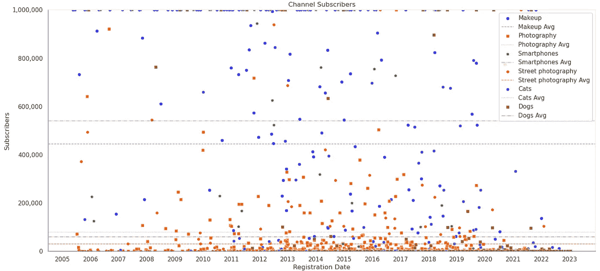

订阅者数量分布，作者提供的图片

100 万订阅者是许多 YouTube 频道的一个“标志性”数值，我将这个值设置为图表的裁剪限制。我们可以看到，我列表中“最年轻”的 YouTube 频道在 2022 年初达到了这一点，所以频道主们花了将近两年时间才做到这一点（此分析在 2023 年底进行）。与此同时，还有一些“老”频道，甚至在 2010 年之前创建的，今天仍然没有达到 10 万订阅者。

关于平均值，它们也很有趣。我们可以看到，订阅“智能手机”相关频道的人更多，第二大热门类别是“化妆”。让我们再“放大”一下图表：

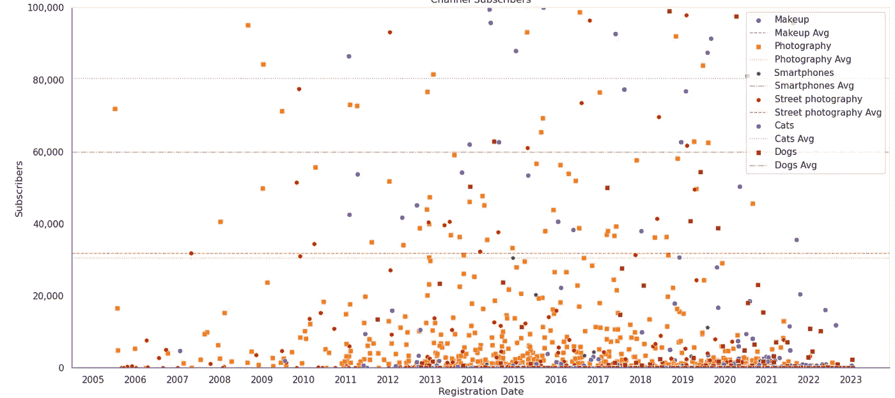

订阅者数量分布，作者提供的图片

在这里，我们可以看到，“猫”和“狗”类别的受欢迎程度平均要低得多（几乎低 10 倍）。“摄影”和“街头摄影”类别更加小众，即使获得 10 万订阅者对这些频道来说也可能是一个具有挑战性的目标。

**4.3 每个视频的订阅者数量** 这个问题对于那些想要开始自己 YouTube 频道的人可能很有趣。应该发布多少视频才能获得一定数量的观看或订阅者？我们知道每个频道的视频和订阅者数量，可以通过使用**一个**散点图来找到答案。我还会使用线性回归模型来绘制平均线：

```py
from sklearn.linear_model import LinearRegression
import numpy as np

df_channels_ = df_channels.drop_duplicates(subset=["channelId"]).copy()

upper_limit = 100_000
right_limit = 1000

sns.set(rc={'figure.figsize': (18, 8)})
sns.set_style("white")
num_subjects = df_channels_["subject"].nunique()
palette = sns.color_palette("bright")
fig, ax = plt.subplots()
for ind, subj_str in enumerate(df_channels_["subject"].unique()):
    # Filter by subject
    df_subj = df_channels_[df_channels_["subject"] == subj_str].sort_values(by=['subscribers'], ascending=False)
    # Draw scatter plot
    markers = ["o" , "s" , "p" , "h"]
    sns.scatterplot(data=df_subj, x="videos", y="subscribers",
                    color=palette[ind],
                    # palette=[palette[ind],
                    # hue="subject", 
                    marker=markers[ind % len(markers)],
                    label=subj_str,
                    ax=ax)

    # Make linear interpolation
    df_subj = df_subj[10:]   # Optional: remove top channels to exclude "outliers"
    values_x = df_subj["videos"].to_numpy().reshape((-1, 1))
    values_y = df_subj["subscribers"].to_numpy()
    model = LinearRegression().fit(values_x, values_y)
    x_val = np.array([0, right_limit])
    y_val = model.predict(x_val.reshape((-1, 1)))    
    # Draw
    linestyles = ["--", ":", "-."]
    ax.axline((x_val[0], y_val[0]), (x_val[1], y_val[1]),
              linestyle=linestyles[ind % 3], linewidth=1,
              color=palette[ind], alpha=0.5,
              label=subj_str + " Avg")

ax.set(title='YouTube Subscribers',
       xlabel='Videos In Channel',
       ylabel='Subscribers',
       xlim=(0, right_limit),
       ylim=(0, upper_limit)
       )
ax.yaxis.set_major_formatter(FuncFormatter(lambda x, p: format(int(x), ',')))
ax.spines['top'].set_color('#EEEEEE')
ax.spines['right'].set_color('#EEEEEE')
ax.spines['bottom'].set_color('#888888')
ax.spines['left'].set_color('#888888')
plt.legend(loc='upper right')
plt.show()
```

在这里，我将值限制为 100,000 个订阅者和 1,000 个视频。我还从线性插值中排除了前 10 个频道，以使平均结果更具现实性。

输出结果如下：

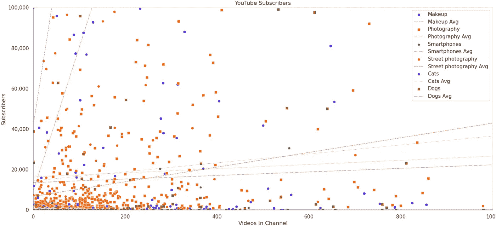

订阅者数量在 0–100K 范围内，图像由作者提供

我们再次看到，“化妆”和“智能手机”频道每个视频获得的订阅者最多。“猫”和“狗”的平均线几乎是水平的。这是怎么回事？首先，正如我们在前一张图片中看到的，这一类别的订阅者平均数量通常较低。其次，我猜测更多的人发布关于猫和狗的视频，分布更为倾斜。

那么分布的顶部怎么样？好吧，那里有足够的频道，订阅者超过 1M，视频少于 1000 个：

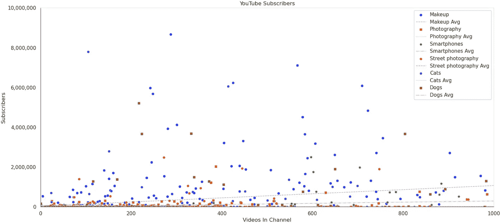

订阅者数量在 0–10M 范围内，图像由作者提供

我认为这些是配备高端电影设备的专业工作室，预算也相当高。那分布的低部分怎么样？让我们看看另一张图：

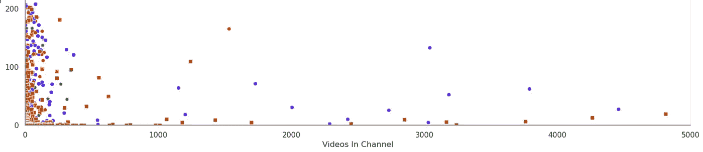

订阅者数量在最低范围内，图像由作者提供

我惊讶于看到一些 YouTube 频道有 1,000–5,000 个视频，但只有 10–50 个订阅者。结果是，这些频道很可能是由机器人自动生成的；它们只有播放列表，没有视频，大多数没有观看量，也没有订阅者。这些频道的目的是什么？我不知道。一些其他频道属于真实的人，看到有人发布了超过 1000 个视频，每个视频每年只有 10–20 次观看，这有点令人遗憾。

**4.4 频道动态 — 每日观看量** 正如我们所知，使用公开的 YouTube API，我们只能获得当前时刻的观看量和订阅者数量，只有频道所有者才能获得历史数据。作为替代方案，我使用 Raspberry Pi 和 Apache Airflow 收集了一周的数据。现在，是时候看看我们能得到什么了。

在这种情况下，处理起来有点棘手。我需要获取每个频道的数据，按时间戳排序，并计算差值：

```py
channels_data = []

channel_id = ...
df_channel_data = df_channels[df_channels["channelId"] == channel_id][["timestamp", "views", "subscribers", "videos"]].sort_values(by=['timestamp'], ascending=True).reset_index(drop=True).copy() 
df_first_row = df_channel_data.iloc[[0]].values[0]        
df_channel_data = df_channel_data.apply(lambda row: row - df_first_row, axis=1)
df_channel_data["channelId"] = channel_id
df_channel_data["days_diff"] = df_channel_data["timestamp"].map(lambda x: x.total_seconds()/(24*60*60), na_action=None)
df_channel_data[subj_str] = subj_str
channels_data.append(df_channel_data)
```

在这里，我使用`apply`方法计算数据框中第一个值和其他值之间的差异。然后，我可以使用`lineplot`绘制数据：

```py
sns.lineplot(data=pd.concat(channels_data),
             x="days_diff", y="views",
             hue="channelId", palette=palette, linestyle=linestyle,
             legend=False)
```

(完整代码更长，为了清晰起见，我只保留了必要部分)

如我们所知，分布是倾斜的。前 50 个频道的结果如下：

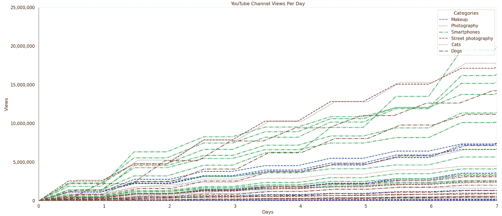

每周前 50 个频道观看次数，作者图片

如我们所见，顶级频道每天的观看次数可以超过几百万！

分布右侧情况如何？总的来说，我收集了 3030 个频道，这是右侧 1000 个频道的相同图表：

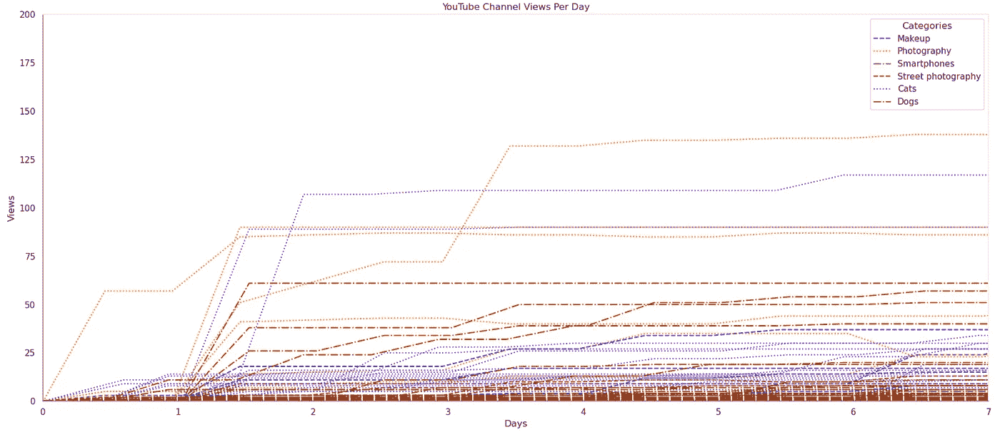

每周 1000 个 YouTube 频道观看次数，作者图片

这里的结果远不如预期。一些频道每周获得 50-100 次新观看，但大多数频道仅获得 10-20 次观看。YouTube 搜索限制在大约 500 个项目，但我可以猜测大多数 YouTube 用户从未滚动超过前 1-2 页。

**4.5 渠道动态 — 每日订阅者数** 让我们来看看订阅者数量的变化。代码是一样的，只不过我使用了“订阅者”列而不是“观看次数”。

结果很有趣。首先，让我们看看我列表中的前 50 个频道：

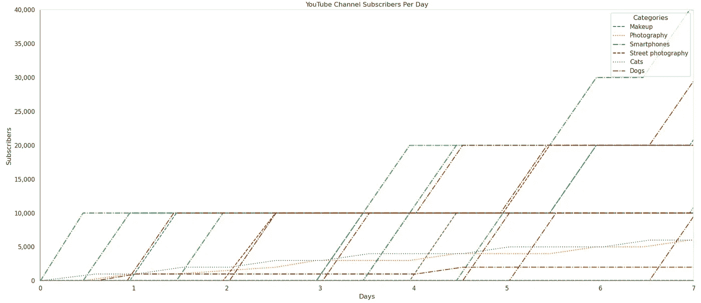

每周新频道订阅者，作者图片

如我们所见，顶级频道每天可以获得几千个新订阅者！在分布的右侧，结果再次不那么令人兴奋，但仍然很有趣：

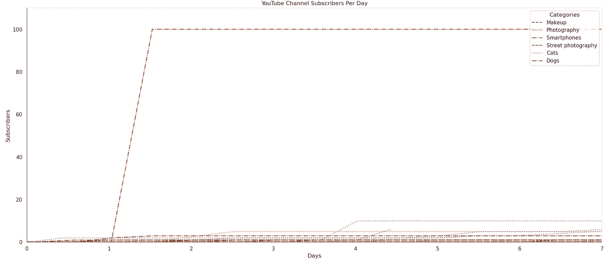

每周新频道订阅者，作者图片

其中一个频道“突然”每天获得 100 个订阅者，但这一数值没有再增加。也许频道主支付了推广费用，或者其中一个视频突然走红——谁知道呢？其他频道每周仅获得 5-10 个新订阅者。

**4.6 渠道动态 — 每日视频数** 了解不同频道每天发布多少视频也很有趣。我们可以使用相同的代码轻松找到答案。首先，让我们看看前 50 个频道的新视频数量：

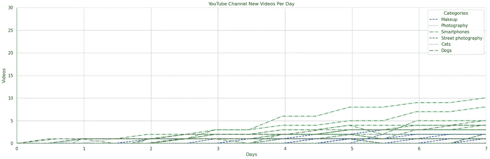

每日新视频，作者图片

这里是我列表右侧的 1000 个频道：

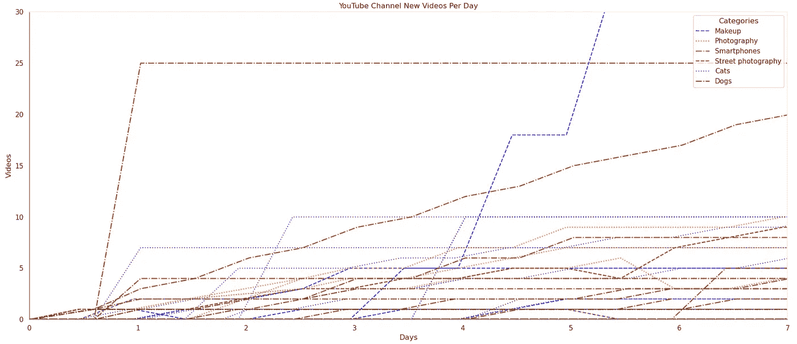

每日新视频，作者图片

有趣的是，数字并没有大幅度不同。但顶级频道显然发布的视频较少，他们显然更注重质量而非数量。他们每周只能制作一个视频，每个视频可能拥有超过 100 万的观看次数。然而，有些 YouTube 频道总共有超过 5000 个视频；他们每天发布几个视频。无论如何，这些频道都没有跻身前列，这很值得思考。

“意大利面图”可以展示我们一个大致趋势，但很难从中读取具体值。为了获得更精确的数据，我们可以为前 50 个频道绘制直方图：

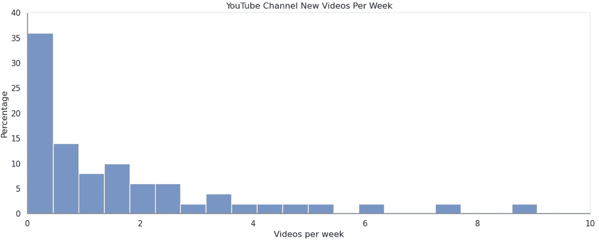

每周新视频，作者图片

我们可以看到，有些频道每天发布多个视频，但大多数顶级频道每周只制作一个或更少的视频。显然，没有一种适用于所有类型的通用公式，关于猫的视频或智能手机或相机评论的视频可能需要完全不同的准备时间。欢迎读者按不同类别过滤频道，并自行做更详细的分析。

## 5\. 奖励：异常检测

最后，对于耐心阅读到这里的读者，赠送一个小奖励。让我们应用异常检测算法，看看是否能找到一些不寻常的 YouTube 频道。我将使用无监督的[IsolationForest](https://scikit-learn.org/stable/auto_examples/ensemble/plot_isolation_forest.html)算法。该算法本身基于二叉决策树。在每一步，树通过随机特征和随机阈值进行分支，直到每个点完全孤立或达到最大深度。之后，根据达到该点所需的树深度，为每个点分配“异常分数”。

我将使用每个视频的观看次数和订阅者数量作为度量标准。我还将`contamination`值设置为 0.05；这是我们期望的异常比例。

```py
from sklearn.ensemble import IsolationForest

df_channels_ = df_channels.sort_values(by=['videos'], ascending=False).drop_duplicates(subset=["channelId"]).copy().reset_index(drop=True).copy()
df_channels_ = df_channels_[df_channels_["videos"] > 10]
df_channels_["subscribers_per_video"] = df_channels_["subscribers"]/df_channels_["videos"]
df_channels_["views_per_video"] = df_channels_["views"]/df_channels_["videos"]
df_channels_[["subscribers_per_video", "views_per_video"]] = df_channels_[["subscribers_per_video", "views_per_video"]].apply(pd.to_numeric)

X = df_channels_[["subscribers_per_video", "views_per_video"]]
model = IsolationForest(contamination=0.05, random_state=42).fit(X)
df_channels_['anomaly_scores'] = model.decision_function(X)
df_channels_['anomaly'] = model.predict(X)

# Anomaly: Outlier (-1) or an inlier (1)
# Anomaly_scores: The lower the score, the more abnormal is the sample
display(df_channels_.sort_values(by=['anomaly_scores'], ascending=True)[:30])
```

我们来按异常分数对频道进行排序。结果如下所示：

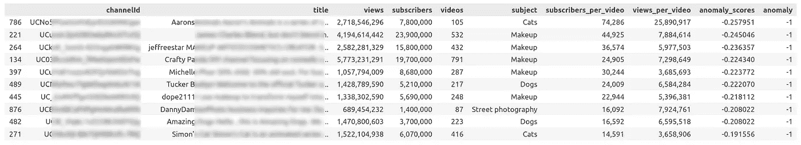

在我们“异常评分”的第一位，我们看到一个来自“猫”类别的频道，这个频道确实每个视频的订阅者数量很高。我看了这个频道；虽然我不是猫视频的粉丝，但从技术上讲它确实做得很好。这也是我第一次看到一个有 193M 观看次数的视频（我必须承认，没有哪个关于数学或机器学习的视频能达到这一点；）。在我的“评分”中的第二个频道是关于化妆的。我对这一领域绝对不是专家，本来打算跳过它，但其中一个视频引起了我的注意。作者请 ChatGPT 写化妆步骤。我从未考虑过使用 AI 来化妆，尽管看到 AI 如何影响我们生活的越来越多领域还是很有趣。

有时很容易猜测为什么某个项目具有高异常评分，但如果特征数量很大，这可能会变得复杂。在这种情况下，我们可以使用[**SHAP**](https://shap.readthedocs.io/en/latest/index.html)库来可视化结果：

```py
import shap

X = df_channels_[["subscribers_per_video", "views_per_video"]]
y_pred = model.predict(X)
explainer = shap.Explainer(model.predict, X)
shap_values = explainer(X)

shap.initjs()
```

`explainer`方法使用[Shapley 值](https://en.wikipedia.org/wiki/Shapley_value)来解释不同的机器学习模型，并且也可以与`IsolationForest`一起使用。初始化后，我们可以检查列表中的不同项目。让我们检查第一个：

```py
shap.plots.waterfall(shap_values[786])
```

结果如下所示：

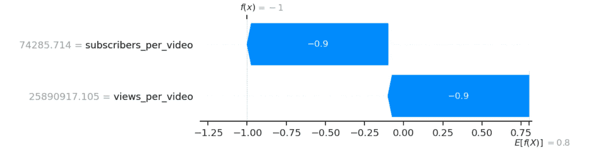

Shapley 解释器结果，作者提供的图片

在另一个例子中，`views_per_video`参数看起来正常，但`subscribers_per_video`值很高：

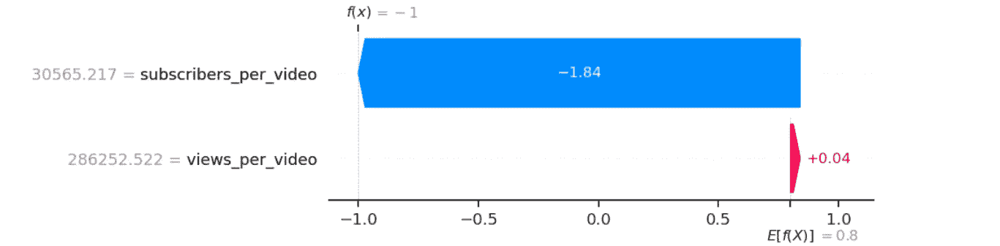

Shapley Explainer 结果，图片由作者提供

在这种情况下，我们可以看到两个指标都异常高。

## 结论

在本文中，我解释了如何使用 YouTube 数据 API 和 [python-youtube](https://github.com/sns-sdks/python-youtube) 库获取 YouTube 频道数据。这些数据允许我们对不同类别进行 YouTube 搜索请求，并获得有关 YouTube 频道的有趣统计见解。

我想每个读者今天或昨天至少看过一个 YouTube 视频。根据 [demandsage.com](https://www.demandsage.com/youtube-stats/)，YouTube 是仅次于 Google 的第二大搜索引擎，2023 年有 27 亿活跃用户。它是我们现代社会的一部分，也是日常生活的一部分。因此，从文化和研究的角度来看，了解哪些类别最受欢迎以及不同频道可以获得多少观看次数和订阅者是很有趣的。在本文中，我使用了像“猫”或“狗”这样的“中性”类别，但同样的方法可以用于收集关于政治、战争、医学、阴谋论或其他任何话题的数据。最后但同样重要的是，对许多内容创作者来说，YouTube 是一个重要的收入来源，了解不同类别能获得多少观看次数或订阅者可能至关重要。因此，我鼓励你作为读者，对你感兴趣的话题进行相同的测试。无论如何，统计学是一门 *关于我们的* 科学。

在故事的第二部分，我将重点关注单个视频。我们将查看不同 YouTube 频道发布视频的频率，以及这些视频能获得多少观看次数：

[](/exploratory-data-analysis-what-do-we-know-about-youtube-channels-part-2-754fab840e65?source=post_page-----3688c5cbc438--------------------------------) ## 探索性数据分析：我们对 YouTube 频道了解多少（第二部分）

### 使用 Pandas 和 YouTube 数据 API 获取统计见解

towardsdatascience.com

对社会数据分析感兴趣的人也欢迎阅读其他文章：

+   [德国住房租赁市场：使用 Python 进行探索性数据分析](https://medium.com/towards-data-science/housing-rental-market-in-germany-exploratory-data-analysis-with-python-3975428d07d2)

+   [人们对气候的看法：使用 Python 进行 Twitter 数据聚类分析](https://medium.com/towards-data-science/what-people-write-about-climate-twitter-data-clustering-in-python-2fbbd2b95906)

+   [在 Twitter 帖子中寻找时间模式：使用 Python 进行探索性数据分析](https://medium.com/towards-data-science/finding-temporal-patterns-in-twitter-posts-exploratory-data-analysis-with-python-8aac618c8699)

+   [Python 数据分析：我们对流行歌曲了解多少？](https://blog.devgenius.io/python-data-analysis-what-do-we-know-about-pop-songs-b6197d85d4)

如果你喜欢这个故事，欢迎[订阅](https://medium.com/@dmitryelj/membership)Medium，你将会在我的新文章发布时收到通知，并且可以全面访问其他作者的成千上万篇故事。如果你想获取这篇文章以及我下一篇文章的完整源代码，欢迎访问我的[Patreon 页面](https://www.patreon.com/deliuseev)。

感谢阅读。
