# 探索性数据分析：我们对 YouTube 频道了解了什么（第二部分）

> 原文：[`towardsdatascience.com/exploratory-data-analysis-what-do-we-know-about-youtube-channels-part-2-754fab840e65`](https://towardsdatascience.com/exploratory-data-analysis-what-do-we-know-about-youtube-channels-part-2-754fab840e65)

## 使用 Pandas 和 YouTube Data API 获取统计见解

[](https://dmitryelj.medium.com/?source=post_page-----754fab840e65--------------------------------)[](https://towardsdatascience.com/?source=post_page-----754fab840e65--------------------------------) [Dmitrii Eliuseev](https://dmitryelj.medium.com/?source=post_page-----754fab840e65--------------------------------)

·发表于 [Towards Data Science](https://towardsdatascience.com/?source=post_page-----754fab840e65--------------------------------) ·阅读时间 14 分钟·2023 年 11 月 24 日

--


图片来源：Souvik Banerjee，[Unsplash](https://unsplash.com/photos/black-and-white-laptop-computer-8dOk8JVESxY)

在第一部分中，我从大约 3000 个 YouTube 频道收集了统计数据，并获得了一些有趣的见解。在这一部分，我将进一步深入，从通用的“频道”层面到个别的“视频”层面。我将展示如何收集 YouTube 视频的数据以及我们可以获得什么样的见解。

## 方法论

为了收集 YouTube 视频的数据，我们需要执行几个步骤：

+   获取 YouTube Data API 的凭证。它是免费的，API 每天 10,000 次请求的限制足够满足我们的任务需求。

+   找到几个我们想要分析的 YouTube 频道。

+   编写一些 Python 代码来获取所选频道的最新视频及其统计数据。YouTube 分析功能仅对频道所有者开放，我们只能获取*当前时刻*的数据。但我们可以运行代码一段时间。在我的案例中，我使用 Apache Airflow 和 Raspberry Pi 收集了三周的数据。

+   执行数据分析。我将使用 Pandas、Matplotlib 和 Seaborn 来完成这项工作。

获取 YouTube API 凭证和配置 Apache AirFlow 的过程在我之前的文章中有描述，我建议读者暂停阅读本篇文章，先阅读那部分内容：

[](/exploratory-data-analysis-what-do-we-know-about-youtube-channels-3688c5cbc438?source=post_page-----754fab840e65--------------------------------) ## 探索性数据分析：我们对 YouTube 频道了解了什么

### 使用 Pandas 和 YouTube Data API 获取统计见解

towardsdatascience.com

现在，让我们开始吧。

## 1\. 获取数据

要获取有关 YouTube 视频的信息，我将使用一个[python-youtube](https://github.com/sns-sdks/python-youtube/tree/master)库。令人惊讶的是，没有现成的方法可以从特定频道获取视频列表，我们需要自己实现。

首先，我们需要调用`get_channel_info`方法，它顾名思义，将返回有关频道的基本信息。

```py
from pyyoutube import Api

def get_channel_info(api: Api, channel_id: str) -> Tuple[str, str, str]:
    """ Get info about the channel. Return values: title, uploads, subscribers """
    channel_info = api.get_channel_info(channel_id=channel_id, parts=["snippet", "statistics", "contentDetails"], return_json=True)
    if len(channel_info["items"]) > 0:
        item = channel_info["items"][0]
        title = item["snippet"]["title"]
        uploads = item["contentDetails"]["relatedPlaylists"]["uploads"]
        subscribers = item["statistics"]["subscriberCount"]
        return title, uploads, subscribers

    logging.warning(f"get_channel_info::warning cannot get data for the channel {channel_id}")
    return None, None, None

api = Api(api_key="...")
get_channel_info(api, channel_id="...") 
```

输出如下：

```py
 "items": [
    {
      "id": "UCBJycsmd...",
      "snippet": {
        "title": "Mar...",
        "description": "MKBH...",
        "publishedAt": "2008-03-21T15:25:54Z",
      "contentDetails": {
        "relatedPlaylists": {
          "likes": "",
          "uploads": "UUBJy..."
        }
      },
      "statistics": {
        "viewCount": "3845139099",
        "subscriberCount": "17800000",
        "hiddenSubscriberCount": false,
        "videoCount": "1602"
      }
    }
  ]
```

在这里，我们有一个`statistics`部分，包含频道的视频数量、观看次数和订阅者数。第二部分是`contentDetails`；这是我们需要的，因为它包含“uploads”列表的 ID。正如我们所见，频道上传的视频作为“虚拟”播放列表进行存储，这让我有些惊讶。

之后，我们需要调用`get_playlist_items`方法，它会返回所需播放列表中的视频列表。

```py
def get_playlist_items(api: Api, playlist_id: str, limit: int) -> List[Tuple[str, str]]:
    """ Get video IDs for a playlist """
    videos = []
    playlist_items = api.get_playlist_items(playlist_id=playlist_id, count=10, limit=10, parts=["contentDetails"], return_json=True)
    next_page_token = playlist_items["nextPageToken"]
    while next_page_token is not None:
        for video in playlist_items["items"]:
            video_id = video["contentDetails"]["videoId"]
            video_published_at = video["contentDetails"]["videoPublishedAt"]
            # views, likes, comments = get_video_by_id(api, video_id)
            videos.append([video_id, video_published_at])

        next_page_token = playlist_items["nextPageToken"]
        playlist_items = api.get_playlist_items(playlist_id=playlist_id, count=10, limit=10, 
                                                parts=["contentDetails"], return_json=True,
                                                page_token=next_page_token)
        if len(videos) >= limit:
            break

    return videos
```

输出如下：

```py
"items": [
            {
                "kind": "youtube#playlistItem",
                "etag": "tmSJMm9_KwkNTPkpdspUkQiQtuA",
                "id": "VVVCSnljc21kdXZZRU...",
                "contentDetails": {
                    "videoId": "Ks_7TmG...",
                    "videoPublishedAt": "2023-10-28T13:09:50Z"
                }
            },
            ...
]
```

在这里，我们需要`videoId`和`videoPublishedAt`字段。

只有在这一步，拥有视频 ID 列表后，我们才能找到每个视频的观看次数、点赞数和评论数：

```py
def get_video_by_id(api: Api, video_id: str) -> Tuple[str, str, str]:
    """ Get video details by id """
    video_info = api.get_video_by_id(video_id=video_id, parts=["statistics"], return_json=True)
    if len(video_info["items"]) > 0:
        item = video_info["items"][0]
        views = item["statistics"]["viewCount"]
        likes = item["statistics"]["likeCount"]
        comments = item["statistics"]["commentCount"]
        return views, likes, comments
    return None, None, None
```

作为最终步骤，我创建了一个将所有这些部分组合在一起的方法：

```py
def get_channel_videos(api: Api, channel_id: str, limit: int) -> List:
    """ Get videos for the channel """
    videos_data = []
    title, uploads, subscribers = get_channel_info(api, channel_id)
    if title is not None and uploads is not None:
        title_ = title.replace(";", ",")
        videos = get_playlist_items(api, uploads, limit)
        for video_id, video_published_at in videos:
            views, likes, comments = get_video_by_id(api, video_id)
            videos_data.append((channel_id, title_, subscribers, video_id, video_published_at, views, likes, comments))
    return videos_data
```

`limit`变量对调试很有帮助；它允许我们减少每个查询的请求数量，避免超过 API 配额限制。

如前所述，只有频道所有者才能获取历史和分析数据；我们只能获得*当前时刻*可用的数据。但我们可以定期请求数据（视频数量及其观看次数、点赞数和评论数）。使用[Apache Airflow](https://airflow.apache.org/)在树莓派上运行，我让这段代码运行了三周。每 3 小时执行一次请求，每次请求的输出都保存为 CSV 文件（更多详细信息和 DAG 示例见第一部分）。现在让我们看看能得到什么样的见解。

## 2\. ETL（提取、转换、加载）

和往常一样，在使用数据进行分析之前，我们需要将其转换为方便的形式。我们的 ETL 过程非常简单。从 Apache AirFlow 任务中，我获得了大量的 CSV 文件。让我们加载这些文件并将它们合并成一个数据集：

```py
import pandas as pd
import glob

channel_files = glob.glob("data/video*.csv")
channels_data = []
for file_in in channel_files:
    channels_data.append(pd.read_csv(file_in, delimiter=";",
                                     parse_dates=["timestamp"],
                                     date_format="%Y-%m-%d-%H-%M-%S"))
df_channels = pd.concat(channels_data)
```

让我们检查一个视频的结果：

```py
display(df_channels.query('videoId == "8J...4"').sort_values(by=["timestamp"], ascending=True))
```

输出如下：

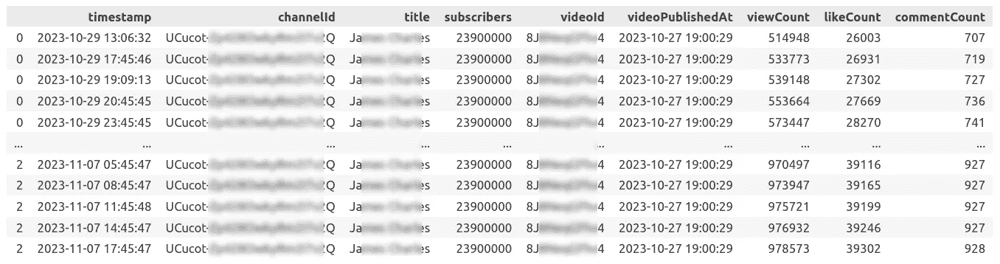

示例数据框，图片由作者提供

每行包含一个时间戳、视频 ID、视频发布时间，以及在数据收集时的观看次数、点赞数和评论数。我们可以看到，视频`8J…4`于 2023 年 10 月 27 日 19:00 发布。在我观察开始时，它已经有 514,948 次观看，而在数据框的末尾，观看次数增加到了 978,573 次。

现在，我们准备开始一些有趣的操作。

## 3. 数据分析

**3.1 观看次数** 作为热身，我们先展示每个视频的观看次数。我将只使用最近两个月内制作的视频。

```py
channel_id = "UCu..."
df_channel = df_channels[df_channels["channelId"] == channel_id]
df_channel = df_channel.sort_values(by=['timestamp'], ascending=True)

# Videos published within interval
days_display = 2*31
start_date = df_channel["timestamp"].max() - pd.Timedelta(days=days_display)  
end_date = df_channel["timestamp"].max()
df_channel = df_channel[(df_channel["videoPublishedAt"] >= start_date) &
                        (df_channel["videoPublishedAt"] < end_date)]
```

我每 3 小时收集一次频道数据，因此只需要最后的时间戳：

```py
step_size = 3        
interval_start = df_channel["timestamp"].max() - pd.Timedelta(hours=step_size)
interval_end = df_channel["timestamp"].max()

df_interval = df_channel[(df_channel["timestamp"] >= interval_start) &
                         (df_channel["timestamp"] < interval_end)]
df_interval = df_interval.drop_duplicates(subset=["videoId"])

v_days = df_interval["videoPublishedAt"].values
v_views = df_interval["viewCount"].values
```

让我们使用 Matplotlib 绘制条形图：

```py
import matplotlib.pyplot as plt
import matplotlib.dates as mdates

fig, ax = plt.subplots(figsize=(16, 4))

cmap = plt.get_cmap("Purples")
views_max = 3_000_000
views_avg = df_channel.drop_duplicates(subset=["videoId"], keep="last")["viewCount"].median()  # Median value
rescale = lambda y: 0.5 + 0.5 * y / views_max
# Bar chart
ax.bar(v_days, v_views,
       color=cmap(rescale(v_views)),
       width=pd.Timedelta(hours=12))
# Add horizontal median line
ax.axhline(y=views_avg, alpha=0.2, linestyle="dotted")
trans = ax.get_yaxis_transform()
ax.text(0, views_avg, " Median ", color="gray", alpha=0.5, transform=trans, ha="left", va="bottom")
# Title
subscribers = df_channel.iloc[[0]]["subscribers"].values[0]
title_str = f"YouTube Channel, {subscribers/1_000_000:.1f}M subscribers"
# Adjust axis
ax.xaxis.set_major_formatter(mdates.DateFormatter("%d/%m"))
ax.yaxis.set_major_formatter(FuncFormatter(lambda x, p: format(int(x), ",")))
ax.xaxis.set_major_locator(mdates.WeekdayLocator(byweekday=mdates.SU))
ax.set(title=title_str,
       xlabel="Video Publication Date",
       ylabel="Views",
       xlim=(start_date, end_date),
       ylim=(0, views_max))
plt.tight_layout()
plt.show()
```

在这里，我使用`ax.bar`绘制条形图，并用`rescale`函数调整条形的颜色。水平中位线有助于查看观看次数是否高于或低于平均水平。

首先，让我们看看一个**拥有 2390 万订阅者**的频道，它发布“化妆”类别的视频：

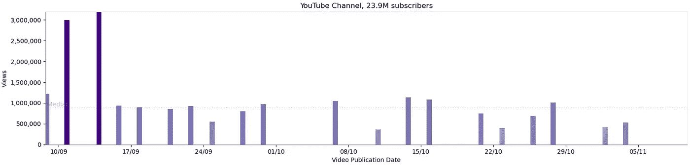

最近 2 个月的观看次数，作者提供的图片

结果很有趣。我们可以看到每个视频的观看次数基本一致，中位数大约是 100 万次。这个数字多吗？这个值显然很大。但频道几乎有 2400 万订阅者，这些订阅者应该对这些内容感兴趣，并在发布新视频时收到通知。我认为 1/24 的比例看起来并不大；也许人们订阅了但很快失去了兴趣？

另一个有趣的“异常”引起了我的注意。有时，我将显示间隔设置为 1 年，这时可以看到观看次数大幅增加：

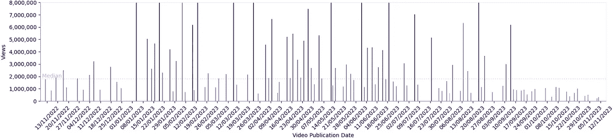

每年观看次数，作者提供的图片

显然，作者发布了大量的“短视频”，在那段时间内获得了许多（300 万到 1000 万）观看次数。后来发生了什么？也许频道的主编换了？也许制作“短视频”不再盈利？我不知道。可能可以在网页浏览器中观看所有视频并尝试找出原因，但这绝对超出了这个测试的范围，而且我也不是化妆方面的专家。

作为另一个例子，让我们看看另一个**拥有 1780 万订阅者**的频道，这个频道制作小工具评测：

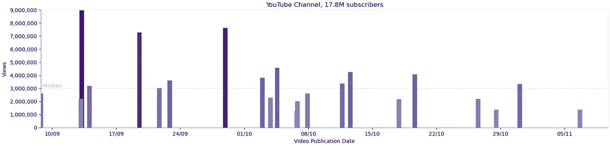

观看次数，作者提供的图片

我不知道这些结果是否与内容有关（“小工具评测”和“化妆”自然面向不同的受众），但与第一个频道相比，这个频道每个视频的中位观看次数要高得多。

现在让我们看看受众较小的频道能获得多少观看次数。这个与小工具相关的频道拥有**130 万订阅者**：


观看次数，作者提供的图片

差异是显著的。一个拥有 17.8M 订阅者的频道每个视频大约获得 300 万次观看，而一个拥有 1.3M 订阅者的频道仅获得“仅”30 万次观看。为了比较，下一个与摄影相关的频道拥有**115K 受众**：

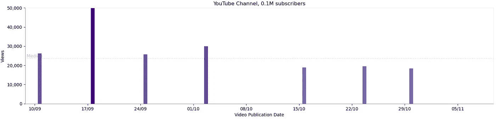

观看次数，图片来自作者

在这种情况下，频道的每个视频平均观看次数为 25K。

显然，视频不仅向订阅者展示，还通过 YouTube 推荐系统展示给任何人。真实的比例是什么？我们不知道。从柱状图来看，我可以猜测只有大约 20%的订阅者是“活跃的”。其他人可能很久以前订阅了，已经对内容不再感兴趣。这是有道理的；例如，如果我要买一台笔记本电脑，我可以订阅一个硬件评测频道，但在购买后我可能就不再感兴趣了。

**3.2 观看次数动态** 我们能够看到每个视频的观看次数，但视频获取这些观看次数的速度有多快？我们已经有了一个 Matplotlib 柱状图；让我们对它进行动画处理！只有频道所有者可以访问历史数据，但我在三周内进行了请求，我们可以轻松地看到这些值在这个时间间隔内是如何变化的。为此，我们只需更新图表：

```py
import matplotlib.animation as animation

def animate_bar(frame_num: int):
    """ Update graph values according to frame number """
    interval_start = df_channel["timestamp"].min() + pd.Timedelta(hours=step_size*frame_num)
    interval_end = df_channel["timestamp"].min() + pd.Timedelta(hours=step_size*(frame_num+1))
    day_str = interval_start.strftime('%d/%m/%Y %H:00')
    days, views = get_views_per_interval(df_channel, interval_start, interval_end)
    print(f"Processing {day_str}: {views.shape[0]} items")
    bar = ax.bar(days, views,
                 color=cmap(rescale(views)),
                 width=pd.Timedelta(hours=bar_width))
    day_vline.set_xdata([interval_start])

    ax.set(title=f"{title_str}: {day_str}")
    return bar,

step_size = 3
num_frames = (df_channel["timestamp"].max() - df_channel["timestamp"].min())//pd.Timedelta(hours=step_size)
anim = animation.FuncAnimation(fig, animate_bar, repeat=True, frames=num_frames)
writer = animation.PillowWriter(fps=5)
anim.save("output.gif", writer=writer)
```

在这里，我创建了一个`FuncAnimation`对象，其中`animate_bar`函数作为参数传递。这个函数会自动调用不同的帧编号；在这个函数内部，我创建了一个新的柱状图并更新了标题。我还添加了一条垂直线，代表当前日期。

输出结果如下：


3 周内的观看次数，图片来自作者

从这个动画中，我们可以看到一个新视频显然在第一周内获得了至少 70%的观看次数。旧视频也会获得一些观看次数，但这个过程要慢得多。

但也可能会有例外。在下一个例子中，一个频道的每个视频的中位数观看次数为 90K，但其中一个视频可能变得病毒式传播，被大量分享，并在 2 到 3 周内获得了大约一百万次观看：

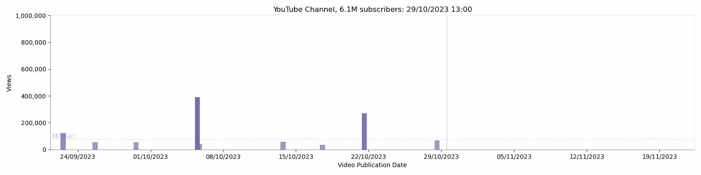

3 周内的观看次数，图片来自作者

**3.3 观看次数分布** 在观看了柱状图后，我问自己一个问题：观看次数的分布是否正常？显然，有些视频的观看次数比其他视频多，但这种情况有多一致？使用 Seaborn 的`histplot`方法很容易找到答案。

```py
import seaborn as sns

channel_id = "UCu..."
df_channel = df_channels[df_channels["channelId"] == channel_id]
display(df_channel.drop_duplicates(subset=["videoId"]))

step_size = 3
interval_start = df_channel["timestamp"].max() - pd.Timedelta(hours=step_size)
interval_end = df_channel["timestamp"].max()
df_interval = df_channel[(df_channel["timestamp"] >= interval_start) & (df_channel["timestamp"] < interval_end)].drop_duplicates(subset=["videoId"])

# Title
subscribers = df_channel.iloc[[0]]["subscribers"].values[0]
title_str = f"YouTube Channel, {subscribers/1_000_000:.1f}M subscribers"
# Median
views_avg = df_channel["viewCount"].median()
# Draw
fig, ax = plt.subplots(figsize=(12, 5))
sns.set_style("white")
sns.histplot(data=df_interval, x="viewCount", stat="percent", bins=50)
ax.set(title=title_str,
       xlabel="Views Per Video",
       ylabel="Percentage",
       xlim=(0, None),
       ylim=(0, 18)
       )
ax.axvline(x=views_avg, alpha=0.2, linestyle="dotted")
ax.xaxis.set_major_formatter(FuncFormatter(lambda x, p: format(int(x), ',')))
plt.tight_layout()
plt.show()
```

对于这个测试，我将 500 作为 API 请求的视频限制。一个“电子产品评测”类别频道的结果如下：

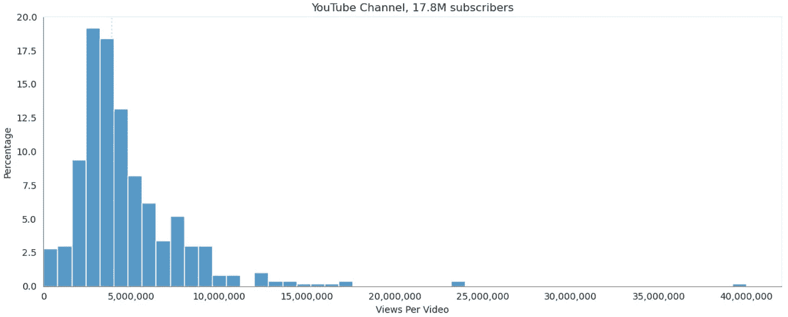

观看次数分布，图片来自作者

1780 万订阅者是一个大数字。这个频道绝对是顶级之一，正如我们所见，它产生的结果或多或少是一致的。分布看起来正常，但略有偏斜。该图表的中位值是每个视频 380 万次观看，但一些视频的观看次数超过了 1000 万次，且 500 个视频中只有 3 个超过了 2000 万次。

在其他订阅者较少的频道中也可以看到类似的模式，但在这种情况下，分布更加偏斜：

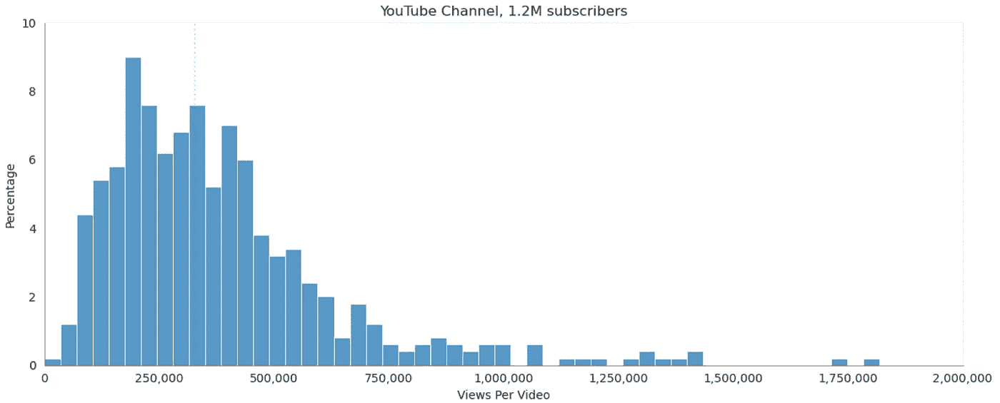

观看次数分布，作者提供的图片

这些数据可能需要更详细的分析。例如，结果显示“正常视频”和“短视频”可以有截然不同的观看次数，理想情况下应该分开分析。

**3.4 附加内容：单个视频的观看次数** 这篇文章已经很长了，我会给那些耐心读到这一步的读者一个附加内容。在 3.2 中，我做了动画，显示大多数视频在发布后很快获得了大量观看（顺便提一下，这对于 TDS 和 Medium 文章也是如此）。我们能更详细地看到这个过程吗？实际上可以。我在几周内收集了数据，期间有足够的视频发布。找到最新的视频很简单，因为我们有一个`videoPublishedAt`参数：

```py
# Find the newest videos for a specific channel
df_channel = df_channels[df_channels["channelId"] == "UCB..."]

num_videos = 5
df_videos = df_channel.drop_duplicates(subset=["videoId"]).sort_values(by=["videoPublishedAt"], ascending=False)
```

提醒一下，特定视频的数据如下：

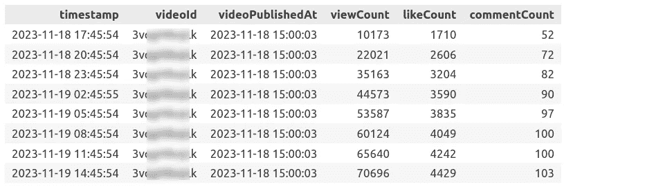

数据框示例，作者提供的图片

然后，我“标准化”了这些数据：我的目标是显示从发布时间开始的观看次数，我将其视为“0”：

```py
def get_normalized_views(df_channel: pd.DataFrame, video_id: str) -> pd.DataFrame:
    """ Get relative views for a specific video """
    df_video = df_channel[df_channel["videoId"] == video_id].sort_values(by=['timestamp'], ascending=True)

    # Insert empty row with zero values at the beginning
    video_pub_time = df_video.iloc[[0]]["videoPublishedAt"].values[0]
    start_row = {'videoPublishedAt': video_pub_time,
                 'timestamp': video_pub_time,
                 'viewCount': 0, 'likeCount': 0, 'commentCount': 0}
    df_first_row = pd.DataFrame(start_row, index=[0])
    df_video_data = df_video[df_first_row.columns]
    df_video_data = pd.concat([df_first_row, df_video_data], ignore_index=True)

    # Make timestamps data relative, starting from publication time
    df_first_row = df_video_data.iloc[[0]].values[0]        
    df_video_data = df_video_data.apply(lambda row: row - df_first_row, axis=1)
    df_video_data["daysDiff"] = df_video_data["timestamp"].map(lambda x: x.total_seconds()/(24*60*60), na_action=None)
    return df_video_data
```

这里，我还将时间戳转换为从发布时间开始的天数，以使图表更方便阅读。

现在，我们可以使用 Matplotlib 绘制图表：

```py
fig, ax = plt.subplots(figsize=(10, 6))
# Title
subscribers = df_channel.iloc[[0]]["subscribers"].values[0]
title_str = f"YouTube Channel with {subscribers/1_000_000:.1f}M Subscribers, Video Views"
# Videos data
for p in range(num_videos):
    video_id = df_videos.iloc[[p]]["videoId"].values[0]
    df_video_data = get_normalized_views(df_channel, video_id)
    plt.plot(df_video_data["daysDiff"], df_video_data["viewCount"])
# Params
ax.set(title=title_str,
       xlabel="Days Since Publication",
       ylabel="Views",
       xlim=(0, None),
       ylim=(0, None))
ax.yaxis.set_major_formatter(FuncFormatter(lambda x, p: format(int(x), ',')))
ax.tick_params(axis='x', rotation=0)
plt.tight_layout()
plt.show()
```

结果看起来是这样的：

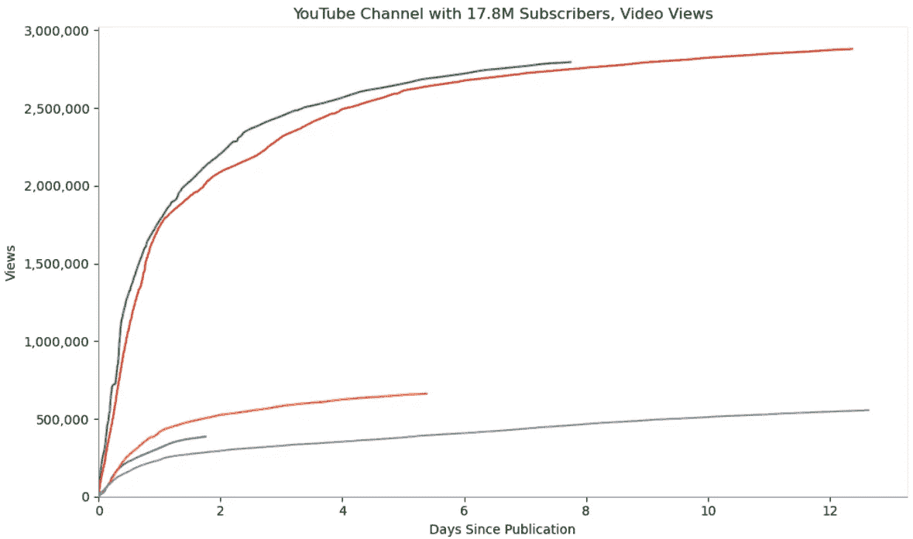

每个视频的观看次数，作者提供的图片

这里，线的长度不同，因为视频的发布时间不同。最早的视频发布于将近两周前，而最新的视频发布于数据收集前的两天。

从这张图表中，我有两个有趣的观察。

首先，至少对于这个频道而言，我的假设是正确的，这些视频在发布后立即获得了最多的观看次数。更重要的是，曲线（例如红色和绿色的曲线）几乎是相同的。

其次，细心的读者可能会看到两个明显的组——前两个视频获得了大约 300 万次观看，而另外三个视频显然获得了大约 50 万次观看。确实，这些视频不同。顶部的线代表“正常”视频，底部的线代表“YouTube Shorts”。显然，至少对这个频道而言，观众对“短视频”的兴趣较低。

但显然，结果可能有所不同。首先，一些视频可能会变得更受欢迎甚至成为病毒视频；它们可以获得更多的观看次数：

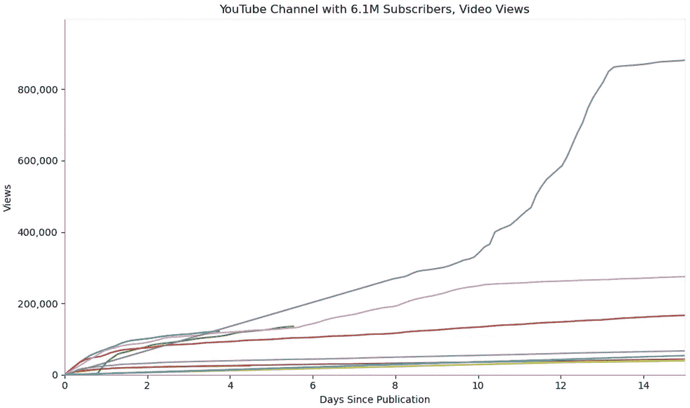

每个视频的观看次数，图像作者提供

其次，内容本身也很重要。例如，关于小工具的评测在“新鲜”时通常最有趣，但关于健康、关系、运动、化妆或任何类似主题的视频对观众的长期价值可能更高。最后但同样重要的是，这些特定频道拥有大量订阅者，视频在发布后很快就会获得许多观看次数。对于“新手”而言，结果可能会有所不同，大多数新频道的观众可能来自 YouTube 推荐系统或搜索结果。因此，我只能建议读者自行研究，选择一个大致符合他们想了解内容的 YouTube 频道。

## 结论

在这篇文章中，我展示了如何收集和分析有关不同 YouTube 频道和视频的数据。在第一部分，我重点关注了诸如每个频道的观看次数等一般属性。在这一部分，我关注了单个视频。我们能够看到不同频道上新视频发布的频率、它们可以获得的观看次数以及这一过程的速度。这种分析通常仅对频道所有者开放，但借助 YouTube 数据 API，我们可以以高精度免费收集数据。这不仅对那些希望开设新频道的人感兴趣，也从文化和统计的角度来看非常有意义。

显然，YouTube 是一个庞大的流媒体平台，拥有数百万个频道和数十亿个视频。关于猫、数学问题或笔记本电脑评测的视频可以获得截然不同的观看次数、点赞数和评论数。因此，我鼓励读者对他们感兴趣的频道进行自己的测试。在这篇文章中，我只关注了观看次数，但评论数或点赞数也可以通过相同的方式进行分析（顺便提一下，我们可以通过 API 获取点赞数，但 YouTube 从 2021 年开始移除了公众对不喜欢数的访问）。

在下一部分也是最后一部分中，我将关注 YouTube “Shorts”。这些类型的视频显示在一个单独的 YouTube 页面上，该页面具有不同的 UI，并且观看次数或点赞数可能会有显著差异。敬请关注。

对社交数据分析感兴趣的人也欢迎阅读其他文章：

+   探索性数据分析：我们对 YouTube 频道了解多少（第一部分）

+   [德国住房租赁市场：使用 Python 进行探索性数据分析](https://medium.com/towards-data-science/housing-rental-market-in-germany-exploratory-data-analysis-with-python-3975428d07d2)

+   [人们对气候的看法：使用 Python 进行 Twitter 数据聚类](https://medium.com/towards-data-science/what-people-write-about-climate-twitter-data-clustering-in-python-2fbbd2b95906)

+   [在 Twitter 帖子中寻找时间模式：使用 Python 进行探索性数据分析](https://medium.com/towards-data-science/finding-temporal-patterns-in-twitter-posts-exploratory-data-analysis-with-python-8aac618c8699)

+   [Python 数据分析：我们对流行歌曲了解多少？](https://blog.devgenius.io/python-data-analysis-what-do-we-know-about-pop-songs-b6197d85d4)

如果你喜欢这个故事，欢迎[订阅](https://medium.com/@dmitryelj/membership) Medium，这样你将会收到我新文章发布的通知，并且可以全面访问其他作者的数千篇故事。本文的完整源代码和 Jupyter notebook 也可以在我的[Patreon 页面](https://www.patreon.com/deliuseev)找到。

感谢阅读。
