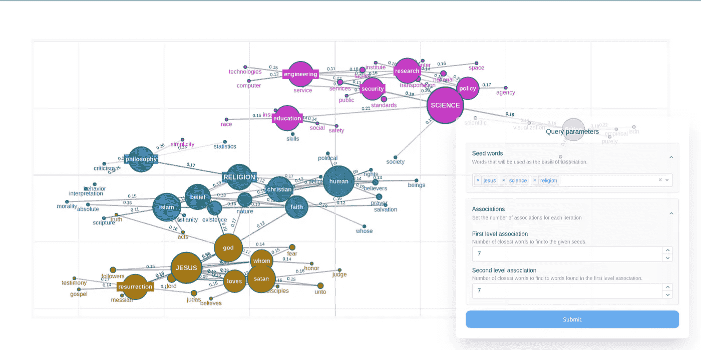
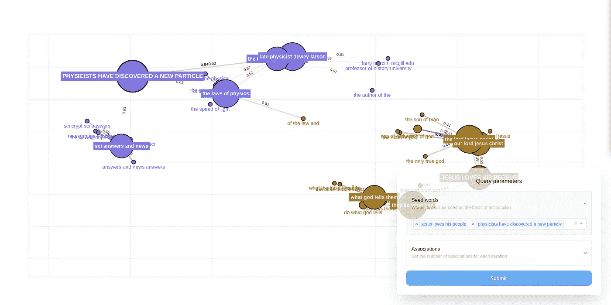
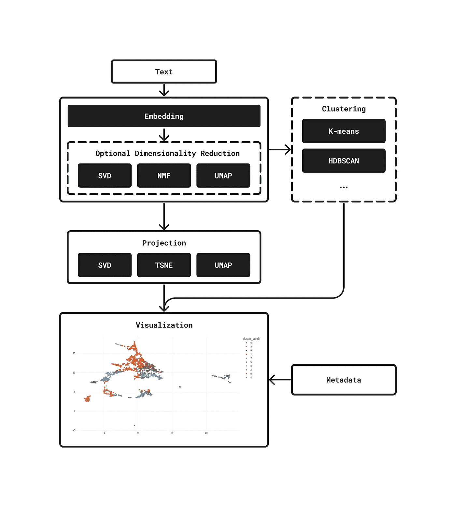
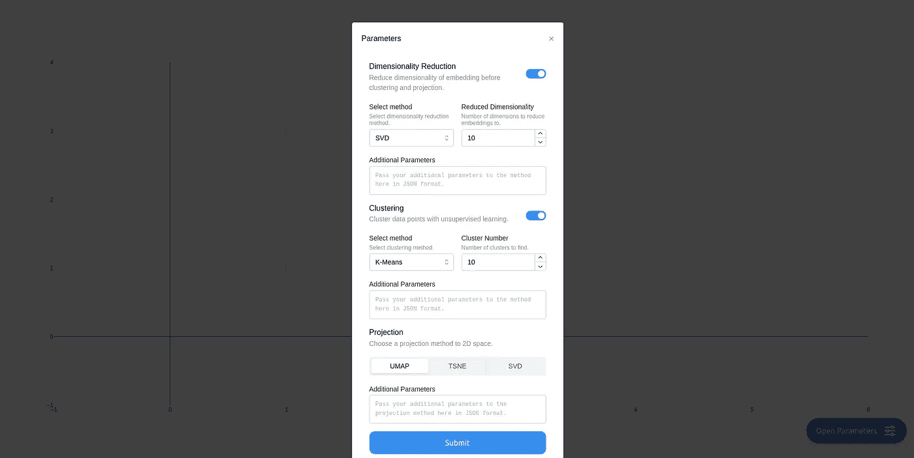
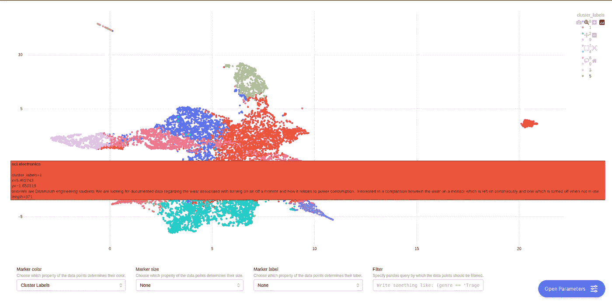
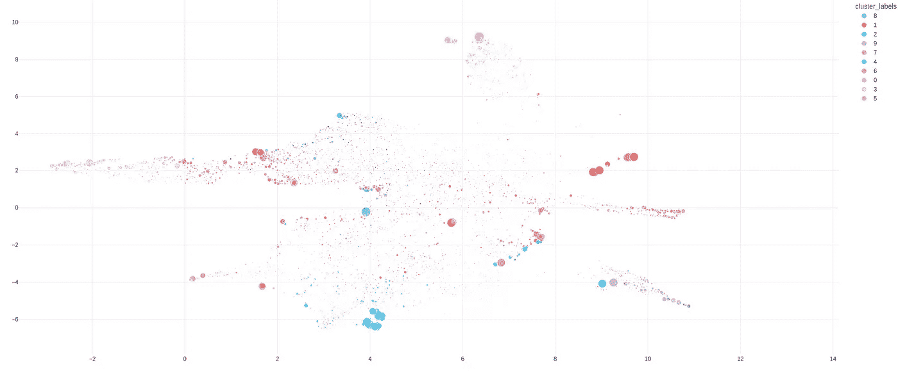

# 探索语料库中的语义关系与嵌入模型

> 原文：[`towardsdatascience.com/explore-semantic-relations-in-corpora-with-embedding-models-0a6d64c3ec7f?source=collection_archive---------2-----------------------#2023-11-24`](https://towardsdatascience.com/explore-semantic-relations-in-corpora-with-embedding-models-0a6d64c3ec7f?source=collection_archive---------2-----------------------#2023-11-24)

[](https://medium.com/@power.up1163?source=post_page-----0a6d64c3ec7f--------------------------------)[](https://towardsdatascience.com/?source=post_page-----0a6d64c3ec7f--------------------------------) [Márton Kardos](https://medium.com/@power.up1163?source=post_page-----0a6d64c3ec7f--------------------------------)

·

[关注](https://medium.com/m/signin?actionUrl=https%3A%2F%2Fmedium.com%2F_%2Fsubscribe%2Fuser%2F6e63b1795236&operation=register&redirect=https%3A%2F%2Ftowardsdatascience.com%2Fexplore-semantic-relations-in-corpora-with-embedding-models-0a6d64c3ec7f&user=M%C3%A1rton+Kardos&userId=6e63b1795236&source=post_page-6e63b1795236----0a6d64c3ec7f---------------------post_header-----------) 发表在 [Towards Data Science](https://towardsdatascience.com/?source=post_page-----0a6d64c3ec7f--------------------------------) ·10 min 阅读·2023 年 11 月 24 日[](https://medium.com/m/signin?actionUrl=https%3A%2F%2Fmedium.com%2F_%2Fvote%2Ftowards-data-science%2F0a6d64c3ec7f&operation=register&redirect=https%3A%2F%2Ftowardsdatascience.com%2Fexplore-semantic-relations-in-corpora-with-embedding-models-0a6d64c3ec7f&user=M%C3%A1rton+Kardos&userId=6e63b1795236&source=-----0a6d64c3ec7f---------------------clap_footer-----------)

--

[](https://medium.com/m/signin?actionUrl=https%3A%2F%2Fmedium.com%2F_%2Fbookmark%2Fp%2F0a6d64c3ec7f&operation=register&redirect=https%3A%2F%2Ftowardsdatascience.com%2Fexplore-semantic-relations-in-corpora-with-embedding-models-0a6d64c3ec7f&source=-----0a6d64c3ec7f---------------------bookmark_footer-----------)

最近，我与一些同学和学者讨论了他们研究兴趣涉及自由形式文本分析的话题。遗憾的是，获得对书面自然语言的有意义的见解绝非易事。密切阅读当然是一个选择，但你理想中会希望通过更宏观的分析/量化视角来看待文本数据。更不用说在大数据时代，密切阅读往往不可行。

到目前为止，我最喜欢在语料库上进行探索性数据分析的方法是主题模型，我已经写过多篇文章讨论如何以[尽可能少的痛苦方式](https://x-tabdeveloping.github.io/topicwizard/)进行这项工作。尽管主题模型非常棒，但它们并不是所有文本任务的最佳方法。

嵌入是文本数据的数值表示，已经成为文本语义查询的经典方法。在这篇文章中，我们将探讨如何使用嵌入来分析文本数据的一些方法。

# 使用词嵌入捕捉概念之间的关系

词嵌入模型是一组以无监督方式学习术语潜在向量表示的方法。当从自然语言中学习词嵌入时，实际上是获得了一个嵌入空间中的语义关系图。

词嵌入通常在大型语料库上进行训练，以便捕捉人类语言中的一般词对词关系。这很有用，因为可以将关于语言的一般知识注入到特定应用的模型中。这也被称为迁移学习，并且在机器学习中一直是一个热门话题。

如果我们不想将一般知识转移到特定模型中，而是希望得到一个较小语料库的语义特定方面的映射，该怎么办呢？假设我们有一个来自论坛的评论语料库，我们想探索其中可以发现哪些关联关系。

一种方法是从头开始训练一个词嵌入模型，而不是使用已经为我们预训练的模型。在这个例子中，我将使用 20Newsgroups 数据集作为语料库，我们将在其中探索语义关系。

## 训练模型

现在让我们从一个词嵌入模型开始。你可能对 Word2Vec 有所了解，它是普及静态词嵌入在研究和实践中的方法。另一方面，由斯坦福大学的团队开发的 GloVe 在大多数情况下似乎是一种更好的方法，我的经验表明，它提供了更高质量的嵌入，特别是在较小的语料库上。

不幸的是，GloVe 在 Gensim 中没有实现，但幸运的是，我为原始 GloVe 代码制作了一个完全兼容 Gensim 的接口，我们将使用它来训练模型。

让我们安装 gensim、glovpy 和 scikit-learn，以便我们可以获取 20Newsgroups 以及 embedding-explorer：

```py
pip install glovpy gensim scikit-learn
```

我们首先需要加载数据集，并对其进行标记化，为此我们将使用 gensim 内置的标记化工具。我们还将过滤掉停用词，因为它们对当前任务没有任何有意义的信息。

```py
from gensim.utils import tokenize
from sklearn.datasets import fetch_20newsgroups
from sklearn.feature_extraction.text import ENGLISH_STOP_WORDS

def clean_tokenize(text: str) -> list[str]:
    """This function tokenizes texts and removes stop words from them"""
    tokens = tokenize(text, lower=True, deacc=True)
    tokens = [token for token in tokens if token not in ENGLISH_STOP_WORDS]
    return tokens

# Loading the dataset
dataset = fetch_20newsgroups(
    remove=("headers", "footers", "quotes"), categories=["sci.med"]
)
newsgroups = dataset.data

# Tokenizing the dataset
tokenized_corpus = [clean_tokenize(text) for text in newsgroups]
```

之后，我们可以在标记化的语料库上轻松训练一个 GloVe 模型。

```py
from glovpy import GloVe

# Training word embeddings
model = GloVe(vector_size=25)
model.train(tokenized_corpus)
```

我们已经可以查询这个词嵌入模型了，举个例子，让我们检查一下哪些十个词最接近“child”。

```py
model.wv.most_similar("child")
==============================

+------------+----------+
| age        | 0.849304 |
| consistent | 0.844267 |
| adult      | 0.805101 |
| range      | 0.800615 |
| year       | 0.798799 |
| hand       | 0.792965 |
| children   | 0.792113 |
| use        | 0.789804 |
| restraint  | 0.773764 |
| belt       | 0.77003  |
+------------+----------+
```

## 调查，可视化！

不过，单独调查每个词与其他词的关系很快会变得乏味。理想情况下，我们也希望可视化关系，甚至可能得到一些网络。

幸运的是，[embedding-explorer](https://centre-for-humanities-computing.github.io/embedding-explorer/#) 包可以帮助我们，我也开发了这个包。在计算人文学科中，我们经常使用词嵌入模型及其建立的语义网络，而 embedding-explorer 帮助我们以互动和可视化的方式探索这些网络。该包包含多个互动网页应用，我们首先来看看“网络探索器”。

这个应用的想法是，嵌入模型中的概念自然形成某种网络结构。相关性强的词有强链接，而其他词可能没有。在应用中，您可以基于指定的一组种子词和两个自由联想级别构建概念图。

在每个关联级别，我们从嵌入模型中找出与已有词汇最接近的五个词，并将其添加到我们的网络中，与其关联的词相连。连接的强度由嵌入空间中概念的余弦距离决定。这类网络在我或我的同事进行的多个研究项目中都证明了其有用性。

让我们启动我们的词嵌入模型应用。

```py
from embedding_explorer import show_network_explorer

vocabulary = model.wv.index_to_key
embeddings = model.wv.vectors
show_network_explorer(vocabulary, embeddings=embeddings)
```

这将打开一个浏览器窗口，您可以自由探索语料库中的语义关系。这里是我查看围绕“jesus”，“science”和“religion”这些词汇形成的网络的截图。



探索我们 GloVe 模型中的语义关系

例如，我们可以看到，人们在线讨论这些话题时，似乎暗示了宗教和科学通过政治、社会和哲学相关联，这非常有道理。观察到教育在科学和宗教之间，虽然明显更接近科学，这也很有趣。这将值得进一步探讨。

# N-grams 与句子变换器的网络

那么，如果我们不仅想查看词级别的关系，还想查看短语或句子呢？

我的建议是使用 N-grams。N-grams 本质上就是文本中连续的 N 个术语。例如，在句子“I love my little cute dog”中，我们将得到 4-grams：“I love my little”，“love my little cute”和“my little cute dog”。现在的问题是，我们如何学习 N-grams 的良好语义表示？

技术上，你仍然可以通过将短语或句子视为一个标记来使用 GloVe，但有一个问题。由于 N-grams 的多样性随着 N 的增加而急剧增加，某些 N-grams 可能只出现一两次，我们可能无法学习到良好的表示。

取短语中词嵌入的平均值怎么样？这可能会有很大帮助，但问题是我们完全丧失了关于不同词的重要性、它们在句子中的顺序以及所有上下文信息。

解决此问题的方案是使用[句子变换器](https://www.sbert.net/)，这些深度神经语言模型产生具有上下文敏感性的文本表示。它们已经[超越了所有其他方法](https://huggingface.co/blog/mteb)好几年，并成为了嵌入文本的行业标准。现在训练这样的模型需要大量的数据，我们手头没有，但幸运的是，我们可以使用一些优秀的预训练模型。

## N-gram 提取

首先，让我们从语料库中提取 N-gram。我选择了四元组，但你可以选择任何你喜欢的数量。我们将使用 scikit-learn 的 CountVectorizer 来完成这项工作。

```py
from sklearn.feature_extraction.text import CountVectorizer

# First we train a model on the corpus that learns all 4-grams
# We will only take the 4000 most frequent ones into account for now,
# But you can freely experiment with this
feature_extractor = CountVectorizer(ngram_range=(4,4), max_features=4000)
feature_extractor.fit(newsgroups)
# Then we get the vectorizer's vocabulary
four_grams = feature_extractor.get_feature_names_out()
```

## 嵌入模型

我们需要一个嵌入模型来表示文本。正如我之前所说，我们将使用一个预训练模型。我选择了[all-MiniLM-L6-v2](https://huggingface.co/sentence-transformers/all-MiniLM-L6-v2)，因为它非常稳定、广泛使用且相当小巧，因此即使在你的个人电脑上也能顺畅运行。

我们将使用另一个包，[embetter](https://github.com/koaning/embetter)，以便可以以与 scikit-learn 兼容的方式使用句子变换器。

```py
pip install embetter[text]
```

我们可以像这样在 Python 中加载模型：

```py
from embetter.text import SentenceEncoder

encoder = SentenceEncoder("all-MiniLM-L6-v2")
```

## 探索！

然后，我们可以将模型和 N-gram 加载到 embedding-explorer 中。

```py
from embedding_explorer import show_network_explorer

show_network_explorer(four_grams, vectorizer=encoder)
```

请注意，这允许我们指定任何任意种子，而不仅仅是我们四元组词汇表中的种子。这里是我输入两个句子的截图，并查看从它们周围的四元组构建了什么样的网络。



探索语料库中的短语和句子

有趣的是再次观察哪些短语处于中间位置。看起来法律和历史在这里充当了宗教和科学之间的某种连接。

# 使用文档嵌入研究语料库级语义结构

我们现在已经在单词和短语级别查看了我们的语料库，并观察了它们中自然出现的语义结构。

如果我们想要了解在文档级别发生了什么呢？哪些文档彼此接近，出现了什么样的群体？

请注意，一个自然的解决方案是主题建模，如果你还没有尝试过，应该看看。在本文中，我们将探索与此任务相关的其他概念化方法。

## 文档表示

和以前一样，我们需要考虑如何表示单个文档，以便捕捉它们的语义内容。

更传统的机器学习实践通常使用词袋模型表示或训练 Doc2Vec 模型。这些都是很好的选择（你可以并且应该尝试这些方法），但它们同样缺乏文本的上下文理解。由于我们语料库中的文本不算太长，我们仍然可以使用句子变换器进行嵌入。让我们继续使用我们为短语使用的相同嵌入模型。

## 投影与聚类

探索文档的语义表示的一种自然方式是将它们投影到较低维度的空间（通常是 2D），并使用这些投影来可视化文档。我们还可以查看文档在某些聚类方法下的聚类情况。

现在这一切都很棒，但投影、降维和聚类方法的领域如此广泛，以至于我常常会想：*“如果我使用其他方法，结果会有实质性不同吗？”* 为了应对这个问题，我在嵌入探索中添加了另一个应用程序，你可以自由快速地探索不同方法下的可视化效果。

这是我们的工作流程：

1\. 我们可能会在继续之前减少嵌入的维度。你可以选择各种降维方法，或者关闭它。

2\. 我们想将嵌入投影到 2D 空间中，以便我们可以对其进行可视化。

3\. 我们可能想要对嵌入进行聚类，以查看哪些文档被归为一组。



嵌入探索中的聚类与投影工作流

现在，在进行此操作时，我们还需要了解一些关于文档的外部信息（文本内容、标题等），否则我们没有太多可解释的内容。

让我们创建一个包含以下列的数据框：

1\. 每个文档的前 400 个字符，以便我们可以了解文本的内容。

2\. 文本的长度，以便我们可以在可视化中查看哪些文本较长，哪些较短。

3\. 它们在数据集中来源的组。

```py
import pandas as pd
import numpy as np

# Extracting text lengths in number of characters.
lengths = [len(text) for text in corpus]

# Extracting first 400 characters from each text.
text_starts = [text[:400] for text in corpus]

# Extracting the group each text belongs to
# Sklearn gives the labels back as integers, we have to map them back to
# the actual textual label.
group_labels = np.array(dataset.target_names)[dataset.target]

# We build a dataframe with the available metadata
metadata = pd.DataFrame(dict(length=lengths, text=text_starts, group=group_labels))
```

然后我们可以启动应用程序，传递元数据，以便我们可以悬停并查看有关文档的信息。

```py
from embedding_explorer import show_clustering

show_clustering(
  newsgroups,
  vectorizer=encoder,
  metadata=metadata,
  hover_name="group", # Title of hover box is going to be the group
  hover_data=["text", "length"] # We would also like to see these on hover
)
```

当应用程序启动时，你会首先看到这个屏幕：



聚类应用中的选项

运行聚类后，你将能够查看按聚类着色的所有文档的地图。你可以悬停在点上以查看文档的元数据……



聚类应用截图

并且在底部你甚至可以选择点的颜色、标签和大小。



带有文档大小的聚类

# 总结

对文本数据的探索性分析是困难的。我们已经研究了几种使用最先进的机器学习技术进行互动调查的方法。我希望本文讨论的方法以及 embedding-explorer Python 包对你未来的研究/工作有所帮助。

和平 ✌️

（（本文中的所有图片均来自 embedding-explorer 的文档，由作者制作））
