# 探索 DAX 中的时间智能变体

> 原文：[`towardsdatascience.com/explore-variants-of-time-intelligence-in-dax-e795545e2a40`](https://towardsdatascience.com/explore-variants-of-time-intelligence-in-dax-e795545e2a40)

## *我们在 DAX 中有一些有价值的函数来计算前一年、年初至今等。但其他函数允许我们用不同的方式计算相同的结果。让我们探索我们的选项及其重要性。*

[](https://medium.com/@salvatorecagliari?source=post_page-----e795545e2a40--------------------------------)[](https://towardsdatascience.com/?source=post_page-----e795545e2a40--------------------------------) [Salvatore Cagliari](https://medium.com/@salvatorecagliari?source=post_page-----e795545e2a40--------------------------------)

·发表于[Towards Data Science](https://towardsdatascience.com/?source=post_page-----e795545e2a40--------------------------------) ·阅读时间 11 分钟·2023 年 11 月 6 日

--


图片由[Lukas Blazek](https://unsplash.com/@goumbik?utm_source=medium&utm_medium=referral)提供，来源于[Unsplash](https://unsplash.com/?utm_source=medium&utm_medium=referral)

# 引言

当我们查看报告中的数值时，我们必须赋予它们意义。

最常见的做法是将其与前一时期的数值进行比较。

这时，时间智能就会发挥作用，成为我们在报告中想展示的主要内容之一。

例如，查看以下报告页面：


图 1 — 示例报告（图由作者提供）

在这里，你可以看到销售数据与前一年、年初至今和滚动总额的比较。

这是一个典型的报告，广泛使用时间智能逻辑。

现在，我将向你展示如何创建测量值来计算这些结果以及使用不同 DAX 函数的变体。

为了更好地阅读，我将仅在表格中显示结果。

# DAX 中的时间智能

我们在 DAX 中有大量的时间智能函数。查看[dax.guide](https://dax.guide/functions/time-intelligence/)，我们可以找到超过 35 个函数的列表。

一些函数包含了完整的时间智能逻辑，例如[TOTALYTD()](https://dax.guide/totalytd/)或[SAMEPERIODLASTYEAR()](https://dax.guide/sameperiodlastyear/)。或者，我们可以使用一些更基础的函数，这些函数必须与[CALCULATE()](https://dax.guide/calculate/)配合使用，例如[DATEADD()](https://dax.guide/dateadd/)或[DATESBETWEEN()](https://dax.guide/datesbetween/)。

我想展示如何使用“易于使用”的函数，然后展示如何使用基础函数来探索它们的好处。

有时，我们得到不同的结果取决于使用的函数，而有时，通过使用正确的函数可以避免问题。

在结论中，我将解释了解不同函数和计算选项为何重要。

# 日期表

我们必须拥有一个适当的日期表才能正确使用时间智能函数。

当我在 Google 上搜索“为什么我们需要在 Power BI 中使用日期表”时，我得到了 149,000,000 个结果。因此，关于为什么需要它的学习材料非常多。

我在 Medium 上的第一篇文章之一是关于日期表的：

[](/3-ways-to-improve-your-reporting-with-an-expanded-date-table-2d983d76cced?source=post_page-----e795545e2a40--------------------------------) ## 通过扩展日期表提升报表的 3 种方法

### 时间是最关键的报表维度。你可以通过使用一个好的日期表来扩展你的报表功能。

towardsdatascience.com

简单来说，我可以使用中央日期表做很多酷的事情。

例如，我可以在日期表中添加具有特定逻辑的列，以便在 DAX 和 Power BI 中更方便地工作。

在本文的其余部分，我假设你知道如何构建日期表，并且已经在数据模型中将该表标记为“日期表”（[在 Power BI Desktop 中设置和使用日期表 — Power BI | Microsoft Learn](https://learn.microsoft.com/en-us/power-bi/transform-model/desktop-date-tables)）。

# 年初至今 (YTD)

我将 YTD 函数作为季度到日期 (QTD) 和月份到日期 (MTD) 的其他两个变体的占位符。

YTD 计算从年初到当前日期（当前筛选上下文）的所有日期的表达式。

让我们从 [TOTALYTD()](https://dax.guide/totalytd/) 函数开始：

```py
Sales YTD = TOTALYTD([Sum Sales], 'Date'[Date])
```

如果日期表在数据模型中标记为“日期表”，这个函数可以完美运行。

如果你不想这样做，这个函数将无法工作。

在这种情况下，[DATESYTD()](https://dax.guide/datesytd/) 函数必须与 [ALL()](https://dax.guide/all/) 函数一起使用：

```py
Online Sales (YTD) =
VAR YTDDates = DATESYTD('Date'[Date])

RETURN
  CALCULATE([Sum Online Sales]
          ,YTDDates
          ,ALL('Date')
          )
```

**旁注：** 如果你不想将日期表设置为数据模型中的“日期表”，你必须在所有度量值中添加 ALL(‘Date’) 过滤器。

无论如何，我更喜欢使用包含 CALCULATE() 的形式。

由于我总是将我的日期表标记为“日期表”，我不需要添加 ALL(‘Date’) 过滤器：

```py
Online Sales (YTD) =
VAR YTDDates = DATESYTD('Date'[Date])

RETURN
  CALCULATE([Sum Online Sales]
          ,YTDDates
          )
```

这三种形式中的任何一种都会得到相同的结果：

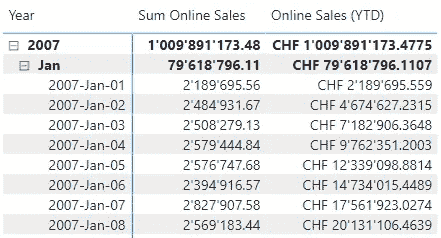

图 2 — YTD 结果（作者提供的图）

包含 CALCULATE() 和 DATESYTD() 的形式更为灵活，并允许在必要时添加额外的逻辑。而 TOTALYTD() 执行的过程与组合前两种函数相同。

我在 DAX Studio 中使用服务器计时检查了这个，执行计划是相同的。

# 前一年（PY）

要获取前一年值，我们可以使用 [SAMEPERIODLASTYEAR()](https://dax.guide/sameperiodlastyear/) 函数：

```py
Sum Online Sales PY =
CALCULATE([Sum Online Sales],
        SAMEPERIODLASTYEAR('Date'[Date])
        )
```

像 TOTALYTD() 一样，这是计算前一年值的一种简单方法。

要了解这个函数的作用，我们可以使用 [DATEADD()](https://dax.guide/dateadd/)。

# 前一年 — 使用 DATEADD

使用 DATEADD() 计算前一年值的表达式如下：

```py
Online Sales (PY 2) =
CALCULATE(
        [Sum Online Sales]
          ,DATEADD('Date'[Date], -1, YEAR)
        )
```

在这两种情况下，结果是一样的：

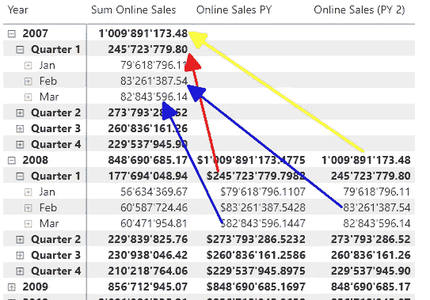

图 3 — 两种 PY 形式的结果（作者提供的图）

像 YTD 计算一样，SAMEPERIODLASTYEAR() 执行与使用 DATEADD() 时相同的过程。

但 DATEADD() 与 SAMEPERIODLASTYEAR() 不同的是，我可以定义所需数据的周期和距离。

例如，我想获取前一个季度：

```py
Online Sales (PQ) =
CALCULATE(
        [Sum Online Sales]
          ,DATEADD('Date'[Date], -1, QUARTER)
        )
```

或者我想获取前一个月：

```py
Online Sales (PM) =
CALCULATE(
        [Sum Online Sales]
          ,DATEADD('Date'[Date], -1, MONTH)
        )
```

对于前一个学期，我可以这样做：

```py
Online Sales (PS) =
CALCULATE(
        [Sum Online Sales]
           ,DATEADD('Date'[Date], -6, MONTH)
        )
```

这些变体的结果如下：

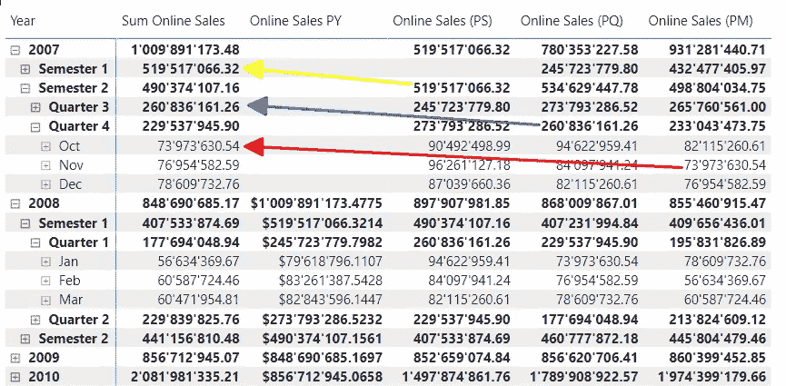

图 4 — 使用 DATEADD() 的度量结果（作者提供的图）

理解这些度量计算每个周期（年、学期、季度和月）的前一个周期是很重要的：

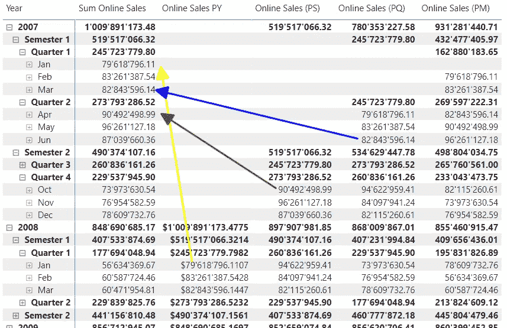

图 5 — 不同级别度量的结果（作者提供的图）

对我来说，结果看起来如此直观，但我认为指出这个细节是值得的。

一个重要细节：DATEADD() 可以处理天、月、季度和年。这就是为什么当我需要获取前一个学期时，我需要回溯六个月或两个季度。

讨论时间智能时，还有更多内容需要探讨。

# PARALLELPERIOD() 怎么样？

PARALLELPERIOD() 函数非常有趣。

我强烈建议阅读 [dax.guide](https://dax.guide/parallelperiod/) 上的描述并观看附带的视频。

简而言之，PARALLELPERIOD() 将当前日期的过滤上下文扩展到整个期间。

看看以下度量：

```py
Online Sales PP 3 Month =
CALCULATE([Sum Online Sales]
          ,PARALLELPERIOD('Date'[Date], -3, MONTH)
          )
```

乍一看，它看起来类似于使用 DATEADD() 回溯 3 个月的度量。

但看看结果：

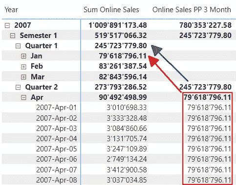

图 6 — PARALLELPERIOD() 的结果（作者提供的图）

如你所见，即使在天级别，三个月前的销售结果也是一样的。

而使用 DATEADD() 时，天级别的结果与月级别的结果相同，但用于前一个周期，如度量中设置的（例如，前一个季度）。

当我写另一个度量时，如下：

```py
Online Sales PP 2 Quarter =
CALCULATE([Sum Online Sales]
          ,PARALLELPERIOD('Date'[Date], -2, QUARTER)
          )
```

结果如下：

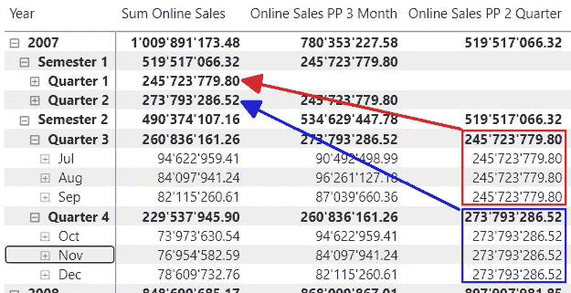

图 7 — 前一个季度的 PARALLELPERIOD 结果（作者提供的图）

正如你所预期的那样，每个月内的天数结果是相同的。

如前所述，查看该函数的描述，它可能会让你感到惊讶。

# 滑动窗口（过去三个月）

需要探索的最后一种情况是所谓的“滑动窗口”。

这是当你想计算一个定义时间窗口的总和时。

例如，“过去三个月”将基于实际日期计算过去三个月的总和。

我们使用 [DATESINPERIOD()](https://dax.guide/datesinperiod/) 和 [PARALLELPERIOD()](https://dax.guide/parallelperiod/) 函数来实现这一点。

但要小心。这两个函数的工作方式不同，给出的结果也不同。

让我们看看这两者并检查结果。

要使用 `DATESINPERIOD()` 计算过去三个月的结果，我们可以编写这个度量值：

```py
Online Sales (Last three Months) =
VAR FirstSelDate = MAX('Date'[Date])

RETURN
  CALCULATE([Sum Online Sales]
            ,DATESINPERIOD('Date'[Date], FirstSelDate, -3, MONTH)
            )
```

让我们看看结果：

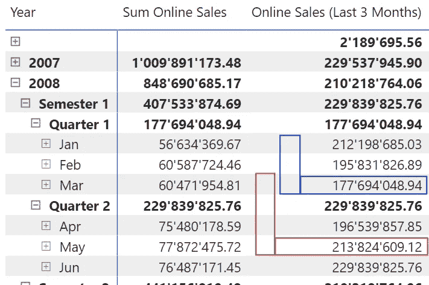

图 8 — 使用 `DATESINPERIOD()` 计算过去三个月的结果（图表由作者提供）

如上图所示，每个月的总和是实际月份加上前两个月的总和。

但要注意：当我们查看单个日期时，结果略有不同：

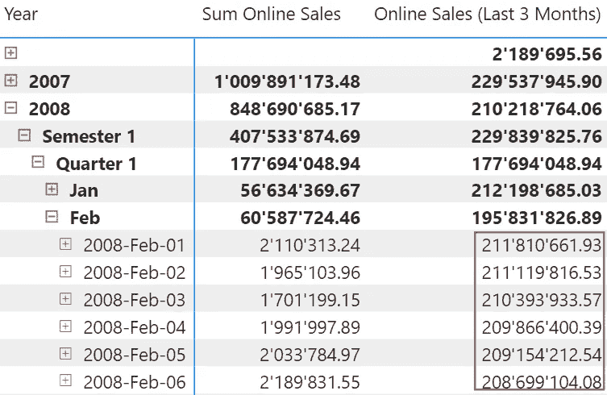

图 9 — 使用 `DATESINPERIOD()` 计算每一天的过去三个月的结果（图表由作者提供）

这是因为该度量值获取每一行的最后日期，并将其作为起点向回“移动”三个月。

因此，当我们查看单个日期时，起点是该特定日期，而不是整个月份。

获取过去三个月总和的一个变体可以是：

```py
Online Sales (Last three Months) v2 =
VAR FirstSelDate = MIN('Date'[Date]) - 1

RETURN
  CALCULATE([Sum Online Sales]
            ,DATESINPERIOD('Date'[Date], FirstSelDate, -3, MONTH)
            )
```

这个度量值返回的结果是从所选周期的第一天减去一天，即上一周期的最后一天的在线销售总和。

我使用了“周期”一词。但我应该使用“间隔”一词，因为根据 [dax.guide](https://dax.guide/)，我可以使用 `DATESINPERIOD()` 计算天、月、季度和年的间隔。

在下面的情况下：当前月份之前的三个月的销售额。

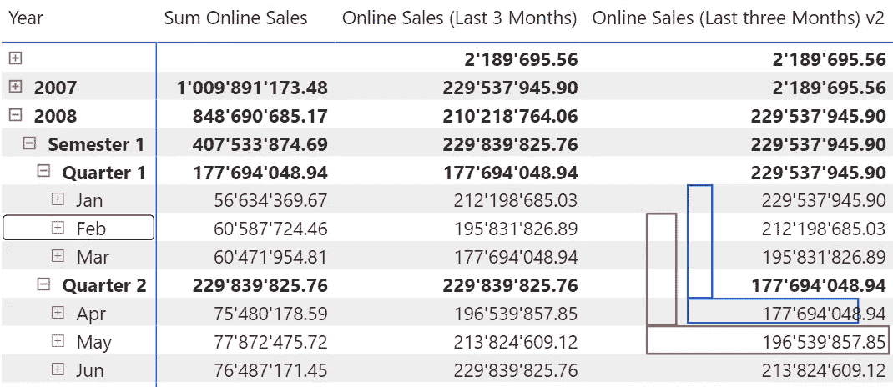

图 10 — 当前周期之前的过去三个月的结果（图表由作者提供）

当观察这些天的结果时，这个度量值返回的结果与第一个度量值相同。

以下变体使用 `DATESBETWEEN()`：

```py
Online Sales Last three Months (DP) =
VAR FirstDateInPeriod = EOMONTH(MIN('Date'[Date]), -3) + 1
VAR LastDateInPeriod = EOMONTH(MAX('Date'[Date]), 0)

RETURN
  CALCULATE([Sum Online Sales]
           ,DATESBETWEEN('Date'[Date], FirstDateInPeriod, LastDateInPeriod)
           )
```

函数 `DATESBETWEEN()` 返回第一个日期和第二个日期之间的日期列表（第二个和第三个参数）。

在这种情况下，我使用 [EOMONTH()](https://dax.guide/eomonth) 函数计算三个月窗口的第一天和最后一天。

结果与 `DATESINPERIOD()` 几乎相同：

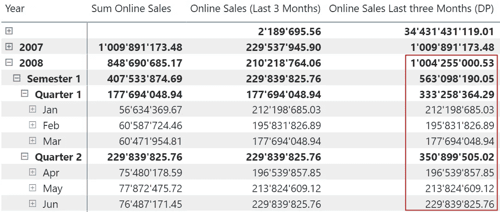

图 11 — 使用 `DATESBETWEEN()` 计算“过去三个月”的结果（图表由作者提供）

但使用 `DATESINPERIOD()` 和 `DATESBETWEEN()` 之间有两个显著的区别：

+   即使在天级别，使用 `DATESBETWEEN()` 时结果也是相同的。

+   但是在月份以上的层级（季度、学期和年）上，结果是错误的。

    这种情况发生是因为度量获取了当前时期的起始和结束日期。在月份以上的层级，这些日期是基于当前层级的日期。

为了解决第二个问题，我们可以将度量更改为以下内容：

```py
Online Sales Last three Months (DP) v2 =
VAR FirstDateInPeriod = EOMONTH(MIN('Date'[Date]), -3) + 1
VAR LastDateInPeriod = EOMONTH(MIN('Date'[Date]), 0)

RETURN
  CALCULATE([Sum Online Sales]
          ,DATESBETWEEN('Date'[Date], FirstDateInPeriod, LastDateInPeriod)
          )
```

这是结果：

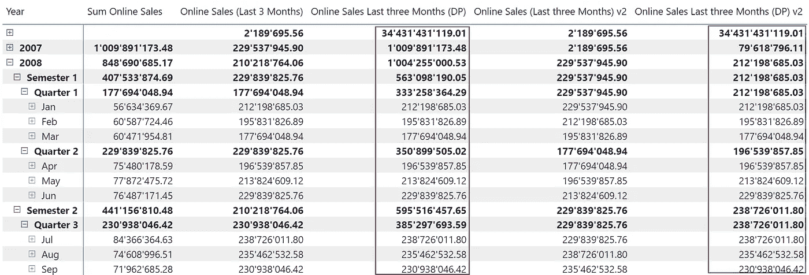

图 12 — 使用 DATESBETWEEN 的“过去三个月”结果 — 第二种变体（作者图示）

我用红色标记了之前的结果，其中年份、学期和季度的结果是错误的，用蓝色标记了新的结果。

在这一点上，你必须决定哪种变体最适合你的需求，因为需求可能因情况而异。

# 为什么要以不同的方式做

那么，我们为什么要考虑不同的方法来计算时间智能结果？

这样做有很多原因。

例如，为了理解不同函数的效果。

所有这些函数返回一个包含一列和日期列表的表格。但不同的函数以略微不同的方式构建这个表格。

因此，现在我们处于更好的位置来满足报告的要求，因为我们知道更多提供所需结果的方法。

此外，我们可以提出不同的解决方案，并挑战我们的利益相关者思考这些方案，找到最适合他们需求的解决方案。

下一个原因是灵活性。

考虑 YTD 的两种变体。虽然 TOTALYTD() 返回正确的结果，但使用第二种变体结合 CALCULATE() 和 DATESYTD() 时，我们更具灵活性，同时性能和效率没有任何损失。

现在我们已经讨论了理解这些度量的不同变体的最后一个原因：性能和效率。

某个特定的计算可能在一种场景中没有问题，但在另一种场景中可能很慢。

因此，知道如何以不同的方式进行计算可能会救命。

例如，“过去三个月”的不同变体虽然效率很高，却会返回不同的结果。我分析了这四种变体，性能非常相似。

# 结论

在探索了不同变体后，我们在计算涉及时间智能函数的结果时拥有了更广泛的工具箱。

鉴于我们可以计算结果的多种方式以及利益相关者对业务逻辑的理解存在很多差异，工具箱越大越好。

但有时，当制定可能的解决方案时，我们必须关注许多细节，因为“魔鬼在于细节”，我们必须考虑用户如何在报告中使用这些度量。

在这里，我仅覆盖了 DAX 中可用的少数时间智能函数。还有许多函数覆盖了特定的需求。我强烈推荐查看 dax.guide 并探索各种可能性。

像往常一样，我在撰写关于这个复杂主题的文章时学到了些细节，希望你也能了解更多。

如果有任何你感兴趣的话题我可以在未来的文章中涵盖，请留下评论。


图片由 [Brett Jordan](https://unsplash.com/@brett_jordan?utm_source=medium&utm_medium=referral) 提供，来源于 [Unsplash](https://unsplash.com/?utm_source=medium&utm_medium=referral)

# 参考文献

SQLBI 文章 [Time Intelligence in Power BI Desktop](https://www.sqlbi.com/articles/time-intelligence-in-power-bi-desktop/) 是关于此主题的非常有用的来源。你可以在那里找到更多有关处理时间智能函数的信息。

我使用 DAX Studio 和内置的 Server Timings 功能分析了性能。要了解更多关于此功能的信息，我建议阅读我关于这个主题的文章：

[](/how-to-get-performance-data-from-power-bi-with-dax-studio-b7f11b9dd9f9?source=post_page-----e795545e2a40--------------------------------) ## 如何从 Power BI 使用 DAX Studio 获取性能数据

### 有时我们会遇到报告加载缓慢的问题，我们需要弄清楚原因。我们将看到如何收集性能数据和…

towardsdatascience.com

我使用了 Contoso 示例数据集，和我之前的文章一样。你可以从微软[这里](https://www.microsoft.com/en-us/download/details.aspx?id=18279)免费下载 ContosoRetailDW 数据集。

Contoso 数据可以在 MIT 许可证下自由使用，详细信息请参见[这里](https://github.com/microsoft/Power-BI-Embedded-Contoso-Sales-Demo)。

我扩大了数据集，以使 DAX 引擎工作得更辛苦。

Online Sales 表包含 7100 万行（而不是 1260 万行），Retail Sales 表包含 1850 万行（而不是 340 万行）。

[](https://medium.com/@salvatorecagliari/subscribe?source=post_page-----e795545e2a40--------------------------------) [## 每当 Salvatore Cagliari 发布新文章时获取电子邮件通知。

### 每当 Salvatore Cagliari 发布新文章时获取电子邮件通知。通过注册，如果你没有 Medium 帐户，你将会创建一个…

medium.com](https://medium.com/@salvatorecagliari/subscribe?source=post_page-----e795545e2a40--------------------------------)
