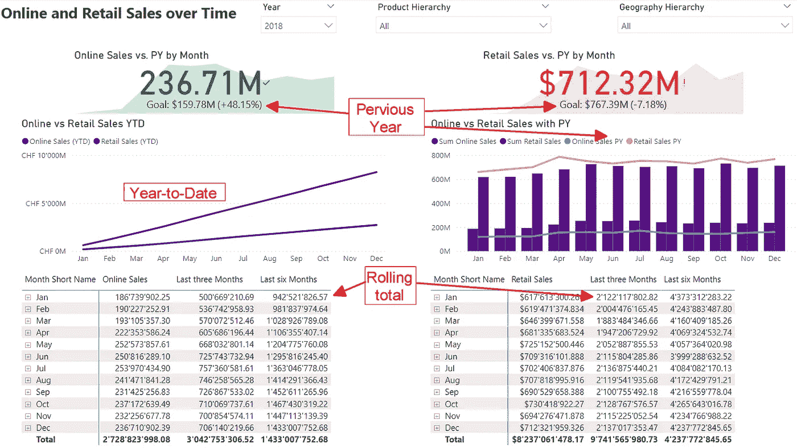

# 探索 DAX 中时间智能的变体

> 原文：[`towardsdatascience.com/explore-variants-of-time-intelligence-in-dax-e795545e2a40?source=collection_archive---------4-----------------------#2023-11-06`](https://towardsdatascience.com/explore-variants-of-time-intelligence-in-dax-e795545e2a40?source=collection_archive---------4-----------------------#2023-11-06)

## *我们在 DAX 中有一些有价值的函数来计算前一年、YTC 等。但其他函数允许我们以不同的方式计算相同的结果。让我们深入探讨这些选项及其重要性。*

 [Salvatore Cagliari](https://medium.com/@salvatorecagliari?source=post_page-----e795545e2a40--------------------------------)

·

[关注](https://medium.com/m/signin?actionUrl=https%3A%2F%2Fmedium.com%2F_%2Fsubscribe%2Fuser%2F39cccb39e92a&operation=register&redirect=https%3A%2F%2Ftowardsdatascience.com%2Fexplore-variants-of-time-intelligence-in-dax-e795545e2a40&user=Salvatore+Cagliari&userId=39cccb39e92a&source=post_page-39cccb39e92a----e795545e2a40---------------------post_header-----------) 发表在 [Towards Data Science](https://towardsdatascience.com/?source=post_page-----e795545e2a40--------------------------------) · 11 分钟阅读 · 2023 年 11 月 6 日 

--

图片由 [Lukas Blazek](https://unsplash.com/@goumbik?utm_source=medium&utm_medium=referral) 提供，来源于 [Unsplash](https://unsplash.com/?utm_source=medium&utm_medium=referral)

# 介绍

当我们查看报告中的数值时，必须给它们赋予意义。

最常见的方法是将它们与上一时期的数值进行比较。

这时，时间智能作为我们在报告中想展示的主要内容之一会发挥作用。

例如，请查看以下报告页面：

图 1 — 示例报告（图示由作者提供）

在这里，你可以看到销售数据与前一年、年度至今以及滚动总值的比较。

这是一个典型的报告，广泛使用了时间智能逻辑。

现在，我将向你展示如何创建测量值来计算这些结果和使用不同 DAX 函数的变体。
