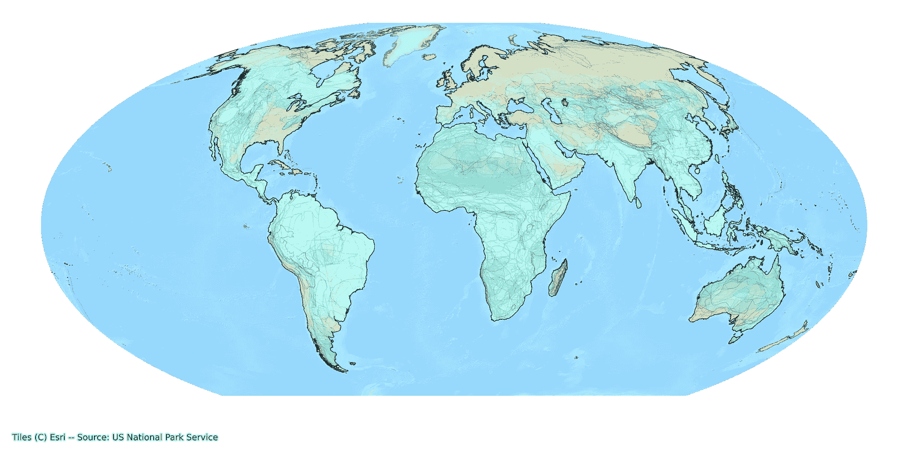

# 探索全球野生动物 GIS 数据库

> 原文：[`towardsdatascience.com/exploring-a-global-wildlife-gis-database-0453723ae5c9?source=collection_archive---------7-----------------------#2023-10-19`](https://towardsdatascience.com/exploring-a-global-wildlife-gis-database-0453723ae5c9?source=collection_archive---------7-----------------------#2023-10-19)

全球哺乳动物栖息地地图，每个区域随机着色。

## 使用 Python 对国际自然保护联盟（IUCN）的地理空间数据库进行特征分析。

 [Milan Janosov](https://medium.com/@janosovm?source=post_page-----0453723ae5c9--------------------------------)

·

[关注](https://medium.com/m/signin?actionUrl=https%3A%2F%2Fmedium.com%2F_%2Fsubscribe%2Fuser%2F838408aa2ad4&operation=register&redirect=https%3A%2F%2Ftowardsdatascience.com%2Fexploring-a-global-wildlife-gis-database-0453723ae5c9&user=Milan+Janosov&userId=838408aa2ad4&source=post_page-838408aa2ad4----0453723ae5c9---------------------post_header-----------) 发表在 [Towards Data Science](https://towardsdatascience.com/?source=post_page-----0453723ae5c9--------------------------------) · 13 min read · 2023 年 10 月 19 日

--

*国际自然保护联盟（IUCN）启动了多个保护野生动物的项目。其中一个项目导致了一个高质量的全球地理空间数据库，包含了超过 100,000 种物种的栖息地。在这篇文章中，我探索了其子集，重点关注陆地哺乳动物。*

IUCN 红色名录濒危物种数据库包含了超过 150,000 个物种，其中 80% 以上的物种有栖息地的地理空间信息。这个数据库的庞大规模提出了几个挑战，我可能会在后续文章中讨论。现在，我专注于一个较小的子集——包含 12,436 条记录的全球数据库，每条记录对应一个物种的栖息地斑块。这个哺乳动物-栖息地数据库基于约四百个不同的来源，包含了 5,626 个通过双名法命名的物种，这些物种在 2008 年到 2022 年间登记。进一步说，数据库还包括详细的分类信息，如物种的目和科。此外，数据库的一个主要优势是它具有详细的栖息地地理空间信息，以多边形文件的形式呈现，我将对此进行更详细的探讨……
