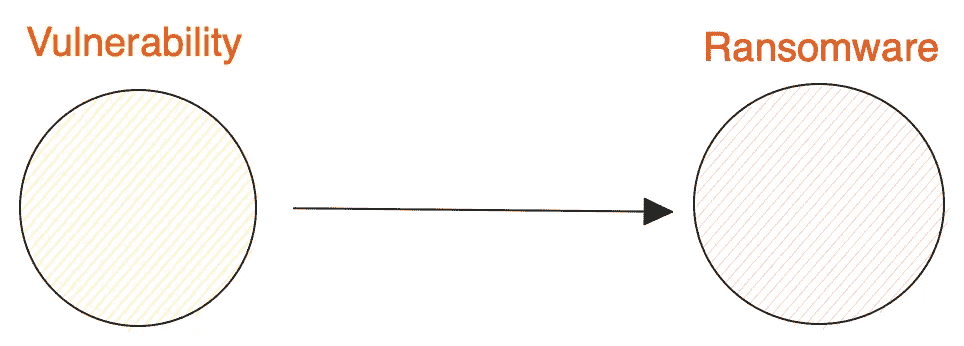
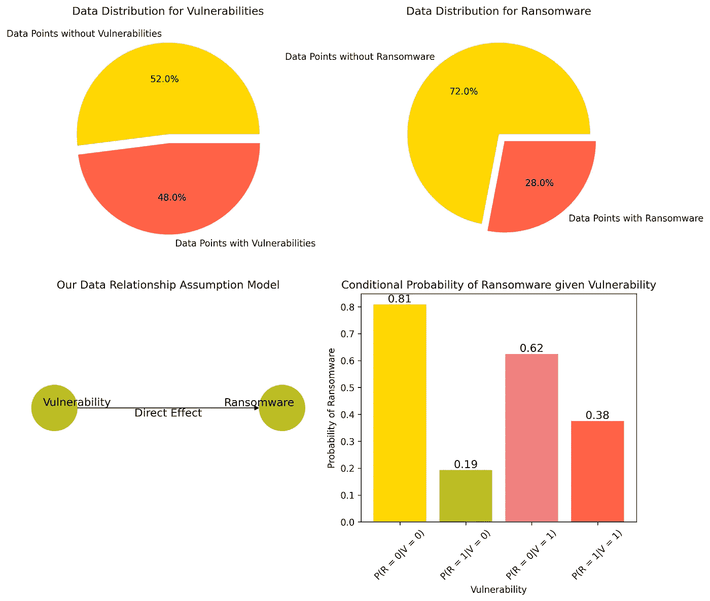
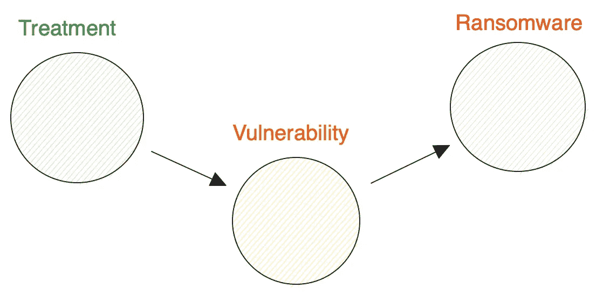
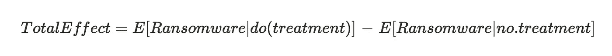
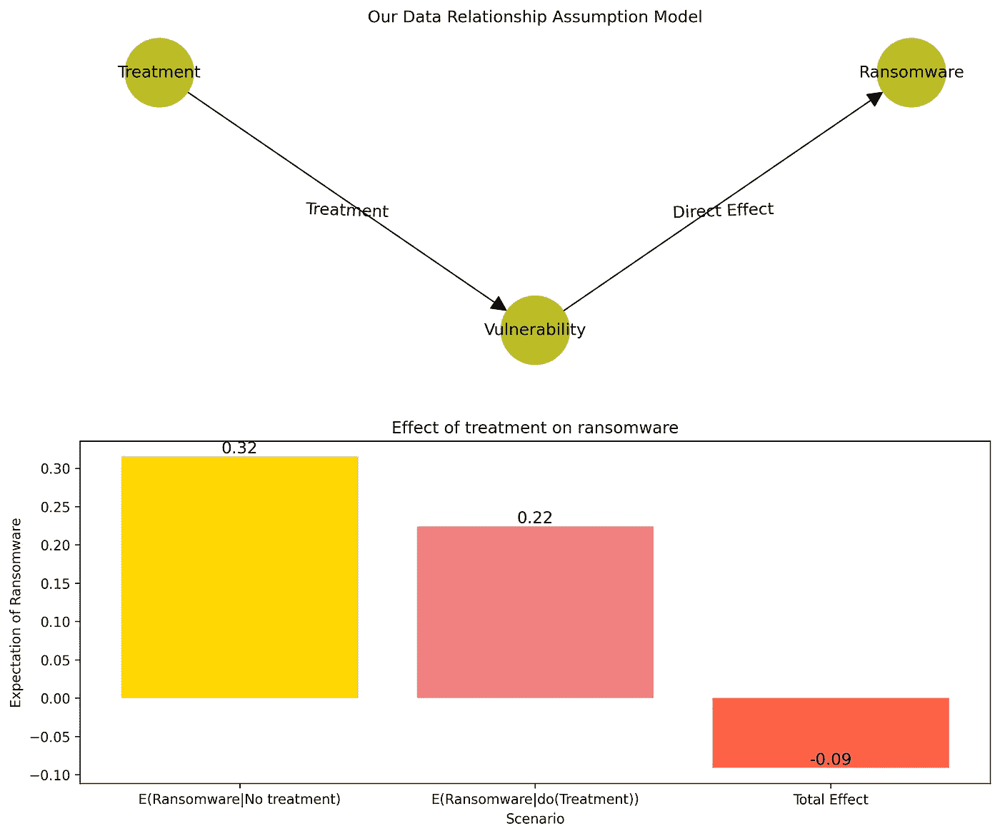

# 探索反事实洞见：从相关性到因果关系的数据分析

> 原文：[`towardsdatascience.com/exploring-counterfactual-insights-from-correlation-to-causation-in-data-analysis-c3ee44d8e777`](https://towardsdatascience.com/exploring-counterfactual-insights-from-correlation-to-causation-in-data-analysis-c3ee44d8e777)

## 反事实在数据科学中的决策制定中的应用

[](https://medium.com/@MahamsMultiverse?source=post_page-----c3ee44d8e777--------------------------------)[](https://towardsdatascience.com/?source=post_page-----c3ee44d8e777--------------------------------) [Maham Haroon](https://medium.com/@MahamsMultiverse?source=post_page-----c3ee44d8e777--------------------------------)

·发表于 [Towards Data Science](https://towardsdatascience.com/?source=post_page-----c3ee44d8e777--------------------------------) ·阅读时间 12 分钟·2023 年 10 月 6 日

--


照片由 [Daniele Franchi](https://unsplash.com/@daniele_franchi?utm_source=unsplash&utm_medium=referral&utm_content=creditCopyText) 拍摄，来源于 [Unsplash](https://unsplash.com/photos/GbAEJUJKJ88?utm_source=unsplash&utm_medium=referral&utm_content=creditCopyText)

想象一下：一个世界里，天空呈现出宁静的柠檬黄色，鸟儿恢复理智，流利地用英语交流，而果树则违抗重力，展示出深紫色和电紫色的叶子，同时随时提供最美味的果实。

然后你会想，终于！这个世界变得有意义了。

嗨，大家好！

让我们回到现实中，但不要担心，因为我们即将踏上一段同样引人入胜的旅程——反事实的世界。虽然我们最初的想象可能是一种愉快的幻想，但反事实打开了另一种奇妙的大门，让我们可以探索我们世界中的“如果”。

“反事实”这个词听起来可能很复杂，但它的意思只是考虑与事实或实际事件相反的情境。尽管这个词本身是在[1946 年](https://www.merriam-webster.com/dictionary/counterfactual#word-history)创造的，但这个思想可以追溯到几个世纪以前，当人们开始思考“如果”情境时。

在心理学中，反事实思维经常被用来探讨那些与已发生事件不同的情境。例如，我们可能会思考，如果一名罪犯有机会选择不同的人生道路，他会做出什么样的选择。

然而，作为数据科学家，我们的关注点不在于犯罪心理学的复杂性。相反，我们感兴趣的是在数据世界中利用反事实的力量。我们的目标是理解数据为何如此呈现，并从中得出有意义的推论。我们的领域是方程式、客观方法以及这些概念在数据世界中的实际应用。

为了进一步探讨这个有趣且富有想象力的概念，让我们深入一个例子。但首先，我们需要提供一些背景信息……

## 用一个引人入胜的情境来设定舞台

想象一个情境，你是一名数据科学家，正在为 MM Securities 工作，这是一家虚构的安全公司，专注于评估系统漏洞。目前，他们正处于争取一个重要客户合同的关键时刻，但出现了一个重要的挑战。客户有一个独特的要求：他们想知道这些漏洞是否是勒索软件攻击的原因之一。他们建议，如果 MM Securities 能够令人信服地证明这些漏洞确实导致了勒索软件攻击，他们将热切参与业务。

这个情况引起了 MM Securities 高级领导层的兴趣，因为他们相信展示因果关系可以为他们的组织带来重大价值。因此，他们向其出色的数据科学团队寻求答案。他们给团队的假设如下：

**“我们评估的特定漏洞的组织面临着更高的勒索软件攻击风险。”**

幸运的是，MM Securities 在成功应对此类挑战方面有着良好的历史记录，并且拥有一个相关的数据集。这是你展现才华的时刻，深入探究问题的核心，揭示潜在的因果关系。凭借你在这个领域的专业知识，你的调查之旅开始了。

## 进行第一个因果假设……

现在你已经开始了调查之旅，你从简单的假设出发，即漏洞对勒索软件攻击有直接影响。



作者提供的图片

更清晰地说明如下：

**自变量或怀疑的原因：** 系统中的漏洞

**因变量或怀疑的效果：** 一次勒索软件攻击

既然我们已经整理好了数据、假设和变量，就该开始验证我们的理论了。

# Python 代码来丰富我们的分析

我们将开始构建一个简单的贝叶斯模型，使用[pgmpy](https://pgmpy.org/models/bayesiannetwork.html)库。此外，为了演示的需要，我们将生成一些合成数据。

我们的合成数据反映出一个相当均匀的分布，大约 50%的实例在其系统中存在漏洞。我们还设计了漏洞的存在与勒索软件攻击发生之间存在一定的正相关。

鉴于此，我们直接进入代码部分。

```py
#Importing packages
from pgmpy.models import BayesianNetwork
from pgmpy.estimators import MaximumLikelihoodEstimator
from pgmpy.inference import VariableElimination
import matplotlib.pyplot as plt
import networkx as nx
import numpy as np
import pandas as pd

num_samples = 500

# Let's Generate synthetic data for vulnerabilities (binary: 0 or 1)
vulnerabilities = np.random.choice([0, 1], num_samples)

ransomware = [1 if np.random.uniform(0, 1) < prob * (v + 1) else 0 for v in vulnerabilities]

data = pd.DataFrame({
'Vulnerability': vulnerabilities,
'Ransomware': ransomware
})

# Designing the Network
model = BayesianNetwork([('Vulnerability', 'Ransomware')])
model.fit(data,estimator=MaximumLikelihoodEstimator)

# Check model for early errors
assert model.check_model()

inference = VariableElimination(model)

# Calculating marginal probabilities
prob_vulnerability = inference.query(variables=['Vulnerability']).values
prob_ransomware = inference.query(variables=['Ransomware']).values

# Calculating conditional probabilities i.e. P(Ransomware | Vulnerability) 
evidence_vulnerability = {'Vulnerability': 1}
prob_ransomware_with_vulnerability = inference.query(variables=['Ransomware'], evidence=evidence_vulnerability)

evidence_no_vulnerability = {'Vulnerability': 0}
prob_ransomware_without_vulnerability = inference.query(variables=['Ransomware'], evidence=evidence_no_vulnerability)

# Visualization
fig, ((ax1, ax2), (ax3, ax4)) = plt.subplots(2, 2, figsize=(12, 10))

# Subplot 1: Data Distribution of Instances with and without vulnerabilities
ax1.pie(
    prob_vulnerability, 
    labels = ['Data Points without Vulnerabilities', 'Data Points with Vulnerabilities'], 
    autopct = '%1.1f%%', colors = ['gold', 'tomato'],
    explode = (0.0, 0.1))
ax1.set_title('Data Distribution for Vulnerabilities')

# Subplot 2: Data Distribution of Instances with and without Ransomware
ax2.pie(
    prob_ransomware, 
    labels = ['Data Points without Ransomware', 'Data Points with Ransomware'], 
    autopct = '%1.1f%%', colors = ['gold', 'tomato'],
    explode = (0.0, 0.1))
ax2.set_title('Data Distribution for Ransomware')

# Subplot 3: NetworkX Showing assumed relationship between the variables
G = nx.DiGraph()

G.add_node('Vulnerability', pos=(-0.8, 0.0))
G.add_node('Ransomware', pos=(0.8, 0.0))
G.add_edge('Vulnerability', 'Ransomware', label='Direct Effect')

node_pos = nx.get_node_attributes(G, 'pos')
edge_labels = nx.get_edge_attributes(G, 'label')

pos = nx.planar_layout(G)
nx.draw_networkx_edge_labels(G, node_pos, 
                             edge_labels = edge_labels, 
                             verticalalignment = 'top',
                             font_size = 12, ax = ax3)
nx.draw_networkx_labels(G, node_pos, 
                        verticalalignment = 'bottom', 
                        font_size = 12, ax = ax3)
nx.draw(G, pos, with_labels = False, node_size = 2500, node_color = 'tab:olive', ax = ax3)
ax3.set_title('Our Data Relationship Assumption Model')

# Subplot 4: Bar chart for conditional probability of Ransomware given Vulnerability
values = [prob_ransomware_without_vulnerability.values[0], 
     prob_ransomware_without_vulnerability.values[1],
     prob_ransomware_with_vulnerability.values[0], 
     prob_ransomware_with_vulnerability.values[1]]
labels = ['P(R = 0|V = 0)', # P(No Ransomware Attack | No Vulnerabilites)
          'P(R = 1|V = 0)', # P(Ransomware Attack | No Vulnerabilites)
          'P(R = 0|V = 1)', # P(No Ransomware Attack | Vulnerabilites)
          'P(R = 1|V = 1)'] # P(Ransomware Attack | Vulnerabilites)
ax4.bar(labels, values, color = ['gold', 'tab:olive', 'lightcoral', 'tomato'])

for i, value in enumerate(values):
    ax4.annotate(f'{value:.2f}', (i, value), ha='center', va='bottom', fontsize=12)

ax4.set_xlabel('Vulnerability')
ax4.set_ylabel('Probability of Ransomware')
ax4.set_title('Conditional Probability of Ransomware given Vulnerability')
ax4.set_xticklabels(labels, rotation=45)

plt.tight_layout()
plt.show()
```

现在，让我们深入探讨可视化以获取更深层次的见解。我们使用[NetworkX](https://networkx.org)库来可视化初始数据分布和我们假设的图形模型。这些可视化揭示了漏洞存在与勒索软件攻击发生之间的明确相关性。

在下图中，我们通过显示勒索软件和漏洞之间的条件概率来说明这种相关性，即。

**P(勒索软件 | 漏洞)**



作者提供的图像

在进一步之前，让我们花点时间理解条件概率。

## 条件概率

条件概率，表示为 P(X|Y)，仅仅表示在发生 Y 的情况下 X 发生的概率。值得注意的是，条件概率并不暗示因果关系或事件顺序；它仅涉及它们之间的相关性。

在大多数情况下，P(X|Y) ≠ P(Y|X)，但这两者都不涉及因果关系，仅仅是概率从每种情况下不同的实例中推导出来。

既然我们已经阐明了这一基本概念，你可能会回忆起统计课上的一句名言：

> 相关性并不等于因果关系。

因此，我们当前的分析，虽然揭示了漏洞存在与勒索软件攻击之间的相关性，但还不足以证明因果关系。

## 那么，因果关系是什么，我们如何定义它，它与反事实有什么关系？

在数据科学中，讨论反事实通常与因果关系、干预和模型可解释性交织在一起。到目前为止，我们仅仅检查了一个现有的数据集以识别相关性，但我们还没有确定这种相关性是否暗示因果关系。

为了探索因果关系，我们从反事实分析开始。让我们考虑[一个可能的反事实情境](https://www.unifyingdatascience.org/html/exercises/exercise_counterfactuals.html)并进行测试：

**可能的反事实：** 如果没有漏洞，是否会有勒索软件？

**可能的反事实声明：** 如果没有漏洞，组织将不会受到勒索软件的影响。

为了建立因果关系，我们需要调查漏洞的移除是否消除了或至少减少了勒索软件的可能性。从理论上讲，这是可能的，但在实践中，通常需要大量时间和复杂的数据收集工作。

在我们继续代码之前，让我们讨论一个将技术分析与因果关系更广泛概念联系起来的关键概念：‘做’操作符。理解这个操作符如何工作对于测试我们的反事实假设至关重要。

## ‘做’微积分与干预

在概率论中，因果关系通常通过干预进行数学表示，使用‘做’操作符。

在我们当前的场景中，我们旨在使用‘do’操作符进行干预：通过处理漏洞并观察对勒索软件攻击的影响。这种干预是**主动**地改变某些东西，引入了**事件序列**的概念，超越了单纯的观察；它允许我们根据漏洞变量的变化来评估对勒索软件变量的影响。

然而，重要的是要承认，在许多实际情况中，由于各种限制和伦理考虑，进行这样的干预是不切实际或不可能的。

现在我们已经阐明了上述概念，让我们进入实际分析。

# Python 中的反事实分析

为了在我们的模型中进行干预，我们引入了一个额外的变量称为‘处理’。在这种情况下，处理意味着对系统中漏洞的处理或修复。我们在这里假设 MM Securities 采取主动措施来解决客户系统中的漏洞。

具体而言，我们假设 MM Securities 对他们服务的大约 60%的组织独立施加这种处理。此外，这种处理在修复漏洞方面大约 90%的时间有效。然而，如果不施加处理，情况不会改变，漏洞的数据分布保持不变。

值得注意的是，这一建模过程需要仔细考虑数据、深刻理解系统以及领域专长，这在使用图形模型时通常是必要的。



图片来源：作者

对于我们分析的下一步，我们可以使用已知的概率在 Python 中轻松编写此模型。幸运的是，[pgmpy](https://pgmpy.org/models/bayesiannetwork.html)提供了一个[TabularCPD](https://pgmpy.org/factors/discrete.html)选项，其中 CPD 代表[条件概率分布](https://brilliant.org/wiki/conditional-probability-distribution/)。

我们的新场景可以总结如下：

我们引入了直接影响漏洞的‘处理’变量。

1.  40%的实例没有接受“处理”：P(do(No Treatment)) = 0.4，而 60%则接受了：P(do(Treatment)) = 0.6。

1.  当没有施加处理时，漏洞的分布保持不变，可以从我们最初的数据中推导出：P(Vulnerability = 0| do(No Treatment)) = 0.52，P(Vulnerability = 1| do(No Treatment)) = 0.48

1.  当施加处理时，无论当前的漏洞数据点如何，90%的情况会导致零漏洞：P(Vulnerability = 0| do(Treatment)) = 0.9，而 10%仍然存在漏洞：P(Vulnerability = 1 | do(Treatment)) = 0.1

我们还从之前的数据中获得了勒索软件和漏洞的条件概率知识，这些知识被纳入了我们的分析：

+   P(Ransomware = 0 | Vulnerability = 0) = 0.80

+   P(Ransomware = 0 | Vulnerability = 1) = 0.56

+   P(勒索软件 = 1| 漏洞 = 0) = 0.20

+   P(勒索软件 = 1| 漏洞 = 1) = 0.44

有了这些信息，我们现在可以继续分析干预的效果。

那么让我们直接进入 Python 实现：

```py
from pgmpy.models import BayesianNetwork
from pgmpy.factors.discrete import TabularCPD
from pgmpy.inference import VariableElimination
import matplotlib.pyplot as plt

# Define Conditional Probability Distributions (CPDs)
cpd_treatment = TabularCPD(variable='Treatment', variable_card=2, values=[[0.4], [0.6]])
cpd_vulnerability = TabularCPD(variable='Vulnerability', variable_card=2, values=[[0.52, 0.9], [0.48, 0.1]],
                            evidence=['Treatment'], evidence_card=[2])
cpd_ransomware = TabularCPD(variable='Ransomware', variable_card=2, values=[[0.80, 0.56], [0.20, 0.44]],
                            evidence=['Vulnerability'], evidence_card=[2])

# Create Network and add CPDs to the model
model = BayesianNetwork([('Treatment','Vulnerability'),('Vulnerability', 'Ransomware')])
model.add_cpds(cpd_treatment ,cpd_vulnerability, cpd_ransomware)

# Check model consistency
assert model.check_model()

inference = VariableElimination(model)

# Caluclating Total Effect of Treatment
evidence_treatment = {'Treatment': 1} 
prob_treatment = inference.query(variables=['Ransomware'], evidence=evidence_treatment)

evidence_no_treatment = {'Treatment': 0}  
prob_no_treatment = inference.query(variables=['Ransomware'], evidence=evidence_no_treatment)

total_effect = prob_treatment.values[1] - prob_no_treatment.values[1]
print('Total Effect of the treatment: ', total_effect)

# Creating Visualization
# 2 Subplots
fig, (ax1, ax2) = plt.subplots(2, 1, figsize=(12, 10))

# Subplot 1: NetworkX Showing treatment on the assumed relationship between the variables
G = nx.DiGraph()

G.add_nodes_from(['Treatment', 'Vulnerability', 'Ransomware'])
pos = {
    'Treatment': (0, 1),
    'Vulnerability': (1, 0),
    'Ransomware': (2, 1),
}

G.add_edge('Vulnerability', 'Ransomware', label='Direct Effect')
G.add_edge('Treatment', 'Vulnerability', label='Treatment')
edge_labels = nx.get_edge_attributes(G, 'label')

nx.draw_networkx_edge_labels(G, pos, 
                             edge_labels = edge_labels, 
                             verticalalignment = 'top',
                             font_size = 12, ax = ax1)

nx.draw(G, pos, with_labels = True, 
        node_size=2500, node_color='tab:olive',
        arrowstyle="-|>,head_width=0.5,head_length=1", ax=ax1)

ax1.set_title('Our Data Relationship Assumption Model')

# Subplot 2: Bar chart for intervention of Ransomware given do(Treatment)

total_effect = prob_treatment.values[1] - prob_no_treatment.values[1]

values = [prob_no_treatment.values[1], 
          prob_treatment.values[1],
          total_effect]

labels = ['E(Ransomware|No treatment)', 
          'E(Ransomware|do(Treatment))', 
          'Total Effect']
ax2.bar(
    labels,
    values, 
    color = ['gold', 'lightcoral', 'tomato']
)

for i, value in enumerate(values):
    ax2.annotate(f'{value:.2f}', (i, value), ha='center', va='bottom', fontsize=12)

ax2.set_xlabel('Scenario')
ax2.set_ylabel('Expectation of Ransomware')
ax2.set_title('Effect of treatment on ransomware')
plt.savefig('treated_plots.png', dpi=300, bbox_inches='tight')

plt.tight_layout()
plt.show()
```

我们进行这项反事实分析的主要目标是确定缺乏漏洞是否会减少勒索软件案件。为此，我们测量了[处理漏洞的总效果](https://www.publichealth.columbia.edu/research/population-health-methods/causal-mediation)对勒索软件事件的影响。

为了测量这种效果，我们计算了[期望值](https://www.statisticshowto.com/probability-and-statistics/expected-value/)在两种情境下的差异：一种是不应用处理，另一种是积极实施处理。



作者提供的图像

在这个情境下，我们的总效果显示为净负值，如图所示。



作者提供的图像

视觉表示清楚地说明了实施处理对减少勒索软件攻击的数量有明显效果。我们观察到，当对漏洞进行处理时，勒索软件事件的净负面效应。

虽然这个结果不能决定性地证明因果关系，但它强烈暗示漏洞是影响勒索软件攻击的一个因素，并且处理漏洞可能会减少这种攻击。

# 反事实及其局限性

我们可以再次强调，相关性不等于因果性。反事实可以通过创建有无干预或处理的情境控制比较来建立因果关系，因此它们有助于评估因果关系。

> 反事实可以被视为评估因果关系泡沫的巧妙方法。在数据科学中，这是一项极其有用的工作。

尽管反事实可能不足以证明因果关系，但因此必须注意几个考虑因素：

1.  在谈论因果关系时，反事实分析在很大程度上依赖于数据的质量和建模过程中所做假设的有效性。

1.  在现实世界中，进行反事实分析可能在实际操作或伦理上都不切实际。

1.  我们还没有谈到可能实际负责的混杂变量。反事实分析不足以处理这些关系，我们必须使用更复杂的工具，如[结构性因果模型](https://ftp.cs.ucla.edu/pub/stat_ser/r350.pdf)来处理这些情境。

1.  与其他统计分析类似，反事实分析应评估统计显著性，以确保观察到的效果不是偶然的。

## 让我们谈谈反事实的一些其他应用……

尽管在这篇文章中，我们仅关注了因果推断中的逆事实，但逆事实的主题过于广泛，难以涵盖。它们通常用于模型解释、风险最小化、A/B 测试、模型中的偏差检测等。

# 总结

虽然这篇文章强调了逆事实在因果推断中的作用，但始终要记住，因果关系和逆事实分析的细微差别往往高度依赖于人为判断以及对领域知识和数据的准确解释。

尽管如此，一般来说，逆事实思维应成为任何假设检验的常规过程。

既然我们已经触及了这一复杂且多方面的主题的表面，你可能迫不及待想要深入探索。虽然我们不能在一篇文章中涵盖所有内容，但我已编制了额外资源，以满足你的好奇心，并深入探索逆事实的世界。

## 其他关于逆事实的精彩资源…

[构建逆事实以用于 sklearn 模型](https://james-brennan.github.io/posts/counterfactuals/?source=post_page-----c3ee44d8e777--------------------------------)

### 逆事实提供了一种模型无关的方法，使黑箱机器学习算法变得可解释和…

[GitHub - MaheepChaudhary/Causation-inComputerVision: 该代码库包含关于因果关系的论文列表，以及相关技术如何被用来进一步提升深度…](https://github.com/MaheepChaudhary/Causation-inComputerVision?source=post_page-----c3ee44d8e777--------------------------------)

### 该代码库包含关于因果关系的论文列表，以及相关技术如何被用来进一步提升深度…

[干预与逆事实之间的区别](https://github.com/MaheepChaudhary/Causation-inComputerVision?source=post_page-----c3ee44d8e777--------------------------------)

### 介绍

[Counterfactuals vs Interventional: The article provides an in-depth comparison](https://vanamsterdam.github.io/posts/2021-07-25-counterfactualvsinterventional?source=post_page-----c3ee44d8e777--------------------------------)

## 不要忘记阅读我其他一些引人入胜的文章！

[P-值：用通俗语言理解统计显著性](https://james-brennan.github.io/posts/counterfactuals/?source=post_page-----c3ee44d8e777--------------------------------)

### 选择通往显著结果的路径

[超越条形图：使用 Sankey、圆形打包和网络图的数据](https://towardsdatascience.com/p-values-understanding-statistical-significance-in-plain-language-41a00ff68f23?source=post_page-----c3ee44d8e777--------------------------------)

### 非传统可视化：何时以及何时不使用它们的力量

towardsdatascience.com

随时在评论中分享你的想法。
