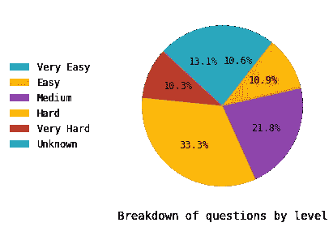
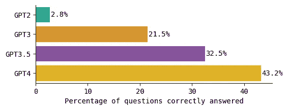
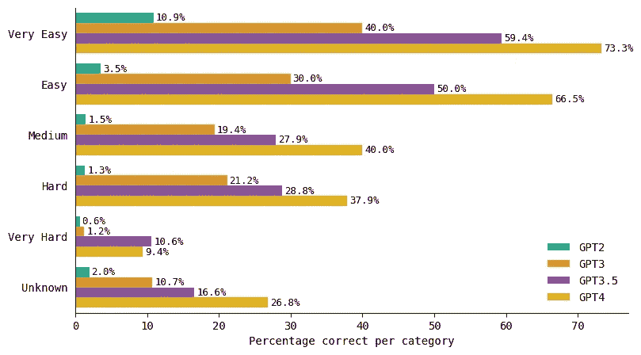
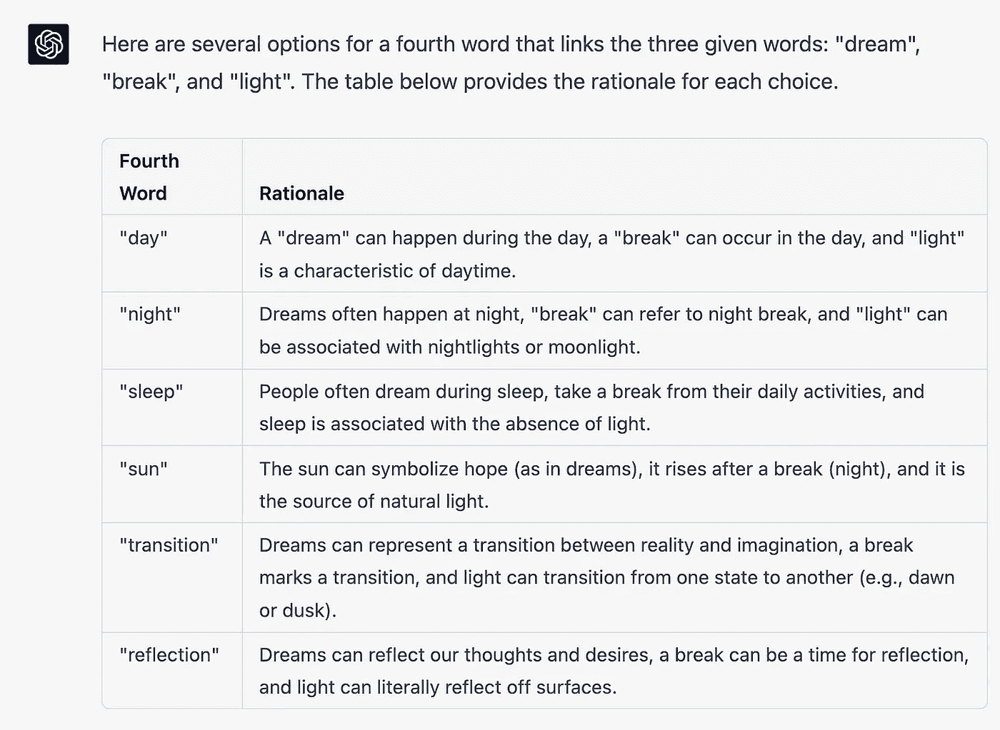
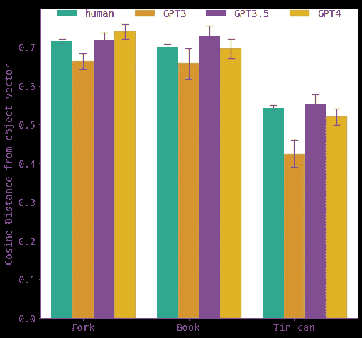
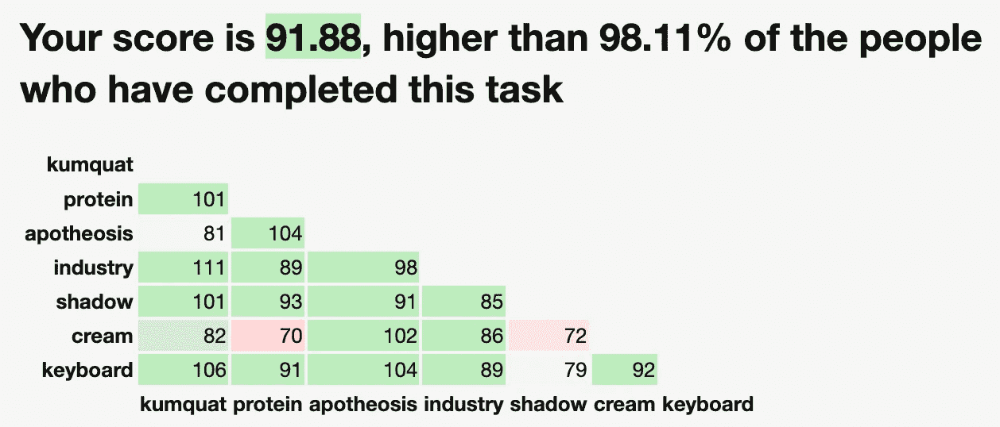
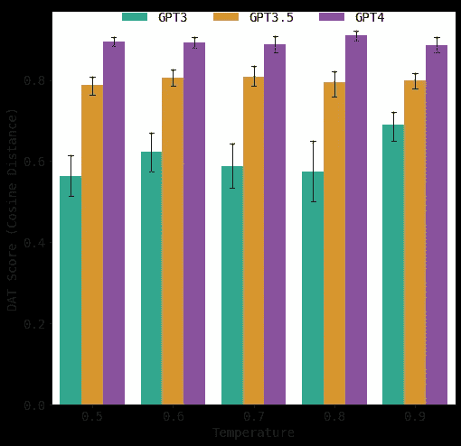
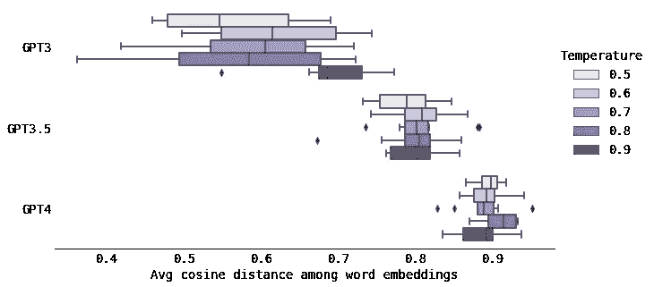
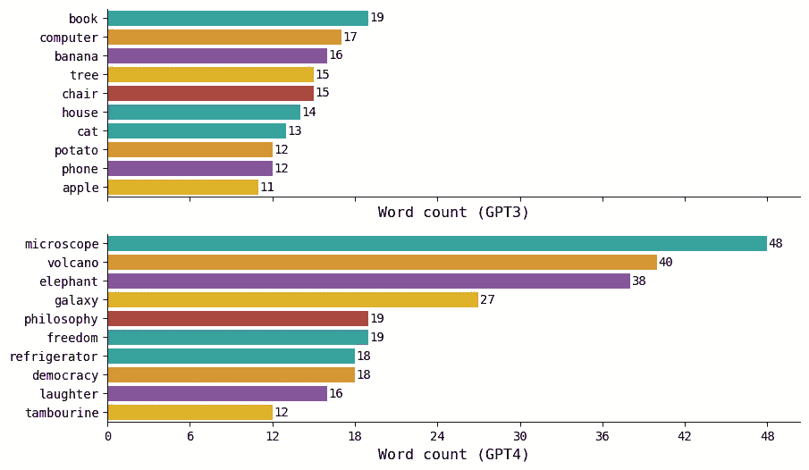
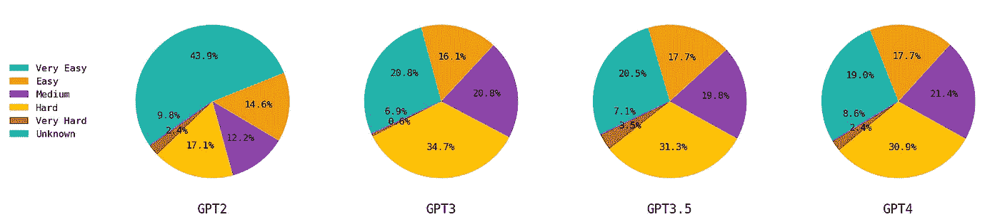

# æ¢ç´¢å¤§å‹è¯­è¨€æ¨¡å‹ä¸­çš„åˆ›é€ åŠ›ï¼šä» GPT-2 到 GPT-4

> åŸæ–‡ï¼š[`towardsdatascience.com/exploring-creativity-in-large-language-models-from-gpt-2-to-gpt-4-1c2d1779be57`](https://towardsdatascience.com/exploring-creativity-in-large-language-models-from-gpt-2-to-gpt-4-1c2d1779be57)

## 通过创造力测试分æ大å‹è¯­è¨€æ¨¡å‹ä¸­åˆ›æ„过程的演å˜

[](https://medium.com/@artfish?source=post_page-----1c2d1779be57--------------------------------)[](https://towardsdatascience.com/?source=post_page-----1c2d1779be57--------------------------------) [Yennie Jun](https://medium.com/@artfish?source=post_page-----1c2d1779be57--------------------------------)

·å‘è¡¨äº [Towards Data Science](https://towardsdatascience.com/?source=post_page-----1c2d1779be57--------------------------------) ·阅读时间 21 分钟 ·2023 å¹´ 4 月 11 æ—¥

--


Midjourney 设想中的创造力。由作者生æˆã€‚

*本åšå®¢æœ€åˆå‘布äº* [`www.artfish.ai/p/exploring-creativity-in-large-language`](https://www.artfish.ai/p/exploring-creativity-in-large-language)

最近几周，人们使用大å‹è¯­è¨€æ¨¡å‹ï¼ˆLLMs）生æˆäº†å„ç§åˆ›æ„内容，如 [书ç±](https://www.reuters.com/technology/chatgpt-launches-boom-ai-written-e-books-amazon-2023-02-21/)ã€[é—ªå°è¯´](https://blog.yenniejun.com/p/creative-writing-with-gpt-3-from)ã€[说唱对决](https://twitter.com/mehran__jalali/status/1639846978850021377?lang=en) å’Œ 音ä¹å’Œå¼¦ã€‚但是å¦æœ‰å¯èƒ½æ›´å¹¿æ³›åœ°è¡¡é‡è¿™äº›æ¨¡å‹ä¸­çš„创æ„过程水平？

人类创造力长期以æ¥ä¸€ç›´å¸å¼•ç€å¿ƒç†å­¦å®¶å’Œç ”究人员。[自 1950 年代起](https://www.ideatovalue.com/podc/nickskillicorn/2021/04/the-1950-speech-that-started-creativity-research/)，研究人员创建了一系列测试，以比较个人的创造力表ç°å’Œæ½œåŠ›ã€‚虽然没有å•ä¸€æµ‹è¯•èƒ½å®Œå…¨æ•æ‰åˆ›é€ åŠ›ï¼Œä½†è¿™äº›æµ‹è¯•å°è¯•æµ‹é‡å’Œé‡åŒ–å…¶ä¸åŒæ–¹é¢ã€‚

在这篇文章中，我分æ了 2019 年到 2023 å¹´é—´ GPT 模å‹åœ¨æµ‹é‡ä¸¤ç§åˆ›é€ åŠ›çš„测试中的表ç°ï¼šæ”¶æ•›æ€§ï¼ˆå­˜åœ¨å•ä¸€æ­£ç¡®è§£å†³æ–¹æ¡ˆï¼‰å’Œå‘散性（开放å¼ï¼›å¯èƒ½å­˜åœ¨å¤šç§è§£å†³æ–¹æ¡ˆï¼‰[1]。这些测试包括：

+   用一个第四个è¯å°†ä¸‰ä¸ªçœ‹ä¼¼ä¸ç›¸å…³çš„è¯è¿æ¥èµ·æ¥ï¼ˆ[远程è”想测试](https://en.wikipedia.org/wiki/Remote_Associates_Test)）

+   生æˆå°½å¯èƒ½å¤šçš„日常物å“的替代用途（[替代用途任务](https://en.wikipedia.org/wiki/Guilford%27s_Alternate_Uses)）

+   命åå个尽å¯èƒ½ä¸åŒçš„åè¯ï¼ˆ[å‘æ•£è”想任务](https://en.wikipedia.org/wiki/Divergent_Association_Task)）

通过这些分æ，我专注äºä»æ—©æœŸçš„ GPT-2 模å‹åˆ°æœ€æ–°çš„ GPT-4 模å‹çš„性能å˜åŒ–。我使用了主观和客观的视角æ¥ç†è§£è¿™äº›æ¨¡å‹çš„行为。通常，较新的模å‹åœ¨æ‰€æœ‰åˆ›é€ æ€§ä»»åŠ¡ä¸Šè¡¨ç°æ›´å¥½ï¼Œå°½ç®¡æˆ‘å‘ç°äº†ä¸€äº›ä¾‹å¤–情况，其中在测试有“正确â€ç­”案时，较简å•çš„ GPT-2 模å‹è¶…越了更新的 GPT-4 模å‹ã€‚在å¯èƒ½çš„情况下，我将 GPT 模å‹ä¸äººç±»åœ¨ç›¸åŒåˆ›é€ æ€§æµ‹è¯•ä¸Šçš„表ç°è¿›è¡Œæ¯”较。

*注æ„：这些å®éªŒçš„目的是测é‡æ¨¡å‹ç”Ÿæˆä¸­çš„创造性过程水平，而ä¸æ˜¯è¯„估模å‹çš„创造力。我并ä¸å£°ç§° GPT 模å‹æˆ–一般的 LLM 具有ä¸äººç±»ç›¸åŒçš„创造性æ€ç»´ã€‚我旨在展示模å‹å¦‚何å“应特定的创造性过程测é‡ã€‚*

# GPT 模å‹çš„å‘展å†ç¨‹

生æˆé¢„训练å˜æ¢å™¨ï¼ˆGPT）模å‹æ˜¯è®­ç»ƒåœ¨å¤§é‡äº’è”网数æ®ä¸Šçš„语言模å‹ï¼Œä»¥æ ¹æ®å‰é¢çš„è¯é¢„测下一个è¯ã€‚虽然最近的 ChatGPT 在过å»å‡ ä¸ªæœˆå¼•èµ·äº†å…¬ä¼—的关注，但 OpenAI çš„ GPT 模å‹ï¼ˆä»¥åŠè¿™äº›æ¨¡å‹èƒŒå的技术）已ç»å­˜åœ¨å‡ å¹´äº†ã€‚

+   GPT-1（2018 年，117M å‚数）。åŸå§‹ GPT 模å‹ã€‚我使用了[HuggingFace 上的开æºç‰ˆæœ¬](https://huggingface.co/openai-gpt)。然而，输出结æœé常无æ„义，所以我没有将它们包å«åœ¨æœ¬æ–‡ä¸­ã€‚

    论文：[通过生æˆé¢„训练æå‡è¯­è¨€ç†è§£](https://cdn.openai.com/research-covers/language-unsupervised/language_understanding_paper.pdf)

+   [GPT-2](https://en.wikipedia.org/wiki/GPT-2#:~:text=Generative%20Pre%2Dtrained%20Transformer%202,by%20OpenAI%20in%20February%202019.)（2019 年，1.5B å‚数）。我使用了[HuggingFace 上的开æºç‰ˆæœ¬](https://huggingface.co/gpt2)。对äºä¸€äº›å®éªŒï¼ŒGPT-2 的输出是无æ„义的，ä¸åˆ©äºç†è§£å…¶è¡Œä¸ºï¼Œæ‰€ä»¥æˆ‘没有将这些结æœåŒ…å«åœ¨ç›¸åº”的分æ中。论文：[语言模å‹æ˜¯æ— ç›‘ç£å¤šä»»åŠ¡å­¦ä¹ è€…](https://d4mucfpksywv.cloudfront.net/better-language-models/language_models_are_unsupervised_multitask_learners.pdf)。

+   [GPT-3](https://en.wikipedia.org/wiki/GPT-3)（2020 年，175B å‚数）。比 GPT-2 大超过 100 å€ã€‚我使用了æ¥è‡ª[OpenAI APIs](https://platform.openai.com/docs/models/gpt-3-5)çš„*text-davinci-002*。

    论文：[语言模å‹æ˜¯å°‘样本学习者](https://arxiv.org/pdf/2005.14165.pdf)

+   GPT-3.5（2022）。虽然 GPT-3.5 有多个版本，我使用的是ä¸åŸç‰ˆ [ChatGPT](https://en.wikipedia.org/wiki/ChatGPT) 相åŒçš„模å‹ï¼Œè¯¥æ¨¡å‹é€šè¿‡å¸¦æœ‰äººå·¥å馈的强化学习进行训练。我使用了æ¥è‡ª [OpenAI APIs](https://platform.openai.com/docs/models/gpt-3-5) çš„ *gpt-3.5-turbo*。

+   [GPT-4](https://arxiv.org/abs/2303.08774)（2023，约 100T å‚数）。我使用了æ¥è‡ª [OpenAI APIs](https://platform.openai.com/docs/models/gpt-3-5) çš„ *gpt-4*。

    论文: [GPT-4 技术报告](https://arxiv.org/pdf/2303.08774.pdf)。

在本文的所有å®éªŒä¸­ï¼Œé™¤éå¦æœ‰è¯´æ˜ï¼Œæˆ‘对æ¯ä¸ªç‹¬ç‰¹çš„æ示调用了æ¯ä¸ª GPT 模å‹äº”次，以考虑其生æˆçš„éšæœºæ€§ã€‚

# 1\. 远程è”想测试：è¿æ¥æ— å…³è¯

远程è”想测试（RAT）是由ç›è·梅德尼克（Martha Mednickï¼‰äº 1962 å¹´å¼€å‘的一ç§åˆ›é€ åŠ›æµ‹è¯• [2]。该测试衡é‡çš„是èšåˆæ€ç»´ï¼Œè¿™æ„味ç€**æ¯ä¸ªé—®é¢˜éƒ½æœ‰ä¸€ä¸ªâ€œæ­£ç¡®â€çš„答案**。

给定三个看似无关的è¯ï¼Œæµ‹è¯•è€…必须找到一个第四个è¯æ¥è¿æ¥è¿™ä¸‰ä¸ªè¯ã€‚例如，“dreamâ€ã€â€œbreakâ€å’Œâ€œlightâ€å¯ä»¥é€šè¿‡â€œdayâ€ï¼ˆdaydream, daybreak, daylight）æ¥è”系。è¯æ±‡â€œsenseâ€ã€â€œcourtesyâ€å’Œâ€œplaceâ€å¯ä»¥é€šè¿‡â€œcommonâ€æ¥è”系。

æˆ‘ä» [远程è”想测试网站](https://www.remote-associates-test.com/) 收集了è¯æ±‡ä¸‰å…ƒç»„。**总共有 312 é“问题**。æ¯ä¸ªé—®é¢˜çš„难度按ä»é常容易到é常困难的等级进行评分。



ä» [测试网站](https://www.remote-associates-test.com/) è·å–çš„éšæœºè”想测试题目分解。由作者创建。

对äºæ¯ä¸ªæ¨¡å‹å’Œæ¯ç»„三个è¯ï¼Œæˆ‘使用了以下æ示模æ¿ã€‚我调用了æ¯ä¸ªæ¨¡å‹ 5 次，以考虑éšæœºæ€§ã€‚

给定三个è¯ã€‚想出一个ä¸å‰ä¸‰ä¸ªè¯éƒ½æœ‰æŸç§å…³è”的第四个è¯ã€‚首先给出答案（“Answerâ€ï¼‰ï¼Œç„¶å解释你的æ¨ç†ï¼ˆâ€œReasonâ€ï¼‰ã€‚

```py
You are given three words. Think of a fourth word that is somehow related to each of the first three words. First give the answer ("Answer") then explain your reasoning ("Reason").Words: {Word1}, {Word2}, {Word3}
```

# 较新的 GPT 模å‹åœ¨è¿œç¨‹è”想上得分更高

我计算了æ¯ä¸ª GPT 模å‹ç”Ÿæˆæ­£ç¡®ç­”案的总体百分比。å¯èƒ½å¹¶ä¸å¥‡æ€ªï¼Œ**模å‹è¶Šæ–°ï¼Œç”Ÿæˆçš„正确答案越多**。



æ¯ä¸ª GPT 模å‹åœ¨è¿œç¨‹è”想测试中正确å›ç­”问题的百分比。由作者创建。

按照问题难度级别分解模å‹è¡¨ç°æ˜¾ç¤ºäº†ç±»ä¼¼çš„趋势：较新的 GPT 模å‹åœ¨æ¯ä¸ªéš¾åº¦çº§åˆ«ä¸Šçš„表ç°å‡ä¼˜äºæ—§æ¨¡å‹ã€‚虽然较新的 GPT 模å‹åœ¨éš¾é¢˜ä¸Šçš„表ç°ä¼˜äºæ—§æ¨¡å‹ï¼Œä½†è¿™ç§æ”¹è¿›æ¯”在简å•é—®é¢˜ä¸Šçš„改进è¦å°‘。这æ„味ç€**å³ä½¿æ˜¯ GPT-4 在困难问题上也感到åƒåŠ›**。



æ¯ä¸ª GPT 模å‹åœ¨è¿œç¨‹è”想测试中按问题难度级别的正确å›ç­”百分比。由作者创建。

æ ¹æ®è¿œç¨‹è”想测试网站，“典å‹çš„人å¯ä»¥è§£å†³å¤§å¤šæ•°æ ‡è®°ä¸ºç®€å•çš„问题，大约一åŠçš„中等难度问题，以åŠå¾ˆå°‘的难问题。†网站上没有分享官方统计数æ®ï¼Œä½†ä»å¿«é€Ÿæµè§ˆæ¥çœ‹ï¼ŒGPT-4 ç¡®å®è§£å†³äº†å¤§çº¦ä¸€åŠçš„中等难度问题和一些难问题，使其æˆä¸ºå”¯ä¸€ä¸€ä¸ªå¤§è‡´å¯ä¸äººç±»æ°´å¹³ç›¸åª²ç¾çš„模å‹ã€‚其他 GPT 模å‹çš„表ç°åˆ™é€Šè‰²äºäººç±»æ°´å¹³ã€‚

# 一些例外：当 GPT-2 å›ç­”正确而 GPT-4 å›ç­”错误

尽管ä¸å¸¸å‘生，但确å®æœ‰ä¸€äº›é—®é¢˜ï¼Œ2019 年的更基础的 GPT-2 模å‹èƒ½å¤Ÿç”Ÿæˆæ­£ç¡®ç­”案，而 2023 å¹´çš„ GPT-4 模å‹å´ä¸èƒ½ã€‚å®é™…上，有 8 个这样的例å­ã€‚（完整列表è§æ–‡ç« æœ«å°¾çš„附录）。

**一个简å•çš„问题**

+   å•è¯ï¼šå°å±‹ / ç –å— / 蛋糕

+   GPT-2：“奶酪†[正确答案]

+   GPT-4：“层â€

**一个中等难度的问题**

+   å•è¯ï¼šçŒ« / æ•°å­— / 电è¯

+   GPT-2：“呼å«â€

+   GPT-4：“拨å·â€

**一个难的问题**

+   å•è¯ï¼šé€šè¿‡ / ç£ç›˜ / 路径

+   GPT-2：“驾驶†[正确]

+   GPT-4：“圆圈â€

**一个é常难的问题**

+   å•è¯ï¼šåœŸåœ° / 手 / 房å­

+   GPT-2：“农场†[正确]

+   GPT-4：“财产â€

请注æ„，对äºæ‰€æœ‰è¿™äº›é—®é¢˜ï¼ŒGPT-4 çš„å›ç­”是 *ä¸* ä¸åˆç†çš„。å®é™…上，如æœäº‹å…ˆä¸çŸ¥é“正确答案，你å¯èƒ½ä¼šè®¤ä¸º GPT-4 的答案åŒæ ·å¯ä»¥å°†è¿™ä¸‰ä¸ªè¯è”系起æ¥ã€‚如æœä½ è¿™æ ·æƒ³ï¼Œä½ å¹¶æ²¡æœ‰é”™ã€‚我将在下一部分讨论这个问题。

# GPT-4 是错误的，还是åªæ˜¯æ€ç»´æ–¹å¼ä¸åŒï¼Ÿ

GPT-4 错误地å›ç­”了超过一åŠçš„问题，但å¯èƒ½æœ‰å……分的ç†ç”±ã€‚我让 GPT-4 解释了æ¯ä¸€ä¸ªç­”案。然å，我查看了它对几个“é常难â€é—®é¢˜çš„解释。

**å•è¯ï¼šè‰ºæœ¯å®¶ / 孵化 / 路线**

+   正确答案：“逃脱â€

+   GPT-4 答案：“地图â€

> “艺术家â€è¿™ä¸ªè¯å¯èƒ½ä¼šè®©äººæƒ³åˆ°åˆ›é€ æŸäº›ä¸œè¥¿ï¼Œç”šè‡³æ˜¯æŸç§è§†è§‰è¡¨ç°å½¢å¼ã€‚地图是一ç§å¸¸è§çš„视觉表ç°å½¢å¼ï¼Œéœ€è¦ä¸€å®šçš„艺术技能æ¥åˆ¶ä½œã€‚
> 
> “孵化â€è¿™ä¸ªè¯å¯ä»¥æŒ‡æ‰“å¼€æŸç‰©æˆ–使æŸç‰©å­˜åœ¨çš„行为。地图是一ç§è“图或计划，通常用äºå¯¼èˆªæ–°é¢†åœŸæˆ–规划行动路线。
> 
> “路线â€è¿™ä¸ªè¯ä¸æ–¹å‘å’Œè¿åŠ¨ç›¸å…³ï¼Œè¿™äº›éƒ½å¯ä»¥åœ¨åœ°å›¾ä¸Šç»˜åˆ¶å’Œè¿½è¸ªã€‚地图å¯ä»¥å¸®åŠ©ä½ ç¡®å®šæ—…行时最佳的路线，并且å¯ä»¥æ供关äºå…¶ä»–人过å»æ‰€èµ°è¿‡è·¯çº¿çš„ä¿¡æ¯ã€‚
> 
> 总的æ¥è¯´ï¼Œâ€œåœ°å›¾â€ä¼¼ä¹æ˜¯ä¸€ä¸ªä¸æœ€åˆçš„三个è¯ç›¸ç¬¦çš„è¯ï¼Œå› ä¸ºå®ƒåŒ…å«äº†è‰ºæœ¯åˆ›ä½œã€è§„划和方å‘，以åŠè¿åŠ¨å’Œå¯¼èˆªçš„概念。

GPT-4 对äºä¸ºä»€ä¹ˆâ€œåœ°å›¾â€æ˜¯ä¸€ä¸ªä¸â€œè‰ºæœ¯å®¶ / 孵化 / 路线â€ç›¸å…³çš„好è¯çš„解释很有说æœåŠ›ã€‚

这是å¦ä¸€ä¸ªä¾‹å­ï¼š

**è¯æ±‡ï¼šfork / dark / man**

+   正确答案：“pitchâ€

+   GPT-4 的答案：“shadowâ€

> “forkâ€è¿™ä¸ªè¯å¯ä»¥ä¸åˆ†è£‚或分支相关è”，比如é“路上的分å‰ã€‚阴影也å¯ä»¥è¢«è§†ä¸ºä¸€ç§åˆ†è£‚，因为它们代表了光的缺失。
> 
> “darkâ€è¿™ä¸ªè¯æŒ‡çš„是光的缺失。当光被物体阻挡时，阴影会形æˆï¼Œä¸”往往会比周围区域显得更暗。
> 
> “manâ€è¿™ä¸ªè¯å¯ä»¥ä¸èº«ä»½æˆ–个体性概念相关è”。阴影也å¯ä»¥ç”¨æ¥è¡¨ç¤ºä¸€ä¸ªäººçš„身份，因为它们å¯ä»¥æ供有关他们形状和大å°çš„线索。
> 
> 因此，“阴影â€ä¼¼ä¹æ˜¯ä¸€ä¸ªå¾ˆå¥½åœ°é€‚应最åˆä¸‰ä¸ªè¯çš„è¯æ±‡ï¼Œå› ä¸ºå®ƒåŒ…å«äº†åˆ†è£‚ã€ç¼ºå¤±å’Œèº«ä»½çš„概念。

这些例å­å±•ç¤ºäº†è¿œç¨‹è”想测试的陷阱，以åŠä¸€èˆ¬æ”¶æ•›åˆ›é€ åŠ›æµ‹è¯•çš„陷阱——å³â€œæ­£ç¡®â€ç­”案å¯èƒ½å¹¶ä¸æ˜¯å”¯ä¸€çš„“对â€çš„答案。在这些情况下，GPT-4 生æˆäº†ä¸€ä¸ªâ€œé”™è¯¯â€çš„答案，但仅仅是因为它没有符åˆä¼ ç»Ÿçš„“正确â€ç­”案。

å®é™…上，如æœæˆ‘让 GPT-4 为一组三个è¯ä¸­çš„第四个è¯è¿›è¡Œå¤´è„‘é£æš´ï¼Œå®ƒèƒ½å¤Ÿç»™å‡ºå¤šä¸ªé€‰é¡¹ï¼Œå¹¶æ供令人信æœçš„答案。



GPT-4 生æˆå¤šä¸ªâ€œæ­£ç¡®â€ç­”案以å›åº”一组三个è¯ã€‚截图由作者æ‹æ‘„。

# GPT-4 答案任æ„生æˆçš„三个è¯ç»„åˆ

GPT 模å‹å¯èƒ½å·²ç»åœ¨å…¶è®­ç»ƒæ•°æ®ä¸­çœ‹åˆ°äº†ä¸€äº›ä¸Šè¿°è¿œç¨‹è”想测试问题。GPT-4 会如何å›åº”ä»»æ„生æˆçš„三个è¯ç»„åˆï¼Ÿåœ¨è¿™ä¸€éƒ¨åˆ†ï¼Œæˆ‘æ„建了我自己的“远程è”想â€æµ‹è¯•ï¼Œå¹¶ä¸»è§‚地评估了输出结æœã€‚

我ä»[10,000 个最常è§çš„英语å•è¯](https://github.com/first20hours/google-10000-english) [3]中éšæœºæŠ½å–了三个å•è¯ï¼Œå¹¶è®© GPT-4 æ供一个将这些å•è¯è”系在一起的第四个å•è¯ã€‚这些三è¯ç»„åˆä¸­çš„一些相当奇怪且ä¸ç›¸å…³ï¼Œä½† GPT-4 总是能找到将它们è”系在一起的方å¼ã€‚我鼓励读者在阅读 GPT-4 的生æˆç»“æœä¹‹å‰å…ˆå°è¯•è¿™äº›ï¼

在查看æ¥ä¸‹æ¥çš„几个例å­å，你å¯ä»¥åšå‡ºå†³å®šâ€”—GPT-4 是在跳出框框æ€è€ƒå—？还是åªæ˜¯å°†ç­”案勉强套入框框？（文章末尾的附录中展示了更长的例å­åˆ—表）。

â›‘ï¸ **å¥åº·**

这个å›åº”显得相当有说æœåŠ›ã€‚我å‘ç°â€œå¥åº·ç›‘测â€çš„定义几ä¹æ˜¯ä»[CDC 公共å¥åº·ç›‘测介ç»](https://www.cdc.gov/training/publichealth101/surveillance.html#anchor_available_materials)网站上é€å­—å¤åˆ¶çš„，这一点很有趣。

> *公共å¥åº·ç›‘测是“对ä¸å¥åº·ç›¸å…³çš„æ•°æ®è¿›è¡ŒæŒç»­ã€ç³»ç»Ÿçš„收集ã€åˆ†æ和解释，这些数æ®å¯¹äºè§„划ã€å®æ–½å’Œè¯„估公共å¥åº·å®è·µè‡³å…³é‡è¦ã€‚†—* 领域æµè¡Œç—…å­¦
> 
> （æ¥è‡ª CDC 网站）

```py
Words: dietary / surveillance / bornAnswer: HealthReason: 
1\. Dietary - A person's diet is directly related to their health, as it can affect their overall well-being, energy levels, and risk for certain diseases.
2\. Surveillance - Health surveillance is the ongoing, systematic collection, analysis, and interpretation of data essential to the planning, implementation, and evaluation of health practice.
3\. Born - When a person is born, their health is of utmost importance, as it can have long-lasting effects on their development, growth, and overall quality of life.
```

**🀠三å¶è‰**

我最åˆå¯¹ GPT-4 çš„å›ç­”感到信æœâ€”—事å®ä¸Šï¼Œè¿™ä¸ªå›ç­”感觉相当èªæ˜ã€‚直到我åšäº†ä¸€ä¸ªå¿«é€Ÿçš„ Google æœç´¢ï¼Œå‘ç°*Trifolium duodecim* 并ä¸å­˜åœ¨ã€‚这是一个[幻觉](https://en.wikipedia.org/wiki/Hallucination_(artificial_intelligence))的例å­ï¼Œå¹»è§‰æ˜¯æŒ‡å¤§å‹è¯­è¨€æ¨¡å‹ç¼–造出ä¸å‡†ç¡®çš„答案的常è§ç°è±¡ã€‚

```py
Words: lucky / field / twelveAnswer: CloverReason: 
1\. Lucky - A four-leaf clover is considered a symbol of good luck.
2\. Field - Clovers are plants that can be commonly found growing in fields.
3\. Twelve - There is a variety of clover known as "Trifolium duodecim" (Twelve-leaf clover), which has 12 leaflets.
```

**â˜•ï¸ æ˜Ÿå·´å…‹**

这个例å­æ˜¯æˆ‘最喜欢的，虽然它跳出了常规æ€ç»´ï¼Œä½†æ„Ÿè§‰æœ‰ç‚¹ç‰µå¼ºã€‚而且这有点æç¬‘ï¼ˆå°¤å…¶æ˜¯å…³äº Patrick 的部分）。

```py
Words: grande / cognitive / patrickAnswer: StarbucksReason: 
1\. Grande: Starbucks uses the term "grande" to refer to one of its medium-sized drinks.
2\. Cognitive: Starbucks is a popular place for people to go to relax, study, and work, which are all activities that require cognitive function.
3\. Patrick: Patrick Dempsey, the actor who played Dr. Derek Shepherd on the television show Grey's Anatomy, is known for his love of coffee and was nicknamed "McDreamy." Starbucks is a well-known coffee shop, so it's possible that his character would have frequented Starbucks.
```

这些例å­å’Œåˆ†æ说æ˜äº†å…·æœ‰å•ä¸€æ­£ç¡®ç­”案的创造力测试å¯èƒ½å­˜åœ¨å±€é™æ€§ã€‚这一局é™æ€§åœ¨æœ¬æ–‡ä¸‹ä¸€éƒ¨åˆ†æ¢è®¨çš„其他测试中得到了补充。

# 2\. 替代用途任务：在普通物å“中寻找æ„义

å¦ä¸€ç§å¸¸è§çš„测é‡åˆ›é€ åŠ›çš„测试是替代用途任务（AUT），由 J. P. Guilford äº 1967 年创建。ä¸è¿œç¨‹è”想测试ä¸åŒï¼Œè¿™ä¸ªæµ‹è¯•æµ‹é‡å‘散性æ€ç»´ï¼Œè¿™æ„味ç€**没有正确答案**。

测试者被è¦æ±‚为一个日常物å“æ供尽å¯èƒ½å¤šçš„åŸåˆ›ç”¨é€”。例如，一个“笔记本电脑â€å¯ä»¥ç”¨ä½œâ€œç›˜å­â€ã€â€œæŠ¤ä½“盾牌â€æˆ–“墙é¢è‰ºæœ¯â€[4]。对这个测试的å›ç­”通过åŸåˆ›æ€§ï¼ˆç”¨é€”çš„ä¸åŒç¨‹åº¦ï¼‰å’Œçµæ´»æ€§ï¼ˆåˆ›æ„的多样性）等指标进行评估。此测试的目的是查看一个人能为普通物å“想出多少ç§é常规用途。

然而，由äºèµ„æºæœ‰é™ï¼Œæˆ‘没有能力在没有人工标注者的情况下生æˆè¿™äº›æµ‹é‡å€¼ã€‚因此，我使用了**创造力的代ç†**，这也是阿姆斯特丹大学的研究人员在[《对 GPT-3 创造力的（替代用途）测试》](https://arxiv.org/pdf/2206.08932.pdf)中使用的方法。

在这篇论文中，研究人员è¦æ±‚人类和 GPT-3（davinci-002）为以下常è§ç‰©å“æ出替代用途：å‰å­ã€é“ç½å’Œä¹¦ç±ã€‚作为衡é‡åˆ›é€ åŠ›çš„代ç†ï¼Œä»–们测é‡äº†*语义è·ç¦»*——å³ç”Ÿæˆçš„用途ä¸åŸå§‹ç‰©å“之间的差异有多大？

我ä»[论文项目网站](https://osf.io/vmk3c/?view_only=)è·å–了人工å›ç­”，以便ä¸äººç±»è¡¨ç°è¿›è¡Œæ¯”较。我使用了以下æ示供 GPT 模å‹ä½¿ç”¨ï¼ŒåŸºäºè®ºæ–‡ä¸­ä½¿ç”¨çš„类似æ示。

> 为以下物å“想出 10 ç§å¯èƒ½è®©äººè§‰å¾—èªæ˜ã€ä¸åŒå¯»å¸¸ã€æœ‰è¶£ã€ä¸å¸¸è§ã€å¹½é»˜ã€åˆ›æ–°æˆ–ä¸ä¼—ä¸åŒçš„创造性用途：{item}

# 嵌入å‘é‡ä¹‹é—´çš„余弦è·ç¦»ä½œä¸ºåˆ›é€ åŠ›çš„代ç†

在自然语言处ç†é¢†åŸŸï¼Œè¯­ä¹‰è·ç¦»ï¼ˆæˆ–[语义相似性](https://en.wikipedia.org/wiki/Semantic_similarity)）是基äºè¯æ±‡åœ¨ç›¸ä¼¼ä¸Šä¸‹æ–‡ä¸­ä¸€èµ·ä½¿ç”¨çš„频ç‡æ¥è¡¡é‡ä¸¤ä¸ªè¯æ±‡ç›¸å…³ç¨‹åº¦çš„代ç†ã€‚例如，“计算机â€å’Œâ€œå±å¹•â€è¿™ä¸¤ä¸ªè¯å¯èƒ½æœ‰è¾ƒçŸ­çš„语义è·ç¦»ï¼Œå› ä¸ºå®ƒä»¬å¸¸å¸¸åœ¨ç›¸åŒçš„上下文中使用，而“计算机â€å’Œâ€œæ‰è±†â€è¿™ä¸¤ä¸ªè¯çš„语义è·ç¦»å¯èƒ½è¾ƒå¤§ï¼Œå› ä¸ºå®ƒä»¬å¾ˆå°‘在相åŒçš„上下文中出ç°ã€‚

为了计算两个è¯çš„语义è·ç¦»ï¼Œæˆ‘使用了ä¸ç ”究人员在[上述论文](https://arxiv.org/pdf/2206.08932.pdf)中使用的相åŒæ–¹æ³•ã€‚我使用了[Spacy](https://spacy.io/models/en) (`en_core_web_lg`)，一个自然语言处ç†åº“，æ¥è®¡ç®—物体（例如“笔记本电脑â€ï¼‰å’Œä½¿ç”¨æ¡ˆä¾‹è¯æ±‡ï¼ˆä¾‹å¦‚“盘å­â€ï¼‰çš„è¯åµŒå…¥ã€‚然å，我使用这两个嵌入之间的余弦è·ç¦»æ¥è®¡ç®—语义è·ç¦»ã€‚

对äºæ›¿ä»£ç”¨é€”任务，**较大的语义è·ç¦»ä¸â€œæ›´å…·åˆ›é€ æ€§â€**的物体使用案例相关。结æœæ˜¾ç¤ºï¼Œå¯¹äºä¸‰ä¸ªç‰©ä½“（å‰å­ã€é”¡ç½å’Œä¹¦ï¼‰ï¼Œäººç±»çš„表ç°é€šå¸¸å¯¼è‡´æ›´é«˜çš„余弦è·ç¦»ï¼ˆå› æ­¤æ›´é«˜çš„è¯­ä¹‰å·®å¼‚ï¼‰ç›¸æ¯”äº GPT-3。然而，也有一些情况下，GPT-3.5 å’Œ/或 GPT-4 达到了或超越了人类创造力的语义è·ç¦»å¾—分。



åŸå§‹è¯æ±‡ä¸æ›¿ä»£ä½¿ç”¨æ¡ˆä¾‹çš„语义è·ç¦»ï¼ˆä½¿ç”¨ä½™å¼¦è·ç¦»æµ‹é‡ï¼‰ã€‚由作者创建。

虽然人类倾å‘äºæ出比 GPT-3 更具创造性的使用案例（使用余弦è·ç¦»ä½œä¸ºåˆ›é€ åŠ›çš„代ç†ï¼‰ï¼ŒGPT-4 的表ç°æ›´æ¥è¿‘äºäººç±»æ°´å¹³ã€‚也就是说，GPT-4 çš„å›åº”生æˆäº†ä¸åŸå§‹é¡¹ç›®ç›¸æ¯”具有较大语义è·ç¦»çš„项目，其水平ä¸äººç±»è¡¨ç°ç›¸ä¼¼ã€‚然而，由äºæ²¡æœ‰å®é™…的人工标注和决定更主观的类别如åŸåˆ›æ€§ã€çµæ´»æ€§å’Œå®ç”¨æ€§ï¼Œè¿™ç§ä½¿ç”¨ä½™å¼¦è·ç¦»çš„é‡åŒ–方法是有é™çš„，因为它åªæµ‹é‡äº† GPT 模å‹åˆ›é€ æ€§è¾“出的一å°éƒ¨åˆ†ã€‚

# 你能分辨出人工生æˆå’Œ AI 生æˆçš„使用案例å—？

列表之一展示了人工生æˆçš„锡ç½æ›¿ä»£ä½¿ç”¨æ¡ˆä¾‹ï¼Œå¦ä¸€ä¸ªåˆ™å±•ç¤ºäº†ç”± GPT-4 生æˆçš„替代使用案例。你能分辨出区别å—？答案在最å。

列表 1：锡ç½çš„用途

+   作为镜å­

+   用æ¥åˆ¶ä½œç©å…·

+   作为艺术å“

+   作为对安迪·沃è·çš„æ醒

+   作为带有ç½å­å¤¹çš„钥匙圈

+   作为ç å®

列表 2：锡ç½çš„用途

+   å¾®å‹é¼“套件

+   å¤æ€ªçš„花盆

+   临时饼干切割器

+   自制è¥ç‚‰

+   异想天开的é£é“ƒ

+   å¾®å‹è‰è¯èŠ±å›­

下一部分的测试也测é‡äº†å‘散性æ€ç»´ã€‚

# 3\. å‘æ•£è”想任务：å个è¯ï¼Œæ²¡æœ‰è¿æ¥

第三个创造力测试是å‘散性è”想任务（DAT），由一组研究人员在 2021 年最近创建[5]。此测试è¦æ±‚命åå个尽å¯èƒ½ä¸åŒçš„åè¯ã€‚显而易è§ï¼Œè¿™é¡¹æµ‹è¯•æ˜¯å‘散性的，而且**没有正确答案**。

有一个[在线测试版本](https://www.datcreativity.com/)。完æˆæµ‹è¯•åªéœ€å‡ åˆ†é’Ÿï¼Œå› ä¸ºå®ƒæ¶‰åŠåˆ—出å个尽å¯èƒ½ä¸ç›¸å…³çš„åè¯ã€‚以下是我ä»ç½‘站上è·å¾—的结æœï¼š



ä»å‘散性è”想任务中截å–çš„å±å¹•æˆªå›¾ã€‚由作者创建。

## DAT 分数

如何计算分数？作者在[这里](https://www.datcreativity.com/faq)æ述了他们的过程。DAT 分数是通过嵌入和余弦è·ç¦»è®¡ç®—的。我对他们的计算分数过程进行了调整[6]：

1.  计算æ¯ä¸ªå•è¯çš„[GloVe](https://nlp.stanford.edu/projects/glove/)嵌入

1.  计算æ¯å¯¹å•è¯ä¹‹é—´çš„余弦è·ç¦»

1.  å–该值的平å‡å€¼

这个过程类似äºåœ¨æ›¿ä»£ç”¨é€”任务中计算创造力代ç†åˆ†æ•°çš„方法，唯一的区别是使用了ä¸åŒçš„å•è¯åµŒå…¥æ¨¡å‹ã€‚

## 比较ä¸åŒæ¨¡å‹ä¹‹é—´çš„差异

我用æ¥æ示 GPT 模å‹çš„以下æ示语å–自[DAT 网站](https://www.datcreativity.com/task)。

```py
Please enter 10 words that are as different from each other as possible, in all meanings and uses of the words.Rules
- Only single words in English.
- Only nouns (e.g., things, objects, concepts).
- No proper nouns (e.g., no specific people or places).
- No specialized vocabulary (e.g., no technical terms).
- Think of the words on your own (e.g., do not just look at objects in your surroundings).
```

我没有在下é¢çš„结æœä¸­åŒ…括 GPT-2，因为 GPT-2 生æˆçš„输出是乱ç ã€‚（你å¯ä»¥åœ¨æ–‡ç« æœ«å°¾çš„附录中看到一个示例）。

结æœæ˜¾ç¤ºï¼Œæ¯ä¸ªæ›´æ–°çš„æ¨¡å‹ DAT 分数都æ高了。这æ„味ç€åæ¥çš„模å‹åœ¨ç”Ÿæˆå°½å¯èƒ½è¯­ä¹‰ä¸åŒçš„ 10 个å•è¯æ–¹é¢è¡¨ç°æ›´å¥½ã€‚



按照余弦è·ç¦»æµ‹é‡çš„ä¸åŒæ¨¡å‹çš„å‘散性è”想测试分数。由作者生æˆã€‚

例如，以下是 GPT-3 生æˆçš„列表，其分数为 0.36：

```py
dusk, night, day, dawn, morning, afternoon, evening, midnight, twilight
```

å¦ä¸€æ–¹é¢ï¼Œä»¥ä¸‹æ˜¯ GPT-4 生æˆçš„列表，其分数为 0.95：

```py
elephant, microscope, sandcastle, galaxy, harmony, spatula, glacier, philosophy, tambourine, drought
```

æ ¹æ®[ä»‹ç» DAT 测试的论文](https://www.pnas.org/doi/10.1073/pnas.2022340118)，分数通常在 65 到 90 之间，平å‡åœ¨ 75 到 80 之间。95 的分数被认为é常高。

上图中需è¦æ³¨æ„的是，GPT-4 的误差æ¡è¿œå°äº GPT-3 的。这一点在下一个å®éªŒä¸­ä¼šæ›´åŠ æ¸…晰，我在å®éªŒä¸­é€šè¿‡è°ƒæ•´â€œæ¸©åº¦â€å‚æ•°æ¥æ”¹å˜æ¯ä¸ª GPT 模å‹ç”Ÿæˆå†…容的éšæœºæ€§ã€‚

æ¸©åº¦æ˜¯ä¸€ä¸ªä»‹äº 0 å’Œ 1 之间的值，æ¥è¿‘ 0 的值最具å¯é¢„测性，æ¥è¿‘ 1 的值则最为éšæœºã€‚我å°è¯•äº†ä»‹äº 0.5 å’Œ 0.9 之间的温度值，æ¯æ¬¡é€’å¢ 0.1（在之å‰çš„å®éªŒä¸­ï¼Œæˆ‘将温度ä¿æŒåœ¨ 0.7，这是默认值）。我期望更高温度值会带æ¥æ›´å¤šçš„å˜åŒ–，而较ä½çš„温度则会更一致。

然而，结æœæ˜¾ç¤ºæ¸©åº¦å¯¹è¯­ä¹‰è·ç¦»å˜å¼‚性的影å“ä¸å¦‚模å‹æœ¬èº«é‡è¦ã€‚å¯¹äº GPT-3 而言，尽管有温度的影å“，æ¯ç»„ 10 个è¯çš„ DAT 得分å˜åŒ–å¾ˆå¤§ã€‚è€Œå¯¹äº GPT-4 而言，尽管有温度的影å“，DAT 得分在一个å°èŒƒå›´å†…ä¿æŒäº†é«˜åº¦ä¸€è‡´ï¼Œå˜åŒ–é常å°ã€‚



按模å‹ç±»å‹å’Œæ¸©åº¦åˆ†æ•°åˆ†å¼€çš„è¯åµŒå…¥çš„å¹³å‡ä½™å¼¦è·ç¦»ã€‚作者创建。

ä¸€æ—¦æˆ‘æŸ¥çœ‹äº†ä¸‰ç§ GPT 模å‹ç”Ÿæˆçš„å®é™…文本，这一点å˜å¾—更加清晰。**GPT-4 在生æˆè¯æ±‡æ—¶çš„å˜å¼‚性远ä½äº GPT-3。** ä»æŸç§ç¨‹åº¦ä¸Šè¯´ï¼Œæ„Ÿè§‰ GPT-4 ä¼¼ä¹å·²ç»çŸ¥é“了一个应该没有正确答案的任务的“正确答案â€ã€‚

汇总所有温度分数的å“应，我让æ¯ä¸ªæ¨¡å‹ç”Ÿæˆ 10 个è¯æ±‡çš„列表 50 次。然å，我查看了ä¸åŒè¯æ±‡åœ¨æ‰€æœ‰ 50 次è¿è¡Œä¸­çš„出ç°é¢‘ç‡ã€‚值得注æ„的是，GPT-3 最常生æˆçš„è¯æ˜¯ book，出ç°äº† 50 次中的 19 次 = 38%。å¦ä¸€æ–¹é¢ï¼ŒGPT-4 最常生æˆçš„è¯æ˜¯æ˜¾å¾®é•œï¼Œå‡ºç°äº†**48/50=96%**。



æ¯ä¸ªæ¨¡å‹ä¸º DAT 测试生æˆçš„顶级è¯æ±‡ï¼ˆæ ¹æ®æ¸©åº¦åˆ†æ•°æ±‡æ€»ï¼‰ã€‚ç”±è¯æ±‡åˆ›å»ºã€‚

这验è¯äº† GPT-3 在生æˆè¯æ±‡æ—¶ç¡®å®æ¯” GPT-4 æ›´å…·å˜å¼‚性，而 GPT-4 则采å–了更为ä¿å®ˆçš„策略，预测了许多它知é“会在“多样化è¯æ±‡â€ä»»åŠ¡ä¸­å¾—高分的è¯æ±‡â€”—如显微镜ã€ç«å±±ã€å¤§è±¡å’Œé“¶æ²³ã€‚

这一å‘ç°å±•ç¤ºäº† GPT-4 ä¼¼ä¹å·²ç»â€œç ´è§£äº†ç”Ÿæˆå¤šæ ·åŒ–è¯æ±‡çš„密ç â€ã€‚如æœæ˜¯è¿™æ ·ï¼Œæˆ‘ä¸ç¡®å®šæ˜¯å¦å¯ä»¥è‡ªä¿¡åœ°è¯´ GPT-4 的创造力更高，还是它已ç»æ‰¾åˆ°äº†ä¸€ä¸ªâ€œå¦‚何最好地ç©è¿™ä¸ªç‰¹å®šæ¸¸æˆâ€çš„局部最优解。

# 结论

> *“我们å¯ä»¥è®¾æƒ³ä¸€ä¸ªæœªæ¥ï¼Œåœ¨è¿™ä¸ªæœªæ¥ä¸­ï¼ŒGPT-3 和其他生æˆå‹ LLMs çš„å“应无法ä¸äººç±»åŒºåˆ†ï¼Œå°½ç®¡åˆ›é€ åŠ›è¿‡ç¨‹å°†ä¼šä¸åŒã€‚â€*
> 
> — æ¥è‡ª* [*GPT-3 创造力的å¦ç±»ç”¨é€”测试*](https://arxiv.org/abs/2206.08932)

使用有é™çš„文本基础测试准确衡é‡å¦‚æ­¤å¤æ‚多é¢çš„创造力是具有挑战性的。虽然åƒ[视觉远程è”想测试](https://www.frontiersin.org/articles/10.3389/fpsyg.2020.00026/full)这样的测试通过加入视觉元素æ¥å°è¯•è§£å†³è¿™ä¸ªé—®é¢˜ï¼Œä½†è¿™äº›è¯„ä¼°ä»ç„¶å­˜åœ¨å›ºæœ‰çš„å±€é™æ€§ã€‚具有“正确答案â€çš„èšåˆæµ‹è¯•ï¼ˆä¾‹å¦‚远程è”想测试）å¯èƒ½ä¸ä¼šæ€»æ˜¯å¥–励最具创造性或正确的解决方案。å¦ä¸€æ–¹é¢ï¼Œæ²¡æœ‰ç‰¹å®šæ­£ç¡®ç­”案的å‘散测试（例如å‘æ•£è”想测试）ä¾èµ–äºä¸å®Œç¾çš„è¯åµŒå…¥ï¼Œå¹¶ä¸”å¯èƒ½åŒ…å«å差。

此外，GPT 模å‹åœ¨è¿™äº›æµ‹è¯•ä¸­çš„表ç°å¯èƒ½ä¼šå—到训练过程中对任务的暴露影å“，å¯èƒ½å¯¼è‡´æ•°æ®é‡å ã€‚例如，GPT-4 在å‘æ•£è”想测试中的表ç°å±•ç¤ºäº†å•è¯çš„特殊é‡å¤ï¼Œè¡¨æ˜å®ƒå¯èƒ½æå‰äº†è§£äº†â€œæ­£ç¡®â€çš„答案。开å‘替代测试方法至关é‡è¦ï¼Œå› ä¸ºæœ‰[å…³äº GPT-4 æ¥å—测试数æ®è®­ç»ƒçš„ä¼ é—»](https://www.reddit.com/r/MachineLearning/comments/124eyso/n_openai_may_have_benchmarked_gpt4s_coding/)，特别是在编ç ä»»åŠ¡ä¸­ã€‚

尽管有这些局é™æ€§ï¼Œåˆ›é€ åŠ›æµ‹è¯•ä»ç„¶å¯ä»¥ä½œä¸ºæ¯”较和跟踪大å‹è¯­è¨€æ¨¡å‹è¡¨ç°çš„有价值基准。未æ¥çš„研究å®éªŒå¯ä»¥åœ¨å…¶ä»–语言中é‡å¤æœ¬æ–‡ä¸­çš„å®éªŒï¼Œä»¥è¯„ä¼° GPT 模å‹åœ¨è¯­è¨€é¢†åŸŸçš„创造力。这样，我们å¯ä»¥è·å¾—对 AI 生æˆå†…容的更全é¢ç†è§£ï¼Œå¹¶è¿›ä¸€æ­¥æ¢ç´¢è¿™äº›å…ˆè¿›è¯­è¨€æ¨¡å‹çš„能力和局é™æ€§ã€‚

*感谢阅读这篇文章ï¼*

# 附录

# 远程è”想测试：GPT 模å‹æ­£ç¡®å›ç­”的问题比较

我们å¯ä»¥æŸ¥çœ‹æ¨¡å‹æ­£ç¡®å›ç­”çš„æ¯ä¸ªé—®é¢˜çš„难度级别分解。我们å¯ä»¥çœ‹åˆ° GPT3ã€GPT3.5 å’Œ GPT4 在å›ç­”难题的能力上相似。



# GPT-2 答对的远程è”想和 GPT-4 答错的部分

```py
Words:  cat / number / phone
Level:  Medium
Answer: call
GPT2:   call 
GPT4:   dialWords:  land / hand / house
Level:  Very Hard
Answer: farm
GPT2:   farm 
GPT4:   propertyWords:  water / pen / soda
Level:  Unknown
Answer: fountain
GPT2:   fountain 
GPT4:   liquidWords:  measure / worm / video
Level:  Very Easy
Answer: tape
GPT2:   tape 
GPT4:   lengthWords:  cottage / brick / cake
Level:  Very Easy
Answer: cheese
GPT2:   cheese 
GPT4:   layerWords:  through / disk / way
Level:  Hard
Answer: drive
GPT2:   drive 
GPT4:   circleWords:  skunk / kings / boiled
Level:  Very Easy
Answer: cabbage
GPT2:   cabbage 
GPT4:   smellWords:  jump / kill / bliss
Level:  Hard
Answer: joy
GPT2:   joy 
GPT4:   height
```

# GPT-4 对éšæœºç”Ÿæˆçš„远程è”想测试问题的å›ç­”

这里是 GPT-4 为几个éšæœºç”Ÿæˆçš„远程è”想测试问题生æˆçš„输出。

**戒指**

这个感觉有点勉强。如æœä½ å¯¹ä½ çš„感情生活感到é常åŒå€¦ï¼Œæˆ‘å¯ä»¥æ¥å—å…³äºæˆ’指是“å¤æ‚性象å¾ï¼Œå°¤å…¶æ˜¯åœ¨å…³ç³»ä¸­çš„â€é‚£éƒ¨åˆ†ã€‚但最å的部分感觉有点生硬。

```py
Words: complications | saturn | drops
Answer: Rings
Reason: 
1\. Complications: Rings can be a symbol of complications, especially in relationships, as they represent commitment and the complexities that come with it.
2\. Saturn: Saturn is famously known for its beautiful and prominent rings, made primarily of ice particles and some rocky debris.
3\. Drops: A ring can be seen as a drop or loop of material, such as metal or plastic, that forms a complete circle.
```

**é©å‘½ã€‚** [蒙特å¡è¥¿è¯º](https://en.wikipedia.org/wiki/Monte_Cassino)ç¡®å®æ˜¯ä¸€ä¸ªçœŸå®çš„地方，二战期间确å®é­åˆ°è½°ç‚¸ã€‚

```py
Words: belfast | movement | monte
Answer: Revolution
Reason: 
1\. Belfast is a city in Northern Ireland that has experienced significant political and social changes due to the Irish Republican movement. 
2\. Movement is a general term that can describe political and social changes, often caused by revolutions. 
3\. Monte is likely referring to Monte Cassino, a historic site in Italy where a significant battle occurred during World War II, which was a time of global revolution and change. 
```

```py
Therefore, the word "revolution" is related to each of the first three words as it represents significant change and upheaval.
```

**帮助。** 通过帮助中心将“å—安普顿â€è¿™åº§åŸå¸‚ä¸â€œå¸®åŠ©â€è¿æ¥èµ·æ¥çš„有趣方å¼â€¦â€¦

```py
Words: ensures | assistant | southampton
Answer: Help
Reason: 
1\. Ensures: "Help" is related to "ensures" as it is an action that can ensure the success or completion of a task.
2\. Assistant: "Help" is related to "assistant" because an assistant provides help in various tasks and activities.
3\. Southampton: "Help" is related to "Southampton" as Southampton is a city in England which has various help centers and services, such as the Southampton Voluntary Services, providing assistance to the community.
```

**互è”网。** 我认为它的论点是相当正确的。

```py
Words: uruguay | accessible | requirement
Answer: Internet
Reason: Uruguay has a government initiative called Plan Ceibal, which aims to make the Internet accessible to all its citizens, fulfilling a requirement for digital inclusion and reducing the digital divide.
```

**语言。** å¯èƒ½æœ‰ç‚¹é€šç”¨ï¼Œä½†æˆ‘想它还是有效的。

```py
Words: compensation | atlas | prefix
Answer: Language
Reason: 
1\. Compensation - In linguistics, compensation is a phenomenon where a sound change in one part of a word is "compensated" by a change in another part of the word to maintain the overall structure of the word. 
2\. Atlas - An atlas is a collection of maps, which often include labels and descriptions in a specific language.
3\. Prefix - A prefix is a morpheme or a linguistic element that is added to the beginning of a word to create a new word with a different meaning, which is a concept in language and grammar.
```

**å¥åº·ã€‚** å¥åº·ç›‘测部分有点阴暗，但我想它还是有效的。

```py
Words: dietary | surveillance | born
Answer: Health
Reason: 
1\. Dietary - A person's diet is directly related to their health, as it can affect their overall well-being, energy levels, and risk for certain diseases.
2\. Surveillance - Health surveillance is the ongoing, systematic collection, analysis, and interpretation of data essential to the planning, implementation, and evaluation of health practice.
3\. Born - When a person is born, their health is of utmost importance, as it can have long-lasting effects on their development, growth, and overall quality of life.
```

**ERICï¼** 这个其å®è¿˜æŒºæœ‰è¶£çš„。

```py
Words: eric | figures | purchasing
Answer: accountant
Reason: An accountant is a professional who can be named Eric, works with figures (numbers), and is often involved in purchasing decisions for businesses.
```

# GPT-2 在å‘æ•£è”想测试中的输出

我æ’除了 GPT-2 在å‘散测试分æ中的结æœï¼Œå› ä¸ºå®ƒçš„输出完全是胡言乱语。å³ä½¿æˆ‘å°½å¯èƒ½ç®€åŒ–æ示，它的输出也ä¸å¤ªæœ‰ç”¨ã€‚我在这里包å«äº†ä¸€ä¸ªç¤ºä¾‹ï¼Œå› ä¸ºæˆ‘å®é™…上觉得它们é常有趣。

```py
List 10 words that are as different from each other as possible:"Merry Christmas""I'm not a robot, we're the robots""It's a good thing we're all robots""I'm just a robot""I'm just a robot""I'm just a robot""I'm just a robot""I'm not a robot""I'm just a robot""I'm just a robot"
```

[1] [å‰å°”ç¦å¾·, J. P.](https://en.wikipedia.org/wiki/J._P._Guilford) (1967). *人类智慧的本质*。

[2] Mednick, S. A., & Mednick, M.T. (1959,1962). 远程è”想测试，大学åŠæˆäººç‰ˆã€‚

[3] 通过对[Google’s Trillion Word Corpus](https://books.google.com/ngrams/info)çš„[n-gram](https://en.wikipedia.org/wiki/N-gram) [频ç‡åˆ†æ](https://en.wikipedia.org/wiki/Frequency_analysis)，确定了最常è§çš„ 10,000 个英语å•è¯ã€‚我进一步筛选了这个列表，å»é™¤äº†åœç”¨è¯ï¼ˆä¾‹å¦‚，“theâ€ã€â€œandâ€å’Œâ€œyouâ€è¿™æ ·çš„常è§è¯ï¼‰ã€‚更多信æ¯è§æ­¤[仓库](https://github.com/first20hours/google-10000-english)。

[4] 我曾在一次约会应用上å‘布了这个，但很é—憾，没有人觉得好笑。

[5] Olson, Jay A.ï¼›Nahas, Johnnyï¼›Chmoulevitch, Denisï¼›Cropper, Simon J.ï¼›Webb, Margaret E.（2021 å¹´ 6 月 22 日）。[“命å无关的è¯é¢„测创造力â€](https://www.ncbi.nlm.nih.gov/pmc/articles/PMC8237676)。*《国家科学院学报》*。**118**（25）：e2022340118。 [doi](https://en.wikipedia.org/wiki/Doi_(identifier))：[10.1073/pnas.2022340118](https://doi.org/10.1073%2Fpnas.2022340118)。 [PMC](https://en.wikipedia.org/wiki/PMC_(identifier)) [8237676](https://www.ncbi.nlm.nih.gov/pmc/articles/PMC8237676)。 [PMID](https://en.wikipedia.org/wiki/PMID_(identifier)) [34140408](https://pubmed.ncbi.nlm.nih.gov/34140408)

[6] ä½œè€…ä» 10 个è¯ä¸­å–了 7 个å­é›†æ¥è®¡ç®—分数。我ä¿ç•™äº†æ‰€æœ‰ 10 个è¯ã€‚此外，作者使用了 840B-GloVe 嵌入，而我使用了较å°çš„ 6B-GloVe 嵌入。我将我的 GloVe 嵌入结æœä¸å®˜æ–¹ DAT 分数进行了比较，å‘ç°å°½ç®¡å­˜åœ¨è¿™äº›å·®å¼‚，结æœæ˜¯ç›¸å½“的。
