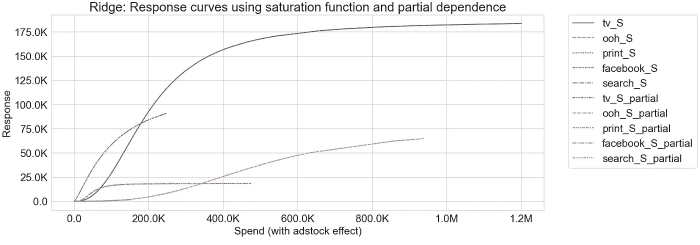
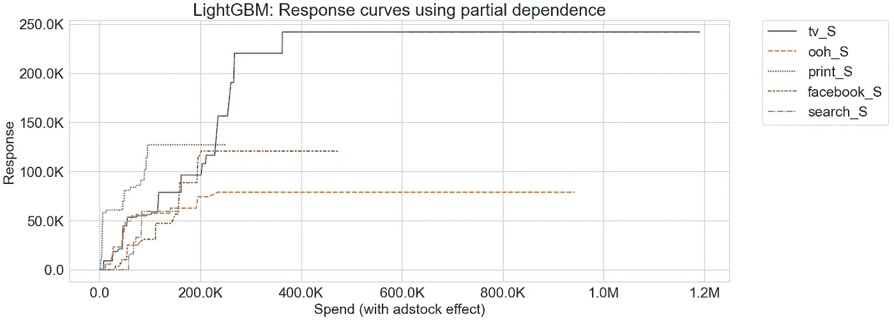
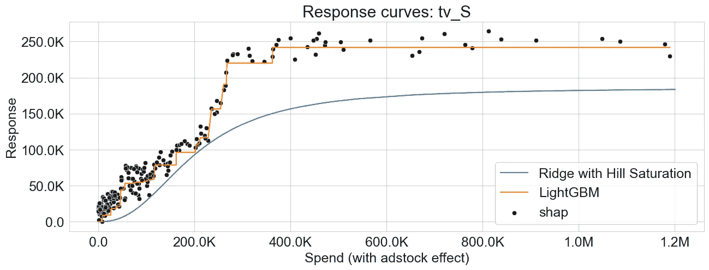
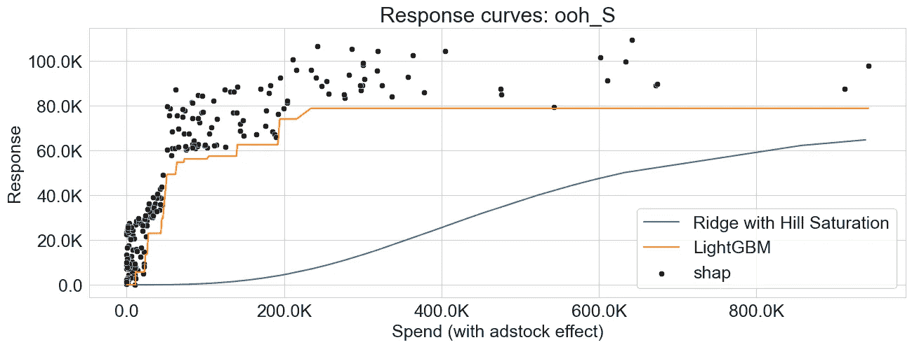
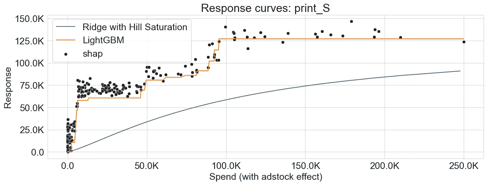
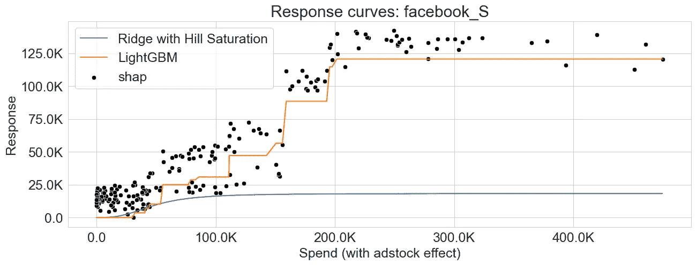
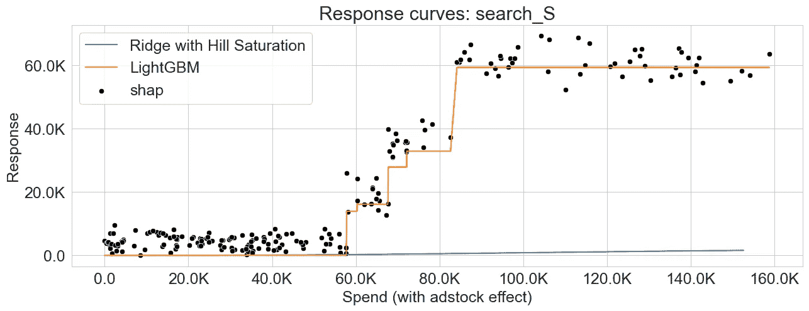

# 探索生成市场营销组合建模中响应曲线的不同方法

> 原文：[`towardsdatascience.com/exploring-different-approaches-to-generate-response-curves-in-marketing-mix-modeling-ff6dcc7927f7?source=collection_archive---------2-----------------------#2023-06-14`](https://towardsdatascience.com/exploring-different-approaches-to-generate-response-curves-in-marketing-mix-modeling-ff6dcc7927f7?source=collection_archive---------2-----------------------#2023-06-14)

## 比较饱和度函数和部分依赖性用于响应曲线生成

 [Slava Kisilevich](https://medium.com/@slavax?source=post_page-----ff6dcc7927f7--------------------------------)

·

[关注](https://medium.com/m/signin?actionUrl=https%3A%2F%2Fmedium.com%2F_%2Fsubscribe%2Fuser%2Fba0d56f8b910&operation=register&redirect=https%3A%2F%2Ftowardsdatascience.com%2Fexploring-different-approaches-to-generate-response-curves-in-marketing-mix-modeling-ff6dcc7927f7&user=Slava+Kisilevich&userId=ba0d56f8b910&source=post_page-ba0d56f8b910----ff6dcc7927f7---------------------post_header-----------) 发表在 [Towards Data Science](https://towardsdatascience.com/?source=post_page-----ff6dcc7927f7--------------------------------) ·6 分钟阅读·2023 年 6 月 14 日

--

图片由 [Alexander Grey](https://unsplash.com/@sharonmccutcheon?utm_source=medium&utm_medium=referral) 提供，来源于 [Unsplash](https://unsplash.com/?utm_source=medium&utm_medium=referral)

响应曲线是营销组合建模的重要组成部分，这是一种统计技术，用于分析各种营销策略和战术对销售或其他业务结果的影响。响应曲线表示了一个营销变量（例如广告支出、价格、促销等）与产品或服务所产生的销售或收入之间的关系。

响应曲线的重要性在于它们能够揭示每个营销变量的有效性以及它们如何影响整体响应。通过分析响应曲线，营销人员可以获得宝贵的见解，了解哪些营销策略推动了最多的销售，以及哪些策略没有达到预期效果。

构建响应曲线有不同的方法，在这篇文章中，我探讨了两种主要方法：使用饱和转换的直接方法和基于部分依赖的方法。我使用线性回归和梯度提升两种不同的算法族来评估这些方法。此外，我展示了在使用复杂机器学习算法时，部分依赖方法可以与通过 SHAP 值生成的响应曲线结合使用。

# 饱和函数 / 转换

构建响应曲线的直接方法是使用饱和函数（转换），例如 [Logistic、负指数](https://analyticsartist.wordpress.com/2015/03/08/advertising-diminishing-returns-saturation/) 或 [Hill](https://static.googleusercontent.com/media/research.google.com/en//pubs/archive/46001.pdf)。饱和函数是一种数学函数，它捕捉了递减回报效应，即随着营销变量值的增加，其影响逐渐饱和。通过使用饱和函数，可以将营销变量与响应变量之间的关系转化为非线性形式。这使得模型能够捕捉饱和效应，并更准确地表示营销活动与响应（销售或收入）之间的真实关系。

[## 使用 PyMC3 建模营销组合](https://example.org/modeling-marketing-mix-using-pymc3-ba18dd9e6e68?source=post_page-----ff6dcc7927f7--------------------------------)

### 对先验、数据标准化进行实验，并将贝叶斯建模与 Robyn（Facebook 的开源 MMM）进行比较…

[towardsdatascience.com](https://example.org/modeling-marketing-mix-using-pymc3-ba18dd9e6e68?source=post_page-----ff6dcc7927f7--------------------------------)

使用饱和变换的一个优势是其简单性和可解释性。响应曲线由具有固定参数的数学函数定义，形成一个平滑的曲线，易于可视化。然而，饱和函数的选择是建模之前的重要考虑因素。不同的函数可能会产生不同的结果，选择应基于数据的特征和模型的基本假设。

## 线性回归与非线性需求

在营销组合建模中，线性回归是一种常用的技术来分析营销变量与响应变量之间的关系。然而，线性回归假设预测变量与响应变量之间存在线性关系。这在试图捕捉营销数据中通常存在的非线性关系时可能会造成限制。

为了克服这一限制并在建模过程中引入非线性，需要对营销变量应用饱和函数或变换。这种变换允许生成一个非线性关系，否则由于线性回归的性质，该关系将是线性的。

[## 使用平滑样条建模营销组合](https://example.org/modeling-marketing-mix-using-smoothing-splines-98dc8e84c367?source=post_page-----ff6dcc7927f7--------------------------------)

### 捕捉非线性广告饱和度和递减回报，而不显式转换媒体变量

[## 使用平滑样条建模营销组合](https://example.org/modeling-marketing-mix-using-smoothing-splines-98dc8e84c367?source=post_page-----ff6dcc7927f7--------------------------------)

# 部分依赖方法

部分依赖方法是一种更通用的方法，可以用来建模任何营销变量与响应之间的关系。这种方法包括隔离一个变量的效果，同时保持所有其他变量不变。通过改变感兴趣的营销变量的值并观察相应的响应，可以创建部分依赖图。

与饱和变换生成的平滑响应曲线不同，部分依赖方法得到的图形可能不一定平滑。其形状取决于底层建模算法和媒体变量与响应之间的关系。部分依赖方法在关系复杂且非线性时非常有用，可以在显式使用饱和变换的情况下或当算法自然处理非线性而无需额外饱和变换时应用。

[## 使用机器学习方法改进营销组合建模](https://example.org/improving-marketing-mix-modeling-using-machine-learning-approaches-25ea4cd6994b?source=post_page-----ff6dcc7927f7--------------------------------)

### 使用基于树的集成方法构建 MMM 模型，并使用 SHAP 解释媒体渠道的表现 (Shapley Additive…)

towardsdatascience.com](/improving-marketing-mix-modeling-using-machine-learning-approaches-25ea4cd6994b?source=post_page-----ff6dcc7927f7--------------------------------)

# 数据

我继续使用 [Robyn](https://github.com/facebookexperimental/Robyn) 提供的 MIT 许可证数据集，如我之前的文章中所示进行实际例子，并按照相同的数据准备步骤，使用 Prophet 来分解趋势、季节性和假期。

数据集包括 208 周的收入数据（从 2015–11–23 到 2019–11–11），包含：

+   5 个媒体开支渠道：**tv_S, ooh_S, print_S, facebook_S, search_S**

+   2 个媒体渠道也包含曝光信息 (Impression, Clicks)：facebook_I, search_clicks_P（本文未使用）

+   无开支的有机媒体：**newsletter**

+   控制变量：**events, holidays**，竞争对手销售 (**competitor_sales_B)**

# 建模

我建立了一个完整的工作 MMM 流水线，可以在现实场景中应用于分析媒体开支对响应变量的影响，包含以下组件：

+   [Adstock 变换](https://medium.com/towards-data-science/modeling-marketing-mix-using-pymc3-ba18dd9e6e68) 具有无限衰减率 (0 < α < 1)

+   [饱和度山变换](https://static.googleusercontent.com/media/research.google.com/en//pubs/archive/46001.pdf) 具有两个参数：斜率 / 形状参数，控制曲线的陡度 (s > 0) 和半饱和点 (0 < k ≤ 1)

+   来自 [scikit-learn](https://scikit-learn.org/stable/modules/generated/sklearn.linear_model.Ridge.html) 的岭回归

+   [具有单调约束的 LightGBM 回归](https://lightgbm.readthedocs.io/en/latest/Parameters.html)

+   [基于时间的交叉验证](https://scikit-learn.org/stable/modules/generated/sklearn.model_selection.TimeSeriesSplit.html)

+   [Optuna 超参数调优](https://optuna.org/)

## **关于系数的说明**

在 scikit-learn 中，岭回归没有提供内置选项来强制对变量子集施加正系数。然而，一个潜在的解决方法是，如果发现任何媒体系数为负值，则拒绝 optuna 解决方案。这可以通过返回一个异常大的值来实现，表示负系数不可接受，应从模型中排除。另一种方法是参考 我关于如何在 Python 中封装 R glmnet 的文章，它允许对变量子集施加系数约束。

对于岭回归，我应用了饱和度变换，并使用饱和度函数和部分依赖方法生成响应曲线。使用 LightGBM 时，我允许模型自然捕捉非线性，并使用部分依赖方法生成响应曲线。此外，我在响应曲线上叠加了 SHAP 值，以提供进一步的见解。

# 结果

## 具有饱和度变换的岭回归

如可以观察到的，使用饱和度函数和部分依赖生成的响应曲线都显示出重叠的模式，表明这两种方法捕捉了营销变量与响应之间的相似关系。

## LightGBM

如前所述，由部分依赖生成的响应曲线可能不一定光滑。这可能是由于梯度提升算法的性质，该算法涉及将特征空间划分为区域，并结合多个决策树之间的交互作用。

图片来源于作者

下面的图表展示了岭回归和 LightGBM 的响应曲线，突出了这两种算法在捕捉递减收益方面的差异。此外，我们观察到 SHAP 值提供了对部分依赖方法生成的响应曲线的可靠近似。

图片来源于作者

图片来源于作者

图片来源于作者

图片来源于作者

图片来源于作者

# 结论

响应曲线在营销组合建模中起着关键作用，通过提供不同营销变量的有效性和它们对整体响应的贡献的见解。在本文中，我探讨了生成响应曲线的两种主要方法：使用饱和度变换的直接方法和部分依赖方法。我使用线性回归和梯度提升两种算法家族来评估这些方法，并展示了不同算法捕捉非线性响应的对比方式。此外，我将使用 SHAP 值生成的响应与通过部分依赖方法获得的结果进行了比较。

完整代码可以从我的[Github repo](https://github.com/slavakx/medium_posts)下载

感谢阅读！
