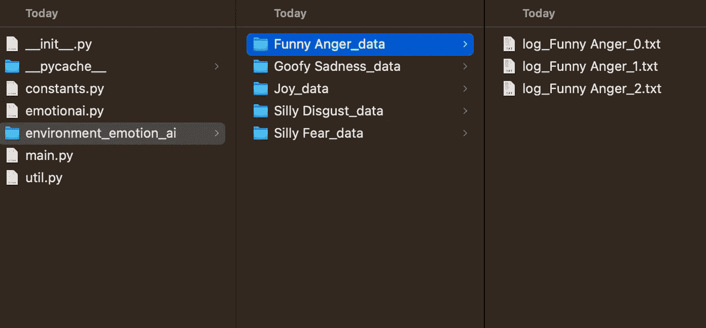
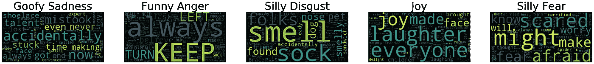
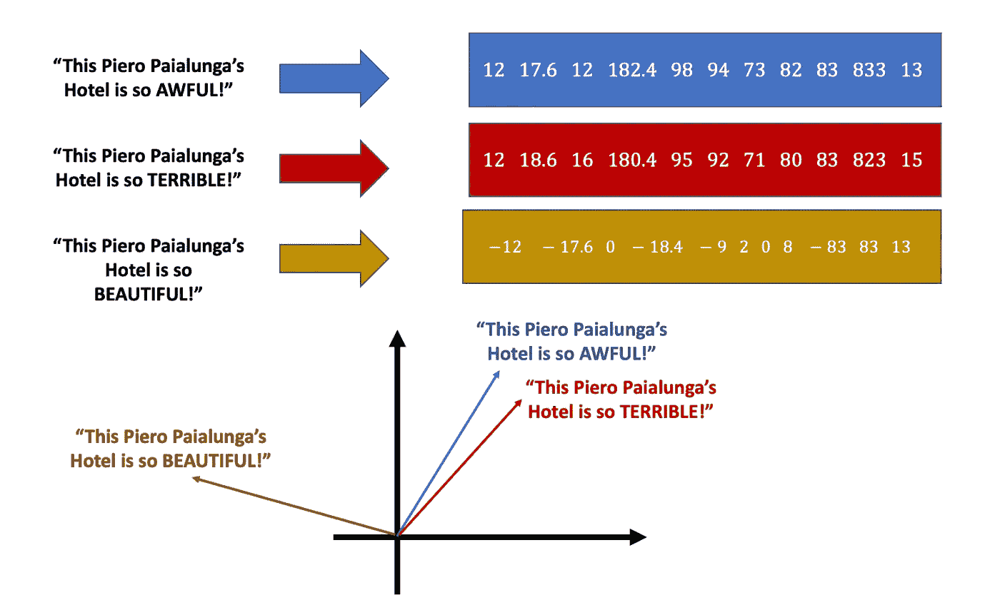

# 探索情感与人工智能、OpenAI 和探索性数据分析的关系

> 原文：[`towardsdatascience.com/exploring-emotions-with-artificial-intelligence-openai-and-exploratory-data-analysis-36a3882d3f11`](https://towardsdatascience.com/exploring-emotions-with-artificial-intelligence-openai-and-exploratory-data-analysis-36a3882d3f11)

## 以下是如何使用 Python 通过 OpenAI 和探索性数据分析在文本中可视化情感

 [Piero Paialunga](https://piero-paialunga.medium.com/?source=post_page-----36a3882d3f11--------------------------------)

·发表于 [Towards Data Science](https://towardsdatascience.com/?source=post_page-----36a3882d3f11--------------------------------) ·阅读时间 9 分钟·2023 年 12 月 12 日

--

作者使用 [Midjourney](https://www.midjourney.com/home?callbackUrl=%2Fexplore) 制作的图片

我想首先说的是，我更喜欢旧版迪士尼电影，而不是新版的。

我觉得这和我小时候看旧版迪士尼电影有关，我对那一刻有一种怀旧的感觉。即使我并不是电影专家，我也觉得旧版迪士尼电影的情节最好。

不过，有一个显著的例外，那就是 [**脑内飞**](https://movies.disney.com/inside-out)。我在影院看了这部电影，并且非常喜欢。我不想剧透，只想说这部电影探讨了我们内心中存在的一系列情感：

+   **愤怒**

+   **厌恶**

+   **快乐**

+   **恐惧**

+   **悲伤**

这些情感有时像真正的人一样在我们内心交谈。这是一部令人非常温馨的电影，我认为情节非常出色。当我听说新电影《脑内飞》即将上映时，我非常兴奋，正在倒计时。:)

现在，让我猜测一下你的问题：

> “这跟人工智能有什么关系呢？”

当我在看预告片的时候，我想到

> “我们能生成情感会说什么吗？”
> 
> “我们能否使用 ChatGPT 技术来模拟如果情感‘愤怒’是一个人的话，他们会说什么？”
> 
> “我们能否将情感作为 N 维空间中的向量来探索？如果可以，我们能否将其绘制出来？”

所以系好安全带，让我们看看能做些什么吧 😏

**在我们深入之前，** 我想强调这是一个基于电影的“游戏”。我认为一个情感被 AI 取代的世界会非常悲伤，我并不声称这个过程会在第一时间做到这一点。

这个故事分为 4 部分：

0\. 代码结构

1\. 代码的第一部分，生成情感。高度关注代码

2\. 代码的第二部分。这部分的内容少有***实际上基于代码***。它更多地基于数据集的探索。这是乐趣开始的地方！

3\. 总结

4\. 结论

***这个博客将以代码为基础，旨在对开发者有用。*** 如果你不是开发者，可以直接跳到第三章，我将在那里描述使用 AI 进行情感检测的结果 :)

# 0\. 结构

这项工作分为两章：

1.  **“情感”数据的生成**：它将是一个包含 main.py 脚本的模块，用于生成句子。这些句子将类似于《头脑特工队》中的电影句子。我们将用 OpenAI 生成每种情感 150 个句子：150x5 = 750 个句子。

1.  **探索性数据分析：** 这将是一个笔记本，用于对 OpenAI 生成的句子进行数据探索。

让我们描述一下我们是如何做到的……

> 整个代码可以在我的 GitHub 页面上找到 ([`github.com/PieroPaialungaAI/Emotion_AI/`](https://github.com/PieroPaialungaAI/Emotion_AI/tree/main/EmotionAI))

# 1\. 情感 AI

我们称情感数据的生成为**EmotionAI**。

在 EmotionAI 中，我创建了 4 个 Python 脚本：

+   **constants.py**

+   **main.py**

+   **util.py**

+   **emotionai.py**

你可以在[这个 Github 文件夹](https://github.com/PieroPaialungaAI/Emotion_AI/tree/main/EmotionAI)中找到。让我们从底部开始，描述 main.py 文件：

## 1.1 Main.py

**main.py**文件的构思是创建情感句子。

它使用一个名为 AIEmotionGenerator 的类来完成，AIEmotionGenerator 是**emotionai.py**代码的一部分。使用 AIEmotionGenerator，你首先**创建文件夹**，存储句子（每种情感 50x3），然后**生成句子并存储它们**。很简单，对吧？

肮脏的工作由**emotionai.py**完成，来看看：

## 1.2 emotionai.py

**emotionai.py**构建了一个名为 AIEmotionGenerator 的类。

这个类有两个功能：

+   为你创建文件夹（**无聊**）🥱

+   生成给定情感的句子（**非常有趣**）🤩

我通过给 OpenAI 的 GPT 一个提示来生成情感，这些提示是真实的《头脑特工队》中的情感句子。让我们在**constants.py**中看看它们是什么。

## 1.3 constants.py

所以，这就是 constants.py。在这个文件中，我们有用于让 GPT 更好地理解任务的句子。你也应该在其中填入你的[Open AI API](https://openai.com/blog/openai-api)密钥……这对使其工作至关重要*。

> *OpenAI API 密钥最终会花费你一些钱，但我为这个项目花了大约$0.11。关注 OpenAI 的使用页面，但不要为此感到压力。这不是一项投资。 :)

这些句子来自电影。注意到 OpenAI 被编程为不提供愤怒或悲伤的回答，这就是为什么我将情感改为“搞笑的悲伤”和“有趣的愤怒”……如果你问我，这些技术假装世界总是充满彩虹和冰淇淋，这有点令人沮丧，但它确实起到了作用。

# 2. 情感句子的 EDA

好的，一旦你生成了情感，你将会有你的文件夹，它们将会是这样的：

图片来自作者

我们需要提取.txt 文件并进行探索。让我们一步一步来：

## 2.0 库

我使用了我的老朋友们：👻

> 注意 EmotionAI 在库中，我们需要使用它（特别是用于常量）

## 2.1 导入文本

这一部分有点无聊但必要，我们从文件夹中导入文本，并以数据框的形式整理。

> 不幸的是，OpenAI 的响应可能会有些随机，特别是在格式上。所以请检查.txt 文件，并删除类似“当然！让我给你答案”或“对不起你感到难过，这是答案列表”之类的内容……

一旦你完成了，你的数据集将会如下所示：

## 2.2 可视化：词云！

词云是一种查看文本中词频的方法。这就是我们将用来逐类（或逐情感）可视化文本的方法：

这非常有趣。厌恶情感中出现频率最高的词是“SMELL”和“SOCK”。快乐情感中有“LAUGHTER”和“DELIGHT”这样的词。悲伤情感中有“STUCK”、“ACCIDENTALLY”、“NEVER”这些词。恐惧情感中有“SCARED”、“MIGHT”、“WORRY”这些词。

我们正在取得好成果。让我们继续前进！

## 2.3 嵌入

嵌入的思想是将单词转换为数字……或者更好……将句子转换为数字序列。就像这样！

带有**糟糕**和**非常糟糕**的句子比较接近，而带有**美丽**的句子则远离！

你可以用很多方法来进行嵌入步骤，我选择了使用 OpenAI，主要因为它快速而高效，但你可以选择你自己的方法！

这就是你如何在数据集中嵌入每个句子，从而将每个句子表示为一个向量，就像这样：

> 附注：如果你用西兰花替换我的冰淇淋，我也会生气的……

## 2.4 降低向量维度……

现在我们想要可视化向量。为了做到这一点，因为我们的脑袋只能处理 2D 或 3D 的事物，让我们使用 PCA 将维度从 1500+（使用 GPT 嵌入的向量维度）降到 2*。

+   **预处理**输入向量：

+   **训练 PCA**：

+   **应用 PCA**到原始向量

> *我写了这篇文章来介绍主成分分析，如果你想了解它是如何工作的…… :)

## 2.5 看彩虹！

现在我们有了二维数据集，可以对其进行绘制并了解发生了什么。让我们开始吧！

这很不错……你可以区分……

+   **悲伤**在数据集的下部分，呈长条形。

+   **厌恶**在数据集的右上部分，呈对角条形。

+   **愤怒**在数据集的左上部分，以圆形结构呈现。

让我们看看“快乐”怎么样。

恐惧和快乐之间有相当大的分隔，这很好，除了中间的一个区域。我怀疑那是因为“恐惧”在看到类似这样的句子时会变得“快乐”：

> “我非常高兴蜘蛛没有接近我。我对蜘蛛感到恐惧。”

这确实像是一个快乐/恐惧的情况 🙃

在这种情况下，我们也对电影中的恐惧句子应用了 PCA，我们看到恐惧在电影中说的句子（是）：

> “我真高兴你告诉我地震是神话，快乐，否则我现在会很害怕。”

基本上在“恐惧”句子的橙色点之间。

如果我们对反感的句子做同样的处理，我们可以看到反感确实位于绿色点之间，这正是我们想要的效果。

反感的句子是：

> “好吧，小心，这里有一种危险的气味，人们。”

即使这个情况也有点像厌恶/恐惧。这是因为情感不是非黑即白的，你可以同时感受到很多情感。如果你曾经恋爱过，你会非常明白这一点 ❤

# 3. 结论

非常感谢你阅读这个故事。我在做这个过程中非常开心。我喜欢《头脑特工队》，我认为当我们尝试看看计算机是否能生成类似情感的句子时，非常有趣。

在这个故事中我们：

+   **确定《头脑特工队》很棒**，我们以此作为创建情感“表达”想法的出发点。如果“恐惧”能说话，它会说什么？

+   使用了 OpenAI 的 GPT 技术来生成句子，**基于电影中的原始句子**。我们让 OpenAI 生成了 150 个类似反感的句子、150 个类似恐惧的句子、150 个类似快乐的句子和 150 个类似悲伤的句子。

+   使用了**词云、嵌入和主成分分析（PCA）技术来可视化结果**。

GPT 提取出的句子非常有趣。

恐惧说：

> “我害怕自己的影子可能会活过来并开始追赶我。”

而悲伤说：

> “我曾经因为忘记推而被困在旋转门里。”

词云也很棒，因为它突出了悲伤具有恐惧感，并使用了像“从不”这样的词汇，而反感几乎与“气味”相关，这非常准确。

当我们可视化这些句子时，我们看到句子形成了清晰的簇，并且电影中的原始句子基本上在对应的簇中。这是连贯性和良好提示的标志。

这项工作可能对许多事情有用，比如：

+   使用这项技术向电影导演建议新的句子

+   通过追踪角色的向量来理解角色的一致性

+   创造新的情感和感觉

+   你的想法（评论此帖子）

# 4. 关于我！

再次感谢你的时间。这对我意义重大❤

我是 Piero Paialunga，我是这里的那个人：

我是辛辛那提大学航空航天工程系的博士生。我在博客文章和 Linkedin 上谈论 AI 和机器学习。如果你喜欢这篇文章，想了解更多关于机器学习的内容并关注我的研究，你可以：

A. 在[**Linkedin**](https://www.linkedin.com/in/pieropaialunga/)上关注我，我会在这里发布我所有的故事

B. 订阅我的[**新闻通讯**](https://piero-paialunga.medium.com/subscribe)。它会让你了解最新故事，并给你机会给我发消息，以便收到你可能有的所有修正或疑问。

C. 成为一个[**推荐会员**](https://piero-paialunga.medium.com/membership)，这样你就不会有“每月最大故事数”的限制，可以阅读我（以及成千上万其他机器学习和数据科学顶级作家）关于最新技术的文章。

如果你想问我问题或开始合作，请在这里留言：

***piero.paialunga@hotmail.com***

再见❤️
