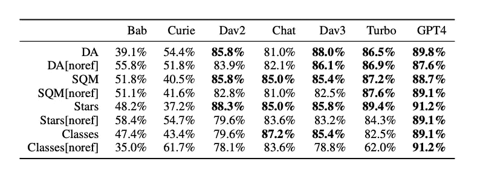

# 探索 GEMBA：一种基于 LLM 的翻译质量评估新指标

> 原文：[`towardsdatascience.com/exploring-gemba-a-new-llm-based-metric-for-translation-quality-assessment-3a3383de6d1f?source=collection_archive---------7-----------------------#2023-09-29`](https://towardsdatascience.com/exploring-gemba-a-new-llm-based-metric-for-translation-quality-assessment-3a3383de6d1f?source=collection_archive---------7-----------------------#2023-09-29)

## #GEN-AI 研究论文

## 使用 LLM 评估翻译质量

 [Dr. Varshita Sher](https://varshitasher.medium.com/?source=post_page-----3a3383de6d1f--------------------------------)

·

[关注](https://medium.com/m/signin?actionUrl=https%3A%2F%2Fmedium.com%2F_%2Fsubscribe%2Fuser%2Ff8ca36def59&operation=register&redirect=https%3A%2F%2Ftowardsdatascience.com%2Fexploring-gemba-a-new-llm-based-metric-for-translation-quality-assessment-3a3383de6d1f&user=Dr.+Varshita+Sher&userId=f8ca36def59&source=post_page-f8ca36def59----3a3383de6d1f---------------------post_header-----------) 发表在 [Towards Data Science](https://towardsdatascience.com/?source=post_page-----3a3383de6d1f--------------------------------) · 9 分钟阅读 · 2023 年 9 月 29 日 

--

图像由作者使用 [DALL.E 2](https://openai.com/product/dall-e-2) 生成

## 介绍

我最近读到了一篇有趣的[微软论文](https://arxiv.org/pdf/2302.14520.pdf)¹（发表于 2023 年 5 月），引起了我的注意。论文深入探讨了翻译评估领域，揭示了一种名为 GEMBA（**G**PT **E**stimation **M**etric **B**ased **A**ssessment）的创新度量标准。在这篇博客文章中，我们将剖析论文并提供对这一令人兴奋的发展的一些见解。

1.  前提：探索论文背后的动机。

1.  研究问题和假设：探讨论文的主要研究问题和假设。

1.  翻译质量评估度量标准：浅入现有度量标准，包括 BLEU、COMET 和 METEOR。

1.  介绍 GEMBA：深入了解新颖的 GEMBA 度量标准。

1.  实验细节：对所进行实验的洞见。

1.  主要发现：突出论文的主要结果。

1.  限制：讨论在生产环境中实施 GEMBA 前需要注意的事项。

## 1\. 前提

尽管 LLMs 最初并未设计用于翻译任务，但它们在这一领域展现了令人印象深刻的精准度。这一认识促使作者探索使用 LLMs 作为翻译评估工具。论文的核心思想相当简单——将 LLMs（大型语言模型）定位为评估翻译的工具，而不仅仅是执行翻译。作者提出了一种新的度量标准叫做 GEMBA，它在翻译质量评估方面超越了现有的最先进度量标准。

## 2\. 研究问题

> *LLMs 能否用于翻译质量评估？*

## 3\. 翻译质量评估度量标准

在深入了解 GEMBA 之前，让我们快速回顾一下用于评估机器生成翻译质量的现有度量标准，如 BLEU、COMET、METEOR 等。这些度量标准各有其优点，适用于不同的使用案例，取决于翻译质量中最重要的特定方面。

例如，BLEU（双语评估替代指标）主要关注 n-gram 精确度，这意味着它测量机器翻译中的 n-词序列与一个或多个参考翻译中的 n-词序列的重叠情况。它奖励特定词序列的存在，而没有明确考虑词序、词干提取或同义词关系。另一方面，METEOR（显式排序翻译评估指标）超越了基本的 n-gram 匹配，采取了更全面的翻译评估方法。它考虑了翻译质量的多个方面，包括词干提取、同义词关系、词序、精确的词匹配，甚至对未翻译词的惩罚。同样，COMET（基于内容的机器翻译评估）使用了一种略微不同的方法，专注于基于内容的评估，并通过嵌入计算机器翻译输出与参考翻译之间的语义相似度。简而言之，它评估机器翻译的内容和意义与参考翻译的匹配程度，而不考虑具体的语言变异或词汇选择。

> 你可以在[这里](https://machinetranslate.org/metrics)了解其他评估指标，如 YiSi、chrF、BERTScore 等。

鉴于我们刚才讨论的众多指标，你可能会问——*为什么我们需要像 GEMBA 这样的新指标？* 答案在于其独特的方法——促使大型语言模型根据自身判断评估翻译。与传统指标不同，GEMBA 旨在通过对翻译进行评分（例如 0 到 100），关注意义和语法，与人类评估翻译对齐。

## 4\. 介绍 GEMBA

如前所述，GEMBA 是一种基于 GPT 的翻译质量评估指标，它可以在有参考翻译和没有参考翻译的情况下工作。

本质上，GEMBA 是一个经过精心设计的评估任务 prompt，包含：

+   prompt 变体（来自预定义的四种变体集合）

+   源语言名称，例如“中文”

+   目标语言名称，例如“英语”

+   源片段，即需要翻译的句子

+   候选翻译，即翻译的句子

+   [可选] 参考翻译，即可以作为基准翻译的翻译

这是其中一种 prompt 变体的示例：GEMBA-DA（直接评估）

GEMBA-DA prompt。图像来源于原始论文

*附注：如果你对其他三种变体感兴趣，以下是论文中介绍的所有 prompt 变体的详细信息：*

GEMBA prompt 变体。图像来源于原始论文

## 5\. 实验和评估

作者使用广泛流行的 MQM 2022 数据集（多维质量指标）测试了 GEMBA 指标的效率。该数据集包括来自新闻、社交、电商等各种领域的多样化句子（100K+），涵盖三个翻译方向：英语到俄语、英语到德语和中文到英语。

此外，为了找到实施 GEMBA 的最佳 GPT 模型，作者测试了 GPT 系列中从 GPT 2 到最新 GPT-4 模型的七个模型的每个提示变体。

用于评估 GEMBA 的 7 个 GPT 模型。图像来自原始论文

在为 GEMBA 指标实验设定了舞台后，接下来的明显问题是 —

> 问：我们如何判断 GEMBA 是否比传统指标如 BLEU 和 COMET 表现更好？
> 
> A: 如果 GEMBA 得分与人类对翻译的看法紧密相关，那么我们就找到了赢家！

为了实现这一答案，需要根据我们是进行 *段级* 评估还是 *系统级* 评估来计算两个指标（Kendall’s Tau 和准确度 (*accuracy*, [Kocmi et al., 2021](https://aclanthology.org/2021.wmt-1.57/)))。但首先，它们是什么？

> **系统级评估** 评估机器翻译系统的 **整体性能**。它查看系统生成的翻译在广泛文本或内容中的质量。
> 
> **段级评估** 侧重于评估逐段翻译的质量（通常是 **句子** 或更小的文本单元）

一般而言：

+   Kendall’s Tau 用于段级评估

+   准确度用于系统级评估

为了清晰起见，我们来深入了解它们的公式，使用简单的示例：

**A. Kendall’s Tau**

> **（Kendall’s Tau** 用于判断两个排名之间是否存在相关性）

假设你有一个给定句子的三种翻译（A、B 和 C），你想评估指标（如 LLM、BLEU、METEOR 分数）产生的排名与人类翻译质量判断之间的相关性。

**参考**（人类）： “快速的棕色狐狸跳过了懒狗。”

**翻译 A**: “迅速的棕色狐狸跳过了懒狗。”

**翻译 B**: “快速的红色狐狸跳过了懒狗。”

**翻译 C**: “懒狗被快速的棕色狐狸跳过。”

**人类排序:** A > B > C（即，他们最喜欢翻译 A，然后是 B，最后是 C）

**这些翻译的指标分数:** LLM(A) = 0.85

LLM(B) = 0.75

LLM(C) = 0.60

综合所有信息，我们可以按如下方式计算 Kendall’s Tau：

接下来，让我们计算一致对和不一致对：

**对 1: (A, B)** 人工排序：A > B

LLM 分数：LLM(A) = 0.85 > LLM(B) = 0.75

结果: **一致对**（人类和指标都更喜欢 A 而不是 B）。

**对 2: (A, C)** 人工排序：A > C

LLM 分数：LLM(A) = 0.85 > LLM(C) = 0.60

结果：**一致对**（人工和度量都更喜欢 A 而不是 C）。

**对 3： (B, C)** 人工排名：B > C

LLM 分数：LLM(B) = 0.75 > LLM(C) = 0.60

结果：**一致对**（人工和度量都更喜欢 B 而不是 C）。

将这些值代入公式中，我们得到：

Kendall’s Tau

换句话说，*τ* = 1 表示度量和人工判断之间完全一致，因此这是一个可以用于自动化翻译质量的高质量度量。

**B. 准确率**

> Kendall’s Tau 评估排名之间的相似性或一致性，而准确率衡量排名的正确性。

为了说明准确率的计算，我们采用与上面相同的设置，即参考（人工）、翻译 A、翻译 B、翻译 C、人工排名，但让我们稍微更新度量分数，以便根据 Bleu 将 B 标记为比 C 更好的翻译：

度量分数（BLEU）：

BLEU(A) = 0.80

BLEU(B) = 0.70

BLEU(C) = 0.75

结合所有信息，这里是如何计算准确率的方法：

让我们计算度量Δ（这只是成对翻译的度量值差异）和人工Δ（这是假设的翻译对的人工评分差异）。如果你仔细查看公式，你会注意到我们并不关心Δ的实际值，而是Δ的符号。简单来说，只有当两个Δ的符号相同，即人工和度量对翻译的看法一致时，才能实现高准确率。

**对 1： (A, B)** 度量Δ = BLEU(A) — BLEU(B) = 0.80–0.70 = 0.10

人工Δ = 1（A 的排名高于 B）

结果：度量Δ和人工Δ具有相同的符号（都是正的）。这是一个排名一致性。

**对 2： (A, C)** 度量Δ = BLEU(A) — BLEU(C) = 0.80–0.75 = 0.05

人工Δ = 2（A 的排名高于 C）

结果：度量Δ和人工Δ具有相同的符号（都是正的）。这是一个排名一致性。

**对 3： (B, C)** 度量Δ = BLEU(B) — BLEU(C) = 0.70–0.75 = -0.05

人工Δ = 1（B 的排名高于 C）

结果：度量Δ和人工Δ具有不同的符号（度量为负，人工为正）。这是一个排名不一致。

将这些值代入公式中，我们得到：

准确率（Bleu）= (2/3)*100 = 67%，这意味着 BLEU 度量准确地将 3 对翻译中的 2 对按照人工判断进行了排名。是否这个百分比足够好以自动化 Bleu 的评估，我留给读者自行判断！

*注意：用于演示 Kendall’s Tau 和准确率计算的示例已简化以进行演示。在实际情况下，如果需要处理平局，即如果人工/度量对两个或更多翻译给出相同的排名，则公式会变得更复杂。你可以阅读更多有关内容* [*这里*](https://en.wikipedia.org/wiki/Kendall_rank_correlation_coefficient#Accounting_for_ties)*。*

## 关键结果：系统与片段级别评估

论文报告称 GEMBA 在系统级评估中表现优异，超越了现有的评估指标。

系统级评估结果。图片取自原始论文

然而，在分段级评估中还有改进的空间。LLM 与人类在这一层级上的排名平局可能解释了这一差异，因为 Kendall’s Tau 会惩罚平局。由于 Gemba-DA 指标返回 0-100 之间的离散值，两种翻译得到相等分数的概率很高。

分段级评估结果（P.S. 第一列的准确率与前面的表格相同）。图片取自原始论文

结果还强调了选择合适 LLM 以实施 GEMBA 的重要性。在测试的 GPT 家族的七种模型中，任何超过 3.5 的模型都表现出色。GPT-4 表现尤为突出，但 Davinci、ChatGPT Turbo 和 GPT-3.5 也表现良好。

各种 GPT 家族模型的 GEMBA 实施。图片取自原始论文

**7\. 限制和考虑事项**

论文突出了 GEMBA 在更广泛应用中的某些限制。

+   由于论文仅考虑了英语、中文、俄语和德语，因此需要对低资源语言进行 GEMBA 的评估。

+   可能存在数据泄漏的风险，因为尚不清楚测试数据是否包含在 Open AI 的训练中（撰写时 Open AI 尚未发布秘密配方）。尽管如此，可能性非常低，因为 GPT 模型声称知识截止日期为 2021 年 9 月，而 MQM 数据集于 2022 年 12 月发布。

+   LLM 可能会偶尔出现无效回应：

    ►文本回答而非分数→通过提高`temperature`直到输出数字分数来处理。

    ►“2”，“two”，“**”，“★★”，“two stars”或“2 stars”→在后处理中处理以保持一致性。

    ►作者排除了非英语目标语言（如星或五）的 LLM 输出。

无效回应的数量。图片取自原始论文。

# 结论

牢记使用简单提示实现 GEMBA 的便利性，它无疑是翻译质量评估的突破性指标。它与人类判断的一致性以及对各种 LLM 模型的适应性，使其成为 NLP 和翻译评估领域的有力补充。随着我们继续探索和完善 GEMBA（也许通过少量提示），它作为确保在多种语言环境中高质量翻译的有价值工具，具有很大的潜力。

*[1] Kocmi, T., & Federmann, C. (2023). 大型语言模型是翻译质量的最先进评估工具。arXiv 预印本 arXiv:2302.14520。*
