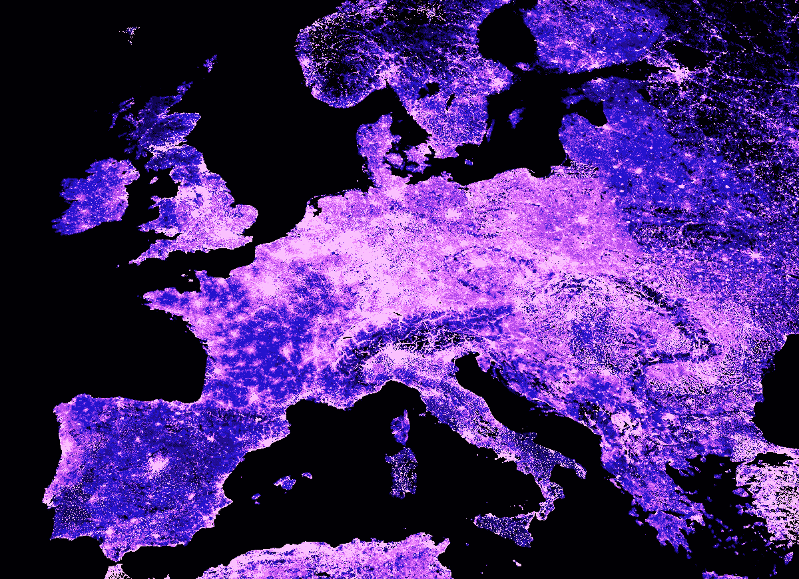
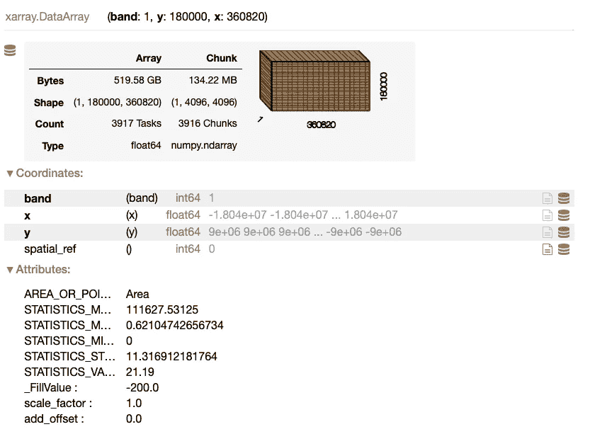
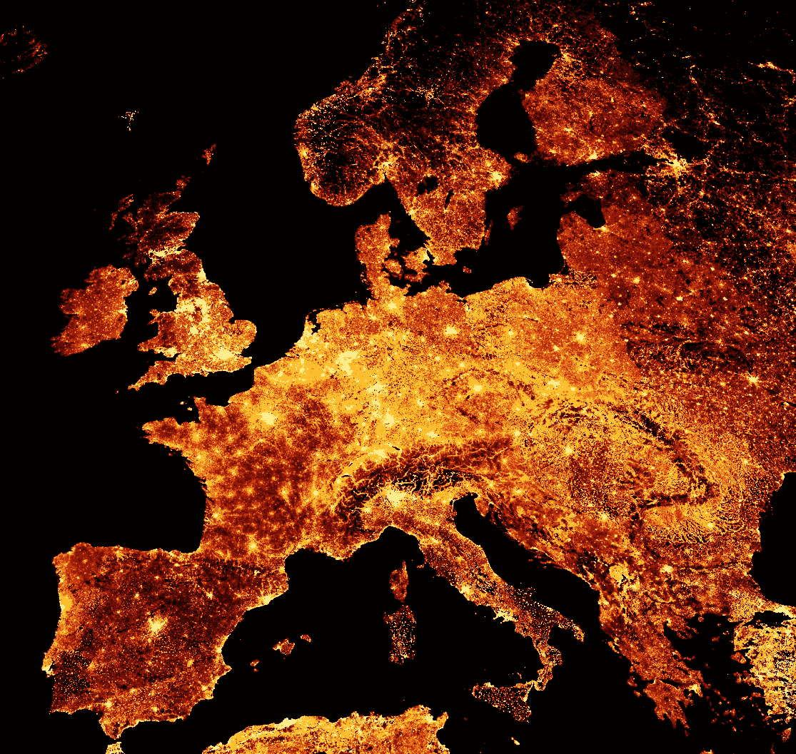
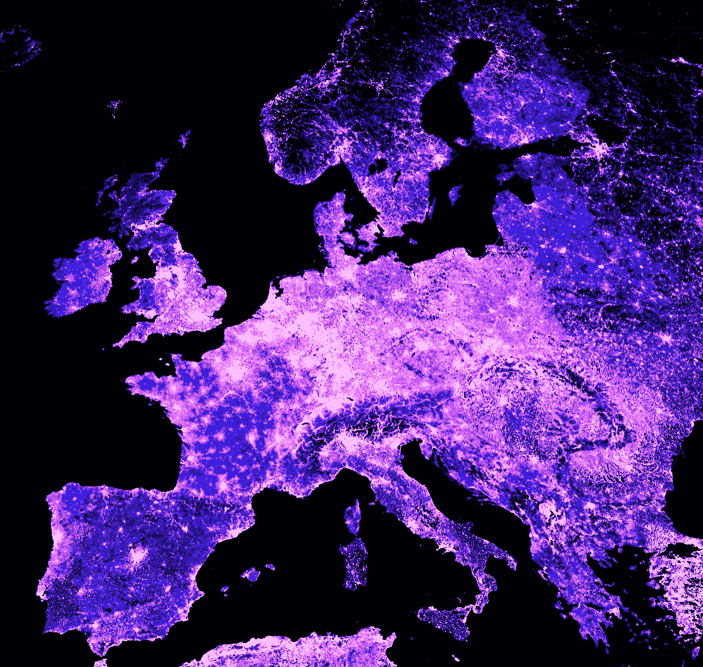
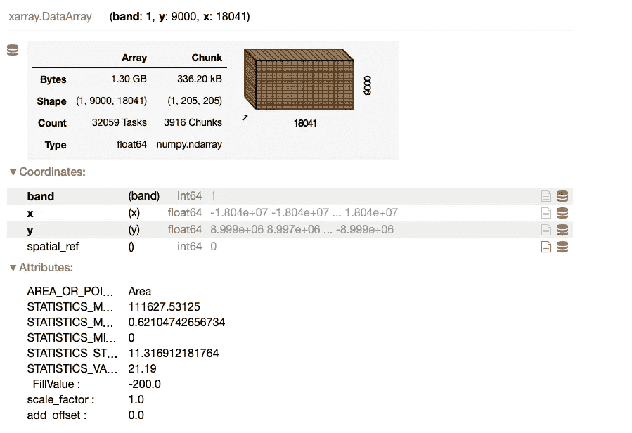
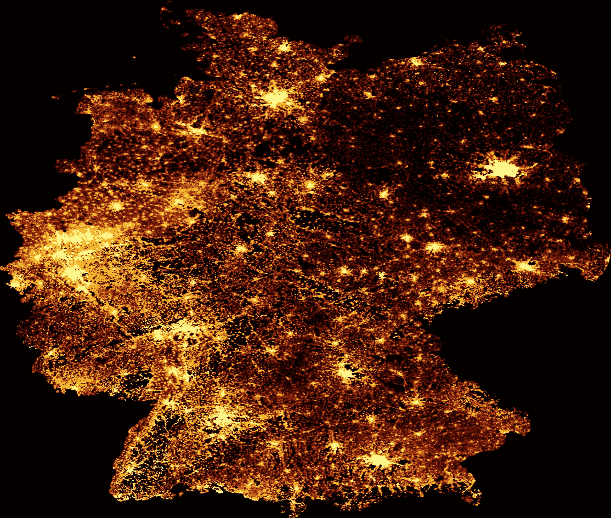
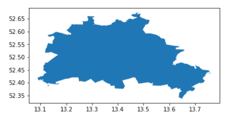
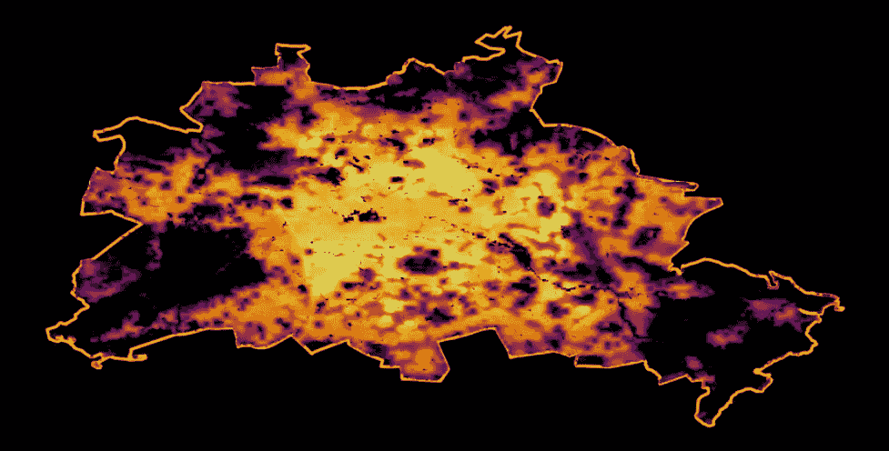

# 探索大规模栅格人口数据

> 原文：[`towardsdatascience.com/exploring-large-scale-raster-population-data-72803cf7f2ad`](https://towardsdatascience.com/exploring-large-scale-raster-population-data-72803cf7f2ad)



图片由作者提供。

## 使用 Python 可视化不同尺度的地理空间人口数据：全球、国家和城市级数据

[](https://medium.com/@janosovm?source=post_page-----72803cf7f2ad--------------------------------)[](https://towardsdatascience.com/?source=post_page-----72803cf7f2ad--------------------------------) [Milan Janosov](https://medium.com/@janosovm?source=post_page-----72803cf7f2ad--------------------------------)

·发布于 [Towards Data Science](https://towardsdatascience.com/?source=post_page-----72803cf7f2ad--------------------------------) ·阅读时长 9 分钟·2023 年 9 月 21 日

--

我常常看到漂亮的人口地图在网上传播；然而，我通常会在一些技术部分遇到困难，比如可视化教程中未显示的其他地图片段，或将大规模的栅格数据转换为更易计算的矢量格式。本文通过对两个主要全球人口数据来源的实用指南，克服了其中的一些不足。

还需要注意的是，除了它们的美学价值外，人口数据和显示这些数据的地图是任何城市发展或地点情报任务中最基本和最有价值的信息之一。它们在一些具体应用中特别有用，例如规划新设施、选址和流域分析、估算城市产品的规模，或对不同社区进行画像，仅举几例。

# 1\. 数据来源

我依赖以下两个精细化的人口估计数据来源，您可以通过附上的链接下载文件（发布时的日期）：

+   [欧洲委员会的 GHSL — 全球人类居住层](https://ghsl.jrc.ec.europa.eu/ghs_pop2019.php) 测量每个网格单元的居民数量。可以在这里找到总体描述，特定的数据集来自他们的 [2023 报告](https://ghsl.jrc.ec.europa.eu/download.php?ds=pop)，空间分辨率为 100m。

+   我将以德国为例，使用 WorldPop hub 提供的约束性单国数据集，分辨率为 100m。可以在[此处](https://hub.worldpop.org/geodata/listing?id=78)找到数据清单，而德国的数据[在此处](https://hub.worldpop.org/geodata/summary?id=49789)。

# 2\. 可视化全球人类居住层

**2.1\. 导入数据！**

我第一次在 Datashader 教程中遇到这个数据集，该教程来自[Architecture Performance](https://www.architecture-performance.fr/ap_blog/plotting-population-density-with-datashader/)。在复制他们的可视化后，我在将其扩展到全球地图时遇到了一些障碍，这引发了这项工作，所以现在我将向你展示我找到的解决方法！

首先，使用 xarray 包解析光栅文件。

```py
import rioxarray

file_path  = "GHS_POP_E2030_GLOBE_R2023A_54009_100_V1_0/GHS_POP_E2030_GLOBE_R2023A_54009_100_V1_0.tif" 

data_array = rioxarray.open_rasterio(file_path, chunks=True, lock=False)
data_array
```

此单元的输出是数据集的详细描述：



**2.2\. 可视化数据的各个块**

我们已经可以看到，对于大多数标准笔记本电脑来说，这是一大挑战。无论如何，让我们尝试使用 Datashader 可视化它，这是一种非常方便的工具，用于处理这种规模的地理空间数据集：

```py
# WARNING: THIS CODE BLOCK WILL MOST LIKELY CAUSE A MEMORY OVERFLOW ERROR

import datashader as ds
import xarray as xr
from colorcet import palette
from datashader import transfer_functions as tf

# prepare to plot
data_array_p = xr.DataArray(data_array)[0]
data_array_p = data_array_p.where(data_array_p > 0)
data_array_p = data_array_p.compute()

# get the image size
size = 1200
asp  = data_array_p.shape[0] / data_array_p.shape[1]

# create the data shader canvas
cvs = ds.Canvas(plot_width=size, plot_height=int(asp*size))
raster = cvs.raster(data_array_p)

# draw the image
cmap = palette["fire"]
img = tf.shade(raster, how="eq_hist", cmap=cmap)
img
```

尽管这段代码从技术上看是可行的，但我的 2021 年 M1 Macbook Pro（16GB RAM）却出现了可怜的内存溢出错误。因此，让我们裁剪图像来查看数据！为此，我遵循 Architecture Performance，重点关注欧洲，暂时这样做，因为它肯定有效。

然而，我稍后将回答的主要问题是，尽管存在这样的内存限制，但我们如何仍然能够在本地机器上可视化整个地球的数据？请稍等！

```py
import datashader as ds
import xarray as xr
from colorcet import palette
from datashader import transfer_functions as tf
import numpy as np

# crop the data array
data_array_c = data_array.rio.clip_box(minx=-1_000_000.0, miny=4_250_000.0, maxx=2_500_000.0, maxy=7_750_000.0)
data_array_c = xr.DataArray(data_array_c)

# prepare to plot
data_array_c = xr.DataArray(data_array_c)[0]
data_array_c = data_array_c.where(data_array_c > 0)
data_array_c = data_array_c.compute()
data_array_c = np.flip(data_array_c, 0)

# get the image size
size = 1200
asp  = data_array_c.shape[0] / data_array_c.shape[1]

# create the data shader canvas
cvs = ds.Canvas(plot_width=size, plot_height=int(asp*size))
raster = cvs.raster(data_array_c)

# draw the image
cmap = palette["fire"]
img = tf.shade(raster, how="eq_hist", cmap=cmap)
img = tf.set_background(img, "black")

img
```

这段代码块输出如下可视化：



欧洲的人口分布。图片来自作者。

使用‘fire’颜色映射方案似乎是一个行业标准，这是有原因的；然而，如果你想尝试其他颜色方案，你可以在[这里](https://colorcet.holoviz.org)找到并应用于下方：

```py
# create the data shader canvas
cvs = ds.Canvas(plot_width=size, plot_height=int(asp*size))
raster = cvs.raster(data_array_c)

# draw the image
cmap = palette["bmw"]
img = tf.shade(raster, how="eq_hist", cmap=cmap)
img = tf.set_background(img, "black")

img
```

这段代码块输出如下可视化：



欧洲的人口分布。图片来自作者。

**2.3\. 可视化整个地球**

所以数据在这里，但如果你手头有一台普通计算机，仍然想以 100 米的分辨率可视化整个世界怎么办？我在这里展示的解决方法相对简单 — 我将整个光栅图像拆分成大约一百个较小的瓦片，这样我的计算机可以逐个处理它们，然后使用一些图像处理技巧将它们合并成一个图像文件。

然而，在继续之前 — 快速说明。也有一种选项可以以下方式下采样 XArray 数组 — 但我找不到一个合适的下采样方法可以处理整个数据集。此外，我不想失去精度，还想看到整个数据集的全貌。

```py
# a quick way to down-sample the data
downsampling_factor = 20

downsampled_data_array = data_array.coarsen(x=downsampling_factor, y=downsampling_factor).mean()
downsampled_data_array
```

输出结果 — 值得与之前绘制的数据数组进行对比：



要将整个光栅图像拆分成网格块，首先，获取其边界并定义 N 为步长。然后，创建图像块边界的列表。

```py
minx = float(data_array.x.min().values)
maxx = float(data_array.x.max().values)
miny = float(data_array.y.min().values)
maxy = float(data_array.y.max().values)

N = 10
xstep = (maxx-minx) / N
ystep = (maxy-miny) / N

xsteps = list(np.arange(minx, maxx, xstep)) 
ysteps = list(np.arange(miny, maxy, ystep))
```

现在，迭代每一个 x 和 y 步骤，并创建每个图像段，其中每个图像文件以其在原始网格中的位置命名。这个循环可能需要一些时间。

```py
import os
foldout = 'world_map_image_segments'
if not os.path.exists(foldout):
    os.makedirs(foldout)

for idx_x, x_coord in enumerate(xsteps):
    for idx_y, y_coord in enumerate(ysteps):

        if not os.path.exists(foldout+'/'+str(idx_x)+'_'+str(idx_y)+'.png'):

            data_array_c = data_array.rio.clip_box( minx=x_coord,  miny=y_coord,  maxx=x_coord+xstep, maxy=y_coord+ystep)
            data_array_c = xr.DataArray(data_array_c)[0]
            data_array_c = data_array_c.fillna(0)
            data_array_c = data_array_c.where(data_array_c > 0)
            data_array_c = data_array_c.compute()
            data_array_c = np.flip(data_array_c, 0)

            size = 2000
            asp  = data_array_c.shape[0] / data_array_c.shape[1]

            cvs = ds.Canvas(plot_width=size, plot_height=int(asp*size))
            raster = cvs.raster(data_array_c)

            cmap = palette["fire"]
            img = tf.shade(raster, how="eq_hist", cmap=cmap)
            img = tf.set_background(img, "black")

            pil_image = img.to_pil()
            pil_image.save(foldout+'/'+str(idx_x)+'_'+str(idx_y)+ '.png')
            print('SAVED: ', x_coord, y_coord, y_coord+xstep,y_coord+ystep) 
```

最后，如果我们拥有所有的图像段，我们可以使用以下函数快速组装它们。对于这段代码，我也向 ChatGPT 请求了一些提示来加快进度，但像往常一样，也需要一些手动调整。

```py
from PIL import Image

def find_dimensions(image_dir):
    max_x = 0
    max_y = 0

    for filename in os.listdir(image_dir):
        if filename.endswith(".png"):
            x, y = map(int, os.path.splitext(filename)[0].split("_"))
            max_x = max(max_x, x)
            max_y = max(max_y, y)

    return max_x + 1, max_y + 1 

image_dir = foldout
segment_width = size
segment_height = int(asp*size)

# Determine the dimensions of the large image
large_image_width, large_image_height = find_dimensions(image_dir)

# Create an empty large image (white background)
large_image = Image.new("RGB", (large_image_width * segment_width, large_image_height * segment_height), "black")

# Loop through the individual image segments and paste them into the large image
for filename in sorted(os.listdir(image_dir)):
    if filename.endswith(".png"):
        x, y = map(int, os.path.splitext(filename)[0].split("_"))
        segment_image = Image.open(os.path.join(image_dir, filename))
        x_offset = x * segment_width
        y_offset = large_image_height * segment_height-1*y * segment_height
        large_image.paste(segment_image, (x_offset, y_offset))

# Save the merged large image
large_image.save("global_population_map.png") 
```

最终结果是，这里是整个地球的映射：


全球人口分布。图像来源：作者。

# 3\. 视觉化和转换 WorldPop 数据

我想向你展示的第二个数据源是 WorldPop 人口数据库，它提供了不同分辨率的大陆和国家数据。在这个示例中，除了前一部分的大陆和全球级别外，这里我瞄准了国家和城市的级别。例如，我选择了德国，并使用了 2020 年整理的 100m 分辨率数据，并展示了如何从整个国家中提取一个城市，并使用 GeoPandas 将其转换为易于使用的矢量格式。

**3.1\. 视觉化 WorldPop 数据**

使用之前的方法，我们可以再次快速可视化这个栅格文件：

```py
# parse the data
data_file = 'deu_ppp_2020_constrained.tif'
data_array = rioxarray.open_rasterio(data_file, chunks=True, lock=False)

# prepare the data
data_array = xr.DataArray(data_array)[0]
data_array = data_array.where(data_array > 0)
data_array = data_array.compute()
data_array = np.flip(data_array, 0)

# get the image size
size = 1200
asp  = data_array.shape[0] / data_array.shape[1]

# create the data shader canvas
cvs = ds.Canvas(plot_width=size, plot_height=int(asp*size))
raster = cvs.raster(data_array)

# draw the image
cmap = palette["fire"]
img = tf.shade(raster, how="eq_hist", cmap=cmap)
img = tf.set_background(img, "black")
img
```

这个代码块输出以下视觉效果：



德国的人口分布。图像来源：作者。

**3.2\. 转换 WorldPop 数据**

在可视化了整个地球、欧洲大陆和德国之后，我希望更深入地了解柏林，并向你展示如何将这样的栅格数据转换为矢量格式，并使用 GeoPandas 轻松处理它。为此，我访问了柏林的行政边界的 geojson 格式数据[在这里](https://maps.princeton.edu/catalog/tufts-berlin-bezirke-boroughs01)。

这个行政文件包含柏林的区，因此首先，我将它们合并成整个城市。

```py
from shapely.ops import cascaded_union
import geopandas as gpd

admin = gpd.read_file('tufts-berlin-bezirke-boroughs01-geojson.json')
admin = gpd.GeoDataFrame(cascaded_union(admin.geometry.to_list()), columns = ['geometry']).head(1)

admin.plot()
```

这个代码块输出以下视觉效果：



柏林的行政边界。图像来源：作者。

现在将 xarray 转换为 Pandas DataFrame，提取几何信息，并构建一个 GeoPandas GeoDataFrame。可以这样做：

```py
import pandas as pd

df_berlin = pd.DataFrame(data_array.to_series(), columns = ['population']).dropna()
```

现在，从这个数据构建一个 GeoDataFrame，重点关注柏林：

```py
from shapely.geometry import Point

# find the limiting bounding box for easier coodinate-selection
minx, miny, maxx, maxy = admin.bounds.T[0].to_list()

points = []
population = df_berlin.population.to_list()
indicies   = list(df_berlin.index)

# create Point geometries from the points falling into this bounding box
geodata = []
for ijk, (lon, lat) in enumerate(indicies):
    if minx <= lat <= maxx and miny <= lon <= maxy:   
        geodata.append({'geometry' : Point(lat, lon), 'population' : population[ijk]})

# build a GeoDataFrame
gdf_berlin = gpd.GeoDataFrame(geodata)
gdf_berlin = gpd.overlay(gdf_berlin, admin)
```

然后，将人口数据作为矢量数据进行可视化：

```py
import matplotlib.pyplot as plt

f, ax = plt.subplots(1,1,figsize=(15,15))

admin.plot(ax=ax, color = 'k', edgecolor = 'orange', linewidth = 3)

gdf_berlin.plot(column = 'population', 
                cmap = 'inferno', 
                ax=ax, 
                alpha = 0.9, 
                markersize = 0.25)

ax.axis('off')
f.patch.set_facecolor('black')
```

这个代码块输出以下视觉效果：



柏林的人口分布。图像来源：作者。

最后，这里我们有一个标准的 GeoDataFrame，分辨率为 100m，每个点几何体对应于栅格文件中的每个像素。

# 总结

在本文中，我探索了基于各种数据集的全球人口数据，这些数据通过结合各种近似、测量和建模方法，以 100 米的显著空间分辨率使用栅格网格来估计人口水平。这类信息对于城市发展和位置智能的广泛应用具有高度价值，例如基础设施规划、场地选择、社区分析等。从技术角度来看，我展示了三个空间层级的示例，从覆盖整个地球，再到放大到国家，最后到城市。虽然这种方法可以处理更小的分辨率，但这一切都发生在一台使用强大 Python 库如 Xarray、DataShader 和 GeoPandas 的笔记本电脑上。
