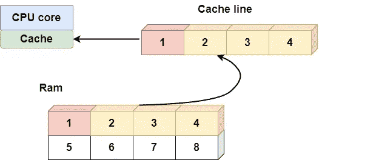
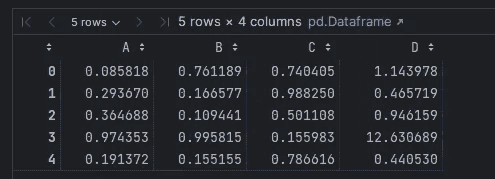
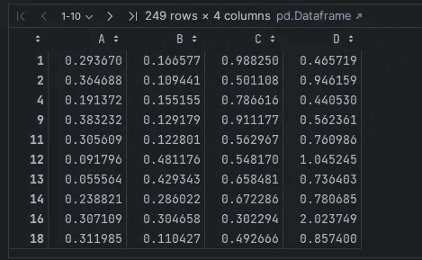
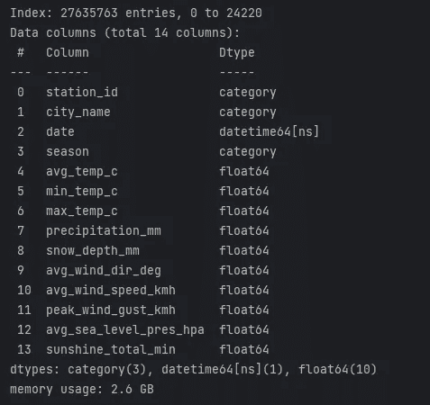
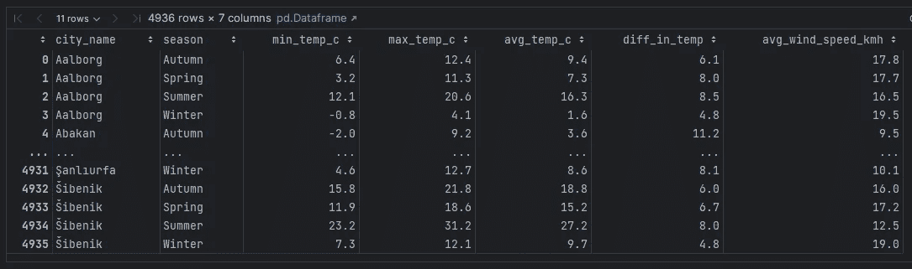
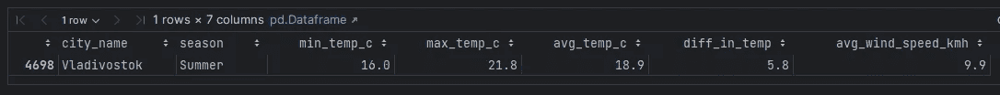

# 探索 Numexpr：Pandas 背后的强大引擎

> 原文：[`towardsdatascience.com/exploring-numexpr-a-powerful-engine-behind-pandas-cdb94965ca3a`](https://towardsdatascience.com/exploring-numexpr-a-powerful-engine-behind-pandas-cdb94965ca3a)

## [快速计算](https://qtalen.medium.com/list/fast-computing-2a37a7e82be5)

## 使用 Python 的 Numexpr 和 Pandas 的 eval/query 函数提升数据分析性能

[](https://qtalen.medium.com/?source=post_page-----cdb94965ca3a--------------------------------)[](https://towardsdatascience.com/?source=post_page-----cdb94965ca3a--------------------------------) [Peng Qian](https://qtalen.medium.com/?source=post_page-----cdb94965ca3a--------------------------------)

·发表于 [Towards Data Science](https://towardsdatascience.com/?source=post_page-----cdb94965ca3a--------------------------------) ·10 分钟阅读·2023 年 9 月 22 日

--


使用 Numexpr 来帮助我找到最宜居的城市。照片来源：作者创作，[Canva](https://www.canva.com/)

本文将向你介绍 Python 库 [Numexpr](https://numexpr.readthedocs.io/en/latest/intro.html?ref=dataleadsfuture.com#)，这是一种提高 `Numpy Arrays` 计算性能的工具。Pandas 的 `eval` 和 `query` 方法也基于这个库。

本文还包括一个动手实践的天气数据分析项目。

阅读本文后，你将理解 Numexpr 的原理以及如何使用这一强大的工具来加速现实中的计算。

# 介绍

## 回顾 Numpy Arrays

在上一篇讨论 `Numpy Arrays` 的文章中，我使用了一个库示例来解释为什么 Numpy 的缓存局部性如此高效：

[](/python-lists-vs-numpy-arrays-a-deep-dive-into-memory-layout-and-performance-benefits-a74ce774bc1e?source=post_page-----cdb94965ca3a--------------------------------) ## Python 列表与 NumPy 数组：深入探讨内存布局和性能优势

### 探索分配差异和效率提升

towardsdatascience.com

每次去图书馆查找资料时，你会拿出几本与内容相关的书，放在桌子旁边。

这样，你可以快速检查相关资料，而无需每次都跑到书架上去找书。

这种方法节省了大量时间，尤其是当你需要查阅许多相关书籍时。

在这种情况下，书架就像你的记忆，桌子相当于 CPU 的 L1 缓存，而你，读者，就是 CPU 的核心。



当 CPU 访问 RAM 时，缓存会将整个缓存行加载到高速缓存中。图像由作者提供

## Numpy 的限制

假设你不幸遇到了一位要求你拿出莎士比亚和托尔斯泰作品进行对比的苛刻教授。

在这种情况下，提前拿出相关书籍并不会有效果。

首先，你的桌面空间有限，无法同时容纳这两位大师的所有书籍，更不用说在比较过程中产生的阅读笔记了。

其次，你只是一个人，比较这么多作品会花费很长时间。如果能找到更多人来帮忙就好了。

这是我们使用 Numpy 处理大量数据时的当前情况：

+   数组中的元素数量太大，无法适应 CPU 的 L1 缓存。

+   Numpy 的元素级操作是单线程的，无法利用多核 CPU 的计算能力。

我们应该怎么办？

别担心。当你真的遇到数据量过多的问题时，你可以召唤今天的主角 `Numexpr` 来帮助你。

# 理解 Numexpr：什么和为什么

## 它是如何工作的

当 Numpy 遇到大型数组时，逐元素计算会经历两种极端情况。

让我举个例子来说明。假设有两个大型的 Numpy ndarray：

```py
import numpy as np
import numexpr as ne

a = np.random.rand(100_000_000)
b = np.random.rand(100_000_000)
```

当计算表达式 `a**5 + 2 * b` 的结果时，通常有两种方法：

一种方法是 Numpy 的向量化计算方法，它使用两个临时数组分别存储 `a**5` 和 `2*b` 的结果。

```py
In: %timeit a**5 + 2 * b

Out:2.11 s ± 31.1 ms per loop (mean ± std. dev. of 7 runs, 1 loop each)
```

这时，你的内存中有四个数组：`a`、`b`、`a**5` 和 `2 * b`。这种方法会导致大量的内存浪费。

而且，由于每个数组的大小超过了 CPU 缓存的容量，它无法很好地利用缓存。

另一种方法是遍历两个数组中的每个元素并分别计算它们。

```py
c = np.empty(100_000_000, dtype=np.uint32)

def calcu_elements(a, b, c):
    for i in range(0, len(a), 1):
        c[i] = a[i] ** 5 + 2 * b[i]

%timeit calcu_elements(a, b, c)

Out: 24.6 s ± 48.2 ms per loop (mean ± std. dev. of 7 runs, 1 loop each)
```

这种方法的效果更差。计算会非常慢，因为它无法使用向量化计算，只能部分利用 CPU 缓存。

## Numexpr 的计算

Numexpr 通常只使用一个 `evaluate` 方法。该方法每次接收一个表达式字符串，然后使用 Python 的 `compile` 方法将其编译为字节码。

Numexpr 还有一个虚拟机程序。虚拟机包含多个向量寄存器，每个寄存器使用 4096 的块大小。

当 Numexpr 开始计算时，它会每次将数据发送到一个或多个寄存器中的 CPU 的 L1 缓存中。这样，就不会出现内存过慢、CPU 等待数据的情况。

与此同时，Numexpr 的虚拟机是用 C 编写的，去除了 Python 的 GIL。它可以利用多核 CPU 的计算能力。

所以，计算大型数组时，Numexpr 比单独使用 Numpy 更快。我们可以进行比较：

```py
In:  %timeit ne.evaluate('a**5 + 2 * b')
Out: 258 ms ± 14.4 ms per loop (mean ± std. dev. of 7 runs, 1 loop each)
```

## Numexpr 工作原理总结

让我们总结一下 Numexpr 的工作原理，看看为什么 Numexpr 如此快速：

**通过虚拟机执行字节码。** Numexpr 使用字节码来执行表达式，这可以充分利用 CPU 的[分支预测](https://en.wikipedia.org/wiki/Branch_predictor?ref=dataleadsfuture.com)能力，比使用 Python 表达式要快。

**向量化计算。** Numexpr 会使用[SIMD（单指令、多数据）](https://en.wikipedia.org/wiki/Single_instruction,_multiple_data?ref=dataleadsfuture.com)技术来显著提高对每个寄存器中数据的相同操作的计算效率。

**多核并行计算。** Numexpr 的虚拟机可以将每个任务分解为多个子任务，并在多个 CPU 核心上并行执行。

**更少的内存使用。** 不同于需要生成中间数组的 Numpy，Numexpr 在必要时只加载少量数据，从而显著减少内存使用。


Numexpr 的工作流程图。图像由作者提供

# Numexpr 和 Pandas：强大的组合

你可能会想：我们通常使用 pandas 进行数据分析。我理解 Numexpr 对 Numpy 性能的提升，但它对 Pandas 是否也有同样的提升？

答案是肯定的。

pandas 中的`eval`和`query`方法是基于 Numexpr 实现的。让我们看一些示例：

## Pandas.eval 用于跨 DataFrame 操作

当你有多个 pandas DataFrame 时，可以使用`pandas.eval`在 DataFrame 对象之间执行操作，例如：

```py
import pandas as pd

nrows, ncols = 1_000_000, 100
df1, df2, df3, df4 = (pd.DataFrame(rng.random((nrows, ncols))) for i in range(4))
```

如果你使用传统 pandas 方法计算这些 DataFrame 的总和，所消耗的时间是：

```py
In:  %timeit df1+df2+df3+df4
Out: 1.18 s ± 65.1 ms per loop (mean ± std. dev. of 7 runs, 1 loop each)
```

你也可以使用`pandas.eval`进行计算。所消耗的时间是：

```py
In:  %timeit pd.eval('df1 + df2 + df3 + df4')
Out: 452 ms ± 29.4 ms per loop (mean ± std. dev. of 7 runs, 1 loop each)
```

`eval`版本的计算可以将性能提高 50%，且结果完全一致：

```py
In:  np.allclose(df1+df2+df3+df4, pd.eval('df1+df2+df3+df4'))
Out: True
```

## DataFrame.eval 用于列级操作

就像`pandas.eval`一样，DataFrame 也有自己的`eval`方法。我们可以使用此方法进行 DataFrame 中的列级操作，例如：

```py
df = pd.DataFrame(rng.random((1000, 3)), columns=['A', 'B', 'C'])

result1 = (df['A'] + df['B']) / (df['C'] - 1)
result2 = df.eval('(A + B) / (C - 1)')
```

使用传统 pandas 方法和`eval`方法的结果完全一致：

```py
In:  np.allclose(result1, result2)
Out: True
```

当然，你也可以直接使用`eval`表达式向 DataFrame 中添加新列，这非常方便：

```py
df.eval('D = (A + B) / C', inplace=True)
df.head()
```



直接使用`eval`表达式来添加新列。图像由作者提供

## 使用 DataFrame.query 快速查找数据

如果 DataFrame 的`eval`方法执行比较表达式，返回的结果是符合条件的布尔结果。你需要使用`掩码索引`来获取所需的数据：

```py
mask = df.eval('(A < 0.5) & (B < 0.5)')
result1 = df[mask]
result1
```



当仅使用 DataFrame.query 过滤数据时，需要使用布尔掩码。图像由作者提供

`DataFrame.query`方法封装了这个过程，你可以直接通过`query`方法获得所需的数据：

```py
In:   result2 = df.query('A < 0.5 and B < 0.5')
      np.allclose(result1, result2)
Out:  True
```

当你需要在表达式中使用标量时，可以使用`@`符号来指示：

```py
In:  Cmean = df['C'].mean()
     result1 = df[(df.A < Cmean) & (df.B < Cmean)]
     result2 = df.query('A < @Cmean and B < @Cmean')
     np.allclose(result1, result2)
Out: True
```

# 实际示例：在现实场景中使用 Numexpr 和 Pandas

在所有解释 Numexpr 的文章中，示例使用的是合成数据。这种情况并不理想，可能会导致你在阅读文章后不知道如何使用这个强大的库来完成任务。

因此，在本文中，我将以天气数据分析项目为例，解释如何在实际工作中使用 Numexpr 处理大型数据集。

## 项目目标

在炎热的夏天过后，我非常想知道是否有这样一个地方，夏季气候宜人，适合我避暑。

这个地方应该满足以下条件：

1.  在夏天：

1.  每日平均温度在 18 摄氏度到 22 摄氏度之间；

1.  日温差在 4 摄氏度到 6 摄氏度之间；

1.  平均风速（以公里每小时计算）在 6 到 10 之间。微风吹拂会感觉很舒服。

## 数据准备

这一次，我使用了由[Meteostat JSON API](https://dev.meteostat.net/api/stations/daily.html?ref=dataleadsfuture.com#endpoint)提供的全球主要城市天气数据。

数据在[知识共享署名-非商业性使用 4.0 国际许可协议 (CC BY-NC 4.0)](https://dev.meteostat.net/terms.html?ref=dataleadsfuture.com#availability)下授权，并可以用于商业用途。

我使用了基于 Meteostat JSON API 的[Kaggle](https://www.kaggle.com/datasets/guillemservera/global-daily-climate-data?select=daily_weather.parquet&ref=dataleadsfuture.com)上整合的 parquet 数据集以便于操作。

我使用了 pandas 的 2.0 版本。这个版本的`pandas.read_parquet`方法可以轻松读取 parquet 数据。但在读取之前，需要安装`Pyarrow`和`Fastparquet`。

```py
conda install pyarrow
```

```py
conda install fastparquet
```

## 数据分析

在初步准备之后，我们正式进入数据分析过程。

首先，我将数据读入内存，然后查看这个数据集的情况：

```py
import os
from pathlib import Path

import pandas as pd

root = Path(os.path.abspath("")).parents[0]
data = root/"data"

df = pd.read_parquet(data/"daily_weather.parquet")
df.info()
```



数据集元数据概览。图片作者

如图所示，这个数据集包含 13 个字段。根据这个项目的目标，我计划使用`city_name`、`season`、`min_temp_c`、`max_temp_c`、`avg_wind_speed_kmh`这些字段。

接下来，我首先删除包含空值的字段中的数据，以便进行后续计算，然后选择所需字段以形成一个新的 DataFrame：

```py
sea_level_not_null = df.dropna(subset=['min_temp_c', 'max_temp_c', 'avg_wind_speed_kmh'] , how='any')

sample = sea_level_not_null[['city_name', 'season',
                             'min_temp_c', 'max_temp_c', 'avg_wind_speed_kmh']]
```

由于我需要计算平均温度和温差，我使用`Pandas.eval`方法直接在 DataFrame 上计算新的指标：

```py
sample.eval('avg_temp_c = (max_temp_c + min_temp_c) / 2', inplace=True)
sample.eval('diff_in_temp = max_temp_c - min_temp_c', inplace=True)
```

然后，按`city_name`和`season`对几个指标进行平均：

```py
sample = sample.groupby(['city_name', 'season'])\
        [['min_temp_c', 'max_temp_c', 'avg_temp_c', 'diff_in_temp', 'avg_wind_speed_kmh']]\
            .mean().round(1).reset_index()

sample
```



数据清理和指标计算后的结果。图片作者

最后，根据项目目标，我使用`DataFrame.query`来筛选数据集：

```py
sample.query('season=="Summer" \
        & 18 < avg_temp_c < 22 \
        & 4 < diff_in_temp < 6 \
        & 6 < avg_wind_speed_kmh < 10')
```



最终，我们得到了唯一符合标准的结果。图片由作者提供

最终结果出来了。只有一个城市符合我的要求：符拉迪沃斯托克，一个位于俄罗斯东部的非冻结港口。确实是逃离酷热的绝佳地方！

# 最佳实践和经验总结

在解释了 Numexpr 的项目实践后，像往常一样，我会结合自己的工作经验为你讲解一些 Numexpr 的最佳实践。

## 避免过度使用

尽管 Numexpr 和 pandas 的 `eval` 在处理大数据集时具有显著的性能优势，但处理小数据集的速度并不比常规操作快。

因此，你应该根据数据的大小和复杂性来选择是否使用 Numexpr。我的经验是，当你觉得有需要时使用它，因为小数据集不会拖慢处理速度。

## `eval` 函数的使用是有限制的

`eval` 函数不支持所有的 Python 和 pandas 操作。

因此，在使用之前，你应该查阅 [文档](https://pandas.pydata.org/docs/user_guide/enhancingperf.html?ref=dataleadsfuture.com#expression-evaluation-via-eval) 以了解 eval 支持哪些操作。

## 处理字符串时要小心

尽管我在项目实践中使用了 `season="Summer"` 来过滤数据集，但在处理字符串时 `eval` 函数并不非常快速。

如果你的项目中有大量的字符串操作，你需要考虑其他方法。

## 注意内存使用情况

尽管 Numexpr 不再生成中间数组，但大数据集仍会占用大量内存。

例如，在我的项目示例中，数据集占用了 2.6G 的内存。此时，你必须非常小心以避免由于内存不足而导致程序崩溃。

## 使用适当的数据类型

这一点在 [官方文档](https://numexpr.readthedocs.io/en/latest/user_guide.html?ref=dataleadsfuture.com#datatypes-supported-internally) 中有详细说明，所以我在这里不再赘述。

# 在需要时使用 `inplace` 参数

使用 `DataFrame.eval` 方法的 `inplace` 参数可以直接修改原始数据集，避免生成新的数据集并占用大量内存。

当然，这样做会导致对原始数据集进行修改，因此请小心操作。

# 结论

在本文中，我带来了关于 Numexpr 的全面教程，包括：

Numexpr 的适用场景、性能提升效果及其工作原理。

Pandas 中的 `eval` 和 `query` 方法也基于 Numexpr。如果使用得当，它将为你的 pandas 操作带来极大的便利和性能提升。

通过一个全球天气数据分析项目，我展示了如何在实践中使用 pandas 的 `eval` 和 `query` 方法。

一如既往地，结合我的工作经验，我介绍了 Numexpr 的最佳实践以及 pandas 的 eval 方法。

感谢阅读。如果你有任何问题，请在评论区留言，我会及时回复。

让我从基础开始，带你了解工作中最佳的科学计算实践。


[Peng Qian](https://qtalen.medium.com/?source=post_page-----cdb94965ca3a--------------------------------)

## 快速计算

[查看列表](https://qtalen.medium.com/list/fast-computing-2a37a7e82be5?source=post_page-----cdb94965ca3a--------------------------------)4 个故事！

感谢阅读我的故事。

你可以 [**订阅**](https://www.dataleadsfuture.com/#/portal) 以获取我最新的数据科学故事。

如果你有任何问题，可以在 [LinkedIn](https://www.linkedin.com/in/qtalen/) 或 [Twitter(X)](https://twitter.com/qtalen) 上找到我。

本文最初发表在 [数据引领未来](https://www.dataleadsfuture.com/exploring-numexpr-a-powerful-engine-behind-pandas/#/portal)。
