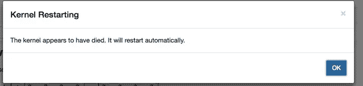
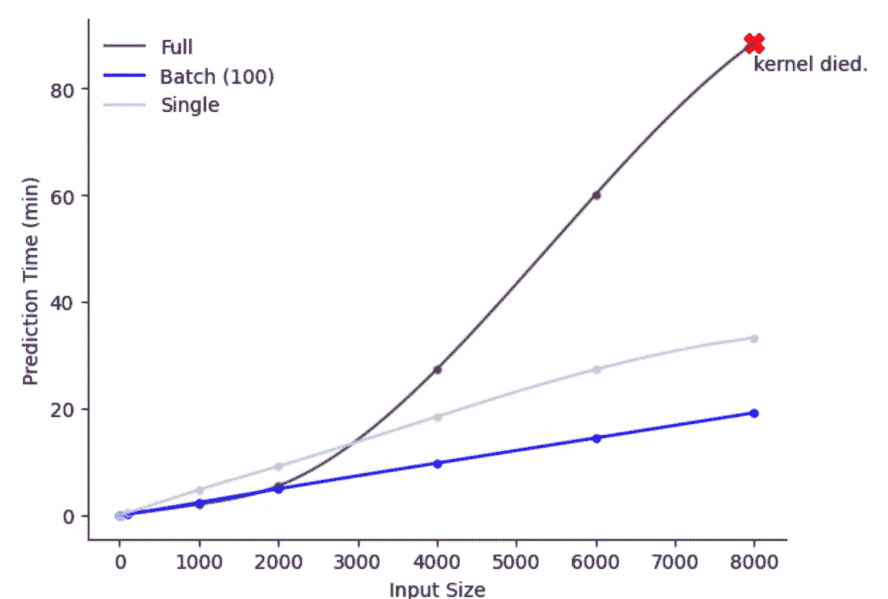
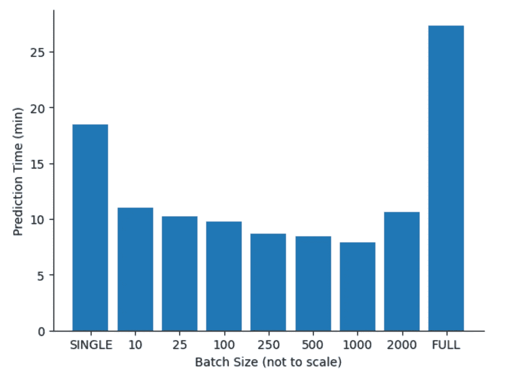
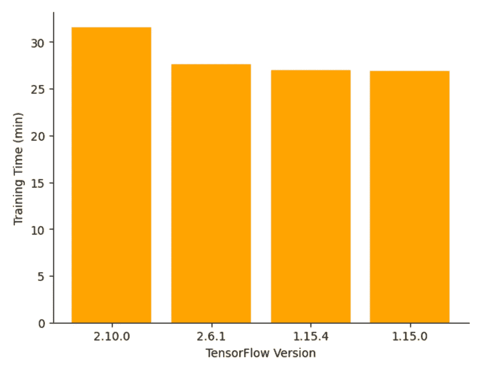
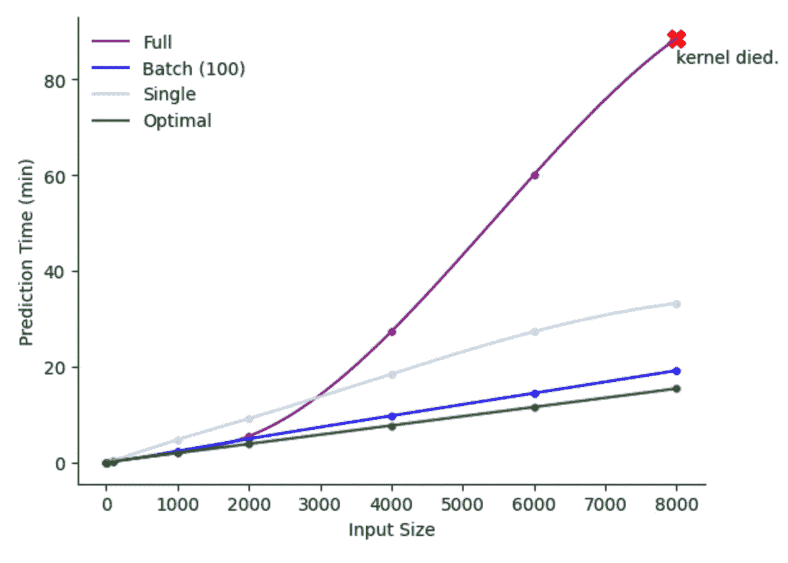

# 探索 TensorFlow 模型预测问题

> 原文：[`towardsdatascience.com/exploring-tensorflow-model-prediction-issues-38092d0cdcc3`](https://towardsdatascience.com/exploring-tensorflow-model-prediction-issues-38092d0cdcc3)

## 在个人电脑上调试 BERT（以及其他 LLM）慢预测时间的步骤

[](https://adam1brownell.medium.com/?source=post_page-----38092d0cdcc3--------------------------------)[](https://towardsdatascience.com/?source=post_page-----38092d0cdcc3--------------------------------) [Adam Brownell](https://adam1brownell.medium.com/?source=post_page-----38092d0cdcc3--------------------------------)

·发表于[Towards Data Science](https://towardsdatascience.com/?source=post_page-----38092d0cdcc3--------------------------------) ·7 分钟阅读·2023 年 2 月 2 日

--

一切始于我玩弄 BERT 模型时，收到了一条所有数据科学家都希望避免的凶兆消息：



令人恐惧的“内核崩溃”消息 💀

当我在 Jupyter Notebook 上运行我的 TensorFlow BERT 模型时，这种情况发生了。训练大型语言模型（LLMs）通常需要大量的数据和计算，因此我的相对微不足道的笔记本电脑在这里崩溃是有道理的……

…只是这次崩溃发生在*预测*期间，而不是*训练*期间，这很奇怪，因为我认为训练时使用的内存比预测时多。

“Kernel Died”错误提供的信息不够具体，而逐行调试 TensorFlow 听起来像是一项艰巨的任务。

一些在 Stack Overflow 上的快速搜索也没有完全回答我悬而未决的问题。但我仍然需要一个前进的方向。

这是我对内核崩溃问题的探索以及我找到解决方案的过程。 🚀

# 深入探索

由于我对问题的唯一了解是内核崩溃，我需要收集更多的背景信息。从[其他几个线程](https://stackoverflow.com/questions/39328658/how-to-debug-dying-jupyter-python3-kernel)来看，似乎内核崩溃的原因是我的模型预测需要的内存超出了我的 CPU 可以提供的（8GB），即使在预测期间也是如此。

现在，一个非常直接的解决方案（大多数人会假设）是通过[Google Colab](https://colab.research.google.com/)或类似的服务获取或租用 GPU。我认为这确实是一个可行的解决方案。

但我想知道在 RAM 成为问题之前，我能在本地机器学习项目中将 CPU 推到多远。考虑到这一点，我们需要探索模型和系统本身的几个方面。

# 批量大小

鉴于这是一个 RAM 问题，我认为批量大小发挥了重要作用，所以我想对这个超参数进行压力测试。

首先，我写了三个简化版本的 BERT，仅改变模型使用的批量大小。我运行了这三种版本：

+   **FULL**：BERT 一次性对整个输入进行预测

+   **SINGLE**：BERT 一次对一个输入进行预测

+   **BATCH (100)**：BERT 以每次 100 个输入的批量进行预测

以下是相关代码：

```py
from transformers import BertTokenizer, BertForSequenceClassification, TFBertForSequenceClassification
import tensorflow as tf

class BERT_model_full:
    """
    BERT model predicting on all inputs at once
    """

    def __init__(self):

        self.model = TFBertForSequenceClassification.from_pretrained("bert-base-uncased")
        self.tokenizer = BertTokenizer.from_pretrained("bert-base-uncased")

    def predict(self,inputs):

        tf_batch = self.tokenizer(inputs, max_length=128, padding=True, truncation=True, return_tensors='tf')
        tf_outputs = self.model(tf_batch)

        return(tf_outputs.logits.numpy())

class BERT_model_batch:
    """
    BERT model predicting on batches of 100 inputs at a time
    """

    def __init__(self):

        self.model = TFBertForSequenceClassification.from_pretrained("bert-base-uncased")
        self.tokenizer = BertTokenizer.from_pretrained("bert-base-uncased")

    def predict(self,inputs):

        # Pred by batchsize
        i = 0
        batch_size = 100
        og_preds = []
        int_preds = []

        while i < len(inputs):

            j = min([len(inputs),i+batch_size])
            tf_batch = self.tokenizer(inputs[i:j], max_length=128, padding=True, truncation=True, return_tensors='tf')
            tf_outputs = self.model(tf_batch)

            i = j

        return(True)

class BERT_model_single:
    """
    BERT model predicting on a single input at a time
    """

    def __init__(self):

        self.model = TFBertForSequenceClassification.from_pretrained("bert-base-uncased")
        self.tokenizer = BertTokenizer.from_pretrained("bert-base-uncased")

    def predict(self,inputs):

        for i in inputs:
            tf_batch = self.tokenizer([i], max_length=128, padding=True, truncation=True, return_tensors='tf')
            tf_outputs = self.model(tf_batch)

        return(tf_outputs.logits.numpy())
```

然后我将这些模型通过相同的测试用例运行，逐步增加输入大小。*我使用了* [*经典 imdb 数据集*](https://www.kaggle.com/datasets/lakshmi25npathi/imdb-dataset-of-50k-movie-reviews) *来进行测试。*

```py
size_list = [1,10,100,1000,2000,4000,6000,8000]
single_time_list = []
batch_time_list = []
full_time_list = []

BERT = BERT_model_single()
print("BERT Single Input:")
for s in size_list:
    data = imdb_data.sample(s)['DATA_COLUMN']

    start = time.time()

    _ = BERT.predict(data)

    end = time.time()

    single_time_list.append(end-start)
    print(f"{s} samples: {(end-start)/60:.2f} minutes")

BERT = BERT_model_batch()
print("\nBERT Small Batch:")
for s in size_list:
    data = list(imdb_data.sample(s)['DATA_COLUMN'])

    start = time.time()

    _ = BERT.predict(data)

    end = time.time()

    batch_time_list.append(end-start)
    print(f"{s} samples: {(end-start)/60:.2f} minutes")

BERT = BERT_model_full()
print("\nBERT Full Batch:")
for s in size_list:
    data = list(imdb_data.sample(s)['DATA_COLUMN'])

    start = time.time()

    _ = BERT.predict(data)

    end = time.time()

    full_time_list.append(end-start)
    print(f"{s} samples: {(end-start)/60:.2f} minutes")
```

绘制输出图表显示出有趣的趋势：



BATCH 优于 SINGLE 是有道理的，因为大多数机器学习模型和像 Tensorflow 这样的包设计用来利用向量化。

但令人惊讶的是**FULL 与 BATCH 的差距有多大**。

我曾假设 FULL 会因为向量化表现最佳，直到它因内存限制崩溃，但实际上***即使是几千个样本的内存限制在我的笔记本上也极大地增加了预测时间。***

在处理较大的输入时，FULL 的表现实际上*更差*，比起逐个输入处理而不进行向量化。🤯

在大约 2,000 个样本时，这些 RAM 要求开始对我的 CPU 造成负担。令人惊讶的是，在达到 2K 之前，BATCH 和 FULL 之间的差异并不大。

根据上面的图表，我假设使用 2,000 的批量大小会产生最佳结果。

我错了。

**似乎最佳的批量大小更接近 1K**，因为如果使用 2K 的批量大小，预测时间开始上升：



批量大小对 4K 输入的预测时间的影响

# Tokenizer

我接下来探索的代码是 Tokenizer。鉴于这一行包含了许多超参数，我认为这也是一个优化的地方：

```py
tf_batch = self.tokenizer(inputs, max_length=128, 
                          padding=True, truncation=True, 
                          return_tensors='tf')
```

然而，当我计时检查我的 FULL 模型性能时，在 1K 输入下它与 BATCH 表现相当，而在 4K 输入下表现显著较差，**Tokenizer 性能时间是总时间的微不足道的一部分：**

```py
1000 samples:
Tokenizer Time: 0.06 minutes
Predictionn Time: 1.97 minutes
Tokenizer takes up 3.06%  of prediction time

4000 samples:
Tokenizer Time: 0.29 minutes
Predictionn Time: 27.25 minutes
Tokenizer takes up 1.06%  of prediction time
```

虽然 Tokenizer 时间的增加确实略微超过了输入大小的增加（输入大小增加四倍导致 Tokenizer 时间增加 4.8 倍），但预测时间却惊人地增加了**13.8 倍**！

**显然，问题出在** `**.predict()**` **管道的部分。**

# Tensorflow 版本

根据上面已提到的 Stack Overflow 线程，最受欢迎的解决方案是将 Tensorflow 降级以加快预测速度。

我认为这是一个值得怀疑的解决方案，因为我假设升级版本会有更多的优化和更好的运行时间，而不是更差。但我还是尝试了。

访问 [tensorflow Pypi 页面](https://pypi.org/project/tensorflow/#history)，我们可以看到包的旧版本。选择发布大约相隔一年的包，我们得到以下包版本：

+   `2.10.0`，发布于 2022 年 9 月

+   `2.6.1`，发布于 2021 年 11 月

+   `1.15.4`，发布于 2020 年 9 月

+   `1.15.0`，发布于 2019 年 10 月

要迭代安装同一包的不同版本，我们需要利用 `os` 包，使我们能够从 Python 代码中运行终端命令：

```py
import os
data = list(imdb_data.sample(4000)['DATA_COLUMN'])
full_time_list = []
versions = ["2.10.0","2.6.1","1.15.4","1.15.0"]
for version in versions:
    print(version,":")
    os.system(f"pip install tensorflow=={version}")

    try:
        from transformers import BertTokenizer, BertForSequenceClassification, TFBertForSequenceClassification
        import tensorflow as tf
    except:
        print("Cannot import relevant packages")
        continue

    BERT = BERT_model_full()

    start = time.time()

    _ = BERT.predict(data)

    end = time.time()

    minutes = (end-start)/60
    full_time_list.append(minutes)
    print(f"{s} batch size: {minutes:.2f} minutes")
```

+   `try/except` 语句存在是因为我们不知道这些函数是否存在于包的早期版本中。*幸运的是，它们都存在*

+   在循环中的 `import` 语句看起来不对，但这是必要的，因为我们需要在安装正确的包版本后重新导入这些函数

经过每个版本的迭代，我们发现**降级 TensorFlow 可以将运行时间提高多达 15%！**



我个人的理论是，之所以出现这种情况，是因为较新的 TensorFlow 版本假定重度使用 GPU，这意味着它针对这种特定的使用场景进行了优化，但牺牲了本地 CPU 性能。

*如果有人知道为什么旧版本的 TensorFlow 运行更快的真实原因，请告诉我！*

# 结论与总结

关于 TensorFlow 运行时的以下见解：

+   **最佳预测批量大小约为 1,000**

+   **分词器参数确实在预测时间中起着重要作用**

+   **TensorFlow 1.X.X 在预测时间上提升了 15%**

我们可以将这些信息综合起来，看看它与我们最初的批量大小实验的表现如何：



> 在测试的最大案例中，我们的最佳运行比 Batch(100) 快 20%，比 Single 快 57%!

总的来说，这个过程是对数据科学家身份的一种简单而愉快的表达。你需要识别问题，建立假设，制定严格的测试，并分析结果。在这个案例中，就是我的 TensorFlow 运行时。将来，我相信你会在自己的工作中发现令人困惑的数据/问题/难题。

下次，希望你不要仅仅是查看 Stack Overflow，如果没有找到答案就放弃，而是卷起袖子自己探索问题空间。你永远不知道你可能会学到什么 💡

希望这对调试你的 TensorFlow 预测时间问题有所帮助！ 🎉

*所有图像，除非另有说明，均由作者提供*
