# 探索生存分析中的事件时间

> 原文：[`towardsdatascience.com/exploring-time-to-event-with-survival-analysis-8b0a7a33a7be`](https://towardsdatascience.com/exploring-time-to-event-with-survival-analysis-8b0a7a33a7be)


图片由 [Edge2Edge Media](https://unsplash.com/@edge2edgemedia?utm_source=medium&utm_medium=referral) 提供，来源于 [Unsplash](https://unsplash.com/?utm_source=medium&utm_medium=referral)

## 生存分析的介绍及其在 Python 中的应用

[](https://tanuwidjajaolivia.medium.com/?source=post_page-----8b0a7a33a7be--------------------------------)[](https://towardsdatascience.com/?source=post_page-----8b0a7a33a7be--------------------------------) [Olivia Tanuwidjaja](https://tanuwidjajaolivia.medium.com/?source=post_page-----8b0a7a33a7be--------------------------------)

·发表于 [Towards Data Science](https://towardsdatascience.com/?source=post_page-----8b0a7a33a7be--------------------------------) ·阅读时间 8 分钟·2023 年 11 月 12 日

--

生存分析是统计学的一个分支，专注于**分析直到某一事件发生的预期时间**。它在医疗行业中得到了广泛应用，主要用于理解在医学试验中一个人存活的概率。

这种方法也可以应用于其他领域和用例，目标是研究某一时间点发生特定事件的可能性。在本文中，我们将探讨生存分析的概念、技术及其在 Python 中的应用。

# 生存分析概念

在进行生存分析时，需要定义一个“事件”和与该事件相关的“生存期”或存活时间。

+   **事件**：发生在研究对象上的事情。这需要是**明确且二元的**，例如生物对象的死亡。在像机器故障这样的模糊领域，需要有一个明确的定义来识别事件（即完全故障，或生产率 < X%）。

+   **生存期 / 存活时间**：直到上述感兴趣事件发生的时间（或观察结束的时间）。

根据上述定义，我们可以将生存分析技术应用于关于**某一时间事件的概率**的问题。这包括可能经历事件的人群比例、事件发生的预计时间，以及影响事件持续时间和可能性的因素。

一些示例问题陈述包括：

+   模型用户转化为会员/购买

+   预测机器故障的时间

+   某一时间癌症复发的可能性

+   预测员工离职的时间

## 生存函数和危险函数

事件和生存持续时间的预测是通过建模 **生存函数** 来完成的。

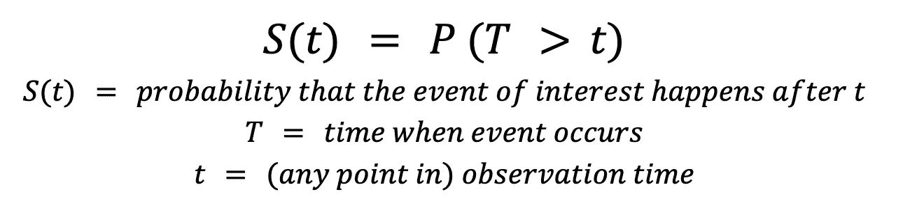

生存函数方程（作者提供的图片）

生存函数 S(t) 显示了 **在某个时间（t）之后对象存活的概率（未经历事件）**。这是一个非递增函数，意味着随着时间的推移值会减少。

生存分析中的另一个关键方程是 **危险函数**，它展示了 **在某个时间事件发生的概率，给定到那时的生存状态**（事件尚未发生）。危险函数 h(t) 显示了事件发生的概率 **在下一瞬间**，前提是它已经存活到时间 t。

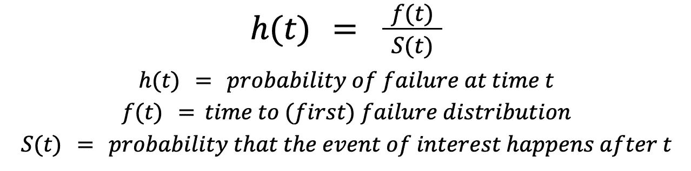

危险函数方程（作者提供的图片）

危险函数 h(t) 和生存函数 S(t) **可以相互推导**。

## 生存分析的数据集

由于生存分析侧重于“事件”及其“生命周期”或生存时间，因此数据集需要是 **个体对象的观察**，包含 **事件发生**（是/否的二元值）和 **观察的持续时间**。

数据还需要考虑 ***删失***。删失发生在生存时间或 **事件发生时间只有部分已知**（即未知的开始日期或未知的结束日期或两者都有）。最常见的类型是 ***右删失***，即 **在观察/分析时间结束时事件尚未发生**（生存时间大于观察到的时间）。只要 (1) 删失数据在可接受的比例范围内（< 50%），并且 (2) 删失是非信息性和随机的（对生存没有影响），我们就可以使用生存分析。

# 生存分析技术

根据分析的目标，可以使用几种生存分析技术。

+   **识别组内成员的生存时间**：Kaplan-Meier 估计器、Weibull 模型、加速失效时间模型

+   **比较两个或多个组的生存时间**：对数秩检验

+   **描述变量对生存的影响**：Cox 比例风险模型

*本文中使用的脚本和分析探索可以在这个* [*GitHub 仓库*](https://github.com/oliviatan29/survival-analysis)*中找到。*

## Kaplan-Meier 估计器

[Kaplan-Meier 估计器](https://en.wikipedia.org/wiki/Kaplan%E2%80%93Meier_estimator) 是一种 ***非参数*** 统计方法，用于 **估计时间到事件数据的生存函数**。由于它是非参数的，它不依赖于特定的潜在分布假设或其他关于总体参数的假设。这在我们的数据不能假设来自正态分布时非常有用，因此常规回归不能用于预测。

在该模型中，生存函数 S(t) 使用以下公式进行估计。

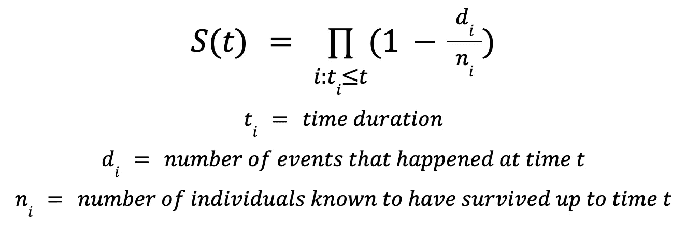

Kaplan-Meier 估计器（图像来源：作者）

在时间 t 的生存率等于在时间 t 的生存百分比和每个前期时间的乘积。

在 Python 中，这可以使用 `[lifelines](https://lifelines.readthedocs.io/en/latest/)` 包来完成。使用此包，我们可以绘制输入观察值的生存函数，并进行预测以检查在任意特定时间点的生存可能性。

```py
from lifelines import KaplanMeierFitter

kmf = KaplanMeierFitter()

kmf.fit(durations=df['Tool wear [min]'], 
        event_observed=df['Target'])

# Visualize the survival curve
kmf.plot_survival_function()
plt.show()

# Print the survival probability for each data point
print(kmf.survival_function)
```

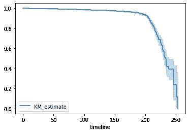

Kaplan-Meier 生存函数可视化（图像来源：作者）

```py
# Getting the median survival time
print(kmf.median_survival_time_)

# Show the last 20 duration probability 
kmf.survival_function_.tail(20)
```

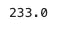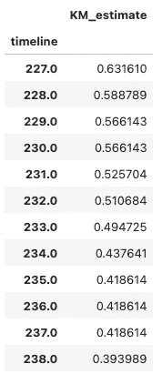

Kaplan-Meier 估计器结果（图像来源：作者）

在某些情况下，我们可能还会对**比较数据集中每个组的生存函数**感兴趣，例如比较不同年龄组或产品类别的生存情况。进行这种比较的一种方法是可视化各组之间的 Kaplan-Meier 生存函数。

```py
high_machine = df[df['Type'] == "H"]
medium_machine = df[df['Type'] == "M"]
low_machine = df[df['Type'] == "L"]

# Instantiate a KaplanMeierFitter object
kmf = KaplanMeierFitter()

# Fit kmf to high group
kmf.fit(durations=high_machine['Tool wear [min]'], event_observed=high_machine['Target'], label='H')

# Create a plot of the survival function
surv_plot = kmf.plot_survival_function()

# Fit kmf to other groups
kmf.fit(durations=medium_machine['Tool wear [min]'], event_observed=medium_machine['Target'], label='M')
kmf.plot_survival_function(ax=surv_plot)

kmf.fit(durations=low_machine['Tool wear [min]'], event_observed=low_machine['Target'], label='L')
kmf.plot_survival_function(ax=surv_plot)

# Visualize plot
plt.show()
```

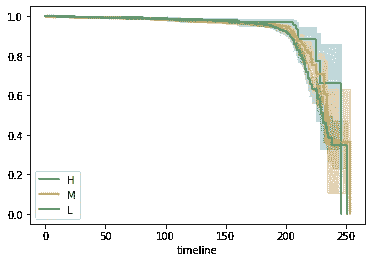

各组之间的生存函数比较（图像来源：作者）

为了进行更准确的统计比较，我们可以使用[**对数秩检验**](https://en.wikipedia.org/wiki/Logrank_test)对这些组之间的生存相似性进行统计测试。

+   我们使用零假设 (H0) 进行检验，假设各组之间的生存率相同。

+   我们检查统计测试的 p 值以检查在零假设为真的情况下数据出现的可能性

+   **低 p 值 (p ≤ 0.05)** 表明***统计显著***的测试结果，这意味着**零假设应被拒绝**

对数秩检验比较生存概率 *Si* 之间的差异

各时间点 *t* 的分组。

```py
# Import logrank_test
from lifelines.statistics import logrank_test

# Run log-rank test to compare high and low category machines
test_results = logrank_test(durations_A = high_machine['Tool wear [min]'],
                               durations_B = low_machine['Tool wear [min]'],
                               event_observed_A = high_machine['Target'],
                               event_observed_B = low_machine['Target'])

# Print out the p-value of log-rank test results
print(test_results.p_value)
test_results.print_summary
```

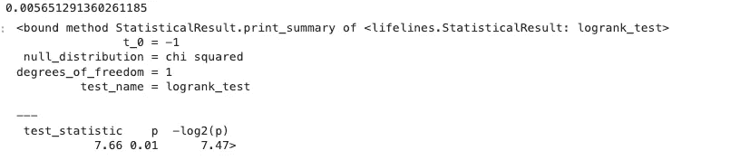

对数秩检验结果。p 值结果为 < 0.05，这意味着这些组之间的生存率不相同（图像来源：作者）

## Weibull 模型

上述 Kaplan-Meier 估计器和对数秩检验属于**单变量分析**，它将生存建模为**单个分类因子**变量的函数。对于分析多个变量对生存函数的影响，我们可以使用参数模型，如[Weibull 模型](https://en.wikipedia.org/wiki/Weibull_distribution)。该模型基于 Weibull 分布的连续概率分布假设。

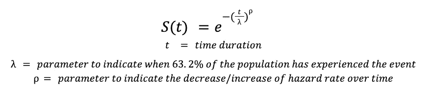

Weibull 模型的生存函数（图像来源：作者）

以下是使用 `lifelines` 库在 Python 中应用 Weibull 模型的示例。

```py
from lifelines import WeibullFitter

# Instantiate WeibullFitter class
wb = WeibullFitter()

# Fit data
wb.fit(df_new['Tool wear [min]'], df_new['Target'])

# Plot survival function
wb.survival_function_.plot()
plt.show()

# Show Weibull model results
wb.summary
```

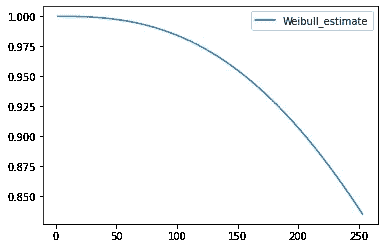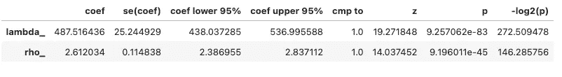

Weibull 模型结果（图像来源：作者）

如上所示，Weibull 模型生成**平滑的生存曲线**，而不是阶跃函数。上面的ρ（rho）值为**大于 1**，这表明该模型中的风险率**始终在增加**。

## Cox 比例风险（CoxPH）模型

[Cox 比例风险模型](https://en.wikipedia.org/wiki/Proportional_hazards_model)是可以**评估不同因素对生存影响**的模型之一。它在假设协变量对所有观测值有*相同效果*且变量之间*没有未指定的交互作用*的基础上运行。

**Cox 比例风险（Cox PH）模型**是一种回归模型，用于回归协变量与事件时间/持续时间。由于它是一个回归模型，你需要**与观测相关的协变量（分类变量）列表**来拟合模型，此外还有其他估计器中的事件和持续时间。临床研究中的协变量示例包括患者的年龄、体重、吸烟行为、是否遵循饮食、是否有某种过敏等。

```py
from lifelines import CoxPHFitter

# Instantiate CoxPHFitter class cph
cph = CoxPHFitter()

# Fit cph to data
cph.fit(df=df_new, duration_col="Tool wear [min]", event_col="Target")

# Print model summary
cph.summary
```

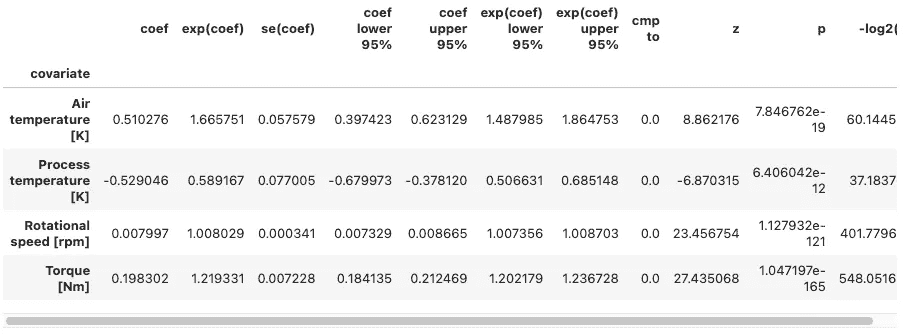

CoxPH 模型结果（图像由作者提供）

从 CoxPH 模型结果中需要关注的关键变量是（1）`exp(coef)`列和（2）`p`列（p 值）。

+   `exp(coef)`列显示了变量的风险比。

+   `p`（p 值）表示哪些协变量对生存持续时间有显著影响。p 值较低（< 0.05）的预测变量是统计上显著的预测因子，用于确定生存持续时间。

[变量 X]从其中位值增加一个单位意味着**风险因子变化为 e[coef(x)]**。在上面的示例截图中，随着“旋转速度 [rpm]”从其中位值增加，机器的风险因子变化为 e[0.0079] = 1.008，这意味着相比于基线风险增加了 0.8%。

# 结束

生存分析是一种统计技术，用于分析事件发生的预期时间。虽然最初用于医疗领域，但其应用也可以扩展到各种用例，包括预测维护（预测设备故障）、客户分析（预测流失/购买时间）以及贷款建模（预测违约）。

生存分析可以使用几种技术，包括 Kaplan-Meier 估计器和 Weibull 模型来建模群体的生存函数，log-rank 检验来比较群体之间的生存时间，CoxPH 模型和加速失效时间（AFT）来描述分类或定量变量对生存的影响。每种模型都基于某些假设/分布，并可以使用其[Akaike 信息准则（AIC）](https://en.wikipedia.org/wiki/Akaike_information_criterion)或[qq 图](https://en.wikipedia.org/wiki/Q%E2%80%93Q_plot)进行比较，以确定最适合数据集的模型。

*在本文中使用的脚本和分析探索可以在这个* [*GitHub 仓库*](https://github.com/oliviatan29/survival-analysis)*中找到。*
