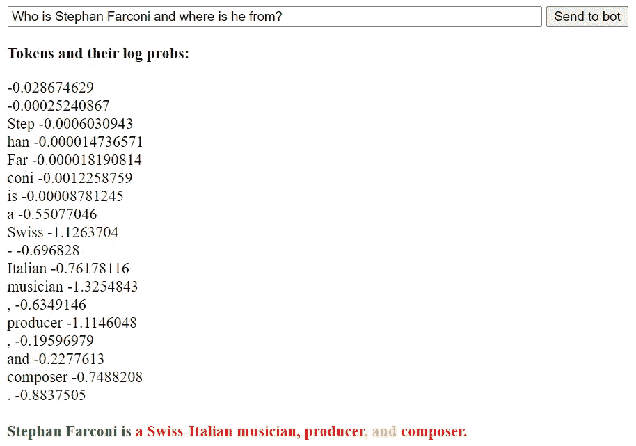

# 探索令牌概率作为过滤 GPT-3 答案的一种手段

> 原文：[`towardsdatascience.com/exploring-token-probabilities-as-a-means-to-filter-gpt-3s-answers-3e7dfc9ca0c`](https://towardsdatascience.com/exploring-token-probabilities-as-a-means-to-filter-gpt-3s-answers-3e7dfc9ca0c)

## 为了构建更好的 GPT-3 驱动的聊天机器人

[](https://lucianosphere.medium.com/?source=post_page-----3e7dfc9ca0c--------------------------------)[](https://towardsdatascience.com/?source=post_page-----3e7dfc9ca0c--------------------------------) [LucianoSphere (Luciano Abriata, PhD)](https://lucianosphere.medium.com/?source=post_page-----3e7dfc9ca0c--------------------------------)

·发布于 [Towards Data Science](https://towardsdatascience.com/?source=post_page-----3e7dfc9ca0c--------------------------------) ·阅读时间 12 分钟·2023 年 1 月 19 日

--


GPT-3 为构成显示句子的每个令牌生成的对数概率，旨在测试系统。该图片由作者从一个用于执行这些测试的 Web 应用程序的截图中合成，链接在文章的末尾。

随着强大的语言模型越来越普及，对它们生成的内容进行控制的需求变得更加紧迫。这些模型在大量文本数据上进行训练，能够生成非常有说服力的书面内容，从新闻文章到社交媒体帖子。然而，如果没有适当的监督，它们也可能产生虚假信息或各种有害内容。因此，使用这些语言模型的应用程序必须尝试检查这些 AI 系统生成的信息的真实性，以防止传播虚假、误导或有害的信息。

像许多人一样，可能包括你自己，因为你正在阅读这篇文章，我已经大量使用了 GPT-3 和 ChatGPT，在这个过程中我发现它们经常以非常有说服力但却不正确的方式回答问题。事实上，当 GPT-3 发布时，我在进行深入探索，就像我对学生在科学学科中进行的考试一样：

[](https://pub.towardsai.net/power-limitations-and-use-cases-of-gpt-3-from-my-tests-and-prototype-apps-you-can-replicate-right-89bfb40daf5e?source=post_page-----3e7dfc9ca0c--------------------------------) [## GPT-3 的能力、限制和使用案例：从我的测试和原型应用中你可以复制的……

### 通过智能聊天机器人展示，它们甚至可以自然地听和说命令程序，或作为全职助手帮助学生……

[更多详情](https://pub.towardsai.net/power-limitations-and-use-cases-of-gpt-3-from-my-tests-and-prototype-apps-you-can-replicate-right-89bfb40daf5e?source=post_page-----3e7dfc9ca0c--------------------------------)

最近，尽管我意识到这些限制，但我还是迫切开始创建由 GPT-3 驱动的聊天机器人。最初通过修补一些 PHP 库并编写相应的 JavaScript 代码，最近则完全使用 JavaScript：

[## 用少于 20 行 JavaScript 代码构建类似 ChatGPT 的机器人核心代码！](https://pub.towardsai.net/core-code-to-build-chatgpt-like-bots-in-20-lines-of-javascript-c2a506e5cc9a?source=post_page-----3e7dfc9ca0c--------------------------------)

### 不再像之前的示例那样使用 PHP。通过直接在 JavaScript 中使用现代 fetch() 函数，现在更容易...

[更多详情](https://pub.towardsai.net/core-code-to-build-chatgpt-like-bots-in-20-lines-of-javascript-c2a506e5cc9a?source=post_page-----3e7dfc9ca0c--------------------------------)

在处理那个最后的项目，即从纯 JavaScript 调用 GPT-3 时，我深入探索了 OpenAI 的 GPT-3 API 参考，发现可以非常容易地检索到与语言模型生成的每个标记相关联的一系列分数。这些分数实际上是以对数形式表示的概率，由 GPT-3 一次生成一个标记，并与文本预测一起提供。这些概率衡量了 GPT-3 生成的不同标记的“概率”。虽然这些概率可能包含有关 GPT-3 对生成内容的确定性的信息，但这并非给定。因此，我决定通过一系列新的 JavaScript 应用程序进行动手研究，你可以在这些应用程序的基础上进行扩展。

更具体地说，我将探讨如何检索这些标记概率以及它们在我知道是正确或错误的文本中的取值。我还将探讨少量学习对这些分数的影响，以了解它是否确实使 GPT-3 对其答案更有信心。

# GPT-3 和标记对数概率

如果你正在阅读这篇文章，GPT-3 可能无需介绍。但如果需要介绍，GPT-3 代表生成预训练变换器（目前是第 3 版，但实际上由多个不同版本的模型组成），它是一个先进的语言模型，根据输入生成书面内容。

当你将一些文本输入到 GPT-3 中（称为“提示”）时，它会被拆分为所谓的标记，这些标记是从单个字母到音节甚至单词的可变大小的单位（根据各种因素）。这些标记在网络中传播，结果合成出新的标记，这些标记一起形成新的单词、句子和段落。这些文本通常具有意义和相当好的语法，除非你处理的是 GPT-3 在训练中很少见的异域语言。然而，它们的内容不一定准确，特别是如果你期望它“思考”某个问题或在概念之间建立关系，或者如果你询问模型在训练期间未见过的事物（例如，它不会知道我是谁，所以它可能会编造一些东西，见下例）。

GPT-3 和其他大型语言模型的一个重要特性是它们是“少样本学习者”，这意味着它们可以处理并“理解”在提示中传递的一些信息，然后可能基于这些信息回答问题或执行任务。arXiv 上有一篇完整的预印本解释了这一点；我也有几个示例项目利用了这一特性：

[](https://arxiv.org/abs/2005.14165?source=post_page-----3e7dfc9ca0c--------------------------------) [## 语言模型是少样本学习者

### 最近的工作表明，通过在大规模语料库上进行预训练，许多自然语言处理任务和基准测试取得了显著的进展…

[arxiv.org](https://arxiv.org/abs/2005.14165?source=post_page-----3e7dfc9ca0c--------------------------------) [](https://lucianosphere.medium.com/why-you-should-and-how-you-can-inform-your-chatbots-with-custom-data-or-wikipedia-access-500995dc87f3?source=post_page-----3e7dfc9ca0c--------------------------------) [## 为什么你应该以及如何用自定义数据或维基百科访问来告知你的聊天机器人

### 将我完全基于网络的、由 GPT-3 驱动的聊天机器人扩展为能够了解我提供的内容或自动检索的内容…

[lucianosphere.medium.com](https://lucianosphere.medium.com/why-you-should-and-how-you-can-inform-your-chatbots-with-custom-data-or-wikipedia-access-500995dc87f3?source=post_page-----3e7dfc9ca0c--------------------------------)

现在，我在这里讨论的 GPT-3 的一个特性（尽管其重要性巨大，但在互联网上讨论不多）是，除了返回文本之外，GPT-3 还可以返回与构成生成文本的每个标记相关的概率。这些概率实际上以对数形式返回，测量每个标记在输出文本上下文中出现的可能性。较低的对数概率表示不太可能的词，较高的对数概率表示更可能的词。

根据 ChatGPT 自身的说法，GPT-3 使用这些对数概率来生成连贯且语法正确的文本；此外，它使用对数概率来生成下一个词，基于最有可能的下一个词，从而生成语境上准确的文本。我将在这里调查这是否也包含有关内容准确性的信息。剧透：是的，至少有一点；此外，少量示例学习不仅改善了回答本身，还改善了对数概率。

## 调用 GPT-3 的 API 时获取对数概率

需要注意的是，GPT-3 和其他语言模型一样，无法区分真实和虚假的信息。它只是基于从训练数据中学到的模式和提示中提供的少量示例生成文本。

对数概率原则上可以帮助检测不正确的信息；但我们怎么获取它们呢？

这是我最近展示的代码的一个小修改，完全用 JavaScript 调用 GPT-3 的 API，并修改为获取标记对数概率：

```py
// Your OpenAI API key
const apiKey = “(your API key here)”;

fetch(
 `https://api.openai.com/v1/completions`,
 {
 body: JSON.stringify({
  “model”: “text-davinci-003”,
  “prompt”: “Where is Luciano Abriata from?”,
  “temperature”: 0,
  “max_tokens”: 20,
  “logprobs”: 1}),         //Note we request for logprobs
 method: “POST”,
 headers: {
 “content-type”: “application/json”,
 Authorization: “Bearer ” + apiKey,
 },
 }
 ).then((response) => {
 if (response.ok) {
 response.json().then((json) => {
 console.log(json);
 });
 }
 });
```

fetch()调用包括调用 GPT-3 并获取文本和标记概率所需的一切。提示包括少量示例学习的信息，放在问题“Luciano Abriata 来自哪里？”之前。

# 测试不同场景下的标记概率

让我们看看如果我们用一个只包含问题“Luciano Abriata 来自哪里？”的提示调用上述函数，会发生什么，也就是说，没有任何解释我来自阿根廷的辅助信息。

我们期望 GPT-3 不会知道我来自哪里，因为我不是名人。事实上，它“编造”了我来自意大利：


（有趣的事实：这并不太偏差，因为我的祖先都是意大利人……在这里，GPT-3 可能基于我的名字做出了猜测……但不，我在阿根廷出生和长大。）

现在，我们在控制台日志中看到什么？除了输出文本本身，还有很多有趣的输出。让我们分析一下最重要的元素：

首先，你会看到包含输出的对象**text**：*Luciano Abriata is from Italy*。

但在**text**的几行上方，你会看到一个包含构成该文本的标记的数组。在这个数组的几行上方，你会看到**token_logprobs**，这是一个相同大小的数组，列出了每个标记的对数概率。

你可以看到**token_logprobs**在第 9 个标记“意大利”处达到了-0.49 的最低值，而其他所有标记都非常接近 0（除了结尾处的标记也为负值，但我们不关心这些结尾标记）。

这原则上是好消息，因为这意味着 GPT-3 提供了一个线索，表明这个信息可能是错误的，或者是“编造”的。不过，我们不要急于得出结论，还是进一步探索一下。

如果我们在提示中提供一些信息，然后询问相关内容会怎样？比如这样：

> Luciano Abriata 是一位出生在阿根廷的科学家，目前在瑞士工作。他从事结构生物学、虚拟现实、核磁共振、科学写作、编程等工作。Luciano Abriata 是哪里人？

```py
// Your OpenAI API key
const apiKey = “(your API key here)”;

fetch(
 `https://api.openai.com/v1/completions`,
 {
 body: JSON.stringify({
  “model”: “text-davinci-003”,
  “prompt”: “Luciano Abriata is a scientist from Argentina, now working
             in Switzerland. He works on structural biology, virtual
             reality for chemistry, NMR, etc.
             Where is Luciano Abriata from?”,
  “temperature”: 0,
  “max_tokens”: 20,
  “logprobs”: 1}),         //Note we request for logprobs
 method: “POST”,
 headers: {
 “content-type”: “application/json”,
 Authorization: “Bearer ” + apiKey,
 },
 }
 ).then((response) => {
 if (response.ok) {
 response.json().then((json) => {
 console.log(json);
 });
 }
 });
```

在这种情况下，GPT-3 不仅正确回答了我来自阿根廷，还自信地说：“阿根廷”，在标记 9 中，其对数概率非常接近 0：


## 更全面的测试是通过在生成的文本上用颜色表示标记概率

为了测试对潜在不准确信息标记的对数概率的威力，我编写了这个简单的网页应用程序（链接在文末附近），它处理一个带有 GPT-3 的提示，并显示每个标记按其对数概率上色的生成文本：


在这个应用程序中，你可以通过我在下面提供的链接进行尝试，每个标记的颜色键是通过 HTML 的 <font> 标签注入的，如下所示：

+   对数概率 > -0.1 → 绿色

+   -0.3 > 对数概率 > -0.1 → 黄色

+   -0.5 > 对数概率 > -0.3 → 橙色

+   对数概率 < -0.5 → 红色

让我们稍微分析一下：问题是关于我虚构的一个人，而 GPT-3 只是回答了，而不是说它不知道，尽管温度是 0，所以不应该虚构内容……显然，不能依赖温度参数来防止生成虚假信息。

现在，请注意对于这个虚构角色（他是意大利人，是哲学家和哲学教授，在罗马大学拉萨比恩扎）的 4 个最重要特征，有些被强烈标记：

“哲学家和哲学教授”的对数概率平均值约为 -1，而“罗马 La”的对数概率约为 -1.5。

同时，“Sapienza”可能保持未被标记，即对数概率较高，因为它是“罗马大学 La”的完美延续。同样，“意大利人”可能保持高概率，因为它紧跟在“Giulio”之后，“Giulio”是一个非常意大利的名字。

因此，低对数概率似乎指示潜在的不准确信息，但高值并不能确保事实准确性。

> 低对数概率似乎指示潜在的不准确信息，但高值并不能确保事实准确性。

现在我们尝试将“Giulio”改为“John”，即询问“John Caranchani 是谁？”：


这次它虚构了这个角色是意大利裔美国人，并且以相当差的分数标记了这一信息。

再做一次测试，使用典型的法国名字“Philippe”：


现在它虚构了这个角色是法国人，并用橙色标记了这一点。

现在我们来询问一些不同的问题：化学。醋酸的分子式是什么？


我们得到了一个正确的答案，所有的标记都是绿色，表明分数非常好。

如果我们虚构一个分子呢？例如 Bizarric 酸：


看起来它确实“意识到”它在编造东西。当然，我们更希望 GPT-3 回答“我不知道”或“Bizarric acid 不存在”。但一个非常糟糕的分数总比没有好。

## 传递信息进行少量学习的效果

正如之前讨论过的以及在许多文章中提到的，GPT-3 可以从传递的文本片段中提取信息进行少量学习，从而更准确地回答问题——至少根据传递的信息来说。

这在令牌概率中是如何体现的？

让我们看看一个例子。我虚构了一个名叫 Stephan Farconi 的人，想知道他来自哪里以及他做什么：



正如预期的那样，一切都是虚构的，并且标记了差分数。

现在让我们给 GPT-3 一些关于这个人的信息，再次提问：


答案现在与传递的信息在事实上一致，并且 GPT-3 将一部分（“希腊”）标记为确定。然而，它对“计算机科学家”不太确定。请注意，“科学家”是“计算机”的良好续接，所以在我看来 GPT-3 实际上对整个“计算机科学家”概念是“没有把握”的。

## 想试试这个应用吗？

在这里：

[**https://lucianoabriata.altervista.org/tests/gpt-3/js-only/GPT3-JSonly-logprobs-color.html**](https://lucianoabriata.altervista.org/tests/gpt-3/js-only/GPT3-JSonly-logprobs-color.html)

只需粘贴你的 OpenAI API 密钥用于 GPT-3，输入一个问题或提示，然后点击“发送给机器人”。

请在评论中分享你的结果！令牌概率是否反映了生成文本的实际准确性？

# 结论

在聊天机器人应用中使用 GPT-3 及类似语言模型可能会在生成准确可靠的信息方面带来重大挑战。虽然新方法有望提高真实性，但目前的一个选项是利用令牌概率来衡量 GPT-3 对每个构成其输出的令牌的“确定性”。我向你展示了使用这些信息可以近似估计 GPT-3 在其生成文本中的信心水平，但这并不完全可靠。

从测试的几个例子来看，所有令牌的高分似乎表明信息是准确的，但某些令牌的低分并不一定意味着信息是错误的。当然，这仅仅是个案证据，需要更大规模的研究来认真评估。这可能是一个有趣的项目，一个研究 AI 的团队可以相对容易地进行，只需要足够多的人与系统互动，提出问题并评估答案。（此外，请注意，我选择解释日志概率的阈值是有些随意的。）

我还向你展示了少样本学习不仅能提高回答的准确性，特别是对于 GPT-3“不知道”的问题，还能提高其可靠性，这通过令牌概率来衡量。然而，我们也看到，通过少样本学习提供的信息并不能保证回答中的高分，即使这些回答中的信息是正确的。

总体来看，令牌概率看起来很有前景，但即使没有全面评估，也很明显它们是易出错的。因此，谨慎使用 GPT-3 是至关重要的，可能利用令牌概率来改进输出，但不要过于依赖它们。

[***www.lucianoabriata.com***](https://www.lucianoabriata.com/) *我撰写和拍摄的内容涵盖了我广泛兴趣领域中的一切：自然、科学、技术、编程等。* [***成为 Medium 会员***](https://lucianosphere.medium.com/membership) *以访问所有故事（平台的关联链接，我会获得少量收入，不会增加你的费用）以及* [***订阅以获取我的新故事***](https://lucianosphere.medium.com/subscribe) ***通过电子邮件****。如需* ***咨询小型工作，*** *请查看我的* [***服务页面***](https://lucianoabriata.altervista.org/services/index.html)*。你可以* [***在这里联系我***](https://lucianoabriata.altervista.org/office/contact.html)***。***
