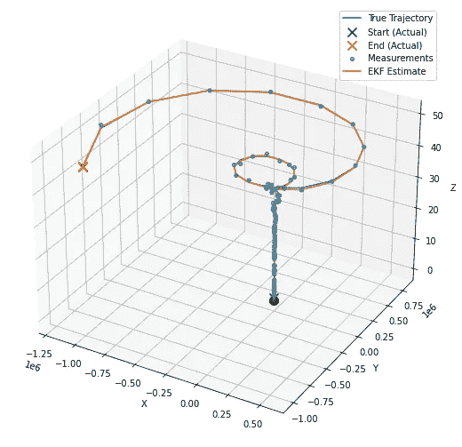

# 揭示卡尔曼滤波器的强大功能

> 原文：[`towardsdatascience.com/exposing-the-power-of-the-kalman-filter-1b78621c3f56?source=collection_archive---------0-----------------------#2023-11-07`](https://towardsdatascience.com/exposing-the-power-of-the-kalman-filter-1b78621c3f56?source=collection_archive---------0-----------------------#2023-11-07)

[](https://medium.com/@jceweaver?source=post_page-----1b78621c3f56--------------------------------)[](https://towardsdatascience.com/?source=post_page-----1b78621c3f56--------------------------------) [Jimmy Weaver](https://medium.com/@jceweaver?source=post_page-----1b78621c3f56--------------------------------)

·

[关注](https://medium.com/m/signin?actionUrl=https%3A%2F%2Fmedium.com%2F_%2Fsubscribe%2Fuser%2F73e4cc6810b7&operation=register&redirect=https%3A%2F%2Ftowardsdatascience.com%2Fexposing-the-power-of-the-kalman-filter-1b78621c3f56&user=Jimmy+Weaver&userId=73e4cc6810b7&source=post_page-73e4cc6810b7----1b78621c3f56---------------------post_header-----------) 发表在 [Towards Data Science](https://towardsdatascience.com/?source=post_page-----1b78621c3f56--------------------------------) · 17 min 阅读 · 2023 年 11 月 7 日

--

[](https://medium.com/m/signin?actionUrl=https%3A%2F%2Fmedium.com%2F_%2Fbookmark%2Fp%2F1b78621c3f56&operation=register&redirect=https%3A%2F%2Ftowardsdatascience.com%2Fexposing-the-power-of-the-kalman-filter-1b78621c3f56&source=-----1b78621c3f56---------------------bookmark_footer-----------)

作为数据科学家，我们偶尔会遇到需要建模趋势以预测未来值的情况。虽然有时会倾向于关注统计学或机器学习算法，但我在这里要介绍一个不同的选择：卡尔曼滤波器（KF）。

在 1960 年代初期，**鲁道夫·E·卡尔曼**彻底改变了如何用 KF 建模复杂系统。从引导飞机或航天器到达目的地，到让你的智能手机在这个世界中找到位置，这个算法将数据和数学融合在一起，以令人难以置信的精度提供未来状态的估计。

在本博客中，我们将深入探讨 Kalman 滤波器的工作原理，展示 Python 示例，以强调这一技术的真正力量。从简单的 2D 示例开始，我们将看到如何修改代码以适应更高级的 4D 空间，并最终涵盖扩展 Kalman 滤波器（复杂的继任者）。加入我，一起踏上预测算法和滤波器的世界之旅。


# Kalman 滤波器的基础

KF 通过构建和持续更新一组协方差矩阵（表示噪声和过去状态的统计分布），并从观察和其他时间测量中收集数据，来提供系统状态的估计。与其他现成算法不同，可以通过定义系统和外部源之间的数学关系直接扩展和改进解决方案。虽然这可能听起来相当复杂和精细，但这个过程可以总结为两个步骤：预测和更新。这些阶段协同工作，以迭代方式校正和完善系统的状态估计。

**预测步骤：**

这个阶段主要是基于模型已知的后验估计和时间步长Δk 预测系统的下一状态。数学上，我们将状态空间的估计表示为：


其中，F，即我们的状态转移矩阵，模型如何在控制输入和过程噪声无关的情况下，状态从一步演变到另一部。我们的矩阵 B 模型控制输入 uₖ对状态的影响。

除了对下一状态的估计外，该算法还计算由协方差矩阵 *P* 表示的估计不确定性：


预测的状态协方差矩阵表示我们预测的信心和准确性，受到来自系统本身的过程噪声协方差矩阵 *Q* 的影响。我们将此矩阵应用于更新步骤中的后续方程，以校正 Kalman 滤波器对系统的持有信息，从而改善未来的状态估计。

**更新步骤：**

在更新步骤中，算法对 Kalman 增益、状态估计和协方差矩阵进行更新。Kalman 增益确定新测量对状态估计的影响程度。计算包括观察模型矩阵 *H*，它将状态与我们期望接收到的测量相关联，以及 *R* 测量噪声协方差矩阵，表示测量中的误差：


从本质上讲，*K* 试图平衡预测中的不确定性与测量中的不确定性。如上所述，Kalman 增益被应用于校正状态估计和协方差，具体如下所示的方程：


其中括号中的计算用于状态估计，是实际测量值与模型预测值之间的残差。

卡尔曼滤波器的真正美妙之处在于它的递归性质，随着新信息的接收不断更新状态和协方差。这使得模型能够以统计学上最优的方式随着时间的推移进行优化，这是对接收一系列噪声观测值的系统建模特别强大的方法。

# 卡尔曼滤波器在操作中

卡尔曼滤波器背后的方程可能会让人感到非常困惑，要完全理解其工作原理，仅凭数学是不够的，需要了解状态空间（超出此博客的范围），但我会尝试用一些 Python 示例来使其生动化。在最简单的形式下，我们可以将卡尔曼滤波器对象定义为：

```py
import numpy as np

class KalmanFilter:
    """
    An implementation of the classic Kalman Filter for linear dynamic systems.
    The Kalman Filter is an optimal recursive data processing algorithm which
    aims to estimate the state of a system from noisy observations.

    Attributes:
        F (np.ndarray): The state transition matrix.
        B (np.ndarray): The control input marix.
        H (np.ndarray): The observation matrix.
        u (np.ndarray): the control input.
        Q (np.ndarray): The process noise covariance matrix.
        R (np.ndarray): The measurement noise covariance matrix.
        x (np.ndarray): The mean state estimate of the previous step (k-1).
        P (np.ndarray): The state covariance of previous step (k-1).
    """
    def __init__(self, F, B, u, H, Q, R, x0, P0):
        """
        Initializes the Kalman Filter with the necessary matrices and initial state.

        Parameters:
            F (np.ndarray): The state transition matrix.
            B (np.ndarray): The control input marix.
            H (np.ndarray): The observation matrix.
            u (np.ndarray): the control input.
            Q (np.ndarray): The process noise covariance matrix.
            R (np.ndarray): The measurement noise covariance matrix.
            x0 (np.ndarray): The initial state estimate.
            P0 (np.ndarray): The initial state covariance matrix.
        """
        self.F = F  # State transition matrix
        self.B = B  # Control input matrix
        self.u = u  # Control vector
        self.H = H  # Observation matrix
        self.Q = Q  # Process noise covariance
        self.R = R  # Measurement noise covariance
        self.x = x0  # Initial state estimate
        self.P = P0  # Initial estimate covariance

    def predict(self):
        """
        Predicts the state and the state covariance for the next time step.
        """
        self.x = self.F @ self.x + self.B @ self.u
        self.P = self.F @ self.P @ self.F.T + self.Q
        return self.x

    def update(self, z):
        """
        Updates the state estimate with the latest measurement.

        Parameters:
            z (np.ndarray): The measurement at the current step.
        """
        y = z - self.H @ self.x
        S = self.H @ self.P @ self.H.T + self.R
        K = self.P @ self.H.T @ np.linalg.inv(S)
        self.x = self.x + K @ y
        I = np.eye(self.P.shape[0])
        self.P = (I - K @ self.H) @ self.P

        return self.x
```

我们将使用 `predict()` 和 `update()` 函数来迭代前面概述的步骤。上述滤波器设计适用于任何时间序列，为了显示我们的估计与实际情况的比较，让我们构建一个简单的示例：

```py
import numpy as np
import matplotlib.pyplot as plt

# Set the random seed for reproducibility
np.random.seed(42)

# Simulate the ground truth position of the object
true_velocity = 0.5  # units per time step
num_steps = 50
time_steps = np.linspace(0, num_steps, num_steps)
true_positions = true_velocity * time_steps

# Simulate the measurements with noise
measurement_noise = 10  # increase this value to make measurements noisier
noisy_measurements = true_positions + np.random.normal(0, measurement_noise, num_steps)

# Plot the true positions and the noisy measurements
plt.figure(figsize=(10, 6))
plt.plot(time_steps, true_positions, label='True Position', color='green')
plt.scatter(time_steps, noisy_measurements, label='Noisy Measurements', color='red', marker='o')

plt.xlabel('Time Step')
plt.ylabel('Position')
plt.title('True Position and Noisy Measurements Over Time')
plt.legend()
plt.show()
```


实际上，“真实位置”是未知的，但我们在此处绘制它以供参考，“噪声测量”是输入到我们的卡尔曼滤波器中的观测点。我们将对矩阵进行非常基本的实例化，在某种程度上，卡尔曼模型会通过应用卡尔曼增益快速收敛，但在某些情况下，对模型进行热启动可能是合理的。

```py
# Kalman Filter Initialization
F = np.array([[1, 1], [0, 1]])   # State transition matrix
B = np.array([[0], [0]])          # No control input
u = np.array([[0]])               # No control input
H = np.array([[1, 0]])            # Measurement function
Q = np.array([[1, 0], [0, 3]])    # Process noise covariance
R = np.array([[measurement_noise**2]]) # Measurement noise covariance
x0 = np.array([[0], [0]])         # Initial state estimate
P0 = np.array([[1, 0], [0, 1]])   # Initial estimate covariance

kf = KalmanFilter(F, B, u, H, Q, R, x0, P0)

# Allocate space for estimated positions and velocities
estimated_positions = np.zeros(num_steps)
estimated_velocities = np.zeros(num_steps)

# Kalman Filter Loop
for t in range(num_steps):
    # Predict
    kf.predict()

    # Update
    measurement = np.array([[noisy_measurements[t]]])
    kf.update(measurement)

    # Store the filtered position and velocity
    estimated_positions[t] = kf.x[0]
    estimated_velocities[t] = kf.x[1]

# Plot the true positions, noisy measurements, and the Kalman filter estimates
plt.figure(figsize=(10, 6))
plt.plot(time_steps, true_positions, label='True Position', color='green')
plt.scatter(time_steps, noisy_measurements, label='Noisy Measurements', color='red', marker='o')
plt.plot(time_steps, estimated_positions, label='Kalman Filter Estimate', color='blue')

plt.xlabel('Time Step')
plt.ylabel('Position')
plt.title('Kalman Filter Estimation Over Time')
plt.legend()
plt.show()
```


即使是这种非常简单的解决方案设计，模型也能在噪声中找到真实位置。这可能适用于简单的应用，但趋势通常更为微妙，并受到外部事件的影响。为了解决这个问题，我们通常需要修改状态空间表示以及在新信息到达时计算估计值和修正协方差矩阵的方式，让我们通过另一个示例来深入探讨。

# 在 4D 中跟踪移动物体

假设我们想跟踪一个物体在空间和时间中的运动，为了使这个例子更具现实感，我们将模拟一些作用在其上的力，导致角度旋转。为了展示该算法在更高维状态空间表示中的适应性，我们将假设线性力，尽管实际上情况并非如此（我们将在之后探索一个更现实的例子）。下面的代码展示了我们如何针对这一特定场景修改卡尔曼滤波器。

```py
import numpy as np
import matplotlib.pyplot as plt
from mpl_toolkits.mplot3d import Axes3D

class KalmanFilter:
    """
    An implementation of the classic Kalman Filter for linear dynamic systems.
    The Kalman Filter is an optimal recursive data processing algorithm which
    aims to estimate the state of a system from noisy observations.

    Attributes:
        F (np.ndarray): The state transition matrix.
        B (np.ndarray): The control input marix.
        H (np.ndarray): The observation matrix.
        u (np.ndarray): the control input.
        Q (np.ndarray): The process noise covariance matrix.
        R (np.ndarray): The measurement noise covariance matrix.
        x (np.ndarray): The mean state estimate of the previous step (k-1).
        P (np.ndarray): The state covariance of previous step (k-1).
    """
    def __init__(self, F=None, B=None, u=None, H=None, Q=None, R=None, x0=None, P0=None):
        """
        Initializes the Kalman Filter with the necessary matrices and initial state.

        Parameters:
            F (np.ndarray): The state transition matrix.
            B (np.ndarray): The control input marix.
            H (np.ndarray): The observation matrix.
            u (np.ndarray): the control input.
            Q (np.ndarray): The process noise covariance matrix.
            R (np.ndarray): The measurement noise covariance matrix.
            x0 (np.ndarray): The initial state estimate.
            P0 (np.ndarray): The initial state covariance matrix.
        """
        self.F = F  # State transition matrix
        self.B = B  # Control input matrix
        self.u = u  # Control input
        self.H = H  # Observation matrix
        self.Q = Q  # Process noise covariance
        self.R = R  # Measurement noise covariance
        self.x = x0  # Initial state estimate
        self.P = P0  # Initial estimate covariance

    def predict(self):
        """
        Predicts the state and the state covariance for the next time step.
        """
        self.x = np.dot(self.F, self.x) + np.dot(self.B, self.u)
        self.P = np.dot(np.dot(self.F, self.P), self.F.T) + self.Q

    def update(self, z):
        """
        Updates the state estimate with the latest measurement.

        Parameters:
            z (np.ndarray): The measurement at the current step.
        """
        y = z - np.dot(self.H, self.x)
        S = np.dot(self.H, np.dot(self.P, self.H.T)) + self.R
        K = np.dot(np.dot(self.P, self.H.T), np.linalg.inv(S))
        self.x = self.x + np.dot(K, y)
        self.P = self.P - np.dot(np.dot(K, self.H), self.P)

# Parameters for simulation
true_angular_velocity = 0.1  # radians per time step
radius = 20
num_steps = 100
dt = 1  # time step

# Create time steps
time_steps = np.arange(0, num_steps*dt, dt)

# Ground truth state
true_x_positions = radius * np.cos(true_angular_velocity * time_steps)
true_y_positions = radius * np.sin(true_angular_velocity * time_steps)
true_z_positions = 0.5 * time_steps  # constant velocity in z

# Create noisy measurements
measurement_noise = 1.0
noisy_x_measurements = true_x_positions + np.random.normal(0, measurement_noise, num_steps)
noisy_y_measurements = true_y_positions + np.random.normal(0, measurement_noise, num_steps)
noisy_z_measurements = true_z_positions + np.random.normal(0, measurement_noise, num_steps)

# Kalman Filter initialization
F = np.array([[1, 0, 0, -radius*dt*np.sin(true_angular_velocity*dt)],
              [0, 1, 0, radius*dt*np.cos(true_angular_velocity*dt)],
              [0, 0, 1, 0],
              [0, 0, 0, 1]])
B = np.zeros((4, 1))
u = np.zeros((1, 1))
H = np.array([[1, 0, 0, 0],
              [0, 1, 0, 0],
              [0, 0, 1, 0]])
Q = np.eye(4) * 0.1  # Small process noise
R = measurement_noise**2 * np.eye(3)  # Measurement noise
x0 = np.array([[0], [radius], [0], [true_angular_velocity]])
P0 = np.eye(4) * 1.0

kf = KalmanFilter(F, B, u, H, Q, R, x0, P0)

# Allocate space for estimated states
estimated_states = np.zeros((num_steps, 4))

# Kalman Filter Loop
for t in range(num_steps):
    # Predict
    kf.predict()

    # Update
    z = np.array([[noisy_x_measurements[t]],
                  [noisy_y_measurements[t]],
                  [noisy_z_measurements[t]]])
    kf.update(z)

    # Store the state
    estimated_states[t, :] = kf.x.ravel()

# Extract estimated positions
estimated_x_positions = estimated_states[:, 0]
estimated_y_positions = estimated_states[:, 1]
estimated_z_positions = estimated_states[:, 2]

# Plotting
fig = plt.figure(figsize=(10, 8))
ax = fig.add_subplot(111, projection='3d')

# Plot the true trajectory
ax.plot(true_x_positions, true_y_positions, true_z_positions, label='True Trajectory', color='g')
# Plot the start and end markers for the true trajectory
ax.scatter(true_x_positions[0], true_y_positions[0], true_z_positions[0], label='Start (Actual)', c='green', marker='x', s=100)
ax.scatter(true_x_positions[-1], true_y_positions[-1], true_z_positions[-1], label='End (Actual)', c='red', marker='x', s=100)

# Plot the noisy measurements
ax.scatter(noisy_x_measurements, noisy_y_measurements, noisy_z_measurements, label='Noisy Measurements', color='r')

# Plot the estimated trajectory
ax.plot(estimated_x_positions, estimated_y_positions, estimated_z_positions, label='Estimated Trajectory', color='b')

# Plot settings
ax.set_xlabel('X position')
ax.set_ylabel('Y position')
ax.set_zlabel('Z position')
ax.set_title('3D Trajectory Estimation with Kalman Filter')
ax.legend()

plt.show()
```


这里有几点有趣的内容需要注意，在上面的图表中，我们可以看到模型如何在开始对观测值进行迭代时快速修正为估计的真实状态。模型在识别系统的真实状态方面也表现得相当好，估计值与真实状态（“真实轨迹”）交叉。这种设计可能适用于某些实际应用，但不适用于那些作用于系统的力是非线性的情况。相反，我们需要考虑卡尔曼滤波器的不同应用：扩展卡尔曼滤波器，它是我们迄今为止探索的前身，能够线性化传入观测的非线性。

# 扩展卡尔曼滤波器

当我们尝试建模一个观测值或系统动态是非线性的系统时，我们需要应用扩展卡尔曼滤波器（EKF）。这个算法与上一个算法不同，它通过将雅可比矩阵引入到解中，并执行泰勒级数展开，以找到状态转移和观测模型的一阶线性近似。为了用数学方式表达这个扩展，我们的关键算法计算现在变成：


对于状态预测，其中 f 是应用于先前状态估计的非线性状态转移函数，*u*是前一时间步的控制输入。


对于误差协方差预测，其中*F*是状态转移函数相对于*P*（上一个误差协方差）的雅可比矩阵，*Q*是过程噪声协方差矩阵。


我们在时间步长*k*时对观测量*z*的观察，其中*h*是应用于我们状态预测的非线性观测函数，加上一些观测噪声*v*。


对卡尔曼增益计算的更新，其中*H*是观测函数相对于状态的雅可比矩阵，*R*是测量噪声协方差矩阵。


包含卡尔曼增益和非线性观测函数的状态估计修改计算，最后是更新误差协方差的方程：


在最后一个例子中，这将使用雅可比矩阵来线性化角旋转对物体的非线性影响，相应地修改代码。设计 EKF 比 KF 更具挑战性，因为我们对一阶线性近似的假设可能会无意中引入错误到我们的状态估计中。此外，雅可比矩阵计算可能变得复杂、计算开销大，并且在某些情况下难以定义，这也可能导致错误。然而，如果设计正确，EKF 通常会优于 KF 实现。

基于我们之前的 Python 示例，我展示了 EKF 的实现：

```py
import numpy as np
import matplotlib.pyplot as plt
from mpl_toolkits.mplot3d import Axes3D

class ExtendedKalmanFilter:
    """
    An implementation of the Extended Kalman Filter (EKF).
    This filter is suitable for systems with non-linear dynamics by linearising
    the system model at each time step using the Jacobian.

    Attributes:
        state_transition (callable): The state transition function for the system.
        jacobian_F (callable): Function to compute the Jacobian of the state transition.
        H (np.ndarray): The observation matrix.
        jacobian_H (callable): Function to compute the Jacobian of the observation model.
        Q (np.ndarray): The process noise covariance matrix.
        R (np.ndarray): The measurement noise covariance matrix.
        x (np.ndarray): The initial state estimate.
        P (np.ndarray): The initial estimate covariance.
    """
    def __init__(self, state_transition, jacobian_F, observation_matrix, jacobian_H, Q, R, x, P):
        """
        Constructs the Extended Kalman Filter.

        Parameters:
            state_transition (callable): The state transition function.
            jacobian_F (callable): Function to compute the Jacobian of F.
            observation_matrix (np.ndarray): Observation matrix.
            jacobian_H (callable): Function to compute the Jacobian of H.
            Q (np.ndarray): Process noise covariance.
            R (np.ndarray): Measurement noise covariance.
            x (np.ndarray): Initial state estimate.
            P (np.ndarray): Initial estimate covariance.
        """
        self.state_transition = state_transition  # Non-linear state transition function
        self.jacobian_F = jacobian_F  # Function to compute Jacobian of F
        self.H = observation_matrix  # Observation matrix
        self.jacobian_H = jacobian_H  # Function to compute Jacobian of H
        self.Q = Q  # Process noise covariance
        self.R = R  # Measurement noise covariance
        self.x = x  # Initial state estimate
        self.P = P  # Initial estimate covariance

    def predict(self, u):
        """
        Predicts the state at the next time step.

        Parameters:
            u (np.ndarray): The control input vector.
        """
        self.x = self.state_transition(self.x, u)
        F = self.jacobian_F(self.x, u)
        self.P = F @ self.P @ F.T + self.Q

    def update(self, z):
        """
        Updates the state estimate with a new measurement.

        Parameters:
            z (np.ndarray): The measurement vector.
        """
        H = self.jacobian_H()
        y = z - self.H @ self.x
        S = H @ self.P @ H.T + self.R
        K = self.P @ H.T @ np.linalg.inv(S)
        self.x = self.x + K @ y
        self.P = (np.eye(len(self.x)) - K @ H) @ self.P

# Define the non-linear transition and Jacobian functions
def state_transition(x, u):
    """
    Defines the state transition function for the system with non-linear dynamics.

    Parameters:
        x (np.ndarray): The current state vector.
        u (np.ndarray): The control input vector containing time step and rate of change of angular velocity.

    Returns:
        np.ndarray: The next state vector as predicted by the state transition function.
    """
    dt = u[0]
    alpha = u[1]
    x_next = np.array([
        x[0] - x[3] * x[1] * dt,
        x[1] + x[3] * x[0] * dt,
        x[2] + x[3] * dt,
        x[3],
        x[4] + alpha * dt
    ])
    return x_next

def jacobian_F(x, u):
    """
    Computes the Jacobian matrix of the state transition function.

    Parameters:
        x (np.ndarray): The current state vector.
        u (np.ndarray): The control input vector containing time step and rate of change of angular velocity.

    Returns:
        np.ndarray: The Jacobian matrix of the state transition function at the current state.
    """
    dt = u[0]
    # Compute the Jacobian matrix of the state transition function
    F = np.array([
        [1, -x[3]*dt, 0, -x[1]*dt, 0],
        [x[3]*dt, 1, 0, x[0]*dt, 0],
        [0, 0, 1, dt, 0],
        [0, 0, 0, 1, 0],
        [0, 0, 0, 0, 1]
    ])
    return F

def jacobian_H():
    # Jacobian matrix for the observation function is simply the observation matrix
    return H

# Simulation parameters
num_steps = 100
dt = 1.0
alpha = 0.01  # Rate of change of angular velocity

# Observation matrix, assuming we can directly observe the x, y, and z position
H = np.eye(3, 5)

# Process noise covariance matrix
Q = np.diag([0.1, 0.1, 0.1, 0.1, 0.01])

# Measurement noise covariance matrix
R = np.diag([0.5, 0.5, 0.5])

# Initial state estimate and covariance
x0 = np.array([0, 20, 0, 0.5, 0.1])  # [x, y, z, v, omega]
P0 = np.eye(5)

# Instantiate the EKF
ekf = ExtendedKalmanFilter(state_transition, jacobian_F, H, jacobian_H, Q, R, x0, P0)

# Generate true trajectory and measurements
true_states = []
measurements = []
for t in range(num_steps):
    u = np.array([dt, alpha])
    true_state = state_transition(x0, u)  # This would be your true system model
    true_states.append(true_state)
    measurement = true_state[:3] + np.random.multivariate_normal(np.zeros(3), R)  # Simulate measurement noise
    measurements.append(measurement)
    x0 = true_state  # Update the true state

# Now we run the EKF over the measurements
estimated_states = []
for z in measurements:
    ekf.predict(u=np.array([dt, alpha]))
    ekf.update(z=np.array(z))
    estimated_states.append(ekf.x)

# Convert lists to arrays for plotting
true_states = np.array(true_states)
measurements = np.array(measurements)
estimated_states = np.array(estimated_states)

# Plotting the results
fig = plt.figure(figsize=(12, 9))
ax = fig.add_subplot(111, projection='3d')

# Plot the true trajectory
ax.plot(true_states[:, 0], true_states[:, 1], true_states[:, 2], label='True Trajectory')
# Increase the size of the start and end markers for the true trajectory
ax.scatter(true_states[0, 0], true_states[0, 1], true_states[0, 2], label='Start (Actual)', c='green', marker='x', s=100)
ax.scatter(true_states[-1, 0], true_states[-1, 1], true_states[-1, 2], label='End (Actual)', c='red', marker='x', s=100)

# Plot the measurements
ax.scatter(measurements[:, 0], measurements[:, 1], measurements[:, 2], label='Measurements', alpha=0.6)
# Plot the start and end markers for the measurements
ax.scatter(measurements[0, 0], measurements[0, 1], measurements[0, 2], c='green', marker='o', s=100)
ax.scatter(measurements[-1, 0], measurements[-1, 1], measurements[-1, 2], c='red', marker='x', s=100)

# Plot the EKF estimate
ax.plot(estimated_states[:, 0], estimated_states[:, 1], estimated_states[:, 2], label='EKF Estimate')

ax.set_xlabel('X')
ax.set_ylabel('Y')
ax.set_zlabel('Z')
ax.legend()

plt.show()
```



# 简单总结

在这篇博客中，我们深入探讨了如何构建和应用 Kalman 滤波器（KF），以及如何实现扩展卡尔曼滤波器（EKF）。让我们总结一下这些模型的使用案例、优点和缺点。

**KF：** 该模型适用于线性系统，在这种情况下，我们可以假设状态转换和观测矩阵是状态的线性函数（带有一些高斯噪声）。你可能会在以下情况下考虑应用此算法：

+   追踪以恒定速度移动的物体的位置和速度

+   如果噪声是随机的或可以通过线性模型表示，则用于信号处理应用

+   如果基础关系可以线性建模，则用于经济预测

KF 的关键优势在于（只要你遵循矩阵计算）算法非常简单，计算量比其他方法少，并且可以在时间上提供非常准确的预测和估计。缺点是线性假设，这在复杂的现实世界场景中通常不成立。

**EKF：** 我们可以将 EKF 视为 KF 的非线性等效物，借助雅可比矩阵。你会在处理以下情况时考虑 EKF：

+   测量和系统动态通常是非线性的机器人系统

+   追踪和导航系统，这些系统通常涉及非恒定速度或角速度变化，例如追踪飞机或航天器。

+   在最现代的“智能”汽车中实现巡航控制或车道保持的汽车系统。

EKF 通常能比 KF 提供更好的估计，尤其是对于非线性系统，但由于雅可比矩阵的计算，它可能变得计算量大得多。这种方法还依赖于泰勒级数展开的一级线性近似，这对于高度非线性的系统可能不是一个合适的假设。雅可比矩阵的加入也可能使模型设计更具挑战性，因此尽管有其优势，对于简化和互操作性，可能更适合实现 KF。

*除非另有说明，所有图片均为作者所用。*
