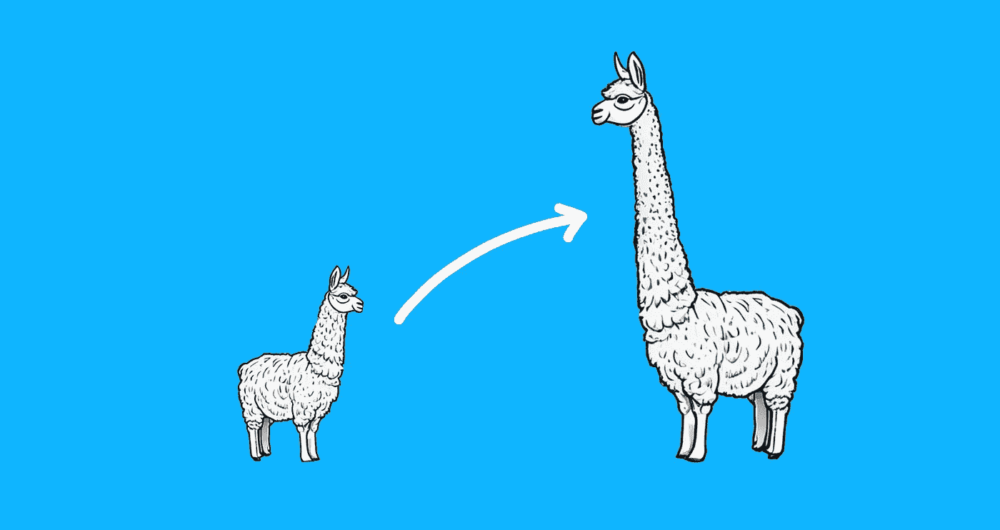

# 扩展大型语言模型中的上下文长度

> 原文：[`towardsdatascience.com/extending-context-length-in-large-language-models-74e59201b51f?source=collection_archive---------0-----------------------#2023-10-15`](https://towardsdatascience.com/extending-context-length-in-large-language-models-74e59201b51f?source=collection_archive---------0-----------------------#2023-10-15)

## 如何将你的 Llama 变成 Giraffe

 [Donato Riccio](https://donatoriccio.medium.com/?source=post_page-----74e59201b51f--------------------------------)

·

[关注](https://medium.com/m/signin?actionUrl=https%3A%2F%2Fmedium.com%2F_%2Fsubscribe%2Fuser%2Fe384fc71d292&operation=register&redirect=https%3A%2F%2Ftowardsdatascience.com%2Fextending-context-length-in-large-language-models-74e59201b51f&user=Donato+Riccio&userId=e384fc71d292&source=post_page-e384fc71d292----74e59201b51f---------------------post_header-----------) 发表于 [Towards Data Science](https://towardsdatascience.com/?source=post_page-----74e59201b51f--------------------------------) ·9 分钟阅读·2023 年 10 月 15 日

--

图片由作者提供。（AI 生成的 Llamas）

上下文长度指的是模型在生成文本时能够记住的最大标记数。更长的上下文窗口使模型能够更好地理解文本中的长程依赖关系。具有更长上下文的模型可以在文本中建立相隔较远的思想之间的联系，从而生成更具全球一致性的输出。

在训练过程中，模型以块或固定长度窗口处理文本数据。模型需要在较长文本上进行训练，以实际利用长上下文。训练序列必须包含包含数千个标记的文档、书籍、文章等。

训练数据的长度对可用的上下文长度设置了限制。

> 那么，我们为什么不在更长的序列上训练模型呢？

不要着急。

增加上下文长度会增加模型必须学习以准确预测的可能标记组合的数量。

这使得长距离建模更为稳健，但也需要更多的内存和处理能力，从而导致更高的训练成本。

如果没有任何优化，计算量会随着上下文长度呈二次方增长——这意味着一个 4096 标记的模型将需要 64 倍的…
