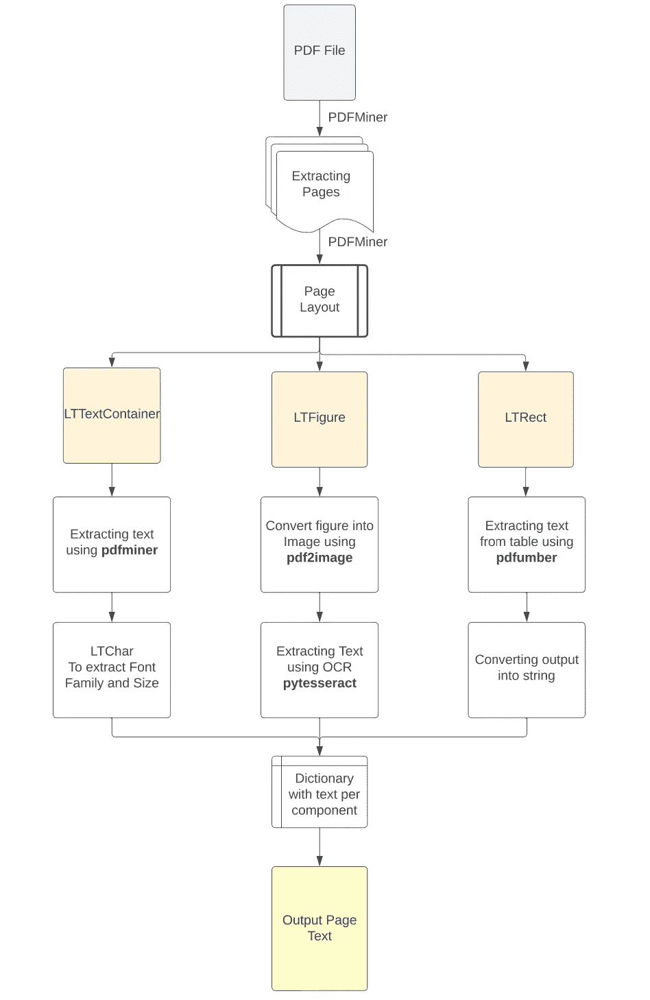
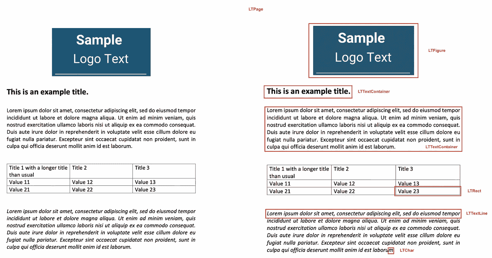
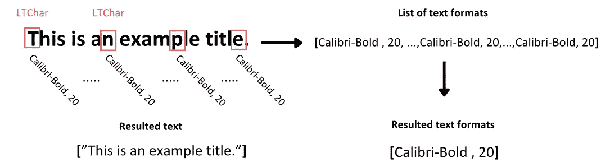
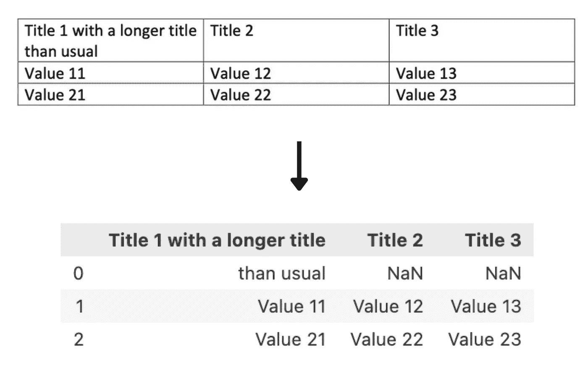

# 使用 Python 从 PDF 文件中提取文本：全面指南

> 原文：[`towardsdatascience.com/extracting-text-from-pdf-files-with-python-a-comprehensive-guide-9fc4003d517`](https://towardsdatascience.com/extracting-text-from-pdf-files-with-python-a-comprehensive-guide-9fc4003d517)

## 从 PDF 文件中提取表格、图像和纯文本的完整过程

[](https://medium.com/@george.stavrakis.1996?source=post_page-----9fc4003d517--------------------------------)[](https://towardsdatascience.com/?source=post_page-----9fc4003d517--------------------------------) [George Stavrakis](https://medium.com/@george.stavrakis.1996?source=post_page-----9fc4003d517--------------------------------)

·发表于 [Towards Data Science](https://towardsdatascience.com/?source=post_page-----9fc4003d517--------------------------------) ·17 分钟阅读·2023 年 9 月 21 日

--


图片来源于 [Giorgio Trovato](https://unsplash.com/@giorgiotrovato?utm_source=medium&utm_medium=referral) 在 [Unsplash](https://unsplash.com/?utm_source=medium&utm_medium=referral)

# 介绍

在大型语言模型（LLMs）及其 [广泛应用](https://bit.ly/49i8JoP) 的时代，从简单的文本总结和翻译到基于情感和财务报告主题预测股票表现，文本数据的重要性比以往任何时候都大。

许多类型的文档都包含这种非结构化的信息，从网页文章和博客帖子到手写信件和诗歌。然而，大量的文本数据以 PDF 格式存储和传输。更具体地说，每年在 Outlook 中打开的 PDF 超过 20 亿个，而每天在 Google Drive 和电子邮件中保存的新 PDF 文件达到 7300 万个 (2)。

因此，开发一种更系统的方法来处理这些文档并从中提取信息将使我们能够实现自动化流程，更好地理解和利用这一大批文本数据。为了完成这一任务，当然，我们最好的朋友无疑就是 Python。

然而，在我们开始之前，我们需要明确现在存在的不同类型的 PDF，特别是最常见的三种类型：

1.  **程序生成的 PDF**：这些 PDF 是使用 W3C 技术如 HTML、CSS 和 JavaScript 或其他软件如 Adobe Acrobat 在计算机上创建的。这种类型的文件可以包含各种组件，如图像、文本和链接，这些都可以被搜索和轻松编辑。

1.  **传统扫描文档**：这些 PDF 是通过扫描仪或移动应用程序从非电子介质创建的。这些文件只是存储在 PDF 文件中的图像集合。也就是说，图像中出现的元素，如文本或链接，无法被选择或搜索。本质上，PDF 作为这些图像的容器。

1.  **带有 OCR 的扫描文档**：在这种情况下，在扫描文档后，使用光学字符识别（OCR）软件来识别文件中每个图像中的文本，将其转换为可搜索和可编辑的文本。然后，软件在图像上添加实际文本的层，从而在浏览文件时可以将其作为单独的组件选择。

尽管现在越来越多的机器装有 OCR 系统来识别扫描文档中的文本，但仍有一些文档包含全页图像格式。你可能已经遇到过这种情况，当你阅读一篇精彩的文章并试图选择一个句子时，却选择了整页。这可能是特定 OCR 机器的限制或完全缺失的结果。因此，为了不遗漏这篇文章中的信息，我尝试创建一个也考虑这些情况的过程，并充分利用我们宝贵且信息丰富的 PDF 文件。

# 理论方法

记住这些不同类型的 PDF 文件及其组成项目，进行 PDF 布局的初步分析是重要的，以确定每个组件所需的适当工具。更具体地说，根据这项分析的结果，我们将应用适当的方法来提取 PDF 中的文本，无论是带有元数据的文本块、图像中的文本还是表格中的结构化文本。在没有 OCR 的扫描文档中，识别和提取图像中文本的方法将承担所有繁重的工作。此过程的输出将是一个 Python 字典，包含提取的信息，每页 PDF 文件的信息。此字典中的每个键将表示文档的页码，对应的值将是包含以下 5 个嵌套列表的列表：

1.  按文本块提取的文本

1.  每个文本块中的字体家族和大小的格式

1.  从页面上的图像中提取的文本

1.  从表格中以结构化格式提取的文本

1.  页面上的完整文本内容


作者提供的图像

这样，我们可以实现对每个源组件提取文本的更合理分离，有时这可以帮助我们更容易地检索通常出现在特定组件中的信息（例如，徽标图像中的公司名称）。此外，从文本中提取的元数据，如字体系列和大小，可以用于轻松识别文本标题或突出显示的重要文本，这将帮助我们进一步分离或对文本进行多块后处理。最后，以 LLM 可以理解的方式保留结构化表格信息将显著提升对提取数据中关系的推断质量。然后，这些结果可以作为每页上出现的所有文本信息的输出。

您可以在下图中查看这种方法的流程图。



图片由作者提供

# 安装所有必要的库

不过，在开始这个项目之前，我们应该安装必要的库。我们假设您的机器上已安装 Python 3.10 或更高版本。否则，您可以从[这里](https://www.python.org/)进行安装。然后让我们安装以下库：

**PyPDF2**：用于从存储库路径中读取 PDF 文件。

```py
pip install PyPDF2
```

**Pdfminer**：用于执行布局分析并从 PDF 中提取文本和格式。（支持 Python 3 的库版本为 .six）

```py
pip install pdfminer.six
```

**Pdfplumber**：用于识别 PDF 页中的表格并从中提取信息。

```py
pip install pdfplumber
```

**Pdf2image**：用于将裁剪后的 PDF 图像转换为 PNG 图像。

```py
pip install pdf2image
```

**PIL**：用于读取 PNG 图像。

```py
pip install Pillow
```

**Pytesseract**：用于使用 OCR 技术从图像中提取文本。

安装这个稍微复杂一些，因为首先，您需要安装[Google Tesseract OCR](https://github.com/tesseract-ocr/tesseract)，这是一个基于 LSTM 模型的 OCR 机器，用于识别行识别和字符模式。

如果您是 Mac 用户，可以通过终端中的 **Brew** 在您的机器上安装这些库，安装后您就可以开始使用了。

```py
brew install tesseract
```

对于 Windows 用户，您可以按照这些步骤安装[链接](https://linuxhint.com/install-tesseract-windows/)。然后，当您下载并安装软件时，您需要将其可执行路径添加到计算机的环境变量中。或者，您可以运行以下命令，通过以下代码直接在 Python 脚本中包含其路径：

```py
pytesseract.pytesseract.tesseract_cmd = r'C:\Program Files\Tesseract-OCR\tesseract.exe'
```

然后您可以安装 Python 库

```py
pip install pytesseract
```

最后，我们将在脚本开始时导入所有库。

```py
# To read the PDF
import PyPDF2
# To analyze the PDF layout and extract text
from pdfminer.high_level import extract_pages, extract_text
from pdfminer.layout import LTTextContainer, LTChar, LTRect, LTFigure
# To extract text from tables in PDF
import pdfplumber
# To extract the images from the PDFs
from PIL import Image
from pdf2image import convert_from_path
# To perform OCR to extract text from images 
import pytesseract 
# To remove the additional created files
import os
```

现在我们已经准备好了。让我们进入有趣的部分。

# 使用 Python 进行文档布局分析



图片由作者提供

对于初步分析，我们使用了 PDFMiner Python 库将文档对象中的文本分离为多个页面对象，然后拆解和检查每个页面的布局。PDF 文件本质上缺乏结构化信息，例如段落、句子或单词，如人眼所见。相反，它们只理解文本的单个字符及其在页面上的位置。这样，PDFMiner 尝试将页面内容重建为其单个字符及其在文件中的位置。然后，通过比较这些字符与其他字符之间的距离，它将组成适当的单词、句子、行和段落文本。（4）为实现这一点，该库：

使用高阶函数 extract_pages()将 PDF 文件中的每个页面分离，并将它们转换为**LTPage**对象。

然后，对于每个 LTPage 对象，它从顶部到底部迭代每个元素，并尝试将适当的组件识别为：

+   **LTFigure**表示 PDF 中可以呈现嵌入为另一个 PDF 文档的图形或图像的区域。

+   **LTTextContainer**表示一个矩形区域中的文本行组，随后进一步分析为**LTTextLine**对象的列表。每个**LTTextLine**对象表示一系列**LTChar**对象，这些对象存储单个字符及其元数据。（5）

+   **LTRect**表示一个二维矩形，可用于框定图像、图形或在 LTPage 对象中创建表格。

因此，根据页面的重建和元素的分类，无论是**LTFigure**（包含页面中的图像或图形）、**LTTextContainer**（表示页面的文本信息）还是**LTRect**（将强烈指示表格的存在），我们可以应用适当的函数以更好地提取信息。

```py
for pagenum, page in enumerate(extract_pages(pdf_path)):

    # Iterate the elements that composed a page
    for element in page:

        # Check if the element is a text element
        if isinstance(element, LTTextContainer):
            # Function to extract text from the text block
            pass
            # Function to extract text format
            pass

        # Check the elements for images
        if isinstance(element, LTFigure):
            # Function to convert PDF to Image
            pass
            # Function to extract text with OCR
            pass

        # Check the elements for tables
        if isinstance(element, LTRect):
            # Function to extract table
            pass
            # Function to convert table content into a string
            pass
```

现在我们理解了过程的分析部分，让我们创建提取每个组件中文本所需的函数。

# 定义提取 PDF 中文本的函数

从这里开始，从文本容器中提取文本非常简单。

```py
# Create a function to extract text

def text_extraction(element):
    # Extracting the text from the in-line text element
    line_text = element.get_text()

    # Find the formats of the text
    # Initialize the list with all the formats that appeared in the line of text
    line_formats = []
    for text_line in element:
        if isinstance(text_line, LTTextContainer):
            # Iterating through each character in the line of text
            for character in text_line:
                if isinstance(character, LTChar):
                    # Append the font name of the character
                    line_formats.append(character.fontname)
                    # Append the font size of the character
                    line_formats.append(character.size)
    # Find the unique font sizes and names in the line
    format_per_line = list(set(line_formats))

    # Return a tuple with the text in each line along with its format
    return (line_text, format_per_line)
```

因此，要从文本容器中提取文本，我们只需使用**get_text**()方法。该方法检索构成特定语料库框中的单词的所有字符，并将输出存储在文本数据列表中。该列表中的每个元素代表容器中包含的原始文本信息。

现在，为了识别这些文本的格式，我们遍历 LTTextContainer 对象，以逐一访问该语料库的每一行文本。在每次迭代中，会创建一个新的**LTTextLine**对象，表示该语料库块中的一行文本。然后我们检查嵌套的行元素是否包含文本。如果包含，我们访问每个单独的字符元素作为 LTChar，它包含该字符的所有元数据。从这些元数据中，我们提取两种格式，并将其存储在一个单独的列表中，与被检查的文本相对应。

+   字符的字体家族，包括字符是否为粗体或斜体格式

+   字符的字体大小

通常，特定文本块中的字符格式趋于一致，除非有些字符以粗体突出显示。为了便于进一步分析，我们捕获文本中所有字符的独特格式值，并将其存储在相应的列表中。



图片由作者提供

# 定义提取图像中文本的函数

我认为这是一个更棘手的部分。

*如何处理 PDF 中找到的图像中的文本？*

首先，我们需要在这里确定，存储在 PDF 中的图像元素与文件的其他格式（如 JPEG 或 PNG）没有不同。因此，为了对它们应用 OCR 软件，我们需要首先将它们从文件中分离出来，然后将其转换为图像格式。

```py
# Create a function to crop the image elements from PDFs
def crop_image(element, pageObj):
    # Get the coordinates to crop the image from the PDF
    [image_left, image_top, image_right, image_bottom] = [element.x0,element.y0,element.x1,element.y1] 
    # Crop the page using coordinates (left, bottom, right, top)
    pageObj.mediabox.lower_left = (image_left, image_bottom)
    pageObj.mediabox.upper_right = (image_right, image_top)
    # Save the cropped page to a new PDF
    cropped_pdf_writer = PyPDF2.PdfWriter()
    cropped_pdf_writer.add_page(pageObj)
    # Save the cropped PDF to a new file
    with open('cropped_image.pdf', 'wb') as cropped_pdf_file:
        cropped_pdf_writer.write(cropped_pdf_file)

# Create a function to convert the PDF to images
def convert_to_images(input_file,):
    images = convert_from_path(input_file)
    image = images[0]
    output_file = "PDF_image.png"
    image.save(output_file, "PNG")

# Create a function to read text from images
def image_to_text(image_path):
    # Read the image
    img = Image.open(image_path)
    # Extract the text from the image
    text = pytesseract.image_to_string(img)
    return text
```

为了实现这一点，我们遵循以下过程：

1.  我们使用从 PDFMiner 检测到的 LTFigure 对象的元数据来裁剪图像框，利用其在页面布局中的坐标。然后我们使用**PyPDF2**库将其保存为我们目录中的新 PDF 文件。

1.  然后，我们使用**pdf2image**库的**convert_from_file**()函数将目录中的所有 PDF 文件转换为图像列表，并将其保存为 PNG 格式。

1.  最后，现在我们拥有了图像文件，我们使用**PIL**模块的**Image**包在脚本中读取这些图像，并实现 pytesseract 的**image_to_string**()函数，使用 tesseract OCR 引擎从图像中提取文本。

因此，这个过程从图像中提取文本，然后我们将其保存在输出字典中的第三个列表中。这个列表包含从被检查页面上的图像中提取的文本信息。

# 定义提取表格中文本的函数

在这一部分，我们将从 PDF 页面上的表格中提取更具逻辑结构的文本。这比从语料库中提取文本要复杂一些，因为我们需要考虑信息的粒度以及表格中呈现的数据点之间形成的关系。

尽管有几个库用于从 PDF 中提取表格数据，[**Tabula-py**](https://pypi.org/project/tabula-py/)是最著名的之一，但我们发现它们的功能存在一定的局限性。

在我们看来，最明显的问题来自于库使用换行符\n 识别表格的不同行。这在大多数情况下效果很好，但当单元格中的文本被换行成两行或更多行时，它无法正确捕捉，导致添加了不必要的空行并丢失了提取单元格的上下文。

你可以查看下面的示例，当我们尝试使用 tabula-py 提取表格数据时：



作者提供的图像

然后，将提取的信息输出为 Pandas DataFrame，而不是字符串。在大多数情况下，这是一种理想的格式，但对于考虑文本的 transformers，这些结果需要在输入模型之前进行转换。

因此，为了处理这个任务，我们使用了**pdfplumber**库。首先，它建立在我们用于初步分析的 pdfminer.six 之上，这意味着它包含类似的对象。此外，它的表格检测方法基于线条元素及其交点，这些元素构建了包含文本的单元格以及整个表格。这样，在我们识别表格单元格后，可以提取单元格内部的内容，而无需考虑需要渲染多少行。然后，当我们拥有表格内容时，我们会将其格式化为类似表格的字符串并存储在适当的列表中。

```py
# Extracting tables from the page

def extract_table(pdf_path, page_num, table_num):
    # Open the pdf file
    pdf = pdfplumber.open(pdf_path)
    # Find the examined page
    table_page = pdf.pages[page_num]
    # Extract the appropriate table
    table = table_page.extract_tables()[table_num]
    return table

# Convert table into the appropriate format
def table_converter(table):
    table_string = ''
    # Iterate through each row of the table
    for row_num in range(len(table)):
        row = table[row_num]
        # Remove the line breaker from the wrapped texts
        cleaned_row = [item.replace('\n', ' ') if item is not None and '\n' in item else 'None' if item is None else item for item in row]
        # Convert the table into a string 
        table_string+=('|'+'|'.join(cleaned_row)+'|'+'\n')
    # Removing the last line break
    table_string = table_string[:-1]
    return table_string
```

为了实现这一点，我们创建了两个函数，**extract_table()**用于将表格内容提取为列表的列表，**table_converter()**用于将这些列表的内容连接成类似表格的字符串。

在**extract_table()**函数中：

1.  我们打开 PDF 文件。

1.  我们导航到 PDF 文件的检查页面。

1.  从 pdfplumber 找到的页面中的表格列表中，我们选择所需的表格。

1.  我们提取了表格的内容，并将其输出为表示每行的嵌套列表。

在**table_converter()**函数中：

1.  我们遍历每个嵌套列表，并清除任何来自换行文本的多余换行符。

1.  我们通过使用|符号分隔行中的每个元素，以创建表格单元格的结构。

1.  最后，我们在末尾添加一个换行符，以移动到下一行。

这将生成一个文本字符串，展示表格的内容，而不会丢失呈现的数据的细节。

# 将所有内容整合在一起

现在我们已准备好所有代码组件，让我们将它们整合成一个完整的代码。你可以从这里复制代码，或者你可以在我的 Github 仓库[这里](https://github.com/g-stavrakis/PDF_Text_Extraction)找到它及示例 PDF。

```py
# Find the PDF path
pdf_path = 'OFFER 3.pdf'

# create a PDF file object
pdfFileObj = open(pdf_path, 'rb')
# create a PDF reader object
pdfReaded = PyPDF2.PdfReader(pdfFileObj)

# Create the dictionary to extract text from each image
text_per_page = {}
# We extract the pages from the PDF
for pagenum, page in enumerate(extract_pages(pdf_path)):

    # Initialize the variables needed for the text extraction from the page
    pageObj = pdfReaded.pages[pagenum]
    page_text = []
    line_format = []
    text_from_images = []
    text_from_tables = []
    page_content = []
    # Initialize the number of the examined tables
    table_num = 0
    first_element= True
    table_extraction_flag= False
    # Open the pdf file
    pdf = pdfplumber.open(pdf_path)
    # Find the examined page
    page_tables = pdf.pages[pagenum]
    # Find the number of tables on the page
    tables = page_tables.find_tables()

    # Find all the elements
    page_elements = [(element.y1, element) for element in page._objs]
    # Sort all the elements as they appear in the page 
    page_elements.sort(key=lambda a: a[0], reverse=True)

    # Find the elements that composed a page
    for i,component in enumerate(page_elements):
        # Extract the position of the top side of the element in the PDF
        pos= component[0]
        # Extract the element of the page layout
        element = component[1]

        # Check if the element is a text element
        if isinstance(element, LTTextContainer):
            # Check if the text appeared in a table
            if table_extraction_flag == False:
                # Use the function to extract the text and format for each text element
                (line_text, format_per_line) = text_extraction(element)
                # Append the text of each line to the page text
                page_text.append(line_text)
                # Append the format for each line containing text
                line_format.append(format_per_line)
                page_content.append(line_text)
            else:
                # Omit the text that appeared in a table
                pass

        # Check the elements for images
        if isinstance(element, LTFigure):
            # Crop the image from the PDF
            crop_image(element, pageObj)
            # Convert the cropped pdf to an image
            convert_to_images('cropped_image.pdf')
            # Extract the text from the image
            image_text = image_to_text('PDF_image.png')
            text_from_images.append(image_text)
            page_content.append(image_text)
            # Add a placeholder in the text and format lists
            page_text.append('image')
            line_format.append('image')

        # Check the elements for tables
        if isinstance(element, LTRect):
            # If the first rectangular element
            if first_element == True and (table_num+1) <= len(tables):
                # Find the bounding box of the table
                lower_side = page.bbox[3] - tables[table_num].bbox[3]
                upper_side = element.y1 
                # Extract the information from the table
                table = extract_table(pdf_path, pagenum, table_num)
                # Convert the table information in structured string format
                table_string = table_converter(table)
                # Append the table string into a list
                text_from_tables.append(table_string)
                page_content.append(table_string)
                # Set the flag as True to avoid the content again
                table_extraction_flag = True
                # Make it another element
                first_element = False
                # Add a placeholder in the text and format lists
                page_text.append('table')
                line_format.append('table')

            # Check if we already extracted the tables from the page
            if element.y0 >= lower_side and element.y1 <= upper_side:
                pass
            elif not isinstance(page_elements[i+1][1], LTRect):
                table_extraction_flag = False
                first_element = True
                table_num+=1

    # Create the key of the dictionary
    dctkey = 'Page_'+str(pagenum)
    # Add the list of list as the value of the page key
    text_per_page[dctkey]= [page_text, line_format, text_from_images,text_from_tables, page_content]

# Closing the pdf file object
pdfFileObj.close()

# Deleting the additional files created
os.remove('cropped_image.pdf')
os.remove('PDF_image.png')

# Display the content of the page
result = ''.join(text_per_page['Page_0'][4])
print(result)
```

上面的脚本将：

导入必要的库。

使用**pyPDF2**库打开 PDF 文件。

提取 PDF 的每一页，并执行以下步骤。

检查页面上是否有表格，并使用**pdfplumner**创建一个表格列表。

查找页面中嵌套的所有元素，并按其在布局中出现的顺序对它们进行排序。

然后对每个元素：

检查是否为文本容器，并且不出现在表格元素中。然后使用**text_extraction**()函数提取文本及其格式，否则忽略此文本。

检查是否为图像，并使用**crop_image**()函数从 PDF 中裁剪图像组件，使用**convert_to_images**()将其转换为图像文件，并使用 OCR 和**image_to_text**()函数提取文本。

检查是否为矩形元素。在这种情况下，我们检查第一个矩形是否是页面表格的一部分，如果是，则转到以下步骤：

1.  查找表格的边界框，以避免使用 text_extraction()函数再次提取其文本。

1.  提取表格内容并将其转换为字符串。

1.  然后添加一个布尔参数，以澄清我们是否从表格中提取文本。

1.  这个过程将在最后一个 LTRect 落在表格的边界框内，并且布局中的下一个元素不是矩形对象后结束。（所有组成表格的其他对象将被忽略）

该过程的输出将每次迭代存储在 5 个列表中，命名为：

1.  page_text: 包含来自 PDF 文本容器的文本（当文本从另一个元素中提取时，将放置占位符）

1.  line_format: 包含上面提取的文本的格式（当文本从另一个元素中提取时，将放置占位符）

1.  text_from_images: 包含从页面上的图像提取的文本

1.  text_from_tables: 包含表格内容的类似表格的字符串

1.  page_content: 包含以元素列表形式呈现的页面上所有文本

所有列表将存储在一个字典的键下，该字典将表示每次检查的页面编号。

之后，我们将关闭 PDF 文件。

然后我们将删除在过程中创建的所有额外文件。

最后，我们可以通过连接 page_content 列表的元素来显示页面内容。

# 结论

这是一种方法，我认为它结合了许多库的最佳特性，使过程对各种类型的 PDF 和我们可能遇到的元素具有弹性，但主要依赖 PDFMiner 进行繁重的工作。此外，关于文本格式的信息可以帮助我们识别潜在的标题，这些标题可以将文本划分为不同的逻辑部分，而不仅仅是按页面内容，并有助于识别更重要的文本。

然而，总会有更高效的方法来完成此任务，尽管我认为这种方法更具包容性，我非常期待与您讨论新的和更好的解决此问题的方法。

# 📖 参考文献：

1.  [`www.techopedia.com/12-practical-large-language-model-llm-applications`](https://www.techopedia.com/12-practical-large-language-model-llm-applications)

1.  [`www.pdfa.org/wp-content/uploads/2018/06/1330_Johnson.pdf`](https://www.pdfa.org/wp-content/uploads/2018/06/1330_Johnson.pdf)

1.  [`pdfpro.com/blog/guides/pdf-ocr-guide/#:~:text=OCR`](https://pdfpro.com/blog/guides/pdf-ocr-guide/#:~:text=OCR) 技术可以读取文本，从而生成可搜索和可编辑的 PDF。

1.  [`pdfminersix.readthedocs.io/en/latest/topic/converting_pdf_to_text.html#id1`](https://pdfminersix.readthedocs.io/en/latest/topic/converting_pdf_to_text.html#id1)

1.  [`github.com/pdfminer/pdfminer.six`](https://github.com/pdfminer/pdfminer.six)
