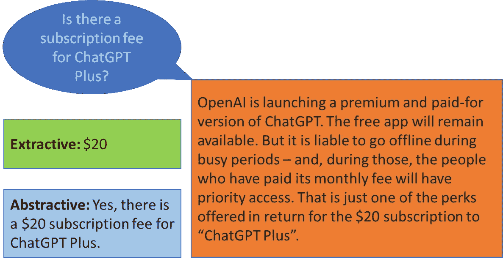

# 提取式与生成式问答 — 哪种对您的业务更有利？

> 原文：[`towardsdatascience.com/extractive-vs-generative-q-a-which-is-better-for-your-business-5a8a1faab59a?source=collection_archive---------3-----------------------#2023-02-06`](https://towardsdatascience.com/extractive-vs-generative-q-a-which-is-better-for-your-business-5a8a1faab59a?source=collection_archive---------3-----------------------#2023-02-06)

## ChatGPT 的出现暗示了搜索引擎的新时代，这篇教程深入探讨了两种基本的 AI 问答类型

 [Skanda Vivek](https://skanda-vivek.medium.com/?source=post_page-----5a8a1faab59a--------------------------------)

·

[关注](https://medium.com/m/signin?actionUrl=https%3A%2F%2Fmedium.com%2F_%2Fsubscribe%2Fuser%2F220d9bbb8014&operation=register&redirect=https%3A%2F%2Ftowardsdatascience.com%2Fextractive-vs-generative-q-a-which-is-better-for-your-business-5a8a1faab59a&user=Skanda+Vivek&userId=220d9bbb8014&source=post_page-220d9bbb8014----5a8a1faab59a---------------------post_header-----------) 发表在 [Towards Data Science](https://towardsdatascience.com/?source=post_page-----5a8a1faab59a--------------------------------) · 6 分钟阅读 · 2023 年 2 月 6 日

--

提取式与抽象式问答 | Skanda Vivek

2017 年引入的 Transformer 模型 [介绍](https://arxiv.org/abs/1706.03762) 在解决困难的语言相关任务上取得了突破。像 BERT、GPT 等模型中原始 Transformer 架构的变体在大量文本数据上训练后，在语言相关任务上产生了最先进的结果。

人工智能的一个最大好处是能够执行以前需要领域专业知识和仔细审阅的任务——更快且成本低廉。我相信这将在未来十年内彻底改变各行各业。

一个典型的任务是从文本中提取信息。问答系统是一个强大的信息提取工具，通过复杂的查询，模型可以被训练来提取特定的信息。试想一下，AI 模型在回答法律文件中的难题时节省的时间和金钱，替代了请一位经验丰富的律师或雇佣一个实习生花费几个小时查阅文件。让我们深入了解两种基本的基于 AI 的问答类型：提取式与抽象式。

# 提取式问答
