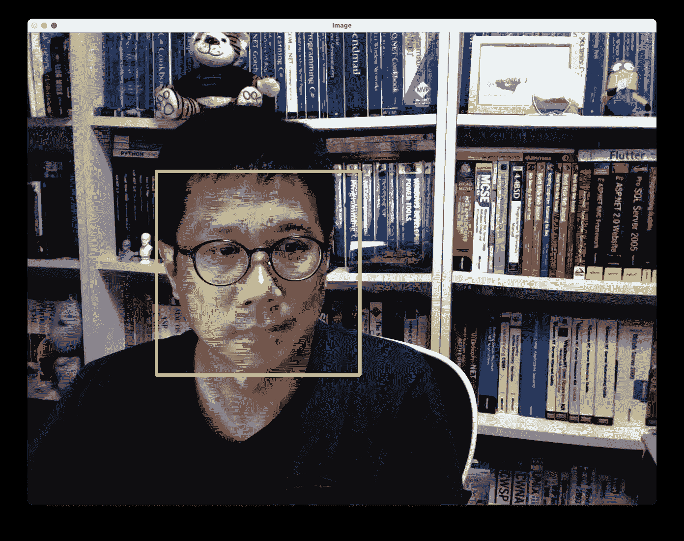

# 使用 Python 进行人脸检测——人脸识别的前奏

> 原文：[`towardsdatascience.com/face-detection-using-python-the-precursor-to-face-recognition-316ded4d116f?source=collection_archive---------7-----------------------#2023-04-11`](https://towardsdatascience.com/face-detection-using-python-the-precursor-to-face-recognition-316ded4d116f?source=collection_archive---------7-----------------------#2023-04-11)

## 通过使用你的网络摄像头来检测你的面孔，享受 Python 编程的乐趣

 [Wei-Meng Lee](https://weimenglee.medium.com/?source=post_page-----316ded4d116f--------------------------------)

·

[关注](https://medium.com/m/signin?actionUrl=https%3A%2F%2Fmedium.com%2F_%2Fsubscribe%2Fuser%2F6599e1e08a48&operation=register&redirect=https%3A%2F%2Ftowardsdatascience.com%2Fface-detection-using-python-the-precursor-to-face-recognition-316ded4d116f&user=Wei-Meng+Lee&userId=6599e1e08a48&source=post_page-6599e1e08a48----316ded4d116f---------------------post_header-----------) 发布于 [Towards Data Science](https://towardsdatascience.com/?source=post_page-----316ded4d116f--------------------------------) ·8 分钟阅读·2023 年 4 月 11 日

--

所有图片均由作者提供

*人脸检测* 是一种在数字图像中识别人的面孔的技术。人脸检测是一项相对成熟的技术——还记得你在旧式数码相机的取景器里看到的矩形框吗？它们会环绕在视野中人的面孔周围。

> *人脸检测是你在进行人脸识别之前需要学习的技术，人脸识别就是试图为一张面孔命名。*

对于面部检测，最著名的算法之一被称为***Viola-Jones 面部检测***技术，通常被称为**Haar 级联**。Haar 级联的发明早于深度学习的流行，是检测面部的最常用技术之一。

# 面部检测/识别的伦理考虑

尽管能够检测和识别面孔确实很酷，但这无疑带来了许多伦理问题。在将面部识别技术应用到你的项目中之前，有几个问题需要注意……
