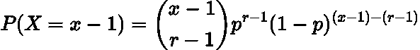
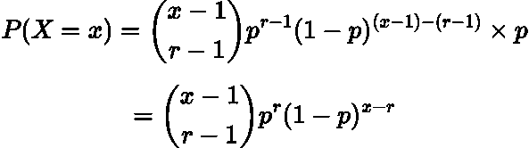
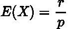
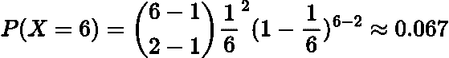
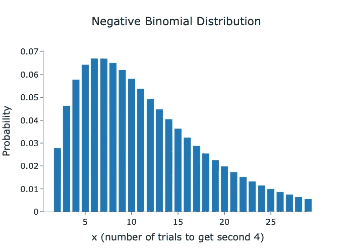

# 什么是负二项分布

> 原文：[`towardsdatascience.com/failures-trials-and-successes-the-negative-binomial-distribution-explained-944ea2aef936`](https://towardsdatascience.com/failures-trials-and-successes-the-negative-binomial-distribution-explained-944ea2aef936)

## 探索一种较不为人知的概率分布

[](https://medium.com/@egorhowell?source=post_page-----944ea2aef936--------------------------------)[](https://towardsdatascience.com/?source=post_page-----944ea2aef936--------------------------------) [Egor Howell](https://medium.com/@egorhowell?source=post_page-----944ea2aef936--------------------------------)

·发表在 [Towards Data Science](https://towardsdatascience.com/?source=post_page-----944ea2aef936--------------------------------) ·阅读时间 5 分钟·2023 年 8 月 17 日

--


图片由[Alperen Yazgı](https://unsplash.com/@armato?utm_source=medium&utm_medium=referral)拍摄，来源于[Unsplash](https://unsplash.com/?utm_source=medium&utm_medium=referral)

# 背景

也许你听说过[**二项分布**](https://pub.towardsai.net/decoding-the-binomial-distribution-a-fundamental-concept-for-data-scientists-81c64c7e4580)，但你听说过它的“亲戚”[**负二项分布**](https://en.wikipedia.org/wiki/Negative_binomial_distribution)吗？这种离散概率分布被应用于许多行业，如保险和制造业（主要是基于计数的数据），因此对于数据科学家来说是一个有用的概念。在本文中，我们将深入探讨这种分布及其解决的问题。

补充视频。

# 什么是负二项分布？

要理解负二项分布，重要的是对二项分布有直观的认识。

二项分布衡量在给定的试验次数***n***中获得特定数量成功的概率，***x***。这些试验是[**伯努利**](https://en.wikipedia.org/wiki/Bernoulli_trial)试验，其中每个结果都是二元的（成功或失败）。如果你对二项分布不熟悉，可以查看我之前关于它的帖子：

[](https://pub.towardsai.net/decoding-the-binomial-distribution-a-fundamental-concept-for-data-scientists-81c64c7e4580?source=post_page-----944ea2aef936--------------------------------) [## 解码二项分布：数据科学家的基础概念

### 理解二项分布的基本构建块

pub.towardsai.net](https://pub.towardsai.net/decoding-the-binomial-distribution-a-fundamental-concept-for-data-scientists-81c64c7e4580?source=post_page-----944ea2aef936--------------------------------)

负二项分布翻转了这个模型，模拟了达到一定成功次数 ***r*** 所需的试验次数 ***x***。这就是它被称为“负”的原因，因为它在无意中模拟了在达到一定成功次数之前的失败次数。

思考负二项分布的更好方式是：

> 在“***x***”次试验中发生“***r***”次成功的概率

负二项分布的一个特殊情况是 [**几何分布**](https://medium.com/towards-data-science/geometric-distribution-simply-explained-9177c816794f)。它模拟了我们在获得第一次成功之前需要的试验次数。你可以在这里阅读更多关于几何分布的信息：

[](/geometric-distribution-simply-explained-9177c816794f?source=post_page-----944ea2aef936--------------------------------) ## 几何分布简单解释

### 几何分布的简单描述和用途

towardsdatascience.com

# 关键假设

下面是负二项分布数据的主要假设：

+   *每次试验有两个结果（伯努利）*

+   *每次试验都是独立的*

+   *成功的概率是恒定的*

# 公式与推导

假设我们有：

+   ***p:*** *成功的概率*

+   ***1-p:*** *失败的概率*

+   ***x:*** *成功的* ***r*** *次试验的次数*

+   ***r:*** *成功的次数* 对于 ***x*** *次试验*

因此，我们必须在 ***x-1*** 次试验中有 ***r-1*** 次成功，其概率简单地是二项分布的 [**概率质量函数 (PMF)**](https://en.wikipedia.org/wiki/Probability_mass_function)：



作者用 LaTeX 生成的方程。

我们得到的下一条信息是 ***r*** 次成功必须发生在 ***x*** 次试验中，它将有 ***p*** 的概率。因此，我们只需将上述公式乘以 ***p***：



作者用 LaTeX 生成的方程。

> 这就是负二项分布的 PMF！

分布的均值可以表示为：



作者用 LaTeX 生成的方程。

> 均值和标准差的推导可以在 [这里](https://online.stat.psu.edu/stat414/lesson/11/11.5) 找到

# 示例问题

在第六次掷骰子时，再次掷出 4 的概率是多少？

+   ***p = 1/6***

+   ***r = 2***

+   ***x = 6***

将这些输入到上述 PMF 中得到：



作者用 LaTeX 生成的方程。

因此，我们在第六次掷骰时获得第二个 4 的可能性相当小。你还可以用[这个负二项分布计算器](https://stattrek.com/online-calculator/negative-binomial)来尝试你的计算。

如果我们想知道在其他掷骰中获得第二个 4 的概率呢？为了做到这一点，我们需要将第二次掷骰作为掷骰次数的函数来绘制，***x***：

```py
import plotly.graph_objects as go
from math import comb

# Parameters
r = 2
p = 1 / 6

# PMF
def neg_binomial_pmf(x, r, p):
    if x < r:
        return 0
    q = 1 - p
    return comb(x - 1, r - 1) * (p ** r) * (q ** (x - r))

# Values
x = list(range(1, 30))
probs = [neg_binomial_pmf(k, r, p) for k in x]

# Plot
fig = go.Figure(data=[go.Bar(x=x, y=probs, marker_color='rgba(176, 224, 230)')])
fig.update_layout(title="Negative Binomial Distribution",
                  xaxis_title="x (number of trials to get second 4)",
                  yaxis_title="Probability",
                  template="simple_white",
                  font=dict(size=16),
                  title_x=0.5,
                  width=700,
                  height=500)
fig.show()
```



由作者在 Python 中生成的图表。

我们可以看到，获得第二个 4 的最可能掷骰结果是 6 和 7。然而，期望值为 12（2/(1/6)），这可以从我们之前展示的公式中推导出来。

# 数据科学中的应用

以下是负二项分布应用的一些领域：

+   ***事件发生的时间：*** *这对流失模型非常有用，我们希望预测客户可能何时取消订阅。如果我们知道何时以及谁会流失，我们可以采取专门的留存策略来试图留住客户。*

+   ***缺陷预测：*** *预测在制造产品成为完全功能之前的缺陷数量。你可以把它想象成在我们达到最终提案之前要生产多少个产品。*

+   ***体育分析：*** *例如预测一个足球运动员在多少次错失机会后能进一个球。这对博彩公司制定赔率非常有用。*

+   ***营销：*** *确定在客户转换为订阅或点击网站之前需要展示多少广告。这是在预测转换率。*

+   ***流行病学：*** *估计濒危物种的数量以及环境如何影响它们的数量。*

# 总结与进一步思考

负二项分布模型描述了达到一定成功次数所需的失败次数的概率。这在许多数据科学领域都有应用，其中最显著的是客户流失预测。因此，对于数据科学家来说，这是一个有用的主题。

完整的代码可以在我的 GitHub 上找到：

[](https://github.com/egorhowell/Medium-Articles/blob/main/Statistics/Distributions/negative_binomial.py?source=post_page-----944ea2aef936--------------------------------) [## Medium-Articles/Statistics/Distributions/negative_binomial.py at main · egorhowell/Medium-Articles

### 我在 Medium 博客/文章中使用的代码。通过创建一个账户来贡献 egorhowell/Medium-Articles 的开发…

[github.com](https://github.com/egorhowell/Medium-Articles/blob/main/Statistics/Distributions/negative_binomial.py?source=post_page-----944ea2aef936--------------------------------)

# 参考资料与进一步阅读

+   [*关于负二项分布的精彩视频。*](https://www.youtube.com/watch?v=BPlmjp2ymxw)

+   [*关于负二项分布的精彩总结文章。*](https://statisticsbyjim.com/probability/negative-binomial-distribution/)

+   [*分布的应用。*](https://onlinelibrary.wiley.com/doi/abs/10.1002/9781118445112.stat07353)

# 另一个消息！

我有一份免费的通讯，[**Dishing the Data**](https://dishingthedata.substack.com/)，在其中我分享成为更优秀数据科学家的每周技巧。没有“废话”或“点击诱饵”，只有来自实践数据科学家的纯粹实用见解。

[](https://newsletter.egorhowell.com/?source=post_page-----944ea2aef936--------------------------------) [## Dishing The Data | Egor Howell | Substack

### 如何成为更优秀的数据科学家。点击阅读《Dishing The Data》，由 Egor Howell 撰写，Substack 出版物…

[newsletter.egorhowell.com](https://newsletter.egorhowell.com/?source=post_page-----944ea2aef936--------------------------------)

# 与我联系！

+   [**YouTube**](https://www.youtube.com/@egorhowell)

+   [**LinkedIn**](https://www.linkedin.com/in/egor-howell-092a721b3/)

+   [**Twitter**](https://twitter.com/EgorHowell)

+   [**GitHub**](https://github.com/egorhowell)
