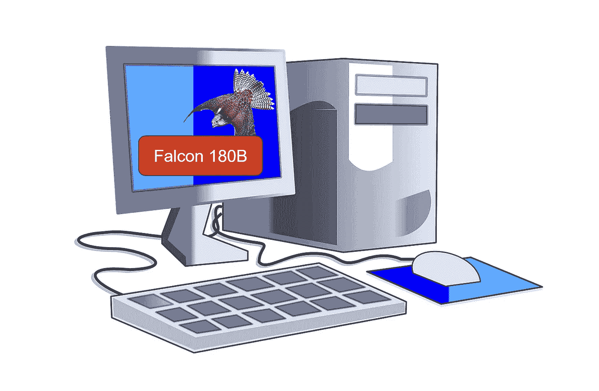

# Falcon 180B：它能在你的电脑上运行吗？

> 原文：[`towardsdatascience.com/falcon-180b-can-it-run-on-your-computer-c3f3fb1611a9?source=collection_archive---------0-----------------------#2023-09-12`](https://towardsdatascience.com/falcon-180b-can-it-run-on-your-computer-c3f3fb1611a9?source=collection_archive---------0-----------------------#2023-09-12)

## 是的，如果你有足够的 CPU RAM。

 [Benjamin Marie](https://medium.com/@bnjmn_marie?source=post_page-----c3f3fb1611a9--------------------------------)

·

[关注](https://medium.com/m/signin?actionUrl=https%3A%2F%2Fmedium.com%2F_%2Fsubscribe%2Fuser%2Fad2a414578b3&operation=register&redirect=https%3A%2F%2Ftowardsdatascience.com%2Ffalcon-180b-can-it-run-on-your-computer-c3f3fb1611a9&user=Benjamin+Marie&userId=ad2a414578b3&source=post_page-ad2a414578b3----c3f3fb1611a9---------------------post_header-----------) 发表在 [Towards Data Science](https://towardsdatascience.com/?source=post_page-----c3f3fb1611a9--------------------------------) ·7 分钟阅读·2023 年 9 月 12 日

--

图片由作者制作，插图来自 Pixabay ([1](https://pixabay.com/vectors/computer-technology-internet-web-312476/),[2](https://pixabay.com/illustrations/falcon-birds-of-prey-bird-2928724/))

2023 年 5 月，阿布扎比的科技创新研究所（TII）发布了两个预训练的 LLM 模型：Falcon-7B 和 Falcon-40B，以及它们的聊天版本。这两个模型表现非常优秀，在 [OpenLLM 排行榜](https://huggingface.co/spaces/HuggingFaceH4/open_llm_leaderboard) 上排名第一。

TII 发布的第三个模型刚刚加入了 Falcon 家族：Falcon 180B，一个拥有 1800 亿参数的模型。它比 Llama 2 70B 多了 2.5 倍的参数，比 Falcon-40B 多了 4.5 倍的参数。

以下是有关 Falcon 180B 的一些事实（来源：[Falcon 180B 模型卡片](https://huggingface.co/tiiuae/falcon-180B)）：

+   在 3.5 万亿个标记上进行预训练（[RefinedWeb](https://huggingface.co/datasets/tiiuae/falcon-refinedweb)）

+   遵循 Apache 2.0 许可证发布

+   有 360 GB 的大小

+   在 [OpenLLM 排行榜](https://huggingface.co/spaces/HuggingFaceH4/open_llm_leaderboard) 上（截至 2023 年 9 月 11 日）排名第一：

OpenLLM 排行榜的截图（2023 年 9 月 11 日） — 作者提供的图片

也有一个聊天版本。这些模型可以在 Hugging Face hub 上找到：

+   [Falcon 180B](https://huggingface.co/tiiuae/falcon-180B)

+   [Falcon 180B 聊天版](https://huggingface.co/tiiuae/falcon-180B-chat)

Falcon 180B 完全免费且是最先进的。但它也是一个巨大的模型。
