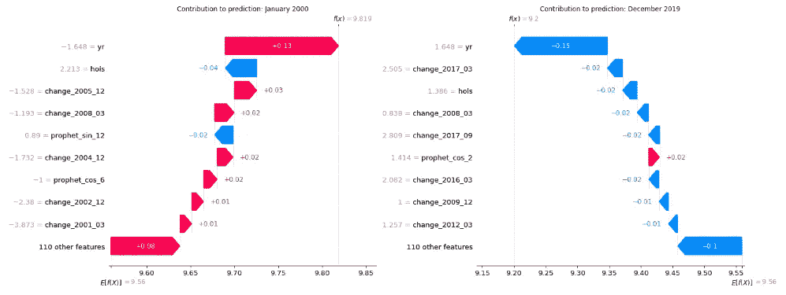

# 假先知：一个自制的时间序列回归模型

> 原文：[`towardsdatascience.com/false-prophet-a-homemade-time-series-regression-model-54e296b99438`](https://towardsdatascience.com/false-prophet-a-homemade-time-series-regression-model-54e296b99438)

## 借用 Meta 的 Prophet 的思想来构建一个强大的时间序列回归模型。

[](https://bradley-stephen-shaw.medium.com/?source=post_page-----54e296b99438--------------------------------)[](https://towardsdatascience.com/?source=post_page-----54e296b99438--------------------------------) [Bradley Stephen Shaw](https://bradley-stephen-shaw.medium.com/?source=post_page-----54e296b99438--------------------------------)

·发表于 [Towards Data Science](https://towardsdatascience.com/?source=post_page-----54e296b99438--------------------------------) ·阅读时间 16 分钟·2023 年 10 月 31 日

--


照片由 [Niklas Rhöse](https://unsplash.com/@blitzer?utm_source=medium&utm_medium=referral) 提供，来源于 [Unsplash](https://unsplash.com/?utm_source=medium&utm_medium=referral)

在这篇后续文章中，我继续我的使命，通过结合流行的 Prophet 包¹ 和演讲“用简单甚至线性模型取胜”² 的思想来构建弗兰肯斯坦的时间序列怪物。

在回顾我们正在做的事情之后，我们将讨论回归模型——它是什么，以及它的特别之处。

然后，我们将使用时间序列交叉验证进行超参数调整，以获得“最佳”的模型参数化。

最后，我们将使用 SHAP 验证模型，然后利用模型形式进行定制调查和手动调整。

这是一个广泛的范围——让我们开始吧。

*附注：我们在上一篇文章中已经涵盖了基础数据准备和特征工程，因此直接进入建模部分。赶紧了解一下之前的内容：*

[](/false-prophet-feature-engineering-for-a-homemade-time-series-regression-part-1-of-2-52d9df3d930d?source=post_page-----54e296b99438--------------------------------) ## 假先知：自制时间序列回归的特征工程（第一部分，共 2 部分）

### 基于 Meta 的 Prophet 包中的思想，创建强大的时间序列机器学习模型功能。

towardsdatascience.com

# 全局视角

让我们回顾一下我们在做什么。

终极目标很简单：在指定的时间范围内生成最准确的未来事件预测。

我们从一个仅包含日期变量和关注数量的时间序列开始。从中，我们衍生了额外的特征，以帮助我们准确建模未来的结果；这些特征深受 Prophet 方法的“启发”。

这就把我们带到现在的位置：大约准备将我们设计的数据输入一个轻量级模型，训练它以预测未来。稍后我们将深入了解模型的内部工作原理。

在继续之前，让我们回顾一下数据的样子。

# 数据

我们使用来自英国的实际数据——在这种情况下，STATS19 道路交通事故数据集，其中包含有关某些车祸的信息³。

我们将这个大型数据集总结为每月事故总数。这意味着我们的目标看起来像这样：


作者提供的图像

我们之前指出了下行趋势、强烈的季节性效应和明显的趋势变化。让我们看看我们的特征工程和建模如何协同工作来捕捉这些。

# 模型

虽然还不是圣诞节，但我确实有一些特征在我的模型愿望清单上。我将列出这些特征，并简要介绍为什么选择使用 LASSO 模型（剧透！）。

首先，模型应该尽可能强健。“强健”可以有很多含义，因此我们会更具体一些：我希望一个可以训练并放置一段时间的模型。换句话说，模型应该能够推断处理之前未见过但“正常”的输入值。

模型需要具有可解释性和可解释性。它应该易于查询和理解，并且简单易解释。理想情况下，我应该能够准确量化各种影响的影响。

最后，模型应该具有某种内置特征选择功能。理论上，适当执行特征选择可以提高模型性能，我可以进行严格的练习来找到最有效的特征集。实际上，现在是周六下午，人生太短暂。因此，模型将不得不自己解决。

尽管基于树的模型满足其中的一部分要求，但它们在推断方面表现不佳。它们也不能真正用于说明某些事情，比如“在六月，季节性导致 X%的变化”。

我想要的是一些通常线性的东西（提示提示），再加上一些额外的东西。

## 进入 LASSO

最小绝对收缩和选择算子（LASSO）是一种统计模型。它同时执行特征选择和正则化，以增强模型的预测能力和可解释性⁷。

我们不会过于关注细节，而是认识到 LASSO 是一种带有变化的线性回归方法。在模型训练过程中，使用了一个修改过的目标函数，其目的是在对回归系数施加某些约束的情况下，最大化模型的预测能力。这个约束——或称为“正则化”——有缩小特征系数接近零的效果，有效减少了给定特征对模型的影响。如果系数被缩小到零，该特征对模型拟合或预测将完全没有影响，特征实际上被从模型中移除。

这种特征系数缩减有效地减少了过拟合的可能性，因此应提高模型对新数据的泛化能力。

*附注：LASSO 正则化有时被称为 L1 正则化或 L1 惩罚。这来自于正则化项的数学形式，该形式使用 L1 范数。*

## 泛化事物

Scikit-learn 线性实现了 LASSO —— 即 `Lasso` 类假设目标可以表示为输入特征的线性组合。

让我们回顾一下我们正在建模的数据。我们可以看到序列的季节性成分的幅度似乎与趋势的幅度一致，这表明时间序列是乘性的而不是加性的。换句话说，我们的时间序列是时间序列元素的 *乘积*，而不是它们的 *总和*。这意味着在模型形式方面我们需要一点想象力。

幸运的是，我们不需要太有创意——通过对每月交通事故的自然对数建模，我们可以将加性 LASSO 转换为乘性模型。我们可以大致认为模型形式如下：


作者提供的图像

… 这意味着我们的预测看起来像：


作者提供的图像

*附注：上述数学使用了“帽子”符号，这是在讨论估计值时的惯例。由于预测是从估计的 beta 值中得出的——这些 beta 值本身是根据数据得出的——我们对目标和回归系数都使用帽子符号。*

稍后会详细讲解，但值得注意的是，当我们开始探讨模型时，要牢记这一点。

## **Alpha**，正则化参数

我们已经确定了模型，现在需要确定其参数化。

在 `sklearn` 中，LASSO 的正则化强度通过 `alpha` 参数控制。我对这个超参数的最佳值没有太多直觉，因此需要进行一些搜索，记住“最佳”模型是预测效果最好的模型。

我们需要某种训练-测试分割方法来测试给定模型参数化在未来的预测效果：通常随机分割交叉验证方法效果不佳，因为目标的时间元素会混淆，甚至更糟——泄漏。

幸运的是，时间序列交叉验证是一个实际存在的技术，并且在 scikit-learn 中有很好的实现。我们将使用它来搜索从潜在值分布中随机抽取的各种`alpha`值，并使用多种指标评估预测准确性。

*顺便说一下，如果你不熟悉时间序列交叉验证，可以在这里快速了解：*

[](https://python.plainenglish.io/on-times-series-cross-validation-6d685eaf335b?source=post_page-----54e296b99438--------------------------------) [## 时间序列交叉验证

### 通过聪明的子划分最大化你的时间序列数据的效用。

[python.plainenglish.io](https://python.plainenglish.io/on-times-series-cross-validation-6d685eaf335b?source=post_page-----54e296b99438--------------------------------)

经过一些搜索，我们可以可视化预测误差，并选择使其最小化的`alpha`值：


图片由作者提供

我们可以看到，当`alpha`接近 0.0017 时，均方误差（MAE）、均方根误差（RMSE）和平均绝对百分比误差（MAPE）都达到了最低值。

由于我们暂时没有比较模型，因此指标的实际值并不太重要。值得指出的是，MAPE 实际上不是一个百分比；我在上面的图表中将其格式化为百分比，以帮助我感受这些实际上相当小的数字。

到目前为止一切顺利。但一个具有这种`alpha`的模型实际预测效果如何？实际上还不错：


图片由作者提供

上面的图表是使用上述`alpha`参数的 LASSO 模型时间序列交叉验证结果的可视化表示。

每条彩色线代表了一个在预测期之前基于所有数据（灰色）训练的模型的折外预测。

例如，橙色线代表了基于截至 2010 年数据训练的模型对 2011 年的 12 个月预测。

预测结果有点难以看清，我们来放大一下：


图片由作者提供

对于如此嘈杂的实际数据，这些预测效果还不错：它们似乎捕捉到了年度趋势，并预测了更强的季节性变化。

然而，模型预测往往会错过每个时间段开始的前几个样本，然后通常会回到正常范围。

考虑到我们注意到在 2012–2014 年左右，底层数据中趋势和季节性发生了变化，我认为这个模型实际上表现得相当不错！

在继续进行模型调查之前，让我们使用这个`alpha`值来重新拟合整个数据范围的模型。


图片由作者提供

# 结果、验证与调查

我们想要一个易于理解和解释的模型。让我们看看我们做得如何。

## SHAP 验证

在模型评估方面，SHAP 包相当普及。我们将跳过整个“什么是 SHAP？SHAP 如何工作？”的介绍，直接进入结果，仅简要回顾一下 SHAP 关注的是模型预测的驱动因素，而不是模型拟合的驱动因素。

暂停完毕。

作为开端，总体总结突出显示了预测的最大驱动因素。


图片由作者提供

图表的顶部似乎是`year`特征，我们看到`year`的值较高时，预测值会降低。这与我们在数据中看到的明显下降趋势一致。

我们看到许多受 Prophet 启发的特征在预测中发挥了关键作用。有趣的是，`prophet_sin_12`出现在列表中（并且排得如此靠前！）——我们扩展 Prophet 特征创建范围的直觉似乎得到了验证。

还有一些其他特征出现了，比如其中一个周期性编码的月份特征（`mth_sin`）和一个月中的假期数量（`hols`），但这个列表主要被变化点特征所主导。以至于它可能需要进一步调查。

SHAP 还允许我们可视化单个预测的驱动因素。作为一个开端，让我们看看第一个和最后一个观察结果。



图片由作者提供

记住这两个观察结果相隔大约 20 年和 8,000 起事故，值得注意的是每个预测的驱动因素中都有一些共同点：这两个预测都受到了`year`和`hols`的高度影响（尽管方向不一定相同）。

让我们转向一些更富有想象力的内容。

## 定制调查

我们现在可以开始有创意地调查我们的模型。

记住，我们实际上建立了一个通用的线性模型，并添加了一些正则化，目标的转换意味着我们实际上使用了对数链接函数。

记住，在模型训练中，特征系数（beta）受到约束，最终会收缩到接近零。这给了我们第一个调查途径：检查拟合模型参数的大小。

任何具有非零系数的特征都会被用于模型中，特征系数的大小是其在整体预测中的“重要性”的一个指标。

这可以相对容易地完成，使用`coef_`属性从拟合模型中获取系数，然后记得在排序和/或排名之前取提取系数的绝对值。检查那些可以合理预期包含在模型中的但实际上没有的特征也是个好主意。

我们还能做些什么？好吧，这里就变得非常有趣了。

由于我们使用了 GLM，我们可以将特征分组在一起计算对预测的组影响。由于我们使用了对数链接函数，我们的影响是乘法的，理解起来更简单——例如，组影响为 1.05 = 增加 5%。

例如，我们有大量的 Prophet 特征。我们可以很容易地直接计算所有 Prophet 特征对总体预测的影响。

这种分组也不是绝对的——我们可以根据需要进行分组。在我们的案例中，我将把特征分组到主题中：

```py
def feature_type(s,
                 changepoint_flag=['change'],
                 seasonal_flag=['prophet','is_','qtr','mth','dim'],
                 trend_flag = ['yr'],
                 holiday_flag=['bus_days','hols']):

    if any(item in s for item in changepoint_flag):
        return 'changepoint'
    elif any(item in s for item in seasonal_flag):
        return 'seasonal'
    elif any(item in s for item in trend_flag):
        return 'trend'
    elif any(item in s for item in holiday_flag):
        return 'holiday'
```

特征组的影响量化是通过系数和该组中每个特征的特征值的点积来计算的。这使我们能够清晰地探索每个组随时间的影响。

我们对变化点特征的主导地位有些怀疑——让我们可视化它们的影响，看看它们如何随时间影响预测：


作者提供的图片

大多数变化点推动了预测的下降，除了 2013 年左右的一个上升变化。有很多变化点被使用，可能弥补了“纯”趋势特征中的不足。

那么趋势和变化点特征的综合效果如何？这些实际上是 Prophet 模型中的“趋势”组件。结果证明，这也不是很难获取：


作者提供的图片

季节性效果怎么样？我很想看看各种季节性特征如何组合在一起形成一个整体效果。


作者提供的图片

有趣！我们在这里看到了一年初的下降，然后是一年中期的双重峰值——这是一个相当复杂的效果。

最后，让我们看看假日效应，我们将工作日和实际的银行假日捆绑在一起。由于英国一年中的银行假日非常少，这一特征组可能会比较嘈杂：


作者提供的图片

……这正是我们看到的。注意到大多数影响在减少 1%（0.99）和增加 2%（1.02）之间波动，某些急剧下降可能与节假日较多的月份有关。

我认为可以相当安全地说，我们可以隔离每个效果对任何给定观察的影响——这正是我们开始这次小冒险时所期望的！

# 总结与漫谈

我们在这篇文章中涉及了很多内容。按照惯例，在稍作闲聊之前，先进行简要回顾。

## 总结

在谈到我们希望建立一个出色的预测模型后，我们查看了英国的道路交通事故数据。我们看到在汇总的月度数据中存在明显的趋势和季节性，并知道我们的特征工程和建模需要加倍努力以捕捉这些效果。

我们讨论了构建的模型应能良好预测，应具备可解释性和可理解性，并应具有某种形式的固有特征选择。我们还讨论了为何 LASSO 模型符合这些要求。

我们继续探讨模型形式，以及如何变换目标以更好地适应时间序列的乘法形式。我们探索了正则化参数`alpha`，以及适当的（时间序列）交叉验证方法以找到用于预测的最佳`alpha`。我们通过绘制时间之外的预测结果来进行感知检查，然后使用`alpha`和整个历史数据重新构建模型。

随后，我们了解了如何利用 SHAP 有效地研究 LASSO 模型的内部运作。然后，我们利用模型的可分性来研究和量化趋势、季节性和假期效应的影响。

让我们聊聊吧。

## 决策树无法外推

……以及使用广义线性模型的其他原因。

决策树模型最著名的挑战之一是它们无法超越训练数据的值进行外推。使用决策树模型间接地对预测值设置了上下限；鉴于我们的序列随时间的趋势，这可能不是一个合适的让步。

神经网络可以外推，但考虑到它们的复杂性，我决定退回到我的拿手好戏：谦逊的 GLM。

尽管简单，GLM 具有很多优点。尤其是考虑到我们的具体要求：

+   GLM 被广泛使用和理解。它们的熟悉度使得解释和沟通变得简单。

+   模型结构意味着有效选择链接函数可以使模型变得可处理。特别有用的是我们可以相对于“基准”观察值进行比较，因为这允许我们量化给定特征的某一水平的影响，其他条件相同。

+   类似地，我们可以计算给定特征的*确切*效果。这使得确保某些条件——如客户的期望——变得更加简单明了。

从实际的角度来看，我们的模型形式允许我们轻松进行一些手动“调整”。例如：如果我们认为我们的时间序列趋势与数据所示的方向不同怎么办？我们可以在假定的未来趋势上应用建模的季节性和假期效应，从而得到定制的预测。我们可以将这种方法概括并应用各种调整——非常适合情景测试和沟通“如果会怎么样？”的问题结果。

当然，GLM 并非全是阳光和彩虹。它们的构建可能相当棘手，通常需要专家判断。当我们开始引入特征交互（我们必须自己创建！）时，它们也可能变得非常麻烦。

就像大多数事情一样，你必须选择合适的工具来完成工作。

## 剩余的：模型残差

我们对一个已知具有强烈趋势和季节效应的时间序列进行了建模。我们怎么知道我们是否充分捕捉到了这种趋势和季节性呢？

一种需要调查的途径是模型残差：实际值与预测值之间的差异。残差中的任何趋势或季节性都会表明模型没有充分考虑这些效应；我们需要采取措施解决这个问题。

自然地，我并没有做到这一点。听我的，不要看我做的。

有趣的是，调查模型残差的方法实际上很自然地过渡到不同的建模方法。

一些从业者——包括我工作中的那些——支持混合模型，其中我们对原始系列进行简单建模，然后用不同的时间序列模型建模残差。

这里的基本逻辑是，简单模型充分捕捉了趋势，因此残差不包含长期非周期性效应：也就是说，残差是平稳的。这为依赖于平稳性假设的其他技术打开了大门——如一些时间序列方法——或可以从平稳性中受益，因为它们处理外推不特别好——如基于树的方法。

## 组 SHAP

大多数从业者喜欢使用 SHAP。理由很充分——看看这些可视化效果是多么的信息丰富和易于理解！

不过，如果我们能够将各种特征组合成特征集，并将这些*特征集*输入到 SHAP 可视化中，那就更好了。

尽管我们手动做过类似的工作，但分组特征的 SHAP 瀑布图确实能够生动展示预测的驱动因素……看起来我们可能可以做到这一点¹⁰。

## 让生活更轻松

我的工作流程用的都是比较繁琐的方法，包括手动交叉验证循环。这不是炫耀，相信我——我更愿意走最小阻力的路径。

我最后还是手动完成了这些操作，因为我无法让 scikit-learn 的随机交叉验证¹² 搜索正常工作。我认为这是因为使用了`Pipeline`估计器而不是仅使用`Lasso`类（记住我们需要在拟合 LASSO 模型之前对输入特征进行标准化），但我不确定。如果你知道解决方案——或者能指引我正确的方向——请告诉我。

最后，`LassoCV` 在 scikit-learn 中确实存在。这是一个自我调节的 LASSO 模型——没错，将其指向你的数据，它会自主确定`alpha`的最佳值。看起来它甚至可以接受定制的交叉验证生成器¹¹，尽管我不确定这是否包括时间序列交叉验证。下次可以看看。

就这些了。我希望你和我一样享受阅读这篇文章的过程。

和往常一样，请告诉我你的想法——我很想了解你在 Prophet 或用不同方式建模时间序列的经历。

下次再见。

# 参考文献和有用资源

1.  [GitHub — facebook/prophet: 用于生成具有线性或非线性增长的多季节时间序列数据的高质量预测的工具。](https://github.com/facebook/prophet)

1.  [Vincent Warmerdam: 通过简单的，甚至线性的模型获胜 | PyData London 2018 — YouTube](https://www.youtube.com/watch?v=68ABAU_V8qI&list=WL&index=32&t=2183s)

1.  [`roadtraffic.dft.gov.uk/downloads`](https://roadtraffic.dft.gov.uk/downloads) 按照 [开放政府许可证 (nationalarchives.gov.uk)](https://www.nationalarchives.gov.uk/doc/open-government-licence/version/3/) 使用

1.  [大规模预测 (peerj.com)](https://peerj.com/preprints/3190.pdf)

1.  [全面的时间序列分解指南 | Towards AI](https://pub.towardsai.net/lets-do-time-series-decomposition-d59d6bd4eea6)

1.  [趋势变点 | Prophet (facebook.github.io)](https://facebook.github.io/prophet/docs/trend_changepoints.html)

1.  [Lasso (统计学) — 维基百科](https://en.wikipedia.org/wiki/Lasso_(statistics))

1.  [Civil-liability-act-2018-Q-and-A.docx (live.com)](https://view.officeapps.live.com/op/view.aspx?src=https%3A%2F%2Fassets.publishing.service.gov.uk%2Fmedia%2F5c62d226ed915d04538f124f%2FCivil-liability-act-2018-Q-and-A.docx%23%3A%7E%3Atext%3DThe%2520Civil%2520Liability%2520Act%25202018%2520makes%2520important%2520changes%2520to%2520the%2Cinjury%2520discount%2520rate%2520is%2520set.&wdOrigin=BROWSELINK)

1.  [interaction.pdf (mcgill.ca)](https://www.medicine.mcgill.ca/epidemiology/joseph/courses/EPIB-621/interaction.pdf)

1.  [将 SHAP 值聚合到特征集合中是否有效？ · Issue #933 · shap/shap · GitHub](https://github.com/shap/shap/issues/933)

1.  [3.2.3.1.5\. sklearn.linear_model.LassoCV — scikit-learn 0.15-git 文档](https://scikit-learn.org/0.15/modules/generated/sklearn.linear_model.LassoCV.html)

1.  [sklearn.model_selection.RandomizedSearchCV — scikit-learn 1.3.1 文档](https://scikit-learn.org/stable/modules/generated/sklearn.model_selection.RandomizedSearchCV.html)
