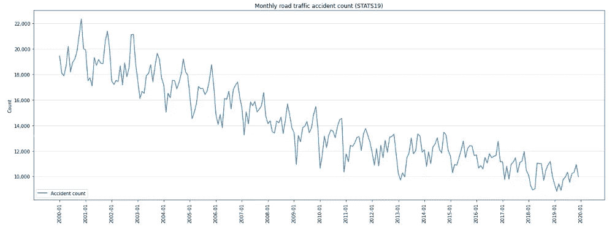
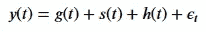
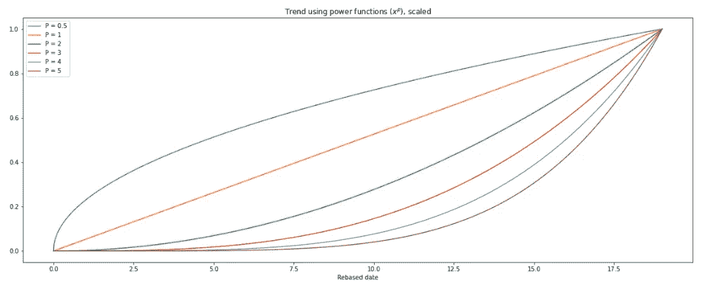
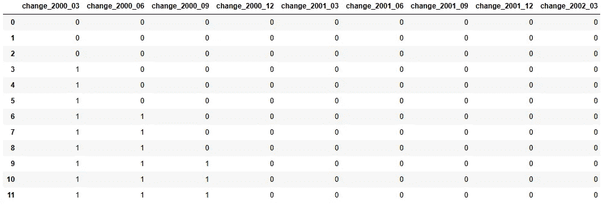
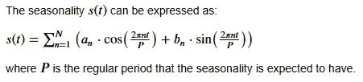
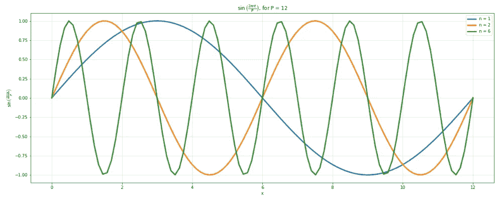

# False Prophet: 自制时间序列回归的特征工程

> 原文：[`towardsdatascience.com/false-prophet-feature-engineering-for-a-homemade-time-series-regression-part-1-of-2-52d9df3d930d`](https://towardsdatascience.com/false-prophet-feature-engineering-for-a-homemade-time-series-regression-part-1-of-2-52d9df3d930d)

## 基于 Meta 的 Prophet 包中的想法，创建强大的时间序列机器学习模型特征

[](https://bradley-stephen-shaw.medium.com/?source=post_page-----52d9df3d930d--------------------------------)[](https://towardsdatascience.com/?source=post_page-----52d9df3d930d--------------------------------) [Bradley Stephen Shaw](https://bradley-stephen-shaw.medium.com/?source=post_page-----52d9df3d930d--------------------------------)

·发表于 [Towards Data Science](https://towardsdatascience.com/?source=post_page-----52d9df3d930d--------------------------------) ·阅读时间 15 分钟·2023 年 10 月 13 日

--


[Scott Rodgerson](https://unsplash.com/@scottrodgerson?utm_source=medium&utm_medium=referral) 在 [Unsplash](https://unsplash.com/?utm_source=medium&utm_medium=referral) 上的照片

Meta 的 Prophet 包¹ 是最广泛使用的时间序列包之一。至少根据我的经验，在查看了我为稍后阅读而收藏的一系列时间序列文章后是这样。

说笑归说笑，我以前使用过这个包，我非常喜欢它。

另一个很棒的时间序列建模资源是 Vincent Warmerdam 的演讲，题为“通过简单甚至线性模型获胜”²，他在演讲中讨论了如何使用线性模型建模时间序列（需要一些准备工作）。

现在，有一些数据科学元素模糊了艺术和科学的界限——例如超参数调优或定义神经网络的结构。

我们将倾向于艺术，做许多伟大艺术家所做的事情：借鉴他人的想法。因此，在这一系列文章中，我们将从 Prophet 中借鉴特征工程的想法，并从 Vincent 中借鉴线性建模的想法，进行我们自己的时间序列回归分析。

# 大局观

让我们首先讨论一下总体目标，然后再深入到特征工程中。

总体目标很简单——在指定的时间范围内生成最准确的未来事件预测。

我们将从一个仅包含日期变量和感兴趣的数量的时间序列开始。由此，我们将推导出额外的信息，这将使我们能够准确地建模未来结果。这些额外的特征将会受到 Prophet 的“启发”。

然后我们将把工程数据输入到一个轻量级模型中，让它学习如何最好地预测未来。之后，我们将深入了解模型的内部工作——毕竟，我们需要了解是什么驱动我们的预测。

现在我们已经看到了全貌，让我们仔细看看数据，从数据开始。

# 数据

我们将使用来自英国的真实数据——在这个案例中，是道路交通事故数据。

这是由英国政府提供的 STATS19³ 数据集。由于数据集非常庞大，为了使事情更易于管理，我们将把每日事故数量汇总为月度数据。

通过可视化我们的时间序列，我们可以看到一个下降趋势和强烈的年度模式。也可以认为这些模式在 2012 年至 2014 年间的某个时点发生了变化。



作者提供的图片

这已经是我们需要创建的两种特征——一种是捕捉整体趋势，另一种是捕捉重复的年度模式（或季节性）。

# 特征工程

在开始实现之前，我们将探讨推动我们工程的一般理念。

## Prophet 的魅力

Prophet 使用具有三个主要成分的可分解时间序列模型，这些成分是加性组合的（带有一点随机性）。在数学上，这是：



作者提供的图片

> 这里 *g(t)* 是趋势函数，用于建模时间序列中非周期性的变化，*s(t)* 代表周期性变化（例如，周度和年度季节性），而 *h(t)* 代表节假日的影响，这些节假日可能会在一个或多个日期上发生不规则的安排。⁴

正是这种可分解的模型形式使得 Prophet 如此灵活，正是时间序列可以分离的这个理念将指导我们的特征工程：也就是说，我们将生成帮助我们建模每一个这些组件的特征。

我们的模仿不会成为 Prophet 的双胞胎——我们只是从中获得灵感。因此，我们将做一些调整：

+   *g(t)* 还将代表时间序列中的步进变化或变更点。

+   我们不会过多关注误差项（epsilon），只需记住 Prophet 使用它来表示“模型未能涵盖的个性化变化”⁴。

*旁白：如果你不熟悉时间序列的组成部分，这篇文章是一个很好的总结：*

[](https://pub.towardsai.net/lets-do-time-series-decomposition-d59d6bd4eea6?source=post_page-----52d9df3d930d--------------------------------) [## 开始做：时间序列分解]

### 一个有效地将时间序列分解成其组成部分的指南

[pub.towardsai.net](https://pub.towardsai.net/lets-do-time-series-decomposition-d59d6bd4eea6?source=post_page-----52d9df3d930d--------------------------------)

我们将从基本的日期相关特征开始，然后再衍生一些更具想象力的特征。

## 基础特征：零步骤

作为热身，让我们获取一些基本的日期相关特征：

```py
# set date as the Frame index
df.set_index('date', inplace=True)

# simple date features
df['yr'] = df.index.year
df['qtr'] = df.index.quarter
df['mth'] = df.index.month
df['dim'] = df.index.days_in_month
```

所有这些特征都可以直接获得。即使是对这些特征不熟悉的人也可能很清楚，这些特征很可能会预测每月的事故数量。

是时候进行一些主题工程了。

## 趋势

趋势，即随时间的长期变化，可以呈现各种形式。

如果存在的话，趋势通常会非常简单——持续的上升或下降变化并不少见。在许多时间序列演示中使用的航空公司乘客数据⁵展示了一个非常清晰且简单的趋势。

然而，趋势可能会变得比这更复杂。例如，它们可能是非线性的，其中存在加速或减速的现象。可能会有多个加速或减速的实例。或者可能会有阶跃变化，其中趋势的位置发生突变。

我们已经看到我们的数据中似乎存在一个下降的线性趋势，变化点位于 2012 年和 2014 年之间的某个地方。我不完全确定趋势的确切形式，所以我将创建各种趋势，并让模型找出哪一个最合适：

```py
# fraction of year
df['yr_fraction'] = df.index.year + (df.index.month - 1) / 12

# add non-linearity
yr_fraction_rebased = df['yr_fraction'] - df['yr'].min()
df['yr_fraction_sq'] = yr_fraction_rebased ** 2
df['yr_fraction_cube'] = yr_fraction_rebased ** 3
df['yr_fraction_quad'] = yr_fraction_rebased ** 4
df['yr_fraction_quint'] = yr_fraction_rebased ** 5
df['yr_fraction_sqrt'] = yr_fraction_rebased ** 0.5
```

从视觉上来看，这给我们提供了许多可能的趋势（通过一些缩放来将所有内容适配到同一图表上）：



图片由作者提供

*附注：重要的是要注意，虽然所有这些趋势看起来都是上升的，但模型将能够利用这些趋势捕捉数据中的下降趋势，例如使用负权重或系数。这不仅适用于趋势组件，还适用于模型中使用的所有特征。*

现在来看一些变化点。

Prophet 通过首先指定大量潜在变化点，然后尽可能少地使用这些点来检测变化点。Prophet 的默认方法是在数据的前 80%内创建 25 个均匀间隔的变化点。

我们将通过首先创建许多潜在的变化点，然后让模型选择使用哪些点来做一些类似的事情。这与 Prophet 并没有太大区别，但没有对间隔施加限制。

```py
# changepoints
changepoints = pd.DataFrame()

for date in df.index.unique():
    date = pd.to_datetime(date)
    date_str = f'change_{date.strftime("%Y_%m")}'

    # allow only X-erly changes
    if date.month % 3 == 0:
        temp = pd.DataFrame(
            {date_str:np.where(df.index <= date,0,1)}
        )
        changepoints = pd.concat([changepoints,temp], axis=1)
```

如果我们查看前 12 行，我们可以看到变化点创建是如何工作的：



图片由作者提供

并不复杂，因为我们为每个变化点特征都有一列，指示观察是否发生在给定日期之前或之后。

值得一提的是，我只允许变化点出现在每个季度末。除非我们对系列中的变化非常确定，否则设置这些点可能有点像艺术，需要在灵活性和过度反应之间取得平衡；变化点需要足够频繁以捕捉趋势中的真实变化，但又不能过于频繁，以至于开始捕捉噪声。

在这种情况下，季度变化点有一些优势。首先，它们有效地对变化持续多长时间设置了最低时间阈值，才被认为是“真实”的——这对于减少模型将信号误认为噪声的倾向可能很有用。

在英国，季度变化大致与季节性变化和重大日历变化（例如 1 月 1 日）对齐。

还需要考虑外部环境因素：每年 3 月和 9 月会发布新的注册车牌，这通常会导致新车销量的激增。由于新车通常比旧车更安全，因此可以合理地想象车主构成的变化会对道路交通事故的数量产生影响。

虽然这可能是一个不错的起点，但我们可能需要稍后再回来进行一些微调。

## 季节性

我们将时间序列中存在的规则性或周期性效应称为季节性。

Prophet 使用傅里叶级数来表示加性模型中的季节效应。其通用化为如下：



图片来源：作者

傅里叶表示法本质上意味着我们在时间序列中看到的所有重复效应可以通过一系列不同周期的正弦和余弦波来表示。

由于我们正在处理月度数据，我们预计每年在相同时间看到季节性效应；换句话说，我们时间序列的 *周期* 是一年，即 12 个月。因此，我们需要将 *P* 设置为 12。

*N* = 10 和 *N* = 3 已被证明分别适用于具有年度和周度季节性的系列，但我们将 *N* 扩展到 12 以确保效果。

记住，我们不是在创建一个单独的季节性模型，而是创建季节性特征，让我们的单一模型能够组合这些特征以表示周期性变化。考虑到这一点，我们按以下方式创建 Prophet 启发的特征：

```py
# Prophet features
for j in range(1,13):
    df[f'prophet_sin_{j}'] = np.sin(2 * np.pi * df['mth'] * j / 12)
    df[f'prophet_cos_{j}'] = np.cos(2 * np.pi * df['mth'] * j / 12)
```

这会生成多个不同周期的正弦和余弦波，准备好让模型将它们组合在一起，以捕捉季节性。因此，作为输入特征，它们可能看起来像这样：



*附注：注意较高的 n 值如何减少正弦函数的周期——即完成一个完整周期所需的时间。*

我们的模型将以各种方式选择和缩放这些函数，以便适当地考虑时间序列的周期性（或 *季节性*）元素……也就是说，模型将确定上述公式中的 *a* 和 *b* 系数。

## 节假日

> 假期和事件对许多业务时间序列提供了大的、相对可预测的冲击，并且通常不遵循周期模式，因此它们的效果不能很好地通过平滑周期建模。⁴

一个很好的例子是复活节周末，在英国对车辆事故有非常明显的影响。然而，这个假期周末并不是每年都在同一个月份——有时它发生在三月，而在其他年份，我们得等到四月才能开始寻找巧克力兔子。

尽管我们可以相当提前知道复活节的日期（当然也知道过去的日期），但用上述季节性方法建模相当困难。因此，我们将采取不同的方法，而是统计每月的银行假期和工作日数量，这应该使我们也能够捕捉到像圣诞节这样更规律的假期的影响。

我们可以使用`numpy`来获取工作日：

```py
# business days
begin = df.index.values.astype('datetime64[D]')
end = (df.index + pd.DateOffset(months = 1)).values.astype('datetime64[D]')

df['bus_days'] = np.busday_count(
    begindates = begin,
    enddates = end
)

# holidays
df['hols'] = pd.Series(df.index).apply(count_holidays).values
```

……但是需要`holidays`包和一点来自 StackOverflow 的帮助才能获得每月的假期数量：

```py
import holidays

def count_holidays(u):
    hols = holidays.country_holidays('GB')
    days = pd.date_range(u, u + pd.DateOffset(months = 1))
    return sum(y in hols for y in days)
```

我们将忽略周末天数：因为可以从现有特征中推导出，使用周末天数可能会引入不必要的特征相关性。

就这样——特征工程完成，我们准备好进入建模阶段。

# 总结与闲聊

我们在这篇文章中涵盖了很多内容。按照惯例，我们将快速回顾一下，然后进行一些闲聊。

## 总结

在讨论了构建一个出色的预测模型的愿望之后，我们查看了英国道路交通事故数据。我们看到我们汇总的每月数据中存在明显的趋势和季节性，并知道我们需要创建各种特征来捕捉这些效应。

我们的特征工程过程从简单的预热开始——提取简单且直接可用的日期特征。

我们开始构建捕捉趋势的特征，并允许一些变化点，这些变化点被相对简单地处理。我们的逻辑可能有一定的价值，但我们承认可能需要一些微调。

我们使用了改进的傅里叶变换来建模季节性，创建了 12 组季节性特征。

最后，我们转向创建假期特征，选择专注于每月的工作日和假期天数。

## 循环特征编码

在构建新特征时，我们需要牢记两点——什么*可能*对我们的目标有预测作用以及它如何被机器解读。

一个很好的例子是年度月份，我们通常用整数映射来表示（即：一月 = 1，……，十二月 = 12）。我们可以相当确定地认为月份会对事故数量产生强烈的影响。但是如果我们将整数编码传递给模型，模型会将某一年的十二月视为与下一年的一月完全不同的时间点，即使它们是时间上相邻的！

我们通过周期特征编码解决这个问题，或者更具体地说，通过转换为极坐标。由于正弦和余弦变换本身都不能提供唯一的编码，我们使用两者的组合。

上面的代码没有显示任何周期编码的示例，但它在我的工作流程中使用，结果在模型中成为一个重要特征（见第二部分）。

## 先知特征

按类似的思路，我们的“先知特征”严重依赖于正弦和余弦变换。实际上，这些实际上是傅里叶变换。

细心的读者可能已经注意到先知特征的创建方式。在原始论文中，时间维度被重新基准化到某一点，每个观察值都被反映为在那之后的 *t* 时间单位。我们没有这样做，而是选择了另一种方法。如果我再次考虑这个问题，可能会考虑这一点。

## 滞后特征：房间里的大象

到目前为止，我实际上只是略过了滞后特征的使用。或者更准确地说，是缺乏使用。

使用目标量的先前值来预测目标量的当前或未来值——即使用“滞后”的时间值——在许多优秀的时间序列模型中是常见的。这是有充分理由的，因为它们通常是强有力的预测器。

我不愿这样做的核心在于模型的整体目的——即在预测方面表现良好。当我们使用滞后特征进行预测时，通常必须“推进”滞后特征，并从使用目标的实际值过渡到使用预测值。

具体来说，考虑一个使用一个滞后特征的模型——即，我们使用时间 *t — 1* 的目标值来预测时间 *t* 的目标值。我们希望使用该模型预测未来 3 步。

第一个预测（在时间 *t + 1*）将使用今天目标的值。由于目标值是已知的，所以这里没有问题，一切照常进行。

现在考虑时间 *t + 2* 的预测。我们需要时间 *t + 1* 的目标值才能使用我们的模型。当然，此时 *真实* 的目标值是未知的，因此我们使用 *预测* 的目标值来代替时间 *t + 1*。当涉及到预测时间 *t + 3* 时，我们将时间 *t + 2* 的预测推进，以此类推。从中可以看出，预测误差如何被融入预测中；早期的错误会被累积，因为不准确的预测被推进和重复使用。我不喜欢这样。

不使用滞后特征还有一个附带好处，那就是模型可解释性：我们被迫以不同的方式建模目标，并真正考虑（并建模！）结果的驱动因素。

这通常会导致与利益相关者进行更好的对话，因为解释预测开始听起来像是“长期趋势占预测的 X%而季节性占预测的 Y%”而不是“预测为 B 是因为前一个预测的值为 A”。

在继续之前，最后提一下滞后特征。我们并不局限于使用滞后的*目标*特征，因此虽然我们讨论了包括目标特征的前期值，我们也可以同样包括滞后的预测变量，且要有类似的警示和要求。

这并不是要全面否定使用滞后特征的做法——我相信在某些用例中这样做完全合理。使用的滞后数量和预测窗口的长度可能甚至意味着这不是问题。

## 变更点

让我们讨论变更点及其创建。

我以一种非常简单的方式创建了变更点，我确信还有许多改进我实现的方法。Prophet 可以说做得更好，通过在数据的前 80%中创建均匀间隔的变更点，但也有一些需要考虑的事项。

这减少了较近期虚假变更点对未来预测的影响——这是件好事。

但真正的变化有多少发生在均匀间隔的时间点上？如果变化真的以这种节奏发生，那是否更应视为某种季节性影响？是的，这是在挑剔。是的，这很重要。好吧，我继续。

虽然我们可以对历史变更点进行建模，但对未来变更点的建模要困难一些；有些情况下，未来的变更是已知的。

例如，英国推出了《民事责任法》，对英格兰和威尔士的个人伤害赔偿系统进行了修改。如果你像我一样定期建模颈部损伤的赔偿申请数量和成本（工作需要，而非兴趣），2021 年 6 月该法案的实施导致了一个相当严重的步骤变化。但由于事先已知，所以可以采取措施加以考虑。

这类变化需要逐案处理，务实和常识应当是首要考虑的。

## 交互作用

有人记录房间里的大象吗？再来一个——我们还没有构建捕捉预测变量之间交互作用的特征。

交互作用是非常有用的特征，可以捕捉各种预测变量之间的关系。当一个自变量对结果的影响取决于另一个自变量的值时，就会发生交互作用⁹。

在我们的案例中，使用交互作用的一个更有趣的动机是允许季节性随时间变化，因为我们目前假设——并建模——相同的季节性效果在二十多年里仍然有效。虽然没有明显的反证，但我们可以通过将时间与某些特征进行交互，潜在地挖掘更多的预测能力。

我们需要将这个添加到下次的待办事项列表中。

## 假期

最后，简单说一下假期的情况。

我们讨论了一些复活节周末可能带来的麻烦，并提出了一个简单的解决方案。

对特征工程的真正改进将是纳入学校假期。这些假期可能会对道路交通事故的数量产生影响，因此将是强有力的预测因素。

不幸的是，这并不容易，因为英国的学校假期时间略有不同，假期长度也不尽相同。也许我们可以发挥创造力，创建一个学校假期的分布，并将其分配到每个月——这是下次的另一个任务。

就这些了。我希望你们阅读这篇文章的乐趣与我写作的乐趣一样多。

一如既往，请告诉我你的想法——我非常感兴趣了解你在使用 Prophet 或以不同方式建模时间序列的经历。

正如我提到的，我将在即将发表的文章中处理建模问题——请留意。

期待下次见面。

# 参考资料

1.  [GitHub — facebook/prophet: 用于生成高质量时间序列数据预测的工具，支持多季节性和线性或非线性增长。](https://github.com/facebook/prophet)

1.  [Vincent Warmerdam：用简单甚至线性模型取胜 | PyData London 2018 — YouTube](https://www.youtube.com/watch?v=68ABAU_V8qI&list=WL&index=32&t=2183s)

1.  [`roadtraffic.dft.gov.uk/downloads`](https://roadtraffic.dft.gov.uk/downloads) 依据 [开放政府许可证 (nationalarchives.gov.uk)](https://www.nationalarchives.gov.uk/doc/open-government-licence/version/3/) 使用

1.  [大规模预测 (peerj.com)](https://peerj.com/preprints/3190.pdf)

1.  [时间序列分解的综合指南 | Towards AI](https://pub.towardsai.net/lets-do-time-series-decomposition-d59d6bd4eea6)

1.  [趋势变更点 | Prophet (facebook.github.io)](https://facebook.github.io/prophet/docs/trend_changepoints.html)

1.  [Civil-liability-act-2018-Q-and-A.docx (live.com)](https://view.officeapps.live.com/op/view.aspx?src=https%3A%2F%2Fassets.publishing.service.gov.uk%2Fmedia%2F5c62d226ed915d04538f124f%2FCivil-liability-act-2018-Q-and-A.docx%23%3A%7E%3Atext%3DThe%2520Civil%2520Liability%2520Act%25202018%2520makes%2520important%2520changes%2520to%2520the%2Cinjury%2520discount%2520rate%2520is%2520set.&wdOrigin=BROWSELINK)

1.  [interaction.pdf (mcgill.ca)](https://www.medicine.mcgill.ca/epidemiology/joseph/courses/EPIB-621/interaction.pdf)

1.  [`stackoverflow.com/a/59681727/11637704`](https://stackoverflow.com/a/59681727/11637704)
