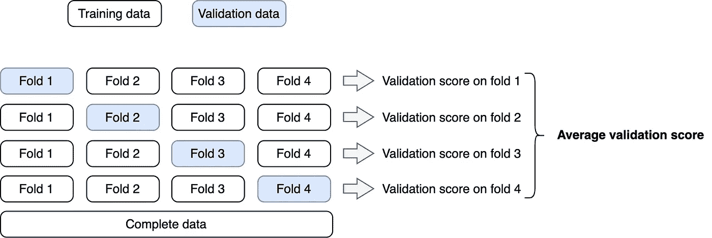
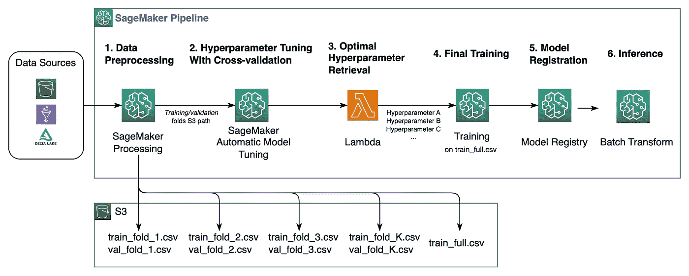

# AWS SageMaker 中的快速和可扩展超参数调优与交叉验证

> 原文：[`towardsdatascience.com/fast-and-scalable-hyperparameter-tuning-and-cross-validation-in-aws-sagemaker-d2b4095412eb`](https://towardsdatascience.com/fast-and-scalable-hyperparameter-tuning-and-cross-validation-in-aws-sagemaker-d2b4095412eb)

## 使用 SageMaker 管理的 Warm Pools

[](https://medium.com/@joao.pereira.abt?source=post_page-----d2b4095412eb--------------------------------)[](https://towardsdatascience.com/?source=post_page-----d2b4095412eb--------------------------------) [João Pereira](https://medium.com/@joao.pereira.abt?source=post_page-----d2b4095412eb--------------------------------)

·发表于 [Towards Data Science](https://towardsdatascience.com/?source=post_page-----d2b4095412eb--------------------------------) ·阅读时间 8 分钟·2023 年 3 月 3 日

--


图片由 [SpaceX](https://unsplash.com/@spacex?utm_source=medium&utm_medium=referral) 提供，来源于 [Unsplash](https://unsplash.com/?utm_source=medium&utm_medium=referral)。

本文分享了一种配方，以 **提高 60%** 的速度，通过 SageMaker 管道利用 SageMaker 管理的 Warm Pools 进行超参数调优与交叉验证。通过使用 Warm Pools，一个包含 120 个顺序作业的调优步骤的运行时间减少了 **从 10 小时到 4 小时**。

提升和评估机器学习模型的性能通常需要多种因素。超参数调优和交叉验证就是两个这样的因素。前者找到模型的最佳版本，而后者估计模型如何推广到未见数据。这些步骤结合起来，带来了计算挑战，因为它们需要多次训练和验证模型，可能是并行的和/或顺序的。

***本文介绍的内容…***

+   什么是 Warm Pools 以及如何利用它们加速超参数调优与交叉验证。

+   如何设计一个包含处理、调优、训练和 Lambda 步骤的生产级 SageMaker 流水线。

我们将考虑用于超参数调优的贝叶斯优化，它利用已测试的超参数组合的评分来选择下一轮测试的超参数集。我们将使用[*k*-折交叉验证](https://medium.com/@zstern/k-fold-cross-validation-explained-5aeba90ebb3)来评分每个超参数组合，分割如下：



𝑘-fold 交叉验证策略。

完整数据集被划分为𝑘个验证折叠，模型在𝑘-1 个折叠上训练，并在相应的保留折叠上验证。总体得分是每个验证折叠得到的个别验证得分的平均值。

> **故事情节：**
> 
> 1\. 什么是温暖池？
> 
> 2\. 端到端 SageMaker 管道
> 
> 3\. 调优步骤内部发生了什么？
> 
> 4\. 使用温暖池有什么好处？
> 
> 5\. 总结

# 1\. 什么是温暖池？

每当在 AWS 中启动训练任务时，预配实例在执行训练脚本之前大约需要 3 分钟来引导。这种启动时间在顺序运行多个任务时会累积，这在使用贝叶斯优化策略进行超参数调优时尤其明显。在这种情况下，数十个甚至数百个任务被顺序运行，导致总时间显著增加，这可能与脚本的实际执行时间相当，甚至更高。

[SageMaker 托管温暖池](https://aws.amazon.com/about-aws/whats-new/2022/09/reduce-ml-model-training-job-startup-time-8x-sagemaker-training-managed-warm-pools/)使得在任务完成后保留训练基础设施成为可能，从而为每个后续任务节省实例启动时间。

启用温暖池是直接的。你只需在创建 SageMaker 训练任务时添加一个额外的参数（`keep_alive_period_in_seconds`）：

```py
estimator = Estimator(
    entry_point='training.py',
    keep_alive_period_in_seconds=600,
    ...
)
```

如果你想了解更多关于 SageMaker 托管温暖池的信息，这里是文档：

[## 使用 SageMaker 托管温暖池进行训练

### SageMaker 托管温暖池使你能够在训练任务完成后保留和重用预配的基础设施…

[docs.aws.amazon.com](https://docs.aws.amazon.com/sagemaker/latest/dg/train-warm-pools.html?source=post_page-----d2b4095412eb--------------------------------)

既然我们了解了什么是温暖池，在第二部分中，我们将深入探讨如何利用它们来加速包含交叉验证的 SageMaker 管道的整体运行时间。

# 2\. 端到端 SageMaker 管道

下图展示了一个端到端的 SageMaker 管道，该管道通过交叉验证进行超参数调优。



端到端 SageMaker 管道的架构图。

我们将使用[SageMaker Python SDK](https://sagemaker.readthedocs.io/en/stable/)来创建管道，这是一个开源库，简化了在 AWS SageMaker 中训练、调优和部署机器学习模型的过程。图中的管道步骤总结如下：

1.  **数据预处理（**`ProcessingStep`**）—** 数据从源中检索，转化，并划分为 *k* 个交叉验证折叠。一个额外的完整数据集被保存用于最终训练。

1.  **超参数调优与交叉验证（**`TuningStep`**）—** 这是我们将重点关注的步骤。它找到在验证折中实现最佳平均性能的超参数组合。

1.  **最佳超参数检索（**`LambdaStep`**）—** 触发一个*Lambda*函数，通过访问超参数调优作业的结果来检索最佳超参数集，使用 *Boto3*。

1.  **最终训练（**`TrainingStep`**）—** 使用最佳超参数在完整数据集 `train_full.csv` 上训练模型。

1.  **模型注册（**`ModelStep`**）—** 将最终训练好的模型注册到 SageMaker 模型注册表中。

1.  **推理（**`TransformStep`**）—** 使用注册的模型生成预测结果。

请在[SageMaker 开发者指南](https://docs.aws.amazon.com/sagemaker/latest/dg/build-and-manage-steps.html)中查找有关如何实现这些步骤的详细文档。

# 3\. 调优步骤内部发生了什么？

现在我们来深入探讨**管道步骤 2**，该步骤迭代地并行和顺序地尝试和交叉验证多个超参数组合。该解决方案在下图中表示：


超参数调优与交叉验证步骤的架构图。

该解决方案依赖于 SageMaker 自动模型调优来创建和协调测试多个超参数组合的训练作业。可以使用[SageMaker Python SDK](https://sagemaker.readthedocs.io/en/stable/)中的`HyperparameterTuner`启动自动模型调优作业。它创建了*M*x*N*个超参数调优训练作业，其中*M*个作业在*N*个顺序轮次中并行运行，逐步搜索最佳超参数。每个作业启动并监控一组*K*交叉验证作业。在每个调优轮次中，*M*x*K*个实例会**保留到下一轮**。在随后的轮次中，没有实例启动时间。

SageMaker 的 `HyperparameterTuner` 已经利用了 Warm Pools，正如在[AWS 新闻博客](https://aws.amazon.com/about-aws/whats-new/2022/08/amazon-sagemaker-automatic-model-tuning-reuses-sagemaker-training-instances-reduce-start-up-overheads/)中所宣布的那样。然而，每个调优作业中创建的交叉验证训练作业 — 交叉验证特定的超参数组合 — 需要**手动创建和监控**，**且配置的** **实例不会保留在 Warm Pool 中**。每个超参数调优训练作业仅在所有基础的交叉验证训练作业完成后才会完成。

为了使上述架构生效并为**所有**训练作业启用 Warm Pools，我们需要创建三个主要脚本：`pipeline.py`、`cross_validation.py`和`training.py`：

+   `**pipeline.py**` **脚本 —** 定义了在 第二部分 中描述的 SageMaker Pipeline 步骤，包括 SageMaker 的 `HyperparameterTuner`：

```py
#pipeline.py script
...
# Steps 2 to 5

tuner = HyperparameterTuner(
    estimator=estimator,
    metric_definitions=[
        {
          "Name": "training:score",
          "Regex": "average model training score:(.*?);"
        },
        {
          "Name": "validation:score",
          "Regex": "average model validation score:(.*?);"
        }
    ],
    objective_metric_name="validation:score",
    strategy="Bayesian",
    max_jobs=max_jobs, # M x N
    max_parallel_jobs=max_parallel_jobs # M
)

# Step 2 - Hyperparameter tuning With cross-validation step
step_tune = TuningStep(
    name="tuning-step",
    step_args=tuner.fit({
        "train": "<s3-path-to-training-folds>",
        "validation": "<s3-path-to-validation-folds>"
    })
)

# Step 3 - Optimal hyperparameter retrieval step
step_lambda = LambdaStep(
    name="get-optimal-hyperparameters-step",
    lambda_func=lambda_get_optimal_hyperparameters,
    inputs={
        "best_training_job_name": step_tune.properties.BestTrainingJob.TrainingJobName,
    },
    outputs=[
        LambdaOutput(output_name="hyperparameter_a"),
        LambdaOutput(output_name="hyperparameter_b"),
        LambdaOutput(output_name="hyperparameter_c")
    ]
)

# Step 4 - Final training step
step_train = TrainingStep(
    name="final-training-step",
    step_args=estimator.fit({"train": "<s3-path-to-full-training-set>"})
)

model = Model(
    model_data=step_train.properties.ModelArtifacts.S3ModelArtifacts,
    ...
)

# Step 5 - Model registration step
step_model_registration = ModelStep(
    name="model-registration-step",
    step_args=model.register(.)
)
```

+   `**cross_validation.py**` **脚本**——作为 SageMaker 的 `HyperparameterTuner` 的入口点。它启动多个交叉验证训练任务。在调用 SageMaker 训练任务 API 时，必须在此脚本中指定 `keep_alive_period_in_seconds` 参数。该脚本计算并记录所有验证折的平均验证得分。记录这些值使得 `HyperparameterTuner` 可以通过 *Regex* 轻松读取该指标（如上述代码片段所示）。该指标将标记到每个超参数组合中。

> **提示：** 在调用创建和监控训练任务的 SageMaker API 之间添加几秒钟的小延迟，以防止“超出速率”错误，如示例所示：

```py
#cross_validation.py script

import time
...

training_jobs = []
for fold_index in range(number_of_folds):

    # Create cross-validation training jobs (one per fold)
    job = train_model(
        training_data="<training-data-s3-path>"
        validation_data="<validation-data-s3-path>"
        fold_index=fold_index,
        hyperparameters={
            "hyperparameter_a": "<value-of-hyperparameter-a>",
            "hyperparameter_b": "<value-of-hyperparameter-b>",
            "hyperparameter_c": "<value-of-hyperparameter-c>"
    })
    training_jobs.append(job)

    # Add delay to prevent Rate Exceeded error. 
    time.sleep(5)
...
```

> **提示：** [启动 SageMaker 训练任务时禁用调试器分析器](https://docs.aws.amazon.com/sagemaker/latest/dg/debugger-turn-off.html)。这些分析器实例将与训练实例数量相同，并且可能显著增加总体成本。你可以通过在 Estimator 定义中简单地设置 `disable_profiler=True` 来实现。

+   `**training.py**`**脚本**——在给定的输入训练集上训练模型。交叉验证的超参数作为此脚本的参数传递。

> **提示：** 编写一个通用的 `*training.py*` 脚本，并在交叉验证集上训练模型以及在整个训练集上使用最佳超参数训练最终模型时重用它。

要控制每个并行交叉验证任务集，以及为每个特定超参数组合计算最终验证指标，需要在 `cross_validation.py` 脚本中实现几个自定义函数。[这个示例](https://github.com/aws-samples/sagemaker-cross-validation-pipeline) 提供了很好的灵感，尽管它未启用 Warm Pools 或 Lambda。

## 总共创建了多少任务？

*M* x *N* x *(K+1)* 任务。为什么？

+   *M* x *N* 超参数调整训练任务——M 个并行和 N 个串行——匹配超参数组合的数量。

+   每个超参数调整训练任务的 *K* 个并行交叉验证任务 + 1（超参数调整训练任务本身）。

如果我们有 **5** 个验证折，运行 **4** 个超参数调整训练任务并行和 **120** 个串行，那么 **任务总数将是 2880**。

> **重要：** 确保你拥有所使用的实例类型所需的所有服务配额。查看 AWS 指南以了解如何为 [Warm Pools](https://docs.aws.amazon.com/sagemaker/latest/dg/train-warm-pools.html#train-warm-pools-resource-limits) 和 [自动模型调整](https://docs.aws.amazon.com/sagemaker/latest/dg/automatic-model-tuning-limits.html) 设置这些配额。

# 4\. 我们从使用 Warm Pools 中得到什么？

假设我们想要运行 N=120 个顺序训练任务，并且实例的启动时间为 3 分钟，训练时间为 2 分钟（每个任务 5 分钟）。这意味着总运行时间大约为：

+   *没有* Warm Pools：5 分钟 x 120 个任务 = **10 小时**

+   *有* Warm Pools：5 分钟 x 1 个任务 + 2 分钟 x 119 个任务 ≈ **4 小时**

**这意味着使用 Warm Pools 过程的时间减少了 60%！**

# 5\. 总结

在这篇文章中，我展示了如何利用 Warm Pools 显著加快 SageMaker Pipelines 中的超参数调优。Warm Pools 是 SageMaker 的一个很棒的功能，它不仅使生产流水线更加高效，还加快了实验的迭代。目前，SageMaker 管理的 Warm Pools 已经集成到 SageMaker Training 中，但尚未集成到 SageMaker Processing。

— 若昂·佩雷拉

*感谢阅读。希望这篇文章能帮助你在 SageMaker 中扩展超参数调优。如果你想阅读我未来的文章，请* [*关注我*](https://medium.com/@joao.pereira.abt/subscribe)*。非常感谢反馈！如果有任何问题，请在下方留言或直接联系我* ***通过电子邮件*** *或在* [***LinkedIn***](https://www.linkedin.com/in/jpcpereira/)*上联系我。*

*除非另有说明，所有图片均由作者提供。*
