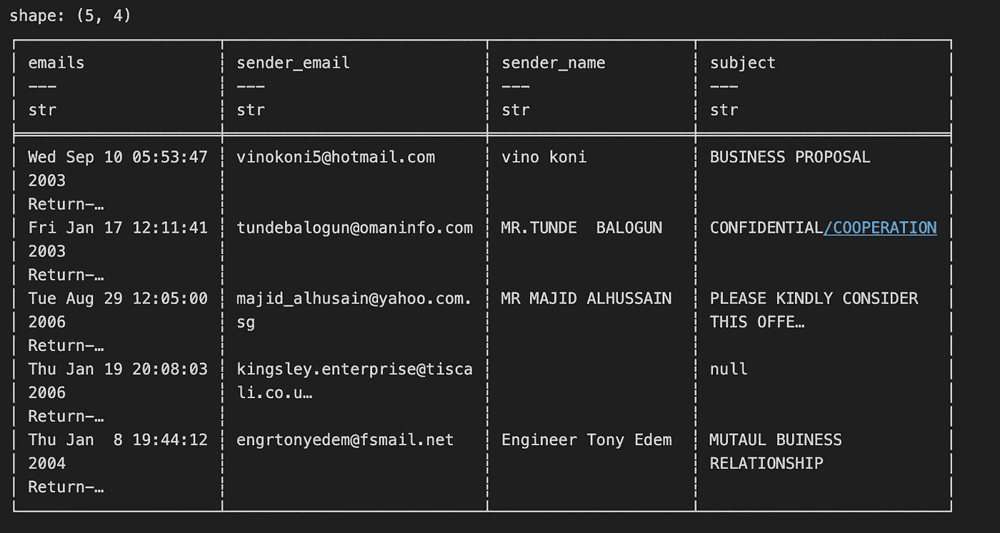
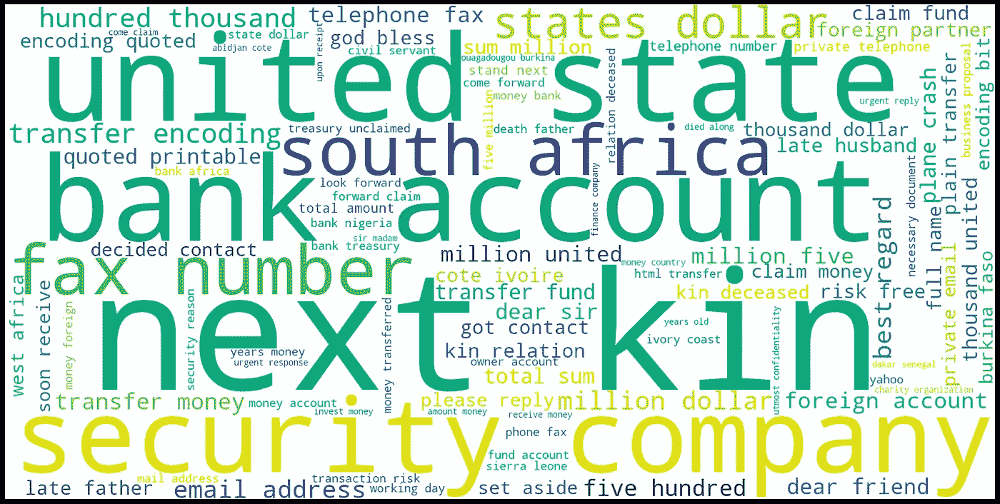
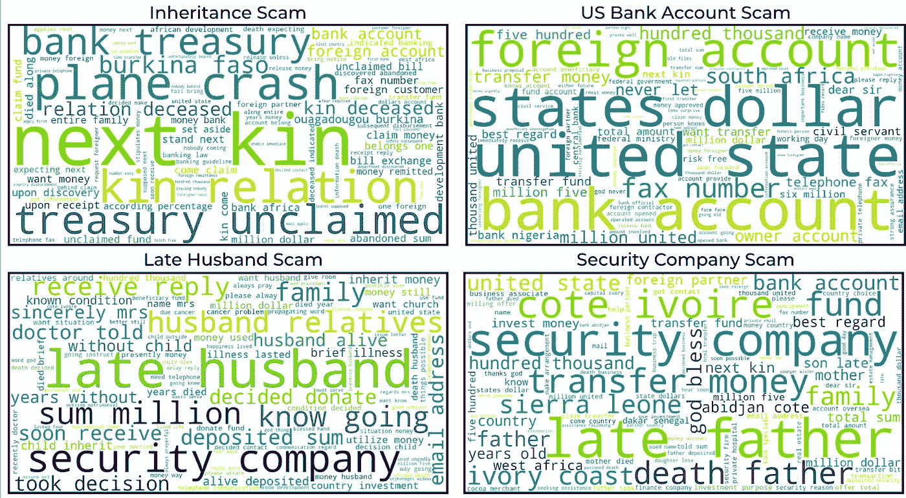

# 使用 Polars 进行快速字符串处理——诈骗邮件数据集

> 原文：[`towardsdatascience.com/fast-string-processing-with-polars-scam-emails-dataset-fcf7054a929a`](https://towardsdatascience.com/fast-string-processing-with-polars-scam-emails-dataset-fcf7054a929a)

## 使用内置的 Polars 字符串表达式在毫秒级别清理、处理和标记文本

[](https://medium.com/@antonsruberts?source=post_page-----fcf7054a929a--------------------------------)[](https://towardsdatascience.com/?source=post_page-----fcf7054a929a--------------------------------) [Antons Tocilins-Ruberts](https://medium.com/@antonsruberts?source=post_page-----fcf7054a929a--------------------------------)

·发布于[Towards Data Science](https://towardsdatascience.com/?source=post_page-----fcf7054a929a--------------------------------) ·10 分钟阅读·2023 年 5 月 28 日

--


图片由[Stephen Phillips - Hostreviews.co.uk](https://unsplash.com/es/@hostreviews?utm_source=medium&utm_medium=referral)提供，来自[Unsplash](https://unsplash.com/?utm_source=medium&utm_medium=referral)

# 引言

随着大型语言模型（LLMs）的广泛采用，我们可能会觉得已经不再需要手动清理和处理文本数据。不幸的是，我和其他 NLP 从业者可以证明，情况并非如此。在每一个 NLP 复杂性的阶段——从基础文本分析到机器学习和 LLMs——都需要干净的文本数据。本文将展示如何使用 Polars 显著加快这一繁琐和乏味的过程。

# Polars

[Polars](https://github.com/pola-rs/polars)是一个极其快速的 Rust 编写的数据框架库，处理字符串非常高效（得益于其 Arrow 后端）。Polars 以`Utf8`格式存储字符串，并使用`Arrow`后端，使得字符串遍历缓存最优且可预测。此外，它在`str`命名空间下暴露了许多内置的字符串操作，这使得字符串操作可以并行处理。这两个因素使得处理字符串变得极其简单和快速。

这个库与 Pandas 有很多相似的语法，但也有很多需要适应的细节。本文将引导你了解字符串操作，但为了全面了解，我强烈推荐这个[“入门指南”](https://pola-rs.github.io/polars-book/getting-started/intro/)，它会给你一个很好的库概览。

# 设置

你可以在这个[GitHub 仓库](https://github.com/aruberts/tutorials/tree/main/metaflow/fraud_email)中找到所有代码，所以如果你想跟着编码，记得拉取它（别忘了⭐）。为了使这篇文章更实用有趣，我将展示如何清理一个小型诈骗电子邮件数据集，该数据集可以在[Kaggle](https://www.kaggle.com/datasets/rtatman/fraudulent-email-corpus)找到（许可证[CC BY-SA 4.0](https://creativecommons.org/licenses/by-sa/4.0/)）。Polars 可以通过 pip 安装——`pip install polars`，推荐的 Python 版本是`3.10`。

# 文本处理管道

这个管道的目标是将原始文本文件解析为一个数据框，以便用于进一步的分析/建模。以下是将要实现的整体步骤：

1.  读取文本数据

1.  提取相关字段（例如，发件人电子邮件、对象、文本等）

1.  从这些字段中提取有用的特征（例如，长度、数字比例等）

1.  预处理文本以进行进一步分析

1.  执行一些基本的文本分析

言归正传，让我们开始吧！

## 读取数据

假设保存了包含电子邮件的文本文件为`fraudulent_emails.txt`，以下是用于读取它们的函数：

```py
def load_emails_txt(path: str, split_str: str = "From r  ") -> list[str]:
    with open(path, "r", encoding="utf-8", errors="ignore") as file:
        text = file.read()

    emails = text.split(split_str)

    return emails
```

如果你查看文本数据，你会发现电子邮件有两个主要部分

+   元数据（以`From r`开头），包含发件人、主题等。

+   电子邮件文本（从`Status: O`或`Status: RO`后开始）

我使用第一个模式将连续的文本文件拆分为电子邮件列表。总体而言，我们应该能够读取 3977 封电子邮件，并将其放入 Polars 数据框中以进行进一步分析。

```py
emails = load_emails_txt("fradulent_emails.txt")
emails_pl = pl.DataFrame({"emails": emails})

print(len(emails))
>>> 3977
```

## 提取相关字段

现在，棘手的部分开始了。我们如何从这堆混乱的文本数据中提取相关字段？不幸的是，答案是正则表达式。

## **发件人和主题**

进一步检查元数据（如下所示）你会发现它有`From:`和`Subject:`字段，这对我们非常有用。

```py
From r  Wed Oct 30 21:41:56 2002
Return-Path: <james_ngola2002@maktoob.com>
X-Sieve: cmu-sieve 2.0
Return-Path: <james_ngola2002@maktoob.com>
Message-Id: <200210310241.g9V2fNm6028281@cs.CU>
From: "MR. JAMES NGOLA." <james_ngola2002@maktoob.com>
Reply-To: james_ngola2002@maktoob.com
To: webmaster@aclweb.org
Date: Thu, 31 Oct 2002 02:38:20 +0000
Subject: URGENT BUSINESS ASSISTANCE AND PARTNERSHIP
X-Mailer: Microsoft Outlook Express 5.00.2919.6900 DM
MIME-Version: 1.0
Content-Type: text/plain; charset="us-ascii"
Content-Transfer-Encoding: 8bit
Status: O
```

如果你继续滚动电子邮件，你会发现`From:`字段有几种格式。你看到的第一个格式是包含姓名和电子邮件的格式。第二种格式仅包含电子邮件，例如`From: 123@abc.com`或`From: “123@abc.com”`。考虑到这一点，我们需要三个正则表达式模式——一个用于主题，两个用于发件人（姓名和电子邮件，以及仅电子邮件）。

```py
email_pattern = r"From:\s*([^<\n\s]+)"
subject_pattern = r"Subject:\s*(.*)"
name_email_pattern = r'From:\s*"?([^"<]+)"?\s*<([^>]+)>'
```

Polars 有一个`str.extract`方法，可以将上述模式与我们的文本进行比较，并（你猜对了）提取匹配的组。以下是如何将其应用于`emails_pl`数据框。

```py
emails_pl = emails_pl.with_columns(
    # Extract the first match group as email
    pl.col("emails").str.extract(name_email_pattern, 1).alias("sender_name"),
    # Extract the second match group as email
    pl.col("emails").str.extract(name_email_pattern, 2).alias("sender_email"),
    # Extract the subject 
    pl.col("emails").str.extract(subject_pattern, 1).alias("subject"),
).with_columns(
    # In cases where we didn't extract email
    pl.when(pl.col("sender_email").is_null())
    # Try another pattern (just email)
    .then(pl.col("emails").str.extract(email_pattern, 1))
    # If we do have an email, do nothing
    .otherwise(pl.col("sender_email"))
    .alias("sender_email")
)
```

如你所见，除了`str.extract`之外，我们还使用了`pl.when().then().otherwise()`表达式（Polars 的 if/else 版本）来处理仅存在于第二个电子邮件模式的情况。如果你打印出结果，你会发现大多数情况下它应该正确地工作（而且速度极快）。我们现在有了`sender_name`、`sender_email`和`subject`字段用于分析。



Polars 数据框样本。作者截图。

## **电子邮件文本**

如上所述，实际的电子邮件文本从 `Status: O`（已打开）或 `Status: RO`（已读并已打开）之后开始，这意味着我们可以利用这个模式将电子邮件拆分为“元数据”和“文本”部分。下面你可以看到提取所需字段的三个步骤以及执行它们的相应 Polars 方法。

1.  将 `Status: RO` 替换为 `Status: O`，以便我们只有一个“拆分”模式 — 使用 `str.replace`

1.  按照 `Status: O` 拆分实际字符串 — 使用 `str.split`

1.  获取结果列表的第二个元素（文本） — 使用 `arr.get(1)`

```py
emails_pl = emails_pl.with_columns(
    # Apply operations to the emails column
    pl.col("emails")
    # Make these two statuses the same
    .str.replace("Status: RO", "Status: O", literal=True)
    # Split using the status string
    .str.split("Status: O")
    # Get the second element
    .arr.get(1)
    # Rename the field
    .alias("email_text")
)
```

看！我们在短短几毫秒内提取了重要字段。让我们将这些功能放到一个连贯的函数中，稍后在管道中使用。

```py
def extract_fields(emails: pl.DataFrame) -> pl.DataFrame:
    email_pattern = r"From:\s*([^<\n\s]+)"
    subject_pattern = r"Subject:\s*(.*)"
    name_email_pattern = r'From:\s*"?([^"<]+)"?\s*<([^>]+)>'

    emails = (
        emails.with_columns(
            pl.col("emails").str.extract(name_email_pattern, 2).alias("sender_email"),
            pl.col("emails").str.extract(name_email_pattern, 1).alias("sender_name"),
            pl.col("emails").str.extract(subject_pattern, 1).alias("subject"),
        )
        .with_columns(
            pl.when(pl.col("sender_email").is_null())
            .then(pl.col("emails").str.extract(email_pattern, 1))
            .otherwise(pl.col("sender_email"))
            .alias("sender_email")
        )
        .with_columns(
            pl.col("emails")
            .str.replace("Status: RO", "Status: O", literal=True)
            .str.split("Status: O")
            .arr.get(1)
            .alias("email_text")
        )
    )

    return emails
```

现在，我们可以继续进行特征生成部分。

## 特征工程

根据个人经验，诈骗电子邮件往往非常详细且长（因为骗子试图赢得你的信任），所以电子邮件的字符长度会非常有信息量。此外，它们大量使用感叹号和数字，因此计算电子邮件中非字符的比例也可能很有用。最后，骗子喜欢使用大写字母，所以我们也来计算大写字母的比例。当然，我们还可以创建更多的特征，但为了不让这篇文章过长，我们就专注于这两个特征。

第一个特征可以通过内置的 `str.n_chars()` 函数非常容易地创建。其他两个特征可以使用正则表达式和 `str.count_match()` 计算。下面你可以找到计算这三个特征的函数。与之前的函数类似，它使用 `with_columns()` 子句来保留旧特征并在其上创建新的特征。

```py
def email_features(data: pl.DataFrame, col: str) -> pl.DataFrame:
    data = data.with_columns(
        pl.col(col).str.n_chars().alias(f"{col}_length"),
    ).with_columns(
        (pl.col(col).str.count_match(r"[A-Z]") / pl.col(f"{col}_length")).alias(
            f"{col}_percent_capital"
        ),
        (pl.col(col).str.count_match(r"[^A-Za-z ]") / pl.col(f"{col}_length")).alias(
            f"{col}_percent_digits"
        ),
    )

    return data
```

## 文本清理

如果你打印出我们提取的一些电子邮件，你会注意到一些需要清理的内容。例如：

+   一些电子邮件中仍然存在 HTML 标签

+   使用了很多非字母字符

+   一些电子邮件是大写字母，一些是小写字母，还有一些是混合的

与上述相同，我们将使用正则表达式来清理数据。然而，现在选择的方法是 `str.replace_all`，因为我们想要替换所有匹配的实例，而不仅仅是第一个。此外，我们将使用 `str.to_lowercase()` 将所有文本转换为小写。

```py
emails_pl = emails_pl.with_columns(
    # Apply operations to the emails text column
    pl.col("email_text")
    # Remove all the data in <..> (HTML tags)
    .str.replace_all(r"<.*?>", "")
    # Replace non-alphabetic characters (except whitespace) in text
    .str.replace_all(r"[^a-zA-Z\s]+", " ")
    # Replace multiple whitespaces with one whitespace 
    # We need to do this because of the previous cleaning step
    .str.replace_all(r"\s+", " ")
    # Make all text lowercase
    .str.to_lowercase()
    # Keep the field's name
    .keep_name()
)
```

现在，让我们将这串操作重构成一个函数，以便它可以应用于其他感兴趣的列。

```py
def email_clean(
    data: pl.DataFrame, col: str, new_col_name: str | None = None
) -> pl.DataFrame:
    data = data.with_columns(
        pl.col(col)
        .str.replace_all(r"<.*?>", " ")
        .str.replace_all(r"[^a-zA-Z\s]+", " ")
        .str.replace_all(r"\s+", " ")
        .str.to_lowercase()
        .alias(new_col_name if new_col_name is not None else col)
    )

    return data
```

## 文本标记化

作为预处理管道的最后一步，我们将对文本进行标记化。标记化将使用已经熟悉的方法 `str.split()`，其中分隔符将指定为空格。

```py
emails_pl = emails_pl.with_columns(
  pl.col("email_text").str.split(" ").alias("email_text_tokenised")
)
```

再次，将这段代码放入一个函数中，以便在最终的管道中使用。

```py
def tokenise_text(data: pl.DataFrame, col: str, split_token: str = " ") -> pl.DataFrame:
    data = data.with_columns(pl.col(col).str.split(split_token).alias(f"{col}_tokenised"))

return data
```

## 去除停用词

如果你以前处理过文本数据，你会知道去除停用词是处理标记化文本的关键步骤。去除这些词可以让我们将分析集中在文本的重要部分。

为了删除这些词，我们首先需要定义它们。在这里，我将使用来自`nltk`库的默认停用词集以及一组与 HTML 相关的词汇。

```py
stops = set(
    stopwords.words("english")
    + ["", "nbsp", "content", "type", "text", "charset", "iso", "qzsoft"]
)
```

现在，我们需要找出这些词是否存在于分词数组中，如果存在，我们需要将它们删除。为此，我们需要使用`arr.eval`方法，因为它允许我们对分词列表的每个元素运行 Polars 表达式（例如 `.is_in`）。确保阅读下面的评论以理解每一行的作用，因为这部分代码比较复杂。

```py
emails_pl = emails_pl.with_columns(
    # Apply to the tokenised column (it's a list)
    pl.col("email_text_tokenised")
    # For every element, check if it's not in a stopwords list and only then return it
    .arr.eval(
            pl.when(
                (~pl.element().is_in(stopwords)) & (pl.element().str.n_chars() > 2)
            ).then(pl.element())
        )
    # For every element of a new list, drop nulls (previously items that were in stopwords list)
    .arr.eval(pl.element().drop_nulls())
    .keep_name()
)
```

和往常一样，让我们将这段代码重构为一个函数，用于我们的最终管道。

```py
def remove_stopwords(
    data: pl.DataFrame, stopwords: set | list, col: str
) -> pl.DataFrame:
    data = data.with_columns(
        pl.col(col)
        .arr.eval(pl.when(~pl.element().is_in(stopwords)).then(pl.element()))
        .arr.eval(pl.element().drop_nulls())
    )
    return data
```

虽然这个模式可能看起来相当复杂，但使用预定义的`str`和`arr`表达式来优化性能是非常值得的。

## **完整管道**

到目前为止，我们已经定义了预处理函数，并了解了它们如何应用于单个列。Polars 提供了一个非常实用的`pipe`方法，允许我们将指定为函数的 Polars 操作串联起来。这就是最终管道的样子：

```py
emails = load_emails_txt("fradulent_emails.txt")
emails_pl = pl.DataFrame({"emails": emails})

emails_pl = (
    emails_pl.pipe(extract_fields)
    .pipe(email_features, "email_text")
    .pipe(email_features, "sender_email")
    .pipe(email_features, "subject")
    .pipe(email_clean, "email_text")
    .pipe(email_clean, "sender_name")
    .pipe(email_clean, "subject")
    .pipe(tokenise_text, "email_text")
    .pipe(tokenise_text, "subject")
    .pipe(remove_stopwords, stops, "email_text_tokenised")
    .pipe(remove_stopwords, stops, "subject_tokenised")
)
```

注意，现在我们可以轻松地将所有特征工程、清理和分词函数应用于所有提取的列，而不仅仅是像上面示例中的电子邮件文本。

# 词云分析

如果你已经做到这一点——干得好！我们已经读取、清洗、处理、分词，并对大约 4k 文本记录进行了基本特征工程，全部在一秒钟内（至少在我的 Mac M2 机器上）。现在，让我们享受劳动的成果，进行一些基本的文本分析。

首先，让我们看看电子邮件文本的词云，并惊叹于我们能找到的所有有趣的东西。

```py
# Word cloud function
def generate_word_cloud(text: str):
    wordcloud = WordCloud(
        max_words=100, background_color="white", width=1600, height=800
    ).generate(text)

    plt.figure(figsize=(20, 10), facecolor="k")
    plt.imshow(wordcloud)
    plt.axis("off")
    plt.tight_layout(pad=0)
    plt.show()

# Prepare data for word cloud
text_list = emails_pl.select(pl.col("email_text_tokenised").arr.join(" "))[
    "email_text_tokenised"
].to_list()
all_emails = " ".join(text_list)

generate_word_cloud(all_emails)
```



电子邮件文本词云。由作者生成。

银行账户、近亲、保安公司和逝者亲属——应有尽有。让我们看看这些在使用简单 TF-IDF 和 K-Means 创建的文本聚类中的样子。

```py
# TF-IDF with 500 words
vectorizer = TfidfVectorizer(max_features=500)
transformed_text = vectorizer.fit_transform(text_list)
tf_idf = pd.DataFrame(transformed_text.toarray(), columns=vectorizer.get_feature_names_out())

# Cluster into 5 clusters
n = 5
cluster = KMeans(n_clusters=n, n_init='auto')
clusters = cluster.fit_predict(tf_idf)

for c in range(n):
    cluster_texts = np.array(text_list)[clusters==c]
    cluster_text = ' '.join(list(cluster_texts))

    generate_word_cloud(cluster_text)
```

下面你可以看到我识别的一些有趣的聚类：



除此之外，我还发现了一些无意义的聚类，这意味着在文本清理方面仍有改进空间。不过，看起来我们成功地提取了有用的聚类，所以我们可以称之为成功。告诉我你发现了哪些聚类！

# 结论

这篇文章涵盖了 Polars 库允许你执行的各种预处理和清理操作。我们已经看到如何使用 Polars 来：

+   从文本中提取特定模式

+   根据标记将文本拆分为列表

+   计算文本中的长度和匹配数量

+   使用正则表达式清理文本

+   对文本进行分词并过滤停用词

我希望这篇文章对你有用，你会在下一个 NLP 项目中给 Polars 一个机会。请考虑订阅、点赞并在下面评论。

## 还不是 Medium 会员？

[](https://medium.com/@antonsruberts/membership?source=post_page-----fcf7054a929a--------------------------------) [## 使用我的推荐链接加入 Medium — Antons Tocilins-Ruberts

### 阅读 Antons Tocilins-Ruberts 和其他成千上万的作者在 Medium 上的每一个故事。你的会员费用直接…

medium.com](https://medium.com/@antonsruberts/membership?source=post_page-----fcf7054a929a--------------------------------)

# 参考文献

> *Radev, D. (2008), CLAIR collection of fraud email, ACL 数据和代码库, ADCR2008T001,* [*http://aclweb.org/aclwiki*](http://aclweb.org/aclwiki)
> 
> *项目 Github* [`github.com/aruberts/tutorials/tree/main/metaflow/fraud_email`](https://github.com/aruberts/tutorials/tree/main/metaflow/fraud_email)
> 
> *Polars 用户指南* [`pola-rs.github.io/polars-book/user-guide/`](https://pola-rs.github.io/polars-book/user-guide/)
