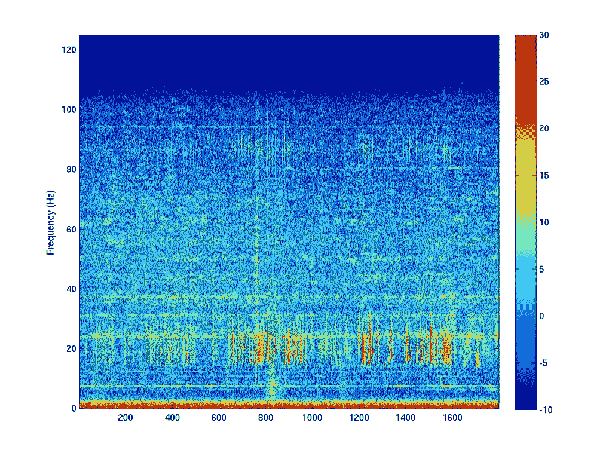
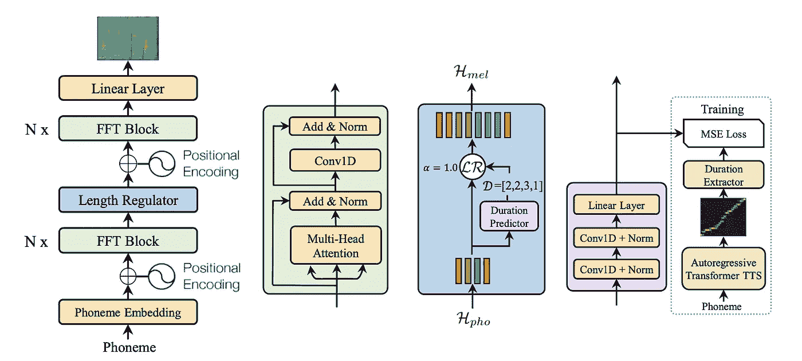
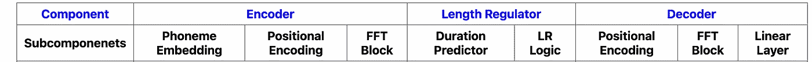
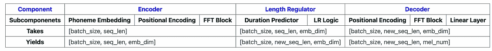
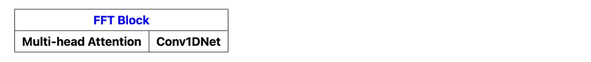
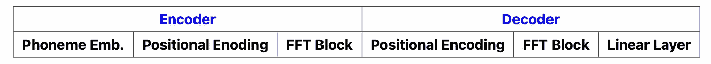
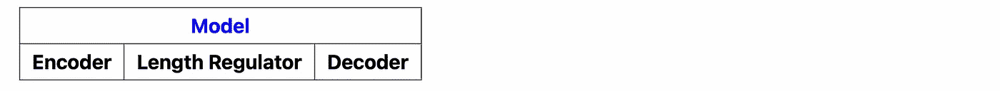

# FastSpeech：论文概述与实现

> 原文：[`towardsdatascience.com/fastspeech-paper-overview-implementation-e2b3808648f1?source=collection_archive---------7-----------------------#2023-11-09`](https://towardsdatascience.com/fastspeech-paper-overview-implementation-e2b3808648f1?source=collection_archive---------7-----------------------#2023-11-09)

## 了解文本到语音的实现方式以及其如何通过变压器（transformers）来实现

 [Essam Wisam](https://essamwissam.medium.com/?source=post_page-----e2b3808648f1--------------------------------)

·

[关注](https://medium.com/m/signin?actionUrl=https%3A%2F%2Fmedium.com%2F_%2Fsubscribe%2Fuser%2Fccb82b9f3b87&operation=register&redirect=https%3A%2F%2Ftowardsdatascience.com%2Ffastspeech-paper-overview-implementation-e2b3808648f1&user=Essam+Wisam&userId=ccb82b9f3b87&source=post_page-ccb82b9f3b87----e2b3808648f1---------------------post_header-----------) 发表在 [Towards Data Science](https://towardsdatascience.com/?source=post_page-----e2b3808648f1--------------------------------) · 9 分钟阅读 · 2023 年 11 月 9 日

--

2019 年，FastSpeech 在神经文本到语音（neural text-to-speech）领域推动了前沿技术，通过显著提高推理速度，同时保持鲁棒性以防止单词重复或遗漏。它还允许在语音和韵律方面对输出语音进行控制。

在这个故事中，我们旨在让你熟悉变压器（transformers）如何用于文本到语音的转换，提供 FastSpeech 论文的简明概述，并指导你如何从零实现它。在此过程中，我们假设你对变压器及其不同组件已经有一定了解。如果没有，我们强烈推荐你先阅读[前一篇文章](https://medium.com/@essamwissam/a-systematic-explanation-of-transformers-db82e039b913)，该文深入探讨了这一主题。

梵高风格的画作，描绘了一个变压器在讲台上对着麦克风讲话——由作者使用 Canva 生成

## 目录

· 背景

∘ 介绍

∘ 梅尔频谱图

· 论文概述

∘ 介绍

∘ 实验和结果

∘ 架构

∘ 编码器

∘ 长度调节器

∘ 解码器

· 实现

∘ 策略

∘ 完整实现

# 背景

## 介绍

传统的文本到语音（TTS）模型依赖于拼接和统计技术。拼接技术通过将来自语音音素数据库（语言中的独立声音单元）的声音拼接起来合成语音。统计技术（例如 HMM）试图建模足够生成波形的语音基本属性。这两种方法通常在生成自然声音或表达情感时存在问题。换句话说，它们往往为给定文本生成不自然或机械的语音。

使用深度学习（神经网络）来进行 TTS 显著提升了语音质量。这些方法通常由两个主要模型组成：第一个模型接收文本并输出相应的梅尔频谱图，第二个模型接收梅尔频谱图并合成语音（称为声码器）。

## 梅尔频谱图

频谱图由 [Flickr](https://www.flickr.com/photos/ctbto/13465848765) 上的官方 CTBTO 照片流提供 CC BY-SA 2.0。

在最基本的形式下，语音波形只是代表空气压力随时间变化的幅度序列。我们可以使用短时傅里叶变换（STFT）将任何波形转换为相应的梅尔频谱图（这是一个矩阵，表示原始波形不同时间窗口中不同频率的幅度）。使用短时傅里叶变换将一段音频映射到其梅尔频谱图很容易；然而，反向操作相当困难，最佳系统方法（例如，Griffin Lim）可能会产生粗糙的结果。一个更好的方法是为这个任务训练一个模型。现有的训练此任务的模型包括 WaveGlow 和 WaveNet。

因此，重申一下，深度学习方法通常通过训练模型来预测与许多文本实例对应的语音梅尔频谱图来处理文本到语音。然后，它依赖另一个模型（称为声码器）将预测的频谱图映射到音频。FastSpeech 使用了 Nvidia 的 [WaveGlow](https://github.com/NVIDIA/waveglow) 模型。

一个快乐的变压器在写研究论文，画作呈现梵高风格。——由作者使用 Canva 生成

# 论文概述

## 介绍

尽管基于变压器的最新 TTS 方法在语音质量上相比传统方法有了显著提升，但这些模型仍然存在三个主要问题：

+   由于变换器的解码器是自回归的，因此它们在推理语音时速度较慢。也就是说，它们依赖于先前生成的块，逐步生成 Mel 频谱图。这同样适用于基于 RNN 和 CNN 的旧深度学习模型。

+   它们不够鲁棒；由于注意力分数（即对齐）的微小错误在顺序生成过程中传播，可能会发生词语跳过或重复现象。

+   他们缺乏一种简单的方法来控制生成语音的特性，例如速度或韵律（如语调）。

FastSpeech 尝试解决所有三个问题。与其他变换器架构相比，它的两个关键差异是：

+   解码器是非自回归的；它是完全可以并行处理的，因此解决了速度问题。

+   它在解码器之前使用了一个长度调节组件，试图确保音素和 Mel 频谱图之间的理想对齐，并移除了交叉注意力组件。

+   长度调节器的操作方式允许通过超参数轻松控制语音速度。韵律的微小属性，如暂停时长，也可以以类似的方式进行控制。

+   作为回报，出于长度调节的目的，它在训练过程中使用了序列级知识蒸馏。换句话说，它依赖于另一个已经训练好的文本到语音模型进行训练（Transformer TTS 模型）。

## 实验与结果

作者使用了 LJSpeech 数据集，该数据集包括约 24 小时的音频，分布在 13100 个音频片段中（每个片段都有相应的输入文本）。训练任务是输入文本并让模型预测相应的频谱图。约 95.6% 的数据用于训练，其余部分被拆分用于验证和测试。

+   **推理速度提升** 相比于自回归变换器 TTS 模型，它将推理速度提高了 38 倍（不包括声码器则为 270 倍）；因此，得名 FastSpeech。

+   **音频质量** 利用 20 位母语为英语的评分者的平均意见分数，作者展示了 FastSpeech 的质量与 Transformer TTS 模型和 Tacotron 2（当时的最先进技术）非常接近。

+   **鲁棒性** FastSpeech 在 50 个具有挑战性的文本到语音示例中，表现优于 Transformer TTS 和 Tacotron 2，具有零错误率（以跳过和重复为标准），相比之下 Transformer TTS 和 Tacotron 2 的错误率分别为 24% 和 34%。

+   **可控性** 作者展示了速度和暂停时长控制的有效性。

+   **消融实验** 作者确认了集成 1D 卷积到变换器中和采用序列级知识蒸馏等决策的有效性。他们揭示了在缺少每项决策时，性能（以平均意见分数为标准）的下降。

## 架构

FastSpeech 架构图来自于 [FastSpeech](https://arxiv.org/abs/1905.09263) 论文

第一图描绘了整个架构，包括编码器、长度调节器和解码器：

Feedforward Transformer (FFT)块在编码器和解码器中都使用。它类似于变换器中的编码器层，但将位置依赖的 FFN 替换为 1D 卷积。一个超参数*N*代表编码器和解码器中连接顺序的 FFT 块的数量。论文中将 N 设为 6。

长度调节器根据持续时间预测器（第三图）调整输入序列的长度。持续时间预测器是一个简单的网络，如第四图所示。

你应该能够直观地感受到数据流的形式如下：

## 编码器

编码器接受对应于文本中的字符的整数序列。可以使用字形到音素的转换器将文本转换为音素字符序列，如论文中提到的；但我们将简单地使用字母作为字符单元，并假设模型在训练期间可以学习任何需要的音素表示。因此，对于输入“Say hello!”，编码器接受一个序列 10 个整数，对应于`[“S”,”a”,”y”,…,”!”]`。

与变换器编码器类似，编码器的目的是为每个字符分配一个丰富的向量表示，该表示考虑了字符本身、其顺序以及与给定文本中其他字符的关系。与变换器类似，它在编码器中保持分配向量的维度用于 Add & Norm 目的。

对于具有*n*个字符的输入序列，编码器输出*[h₁,h₂,…,hₙ]*，其中每个表示的维度为`emb_dim`。

## 长度调节器

长度调节器的目的只是重复给定给每个字符的编码器表示。其理念是文本中每个字符的发音通常对应于多个（或零个）Mel 谱图单元（由解码器生成）；而不仅仅是一个声音单元。Mel 谱图单元指的是 Mel 谱图中的一列，为该列对应的时间窗口分配声音的频率分布，并对应于波形中的实际声音。

长度调节器的操作如下：

1.  预测每个字符的 Mel 谱图单元的数量。

1.  根据该数量重复编码器的表示。

例如，给定输入字符的编码器表示*[h₁, h₂, h₃, h₄, h*₅*]* 对应于*“knight”*。推理时会发生以下情况：

1.  长度调节器将每个表示传递给持续时间预测器，后者利用表示（涉及与文本中所有其他字符的关系）来预测一个整数，该整数表示对应字符的 Mel 谱图数量。

1.  假设持续时间预测器返回[ 1, 2, 3, 2, 1]，那么长度调节器根据预测的持续时间重复每个隐藏状态，得到*[h₁, h₂, h₂, h₃, h₃, h₃, h₄, h₄, h₅]*。现在我们知道序列的长度（10）就是 Mel 频谱图的长度。

1.  它将这个新序列传递给解码器。

注意，在真实环境中，将`knight`传递给 FastSpeech 并检查持续时间预测器的输出得到了`[ 1, 8, 15, 3, 0, 17]`。注意，字母`k`，`g`，`h`相比其他字母对 Mel 频谱图的贡献微不足道。事实上，当发音时真正发音的主要是`n`，`i`，`t`。

**可控性** 通过缩放预测的持续时间可以轻松控制速度。例如，如果`[ 1, 8, 15, 3, 0, 17]`加倍，则说单词`knight`将需要两倍的时间（*0.5x*加速），如果将其乘以一半（然后四舍五入），则说单词将需要一半的时间（*2x*加速）。还可以仅更改特定字符（例如，空格）对应的持续时间，以控制其发音的持续时间（例如，停顿持续时间）。

**训练**

在训练中，FastSpeech 不使用持续时间预测器来预测持续时间（它没有被训练），而是使用训练过的 TTS 变压器的注意力矩阵来预测持续时间。

+   在那个变压器中的交叉注意力将每个字符和 Mel 频谱图单元与一个注意力分数关联起来，通过注意力矩阵。

+   因此，在 FastSpeech 的训练中，为了预测字符*c*的 Mel 频谱图单元（持续时间），它使用 TTS 变压器中的交叉注意力矩阵计算对该字符的最大关注度的 Mel 频谱图单元数量。

+   因为交叉注意力涉及多个注意力矩阵（每个头一个），它在最“对角线”的注意力矩阵上执行此操作。这可能确保字符和 Mel 频谱图单元之间的现实对齐。

+   它使用这个持续时间来训练持续时间预测器（简单的回归任务）。这样在推理期间就不需要这个教师模型了。

## 解码器

解码器接收这个新表示，并且旨在预测每个 Mel 频谱图单元的频率内容（向量）。这相当于预测文本对应的整个频谱图，可以使用声码器转换为音频。

解码器与编码器具有类似的架构。它只是用线性层替换第一个块（嵌入层）作为最后一个块。这一层使用早期解码器中形成的复杂特征表示为每个 Mel 频谱图单元生成频率向量。

频率`n_mels`是该层的一个超参数。在论文中设置为`80`。

一位现代未来感的变压器正在编程计算机，画风为梵高风格 —— 作者使用 Canva 生成

# 实现

FastSpeech 架构图来自[FastSpeech](https://arxiv.org/abs/1905.09263)论文

## 策略

FastSpeech 架构对应于

我们将从实现开始：

和

然后我们可以实现编码器和解码器，因为它们的组合是

现在我们需要的是长度调节器

因为一旦完成最后一步就是

## 完整实现

为了避免在本文中插入大量代码，我之前准备了一个带注释的笔记本，包含了一个经过组织、优化和适合学习的[原始实现](https://github.com/xcmyz/FastSpeech)版本，供推断使用。你可以在[Github](https://github.com/TheBotiverse/Botiverse/blob/main/botiverse/models/FastSpeech1/FastSpeech.ipynb)或者[Google Colab](https://colab.research.google.com/github/TheBotiverse/Botiverse/blob/main/botiverse/models/FastSpeech1/FastSpeech.ipynb#scrollTo=mbfHmqAlLc8W)找到它。强烈建议你在开始实现之前了解[Transformer 架构](https://medium.com/@essamwissam/a-systematic-explanation-of-transformers-db82e039b913)中的不同组件。

一架现代未来感喷气式飞机飞向星空，画风为梵高风格 —— 作者使用 Canva 生成

我希望这篇文章中的解释能帮助你更好地理解 FastSpeech 及其架构，并指导你如何从零开始实现它。下次见，再见。
