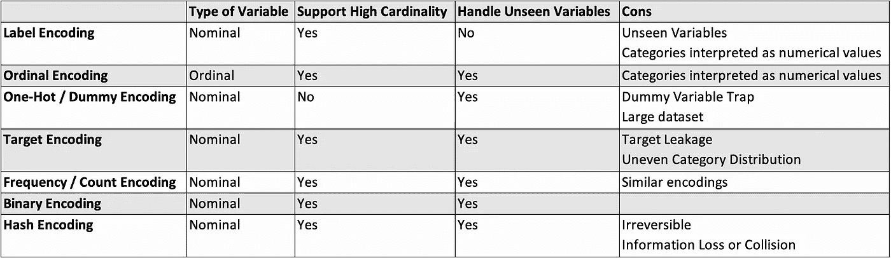

# 机器学习中的特征编码技术及 Python 实现

> 原文：[`towardsdatascience.com/feature-encoding-techniques-in-machine-learning-with-python-implementation-dbf933e64aa?source=collection_archive---------8-----------------------#2023-01-10`](https://towardsdatascience.com/feature-encoding-techniques-in-machine-learning-with-python-implementation-dbf933e64aa?source=collection_archive---------8-----------------------#2023-01-10)

## 6 种需要考虑的特征编码技术，用于你的数据科学工作流程

 [凯·简·黄](https://kayjanwong.medium.com/?source=post_page-----dbf933e64aa--------------------------------)

·

[关注](https://medium.com/m/signin?actionUrl=https%3A%2F%2Fmedium.com%2F_%2Fsubscribe%2Fuser%2Ffee8693930fb&operation=register&redirect=https%3A%2F%2Ftowardsdatascience.com%2Ffeature-encoding-techniques-in-machine-learning-with-python-implementation-dbf933e64aa&user=Kay+Jan+Wong&userId=fee8693930fb&source=post_page-fee8693930fb----dbf933e64aa---------------------post_header-----------) 发布于 [面向数据科学](https://towardsdatascience.com/?source=post_page-----dbf933e64aa--------------------------------) · 10 分钟阅读 · 2023 年 1 月 10 日

--

图片由 [苏珊·霍尔特·辛普森](https://unsplash.com/@shs521?utm_source=medium&utm_medium=referral) 提供，来自 [Unsplash](https://unsplash.com/?utm_source=medium&utm_medium=referral)

***特征编码*** 是将分类变量转换为数值变量的特征工程步骤的一部分，以使数据与机器学习模型兼容。根据分类变量的类型和其他考虑因素，有多种方法可以执行特征编码。

本文介绍了一般特征编码的技巧，详细阐述了在数据科学工作流程中可以考虑的 6 种特征编码技术，包括何时使用它们的评论，最后讲解如何在 Python 中实现这些技术。

图 1：特征编码技术总结 — 作者图片

图 1 中总结了 6 种特征编码技术的备忘单；请继续阅读详细说明和每种方法的实现。

# 目录

1.  标签 / 顺序编码

1.  一热 / 哑变量编码

1.  目标编码

1.  计数 / 频率编码

1.  二进制 / BaseN 编码
