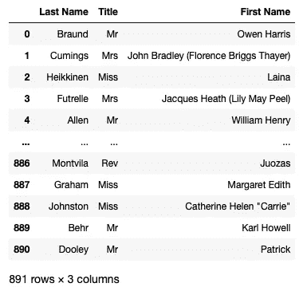

# 在 Pandas DataFrame 中使用正则表达式 (RegEx) 进行特征工程

> 原文：[`towardsdatascience.com/feature-engineering-using-regular-expression-regex-in-pandas-dataframe-c965380316da`](https://towardsdatascience.com/feature-engineering-using-regular-expression-regex-in-pandas-dataframe-c965380316da)

## 发现如何轻松地使用正则表达式操作你的字符串列

[](https://weimenglee.medium.com/?source=post_page-----c965380316da--------------------------------)[](https://towardsdatascience.com/?source=post_page-----c965380316da--------------------------------) [魏孟李](https://weimenglee.medium.com/?source=post_page-----c965380316da--------------------------------)

·发表于 [Towards Data Science](https://towardsdatascience.com/?source=post_page-----c965380316da--------------------------------) ·阅读时间 13 分钟·2023 年 1 月 6 日

--


图片由 [Clark Van Der Beken](https://unsplash.com/@snapsbyclark?utm_source=medium&utm_medium=referral) 提供，来源于 [Unsplash](https://unsplash.com/?utm_source=medium&utm_medium=referral)

在 Pandas 中操作字符串列是数据工程师最常见的操作之一。大多数情况下，你会进行如拆分列、从列中提取关键信息等操作。这个任务通常被称为*特征工程*。在这篇文章中，我将带你了解一些你可以利用*正则表达式*的特征工程技巧。

**正则表达式**（通常称为**regex**或**regexp**）是一种字符序列，指定了文本中的搜索模式。正则表达式功能强大，但对初学者来说也可能令人畏惧。因此，在这篇文章中，我将提供一个温和的正则表达式入门介绍，帮助你入门。

# 我们的数据集

像往常一样，我喜欢使用的示例数据集是 Titanic 数据集。它包含几个字符串列，非常适合进行特征工程。

> ***数据来源****: 本文的数据来源于* [*https://www.kaggle.com/datasets/tedllh/titanic-train*](https://www.kaggle.com/datasets/tedllh/titanic-train)*.*
> 
> ***许可证——*** *数据库内容许可证 (DbCL) v1.0* [*https://opendatacommons.org/licenses/dbcl/1-0/*](https://opendatacommons.org/licenses/dbcl/1-0/)

让我们加载 Titanic 数据集并检查其各种行和列：

```py
import pandas as pd
import numpy as np

df = pd.read_csv('titanic_train.csv')
df
```

具体来说，我将使用**姓名**和**船舱**列来进行特征工程：


> 本文中的所有图片均由作者创建。

# 正则表达式基础

在我们开始对 Titanic 数据集进行特征工程之前，了解正则表达式的基础并学习如何在 Python 中使用它将非常有用。

要在 Python 中使用正则表达式，请导入`re`包：

```py
import re
```

在接下来的部分中，我将说明如何使用正则表达式来完成以下操作：

+   如何在字符串中搜索子字符串

+   如何基于特定大小写搜索字符串

+   如何使用锚点来搜索字符串的开始或结束

+   如何搜索具有特定模式的字符串

+   如何搜索具有重复模式的字符串

## 搜索字符串

假设你想在字符串“Allen, Mr. William Henry”中搜索单词“William”。你可以使用`search()`函数（来自`re`包），传入要搜索的单词和要搜索的字符串：

```py
expression = 'William'
name_search = re.search(expression, "Allen, Mr. William Henry")
print(name_search)
```

`search()`函数返回一个包含搜索信息和结果的`Match`对象：

```py
<re.Match object; span=(11, 18), match='William'>
```

在上面的输出中，你可以看到“William”从字符串的第 11 到 17 的索引处找到了匹配（不包括 18）。如果没有匹配，`None`将被返回。

你可以使用`Match`对象的`group()`函数获取匹配你搜索的单词：

```py
if name_search:
    # returns the part of the string where there was a match
    print(name_search.group())
    # William
```

> 我将在后面的部分更详细地解释**分组**的概念。

你可以使用`Match`对象的`group()`函数来指定匹配你搜索的组：

```py
print(name_search.group(0)) # same as group()
```

上述语句都产生相同的输出：

```py
William
```

## 基于不同大小写的字符串搜索

有时候你想根据特定的大小写搜索单词。例如，如果你想查找“William”或“william”，你可以使用`[]`结构来表示匹配单个字符。例如，以下表达式查找“W”或“w”，后跟“illiam”：

```py
expression = '[Ww]illiam'       # either W or w, followed by "illiam"
name_search = re.search(expression, "Allen, Mr. william Henry")
if name_search:
    print(name_search.group())    
    # william
```

如果你想匹配不考虑大小写的单词，请使用`(?i)`修饰符：

```py
expression = '(?i)william'          # case insensitive search
name_search = re.search(expression, "Allen, Mr. WILLIAM Henry")
if name_search:
    print(name_search.group())    
    # WILLIAM
```

## 搜索字符串的开始或结束

在正则表达式中，你可以使用锚点 — `$`和`^`，来指定你想匹配的字符串位置。例如，如果你想查找以“Henry”结尾的字符串，可以在表达式中使用`$`锚点：

```py
expression = 'Henry$'               # ends with Henry 
name_search = re.search(expression, "Allen, Mr. William Henry")
if name_search:
    print(name_search.group())
    # Henry
```

同样，如果你想查找以“Allen”开头的字符串，可以在表达式中使用`^`锚点：

```py
expression = '^Allen'               # starts with Allen
name_search = re.search(expression, "Allen, Mr. William Henry")
if name_search:
    print(name_search.group())
    # Allen
```

## 搜索模式

假设我们有这样的字符串：“Allen, Mr. William Henry”。我们希望从句子中提取标题——“Mr”。根据标题的位置，我们可以看到以下模式：

+   标题前有一个空格

+   标题以句点结束

使用这些，我们可以创建以下表达式：

```py
expression = ' ([A-Za-z]+)\.'
name_search = re.search(expression, "Allen, Mr. William Henry")
print(name_search)
if name_search:
    print(name_search.group(0))   # group zero is everything that matches the pattern
    print(name_search.group(1))   # group 1 is the first ()
```

上述表达式需要一些解释。

+   首先，有一个空格表示我们需要找到标题前面的起始空格。

+   接下来，我们有一对括号表示一个组。在这个组内，我们有`[]`表示我们想匹配从“A”到“Z”或从“a”到“z”的任何字符，`+`字符表示我们想匹配一个或多个这样的字符。

+   `.`（句点）是正则表达式中的一个特殊字符，它匹配任何字符，除了换行符（`\n`）。所以如果我们想在字符串中匹配一个句点，我们需要使用 `\`（转义字符）来取消 `.` 的特殊含义。

以下图形总结了上述描述：


`name_search.group(0)` 的第一个输出是（注意 `Mr.` 前的空格）：

```py
 Mr.
```

这个输出包含你表达式的匹配项—— `‘ ([A-Za-z]+)\.’`。第二个输出是：

```py
Mr
```

这个输出是你表达式中第一个组的结果（因为只有一个组）—— `([A-Za-z]+)`。因此，输出中不包含句点。

由于在你的表达式中只有一个组，如果你尝试访问结果中的第二个组，你会遇到错误：

```py
 print(name_search.group(2))
    # IndexError: no such group
```

那么，如果我们在表达式中有多个组呢？

假设我们有一个包含两个称谓的名字的字符串（我知道这个例子有点牵强），我们想在这个字符串中找到这两个称谓。我们可以使用以下表达式来实现：

```py
expression = ' ([A-Za-z]+)\. ([A-Za-z]+)\.'
titles_search = re.search(expression, "Allen, Dr. Mr. William Henry")
if titles_search:
    print(titles_search.group(0))   #  Dr. Mr.
    print(titles_search.group(1))   # Dr
    print(titles_search.group(2))   # Mr
```

以下图形解释了每个组的输出：


## 基于重复模式的提取

有时候你只是想提取重复模式。例如，假设你有一个包含不同称谓的字符串，如 `‘Mrs. Mr. Ms. Dr.’`。要提取这个字符串中的所有称谓，你可以使用 `findall()` 函数，如下所示：

```py
# returns a list of non-overlapping matches
titles_search = re.findall('([A-Za-z]+)\.', "Mrs. Mr. Ms. Dr.")
print(titles_search)
```

结果将是一个非重叠匹配的列表。在这种情况下，输出是：

```py
['Mrs', 'Mr', 'Ms', 'Dr']
```

# 在 Pandas Series str() 函数中使用正则表达式

既然你已经对正则表达式有了一些了解，现在是时候看看如何在 Pandas 中使用正则表达式了。Pandas Series 的向量化字符串函数（`Series.str()`）中的以下方法允许你使用正则表达式：

+   `count()`

+   `extract()`

+   `match()`

+   `contains()`

+   `replace()`

+   `findall()`

+   `split()`

让我们通过示例来逐一讲解这些函数。

## 使用 `count()` 函数

让我们从 `count()` 函数开始。假设你想找到 Titanic 数据集中所有名字以“Braund”开头并包含“Owen”的人。你可以使用以下表达式在 `count()` 函数中实现：

```py
expression = '^Braund.+Owen' 
print(df['Name'].str.count(expression))
```

> 这里是正则表达式中各种特殊字符的用法：
> 
> `^` 字符串或行的开头
> 
> `.` 匹配除了换行符之外的任何单个字符。
> 
> `+` 1 次或更多次出现
> 
> `*` 0 次或更多次出现

你将看到结果作为一个 Series，对于每个与表达式匹配的行，值为 1：

```py
**0      1**
1      0
2      0
3      0
4      0
      ..
886    0
887    0
888    0
889    0
890    0
Name: Name, Length: 891, dtype: int64
```

如果你想计算与搜索表达式匹配的总行数，你可以使用 `sum()` 函数：

```py
print(df['Name'].str.count(expression).sum())
# 1
```

要显示与表达式匹配的行，你可以将结果传入原始数据框：

```py
display(df[df['Name'].str.count(expression) == 1])
```

以下图形显示了与表达式匹配的行：


注意表达式`‘^Braund.+Owen’`中的`+`。在这种情况下，它意味着 Braund 和 Owen 之间必须至少有一个字符。例如，“Braund,Owen”或“Braund Owen”。如果你想匹配像“BraundOwen”这样的名字，那么你的表达式应该使用`*`：

```py
expression = '^Braund.*Owen'
```

如果你只想找到包含“William”一词的所有名字，只需将表达式设置为“William”，如下所示：

```py
expression = 'William'
```


以下陈述显示了包含多次出现“William”一词的行：

```py
expression = 'William'
print(df['Name'].str.count(expression))
print(df['Name'].str.count(expression).sum())
display(df[df['Name'].str.count(expression) > 1]) 
```


## 使用`extract()`函数

记得之前我提到过你可以从乘客的名字中提取标题吗？使用**Name**列，你可以使用`extract()`函数传入一个正则表达式来提取标题。结果可以作为新列添加到数据框中：

```py
expression = ' ([A-Za-z]+)\.'
df['Title'] = df['Name'].str.extract(expression)
df
```


你还可以使用`extract()`函数的另一个有趣的列是**Cabin**列。如果你检查**Cabin**列的唯一值：

```py
print(df['Cabin'].unique())
```

你将看到以下内容：

```py
[nan 'C85' 'C123' 'E46' 'G6' 'C103' 'D56' 'A6' 'C23 C25 C27' 'B78' 'D33'
 'B30' 'C52' 'B28' 'C83' 'F33' 'F G73' 'E31' 'A5' 'D10 D12' 'D26' 'C110'
 'B58 B60' 'E101' 'F E69' 'D47' 'B86' 'F2' 'C2' 'E33' 'B19' 'A7' 'C49'
 'F4' 'A32' 'B4' 'B80' 'A31' 'D36' 'D15' 'C93' 'C78' 'D35' 'C87' 'B77'
 'E67' 'B94' 'C125' 'C99' 'C118' 'D7' 'A19' 'B49' 'D' 'C22 C26' 'C106'
 'C65' 'E36' 'C54' 'B57 B59 B63 B66' 'C7' 'E34' 'C32' 'B18' 'C124' 'C91'
 'E40' 'T' 'C128' 'D37' 'B35' 'E50' 'C82' 'B96 B98' 'E10' 'E44' 'A34'
 'C104' 'C111' 'C92' 'E38' 'D21' 'E12' 'E63' 'A14' 'B37' 'C30' 'D20' 'B79'
 'E25' 'D46' 'B73' 'C95' 'B38' 'B39' 'B22' 'C86' 'C70' 'A16' 'C101' 'C68'
 'A10' 'E68' 'B41' 'A20' 'D19' 'D50' 'D9' 'A23' 'B50' 'A26' 'D48' 'E58'
 'C126' 'B71' 'B51 B53 B55' 'D49' 'B5' 'B20' 'F G63' 'C62 C64' 'E24' 'C90'
 'C45' 'E8' 'B101' 'D45' 'C46' 'D30' 'E121' 'D11' 'E77' 'F38' 'B3' 'D6'
 'B82 B84' 'D17' 'A36' 'B102' 'B69' 'E49' 'C47' 'D28' 'E17' 'A24' 'C50'
 'B42' 'C148']
```

舱房值以字母 A 到 G 开头，后跟一个数字值。提取字母（可能代表泰坦尼克号上的不同甲板或不同的舱房类型）和数字值可能会很有用。你可以按如下方式进行提取：

```py
expression = '^([A-G])'
df['CabinType'] = df['Cabin'].str.extract(expression)

expression = '^.{1}(.*)'  
df['CabinNumber'] = df['Cabin'].str.extract(expression)
df
```


表达式`‘^.{1}(.*)’`的意思是**Cabin**的值应该以一个字符开始（`^.{1}`），然后你想匹配其余部分的零个或多个字符（`(.*)`）。这将本质上提取舱房号。

> 不幸的是，Cabin 列有太多空单元格，使得这一列没有用处。

## 使用`contains()`和`match()`函数

记得之前我们用`count()`函数找出并统计了所有包含“William”一词的行吗？

```py
expression = 'William'
print(df['Name'].str.count(expression).sum())
display(df[df['Name'].str.count(expression) == 1])
```

如果你不需要统计行数，只需获取这些行，可以使用`contains()`函数：

```py
expression = 'William'
df[df['Name'].str.contains(expression)]
```


上述结果显示了所有名称中包含“William”一词的行。当然，你可以在表达式中使用`^`锚点来表示你想要所有名称以“William”开头的行：

```py
expression = '^William'
df[df['Name'].str.contains(expression)]
```


如果你只想找到开头的字符串，你实际上可以使用`match()`函数。以下代码片段产生的输出与上述相同：

```py
expression = 'William'
df[df['Name'].str.match(expression)] # Determine if string starts with 
                                     # a match of a regular expression
```

## 使用`replace()`函数

之前，我们使用乘客的名字提取了标题。让我们检查一下我们提取的不同标题：

```py
print(df['Title'].unique())
# ['Mr' 'Mrs' 'Miss' 'Master' 'Don' 'Rev' 'Dr' 'Mme' 'Ms' 'Major' 'Lady'
# 'Sir' 'Mlle' 'Col' 'Capt' 'Countess' 'Jonkheer']
```

你会看到一些标题是重复的——像*Mlle*、*Ms*和*Mme*这样的标题可以通过`replace()`函数缩写为**Miss**：

```py
df['Title'] = df['Title'].str.replace('Mlle', 'Miss')
df['Title'] = df['Title'].str.replace('Ms', 'Miss')
df['Title'] = df['Title'].str.replace('Mme', 'Miss')
```

> 这里是 Mme 和 Mlle 的含义：
> 
> **Mme**（Madame）——法语中对女性的称谓
> 
> **Mlle (**小姐**) —** 法语的礼貌称谓，传统上用于未婚女性。

如果你想直接替换**Name**列中的称谓，可以将正则表达式传递给`replace()`函数。

```py
df['Name'] = df['Name'].str.replace(' (Mlle)\.', ' Miss.', regex=True)
df['Name'] = df['Name'].str.replace(' (Ms)\.', ' Miss.', regex=True)
df['Name'] = df['Name'].str.replace(' (Mme)\.', ' Miss.', regex=True)
```

**Name**列中的称谓现在将被更新。

## 使用`findall()`函数

如果你想快速找到**Name**列中与特定模式匹配的所有名称，可以使用`findall()`函数：

```py
expression = '([A-Za-z]*(ll)[a-z]*)'
df['Name'].str.findall(expression)
```

上述表达式查找所有包含字母“**ll**”的名称。`findall()`函数返回一系列列表值：


列表中的每个项目是一个包含零个或多个元组的列表。每个元组包含两个元素 — 第一个是匹配的词，第二个是组的值。

要打印所有匹配的行，你可以使用列表推导：

```py
[i for i in df['Name'].str.findall(expression) if len(i)>0]
```

上述表达式产生了以下输出：

```py
[[('Futrelle', 'll')],
 [('Allen', 'll'), ('William', 'll')],
 [('Bonnell', 'll')],
 [('William', 'll')],
 [('Williams', 'll')],
 [('William', 'll')],
 [('Ellen', 'll'), ('Nellie', 'll')],
 [('William', 'll')],
 [('William', 'll')],
 ...
```

如果你想将名称打印得更美观，这里有一个小代码片段：

```py
expression = '([A-Za-z]*(ll)[A-Za-z]*)'
for matches in df['Name'].str.findall(expression):
    if len(matches)>0:
        for names in matches:
            print(names)
        print('----') 
```

结果如下：

```py
('Futrelle', 'll')
----
('Allen', 'll')
('William', 'll')
----
('Bonnell', 'll')
----
('William', 'll')
----
('Williams', 'll')
----
('William', 'll')
----
('Ellen', 'll')
('Nellie', 'll')
...
```

## 使用`split()`函数

如果你检查每个乘客的名字，你会看到以下模式和用于查找它们的正则表达式：


更有趣的是这些表达式

+   `([\’A-Za-z ()”//.-]+)`

+   `([A-Za-z ()”//.-]*)`

这是因为乘客的名字和姓氏可能包含以下特殊字符：

+   — 空格

+   `‘` — 撇号（例如 — “O**’**Driscoll”用于姓氏）

+   `()` — 圆括号（例如 — “John Bradley **(**Florence Briggs Thayer**)**”用于名字）

+   `“` — 双引号（例如 — **“**Anna “Annie**”**”用于名字）

+   `/` — 斜杠（例如 — “Carl**/**Charles Peter”用于名字）

+   `.` — 句点（例如 “Martin (Elizabeth L**.** Barrett)”用于名字）

+   `-` — 连字符（例如 — “Countess. of (Lucy Noel Martha Dyer**-**Edwards)”用于名字）

你现在可以使用以下代码片段提取乘客的姓氏、称谓和名字：

```py
expression = '([\'A-Za-z ()"//.-]+), ([A-Za-z]+). ([A-Za-z ()"//.-]*)'
df1 = df['Name'].str.split(expression, expand=True)
display(df1)
```


列 0 和列 4 可以被删除，因为它们是空的：

```py
df1.drop([0,4], axis=1, inplace=True)
display(df1)
```


最后，你可以为数据框分配一些有意义的列名：

```py
df1.columns = ['Last Name','Title','First Name']
display(df1)
```



> 提取称谓有助于在年龄值缺失的情况下确定乘客的年龄。另一方面，提取姓氏有助于确定两个或更多乘客是否来自同一个家庭。

## 如果你喜欢阅读我的文章并且这些文章对你的职业/学习有帮助，请考虑成为 Medium 会员。每月费用为 $5，会员可以无限访问 Medium 上的所有文章（包括我的）。如果你通过以下链接注册，我将获得小额佣金（对你没有额外费用）。你的支持意味着我可以投入更多时间撰写像这样的文章。

[## 使用我的推荐链接加入 Medium - Wei-Meng Lee](https://weimenglee.medium.com/membership?source=post_page-----c965380316da--------------------------------)

### 阅读来自 Wei-Meng Lee（以及 Medium 上的成千上万其他作者）的每个故事。你的会员费直接支持…

[weimenglee.medium.com](https://weimenglee.medium.com/membership?source=post_page-----c965380316da--------------------------------)

# 总结

这次关于在 Python 和 Pandas 中使用正则表达式的旅行相当迅速。由于我使用了相当多的函数，我认为总结我涵盖的函数以及你应该何时使用它们可能会有用：

+   `count()` — 如果你想计算与模式匹配的行数，请使用此函数

+   `extract()` — 如果你想从字符串中提取字符串，请使用此函数

+   `match()` — 如果你想检查一个字符串是否以特定字符串开头，请使用此函数

+   `contains()` — 如果你想检查一个字符串是否包含特定字符串，请使用此函数

+   `replace()` — 使用此函数将一个字符串替换为另一个字符串

+   `findall()` — 使用此函数查找字符串中所有模式的出现

+   `split()` — 使用此函数将字符串拆分为多列

玩得开心，并告诉我这对你是否有用！
