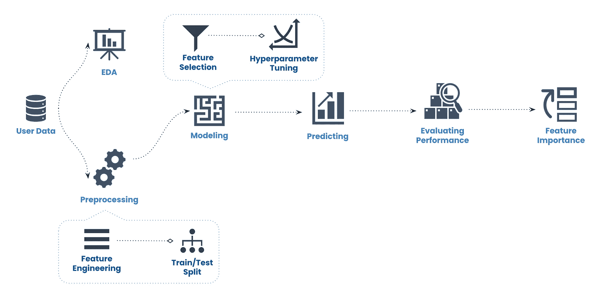
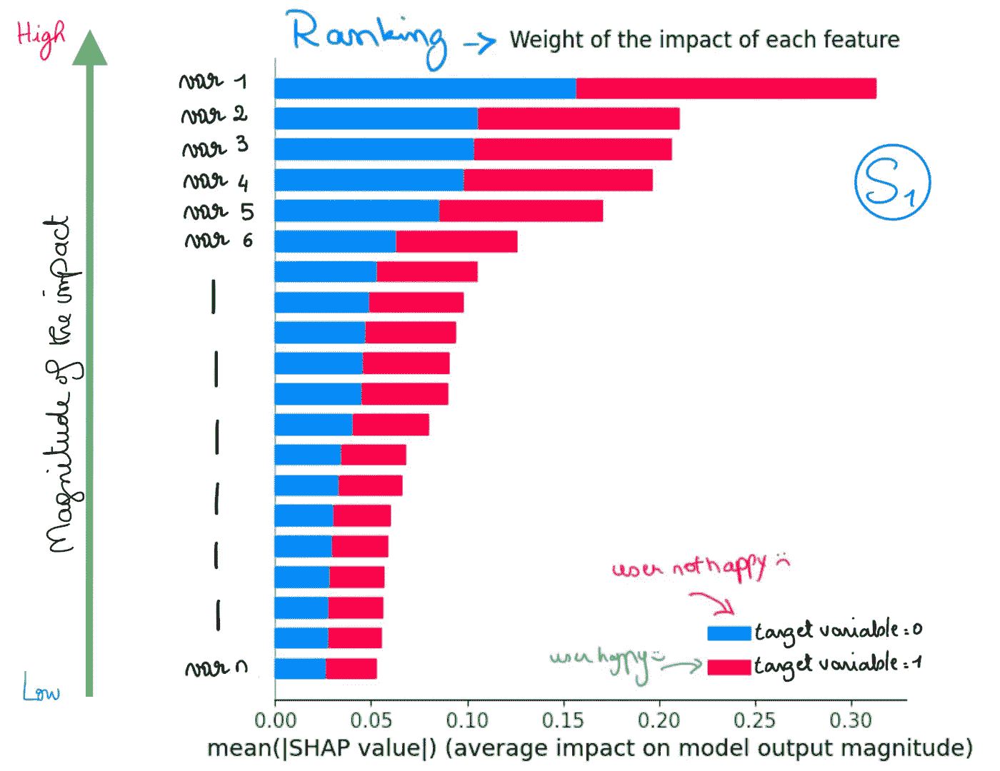
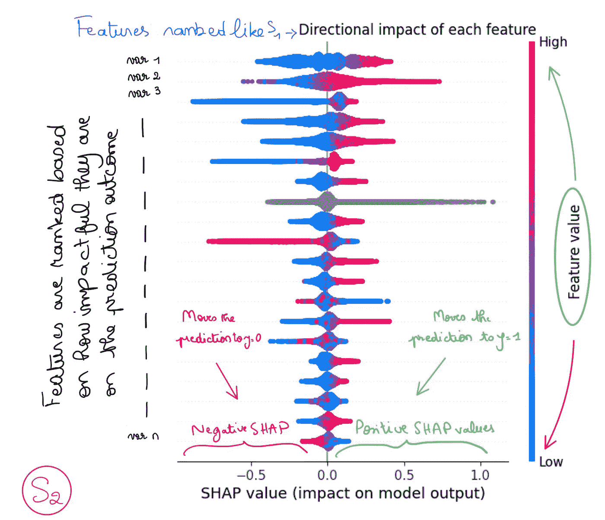

# 使用 SHAP 进行特征重要性分析：我在 Spotify 学到的（在复仇者的帮助下）

> 原文：[`towardsdatascience.com/feature-importance-analysis-with-shap-i-learned-at-spotify-aacd769831b4`](https://towardsdatascience.com/feature-importance-analysis-with-shap-i-learned-at-spotify-aacd769831b4)

## 确定主要特征并理解它们如何影响机器学习模型的预测结果

[](https://medium.com/@elalamik?source=post_page-----aacd769831b4--------------------------------)[](https://towardsdatascience.com/?source=post_page-----aacd769831b4--------------------------------) [Khouloud El Alami](https://medium.com/@elalamik?source=post_page-----aacd769831b4--------------------------------)

·发表于 [Towards Data Science](https://towardsdatascience.com/?source=post_page-----aacd769831b4--------------------------------) ·13 分钟阅读·2023 年 8 月 23 日

--

*这篇文章是我在 Spotify 机器学习论文中学习内容的两篇文章之一。请务必查看第二篇文章，了解我如何成功显著优化我的模型。*

[](/boosting-model-accuracy-techniques-i-learned-during-my-machine-learning-thesis-at-spotify-code-8027f9c11e57?source=post_page-----aacd769831b4--------------------------------) ## 提高模型准确性：我在 Spotify 机器学习论文中学到的技巧（+代码…

### 一个技术数据科学家的工具栈，用于改善顽固的机器学习模型

towardsdatascience.com

两年前，我在 Spotify 进行了一项有趣的研究项目，作为我的硕士论文的一部分。我学习了几种有用的机器学习技术，我相信任何数据科学家都应该掌握这些技巧。今天，我在这里为你们讲解其中之一。

在那段时间里，我花了 6 个月尝试建立一个预测模型，并解析其内部工作原理。*我的目标是了解是什么让用户对他们的音乐体验感到满意。*

这不仅仅是预测用户是否快乐（或不快乐），而是理解导致他们快乐（或不快乐）的*潜在*因素。

听起来很令人兴奋，对吧？确实如此！我喜欢每一部分，因为我学到了很多关于如何在音乐和用户行为背景下应用机器学习的知识。

*(如果你对机器学习在音乐行业的应用感兴趣，那么我强烈推荐你查看这篇有趣的* [*研究*](https://research.atspotify.com/2018/07/understanding-and-evaluating-user-satisfaction-with-music-discovery/) *，由 Spotify 顶级专家主导。这是必读的！)*

# 机器学习与行为心理学在科技中的应用


作者图片（Midjourney）

在科技领域，像我的研究项目非常常见，因为很多工作都围绕着为用户/客户提供最佳个性化体验。

这通常意味着要深入了解人类心理，而机器学习可以是实现这一不可能目标的强大工具——*理解人类*。

> 当我们将机器学习与心理学和行为科学结合时，我们更接近于了解人类行为的完整画面。

## 怎么做？

我们建立模型来预测人们的反应。

有时我们尝试理解*为什么*模型会预测那种反应。这就像是在问模型——*“嘿，你认为是什么原因导致用户有这样的行为？”*

答案在于找到模型中**最重要的变量**，并理解**它们对预测结果的单独影响**。

在我的研究中，我做了我们称之为**特征重要性**的分析，并使用了一个强大的工具叫做**SHAP**。

在这篇文章中，我将向你解释：

1.  *什么*是 Shapley 值，即 SHAP

1.  *为什么*你需要知道如何使用 SHAP

1.  *如何*使用 SHAP

欢迎来解读机器学习模型！

# 数据科学家无法逃避的困境

当你处理像 LightGBM 这样的模型时，这就是我在研究中使用的模型，你需要知道你正在处理的是一种特定类型的模型——一个‘黑箱’。

像 DC 漫画中的反派一样，黑箱模型是你应该害怕的东西。

为什么？因为解读这些就像是在打击小丑，而他在你面前咯咯笑。一定要确保他不会轻易泄露秘密。

在许多行业中，法规和流程要求你解释你是如何得出结果的。

> *在科技领域，知道如何解释你的预测结果对于* 获得信任 *或* 了解模型的内部运作* 是很重要的。后者就是我研究中的情况。*

## 可解释性与复杂性

在为你的项目选择合适的模型时，你必须考虑许多因素，包括：

+   **可解释性**——*你能解释一下你的模型是如何做到这些的吗？它是如何做出决策的？* 例如，线性回归模型就是透明性的定义。你可以轻松追溯每个特征对模型输出的影响。可解释性也常被称为可解释性。

+   **复杂性** — *你的模型的架构或表示有多复杂？* 神经网络可以预测奇迹，但了解它们如何捕捉特征之间的关系将让你感到头疼。复杂性通常也与高预测能力相关。

## 白盒还是黑盒？

如你所见，这两个指标完全不一致。复杂的模型通常会牺牲可解释性。因此，你需要根据你的目标小心选择模型类型：


作者提供的图片（Midjourney）

+   **白盒模型** — 这些模型易于解释/说明，因为它们清晰地展示了特征之间的关系。

    你可以深入了解模型如何做出预测。

+   **黑盒模型** — 这些模型可以产生准确的结果，但高度复杂，难以解释。就像黑洞一样，我们完全不知道里面发生了什么。所以我们就叫它们 BB，这样听起来不那么可怕。

> *黑盒模型通常是我们在技术中用来获得强大而准确结果的模型。这就是为什么理解它们对你作为数据科学家的职业生涯至关重要。*

# 步骤 1 — 良好的预测结果

## 为了评估哪些因素推动了满意度，我必须：

1.  选择一个可以用来描述用户满意度的指标。

1.  选择正确的机器学习模型——在我的案例中是 LightGBM*。

1.  为我的模型寻找并创建尽可能多的相关特征。

1.  选择一个准确性指标来评估我的模型性能——在我的案例中是 ROC AUC 分数。

1.  优化我的模型性能，以确保它对该指标的预测相对准确。

**LightGBM 是一个基于决策树的框架，它结合了梯度提升和集成方法来解决复杂问题。集成方法通过每棵树对数据有不同的知识并采用不同的决策方法来提高准确性。梯度提升通过顺序构建弱决策树工作，每棵树从前一个模型遇到困难的地方学习并修正预测值与真实值之间的差异，称为“残差”。这些树传播错误的梯度。*



我的机器学习流程是这样的

*由于本研究的保密性，我不能分享具体信息，但我会尽力让它听起来不像是你需要解读的东西。让 SHAP 来处理吧。*

在我的研究中，我构建了一个 LightGBM 分类器，也就是一个 BB 模型，它输出一个二进制结果：

y = 1 → 用户似乎满意

y = 0 → 不太满意

我的目标是理解**为什么**听众有这样的感受，而不仅仅是搞清楚**他们的感受如何**。

起初，我的 ROC AUC 分数在 0.5 左右，这是分类器能得到的最差分数。这意味着算法有 50% 的概率预测是或否。这和人类的随机行为一样。

因此，在花了 2 个月尝试提高我的模型预测效果之后，我终于达到了一个令人满意的结果。

*再一次，确保查看下面文章中我是如何做到这一点的！*

[](/boosting-model-accuracy-techniques-i-learned-during-my-machine-learning-thesis-at-spotify-code-8027f9c11e57?source=post_page-----aacd769831b4--------------------------------) ## 提高模型准确性：我在 Spotify 的机器学习论文中学到的技术 (+Code…

### 一个技术数据科学家改善顽固 ML 模型的技术栈

towardsdatascience.com

只有在那时，我才能真正开始深入研究我的模型如何通过特征重要性进行预测。所以让我们立即开始吧！

# 第 2 步 — 特征重要性

## SH-复仇者们来拯救

*那么让我们倒带。*

*在我的研究中，我想评估驱动用户满意度的关键因素是什么。由于我的模型是一个 BB，唯一的方法就是进行特征重要性分析。*

想象一下——复仇者们一起战斗以拯救世界。你怎么知道谁在拯救中最强大？

*(我们都知道是钢铁侠，但让我们假装不知道！)*

这就是 SHapley Additive exPlanations，或 SHAP 值，在机器学习的虚拟世界中所做的事情。


图片由 [Mateusz Wacławek](https://unsplash.com/@wacalke?utm_source=medium&utm_medium=referral) 提供，来源于 [Unsplash](https://unsplash.com/?utm_source=medium&utm_medium=referral)

## SHAP 值是什么？

SHAP 或 Shapley 值是基于合作博弈理论的。

> 它们测量每个特征——复仇者们——如何对模型的最终决策——拯救世界或摧毁世界——作出贡献。

在特征重要性的背景下，*复仇者们* 是单个 *特征*，而 *拯救世界* 是模型做出的 *预测*。

## 它是如何工作的？

> 这个方法的核心思想是考虑所有可能的特征组合，并**测量当特定特征被包含或排除时模型预测的变化。**

通过比较这些不同的组合，Shapley 值为每个特征分配一个值，代表其对预测的贡献。

关键的数学概念是 *排列*。我们考虑不同的特征排列并计算它们的边际贡献。通过考虑所有可能的排列并平均这些贡献，我们得出每个特征的 Shapley 值。

通过这样做，我们可以了解我们的模型是如何“拯救世界”——或者说它是如何进行预测的！

## 更具体地说，SHAP 值帮助我们理解：

1.  *影响预测结果的主要特征是什么？*

    在我们的案例中，**每个复仇者在拯救世界中的力量有多强**。想象一下绿巨人的拳头打到你脸上，那东西会把你打飞到多元宇宙中。

1.  *这些不同特征如何影响预测结果？* 即**每个复仇者在拯救世界中的力量的影响**。我的意思是，看看猩红女巫旺达有多强，但她在：摧毁了半个世界！！！有时候英雄是反派（或者只是一个坏英雄），所以重要的是你要找出他们站在哪一边。

## 双重解释性

Shapley 值特别强大，因为它们提供了 BB 模型解释性的双重视角：

1.  **总体上。** 通过提供每个特征的预测能力的总体概述，汇总所有用户。

1.  **局部上。** 可以为每个用户计算 SHAP 值，以探索特征如何影响该特定用户的预测结果。

# 加入复仇者联盟怎么样？来吧！


作者提供的图片

请记住，下面使用的所有数据都是纯粹的示例，以保密此研究的机密性。

## **1\. 编码你的变量**

确保你的变量已经编码：

+   *序数特征*，以便模型保留序数信息

+   *分类特征*，以便模型可以解释名义数据

所以首先，让我们把我们的变量存储在某个地方。由于研究是保密的，我不能公开我使用的数据，所以让我们使用这些代替：

```py
region = ['APAC', 'EU', 'NORTHAM', 'MENA', 'AFRICA']
user_type = ['premium', 'free']

ordinal_list = ['region', 'user_type']
```

然后，确保构建编码变量的函数：

```py
from sklearn.preprocessing import OneHotEncoder, OrdinalEncoder

def var_encoding(X, cols, ordinal_list, encoding):

    #Function to encode ordinal variables
    if encoding == 'ordinal_ordered': 
        encoder = OrdinalEncoder(categories=ordinal_list) 
        encoder.fit(X.loc[:, cols])
        X.loc[:, cols] = encoder.transform(X.loc[:, cols])

    #Function to encode categorical variables    
    elif encoding == 'ordinal_unordered':
        encoder = OrdinalEncoder()
        encoder.fit(X.loc[:, cols])
        X.loc[:, cols] = encoder.transform(X.loc[:, cols])

    else:     
        encoder = OneHotEncoder(handle_unknown='ignore')
        encoder.fit(df.loc[:, cols])
        df.loc[:, cols] = encoder.transform(df.loc[:, cols])

    return X 
```

然后将该函数应用于你的变量列表。这意味着你需要创建包含变量名称的字符串的列表，即一个列表用于你的*序数*变量，一个用于*分类*变量，还有一个用于*数值*变量。

```py
def encoding_vars(X, ordinal_cols, ordinal_list, preprocessing_categoricals=False):

    #Encode ordinal variables
    df = var_encoding(df, ordinal_cols, ordinal_list, 'ordinal_ordered')

    #Encode categorical variables
    if preprocessing_categoricals: 
       df = var_encoding(df, categorical_cols, 'ordinal_unordered')    

    #Else set your categorical variables as 'category' if needed
    else:
        for cat in categorical_cols: 
            X[cat] = X[cat].astype('category')

    #Rename your variables as such if needed to keep track of the order
    #An encoded feature such as region will no longer show female or male, but 0 or 1
    df.rename(columns={'user_type': 'free_0_premium_1'},   
    df.reset_index(drop=True, inplace=True)   

    return df
```

## 2\. 准备数据

将你的数据框拆分，以获取你的*训练*、*验证*和*测试*集：

+   **训练集** — 用于训练你选择的算法模型，例如 LightGBM

+   **验证集** — 用于调整你的参数并优化预测结果

+   **测试集** — 用于做出最终预测

在我的研究中，我使用了`GroupShuffleSplit`。它创建了一个用户定义数量的独立训练-验证分割。它通过将整个组随机分配到训练集或验证集来工作。

```py
def split_df(df, ordinal_cols, ordinal_list, target):

    #Splitting train and test
    splitter = GroupShuffleSplit(test_size=.13, n_splits=2, random_state=7)

    #If you're dealing with many rows belonging to the same id then make sure to split based on the same id
    split = splitter.split(df, groups=df['user_id'])
    train_inds, test_inds = next(split)

    train = df.iloc[train_inds]
    test = df.iloc[test_inds]

    #Splitting val and test data
    splitter2 = GroupShuffleSplit(test_size=.5, n_splits=2, random_state=7)
    split = splitter2.split(test, groups=test['user_id'])
    val_inds, test_inds = next(split)

    val = test.iloc[val_inds]
    test = test.iloc[test_inds]

    #Defining your X (predictive features) and y (target_feature)
    X_train = train.drop(['target_feature'], axis=1)
    y_train = train.target_feature

    X_val = val.drop(['target_feature'], axis=1)
    y_val = val.target_feature

    X_test = test.drop(['target_feature'], axis=1)
    y_test = test.target_feature

    #Encoding the variables in the sets
    X_train = encoding_vars(X_train, ordinal_cols, ordinal_list)
    X_val = encoding_vars(X_val, ordinal_cols, ordinal_list)
    X_test = encoding_vars(X_test, ordinal_cols, ordinal_list)

    return X_train, y_train, X_val, y_val, X_test, y_test
```

然后将该函数应用于你的数据框，以获取你的训练、验证和测试集：

```py
X_train, y_train, X_val, y_val, X_test, y_test = split_df(df, ordinal_cols, ordinal_list, target='target_feature')
```

## 3\. 训练你的*模型*

在这里，我假设你已经：

+   清理并预处理你的数据

+   调整了你的参数

+   优化了你的模型

```py
import lightgbm as lgb
#Build your model
clf =  lgb.LGBMClassifier(objective='binary', max_depth=-1, random_state=314, metric='roc_auc', n_estimators=5000, num_threads=16, verbose=-1,
                           **best_hyperparameters)

#Fit your model
clf.fit(X_train, y_train, eval_set=(X_val, y_val), eval_metric='roc_auc')

#Make the predictions
roc_auc_score(y_test, clf.predict(X_test)) 
```

## 4\. 使用 SHAP 进行特征重要性分析

现在是你期待已久的时刻！

SHAP 包有许多不同类型的可视化，具体取决于你是否想要全球解释（所有用户汇总）还是局部解释（每个用户）。在我的研究中，我专注于结果的全球解释，因为我不关心特定用户。

我使用了一种特定类型的图表，我认为这种图表足够有效地可视化你的特征影响——**汇总图**。你将得到：

+   根据预测权重对特征进行 **排名**。



**S1** — 作者提供的图片

+   每个特征的 **方向性影响**，即特征是否对预测结果产生正向或负向影响。



**S2** — 作者提供的图片

**注意：** 颜色为灰色的特征是名义特征，无法编码，因此如果你关心这些特征，也要对它们进行编码！

🚨**记住**🚨

确保创建一个特征列表，你想评估其对预测结果的影响：你将把它们插入下面的‘my_features’代码行中。

这个函数将产生汇总图（见 S1，S2）

```py
def shap_viz(model, X_val, title, target):

    #Prepare the features you want to evaluate
    my_features= [**List of features you want to evaluate**]
    my_features_idx = list(np.flatnonzero(X_val.columns.isin(my_features)))

    #Define your metric
    class_names = ['happy_:)', 'not_happy_:(']

    #Load the SHAP explainer, since LightGBM is a decision tree, I used TreeExplainer
    explainer = shap.TreeExplainer(model)
    #We train the SHAP values on the features based on the validation set
    shap_values = explainer.shap_values(X_val) 

    plt.figure(figsize=(18, 6))
    plt.subplot(1,2,1)
    shap.summary_plot(shap_values, X_val.values, plot_type='bar', class_names=class_names, feature_names=X_val.columns, max_display=20, show=False, plot_size=None)
    plt.title(f'{title} – Weight of the impact of each feature')

    plt.subplot(1,2,2)
    #shap_values[n] evaluates the impact of features for predicting satisfaction
    #n = 0 -- not happy, n = 1 -- happy
    shap.summary_plot(shap_values[1], X_val.values, feature_names=X_val.columns, max_display=20, show=False,  plot_size=None)
    plt.title(f'{title} – Directional impact of each feature')
    plt.tight_layout()

    #To save a picture of your SHAP viz
    plt.savefig(f'{title}.png', bbox_inches='tight', dpi=100)

    plt.show()

    #To print a list of the top 10 most impactful features
    vals = np.abs(shap_values[0]).mean(0)
    feature_importance = pd.DataFrame(list(zip(X_val.columns, vals)), columns=['col_name', 'feature_importance_vals'])
    feature_importance.sort_values(by=['feature_importance_vals'], ascending=False, inplace=True)
    for i in list(feature_importance.col_name.head(10)):
            print(i)
    return shap_values
```

然后运行函数来获取 SHAP 可视化，瞧！

```py
your_shap = shap_viz(clf, X_val, title='insert_title', target='target_feature')
```

你刚刚让小丑泄密；连蝙蝠侠也做不到。

你也知道哪个复仇者拯救了世界！如果你没理解这个笑话，那就对不起你没花时间认真阅读我的文章 😡

*(现在我才意识到我把 Marvel 宇宙和 DC 宇宙混合了，这真是第一次)*

# 最重要的部分——解释 SHAP 值

解释这些图形并不简单。花了我一些时间才学会如何正确进行。

在解释这些图形时，你需要考虑图中表示的两个元素：

+   *SHAP 值是正还是负？* 它在汇总图的左侧还是右侧？

+   *特征值是高还是低？* 看看图右侧从低到高的彩色条。

## 让我们举个例子

假设我们在分析用户在 Spotify 上的流媒体时间 `streaming_time` 与他们的满意度（第 1 步中的 `y = 1`）之间的关系。使用 SHAP 值：

1.  **正** SHAP 值（图的右侧）+ **高** `streaming_time`（红色）→ 更多的流媒体对应更高的满意度。

1.  **负** SHAP 值（图的左侧）+ **高** `streaming_time`（红色）→ 更多的流媒体表明对体验的满意度较低。

# 回顾

1.  **什么是 Shapley 值？** 一种特征重要性方法，用于衡量每个特征对模型最终决策的贡献。

1.  **什么时候需要使用 SHAP？** 当你需要解释模型如何做出预测，或当你想了解在处理难以解释的模型（如黑箱模型）时，哪些关键特征影响了模型输出。

1.  **如何使用 SHAP？** 查看逐步过程。我无法总结这一部分。

# 我为你准备了礼物 🎁！

订阅我的 [**通讯**](https://levelupwithk.substack.com/) **K 的 DataLadder**，你将自动获得我的 **终极 SQL 备忘单**，包含我在大科技公司日常工作中使用的所有查询 + 另一个秘密礼物！

我每周分享在科技领域担任数据科学家的经历，提供实用的技巧、技能和故事，旨在帮助你提升能力——因为没有人真正了解，直到他们亲身体验！

## 如果你还没有做过这个

+   订阅我的[**YouTube**](https://rebrand.ly/tdf62uv)频道。新视频即将上线！

+   在[**Instagram**](https://www.instagram.com/elalamikhouloud/)、[**LinkedIn**](https://www.linkedin.com/in/elalamik/)、[**X**](https://twitter.com/elalamik)上关注我，或者选择其他适合你的方式

不久见！
