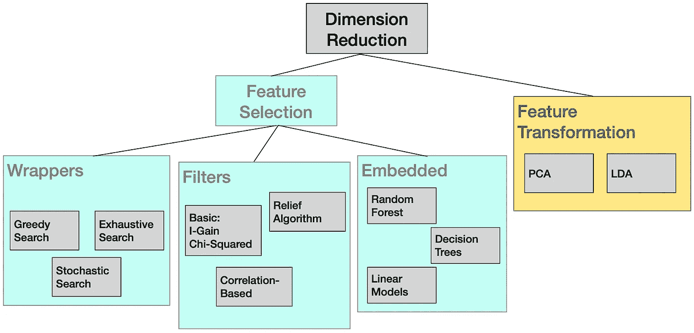

# 特征子集选择

> 原文：[`towardsdatascience.com/feature-subset-selection-6de1f05822b0`](https://towardsdatascience.com/feature-subset-selection-6de1f05822b0)

## 关于特征选择的教程和推荐策略

 [Pádraig Cunningham](https://medium.com/@PadraigC?source=post_page-----6de1f05822b0--------------------------------)

·发表于[Towards Data Science](https://towardsdatascience.com/?source=post_page-----6de1f05822b0--------------------------------) ·阅读时间 16 分钟·2023 年 3 月 22 日

--

图片来源：[gokhan polat](https://unsplash.com/@go_pol?utm_source=unsplash&utm_medium=referral&utm_content=creditCopyText) 于[Unsplash](https://unsplash.com/photos/qyC7DTbWJJk?utm_source=unsplash&utm_medium=referral&utm_content=creditCopyText)

# TL;DR

特征子集选择在监督学习中非常重要，不仅因为它可以产生更好的模型，还因为它提供的洞见。随着机器学习（ML）对可解释性强调的增加，这一点尤为重要。

从业者面临的挑战是特征选择方法的种类繁多。在这篇文章中，我简要概述了这一领域，并提出了一种在大多数情况下有效的策略。该策略使用*Wrapper*进行最终选择过程，并在必要时使用*permutation importance*作为初步筛选。

## 引言

在数据分析中，使用多个特征描述的对象有时可以仅用这些特征的子集来描述而不丢失信息。识别这些特征子集被称为特征选择、变量选择或特征子集选择，是数据分析中的关键过程。本文简要概述了特征子集选择（FSS）方法，并提出了一种在大多数场景下都有效的策略。本文基于[arXiv](https://arxiv.org/abs/2106.06437) [1]上的一篇教程论文。该论文中提出的方法的 Python 代码可在[Github](https://github.com/PadraigC/FeatSelTutorial)上找到。

特征选择在机器学习中受到广泛关注，因为它可以带来许多好处：

+   **更好的分类器：** 特征选择的明显好处是它会提高准确性，因为冗余或噪声特征可能会损害准确性。或许令人惊讶的是，准确性的提升可能会相当有限，因为强大的机器学习技术被设计得对噪声具有鲁棒性。

+   **洞察：** 特征选择最持久的好处可能是它所提供的洞察。识别出有影响力的特征和无用的特征可以让我们对数据有更多了解。

+   **数据收集：** 在数据有成本的领域（例如医学诊断、制造业），确定用于分类任务的最小特征集可以节省开支。

**图 1\.** 特征选择过程概述：主要有三大类方法，包裹法、过滤法和“嵌入”法，其中特征选择嵌入或是分类算法的副作用。反过来，特征选择可以被视为一种降维策略。图片作者提供。[1]

图 1\. 总结了特征选择方法的主要策略。其他特征选择的调查[2,3]将特征选择方法分为三类，我们遵循相同的结构。

+   **包裹法**是特征选择方法的一种，其中分类器在特征选择过程中被*包裹*（见图 2）。这种包裹使得分类性能能够驱动特征选择过程。这有一个将特征选择与分类器性能绑定的优点，但这也伴随着显著的计算成本，因为在选择过程中将评估许多分类器变体。

+   **过滤法**涵盖了使用分类器性能以外的标准来指导特征选择的方法。通常，过滤器提供特征排名，然后选择策略使用该排名来选择特征子集。

+   **嵌入法**指的是特征选择作为分类器训练过程的副产品*产生*的任何方法。例如，训练决策树几乎总是会选择一个可用特征的子集来构建树。

**图 2\.** 包裹法与过滤法的对比：（a）在包裹法中，分类器在搜索过程中被*包裹*。（b）过滤器策略使用独立评估（例如信息增益）来评分特征。图片作者提供。

## 方法论

在评估特征选择策略的性能时，我们通常想知道这些策略如何推广到未见过的数据上。作为这种评估的代理，我们保留一些数据用于测试（图 3 中的选项(b)）。如果我们希望在模型开发过程中评估几种不同的特征选择方案，那么这些方案应在训练数据的范围内进行测试，而交叉验证是实现这一目标的最有效方式（选项(c)）。需要记住的是，如果目标是在 ML 系统的部署过程中进行特征选择，那么可以使用所有可用的数据进行特征选择（图 3 中的选项(a)）。

**图 3\.** 评估方法论。 (a) 如果不需要估计泛化准确率，则可以使用所有数据进行模型开发的各个方面。 (b) 可以从训练中保留测试数据，以获得泛化准确率的估计。 (c) 交叉验证可以在训练数据中用于特征选择。图像由作者提供。

在继续之前，我们需要介绍将要使用的符号。假设我们有一个数据集***D***，由*n*个数据样本组成。**D** = ⟨**X, y**⟩，其中**y**是类别标签。这些示例由一组特征**F**描述，其中*p* = |**F**|，因此有*n*个对象由*p*个特征描述。所以**X**的维度是*n*×*p*，**y**是一个长度为*n*的向量。目标是识别一个子集**S ⊂ F**，以捕捉数据集中重要的信息。经过特征选择后，数据集被减少为**X′**，其维度为*n*×*k*，其中*k* = |**S**|。

本教程中使用的数据集的某些摘要统计信息如表 1 所示。这些数据集可以在[GitHub 仓库](https://github.com/PadraigC/FeatSelTutorial)中找到。

**表 1\.** 本教程中使用的数据集的摘要统计信息。

## 包装器

如果 |**F**| 较小，我们可以在理论上尝试所有可能的特征子集，并选择最佳子集。在这种情况下，*‘尝试’* 意味着使用特征子集进行分类器的训练和测试。这将遵循图 3 (c)中展示的协议，其中在训练数据上进行交叉验证以识别良好的特征子集，然后可以在测试数据上进行测试。然而，可能性数量为 2*ᵖ*，因此穷举搜索很快变得不可能——例如，如果*p*=20，则需要考虑的可能性超过 100 万。

尽管如此，这就是 Wrapper 特征选择策略的工作方式，重要的修改在于搜索可以是贪婪的或随机的，而不是穷举的。总体思路如图 2(a) 所示，分类器在特征选择过程中被*包裹*，即使用特征子集训练的分类器用于搜索过程。特征子集将通过对使用数据构建的分类器进行保留测试或交叉验证测试来评估。与 Wrapper 一起使用的主要搜索策略包括：

+   **穷举搜索** 评估每一个可能的特征子集。如果待考虑的特征数量较少，则可以考虑所有特征组合。然而，如果 *p* > 20，将会有数百万个特征子集需要考虑，这使得穷举搜索变得不切实际。

+   **顺序前向选择 (SFS)** 从未选择任何特征开始，并考虑所有包含单一特征的分类器（见图 4 (a)）。选择其中表现最佳的分类器，然后评估包括该特征的两个特征组合。这个过程继续进行，在每一步添加获胜的特征，直到无法进一步改进为止。

+   **反向消除 (BE)** 以与 FSS 相反的方向进行，从选择所有特征开始，考虑删除一个特征的选项，选择其中表现最佳的，然后继续消除特征（见图 4 (b)）。同样，当无法进一步改进时，过程终止。

+   **随机搜索** 方法，如遗传算法或模拟退火，可以很方便地应用于 Wrapper 特征选择。每个状态可以通过特征掩码定义，在此掩码上可以进行交叉和变异操作 [4]。鉴于这种方便的表示方法，虽然评估适应度函数（通过交叉验证测量的分类器准确性）很昂贵，但使用随机搜索进行特征选择仍然非常直接。

**图 4**\. 使用 Wrapper 进行特征子集选择：(a) 顺序前向选择 (b) 反向消除。作者提供的图像。

我们对 Wrapper 方法的探索将集中在 SFS 和 BE 上。这些是贪婪策略，通过探索可能的特征子集的搜索空间（如图 4 所示）。SFS 从一个空集开始，并向前推进，考虑基于单一特征构建的分类器。选择其中最好的一个，然后考虑将这个特征包含在内的特征对。当新增特征无法带来任何改进时，过程可以终止。顾名思义，Backward Elimination 的工作方向正好相反。它从一个完整的特征集开始（图 4(b)），并在每一步去除最不有用的特征。对于 SFS 和 BE，特征子集通过对训练数据的交叉验证来评估。评估是在分割数据集上进行的，所使用的分类器是 *k*-最近邻 (*k*-NN)，因为它对噪声或冗余特征非常敏感。该 [Python notebook](https://github.com/PadraigC/FeatSelTutorial/blob/main/FS-Wrappers.ipynb) 可在 Github 上获得。

正如图 5 所示，两种方法各有优缺点。SFS 倾向于需要较少的计算，因为被评估的模型较小，通常特征较少的分类器训练和测试所需的时间更短。SFS 倾向于选择较少的特征（见图 5(a)）；这种简洁通常是一种优势。另一方面，由于 BE 从较大的特征集开始，它可以更好地评估特征的组合效果。

SFS 和 BE 的总体结果如图 5(b) 所示。SFS 选择了七个特征，而 BE 选择了 11 个特征。两个特征子集都导致了训练数据上的准确率提高，但只有 SFS 子集在测试数据上表现出了更好的准确率。实际上，BE 的训练和测试准确率之间的差距是过拟合的证据——选择过程过于紧密地拟合了训练数据的特征，从而损害了泛化准确性。确实，过拟合被认为是 Wrapper 基于特征选择的一个问题 [4]。

**图 5.** 使用 Wrapper 的特征选择示例。(a) 随着 Sequential Forward Selection 的进行，训练数据上的准确率通过交叉验证进行测量。(b) SFS 和 BE 选择的特征子集的准确率估计。SFS 选择了 7 个特征，而 BE 选择了 11 个特征。图片由作者提供。

## Filters

图 2 (a) 显示了 Wrapper 策略如何在特征选择过程中使用分类算法。图 2(b) 显示了 Filter 策略如何不使用分类器进行特征选择，而是使用单独的评估函数。Filters 不依赖于分类器的事实是一种双刃剑。这意味着 Filters 可能比 Wrappers 快得多，但所选择的特征可能与分类器的归纳偏差不一致。

过滤器将包含特征评分机制，然后根据这些评分制定选择策略。评分机制需要量化特征对结果的信息量。选择策略可能是：

+   选择排名前*k*的特征，

+   选择前 50%的特征，

+   选择评分高于最大评分 50%的特征，

+   选择具有非零评分的特征，

+   一种混合的过滤器/包装器策略，通过使用过滤器对特征进行排名，然后评估基于该排名的子集的性能。

我们现在将研究三种过滤器策略——卡方统计量、信息增益和排列特征重要性。

**卡方统计量**是衡量特征和类别标签之间独立性的指标。如果样本组织成图 6 所示的列联表，那么单元计数与偶然观察到的计数有多大的不同？图 6(a)中的数据表明左右手偏好与性别独立，因为比例是相同的。图 6(b)中的数据表明性别可以预测左右手偏好。

**图 6**：两个列联表显示了左右手偏好和性别之间的关系。如果左右手偏好是类别，那么在（a）中它与性别特征是独立的，在（b）中则存在依赖关系。图片由作者提供。

卡方统计量允许我们量化这一点：

统计量是对*m*个单元的总和。对于每个单元，我们考虑观察到的计数*Oᵢ*与如果特征和类别是独立的情况下预期计数*Eᵢ*之间的差异。在图 6(a)中，这个差异将为零，因为特征和类别是独立的。在（b）中将存在差异，因此统计量将是正值。一般来说，依赖关系越大，统计量也越大。如果特征值是数值型而不是分类型，则可以对特征值进行分箱，以便构建列联表[5]。

**信息增益**是一种信息论度量，用于量化特征包含有关类别的信息[6]。在图 6(b)中，通过知道性别我们*获得*了有关左右手偏好的信息。在二分类场景中，假设正负结果的概率分别是*p*和*q*。那么基于这些比例的数据集的熵是：

然后，数据集中任何特征*f*相对于类别标签的信息增益是：

与卡方统计量类似，信息增益（I-Gain）允许我们对特征进行排序以进行特征选择。这在图 7 中得到了说明。图中显示了根据两种度量对 Segmentation 特征进行排名的结果。Python 笔记本可以在这个 GitHub <[链接](https://github.com/PadraigC/FeatSelTutorial/blob/main/FS-Filters.ipynb)> 找到。图表显示了按照 I-Gain 分数排序的分数。显然，分数的相关性很高（皮尔逊相关系数为 0.86），因此根据这些分数选择的特征子集应该是相当相似的。

**图 7：** 根据 I-Gain 和卡方统计量对 Segmentation 特征进行排序。图片作者提供。

当我们查看基于这些排名构建的特征子集的分类器性能时，这确实是这样。在图 8 中，我们可以看到不同 *k* 选择策略的结果（*k* = 3, 6, 10, 15）。在 *k* = 10 时，这两个分数都选择了一个特征子集，该子集在测试集上的准确率与使用完整特征集获得的准确率相同。这里的评估策略符合图 3 中的模式（b），特征评分使用训练数据完成，然后在测试集上进行测试。

**图 8：** 使用 I-Gain 和卡方统计量选择的 Segmentation 数据集中的前-*n* 特征的准确率估计。图片作者提供。

**排列特征重要性** 基于这样的原则：如果我们想了解某物对过程的重要性，我们可以打破它以查看会发生什么。为了评估特征的重要性，我们可以在测试集中对该特征的值进行*置换*，以查看对整体准确率的影响。如果在这种情况下变量被*加噪*时错误显著增加，那么该变量是重要的。如果错误没有增加，那么该变量对分类没有用。整体过程如下：

1.  在数据上拟合分类器

1.  计算基准准确率

1.  打乱特征值并重新计算准确率

1.  测量与未打乱错误的误差增加

这个过程通常会重复多次（例如 10 次），以获得更稳定的特征重要性分数。排列重要性被用作本文末尾提出的策略中的第一阶段。

在图 9 中，我们看到 Segmentation 数据集上 *k-*NN 和高斯朴素贝叶斯的排列重要性分数（笔记本 <[在这里](https://github.com/PadraigC/FeatSelTutorial/blob/main/FS-Permutation-FI.ipynb)>）。我们可以看到排名合理地相关，但并不完全相同。这种差异是由于不同的分类器“偏好”不同的特征以及特征选择方法固有的不稳定性。

**图 9：** 显示 k-NN 和高斯朴素贝叶斯在分割数据集上的特征重要性得分的条形图。图片来源于作者。

## 嵌入方法

在本节中，我们讨论从分类算法中*自然*产生的特征选择方法或作为算法的副作用出现的方法。我们将看到，决策树和逻辑回归中，特征选择可以成为模型构建过程的一个整合部分。

**决策树：** 从数据集中构建决策树通常需要特征选择，因为有些特征不会出现在树中。没有包含在树中的特征实际上被有效地排除。我们在图 10 中展示了在企鹅数据集上的一个例子。

**图 10：** 企鹅数据集的决策树。虽然数据由四个特征描述，但只有三个特征被选择。图片来源于作者。

在这个例子中，数据集被 50:50 地分成了训练集和测试集。该树在训练数据上进行了训练，并在测试数据上的准确率为 93%（见笔记本 <[这里](https://github.com/PadraigC/FeatSelTutorial/blob/main/FS-D-Tree.ipynb)>）。该数据集有四个特征，*鳍长，喙长，喙深度* 和 *体重*。从图 10 中的树可以看出，四个特征中的三个被选择，体重未被选择。

该树是使用默认的**scikit-learn**参数构建的，因此没有进行修剪。在决策树学习中，通常会限制（即修剪）树的大小以防止过拟合。使用修剪来防止过拟合将进一步推动特征选择，因为在较小的树中选择的特征更少。

**逻辑回归，Lasso：** 在多变量线性模型中，如线性回归或逻辑回归，特征选择可以作为正则化的副作用来实现。在机器学习中，正则化指的是旨在简化模型以防止过拟合的机制。因此，正则化可以导致特征被排除。弹性网和 Lasso 是线性模型的常用正则化方法。这里我们将概述 Lasso 的工作原理[7]并展示 Lasso 的应用示例。从基础开始，多变量回归的工作方式如下：

依赖变量*y*是输入特征的线性函数；对于每个特征*xᵢ*，该特征的权重由相应的*βᵢ*参数决定。对于二分类问题（[0,1]标签），我们可以使用逻辑回归，其中依赖变量是结果变量为 1 的对数几率。如果*pr*是标签为 1 的概率，那么几率是*pr/*(*1-pr*)。

因此，逻辑回归提供了一个类别概率：

正则化通过限制模型容量来防止过拟合；这通过限制权重的大小来实现。两种选择是 L₁或 L₂正则化：

因此，*β*参数在符合这些 L₁或 L₂约束的训练数据上进行拟合。结果表明，当使用 L₁正则化时，较弱的权重会变为零，即这些特征会被剔除。在 Tibshirani [7] 的原始 Lasso 论文中对*为什么*会发生这种情况有很好的解释。

为了在我们的示例数据集上演示这一点，我们将它们简化为二分类问题，以使整体过程更加透明（笔记本 <[在这里](https://github.com/PadraigC/FeatSelTutorial/blob/main/FS-Lasso.ipynb)>）。然而，使用 Lasso 进行特征选择也适用于多类别问题。结果见图 11 和图 12。由于数据集被减少到仅有两个类别（分割的水泥和窗户，以及企鹅的阿德利和凤头企鹅），因此准确率比多类别场景更高。

**图 11：** Lasso 对企鹅（上图）分割数据集的影响。Lasso 减少了β参数的大小；一些参数被减少到零。显示了 Lasso 在默认正则化（C=1）和较温和正则化（C=10）下的结果。图片由作者提供。

Lasso 特征减少的程度由正则化参数 C 控制。包括了两个正则化水平的结果，C=10 和 C=1。C=10 会导致较少的正则化，从而保留更多的特征。在这两种情况下，默认正则化导致特征减少过多，泛化准确率降低。对于企鹅数据集，仅保留了两个特征，而在分割数据集中保留了三个特征（见图 15）。较温和的正则化保留了更多特征，结果没有损失泛化准确率。

**图 12：** Lasso 对训练和测试准确率的影响。显示了 Lasso 在默认正则化（C=1）和较温和正则化（C=10）下的结果。图片由作者提供。

## 提议策略

正如开头所述，我们提出的策略将使用 *Wrapper* 进行最终选择过程，并在必要时使用 *permutation importance* 作为初始筛选器（GitHub <[link](https://github.com/PadraigC/FeatSelTutorial/blob/main/FS-Permutation%2BWrapper.ipynb)>）。我们在这里呈现的示例使用了来自 UCI 数据库的 Ionosphere 数据集。该数据集有 34 个特征，因此有超过 170 亿个可能的特征子集。即使使用贪心搜索策略（例如 SFS 或 BE），对整个特征集应用 Wrapper 也会非常计算密集。因此，我们使用图 13 所示的两步策略；我们使用排列重要性将 34 个特征减少到一个候选集 18 个特征，然后使用 Wrapper。

**图 13\.** 两阶段特征选择过程。绿色中的数字表示在实例中的特征数量。图像由作者提供。

本示例中使用的分类器是 *k-*NN，我们保留了 50% 的数据用于最终测试。排列特征重要性阶段的评分如图 14 所示。我们丢弃了没有正评分的特征，留下了 18 个特征用于 Wrapper 阶段。

**图 14\.** 来源于排列重要性阶段的特征重要性评分。理论上这些评分应该始终为零或更大；在实际操作中，一些评分为负，表示特征排列后的结果实际上是偶然改进的。可以安全地丢弃这些特征。图像由作者提供。

然后我们仅使用训练数据对这 18 个特征进行 Wrapper 搜索。我们使用前面描述的向后消除方法，它选择了 16 个特征。在图中我们看到三个特征集的准确性估计。训练数据上的估计使用交叉验证，保留估计显示了从特征选择过程中保留的 50% 数据的准确性。

**图 15\.** 三个特征集的准确性评分。训练集（用于特征选择的集）上的准确性通过交叉验证来测量。测试集上的准确性是从特征选择过程中保留的 50% 数据的简单保留度量。图像由作者提供。

我们看到两个特征选择阶段在训练数据上都提高了准确性，但对于 Wrapper 阶段，在测试数据上没有进一步改善。这与其他研究一致，这些研究表明深入的特征选择工作可能导致过拟合。

## 结论

这就总结了我们对最先进特征子集选择方法的概述。面临的挑战之一是有这么多可供选择的替代方法；我们提出的策略是：

+   如果你有大量的训练数据，上述的两阶段策略将是值得的。

+   如果训练数据稀缺且存在过拟合风险，可以在置换重要性步骤后停止特征选择。

本文所覆盖的方法的 Python 实现（使用 scikit-learn）可以在这个[GitHub 代码库](https://github.com/PadraigC/FeatSelTutorial)中找到。

## 参考文献

1.  Cunningham, P., Kathirgamanathan, B., & Delany, S. J. (2021). 特征选择教程及 Python 示例。*arXiv 预印本* [*arXiv:2106.06437*](https://arxiv.org/abs/2106.06437)。

1.  Isabelle Guyon 和 André Elisseeff. (2003) 变量和特征选择导论。*机器学习研究杂志*，2003 年。

1.  Luis Carlos Molina Félix, Luis Antonio Belanche Muñoz, 和 M Àngela Nebot Castells (2002) 特征选择算法：综述与实验评估。在 200*2 IEEE 国际数据挖掘会议（ICDM 2002）* 第 306–313 页。

1.  John Loughrey 和 Pádraig Cunningham. 基于包装的特征子集选择中的过拟合：越努力效果越差。在*国际人工智能创新技术与应用会议*，第 33–43 页。Springer，2004 年。

1.  Xin Jin 等人. “用于癌症分类的机器学习技术和卡方特征选择，基于 SAGE 基因表达谱”。在：*生物医学应用数据挖掘国际研讨会*。Springer，2006 年，第 106–115 页。

1.  John D Kelleher, Brian Mac Namee, 和 Aoife D’arcy. *预测数据分析的机器学习基础：算法、实例和案例研究*。MIT 出版社，2020 年。

1.  Robert Tibshirani. “回归收缩与套索选择”。在：*皇家统计学会学报：B 系列（方法论）* 58.1 (1996)，第 267–288 页。
