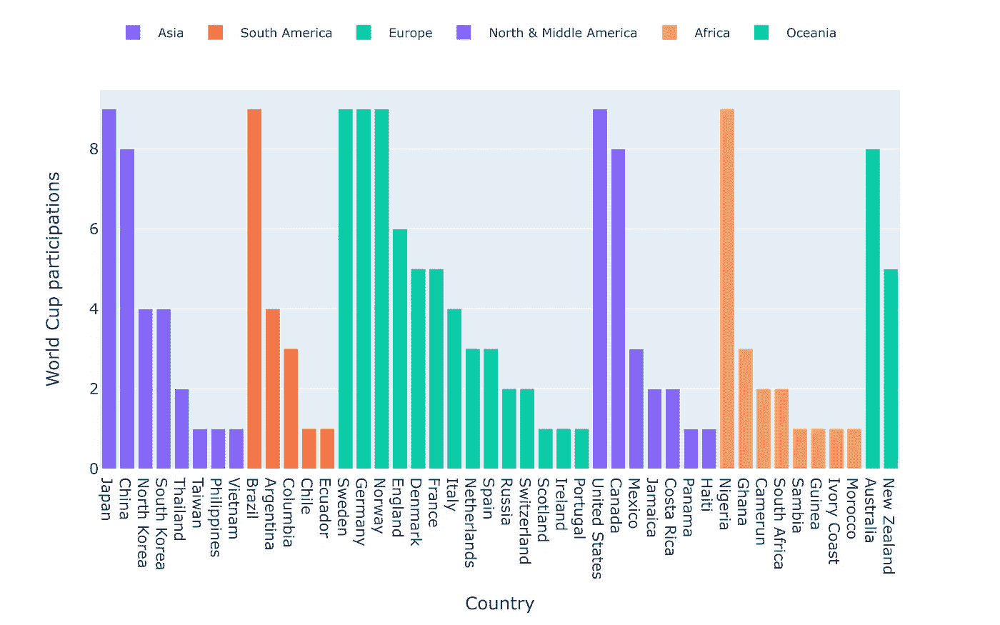
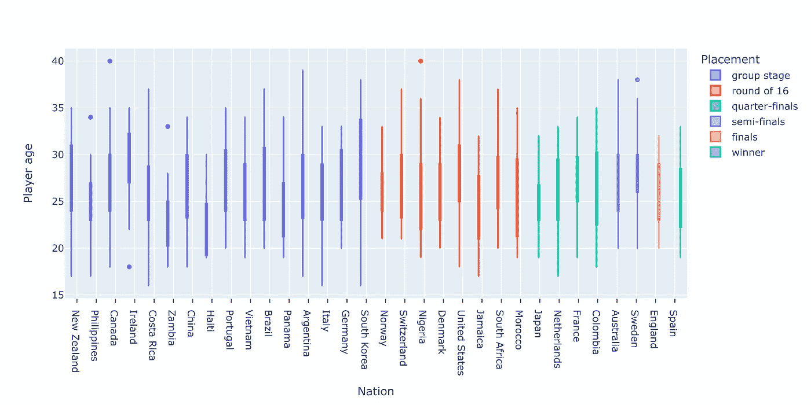
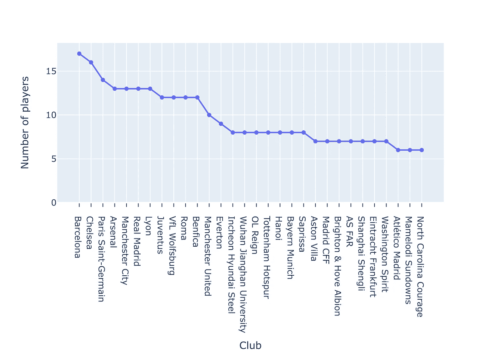
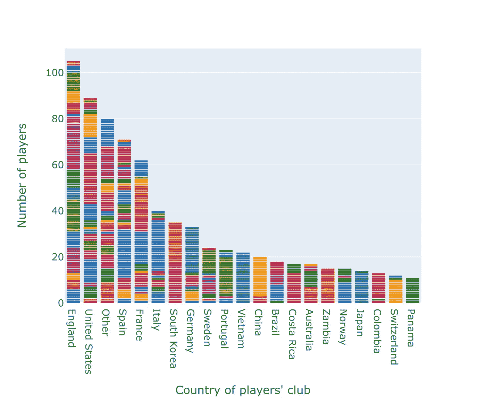
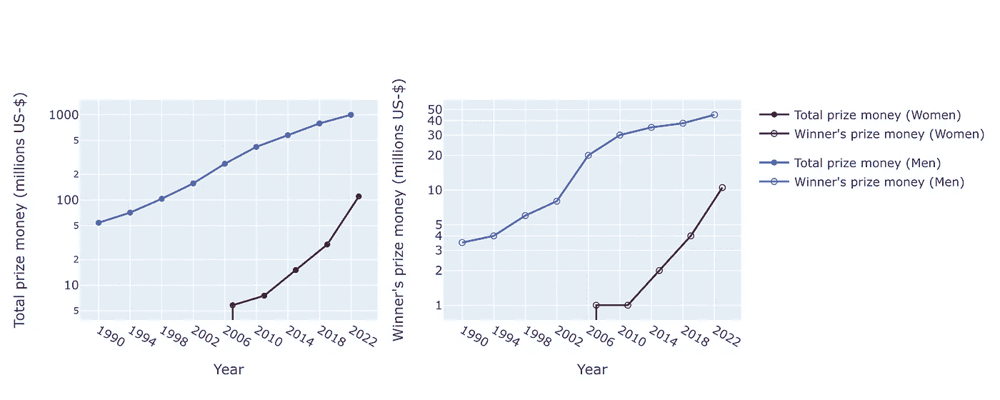

# 2023 年女子世界杯通过 Plotly 可视化

> 原文：[`towardsdatascience.com/fifa-womens-world-cup-2023-visualized-with-plotly-a7277edf6278`](https://towardsdatascience.com/fifa-womens-world-cup-2023-visualized-with-plotly-a7277edf6278)

## 数据科学家的五个图表评论

 [Caroline Arnold](https://medium.com/@caroline.arnold_63207?source=post_page-----a7277edf6278--------------------------------)

·发布于 [Towards Data Science](https://towardsdatascience.com/?source=post_page-----a7277edf6278--------------------------------) ·阅读时间 5 分钟 ·2023 年 8 月 22 日

--

图片由 [Your Lifestyle Business](https://unsplash.com/@ylblife?utm_source=medium&utm_medium=referral) 提供，来源于 [Unsplash](https://unsplash.com/?utm_source=medium&utm_medium=referral)

2023 年 7 月和 8 月，澳大利亚和新西兰联合举办了 FIFA 女子世界杯。共有 32 个国家队参赛，西班牙首次赢得冠军。重大体育赛事总是产生大量数据，我借此机会学习如何使用 Plotly。

[Plotly](https://plot.ly) 是一个开源图表库，用于创建交互式图表。它可以离线或在线使用，并与多种编程语言集成。我使用 Python，因为我对它最为熟悉，并创建静态图表。代码可以在 [GitHub](https://github.com/crlna16/medium_notebooks/blob/384a0d07e0aa65e35e7086bf8fe67c1d8e5e679e/plotly/fifa23.ipynb) 上找到。

在五个数据故事中，我们将尝试不同的 Plotly 功能，并展示世界杯历史和今年比赛的一些有趣事实：

1.  历史世界杯参赛情况

1.  球员年龄与比赛表现

1.  球员的俱乐部

1.  送出最多活跃球员的国家

1.  男子和女子世界杯奖金对比

## 1: 女子世界杯参赛情况

历史上，许多国家曾禁止女性踢足球。德国足球协会（DFB）在 1955 年决定，“缺乏优雅可能会损害女性脆弱的身体和灵魂，并会对道德和社会造成攻击”。直到 1970 年，禁令才被解除。今天，女性在全球范围内踢足球，只有少数国家仍有限制。

我们的第一个数据故事以条形图形式展示了各国女子足球队在世界杯中的参赛情况。自 1991 年首次举办以来，这项赛事已举行九次。来自每个大陆的国家都有参与。其中一些国家每届世界杯都参赛，而另一些仅参赛过一次。我很惊讶地发现朝鲜竟然参加了四次！

各国世界杯参赛情况。数据：维基百科。图片：作者。

这是生成静态条形图的代码。为了容纳众多条目，图例从默认的右侧位置移动到图表顶部。

## 2: 球队年龄和表现

国家队名单在[维基百科](https://en.wikipedia.org/wiki/2023_FIFA_Women's_World_Cup_squads)上是公开的。我们展示了国家队球员的年龄分布图。颜色代码表示球队在比赛中的排名。据我所见，并没有明显的模式——各类中位年龄的球队进入淘汰赛阶段的机会相似。海地和赞比亚以非常年轻的阵容脱颖而出。

国家队球员的年龄。数据：维基百科。图片：作者。

为了生成这个图表，我使用了 plotly 的 box 函数，并在分类轴上添加了网格线。

## 3: 球员的职业生涯分布在哪里？

名单还提供了球员所在俱乐部的信息，即他们不在国家队时所效力的俱乐部。我们汇总了每个俱乐部的球员数量，并仅展示前 30 名。诸如巴萨、切尔西、巴黎圣日耳曼和阿森纳等知名的欧洲和英国俱乐部主导了这个名单。顶尖的亚洲俱乐部包括仁川现代钢铁和武汉江汉大学，这些俱乐部与其本国大量球员有关联。

世界杯中前 30 名足球俱乐部。数据：维基百科。图片：作者。

这是一个标准的折线图，由于只有一条线，因此图例被关闭。

## 4: 球员在全球的分布情况如何？

我们按照俱乐部所在国家汇总球员数据。少于 10 名球员的国家被归为“其他”。许多世界杯阵容成员效力于英格兰和美国的俱乐部，这些国家的女子足球代表性强。世界杯冠军西班牙也吸引了许多顶级球员。

世界杯阵容成员俱乐部。数据：维基百科。图片：作者。

在这里，我创建了一个堆叠条形图，其中分类轴按每个类别的总数排序。颜色方案是定性的 G10 方案，这是 plotly 的默认颜色方案之一。

## 5: 奖金

最后，让我们来看看参加并赢得世界杯赛事是否值得。我很惊讶地发现，直到 2007 年女子世界杯之前，根本没有奖金发放。在 2023 年澳大利亚/新西兰比赛中，总奖金为 1 亿美元。相比于 2022 年卡塔尔男子世界杯分发的 10 亿美元，这个数字仍然相对较低。如果我们将这两个曲线绘制在对数刻度上，我们可以看到女子奖金的增长速度似乎超过了男子奖金的增长速度。所以未来的某个时候，可能会实现同工同酬。

女子和男子世界杯的奖金。数据来源：FIFA / 维基百科。图片：作者。

对于这个图表，我创建了两个子图，每个子图包含两条线。y 轴刻度设置为对数刻度。女子早期比赛中零奖金的情况无法在此刻度上显示。

正在等待同工同酬的女性。照片由[Magnet.me](https://unsplash.com/@magnetme?utm_source=medium&utm_medium=referral)拍摄，来源于[Unsplash](https://unsplash.com/?utm_source=medium&utm_medium=referral)

## 反思

我发现 Plotly 使用起来既方便又直观。所有标准统计图都可用。我需要一些时间来习惯图表的自定义，这与我在 matplotlib 中习惯的有所不同。互动功能非常适合数据探索，鼓励读者下载完整的笔记本并尝试使用。对于博客文章，我发现嵌入互动图表有些挑战，因此我选择了静态图表。

## 参考资料

+   GitHub 上的笔记本：[`github.com/crlna16/medium_notebooks/blob/384a0d07e0aa65e35e7086bf8fe67c1d8e5e679e/plotly/fifa23.ipynb`](https://github.com/crlna16/medium_notebooks/blob/384a0d07e0aa65e35e7086bf8fe67c1d8e5e679e/plotly/fifa23.ipynb)

+   所有历史和队伍数据均取自维基百科：[`en.wikipedia.org/wiki/2023_FIFA_Women's_World_Cup_squads`](https://en.wikipedia.org/wiki/2023_FIFA_Women's_World_Cup_squads)

+   FIFA 男子世界杯奖金：[`www.totalsportal.com/football/fifa-world-cup-prize-money/`](https://www.totalsportal.com/football/fifa-world-cup-prize-money/)

+   `towardsdatascience.com/how-to-create-a-plotly-visualization-and-embed-it-on-websites-517c1a78568b`
