# 解析数据中最不寻常的片段

> 原文：[`towardsdatascience.com/figuring-out-the-most-unusual-segments-in-data-af5fbeacb2b2?source=collection_archive---------8-----------------------#2023-07-13`](https://towardsdatascience.com/figuring-out-the-most-unusual-segments-in-data-af5fbeacb2b2?source=collection_archive---------8-----------------------#2023-07-13)

## 如何利用常识和机器学习找到关注的片段

[](https://miptgirl.medium.com/?source=post_page-----af5fbeacb2b2--------------------------------)[](https://towardsdatascience.com/?source=post_page-----af5fbeacb2b2--------------------------------) [Mariya Mansurova](https://miptgirl.medium.com/?source=post_page-----af5fbeacb2b2--------------------------------)

·

[关注](https://medium.com/m/signin?actionUrl=https%3A%2F%2Fmedium.com%2F_%2Fsubscribe%2Fuser%2F15a29a4fc6ad&operation=register&redirect=https%3A%2F%2Ftowardsdatascience.com%2Ffiguring-out-the-most-unusual-segments-in-data-af5fbeacb2b2&user=Mariya+Mansurova&userId=15a29a4fc6ad&source=post_page-15a29a4fc6ad----af5fbeacb2b2---------------------post_header-----------) 发表在 [Towards Data Science](https://towardsdatascience.com/?source=post_page-----af5fbeacb2b2--------------------------------) · 13 分钟阅读 · 2023 年 7 月 13 日[](https://medium.com/m/signin?actionUrl=https%3A%2F%2Fmedium.com%2F_%2Fvote%2Ftowards-data-science%2Faf5fbeacb2b2&operation=register&redirect=https%3A%2F%2Ftowardsdatascience.com%2Ffiguring-out-the-most-unusual-segments-in-data-af5fbeacb2b2&user=Mariya+Mansurova&userId=15a29a4fc6ad&source=-----af5fbeacb2b2---------------------clap_footer-----------)

--

[](https://medium.com/m/signin?actionUrl=https%3A%2F%2Fmedium.com%2F_%2Fbookmark%2Fp%2Faf5fbeacb2b2&operation=register&redirect=https%3A%2F%2Ftowardsdatascience.com%2Ffiguring-out-the-most-unusual-segments-in-data-af5fbeacb2b2&source=-----af5fbeacb2b2---------------------bookmark_footer-----------)

照片由 [Klara Kulikova](https://unsplash.com/@kkalerry?utm_source=medium&utm_medium=referral) 提供，来源于 [Unsplash](https://unsplash.com/?utm_source=medium&utm_medium=referral)

分析师经常需要找到“有趣”的片段——那些可以集中精力以获得最大潜在影响的片段。例如，确定哪些客户群体对客户流失的影响最大可能是有趣的。或者你也可以尝试了解哪些订单类型会影响客户支持工作量和公司的收入。

当然，我们可以查看图表来找到这些突出的特征。但这可能是耗时的，因为我们通常跟踪几十个甚至几百个客户的特征。此外，我们需要查看不同因素的组合，这可能会导致组合爆炸。对于这样的任务，使用框架将非常有帮助，因为它可以节省你几个小时的分析时间。

在本文中，我想与大家分享两种找出最突出数据切片的方法：

+   基于常识和基础数学，

+   基于机器学习——我们在 Wise 的数据科学团队开源了一个库[***Wise Pizza***](https://github.com/transferwise/wise-pizza#readme)，它能用三行代码给你答案。

# 示例：银行客户的流失

> 你可以在[GitHub](https://github.com/miptgirl/miptgirl_medium/blob/main/slices_wise_pizza/bank_churn_segments.ipynb)上找到这个示例的完整代码。

我们将以银行客户流失数据为例。[这个数据集](https://www.kaggle.com/datasets/mathchi/churn-for-bank-customers)可以在 Kaggle 上找到，许可证为[CC0: 公众领域](https://www.kaggle.com/datasets/mathchi/churn-for-bank-customers)。

我们将尝试使用不同的方法找到对流失影响最大的细分群体：图表、常识和机器学习。但让我们从数据预处理开始。

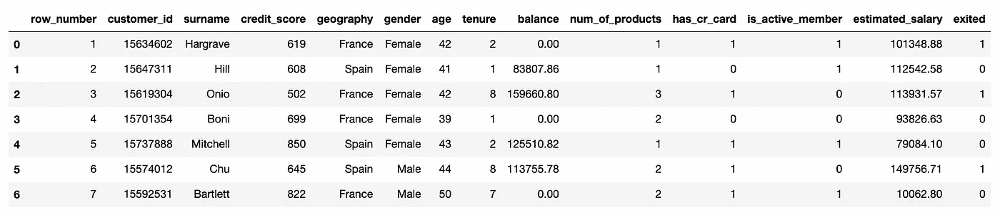

数据集列出了客户及其特征：信用评分、居住国家、年龄和性别、客户账户余额等。此外，我们还知道每个客户是否流失——参数`exited`。

我们的主要目标是找出对流失客户数量影响最大的客户细分群体。在此之后，我们可以尝试了解这些用户群体特有的问题。如果我们专注于解决这些细分群体的问题，我们将对流失客户数量产生最大的影响。

为了简化计算和解释，我们将把细分群体定义为一组过滤条件，例如，`gender = Male` 或 `gender = Male, country = United Kingdom`。

我们将处理离散特征，因此我们需要将连续指标（如`age`或`balance`）进行转换。为此，我们可以查看分布并定义合适的桶。例如，让我们看看年龄。

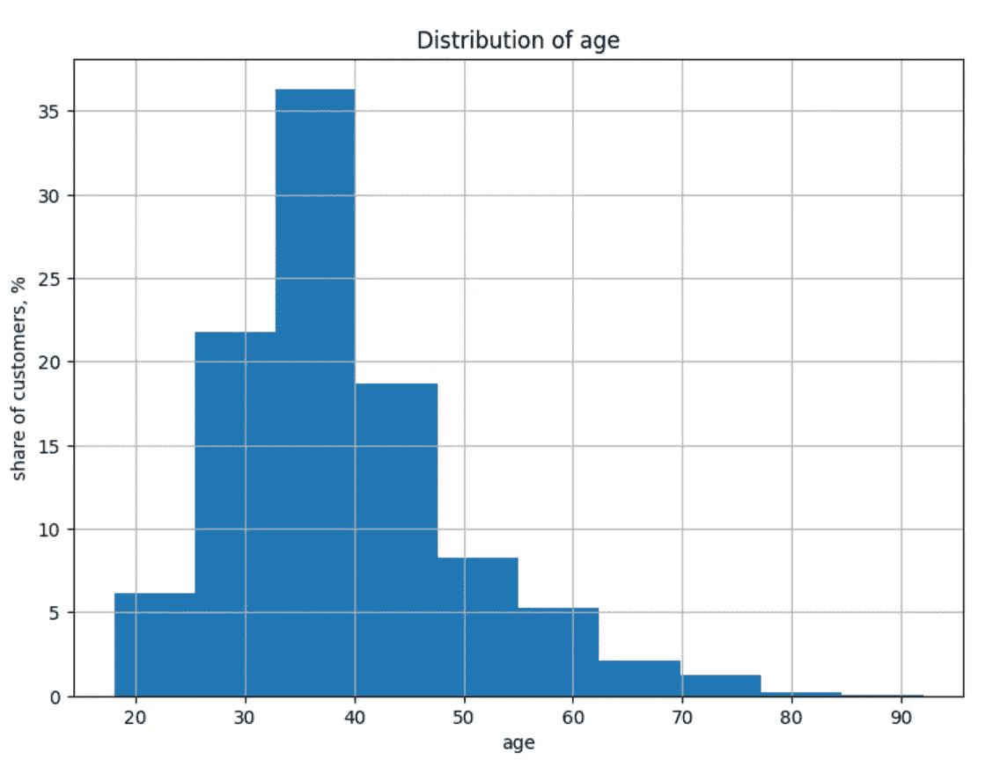

图表由作者提供

*分桶连续特征的代码示例*

```py
 def get_age_group(a):
    if a < 25:
        return '18 - 25'
    if a < 35:
        return '25 - 34'
    if a < 45:
        return '35 - 44'
    if a < 55:
        return '45 - 54'
    if a < 65:
        return '55 - 64'
    return '65+'

raw_df['age_group'] = raw_df.age.map(get_age_group)
```

找到数据中有趣的细分群体的最直接方法是查看可视化。我们可以通过柱状图或热图查看按一个或两个维度分割的流失率。

让我们看看年龄与流失之间的关系。35 岁以下的客户流失率较低——不到 10%。而 45 到 64 岁的客户则保留率最差——几乎一半的客户已经流失。

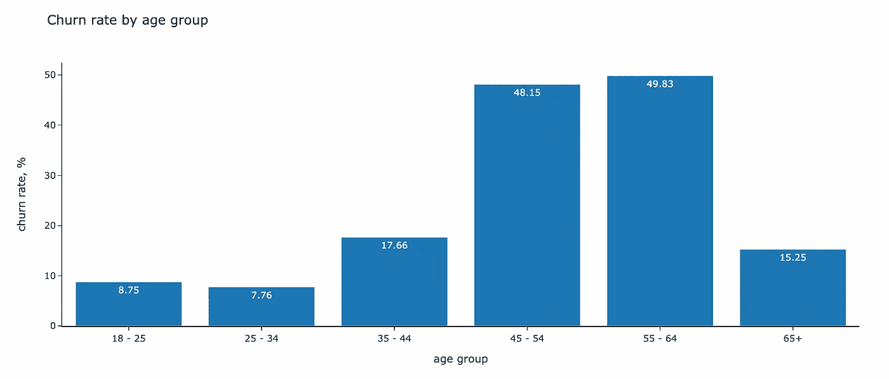

图表由作者提供

我们可以再添加一个参数（`gender`）以尝试发现更复杂的关系。条形图无法显示二维关系，因此我们可以切换到热图。

女性的流失率在所有年龄组中都较高，因此性别是一个重要因素。

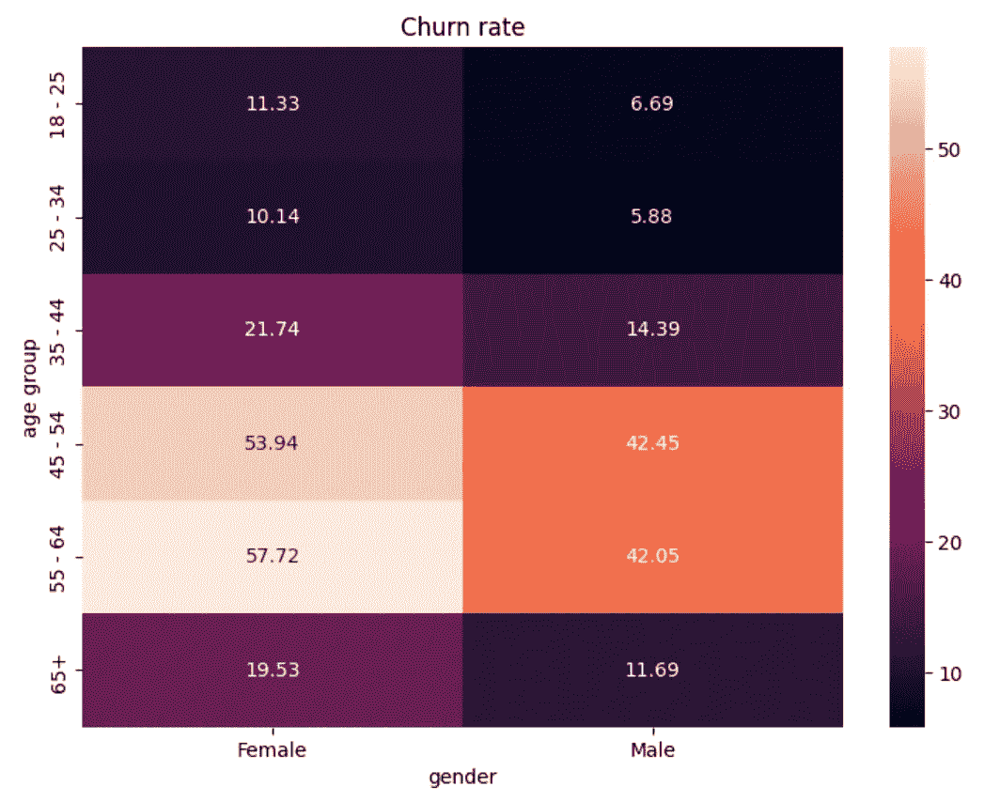

作者的图表

这样的可视化可以非常有洞察力，但这种方法有几个问题：

+   我们没有考虑到细分市场的规模，

+   查看所有可能的特征组合可能会非常耗时，

+   在一个图表中可视化超过两个维度是有挑战性的。

所以，让我们转向更结构化的方法，这将帮助我们得到一个优先级排序的有趣细分市场列表，并估算其效果。

# 常识性方法

## 假设

我们如何计算修复特定细分市场问题的潜在影响？我们可以将其与流失率较低的“理想”情景进行比较。

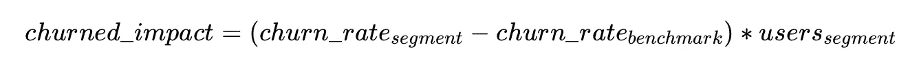

你可能会想我们如何估算流失率的基准。有几种方法可以做到这一点：

+   **来自市场的基准：** 你可以尝试寻找你所在领域中产品的典型流失率水平，

+   **你产品中的高表现细分市场：** 通常，你会有一些表现稍好的细分市场（例如，你可以按国家或平台进行划分），你可以将它们作为基准，

+   **平均值：** 最保守的方法是查看全球平均值，并估算达到所有细分市场的平均流失率的潜在效果。

我们还是安全起见，使用我们数据集中流失率的平均值作为基准——20.37%。

## 列出所有可能的细分市场

下一步是构建所有可能的细分市场。我们的数据集有十个维度，每个维度有 3–6 个独特值。总的组合数大约是 120 万。即使我们只有少数几个维度和不同的值，这看起来计算成本也很高。在实际任务中，你通常会有几十个特征和独特值。

我们确实需要考虑一些性能优化。否则，我们可能需要花费数小时等待结果。以下是减少计算的几个小贴士：

+   首先，我们不需要构建所有可能的组合。将深度限制在 4–6 层是合理的。你的产品团队需要关注由 42 个不同过滤器定义的用户细分市场的可能性非常低。

+   其次，我们可以定义我们感兴趣的效果规模。假设我们希望将保留率提高至少 1 个百分点。这意味着我们对少于 1%用户的细分市场不感兴趣。如果细分市场的规模低于这个阈值，我们可以停止进一步划分——这将减少操作次数。

+   最后但同样重要的是，你可以在实际数据集中显著减少数据大小和计算资源的消耗。为此，你可以将每个维度的小特征分组到一个`other`组。例如，有数百个国家，每个国家用户的比例通常遵循[齐夫定律](https://en.wikipedia.org/wiki/Zipf's_law)，像许多其他真实数据关系一样。因此，你会有很多国家的用户占比低于 1%。正如我们之前讨论的，我们对这些小用户群体不感兴趣，可以将它们全部分组到一个`country = other`片段中，以简化计算。

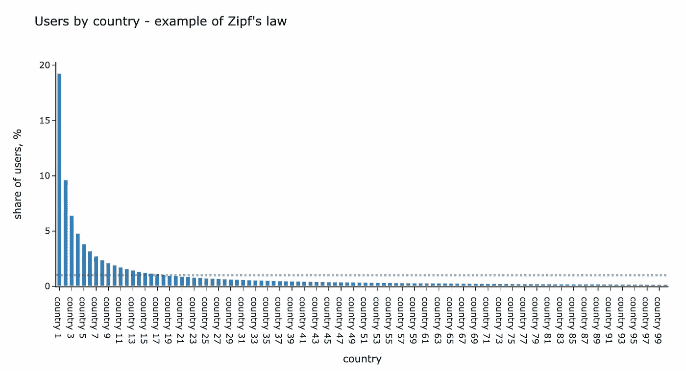

作者绘制的图表

我们将使用递归来构建所有筛选器的组合，直到`max_depth`。我喜欢这个计算机科学的概念，因为在许多情况下，它可以优雅地解决复杂问题。不幸的是，数据分析师很少需要编写递归代码——我可以回忆起在 10 年的数据分析经验中遇到的三个任务。

递归的概念非常简单——就是在执行过程中你的函数调用自身。当你处理层级结构或图形时，它非常有用。如果你想了解更多关于 Python 中递归的内容，可以阅读[这篇文章](https://betterprogramming.pub/recursion-in-python-32d464653984)。

在我们的案例中，高层概念如下：

+   我们从整个数据集和没有筛选器开始。

+   然后我们尝试添加一个额外的筛选器（如果片段大小足够大且我们还没有达到最大深度），并将我们的函数应用于此。

+   重复前一步骤，直到条件有效。

```py
 num_metric = 'exited'
denom_metric = 'total'
max_depth = 4

def convert_filters_to_str(f):
    lst = []
    for k in sorted(f.keys()):
        lst.append(str(k) + ' = ' + str(f[k]))

    if len(lst) != 0:
        return ', '.join(lst)
    return ''

def raw_deep_dive_segments(tmp_df, filters):
    # return segment
    yield {
        'filters': filters,
        'numerator': tmp_df[num_metric].sum(),
        'denominator': tmp_df[denom_metric].sum()
    }

    # if we haven't reached max_depth then we can dive deeper
    if len(filters) < max_depth:
        for dim in dimensions:
            # check if this dimensions has already been used
            if dim in filters:
                continue

            # deduplication of possible combinations
            if (filters != {}) and (dim < max(filters.keys())):
                continue

            for val in tmp_df[dim].unique():
                next_tmp_df = tmp_df[tmp_df[dim] == val]

                # checking if segment size is big enough
                if next_tmp_df[denom_metric].sum() < min_segment_size:
                    continue

                next_filters = filters.copy()
                next_filters[dim] = val

                # executing function for subsequent segment
                for rec in raw_deep_dive_segments(next_tmp_df, next_filters):
                    yield rec

# aggregating all segments for dataframe
segments_df = pd.DataFrame(list(raw_deep_dive_segments(df, {})))
```

结果是，我们得到了大约 10K 个片段。现在我们可以计算每个片段的预计效果，筛选出具有负面效果的片段，并查看潜在影响最大的用户群体。

```py
baseline_churn = 0.2037
segments_df['churn_share'] = segments_df.churn/segments_df.total
segments_df['churn_est_reduction'] = (segments_df.churn_share - baseline_churn)\
    *segments_df.total
segments_df['churn_est_reduction'] = segments_df['churn_est_reduction']\
  .map(lambda x: int(round(x)))

filt_segments_df = segments_df[segments_df.churn_est_reduction > 0]\
    .sort_values('churn_est_reduction', ascending = False).set_index('segment')
```

这应该是一个能提供所有答案的圣杯。但等等，那里有太多重复的片段和相互接续的片段。我们能否减少重复，只保留最有信息量的用户群体？

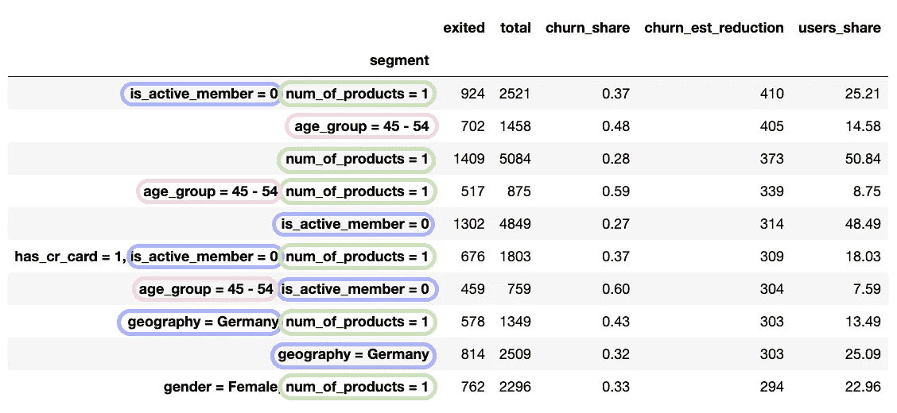

## 梳理

让我们看几个例子。

子片段`age_group = 45–54, gender = Male`的流失率低于`age_group = 45–54`。添加`gender = Male`筛选器并没有使我们更接近具体问题。因此，我们可以排除这些情况。

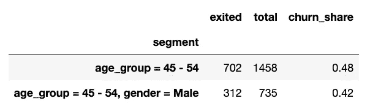

下面的例子显示了相反的情况：子片段的流失率显著更高，而且更重要的是，子片段包括了来自父节点的 80% 流失客户。在这种情况下，合理的做法是排除`credit_score_group = poor, tenure_group = 8+`片段，因为主要问题在于`is_active_member = 0`组中。

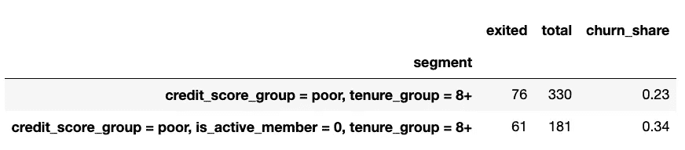

让我们筛选掉那些不那么有趣的片段。

```py
import statsmodels.stats.proportion

# getting all parent - child pairs
def get_all_ancestors_recursive(filt):
    if len(filt) > 1:
        for dim in filt:
            cfilt = filt.copy()
            cfilt.pop(dim)
            yield cfilt
            for f in get_all_ancestors_recursive(cfilt):
                yield f

def get_all_ancestors(filt):
    tmp_data = []
    for f in get_all_ancestors_recursive(filt):
        tmp_data.append(convert_filters_to_str(f))
    return list(set(tmp_data))

tmp_data = []

for f in tqdm.tqdm(filt_segments_df['filters']):
    parent_segment = convert_filters_to_str(f)
    for af in get_all_ancestors(f):
        tmp_data.append(
            {
                'parent_segment': af,
                'ancestor_segment': parent_segment
            }
        )

full_ancestors_df = pd.DataFrame(tmp_data)

# filter child nodes where churn rate is lower 

filt_child_segments = []

for parent_segment in tqdm.tqdm(filt_segments_df.index):
    for child_segment in full_ancestors_df[full_ancestors_df.parent_segment == parent_segment].ancestor_segment:
        if child_segment in filt_child_segments:
            continue

        churn_diff_ci = statsmodels.stats.proportion.confint_proportions_2indep(
            filt_segments_df.loc[parent_segment][num_metric],
            filt_segments_df.loc[parent_segment][denom_metric],
            filt_segments_df.loc[child_segment][num_metric],
            filt_segments_df.loc[child_segment][denom_metric]
        )

        if churn_diff_ci[0] > -0.00:
            filt_child_segments.append(
                {
                    'parent_segment': parent_segment,
                    'child_segment': child_segment
                }
            )

filt_child_segments_df = pd.DataFrame(filt_child_segments)
filt_segments_df = filt_segments_df[~filt_segments_df.index.isin(filt_child_segments_df.child_segment.values)]

# filter parent nodes where churn rate is lower 

filt_parent_segments = []

for child_segment in tqdm.tqdm(filt_segments_df.index):
    for parent_segment in full_ancestors_df[full_ancestors_df.ancestor_segment == child_segment].parent_segment:
        if parent_segment not in filt_segments_df.index:
            continue

        churn_diff_ci = statsmodels.stats.proportion.confint_proportions_2indep(
            filt_segments_df.loc[parent_segment][num_metric],
            filt_segments_df.loc[parent_segment][denom_metric],
            filt_segments_df.loc[child_segment][num_metric],
            filt_segments_df.loc[child_segment][denom_metric]
        )
        child_coverage = filt_segments_df.loc[child_segment][num_metric]/filt_segments_df.loc[parent_segment][num_metric]

        if (churn_diff_ci[1] < 0.00) and (child_coverage >= 0.8):
            filt_parent_segments.append(
                {
                    'parent_segment': parent_segment,
                    'child_segment': child_segment
                }
            )  

filt_parent_segments_df = pd.DataFrame(filt_parent_segments)
filt_segments_df = filt_segments_df[~filt_segments_df.index.isin(filt_parent_segments_df.parent_segment.values)]
```

现在我们有大约 4000 个有趣的段。对于这个玩具数据集，我们在处理后看到顶级段几乎没有差异。然而，使用现实数据时，这些努力往往会有所回报。

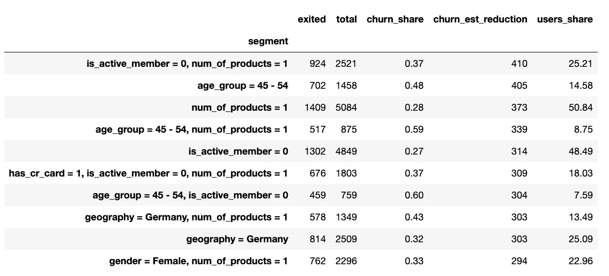

## 根本原因

我们可以做的最后一件事是保留我们段的根节点。这些段是根本原因，其他段被包含在其中。如果你想更深入地了解其中一个根本原因，请查看子节点。

为了仅获取根本原因，我们需要消除最终有兴趣的列表中所有具有父节点的段。

```py
root_segments_df = filt_segments_df[~filt_segments_df.index.isin(
    full_ancestors_df[full_ancestors_df.parent_segment.isin(
        filt_segments_df.index)].ancestor_segment
    )
]
```

所以，就是这样，现在我们有一个需要关注的用户组列表。由于数据中复杂的关系较少，顶级段仅为一维段，因为只有少数特征可以解释全部效果。

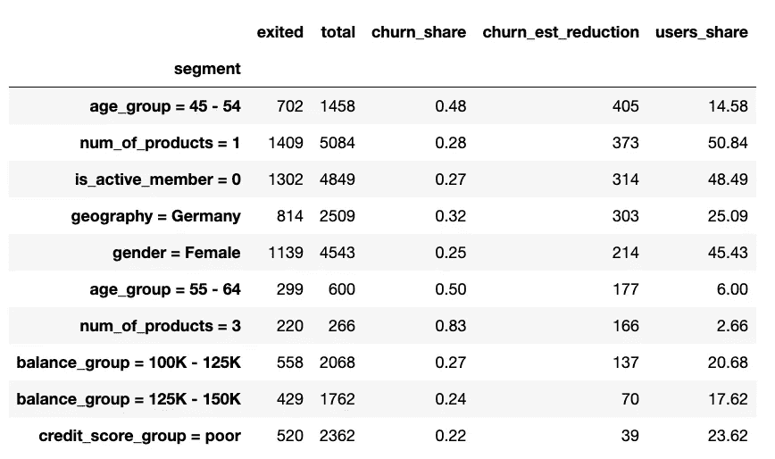

讨论我们如何解释结果是至关重要的。我们得到了一个客户段列表及其估算的影响。我们的估算基于这样的假设：我们可以将整个段的流失率降低到基准水平（在我们的示例中是平均值）。因此，我们估算了修复每个用户组问题的影响。

你必须记住，这种方法仅提供了一个关于关注哪些用户组的高层次视图。它并没有考虑是否能够完全解决这些问题。

我们写了很多代码来获得结果。也许还有另一种使用数据科学和机器学习来解决此任务的方法，不需要如此多的努力。

# 披萨时间

实际上，还有另一种方法。我们在 Wise 的数据科学团队开发了一个库[***Wise Pizza***](https://github.com/transferwise/wise-pizza#readme)，可以在一瞬间找到最引人注目的段。它是基于 Apache 2.0 许可证的开源库，因此你也可以用于你的任务。

> 如果你有兴趣了解更多关于**Wise Pizza**库的信息，不要错过 Egor 在[数据科学节](https://datasciencefestival.com/session/unleashing-wisepizza-finding-unusual-segments-in-your-data/)上的演讲。

## 应用 Wise Pizza

这个库很容易使用。你只需编写几行代码，并指定你想要的维度和段的数量即可。

```py
# pip install wise_pizza - for installation
import wise_pizza

# building a model 
sf = wise_pizza.explain_levels(
    df=df,
    dims=dimensions,
    total_name="exited",
    size_name="total",
    max_depth=4,
    min_segments=15,
    solver="lasso"
)

# making a plot
sf.plot(width=700, height=100, plot_is_static=False)
```

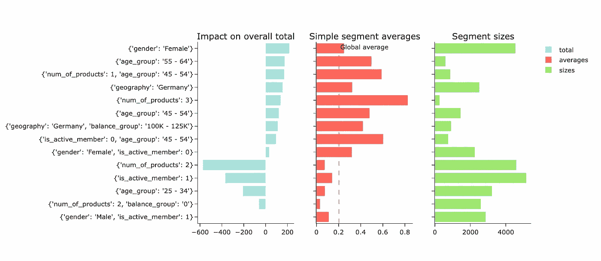

作者绘制的图表

因此，我们还得到了一个最有趣的段及其对我们产品流失的潜在影响的列表。这些段类似于我们使用之前的方法获得的段。然而，影响估算差异很大。为了正确解释**Wise Pizza**的结果并理解这些差异，我们需要更详细地讨论它的工作原理。

## 它的工作原理

这个库基于 Lasso 和 LP 求解器。如果我们简化它，这个库的功能类似于 one-hot 编码，为分段（之前计算的相同分段）添加标志，然后使用 Lasso 回归，目标变量是流失率。

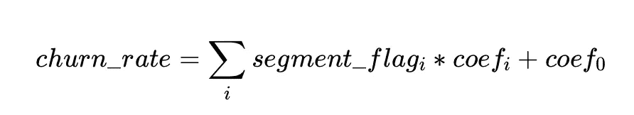

正如你可能从机器学习中记得的，Lasso 回归倾向于有许多零系数，选择少数显著因素。***Wise Pizza***找到合适的`alpha`系数用于 Lasso 回归，从而得到指定数量的分段结果。

> 对于修订 Lasso（L1）和 Ridge（L2）正则化，你可以参考[这篇文章](https://pub.towardsai.net/lasso-l1-and-ridge-l2-regularization-techniques-33b7f12ac0b)。

## 如何解释结果

影响的估算是系数与分段大小的乘积结果。

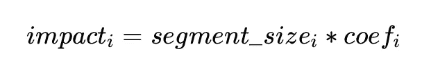

正如你所见，这与我们之前估算的完全不同。常识方法估算了彻底解决用户组问题的影响，而 Wise Pizza 的影响显示了对其他选择分段的递增效果。

这种方法的优势在于你可以汇总不同的效果。然而，你在解释结果时需要准确，因为每个分段的影响依赖于其他选择的分段，因为它们可能是相关的。例如，在我们的案例中，我们有三个相关的分段：

+   `age_group = 45-54`

+   `num_of_products = 1, age_group = 44–54`

+   `is_active_member = 1, age_group = 44–54`。

对于`age_group = 45–54`的影响考虑了整个年龄组的潜在效果，而其他估算方法则从特定子组中估算附加影响。这些依赖关系可能会导致结果差异，因为`min_segments`参数会影响最终分段及其之间的相关性。

关注整体情况并正确解释***Wise Pizza***结果至关重要。否则，你可能会得出错误的结论。

我认为这个库是从数据中快速获得见解和首批分段候选项的宝贵工具。然而，如果我需要进行机会规模评估和更稳健的分析，以便与我的产品团队分享我们关注的潜在影响，我仍会使用常识方法和合理的基准，因为这样更容易解释。

# **TL;DR**

1.  在数据中找到有趣的切片是分析师的常见任务（尤其是在发现阶段）。幸运的是，你不需要制作大量图表来解决这些问题。有一些更全面且易于使用的框架。

1.  你可以使用[***Wise Pizza***](https://github.com/transferwise/wise-pizza#readme) ML 库来快速洞察对平均值影响最大的细分领域（*它还允许你查看两个数据集之间的差异*）。我通常使用它来获取第一个有意义的维度和细分领域列表。

1.  ML 方法可以在一瞬间为你提供高层次的视图和优先级。然而，我建议你注意结果的解释，并确保你和你的利益相关者完全理解它。然而，如果你需要对修复整个用户组问题对 KPI 的潜在影响进行全面估算，使用基于算术的传统常识方法是值得的。

> 非常感谢你阅读这篇文章。我希望它对你有启发。如果你有任何后续问题或评论，请不要犹豫在评论区留言。
