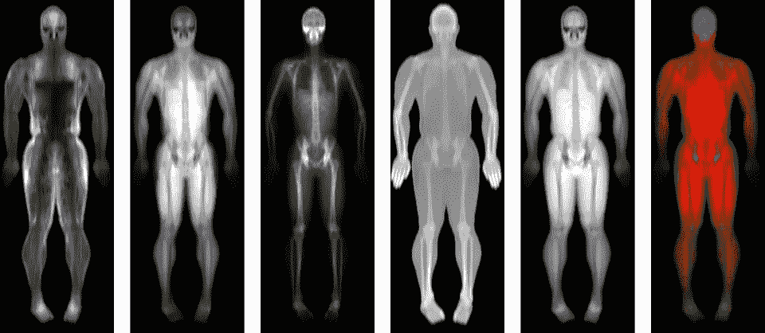

# 最终的 DXA 国家

> 原文：[`towardsdatascience.com/final-dxa-nation-f0309d718980?source=collection_archive---------2-----------------------#2023-07-22`](https://towardsdatascience.com/final-dxa-nation-f0309d718980?source=collection_archive---------2-----------------------#2023-07-22)

## 纵向基于图像的 AI 模型在健康和医学中的应用

## AI 可以看到结局！深度学习通过单次和顺序身体成分成像预测全因死亡率

 [Lambert T Leong, PhD](https://lambertleong.medium.com/?source=post_page-----f0309d718980--------------------------------)

·

[关注](https://medium.com/m/signin?actionUrl=https%3A%2F%2Fmedium.com%2F_%2Fsubscribe%2Fuser%2F60c1d532d2c0&operation=register&redirect=https%3A%2F%2Ftowardsdatascience.com%2Ffinal-dxa-nation-f0309d718980&user=Lambert+T+Leong%2C+PhD&userId=60c1d532d2c0&source=post_page-60c1d532d2c0----f0309d718980---------------------post_header-----------) 发表在 [Towards Data Science](https://towardsdatascience.com/?source=post_page-----f0309d718980--------------------------------) ·9 分钟阅读·2023 年 7 月 22 日

--

DXA 成像提供了多种身体成分可视化类型。（图片来源于作者）

## 关键点，总结：

+   身体成分成像与元数据（例如年龄、性别、握力、步速等）的结合产生了最佳的 10 年死亡率预测

+   总体而言，纵向或顺序模型的表现优于单一记录模型，突出了在健康数据中建模变化和时间依赖性的重要性。

+   纵向模型有潜力提供对健康状况的更全面评估

+   [**阅读论文**](https://www.nature.com/articles/s43856-022-00166-9)

人工智能（AI）和机器学习（ML）正在革新医疗保健，推动我们迈向精准医疗时代。开发 AI 健康模型的动机是减少死亡和疾病，并延长高质量的生活。经过良好训练的模型能够更彻底地分析呈现的数据，从而提供对个人健康的更全面评估。

# 单次记录与纵向模型
