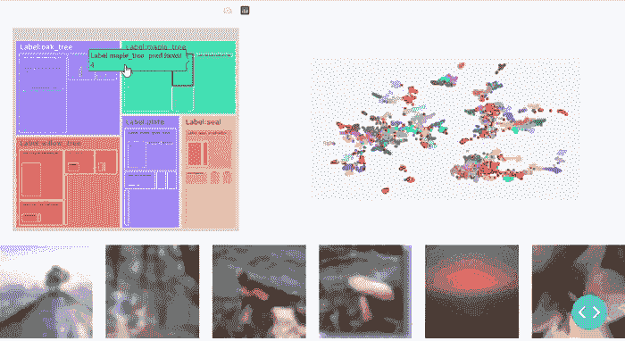
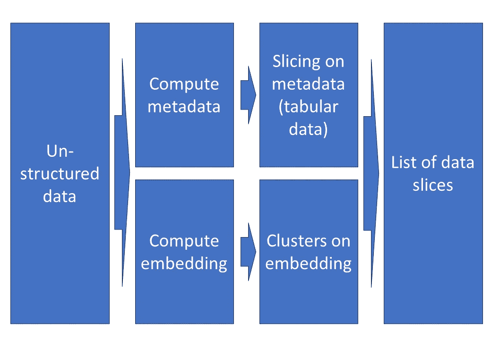
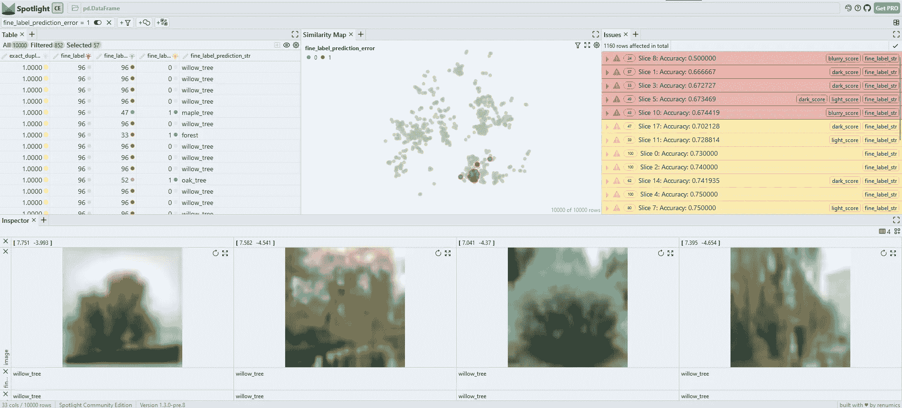
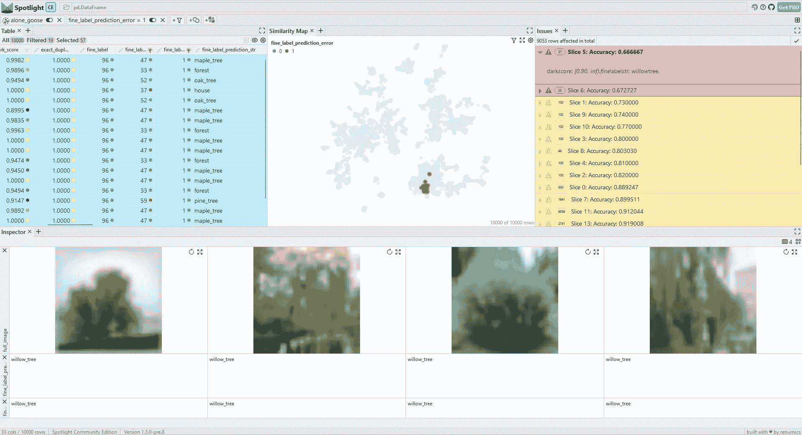
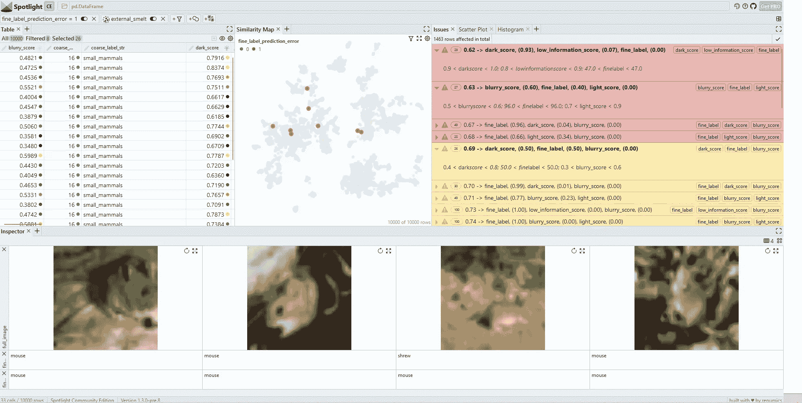

# 在非结构化数据中找到数据切片

> 原文：[`towardsdatascience.com/finding-data-slices-in-unstructured-data-f36244bb044e?source=collection_archive---------7-----------------------#2023-08-18`](https://towardsdatascience.com/finding-data-slices-in-unstructured-data-f36244bb044e?source=collection_archive---------7-----------------------#2023-08-18)

## 简要介绍了数据切片方法，包括对 CIFAR-100 数据集的实际操作示例。

[](https://medium.com/@stefan.suwelack?source=post_page-----f36244bb044e--------------------------------)[](https://towardsdatascience.com/?source=post_page-----f36244bb044e--------------------------------) [Stefan Suwelack](https://medium.com/@stefan.suwelack?source=post_page-----f36244bb044e--------------------------------)

·

[关注](https://medium.com/m/signin?actionUrl=https%3A%2F%2Fmedium.com%2F_%2Fsubscribe%2Fuser%2Faa4f0c2a0e38&operation=register&redirect=https%3A%2F%2Ftowardsdatascience.com%2Ffinding-data-slices-in-unstructured-data-f36244bb044e&user=Stefan+Suwelack&userId=aa4f0c2a0e38&source=post_page-aa4f0c2a0e38----f36244bb044e---------------------post_header-----------) 发表在 [Towards Data Science](https://towardsdatascience.com/?source=post_page-----f36244bb044e--------------------------------) ·9 min read·2023 年 8 月 18 日[](https://medium.com/m/signin?actionUrl=https%3A%2F%2Fmedium.com%2F_%2Fvote%2Ftowards-data-science%2Ff36244bb044e&operation=register&redirect=https%3A%2F%2Ftowardsdatascience.com%2Ffinding-data-slices-in-unstructured-data-f36244bb044e&user=Stefan+Suwelack&userId=aa4f0c2a0e38&source=-----f36244bb044e---------------------clap_footer-----------)

--

[](https://medium.com/m/signin?actionUrl=https%3A%2F%2Fmedium.com%2F_%2Fbookmark%2Fp%2Ff36244bb044e&operation=register&redirect=https%3A%2F%2Ftowardsdatascience.com%2Ffinding-data-slices-in-unstructured-data-f36244bb044e&source=-----f36244bb044e---------------------bookmark_footer-----------)

CIFAR100 中的数据切片。来源：作者创作。

# tl;dr:

数据切片是数据中具有语义意义的子集，在这些子集中，模型的表现异常。当处理非结构化数据问题（例如图像、文本）时，找到这些切片是每个数据科学家的重要工作。在实践中，这项任务涉及大量的个人经验和手工工作。在本文中，我们介绍了一些使数据切片发现更加系统化和高效的方法和工具。我们讨论了当前的挑战，并展示了一些基于开源工具的实际操作示例工作流。

> 有一个基于 CIFAR100 数据集的[互动演示](https://huggingface.co/spaces/renumics/cifar100-sliceguard-demo)可用。

# 介绍

调试、测试和监控人工智能（AI）系统很困难。大多数[软件 2.0](https://karpathy.medium.com/software-2-0-a64152b37c35)开发过程中的工作都花在了策划高质量数据集上。

开发强大机器学习（ML）算法的一个重要策略是识别所谓的数据切片。数据切片是语义上有意义的子集，其中模型表现异常。识别和跟踪这些数据片段是每个以数据为中心的 AI 开发过程的核心。它也是在医疗保健和自动驾驶辅助系统等领域部署安全 AI 解决方案的核心方面。

传统上，寻找数据切片一直是数据科学家工作的重要组成部分。在实践中，寻找数据切片很大程度上依赖于数据科学家的个人经验和领域知识。随着以数据为中心的人工智能（AI）运动的发展，许多当前的工作和工具旨在使这一过程更加系统化。

在本文中，我们概述了在非结构化数据上找到数据切片的当前状态。我们特别展示了一些基于开源工具的实际操作示例工作流程。

# 什么是切片查找？

数据科学家一直在使用简单的手动切片查找技术。最著名的例子可能是混淆矩阵，这是一种用于分类问题的调试方法。在实践中，切片查找过程依赖于预计算的启发式方法、数据科学家的个人经验以及大量的互动数据探索。

一个经典的数据切片可以通过对表格特征或元数据的谓词连接来描述。在一个人员数据集中，这可能是某个年龄范围内的男性，身高超过 1.85 米。在一个发动机状态监测数据集中，一个数据切片可能由某个转速、操作时间和扭矩范围的数据点组成。

在非结构化数据的情况下，语义数据切片定义可能更加隐含：它可以是人类可理解的描述，如“*在山区的弯曲道路上，轻微降雨情况下的驾驶场景*”。

在非结构化数据集上识别数据切片可以通过两种不同的方式进行：

1.  可以使用经典信号处理算法（例如黑暗图像、低信噪比音频）或用于自动标记的预训练深度神经网络从非结构化数据中提取元数据。然后可以在这些元数据上进行切片查找。

1.  嵌入空间中的潜在表示可以用于对数据集群进行分组。这些集群可以被检查以直接识别相关的数据切片。



识别非结构化数据上的数据切片的工作流程。来源：作者创建。

自动化切片发现技术总是试图在切片的支持度（应该很大）和模型性能异常的严重性（也应该很大）之间取得平衡。

表格数据上的切片发现方法与决策树有很多相似之处：在机器学习模型分析的背景下，这两种技术都可以用来制定描述模型错误存在位置的规则。然而，有一个重要的区别：切片发现问题允许重叠切片。这使得问题在计算上变得困难，因为更难以修剪搜索空间。

# 为什么数据切片发现很重要？

尤其是在过去十年中，机器学习社区从基准数据集中受益匪浅：从 ImageNet 开始，这些数据集和竞赛成为深度学习算法在非结构化数据问题上的成功因素。在这种背景下，新算法的质量通常基于极少的定量指标，如 F1 分数或平均精度。

随着越来越多的机器学习模型投入生产，现实世界的数据集与其基准数据集的差异变得显而易见：真实数据通常非常嘈杂和不平衡，但也富含元数据。对于某些用例，清理和标注这些数据集可能代价高昂。

许多团队发现，迭代训练数据集并监控生产中的漂移对于构建和维护安全的 AI 系统是必要的。

发现数据切片是这一迭代过程的核心部分。只有了解模型的失败点，才能提升系统性能：通过收集更多数据、纠正错误标签、选择最佳特征或简单地限制系统的操作领域。

# 为什么数据切片发现如此困难？

切片发现的一个关键方面是其计算复杂性。我们可以通过一个小例子来说明这一点：考虑 n 个二进制特征，采用独热编码（例如，通过分箱或重新编码获得）。那么所有可能特征组合的搜索空间是 O(2^n)。这种指数性质意味着通常使用启发式方法来进行修剪。因此，自动化切片发现不仅需要很长时间（取决于特征数量），而且输出不会是一个最优稳定的解决方案，而是一些启发式方法。

在 AI 开发过程中，模型性能差常常源于不同的根本原因。鉴于机器学习模型的固有随机性，这很容易导致需要手动检查和验证的虚假发现。因此，即使一个切片发现技术可以产生理论上最优的结果，其结果仍必须经过人工检查和验证。为跨职能团队提供高效工具是许多机器学习团队的瓶颈。

我们已经指出，通常希望找到具有大支持的切片，但也希望从数据集基线中获得显著的模型性能差距。不同数据切片之间的关系通常是层次性的。在自动切片查找过程中和互动审查阶段处理这些层次结构是相当具有挑战性的。

自动切片查找方法在元数据丰富的问题上最为有效。这通常是实际问题的情况。相比之下，基准数据集在元数据方面总是相当稀疏。这主要有两个原因：数据保护和匿名化要求。由于缺乏合适的示例数据集，开发和展示有效的切片查找工作流变得非常困难。

我们（不幸地）必须在接下来的示例部分中处理这一挑战。

# 实践操作：在 CIFAR-100 上查找数据切片

CIFAR-100 数据集是一个成熟的计算机视觉基准。我们在本教程中使用它，因为它的体积小，易于处理，并且计算需求低。结果也易于理解，因为它们不需要特殊的领域知识。

不幸的是，CIFAR-100 已经非常平衡，经过高度整理且缺乏有意义的元数据。因此，我们在本节中生成的切片查找工作流的结果不如在实际环境中有意义。然而，所呈现的工作流应足以理解如何快速在实际数据中使用它们。

在准备步骤中，我们使用 [Cleanvision](https://github.com/cleanlab/cleanvision) 库计算图像元数据。有关此增强的更多信息，请参阅我们的 [数据驱动 AI 操作手册](https://renumics.com/docs/playbook/cv-issues)。

我们还定义了一些重要的变量用于数据切片分析：待分析的特征以及标签和预测列的名称：

大多数切片技术仅适用于分箱特征。由于 SliceLine 和 WisePizza 库本身不提供分箱功能，我们将其作为预处理步骤：

# SliceLine

[Sliceline 算法](https://mboehm7.github.io/resources/sigmod2021b_sliceline.pdf) 是由 Sagadeeva 等人于 2021 年提出的。它旨在处理包含许多特征的大型表格数据集。它利用基于稀疏线性代数技术的新型剪枝技术，并允许在单台机器上快速查找数据切片。

在本教程中，我们使用 [SliceLine 实现](https://github.com/DataDome/sliceline) 来自 DataDome 团队。它运行非常稳定，但目前仅支持 Python 版本 <=3.9。

SliceLine 算法的大多数参数非常简单：切片的最小支持度 (*min_sup*)、定义切片的最大谓词数 (*max_l*) 和要返回的切片的最大数量 (*k*)。参数 *alpha* 为切片错误的重要性分配权重，并且基本控制切片大小与错误降低之间的权衡。

我们调用 SliceLine 库以获取 20 个最有趣的切片：

为了交互式探索切片，我们丰富了每个数据切片的描述：

我们启动 Spotlight 以交互式探索数据切片。你可以直接在 [Huggingface 空间](https://huggingface.co/spaces/renumics/cifar100-sliceline-demo) 体验结果。



图 3：通过 SliceLine 生成的数据切片进行交互式探索。一个 [互动演示](https://huggingface.co/spaces/renumics/cifar100-sliceline-demo) 在 Huggingface 上可以使用。来源：作者创建。

我们发现 Sliceline 算法确实在 CIFAR-100 数据集中找到了有意义的数据切片。*枫树*、*柳树* 和 *橡树* 类别似乎存在问题。我们还发现，这些类别中具有较高 *暗色评分* 的数据点尤其具有挑战性。经过仔细检查，我们发现这是因为背景明亮的树木对模型来说很困难。

# Wise Pizza

[WisePizza](https://github.com/transferwise/wise-pizza) 是 Wise 团队最近开发的工具。它旨在发现和可视化表格数据中的有趣数据切片。核心思想是使用 Lasso 回归为每个切片找到重要性系数。有关 Wise Pizza 工作原理的更多信息，请参阅 博客文章。

重要的是要注意，WisePizza 并不是作为机器学习调试工具开发的。相反，它主要旨在支持 EDA 过程中的分段分析。这就是为什么可以手动定义段候选项并为其分配权重。在我们的实验中，我们直接在数据集上运行 WisePizza，并将每个数据点的权重设置为 1：

为了探索我们非结构化数据集中的问题，我们以与 Sliceline 示例相同的方式提取问题。



图 4：WisePizza 还识别出柳树类别具有较大暗色评分的问题。然而，这些切片的细粒度不如 SliceLine 结果。来源：作者创建。

从图 4 中我们可以看到，在简单的 CIFAR-100 基准数据集上，WisePizza 找到了相关的片段：它还列出了带有高 *dark score* 的 *willow tree* 类作为顶部切片。然而，以下结果仅限于不同的类别，并且不像 SliceLine 输出那样细粒度。一个原因是 WisePizza 算法没有直接提供切片支持和准确性下降之间的加权机制。

# Sliceguard

[Sliceguard](https://github.com/Renumics/sliceguard) 库使用 [层次聚类](https://arxiv.org/abs/2203.12997) 来确定可能的数据切片。然后，使用公平学习的方法对这些聚类进行排序，并通过可解释 AI 技术挖掘谓词。有关 Sliceguard 的更多信息可以在 [这篇博客文章](https://medium.com/@daniel-klitzke/fast-audio-machine-learning-model-debugging-using-embedding-space-clustering-1fc1ca232592) 中找到。

我们构建 Sliceguard 的主要原因是它不仅适用于表格数据，还能直接应用于嵌入。该库提供了大量内置功能用于预处理（如分箱）和后处理。

我们可以用几行代码在 CIFAR-100 上运行 Sliceguard：

Sliceguard 使用 [Spotlight](https://renumics.com/docs/getting-started) 提供识别的数据切片的互动可视化：

```py
issue_df, issues = sg.report(spotlight_dtype={"image": Image})
```

Sliceguard 可以在 CIFAR-100 数据集上揭示细粒度的数据切片（图 5）。除了之前发现的树类数据切片外，我们还识别了其他问题（如 *mouse* 类）。



图 5：Sliceguard 揭示了细粒度的数据切片。在 Huggingface 上提供了一个 [互动演示](https://huggingface.co/spaces/renumics/cifar100-sliceline-demo)。来源：作者创建。

# 结论

我们介绍了三种开源工具，用于挖掘数据切片。即使在简单的 CIFAR-100 基准上，它们也可以快速揭示关键数据片段。识别这些数据切片是理解模型失败模式和改善训练数据集的重要步骤。

[SliceLine](https://github.com/DataDome/sliceline) 工具适用于表格数据，并通过谓词组合描述数据切片。[Sliceguard](https://github.com/Renumics/sliceguard) 不返回数学上保证的最佳谓词组合，但可以直接处理嵌入。此外，它可以在几行代码的基础上运行于非结构化数据集。

在实践中，SliceLine 和 Sliceguard 对识别数据切片非常有帮助。然而，这两种工具都不能用于完全自动化的切片分析。相反，它们提供了强大的启发式方法，可以与互动探索相结合。如果操作得当，这种方法是跨学科数据团队构建可靠 ML 系统的重要工具。

你是否有使用过展示的数据切割工具的经验，或者能否推荐其他开源库？我很乐意在评论中听到你的意见。
