# 在干草堆中找针 — Jaccard 相似度的搜索索引

> 原文：[`towardsdatascience.com/finding-needles-in-a-haystack-search-indexes-for-jaccard-similarity-db1ccdaa8d17?source=collection_archive---------4-----------------------#2023-08-18`](https://towardsdatascience.com/finding-needles-in-a-haystack-search-indexes-for-jaccard-similarity-db1ccdaa8d17?source=collection_archive---------4-----------------------#2023-08-18)

## 从基础概念到精确和近似索引

[](https://ekzhu.medium.com/?source=post_page-----db1ccdaa8d17--------------------------------)[](https://towardsdatascience.com/?source=post_page-----db1ccdaa8d17--------------------------------) [Eric Zhù](https://ekzhu.medium.com/?source=post_page-----db1ccdaa8d17--------------------------------)

·

[关注](https://medium.com/m/signin?actionUrl=https%3A%2F%2Fmedium.com%2F_%2Fsubscribe%2Fuser%2F5b549f62ef70&operation=register&redirect=https%3A%2F%2Ftowardsdatascience.com%2Ffinding-needles-in-a-haystack-search-indexes-for-jaccard-similarity-db1ccdaa8d17&user=Eric+Zh%C3%B9&userId=5b549f62ef70&source=post_page-5b549f62ef70----db1ccdaa8d17---------------------post_header-----------) 发表在 [Towards Data Science](https://towardsdatascience.com/?source=post_page-----db1ccdaa8d17--------------------------------) · 15 分钟阅读 · 2023 年 8 月 18 日

--

[](https://medium.com/m/signin?actionUrl=https%3A%2F%2Fmedium.com%2F_%2Fbookmark%2Fp%2Fdb1ccdaa8d17&operation=register&redirect=https%3A%2F%2Ftowardsdatascience.com%2Ffinding-needles-in-a-haystack-search-indexes-for-jaccard-similarity-db1ccdaa8d17&source=-----db1ccdaa8d17---------------------bookmark_footer-----------)

在干草堆中找针。图像由作者使用 Midjourney 制作。

向量数据库因作为大型语言模型（LLMs）的外部记忆而成为新闻话题。如今的向量数据库是建立在十年前的近似最近邻（ANN）索引研究基础上的新系统。这些索引算法处理许多高维向量（例如`float32[]`），并构建一个数据结构，支持在高维空间中找到查询向量的近似邻居。这就像 Google 地图根据你家的纬度和经度找到你邻居的房子一样，只不过 ANN 索引在更高维空间中操作。

这项研究有着几十年的历史。90 年代末，机器学习研究人员手工制作多媒体数据（如图像和音频）的数值特征。基于这些特征向量的相似性搜索成为一个自然的问题。一段时间内，研究人员涌入这一领域。这一学术泡沫在一篇开创性论文[*When is “Nearest Neighbor” Meaningful?*](https://faculty.ist.psu.edu/vhonavar/Courses/ds310/WhenIsNearestNeighborMeaningful.pdf) 发表后破裂，基本告诉大家不要浪费时间，因为在手工制作特征的高维空间中的最近邻*大多*是不具有意义的——这是另一个话题。即便如此，我仍然看到研究论文和[向量数据库基准测试](https://github.com/erikbern/ann-benchmarks)发布关于 SIFT-128 数据集的性能数据，该数据集由具有无意义相似性的手工制作特征向量组成。

尽管手工制作特征存在噪声，但研究中有一条富有成果的方向专注于一种具有意义的高维数据类型：***集合***和***Jaccard***。

在这篇文章中，我将介绍集合上 Jaccard 相似性的搜索索引。我将从基本概念开始，然后转向精确和近似索引。

# 集合和 Jaccard

集合只是不同元素的集合。你在 Spotify 上喜欢的歌曲是一个集合；你上周转发的推文是一个集合；从这篇博客文章中提取的不同令牌也形成一个集合。集合是表示数据点的一种自然方式，适用于音乐推荐、社交网络和剽窃检测等应用场景。

假设在 Spotify 上，我关注了这些艺术家：

`[the weekend, taylor swift, wasia project]`

我的女儿关注了这些艺术家：

`[the weekend, miley cyrus, sza]`

衡量我们音乐品味相似性的一个合理方法是看我们共同关注了多少艺术家——即交集大小。在这种情况下，我们都关注了`the weekend`，所以交集大小为 1。

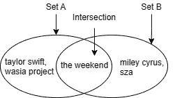

每个集合代表一个用户的关注列表。交集显示了两个用户共享的共同关注。图片由作者提供。

然而，你可以想象另一对用户每人关注 100 位艺术家，它们的交集大小仍然是 1，但他们的品味相似度应该远低于我女儿和我之间的相似度。为了使不同用户对之间的测量具有可比性，我们用并集大小来归一化交集大小。这样，我女儿和我关注的相似度为`1 / 5 = 0.2`，而另一对用户关注的相似度为`1 / 199 ~= 0.005`。这被称为 Jaccard 相似度。

对于集合`A`和集合`B`，Jaccard 相似度的公式是：

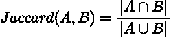

集合 A 和 B 的 Jaccard 相似度公式。

为什么集合是高维数据类型？集合可以编码为“one-hot”向量，其维度 1 对 1 映射到所有可能的元素（例如，Spotify 上的所有艺术家）。如果集合包含对应于该维度的元素，则该维度的值为 1，否则为 0。因此，我关注的艺术家的向量化集合如下所示：

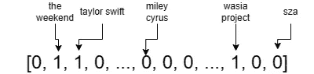

高维向量表示关注集合。图像由作者提供。

其中第二、第三和倒数第三个维度分别是`the weekend`、`taylor swift`和`wasia project`。Spotify 上有超过 1000 万的艺术家，因此这样的向量维度极高且非常稀疏——大多数维度为 0。

# Jaccard 搜索的反向索引

人们希望快速找到事物，因此计算机科学家发明了被称为索引的数据结构，以使搜索性能对软件应用程序满意。具体来说，Jaccard 搜索索引是建立在一组集合上的，给定一个查询集合，它返回与查询集合具有最高 Jaccard 相似度的`k`个集合。

Jaccard 的搜索索引基于一种称为反向索引的数据结构。反向索引具有极其简单的接口：输入一个集合元素，比如`the weekend`，它返回包含输入元素的集合 ID 列表，例如`[ 32, 231, 432, 1322, ...]`。反向索引本质上是一个查找表，其键是所有可能的集合元素，值是集合 ID 列表。在这个例子中，反向索引中的每个列表表示一个艺术家的关注者 ID。

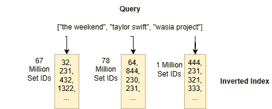

反向索引包含与查询集合匹配的集合 ID 列表。图像由作者提供。

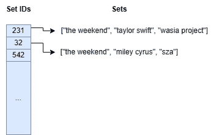

原始集合存储在一个单独的表中，以便通过其集合 ID 进行查找。图像由作者提供。

你可以看到这为什么被称为“反向索引”：它允许你从一个集合元素找到包含该元素的集合。

## 精确搜索算法

倒排索引是加速搜索的极其强大的数据结构。使用倒排索引时，在搜索时，你不需要遍历所有集合并与查询集合进行比较——如果你有数百万个集合，这会非常昂贵，你只需要处理与查询集合共享至少一个元素的集合 ID。你可以直接从倒排索引列表中获取集合 ID。

这个想法是通过以下搜索算法实现的：

```py
def search_top_k_merge_list(index, sets, q, k):
    """Search top-k Jaccard using inverted index.

    Args:
        index: an inverted index, key is set element
        sets: a lookup table for sets, key is set ID
        q: a query set
        k: search parameter k

    Returns:
        list: at most k set IDs.
    """
    # Intialize an empty lookup table for candidates.
    candidates = defaultdict(0)

    # Iterate over set elements in q.
    for x in q:
        ids = index[x]  # Get a list of set IDs from the index.
        for id in ids:
            candidates[id] += 1  # Increment count for intersection size.

    # Now candidates[id] stores the intersection size of set with ID id.

    # A simple routine for calculating Jaccard using intersection size and
    # set sizes, based on Inclusion-Exclusion principle.
    jaccard = lambda id: candidates[id] / (len(q) + len(sets(id) - candidates[id]))

    # Find the top-k candidates order by Jaccard.
    return sorted(list(candidates.keys()), key=jaccard, reverse=True)[:k]
```

用通俗的语言来说，该算法遍历查询集合中元素匹配的每个倒排索引列表，并使用候选表跟踪每个集合 ID 出现的次数。如果一个集合 ID 出现了`n`次，则索引集合与查询集合有`n`个重叠元素。最后，算法使用候选表中的所有信息来计算 Jaccard 相似度，然后返回最相似的前 k 个集合的 ID。

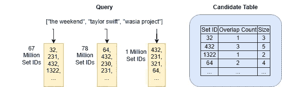

**search_top_k_merge_list**算法中的候选表用于跟踪通过倒排索引找到的索引集合的重叠计数。

当以下情况发生时，`search_top_k_merge_list`算法可以很快：(1) 查询集合中的元素数量较小，以及 (2) 查询元素的倒排索引列表中的 ID 数量较少。在 Spotify 场景中，如果大多数人关注的艺术家不多（可能是这样），并且所有艺术家拥有的粉丝数量大致相同（不准确）。我们都知道，少数顶级艺术家受到大多数人的关注，而大多数艺术家的粉丝很少。毕竟，音乐产业遵循[帕累托分布](https://en.wikipedia.org/wiki/Pareto_distribution)。

泰勒·斯威夫特在 Spotify 上有 7800 万粉丝，而周末（The Weekend）有 6700 万粉丝。将他们添加到我的关注列表中意味着`search_top_k_merge_list`算法需要遍历至少 1.45 亿个集合 ID，并且候选表`candidates`将增长到这个天文数字的规模。尽管今天的计算机速度快且强大，在我的 Intel i7 机器上，创建这样一个表仍然需要至少 30 秒（Python），并动态分配 2.5 GB 的内存。

大多数人关注一些超级明星艺术家。因此，如果你在搜索应用中使用这个算法，你肯定会因为大规模资源使用而获得一笔巨额的云托管账单，并且由于搜索延迟高，用户体验将会很差。

## 分支限界优化

从直观上看，之前的算法`search_top_k_merge_list`以广度优先的方式处理所有潜在候选，因为它仅使用倒排索引来计算交集。由于超级明星艺术家拥有数百万粉丝，这个算法表现不佳。

另一种方法是对潜在候选更加挑剔。假设你在面试候选人，你是招聘经理。你无法面试所有给你发送简历的潜在候选人，因此你根据招聘标准将候选人分到不同的类别中，并开始面试那些符合你最关心标准的候选人。随着你逐个面试，你评估每个人是否符合所有或大部分标准，当找到符合要求的人时停止面试。

这种方法在寻找类似的关注艺术家集合时也适用。这个想法是你希望从查询集中关注 **最少粉丝数** 的艺术家开始。为什么？因为这些艺术家提供的候选集较少，这样你可以处理更少的倒排索引列表，更快找到你最佳的 `k` 个候选。在我的 Spotify 关注列表中，`wasian project` 只有 100 万粉丝——远少于 `taylor swift`。那些关注 `wasian project` 的粉丝数量远少于关注 `taylor swift` 的粉丝，但他们有同样的潜力成为最佳 `k` 个候选。 

这里的关键洞察是我们不希望处理所有潜在候选列表，而是在处理到足够数量时停止。棘手的部分是知道何时停止。以下是一个修改版的算法，实现了这个思想。

```py
import heapq

def search_top_k_probe_set(index, sets, q, k):
    # Initialize a priority heap to store the current top-k candidates.
    heap = []

    # Initialize a set for tracking probed candidates.
    seen_ids = set()

    # Iterate over elements in q from the least to the most frequent based
    # on the lengths of their lists in the inverted index.
    for i, x in enumerate(sorted(q, key=lambda x: len(index[x]))):
        ids = index[x] # Get a list of set IDs from the index.
        for id in ids:
            if id in seen_ids:
                continue  # Skip seen candidate.
            s = sets[id]
            intersect_size = len(q.intersection(s))
            jaccard = intersect_size / (len(q) + len(s) - intersect_size)
            # Add the candidate to the priority heap.
            if len(heap) < k:
                heapq.heappush(heap, (jaccard, id))
            else:
                # Only candidates with higher Jaccard than the k-th
                # current candidate will be added in this operation.
                heapq.heappushpop(heap, (jaccard, id))
            seen_ids.add(id)
        # If any new candidate from the remaining lists cannot have higher
        # Jaccard than any of the current best k candidates, we do not need
        # to do any more work.
        if (len(q) - i - 1) / len(q) (<= min(heap)[0]:
            break

    # Return the best k candidates.
    return [id for _, id in heapq.nlargest(k, heap)]
```

`search_top_k_probe_set` 算法为它找到的每个新候选计算 Jaccard 相似度。它始终跟踪当前最佳的 `k` 个候选，并在任何新候选的上界 Jaccard 相似度不大于当前最佳 `k` 个候选的最小 Jaccard 相似度时停止。

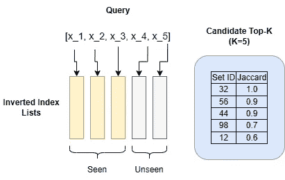

**search_top_k_probe_set** 算法遍历倒排索引列表，为每个遇到的候选集计算 Jaccard 相似度，并跟踪当前的 top-k 候选集。当未处理列表中任何集合的最大 Jaccard 相似度不大于当前 top-k 候选集的最小相似度时，它就会停止。图片由作者提供。

如何计算 Jaccard 相似度的上界？在处理了 `n` 个候选列表之后，对于任何未见候选，其与查询集的最大交集最多等于剩余未处理列表的数量：`|Q|-n`。我们给予它最大的怀疑，以便认为该候选可能出现在每一个剩余的 `|Q|-n` 列表中。现在我们可以使用简单的数学推导该候选 `X` 的上界 Jaccard 相似度。

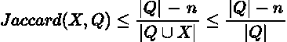

计算一个未见候选索引集 X 和查询集 Q 之间 Jaccard 相似度的上界的公式，经过处理了 n 个候选列表之后。

这个巧妙的技术在集合相似性搜索研究文献中被称为*前缀过滤器*。我写了一篇[论文](https://dl.acm.org/doi/pdf/10.1145/3299869.3300065)，详细讲述了这一点以及进一步的算法优化。我还创建了一个 Python 库[SetSimilaritySearch](https://github.com/ekzhu/SetSimilaritySearch)，实现了一个更优化的 `search_top_k_probe_set` 算法版本，并支持余弦和包含相似性度量。

# Jaccard 搜索的近似索引

在最后一部分，我解释了两种基于倒排索引的搜索算法。这些算法是**精确的**，意味着它们返回的 `k` 个最佳候选项确实是最好的 `k` 个候选项。听起来老生常谈？其实，这是我们在设计大规模数据上的搜索算法时应该问自己的问题，因为在许多情况下，获取真实的 `k` 个最佳候选项并非必要。

再考虑一下 Spotify 的例子：你真的在乎搜索结果可能会遗漏一些与您品味相似的人吗？大多数人都明白，在日常应用程序（如 Google、Spotify、Twitter 等）中，搜索从来不会是详尽无遗或完全准确的。这些应用程序的任务并不足以证明精确搜索的必要性。这就是为什么最广泛使用的搜索算法都是近似的。

使用近似搜索算法主要有两个好处：

1.  更快。如果你不再需要精确的结果，你可以省去许多步骤。

1.  可预测的资源消耗。这一点不那么明显，但对于几种近似算法，它们的资源使用（例如内存）可以在*事先*配置，与数据分布无关。

在这篇文章中，我将讨论 Jaccard 最常用的近似索引：最小化局部敏感哈希（MinHash LSH）。

## 什么是 LSH？

局部敏感哈希索引在计算机科学中确实是奇迹。它们是由数论驱动的算法魔法。在机器学习文献中，它们被称为 k-NN 模型，但与典型的机器学习模型不同，LSH 索引对数据无关，因此它们在相似性条件下的准确性可以在*事先*确定，而不需要在摄取新数据点或更改数据分布之前进行调整。因此，它们更类似于倒排索引而不是模型。

LSH 索引本质上是一组具有不同哈希函数的哈希表。就像典型的哈希表一样，LSH 索引的哈希函数将一个数据点（例如，一个集合、特征向量或嵌入向量）作为输入，并输出一个二进制哈希键。除此之外，它们没有更多的相似之处。

典型的哈希函数输出的键在整个键空间中是伪随机且均匀分布的。比如，MurmurHash 是一个著名的哈希函数，它在 32 位键空间中输出近乎均匀且随机的哈希值。这意味着对于任何两个输入，例如 `abcdefg` 和 `abcefg`，只要它们不同，它们的 MurmurHash 键就不应有相关性，并且在整个 32 位键空间中出现的概率应相同。这是哈希函数的一个期望特性，因为你希望键在哈希桶中均匀分布，以避免链表或不断调整哈希表的大小。

LSH 的哈希函数执行的是相反的操作：对于一对相似的输入，定义相似度的度量空间中，它们的哈希键更有可能相等，而不是另一对不相似输入的哈希键。

这意味着什么？这意味着 LSH 哈希函数对更相似的数据点具有更高的哈希键冲突概率。实际上，我们利用这一较高的冲突概率来进行基于相似度的检索。

## **MinHash LSH**

对于每一个相似度/距离度量，有一个 LSH 哈希函数。对于 Jaccard，这个函数被称为 *Minwise Hash Function* 或 *MinHash function*。给定一个输入集合，MinHash 函数使用随机哈希函数处理所有元素，并跟踪观察到的最小哈希值。你可以使用单个 MinHash 函数构建一个 LSH 索引。请参见下图。

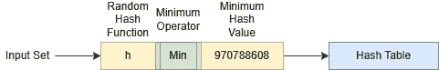

使用单个随机哈希函数的 MinHash LSH 索引。图片来源于作者。

MinHash 函数背后的数学理论指出，两个集合具有相同最小哈希值（即哈希键冲突）的概率与它们的 Jaccard 相同。

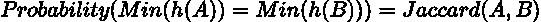

h(A) 是通过随机哈希函数 h 对 A 中所有元素的哈希值。

min(h(A)) 是 A 中所有元素的最小哈希值。

这是一个神奇的结果，但[证明](https://cs.stackexchange.com/questions/11256/proving-calculating-minhash)却相当简单。

使用单个 MinHash 函数的 MinHash LSH 索引不能提供令人满意的准确性，因为碰撞概率与 Jaccard 成线性关系。请参见下面的图表以理解原因。

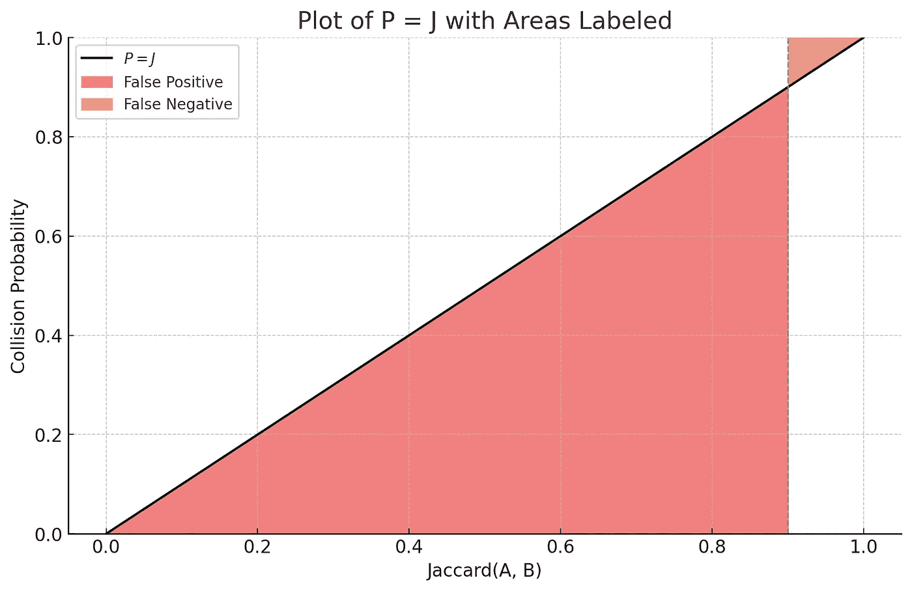

单个 MinHash 函数在查询集合和索引集合之间的 Jaccard 上的碰撞概率。Y 轴是碰撞概率，X 轴是查询集合和索引集合之间的 Jaccard。例如，Jaccard = 0.8 的索引集合与查询集合有 80% 的概率通过索引被检索到；而 Jaccard 为 0.2 的另一个索引集合与查询集合有 20% 的概率被检索到。图片来源于作者。

设想我们在 Jaccard = 0.9 处画一条阈值线：与查询集合 Jaccard 值高于 0.9 的结果是相关的，而 Jaccard 值低于 0.9 的结果是无关的。在搜索的背景下，“假阳性”意味着返回了无关的结果，而“假阴性”意味着没有返回相关的结果。根据上面的图，并查看假阳性对应的区域：如果索引只使用一个 MinHash 函数，它将产生非常高概率的假阳性。

**提升 MinHash LSH 的准确性**

这就是为什么我们需要另一个 LSH 魔法：一个叫做*增强*的过程。我们可以将索引提升到更符合指定的相关性阈值。

我们使用`m`个 MinHash 函数，这些函数通过称为[*Universal Hashing*](https://en.wikipedia.org/wiki/Universal_hashing) *的过程生成*——基本上是 32 位或 64 位整数相同哈希函数的`m`个随机排列。对于每个被索引的集合，我们使用通用哈希生成`m`个最小哈希值。

设想你列出了一个索引集合的`m`个最小哈希值。我们将每`r`个哈希值分组到一个哈希值带中，我们创建`b`个这样的带。这需要`m = b * r`。

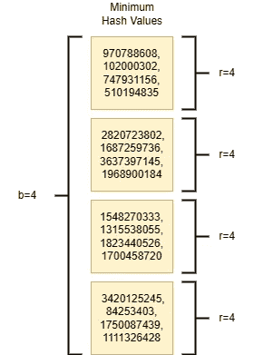

在 MinHash LSH 中，具有 m= 16，b = 4 和 r= 4 的索引集合的最小哈希值。图片由作者提供。

两个集合具有“带碰撞”的概率——两个集合中的所有哈希值在一个带中碰撞，或`r`个连续的哈希碰撞，是`Jaccard(A, B)^r`。这比单个哈希值小得多。然而，两个集合之间至少有一个“带碰撞”的概率是`1 — (1-Jaccard(A, B)^r)^b`。

我们为什么关心`1 — (1-Jaccard(A, B)^r)^b`？因为这个函数有一个特殊的形状：

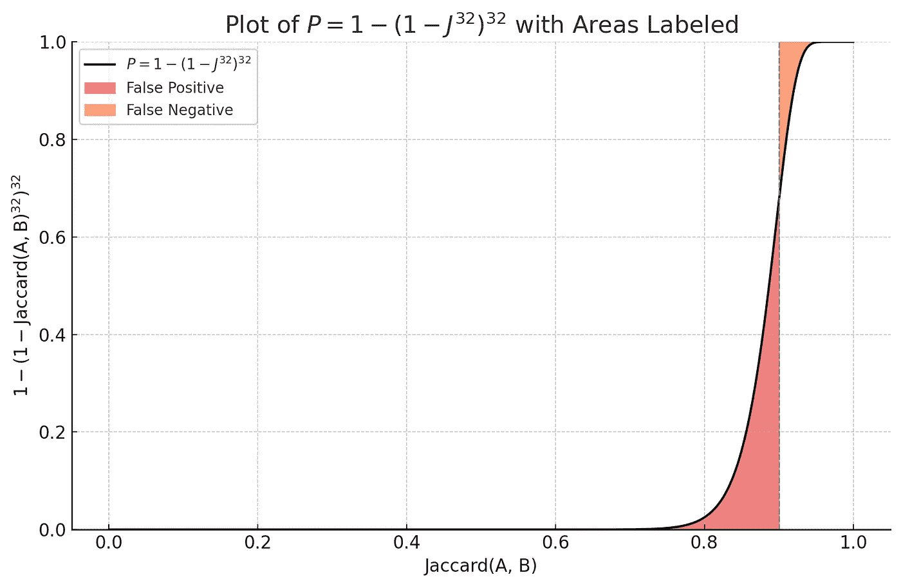

使用 b = 32 和 r = 32 的 MinHash LSH 索引的 Jaccard 检索增强概率函数。图片由作者提供。

在上面的图中，你可以看到使用`m`个 MinHash 函数时，“至少一个带碰撞”概率是一个 S 型曲线函数，在 Jaccard = 0.9 附近急剧上升。假设相关性阈值为 0.9，则该索引的假阳性概率远小于仅使用一个随机哈希函数的索引。

因此，LSH 索引总是使用`b`个`r`个 MinHash 函数的带来提升准确性。每个带是一个存储指向索引集合的指针的哈希表。在搜索过程中，任何与查询集合在任何带中碰撞的索引集合都会被返回。

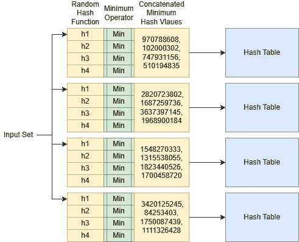

一个使用 b = 4 和 r = 4 的 MinHash LSH 索引。每个带是一个哈希表，其哈希键是 4 个 MinHash 函数的最小哈希值的连接。图片由作者提供。

要构建 MinHash LSH 索引，我们可以指定*一个先验*的相关性阈值以及基于 Jaccard 相似度的可接受的假阳性和假阴性概率，并在索引任何数据点之前，[计算](https://github.com/ekzhu/datasketch/blob/4676353c1374b2e0b33b0da2dd6596fa47fdd4c8/datasketch/lsh.py#L22)最优的`m`、`b`和`r`。这是使用 LSH 相对于其他近似索引的一个巨大优势。

你可以在 Python 包[datasketch](https://github.com/ekzhu/datasketch)中找到我的 MinHash LSH 实现。它还包括其他与 MinHash 相关的算法，如 LSH 森林和加权 MinHash。

# 最终思考

我在这篇文章中涵盖了很多主题，但我只是浅尝辄止地探讨了 Jaccard 相似度搜索索引。如果你有兴趣阅读更多这些主题，我为你准备了进一步阅读的列表：

+   [《大规模数据集挖掘》(Mining of Massive Datasets)](http://mmds.org/)由 Jure Leskovec、Anand Rajaraman 和 Jeff Ullman 撰写。第三章详细介绍了 MinHash 和 LSH。我认为这是一个很好的章节，用于获得对 MinHash 的直观理解。请注意，章节中描述的应用侧重于基于 n-gram 的文本匹配。

+   [JOSIE：用于在数据湖中查找可连接表的重叠集合相似度搜索](https://dl.acm.org/doi/10.1145/3299869.3300065)。本文的初步部分解释了`search_top_k_merge_list`和`search_top_k_probe_set`算法的直观。主要部分解释了在输入集合很大时（例如表列），如何考虑成本。

+   [Datasketch](https://github.com/ekzhu/datasketch) 和 [SetSimilaritySearch](https://github.com/ekzhu/SetSimilaritySearch/) 库分别实现了最先进的近似和精确 Jaccard 相似度搜索索引。[datasketch 项目的问题列表](https://github.com/ekzhu/datasketch/issues)是应用场景和实际考虑的宝贵资源，尤其是在应用 MinHash LSH 时。

## 那么嵌入呢？

近年来，由于使用像 Transformers 这样的深度神经网络在表示学习上的突破，当输入数据属于嵌入模型训练的相同领域时，学习到的嵌入向量之间的相似度是有意义的。与本文描述的搜索场景相比，这种情况的主要区别在于：

+   嵌入向量是通常具有 60 到 700 维的稠密向量。每一维都是非零的。相比之下，集合在表示为独热编码向量时是稀疏的：10k 到数百万维，但大多数维度为零。

+   余弦相似度（或标准化向量上的点积）通常用于嵌入向量。对于集合，我们使用 Jaccard 相似度。

+   很难为嵌入向量之间的相似性指定一个相关性阈值，因为这些向量是对原始数据（如图像或文本）的黑箱表示。另一方面，集合的 Jaccard 相似度阈值要容易得多，因为**集合是原始数据**。

由于上述差异，比较嵌入和集合并不是直接的，因为它们是明显不同的数据类型，即使你可以将它们都归类为高维数据。它们适用于不同的应用场景。
