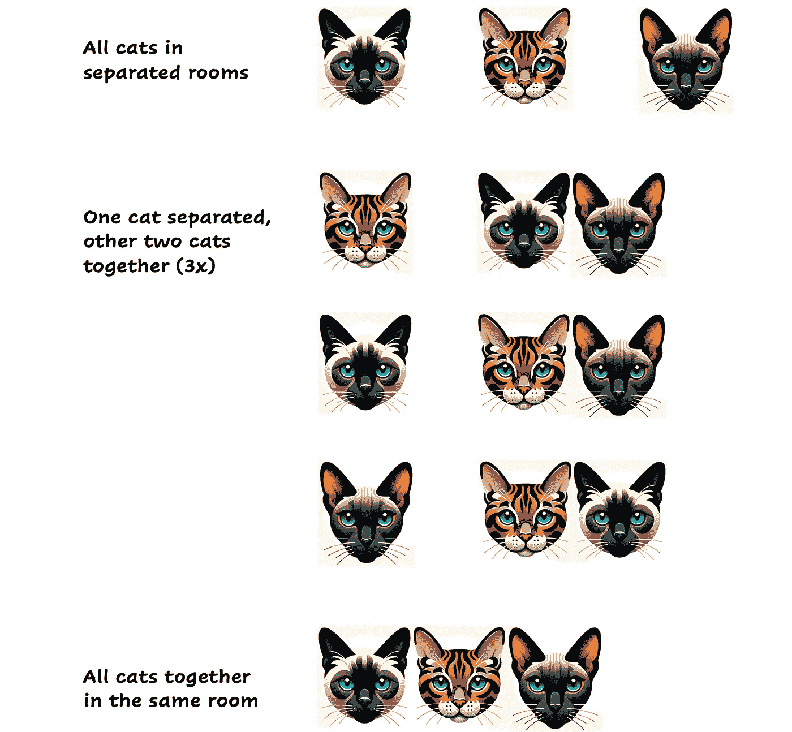
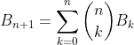
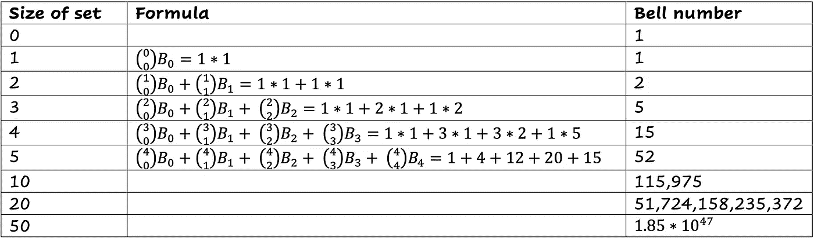
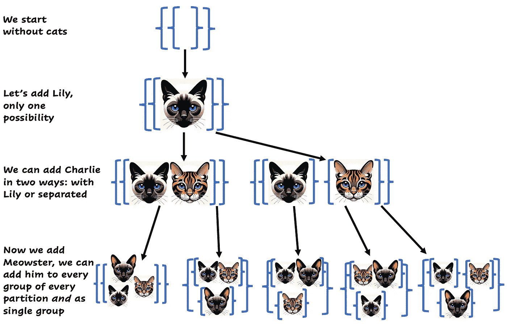
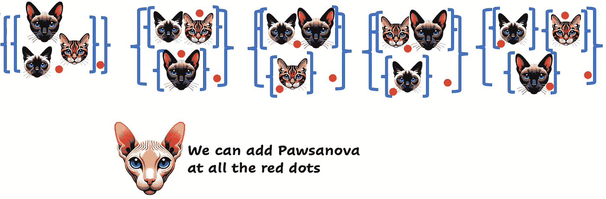
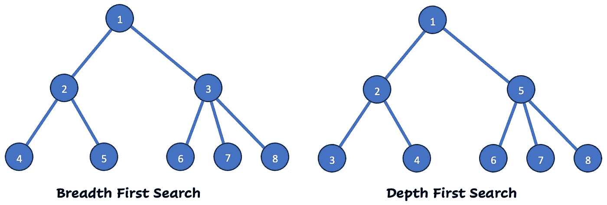

# 使用分支定界找到最佳解决方案

> 原文：[`towardsdatascience.com/finding-optimal-solutions-with-branch-and-bound-70a64692a0dd`](https://towardsdatascience.com/finding-optimal-solutions-with-branch-and-bound-70a64692a0dd)


Robocat 和猫咪一起玩耍。图像由作者使用 Dall·E 创建。

## 解决离散优化问题的强大算法

[](https://hennie-de-harder.medium.com/?source=post_page-----70a64692a0dd--------------------------------)[](https://towardsdatascience.com/?source=post_page-----70a64692a0dd--------------------------------) [Hennie de Harder](https://hennie-de-harder.medium.com/?source=post_page-----70a64692a0dd--------------------------------)

·发表于 [Towards Data Science](https://towardsdatascience.com/?source=post_page-----70a64692a0dd--------------------------------) ·阅读时间 8 分钟·2023 年 12 月 5 日

--

**分支定界是许多混合整数规划 (MIP) 求解器的核心算法。它是你数学优化工具包中的一项极佳补充，特别适用于较小的问题或有许多约束的问题。此外，它的直接性使得它易于访问，无需复杂的数学公式。**

在这篇实用文章中，我们将深入探讨一个数学优化问题。我们将使用分支定界算法来解决这个问题，这是一种解决此类问题的优秀技术。我们将重点讨论一个以猫为主题的问题——因为说实话，谁不喜欢猫呢？不过，如果你更喜欢狗，可以在讨论中每次遇到‘猫’时，脑补成‘狗’。原理和方法完全相同！

# 问题介绍

假设你是一个猫庇护所的主人。每天，宠物主人可以带他们的猫来你这里，你负责照顾它们。许多人在 COVID 期间领养了猫，但现在大家都需要回到办公室。这就是你公司的业绩蒸蒸日上的原因。

实际上，有些过于出色。你在将所有猫安置到你建筑中的房间时遇到了困难。有时你不得不拒绝人们的请求，因为要求太多了。这就是为什么你决定创建一个优化算法，以帮助你找到所有猫登记的最低房间数。

让我们来看一个例子。假设有 3 只猫请求入住你的庇护所。它们的名字是 Lily、Charlie 和 Meowster。我们该如何将这三只猫分配到不同的房间中？我们最多需要三个房间，以下是分组猫咪的所有可能方案：



猫的分割。图片由作者提供。

## 分割和贝尔数

如你所见，将 3 只猫分组有 5 种可能的方法。在数学中，分组集合元素的一种方式被称为*分割*。*贝尔数*对应于给定集合（在我们的例子中，即 3 只猫可以创建 5 种分割）的所有可能分割的总数。这来自组合数学领域。

计算下一个贝尔数的递归公式如下：



计算贝尔数的递归公式。图片由作者提供。

这个数字增长很快：



贝尔数和不同集合大小的计算。图片由作者提供。

一个问题出现了：我们如何以智能的方式找到所需房间的最小数量？当猫的数量增加时，循环遍历所有可能的解决方案是没有意义的。这将耗费大量时间。

## 从问题到树

首先，让我们重新表述问题。然后，我们将使用分支限界算法解决它。

我们可以从没有猫开始，然后一个一个地添加所有猫，而不是创建所有可能的解决方案并计算它们的分数（我们使用了多少房间）。这看起来像一棵带有节点和边的树：



解决方案树。在每一行中增加一只猫。这给我们所有可能的分割。图片由作者提供。

你是否看到了如何在一只新猫（元素）到来时创建所有可能的解决方案（分割）？让我们再增加一只猫：Pawsanova。这很简单，因为我们可以将它添加到所有现有的组中，并作为每个分割中的一个单独组。这对应于图片中的红点：



再增加一只猫，Pawsanova。可以在 15 个位置‘插入’它。图片由作者提供。

对于第四只猫，共有 15 种可能的分割方式。这对应于 4 个元素集合的贝尔数。

在使用分支限界算法解决问题时，我们将使用这个包含可能解决方案的树。

# 分支限界

现在我们从原始问题创建了一个树，我们可以利用这个树来运行分支限界算法。分支限界是如何工作的？直观地说很简单：

> 分支限界将问题分解成更小、更易于管理的子问题（分支），然后为这些子问题确定界限，以有效地找到最优解。

## 分支

将问题分解成更小的子问题正是我们通过创建一个猫的树所做的。我们从没有猫开始，根节点，然后一个一个地添加猫。每个子问题由树的一个节点表示。

## 界限

分支限界的一个重要部分是确定问题的*界限*。它是这样工作的：

+   *上界*与目前为止找到的最佳分数相对应。

+   *下界* 是我们在继续当前树分支时可以找到的最佳分数。这是一个乐观的分数，计算时间不应过长。

## 剪枝

通过将当前节点的*下界*与*上界*进行比较，我们可以决定是否继续搜索树的当前部分。如果下界比上界差，我们可以丢弃这部分树。通过丢弃那些不能产生更好解决方案的子问题，算法减少了需要检查的解决方案数量。这个过程被称为*剪枝*，对算法的效率至关重要。

另一种剪枝树的方法是检查当前子问题是否可行。例如，如果我们已经知道两只猫不能待在一个房间里，因为它们都是急躁的，而当前节点将这两只猫组合在一起，那么我们也可以剪枝这部分树。

## 探索方法

探索树以找到最佳解决方案有多种方法。你可能对深度优先搜索（DFS）和广度优先搜索（BFS）有所了解。深度优先搜索会尽可能深入地探索一条分支。广度优先搜索则会探索当前深度的所有节点（逐个添加猫，就像我们创建树时做的那样）。另一种策略是最佳优先搜索，这种方法根据某些标准（如优化问题中的下界）对节点进行优先级排序。下面你可以看到 BFS 和 DFS 的区别（查看节点序号以了解顺序）：



广度优先搜索和深度优先搜索。图片由作者提供。

## 解决猫问题

了解这些知识后，让我们回到最初的问题。让我们在 Python 中实现分支限界法。我们将使用广度优先搜索，但可以随意重用这段代码以尝试其他探索策略。

我们将实现的一些规则：

+   解决方案的分数将等于我们使用的房间数量。显然，我们希望将其最小化。

+   可行性：一个房间不能有超过 5 只猫，房间内猫的总重量不应超过 25 公斤。此外，一个房间最多只能有一只‘生气’的猫，否则我们会有猫打架...

+   节点的下界通过当前节点的分数加上基于愤怒猫数量所需的最小额外房间数来计算。

> 注：你只需安装`numpy`包。

让我们从一个`Cat`类开始。

使用`generate_n_cats`函数，我们可以生成任意数量的猫。

在接下来的代码片段中，我们将实现分支限界算法：

`branch_and_bound.py`文件包含两个类：`Node`类和`BranchAndBound`类。

`Node` 类包含树中一个节点所需的所有信息。它有一个 `partition` 属性，你可以在这里找到该节点的猫分组。类中的方法用于计算权重、愤怒猫的数量、该节点的下界和可行性检查。

`BranchAndBound` 包含该算法。它从一个有效的解决方案（所有猫在分开的房间）开始，并计算该解决方案的得分作为上界。然后，它从没有猫开始，一只一只地添加猫。它添加新的节点，并通过检查可行性和比较下界与上界来判断是否可以剪枝。

这是处理 15 只猫的结果示例：

```py
Score of Branch and Bound: 5
Time of Branch and Bound: 0.03134322166442871
[Cat(name=cat_0, weight=1, character=angry)]
[Cat(name=cat_1, weight=4, character=angry)]
[Cat(name=cat_7, weight=6, character=angry), Cat(name=cat_8, weight=1, character=sweet), Cat(name=cat_9, weight=8, character=sweet), Cat(name=cat_10, weight=6, character=sweet), Cat(name=cat_11, weight=1, character=sweet)]
[Cat(name=cat_2, weight=6, character=sweet), Cat(name=cat_4, weight=7, character=angry), Cat(name=cat_5, weight=4, character=sweet), Cat(name=cat_6, weight=6, character=sweet), Cat(name=cat_12, weight=1, character=sweet)]
[Cat(name=cat_3, weight=8, character=angry), Cat(name=cat_13, weight=4, character=sweet), Cat(name=cat_14, weight=1, character=sweet)]
```

该算法创建了 5 个组，每组最多有 5 只猫，最多 1 只愤怒的猫，且总重最多为 25 公斤。此外，该算法非常快速，找到（其中之一）最优解的时间不到 0.032 秒。第 15 个贝尔数接近 14 亿，想象一下，如果我们循环遍历所有 14 亿个可能的分区需要多长时间！

## 优缺点

分支限界法是一个容易理解的算法。树的剪枝使得它比动态规划或暴力破解等算法更高效，因为它跳过了那些不感兴趣的解决方案。分支限界法保证找到最优解，这是一个巨大的优点。但当然，也有缺点。如果我们将算法优化为处理 50 只猫而不是 15 只，它将需要很长时间来运行。在 50 只猫的情况下，树有许多节点且非常深。为了提高效率，我们可能需要考虑其他算法，例如元启发式算法。这里要注意的是，下界计算的强度对性能有很大影响。越严格越好，但确保它*确实*是下界（不高于该分支的实际最佳解决方案）。而且，针对你的具体问题，尝试不同的探索方法可能会有价值。在猫的例子中，我们从一个不好的初始解决方案（所有猫在不同的房间）开始，而从一个好的解决方案（例如，如果猫能适应，则贪婪地将猫添加到现有房间）开始更好。这可以加快算法的运行速度。

# 结论

希望你喜欢这个猫收容所的故事！现在你知道了分支限界法是如何工作的，也学到了一些组合数学的知识，比如分区和贝尔数。分支限界法是离散优化问题中使用的一种基本技术。许多 MIP 求解器将分支限界法作为其核心算法。通过剪枝，你不必遍历所有可能的解决方案。这节省了很多时间，但要小心，对于具有大型解决方案树的问题，它仍然可能需要（过于）长的时间。

感谢阅读，下次见！

## 相关内容

[](/why-every-data-scientist-should-learn-mathematical-optimization-3ac102663456?source=post_page-----70a64692a0dd--------------------------------) ## 为什么每个数据科学家都应该学习数学优化

### 数据科学课程专注于数据可视化、特征工程、数据处理、（非）监督学习…

towardsdatascience.com [](/mathematical-optimization-heuristics-every-data-scientist-should-know-b26de0bd43e6?source=post_page-----70a64692a0dd--------------------------------) ## 每个数据科学家应该了解的数学优化启发式方法

### 局部搜索、遗传算法等。

towardsdatascience.com [](/how-to-handle-optimization-problems-daf97b3c248c?source=post_page-----70a64692a0dd--------------------------------) ## 如何处理优化问题？

### 简单的例子和解决方案以及代码。

towardsdatascience.com
