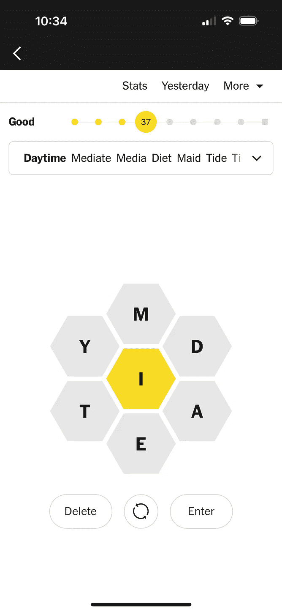
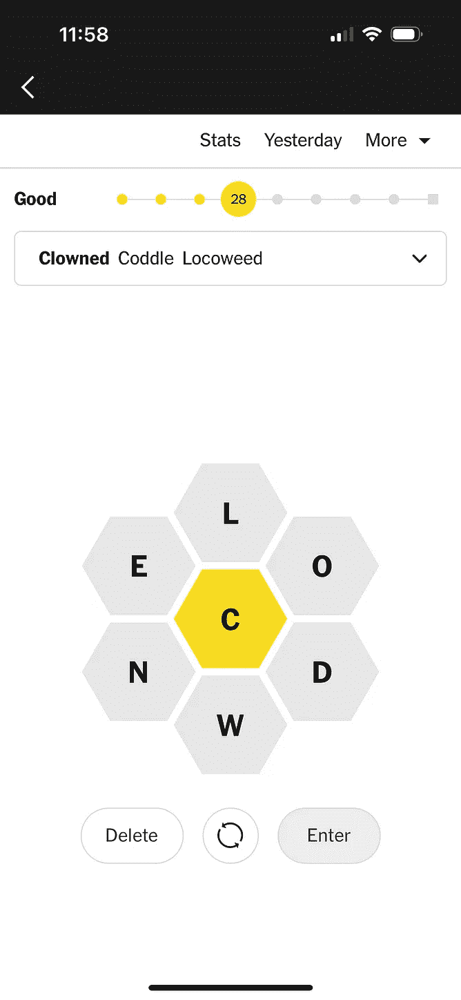
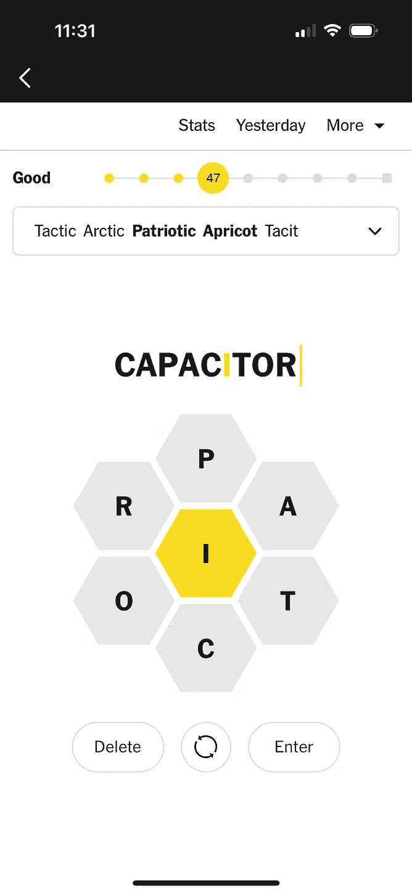

# 使用 GPT-4 和 SpaCy 查找拼字游戏全字母句

> 原文：[`towardsdatascience.com/finding-spelling-bee-pangrams-with-gpt-4-and-spacy-64d042969954`](https://towardsdatascience.com/finding-spelling-bee-pangrams-with-gpt-4-and-spacy-64d042969954)

## 解决《纽约时报》拼图的探寻

[](https://reddotblues.medium.com/?source=post_page-----64d042969954--------------------------------)[](https://towardsdatascience.com/?source=post_page-----64d042969954--------------------------------) [Sean Zhai](https://reddotblues.medium.com/?source=post_page-----64d042969954--------------------------------)

·发表于 [Towards Data Science](https://towardsdatascience.com/?source=post_page-----64d042969954--------------------------------) ·7 分钟阅读·2023 年 3 月 21 日

--


[Nemichandra Hombannavar](https://unsplash.com/@nemichandra?utm_source=medium&utm_medium=referral)拍摄的照片，来源于[Unsplash](https://unsplash.com/?utm_source=medium&utm_medium=referral)

解决《纽约时报拼字游戏》可以是一次令人满意的经历，它在挑战与词汇探索的乐趣之间取得平衡。虽然这并不总是轻而易举，但找到每个单词所获得的满足感是值得付出努力的。在拼图中的各种语言成就中，发现**全字母句**就像发现了一块隐藏的宝藏。这个特别的词汇使用了所有给定的字母，突显了玩家在驾驭英语词汇丰富复杂性的技能。

发现全字母句对许多人来说是一项令人兴奋的活动，同时也为自然语言处理（NLP）练习提供了一个引人入胜的案例。SpaCy（Honnibal & Montani, 2017）是我最喜欢的工具，它是根据 MIT 许可开源的。你可以手动为 SpaCy 编写程序，但我想向你展示如何使用 GPT-4 开发这样的解决方案。

# 背景

## 拼字游戏

《纽约时报拼字游戏》是一个流行的单词拼图游戏，可以在《纽约时报》报纸和《纽约时报》网站上找到。在游戏中，玩家会得到一组七个字母，其中一个字母被指定为“中心”字母。游戏的目标是使用给定的字母尽可能多地创建单词，同时遵守以下规则：

+   每个单词必须至少四个字母长。

+   “中心”字母必须出现在每个单词中。

+   单词必须在英语词典中存在。

+   不允许使用专有名词和晦涩或冒犯性的词汇。

该游戏根据每个单词的长度分配点数。玩家获得一个四个字母单词的分数，每增加一个字母，分数会增加。全字母句是一个使用所有七个给定字母至少一次的单词，并且它会获得额外的分数。

参见人类如何解决难题：威廉·杰克逊·哈珀解答 NYT 拼字游戏 | 来源：YouTube.com

## GPT-4

GPT，即生成预训练变换器，是由 OpenAI 开发的前沿 AI 语言模型，利用深度学习技术来理解和生成类似人类的文本。凭借其强大的变换器架构和对大量文本数据的预训练，GPT 能够在广泛的自然语言处理任务中表现出色，包括文本完成、翻译、摘要等。

## SpaCy

SpaCy 是一个高性能的开源 Python 库，旨在处理高级自然语言处理（NLP）任务。由 Explosion AI 开发，SpaCy 提供了高效、生产就绪的文本处理、标记化、词性标注、命名实体识别、依存分析等工具。SpaCy 以速度和易用性为重点，使开发者能够快速构建自定义的 NLP 应用程序。

# 使用 GPT-4 开发 SpaCy 程序

## 准备工作

让我们准备工具链来开发 SpaCy。你应该已经安装了*Python*和*pip*，因为 SpaCy 是一个 Python 库。

要在 SpaCy 中编写一个程序来查找 NYT 拼字游戏中的全字母句，我们需要从词典或语料库中获取单词列表。在这个例子中，我将使用 NLTK（自然语言工具包）（Bird 等人，2009）库来获取单词列表。如果你还没有安装 NLTK，请先安装：

```py
pip install nltk
```

然后，从 NLTK 下载‘words’语料库：

```py
import nltk
nltk.download('words')
```

*注意：NTLK 的单词语料库是一个使用于英语的单词列表。NLTK 中的单词语料库来源于“Words”数据集，该数据集最初来源于 Unix 的“Words”文件。该文件是一个包含在 Unix 系统中用于各种目的（例如拼写检查和生成随机文本）常用的英语单词列表。Unix 单词文件并非英语单词的详尽列表，可能包含一些古老或不常见的单词。它也缺乏专有名词，并可能不包括英语语言中较新的词汇。然而，它为各种自然语言处理任务，如单词分割、标记化和拼写校正，提供了一个有用的起点。*

## 初次尝试

让我们向 GPT-4 提出一个简单的请求。

> 你能在 SpaCy 中编写一个程序来查找《纽约时报》拼字游戏中的全字母句吗？

GPT-4 提供的答案看起来很有希望。它包括设置 SpaCy 的步骤和以下 Python 程序。

```py
import spacy
import nltk
from nltk.corpus import words

# Load the English language model
nlp = spacy.load("en_core_web_sm")

def is_pangram(word, required_letter, given_letters):
    word = word.lower()
    if required_letter not in word:
        return False
    return all(l in word for l in given_letters)

def find_pangrams(word_list, required_letter, given_letters):
    pangrams = set()
    for word in word_list:
        if is_pangram(word, required_letter, given_letters):
            pangrams.add(word)
    return pangrams

def main():
    # Get the list of words from nltk
    nltk_words = words.words()

    # Define the required letter and other given letters
    required_letter = 'i'
    given_letters = ['a', 'd', 'e', 'm', 't', 'y', 'i']

    # Find pangrams
    pangrams = find_pangrams(nltk_words, required_letter, given_letters)
    print("Pangrams found:", pangrams)

if __name__ == "__main__":
    main()
```

这是输出结果。

```py
>>> pangrams
{'diathermotherapy', 'pentamethylenediamine', 'absentmindedly', 
'undemonstratively', 'hypodermatically', 'bisdimethylamino', 
'endolymphatic', 'Polystomidae', 'metasedimentary', 'Methodistically', 
'thermodynamicist', 'vasoepididymostomy', 'animatedly', 'radiochemistry', 
'hydrometeorological', 'demisability', 'hydrometallurgically',
'Mylodontidae', 'ektodynamorphic', 'detrimentally', 'Tetradynamia',
'immoderately', 'Merycopotamidae', 'Hypsiprymnodontinae', 'lymphadenitis', 
'diaphanometry', 'Cyclostomatidae', 'Platystomidae', 'smithydander', 
'hydroatmospheric', 'hydropneumatic', 'condimentary', 'hydrometamorphism', 'pentadactylism', 'diathermacy', 'ventripyramid', 'acidometry', 'thermodynamist', 'improvidentially', 'methodically', 'diethylenediamine', 'aldermanity', 'hemidactylous', 'myxadenitis', 'Myliobatidae', 'demountability', 'diathermy', 'lymphangioendothelioma', 'unmitigatedly', 'Basidiomycetes', 'Hydrometridae', 'ectodactylism', 'thermoradiotherapy', 'predaytime', 'indemnificatory', 'Hemibasidiomycetes', 'dilemmatically', 'cardiometry', 'lymphadenectasia', 'misunderstandingly', 'diastematomyelia', 
```

经过仔细观察，我们发现它包括一些不在给定字母列表中的字母。

## 第二次尝试

通过我们的观察，我们可以要求 GPT 进行改进。

> 程序无法正常工作。它返回了包含“given_letters”的单词，但我们需要的是仅包含 given_letters 的单词。它不能有其他字母。

GPT-4 重写了程序。

```py
import nltk
from nltk.corpus import words

def is_pangram(word, required_letter, given_letters):
    word = word.lower()
    if required_letter not in word:
        return False

    for letter in word:
        if letter not in given_letters:
            return False
    return all(l in word for l in given_letters)

def find_pangrams(word_list, required_letter, given_letters):
    pangrams = set()
    for word in word_list:
        if is_pangram(word, required_letter, given_letters):
            pangrams.add(word)
    return pangrams

def main():
    # Get the list of words from nltk
    nltk_words = words.words()

    # Define the required letter and other given letters
    required_letter = 'i'
    given_letters = ['a', 'd', 'e', 'm', 't', 'y', 'i']

    # Find pangrams
    pangrams = find_pangrams(nltk_words, required_letter, given_letters)
    print("Pangrams found:", pangrams)

if __name__ == "__main__":
    main()
```

这次的输出是三个单词。NYTimes 拼字比赛中要找的单词是“daytime”。

```py
>>> pangrams
{'didymate', 'daytime', 'Maytide'}
```

我们可以称之为胜利吗？



NYTimes 拼字比赛的截图：1) 2023 年 5 月 16 日 2) 2023 年 5 月 17 日 3) 2023 年 5 月 18 日 | 截图由 Sean Zhai 提供

## 异常与解决方案

2023 年 5 月 17 日的拼字比赛有以下给定字母：**C** D E N L O W，但我们的程序返回了一个空输出。它无法找到一个全字句。

这时我们需要帮助 GPT-4。我尝试让 GPT-4 分析错误，但效果不好，于是我介入了。算法看起来是正确的，我接下来的检查是 NLTK 语料库。我在 Python 中对当天的全字句——clowned 进行了快速搜索，但没有找到。所以我们找到了问题。

我陈述了问题，并要求 GPT-4 提供新解决方案。

> 在用于查找全字句的 Python 程序中，nltk.corpus 中的“words”没有涵盖 NYTimes 使用的所有单词。例如，“clowned” 就没有包括在内。有没有更好的地方可以获取“words”？

GPT-4 认识到问题，并提供了新的英语单词来源及更新后的 Python 程序。

一个更全面的英语单词来源是 `words.txt` 文件，它来源于 SCOWL（拼写检查器导向单词列表）项目。你可以在 GitHub 仓库中找到它： [`github.com/dwyl/english-words`](https://github.com/dwyl/english-words)

```py
def read_words_from_file(filename):
    with open(filename, 'r') as f:
        return [word.strip() for word in f.readlines()]

def is_pangram(word, required_letter, given_letters):
    word = word.lower()
    if len(word) < 4 or required_letter not in word:
        return False

    for letter in word:
        if letter not in given_letters:
            return False
    return all(l in word for l in given_letters)

def find_pangrams(word_list, required_letter, given_letters):
    pangrams = set()
    for word in word_list:
        if is_pangram(word, required_letter, given_letters):
            pangrams.add(word)
    return pangrams

def main():
    # Get the list of words from the words.txt file
    filename = 'words.txt'
    word_list = read_words_from_file(filename)

    # Define the required letter and other given letters
    required_letter = 'c'
    given_letters = ['c', 'd', 'e', 'n', 'l', 'o', 'w']

    # Find pangrams
    pangrams = find_pangrams(word_list, required_letter, given_letters)
    print("Pangrams found:", pangrams)

if __name__ == "__main__":
    main()
```

将新程序保存为 *pangram.py*。现在结果如下：

```py
% python3 pangram.py
Pangrams found: {'clowned'}
```

满意！

# 讨论

将 GPT-4 应用于实际任务是测试程序能力的有趣方式。它确实令人印象深刻，并将改变我们的工作方式。以下是一些可能在给 GPT-4 提示时有所帮助的事项。

+   具体明确。为你的问题定义一个合适的范围。

+   给出例子以说明你的陈述。

+   与 GPT-4 合作，并始终验证输出结果。

+   运用自己的思维分析复杂情况。

# 参考文献

Honnibal, M., & Montani, I. (2017). *spaCy 2: 使用 Bloom 嵌入、卷积神经网络和增量解析进行自然语言理解*。

Bird, S., Klein, E., & Loper, E. (2009). *使用 Python 进行自然语言处理：用自然语言工具包分析文本*。O’Reilly Media, Inc.
