# 在 Twitter 帖子中寻找时间模式：使用 Python 进行探索性数据分析

> 原文：[`towardsdatascience.com/finding-temporal-patterns-in-twitter-posts-exploratory-data-analysis-with-python-8aac618c8699`](https://towardsdatascience.com/finding-temporal-patterns-in-twitter-posts-exploratory-data-analysis-with-python-8aac618c8699)

## 使用 Python、K-Means 和 t-SNE 对 Twitter 数据进行聚类

[](https://dmitryelj.medium.com/?source=post_page-----8aac618c8699--------------------------------)[](https://towardsdatascience.com/?source=post_page-----8aac618c8699--------------------------------) [Dmitrii Eliuseev](https://dmitryelj.medium.com/?source=post_page-----8aac618c8699--------------------------------)

·发表于 [Towards Data Science](https://towardsdatascience.com/?source=post_page-----8aac618c8699--------------------------------) ·17 分钟阅读·2023 年 5 月 26 日

--

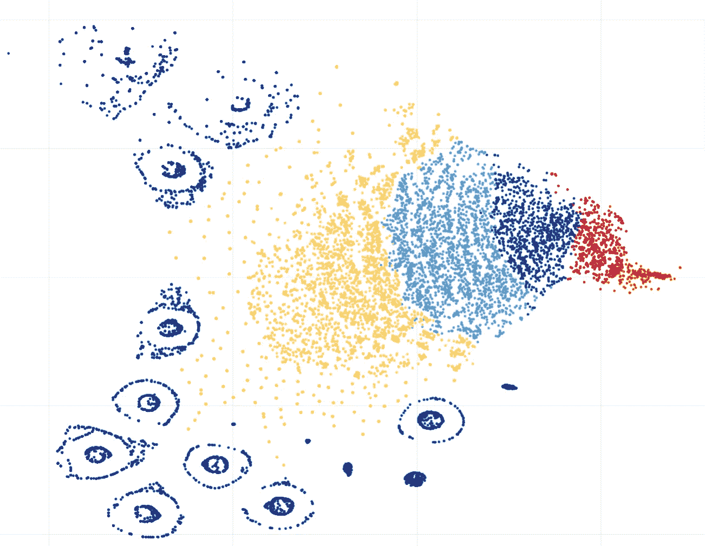

Tweet clusters t-SNE 可视化，图像由作者提供

在文章 “人们对气候的看法” 中，我使用自然语言处理、向量化和聚类分析了 Twitter 帖子。通过这种技术，可以在非结构化文本数据中找到不同的群体，例如，从数千条关于气候的推文中提取有关冰川融化或电动交通的消息。在处理这些数据时，另一个问题出现了：如果我们将相同的算法应用于这些消息发布的时间而不是消息本身会怎样？这将使我们能够分析*何时*和*多频繁*不同的人在社交媒体上发帖。这不仅从社会学或心理学的角度重要，正如我们稍后将看到的，还可以用来检测机器人或发送垃圾信息的用户。最后但同样重要的是，几乎每个人现在都在使用社交平台，因此了解有关*我们*的新事物是很有趣的。显然，相同的算法不仅可以用于 Twitter 帖子，还可以用于任何媒体平台。

## 方法论

我将使用与第一部分 Twitter 数据分析中描述的相似的方法。我们的数据处理流程将包括几个步骤：

+   收集包含特定标签的推文并将其保存到 CSV 文件中。这在之前的文章中已经完成，所以我在这里跳过详细说明。

+   找到收集的数据的一般属性。

+   根据用户发帖的时间计算每个用户的嵌入向量。

+   使用 K-Means 算法对数据进行聚类。

+   分析结果。

让我们开始吧。

## 1\. 加载数据

我将使用[Tweepy](https://github.com/tweepy/tweepy)库来收集 Twitter 帖子。更多细节可以在第一部分中找到；这里我只发布源代码：

```py
import tweepy

api_key = "YjKdgxk..."
api_key_secret = "Qa6ZnPs0vdp4X...."

auth = tweepy.OAuth2AppHandler(api_key, api_key_secret)
api = tweepy.API(auth, wait_on_rate_limit=True)

hashtag = "#climate"
language = "en"

def text_filter(s_data: str) -> str:
    """ Remove extra characters from text """
    return s_data.replace("&amp;", "and").replace(";", " ").replace(",", " ") \
                 .replace('"', " ").replace("\n", " ").replace("  ", " ")

def get_hashtags(tweet) -> str:
    """ Parse retweeted data """
    hash_tags = ""
    if 'hashtags' in tweet.entities:
        hash_tags = ','.join(map(lambda x: x["text"], tweet.entities['hashtags']))
    return hash_tags

def get_csv_header() -> str:
    """ CSV header """
    return "id;created_at;user_name;user_location;user_followers_count;user_friends_count;retweets_count;favorites_count;retweet_orig_id;retweet_orig_user;hash_tags;full_text"

def tweet_to_csv(tweet):
    """ Convert a tweet data to the CSV string """
    if not hasattr(tweet, 'retweeted_status'):
        full_text = text_filter(tweet.full_text)
        hasgtags = get_hashtags(tweet)
        retweet_orig_id = ""
        retweet_orig_user = ""
        favs, retweets = tweet.favorite_count, tweet.retweet_count
    else:
        retweet = tweet.retweeted_status
        retweet_orig_id = retweet.id
        retweet_orig_user = retweet.user.screen_name
        full_text = text_filter(retweet.full_text)
        hasgtags = get_hashtags(retweet)
        favs, retweets = retweet.favorite_count, retweet.retweet_count
    s_out = f"{tweet.id};{tweet.created_at};{tweet.user.screen_name};{addr_filter(tweet.user.location)};{tweet.user.followers_count};{tweet.user.friends_count};{retweets};{favs};{retweet_orig_id};{retweet_orig_user};{hasgtags};{full_text}"
    return s_out

if __name__ == "__main__":
    pages = tweepy.Cursor(api.search_tweets, q=hashtag, tweet_mode='extended',
                         result_type="recent",
                         count=100,
                         lang=language).pages(limit)

    with open("tweets.csv", "a", encoding="utf-8") as f_log:
        f_log.write(get_csv_header() + "\n")
        for ind, page in enumerate(pages):
            for tweet in page:
                # Get data per tweet
                str_line = tweet_to_csv(tweet)
                # Save to CSV
                f_log.write(str_line + "\n")
```

使用这段代码，我们可以获取在过去 7 天内发布了特定标签的所有 Twitter 帖子。**标签**实际上是我们的搜索查询，我们可以找到有关气候、政治或任何其他主题的帖子。可选地，**语言代码**允许我们搜索不同语言的帖子。读者可以自行进行额外的研究；例如，比较英语和西班牙语推文之间的结果可能会很有趣。

在保存 CSV 文件后，让我们将其加载到数据框中，删除不需要的列，并查看我们拥有的数据：

```py
import pandas as pd

df = pd.read_csv("climate.csv", sep=';', dtype={'id': object, 'retweet_orig_id': object, 'full_text': str, 'hash_tags': str}, parse_dates=["created_at"], lineterminator='\n')
df.drop(["retweet_orig_id", "user_friends_count", "retweets_count", "favorites_count", "user_location", "hash_tags", "retweet_orig_user", "user_followers_count"], inplace=True, axis=1)
df = df.drop_duplicates('id')
with pd.option_context('display.max_colwidth', 80):
    display(df)
```

与第一部分相同，我获取了带有“#climate”标签的 Twitter 帖子。结果如下：

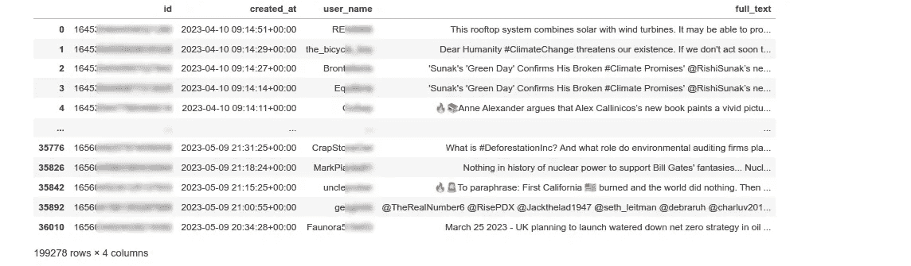

我们实际上不需要文本或用户 ID，但它对于“调试”是有用的，可以查看原始推文的样子。为了未来的处理，我们需要知道每条推文的日期、时间和小时。让我们向数据框添加列：

```py
def get_time(dt: datetime.datetime):
    """ Get time and minute from datetime """
    return dt.time()

def get_date(dt: datetime.datetime):
    """ Get date from datetime """
    return dt.date()

def get_hour(dt: datetime.datetime):
    """ Get time and minute from datetime """
    return dt.hour

df["date"] = df['created_at'].map(get_date)
df["time"] = df['created_at'].map(get_time)
df["hour"] = df['created_at'].map(get_hour)
```

我们可以轻松验证结果：

```py
display(df[["user_name", "date", "time", "hour"]])
```

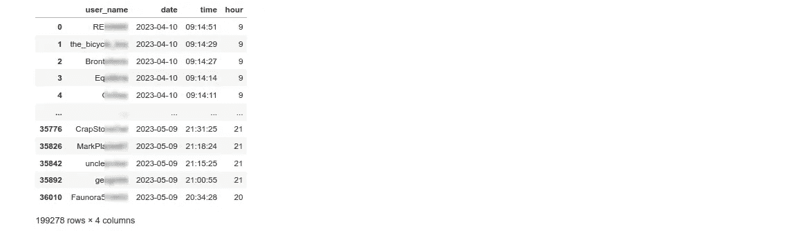

现在我们拥有了所有需要的信息，可以开始进行分析。

## 2\. 一般见解

从最后的截图中我们可以看到，已加载了 199,278 条消息；这些是带有“#Climate”标签的消息，我在几周内收集的。作为热身，让我们回答一个简单的问题：人们平均每天发布多少*关于气候的消息*？

首先，让我们计算总天数和用户总数：

```py
days_total = df['date'].unique().shape[0]
print(days_total)
# > 46

users_total = df['user_name'].unique().shape[0]
print(users_total)
# > 79985
```

如我们所见，数据收集了 46 天，总共有 79,985 名 Twitter 用户在这段时间内发布了（或转发了）至少一条带有“#Climate”标签的消息。显然，我们只能计算至少发布过一条消息的用户；遗憾的是，我们无法通过这种方式获得*读者*的数量。

让我们找出每个用户的**每日消息数量**。首先，我们按用户名对数据框进行分组：

```py
gr_messages_per_user = df.groupby(['user_name'], as_index=False).size().sort_values(by=['size'], ascending=False)
gr_messages_per_user["size_per_day"] = gr_messages_per_user['size'].div(days_total)
```

“size”列显示了每个用户发送的消息数量。我还添加了“size_per_day”列，通过将消息总数除以总天数即可轻松计算。结果如下：

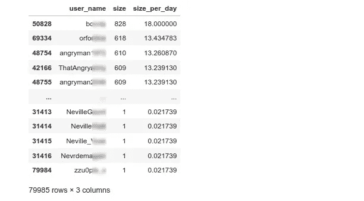

我们可以看到，最活跃的用户每天最多发布 18 条消息，而最不活跃的用户在这 46 天的时间里只发布了 1 条消息（1/46 = 0.0217）。让我们使用 NumPy 和[Bokeh](https://github.com/bokeh/bokeh)绘制**直方图**：

```py
import numpy as np
from bokeh.io import show, output_notebook, export_png
from bokeh.plotting import figure, output_file
from bokeh.models import ColumnDataSource, LabelSet, Whisker
from bokeh.transform import factor_cmap, factor_mark, cumsum
from bokeh.palettes import *
output_notebook()

users = gr_messages_per_user['user_name']
amount = gr_messages_per_user['size_per_day']
hist_e, edges_e = np.histogram(amount, density=False, bins=100)

# Draw
p = figure(width=1600, height=500, title="Messages per day distribution")
p.quad(top=hist_e, bottom=0, left=edges_e[:-1], right=edges_e[1:], line_color="darkblue")
p.x_range.start = 0
# p.x_range.end = 150000
p.y_range.start = 0
p.xaxis[0].ticker.desired_num_ticks = 20
p.left[0].formatter.use_scientific = False
p.below[0].formatter.use_scientific = False
p.xaxis.axis_label = "Messages per day, avg"
p.yaxis.axis_label = "Amount of users"
show(p)
```

输出如下：


每日消息数量分布，图像由作者提供

有趣的是，我们只能看到一根柱子。在所有 79,985 名使用“#Climate”标签发布消息的用户中，几乎所有人（77,275 名用户）的平均每天发送的消息不到一条。乍一看，这似乎很令人惊讶，但实际上，我们有多频繁地发布关于气候的推文呢？说实话，我一生中从未做过。我们需要将图表放大很多才能看到直方图上的其他柱子：

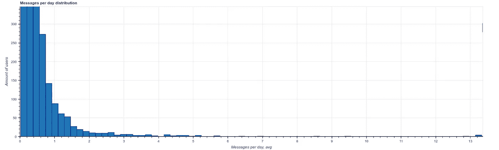

每天消息的分布情况（更高的缩放），图像由作者提供

只有在这个缩放级别下，我们才能看到在所有 79,985 名关于“#Climate”发过消息的 Twitter 用户中，只有不到 100 名“活跃分子”每天发消息！好吧，也许“气候”不是人们每天发帖的内容，但其他话题是否也如此？我创建了一个辅助函数，返回每天发布超过 N 条消息的“活跃”用户的百分比。

```py
def get_active_users_percent(df_in: pd.DataFrame, messages_per_day_threshold: int):
    """ Get percentage of active users with a messages-per-day threshold """
    days_total = df_in['date'].unique().shape[0]
    users_total = df_in['user_name'].unique().shape[0]
    gr_messages_per_user = df_in.groupby(['user_name'], as_index=False).size()
    gr_messages_per_user["size_per_day"] = gr_messages_per_user['size'].div(days_total)
    users_active = gr_messages_per_user[gr_messages_per_user['size_per_day'] >= messages_per_day_threshold].shape[0]
    return 100*users_active/users_total
```

然后，使用相同的 Tweepy 代码，我从不同领域下载了 6 个话题的数据框。我们可以用 Bokeh 绘制结果：

```py
labels = ['#Climate', '#Politics', '#Cats', '#Humour', '#Space', '#War']
counts = [get_active_users_percent(df_climate, messages_per_day_threshold=1), 
          get_active_users_percent(df_politics, messages_per_day_threshold=1), 
          get_active_users_percent(df_cats, messages_per_day_threshold=1), 
          get_active_users_percent(df_humour, messages_per_day_threshold=1), 
          get_active_users_percent(df_space, messages_per_day_threshold=1), 
          get_active_users_percent(df_war, messages_per_day_threshold=1)]

palette = Spectral6
source = ColumnDataSource(data=dict(labels=labels, counts=counts, color=palette))
p = figure(width=1200, height=400, x_range=labels, y_range=(0,9), 
           title="Percentage of Twitter users posting 1 or more messages per day",
           toolbar_location=None, tools="")
p.vbar(x='labels', top='counts', width=0.9, color='color', source=source)
p.xgrid.grid_line_color = None
p.y_range.start = 0
show(p)
```

结果很有趣：

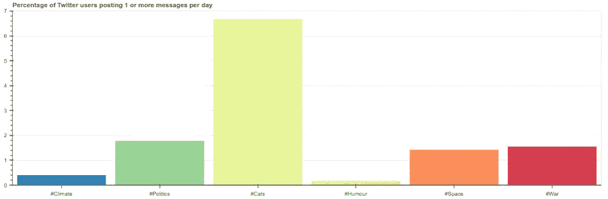

每天发布至少 1 条消息的活跃用户百分比，使用特定标签

这里最受欢迎的标签是“#Cats”。在这个组中，大约 6.6%的用户每天发帖。他们的猫只是太可爱了吗，无法抗拒诱惑？相反，“#Humour”是一个热门话题，消息量很大，但每天发多条消息的人数最少。在“#War”或“#Politics”这样的更严肃的话题中，大约 1.5%的用户每天发帖。令人惊讶的是，相较于“#Humour”，更多人每天发布关于“#Space”的消息。

为了更详细地澄清这些数字，让我们找出**每个用户消息数量的分布**；虽然这与消息时间没有直接关系，但仍然有趣的是找到答案：

```py
def get_cumulative_percents_distribution(df_in: pd.DataFrame, steps=200):
    """ Get a distribution of total percent of messages sent by percent of users """    
    # Group dataframe by user name and sort by amount of messages
    df_messages_per_user = df_in.groupby(['user_name'], as_index=False).size().sort_values(by=['size'], ascending=False)
    users_total = df_messages_per_user.shape[0]
    messages_total = df_messages_per_user["size"].sum()

    # Get cumulative messages/users ratio
    messages = []
    percentage = np.arange(0, 100, 0.05)
    for perc in percentage:
        msg_count = df_messages_per_user[:int(perc*users_total/100)]["size"].sum()
        messages.append(100*msg_count/messages_total)

    return percentage, messages
```

这种方法计算了最活跃用户发布的消息总数。具体的数量对于不同的话题可能会有很大的差异，因此我使用百分比作为输出。通过这个功能，我们可以比较不同标签的结果：

```py
# Calculate 
percentage, messages1 = get_cumulative_percent(df_climate)
_, messages2 = get_cumulative_percent(df_politics)
_, messages3 = get_cumulative_percent(df_cats)
_, messages4 = get_cumulative_percent(df_humour)
_, messages5 = get_cumulative_percent(df_space)
_, messages6 = get_cumulative_percent(df_war)

labels = ['#Climate', '#Politics', '#Cats', '#Humour', '#Space', '#War']
messages = [messages1, messages2, messages3, messages4, messages5, messages6]

# Draw
palette = Spectral6
p = figure(width=1200, height=400, 
           title="Twitter messages per user percentage ratio", 
           x_axis_label='Percentage of users', 
           y_axis_label='Percentage of messages')
for ind in range(6): 
    p.line(percentage, messages[ind], line_width=2, color=palette[ind], legend_label=labels[ind])
p.x_range.end = 100
p.y_range.start = 0
p.y_range.end = 100
p.xaxis.ticker.desired_num_ticks = 10
p.legend.location = 'bottom_right'
p.toolbar_location = None
show(p)
```

因为两个轴都被“标准化”为 0..100%，所以很容易比较不同话题的结果：

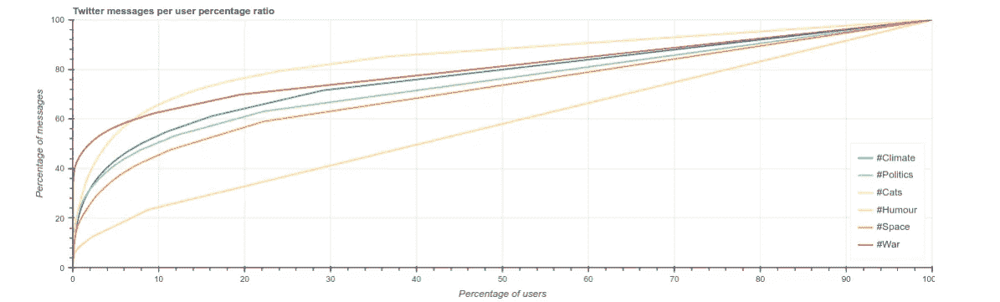

最活跃用户的消息分布，图像由作者提供

再次，结果看起来很有趣。我们可以看到分布有很强的偏斜：10%最活跃的用户发布了 50-60%的消息（剧透：正如我们很快会看到的，并不是所有人都是人类；）。

这个图表是通过一个只有大约 20 行代码的函数制作的。这个“分析”相当简单，但可能会出现许多额外的问题。不同话题之间有明显的区别，找出原因显然不是简单的。哪些话题有最多的活跃用户？是否存在文化或地域差异，不同国家如美国、俄罗斯或日本的曲线是否相同？我鼓励读者自己做一些测试。

既然我们获得了一些基本见解，是时候做一些更具挑战性的事情了。让我们对所有用户进行聚类，并尝试寻找一些共同模式。为此，首先，我们需要将用户的数据转换为嵌入向量。

## 3\. 创建用户嵌入

嵌入向量是表示每个用户数据的一系列数字。在上一篇文章中，我从推文的词汇和句子中获取了嵌入向量。现在，因为我想在“时间”领域找到模式，我将基于消息时间计算嵌入。但首先，让我们了解一下数据的样子。

作为提醒，我们有一个包含所有推文的数据框，这些推文是为了特定的标签收集的。每条推文都有一个用户名、创建日期、时间和小时：

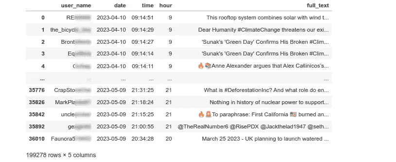

让我们创建一个帮助函数来显示特定用户的所有推文时间：

```py
def draw_user_timeline(df_in: pd.DataFrame, user_name: str):
    """ Draw cumulative messages time for specific user """
    df_u = df_in[df_in["user_name"] == user_name]
    days_total = df_u['date'].unique().shape[0]

    # Group messages by time of the day
    messages_per_day = df_u.groupby(['time'], as_index=False).size()
    msg_time = messages_per_day['time']
    msg_count = messages_per_day['size']

    # Draw
    p = figure(x_axis_type='datetime', width=1600, height=150, title=f"Cumulative tweets timeline during {days_total} days: {user_name}")
    p.vbar(x=msg_time, top=msg_count, width=datetime.timedelta(seconds=30), line_color='black')
    p.xaxis[0].ticker.desired_num_ticks = 30
    p.xgrid.grid_line_color = None
    p.toolbar_location = None
    p.x_range.start = datetime.time(0,0,0)
    p.x_range.end = datetime.time(23,59,0)
    p.y_range.start = 0
    p.y_range.end = 1
    show(p)

draw_user_timeline(df, user_name="UserNameHere")
...
```

结果看起来是这样的：

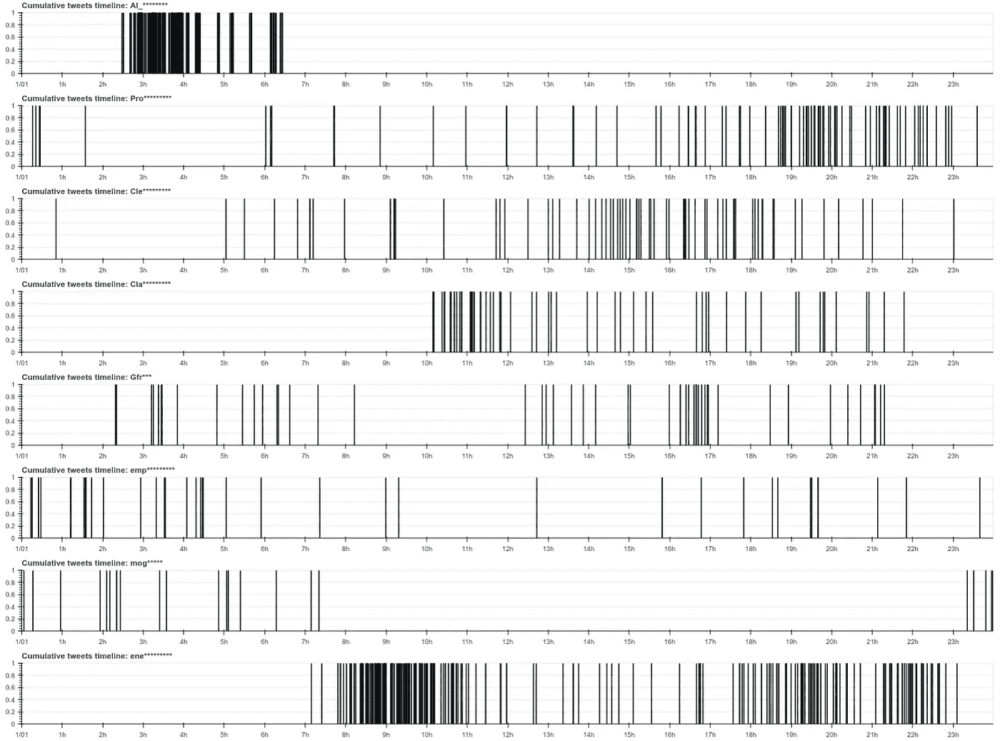

几个用户的消息时间线，作者提供的图片

在这里，我们可以看到一些用户在几周内发送的消息，显示在 00-24 小时的时间轴上。我们可能已经看到了一些模式，但事实证明，有一个问题。Twitter API 不返回时区。消息正文中有一个“timezone”字段，但它总是为空。也许当我们在浏览器中查看推文时，我们看到的是*本地时间*；在这种情况下，原始时区就不那么重要了。或者这可能是免费账户的一个限制。无论如何，如果来自美国的一个用户在 UTC 2 AM 开始发送消息，而来自印度的另一个用户在 UTC 13 PM 开始发送消息，两者的时间线将无法匹配在一起。

作为解决办法，我尝试通过使用一个简单的经验规则来“估计”时区：大多数人在夜间睡觉，很可能他们在那个时候不会发推文 ;) 因此，我们可以找到一个 9 小时的时间段，在这个时间段内消息的平均数量最少，并假设这是该用户的“夜间”时间。

```py
def get_night_offset(hours: List):
    """ Estimate the night position by calculating the rolling average minimum """
    night_len = 9
    min_pos, min_avg = 0, 99999 
    # Find the minimum position
    data = np.array(hours + hours)
    for p in range(24):
        avg = np.average(data[p:p + night_len])
        if avg <= min_avg:
            min_avg = avg
            min_pos = p

    # Move the position right if possible (in case of long sequence of similar numbers)
    for p in range(min_pos, len(data) - night_len):
        avg = np.average(data[p:p + night_len])
        if avg <= min_avg:
            min_avg = avg
            min_pos = p
        else:
            break

    return min_pos % 24

def normalize(hours: List):
    """ Move the hours array to the right, keeping the 'night' time at the left """
    offset = get_night_offset(hours)
    data = hours + hours
    return data[offset:offset+24]
```

实际上，这在可以轻松检测到“夜间”时间段的情况下效果良好：

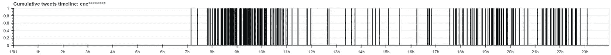

“活跃”用户的消息时间线，作者提供的图片

当然，有些人早上 7 点醒来，有些人则是早上 10 点，且没有时区信息，我们无法找到它。总之，这总比没有好，作为一个“基线”，这个算法可以使用。

显然，算法在这种情况下不起作用：

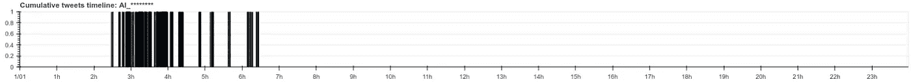

另一个只有几个“活跃”小时的用户，图像来源：作者

在这个例子中，我们只是不知道这个用户是在早晨、晚上还是午餐后发布消息；对此没有信息。但仍然有趣的是看到一些用户仅在一天中的特定时间发布消息。在这种情况下，拥有一个“虚拟偏移”仍然有帮助；它使我们能够“对齐”所有用户时间线，正如我们在结果中即将看到的那样。

现在让我们计算**嵌入向量**。可以有不同的方法来做到这一点。我决定使用* [SumTotal, Sum00,.., Sum23]* 形式的向量，其中 *SumTotal* 是用户发布的总消息量，而 *Sum00..Sum23* 是每天每小时发布的总消息数。我们可以使用 Pandas 的 *groupby* 方法，参数为“user_name”和“hour”，这几乎可以为我们完成所有需要的计算：

```py
def get_vectorized_users(df_in: pd.DataFrame):
    """ Get embedding vectors for all users 
        Embedding format: [total hours, total messages per hour-00, 01, .. 23]
    """
    gr_messages_per_user = df_in.groupby(['user_name', 'hour'], as_index=True).size()

    vectors = []
    users = gr_messages_per_user.index.get_level_values('user_name').unique().values    
    for ind, user in enumerate(users):
        if ind % 10000 == 0:
            print(f"Processing {ind} of {users.shape[0]}")
        hours_all = [0]*24
        for hr, value in gr_messages_per_user[user].items():
            hours_all[hr] = value

        hours_norm = normalize(hours_all)
        vectors.append([sum(hours_norm)] + hours_norm)

    return users, np.asarray(vectors)

all_users, vectorized_users = get_vectorized_users(df)
```

在这里，“get_vectorized_users”方法正在进行计算。计算每个 00..24 小时向量后，我使用“normalize”函数来应用之前描述的“时区”偏移。

实际上，对于一个相对活跃的用户，嵌入向量可能如下所示：

```py
[120 0 0 0 0 0 0 0 0 0 1 2 0 2 2 1 0 0 0 0 0 18 44 50 0]
```

这里 120 是消息的总数，其余部分是一个 24 位的数组，其中包含每小时发布的消息数量（作为提醒，在我们的案例中，数据是在 46 天内收集的）。对于不活跃的用户，嵌入可能如下所示：

```py
[4 0 0 0 0 0 0 0 0 0 1 0 0 0 0 0 0 0 1 1 1 0 0 0 0]
```

也可以创建不同的嵌入向量，更复杂的方案可能会提供更好的结果。例如，添加每天“活跃”小时的总数或将星期几包含到向量中，看看用户活动如何在工作日和周末之间变化，等等，可能会很有趣。

## 4. 聚类

和上一篇文章一样，我将使用 K-Means 算法来寻找聚类。首先，让我们使用[肘部法则](https://en.wikipedia.org/wiki/Elbow_method_(clustering))来找到最佳 K 值：

```py
import matplotlib.pyplot as plt  
%matplotlib inline

def graw_elbow_graph(x: np.array, k1: int, k2: int, k3: int):
    k_values, inertia_values = [], []
    for k in range(k1, k2, k3):
        print("Processing:", k)
        km = KMeans(n_clusters=k).fit(x)
        k_values.append(k)
        inertia_values.append(km.inertia_)

    plt.figure(figsize=(12,4))
    plt.plot(k_values, inertia_values, 'o')
    plt.title('Inertia for each K')
    plt.xlabel('K')
    plt.ylabel('Inertia')

graw_elbow_graph(vectorized_users, 2, 20, 1)
```

结果如下所示：

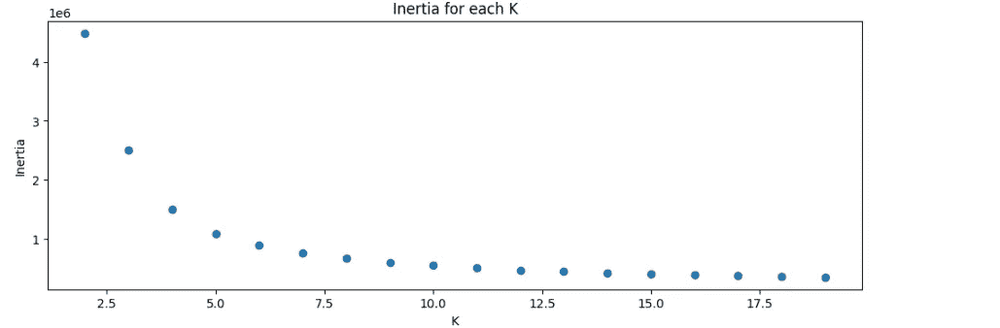

用户嵌入的肘部图，图像来源：作者

让我们编写方法来计算聚类并绘制一些用户的时间线：

```py
def get_clusters_kmeans(x, k):
    """ Get clusters using K-Means """
    km = KMeans(n_clusters=k).fit(x)
    s_score = silhouette_score(x, km.labels_)
    print(f"K={k}: Silhouette coefficient {s_score:0.2f}, inertia:{km.inertia_}")

    sample_silhouette_values = silhouette_samples(x, km.labels_)
    silhouette_values = []
    for i in range(k):
        cluster_values = sample_silhouette_values[km.labels_ == i]
        silhouette_values.append((i, cluster_values.shape[0], cluster_values.mean(), cluster_values.min(), cluster_values.max()))
    silhouette_values = sorted(silhouette_values, key=lambda tup: tup[2], reverse=True)

    for s in silhouette_values:
        print(f"Cluster {s[0]}: Size:{s[1]}, avg:{s[2]:.2f}, min:{s[3]:.2f}, max: {s[4]:.2f}")        
    print()

    # Create new dataframe
    data_len = x.shape[0]
    cdf = pd.DataFrame({
        "id": all_users,
        "vector": [str(v) for v in vectorized_users],
        "cluster": km.labels_,
    })

    # Show top clusters
    for cl in silhouette_values[:10]:
        df_c = cdf[cdf['cluster'] == cl[0]]
        # Show cluster
        print("Cluster:", cl[0], cl[2])
        with pd.option_context('display.max_colwidth', None):
            display(df_c[["id", "vector"]][:20])
        # Show first users
        for user in df_c["id"].values[:10]:
            draw_user_timeline(df, user_name=user)
        print()

    return km.labels_

clusters = get_clusters_kmeans(vectorized_users, k=5)
```

这个方法与前面部分大致相同，唯一的区别是我为每个聚类绘制用户时间线，而不是词云。

## 5. 结果

最终，我们准备查看结果。显然，并不是所有组都完美分开，但一些类别值得提及。作为提醒，我分析了所有在 46 天内发布了“#Climate”标签的用户的推文。那么，在气候相关的帖子中，我们可以看到哪些聚类呢？

**“非活跃”** 用户，他们在一个月内只发送了 1–2 条消息。这个群体是最大的；正如前面讨论的，它代表了所有用户的 95%以上。而 K-Means 算法能够检测到这个群体是最大的。那些用户的时间线如下：

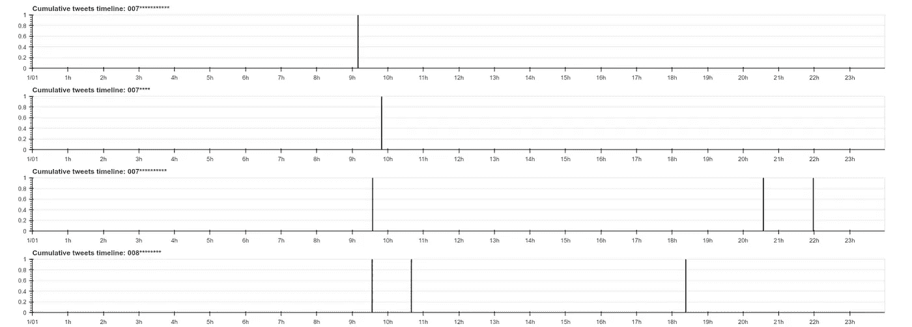

几个“非活跃”用户的消息时间线，图像来源于作者

**“感兴趣”** 用户。这些用户每 2–5 天发布一次推文，因此我可以假设他们对这个话题至少有一定的兴趣。

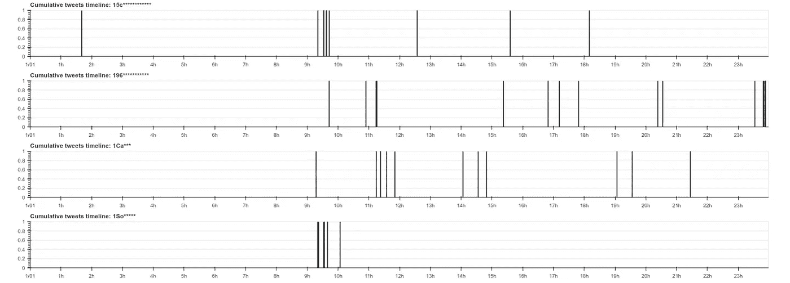

几个“感兴趣”用户的消息时间线，图像来源于作者

**“活跃”** 用户。这些用户每天发布超过几条消息：

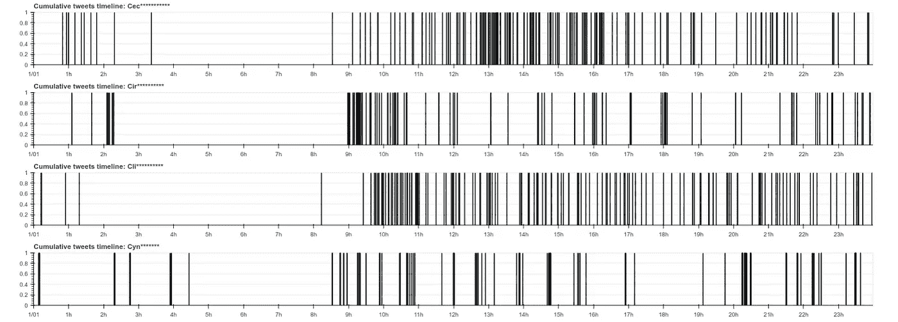

几个“活跃”用户的消息时间线，图像来源于作者

我们不知道这些人是只是“积极分子”，还是将发布推文作为工作的一个部分，但至少我们可以看到他们的在线活动相当高。

**“机器人”**。这些用户极不可能是人类。毫不奇怪，他们发布的消息数量最多。当然，我没有 100%证据证明所有这些账户都属于机器人，但任何人类都不可能如此规律地发布消息而没有休息和睡眠：

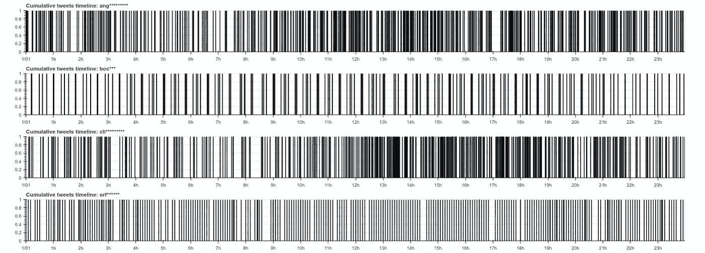

几个“机器人”的消息时间线，图像来源于作者

例如，第二个“用户”在一天中的同一时间发布推文，精确到 1 秒；他的推文可以用作 NTP 服务器 :)

顺便说一下，一些其他的“用户”实际上并不活跃，但他们的时间线看起来很可疑。这个“用户”消息不多，而且存在明显的“日/夜”模式，所以它没有被聚类为“机器人”。但对我来说，普通用户严格在每小时开始时发布消息看起来不太现实：

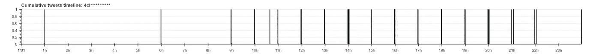

一个用户的消息时间线，图像来源于作者

也许自相关函数可以在检测所有可疑重复活动的用户方面提供良好的结果。

**“克隆”**。如果我们用更高的 K 值运行 K-Means 算法，我们也可以检测到一些“克隆”。这些聚类具有相同的时间模式和最高的轮廓系数值。例如，我们可以看到几个相似的昵称的账户，只在最后几个字符上有所不同。可能，脚本正在并行从几个账户发布消息：

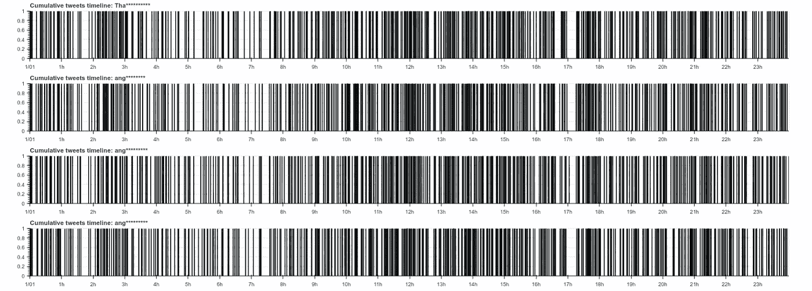

几个具有相同模式的用户消息时间线，图像来源于作者

作为最后一步，我们可以看到由 t-SNE（t-分布随机邻域嵌入）算法制作的聚类可视化，这看起来相当漂亮：

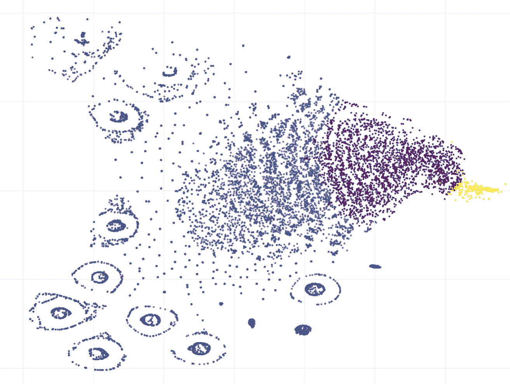

t-SNE 聚类可视化，图像来源于作者

在这里我们可以看到很多较小的聚类，这些聚类没有被 K-Means（K=5）检测到。在这种情况下，尝试更高的 K 值是有意义的；也许像 [DBSCAN](https://medium.com/towards-data-science/how-dbscan-works-and-why-should-i-use-it-443b4a191c80)（基于密度的空间聚类应用程序）这样的算法也会提供良好的结果。

## 结论

使用数据聚类，我们能够在数万条关于“#气候”的推文中找到独特的模式，这些推文由不同的用户发布。分析本身仅仅是基于推文发布的时间进行的。这在社会学或文化人类学研究中可能会很有用；例如，我们可以比较不同用户在不同话题上的在线活动，弄清楚他们发帖的频率等等。时间分析是语言无关的，因此也可以比较不同地理区域的结果，例如英语和日语用户之间的在线活动。基于时间的数据也可能对心理学或医学有用；例如，可以弄清楚人们在社交网络上花费了多少时间或他们暂停的频率。正如上面所示，发现用户“行为”中的模式不仅对研究目的有用，而且对检测机器人、*克隆*或发布垃圾邮件的用户等纯粹的“实际”任务也很有帮助。

可惜，并非所有的分析都成功，因为 Twitter API 没有提供时区数据。例如，看看人们是早上发消息更多还是晚上发消息更多将会很有趣，但由于没有适当的时间，无法实现；Twitter API 返回的所有消息都是 UTC 时间。但无论如何，很高兴 Twitter API 即使在免费账户下也允许我们获取大量数据。而且，显然，这篇文章中描述的思想不仅可以用于 Twitter，也可以用于其他社交网络。

如果你喜欢这个故事，可以 [订阅](https://medium.com/@dmitryelj/membership) Medium，这样你会在我的新文章发布时收到通知，并且可以全面访问其他作者的成千上万的故事。

感谢阅读。
