# 在 Twitter 帖子中发现时间模式：使用 Python 进行探索性数据分析（第二部分）

> 原文：[`towardsdatascience.com/finding-temporal-patterns-in-twitter-posts-exploratory-data-analysis-with-python-part-2-8eec19431c23`](https://towardsdatascience.com/finding-temporal-patterns-in-twitter-posts-exploratory-data-analysis-with-python-part-2-8eec19431c23)

## 使用 Python 和 Pandas 进行用户行为分析

[](https://dmitryelj.medium.com/?source=post_page-----8eec19431c23--------------------------------)[](https://towardsdatascience.com/?source=post_page-----8eec19431c23--------------------------------) [Dmitrii Eliuseev](https://dmitryelj.medium.com/?source=post_page-----8eec19431c23--------------------------------)

·发表于 [Towards Data Science](https://towardsdatascience.com/?source=post_page-----8eec19431c23--------------------------------) ·阅读时间 15 分钟·2023 年 6 月 12 日

--


用户时间线示例，图片由作者提供

在这篇文章的第一部分中，我分析了大约 70,000 条 Twitter 帖子的时间戳，并获得了一些有趣的结果；例如，可以检测到机器人或从克隆账户发布消息的用户。但我未能获取准确的消息时间；至少对于免费账户，Twitter API 响应没有时区，所有消息都有 UTC 时间。现在，数以百万计的人使用社交网络，对用户行为的分析不仅有趣，而且可能对社会学或心理学研究重要。例如，了解人们是在晚上、夜间还是白天发布更多消息是有趣的，但没有准确的时间就无法知道。最后，我找到了一种即使在免费 API 限制下也能很好工作的解决方法。

在本文中，我将展示从数据收集到使用 Python 和 Pandas 进行分析的完整工作流程。

## 方法论

我们的数据处理流程将包括几个步骤：

+   使用 [Tweepy 库](https://github.com/tweepy/tweepy) 收集数据。

+   加载数据并获取基本见解。

+   数据转换。我们将按用户对数据进行分组，并寻找对分析有用的特定指标。

+   分析结果。

让我们开始吧。

## 1. 收集数据

正如前一部分所述，我们无法获取 Twitter 消息的正确时区；所有由 Twitter API 返回的消息都具有 UTC 时间。作为一种变通方法，我决定测试三种方法：

+   我尝试使用“*”掩码获取**所有消息**并分析每条消息的“位置”字段。并非每个用户在 Twitter 上都指定了位置，但相当大一部分用户指定了。这个想法很好，但实际上没有效果。Twitter 是一个大型社交网络；它生成大量数据，收集一周内的所有推文是不现实的。每秒数千条消息的数量不仅对普通 PC 处理来说过大，而且也超出了免费的 Twitter 开发者账户的限制。

+   我可以使用**城市名称**作为请求；例如，我可以搜索所有带有“#Berlin”标签的推文。然后很容易筛选出位置为“德国”的用户，对于德国，我们知道其时区。这个想法是可行的，但问题是结果可能会有偏差。例如，带有“#Berlin”标签的消息可能是由对政治感兴趣的人或体育迷发布的。但总体来说，这种方法很有趣；通过不同的搜索查询，可能能够接触到不同类型的受众。

+   最终，我找到了一种对我有效的解决方案。我决定通过指定“*”掩码和语言代码来获取**特定语言**的**所有**消息。这显然对英语不起作用，但世界上有许多地理面积足够小的国家，可以轻松确定其公民的时区。我选择了荷兰语，因为世界上荷兰语使用者的数量并不大；这种语言主要在荷兰和比利时使用，这两个国家有相同的时区。虽然有些人可能居住在国外，也有一些荷兰语母语者在苏里南和库拉索，但这些数字也不多。

收集数据本身是简单的。代码已经在第一部分中使用过；我只指定了“*”作为查询掩码和“nl”作为语言代码。一个免费的 Twitter API 对获取历史数据有 7 天的限制。但实际上，分页的限制大约为 100,000 条消息。这算多吗？实际上，不算。大多数人可能从未意识到社交媒体上发布了多少消息。全世界只有大约 2500 万荷兰语使用者。而 100,000 是这些人在仅仅 3 小时内在 Twitter 上发布的消息数量！实际上，我需要每隔至少 2 小时运行一次代码才能获取所有的推文。

每两小时收集一次数据并不成问题；这可以轻松在云端完成，但作为一个免费的解决方案，我就使用了我的 Raspberry Pi：


Raspberry Pi 4，图片来源 [`en.wikipedia.org/wiki/Raspberry_Pi`](https://en.wikipedia.org/wiki/Raspberry_Pi)

Raspberry Pi 是一款小型的信用卡大小的 Linux 计算机，配备 1–8 GB 的 RAM 和 1–2 GHz 的 CPU。这些规格完全足够我们的任务，而且 Raspberry Pi 没有冷却装置，不产生噪音，功耗只有 2–5 W。因此，它是运行一到两周代码的理想选择。

我稍微修改了 Python 脚本，使其每 2 小时请求一次，并且在每个 CSV 文件的名称中添加了时间戳。在通过 SSH 登录到 Raspberry Pi 后，我可以通过使用 Linux 的 “nohup” 命令在后台运行这个脚本：

```py
nohup python3 twit_grabs.py >/dev/null 2>&1 &
```

默认情况下，“nohup” 将控制台输出保存到 “*nohup.out*” 文件中。这个文件可能很大，所以我使用了转发到 “/dev/null” 来防止这一点。像 Cron 这样的其他解决方案也可以使用，但这个简单的命令足够完成这个任务。

这个过程在后台运行，所以我们在屏幕上看不到任何东西，但我们可以使用 “tail” 命令实时查看日志（这里的 “20230601220000” 是当前文件的名称）：

```py
tail -f -n 50 tweets_20230601220000.csv
```

在控制台获取推文的样子如下：

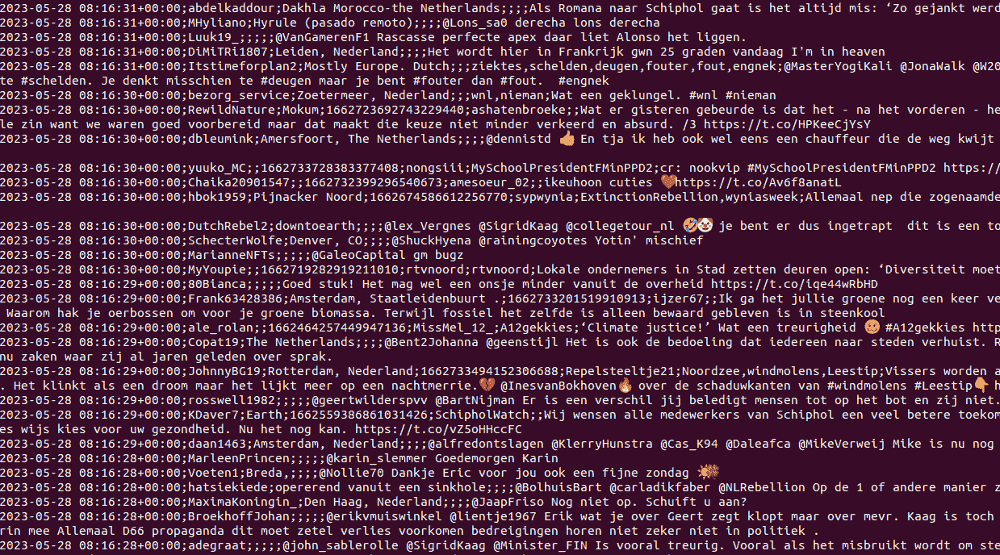

收集 Twitter 消息，作者提供的图片

如有需要，我们可以使用 “scp” 命令从 Raspberry Pi 复制新的日志：

```py
scp pi@raspberrypi:/home/pi/Documents/Twitter/tweets_20230601220000.csv .
```

这里，“/home/pi/Documents/…” 是 Raspberry Pi 上的远程路径，“.” 是桌面 PC 上的当前文件夹，CSV 文件应该被复制到这里。

在我的案例中，我让 Raspberry Pi 运行了大约 10 天，这足以收集一些数据。但一般来说，时间越长越好。在为文章的前一部分准备数据时，我看到有些用户每周只发一次 Twitter 帖子；显然，需要更长的间隔才能观察到这些用户行为中的模式。

## 2\. 加载数据

Python 脚本每 2 小时获取一次新的 Twitter 消息，并生成大量 CSV 文件作为输出。我们可以在 Pandas 中加载所有文件，并将它们合并成一个数据集：

```py
df_tweets = []
files = glob.glob("data/*.csv")
for file_name in files:
    df_tweets.append(pd.read_csv(file_name, sep=';', 
                                 usecols=['id', 'created_at', 'user_name', 'user_location', 'full_text'], 
                                 parse_dates=["created_at"], 
                                 lineterminator='\n', quoting=csv.QUOTE_NONE))
df = pd.concat(df_tweets).drop_duplicates('id').sort_values(by=['id'], ascending=True)
```

代码非常简单。我将每个文件加载到数据框中，然后使用 *pd.concat* 将所有数据框合并在一起。时间间隔是重叠的；为了避免重复记录，我使用 *drop_duplicates* 方法。

让我们看看我们有哪些数据：

```py
display(df)
```

结果如下所示：

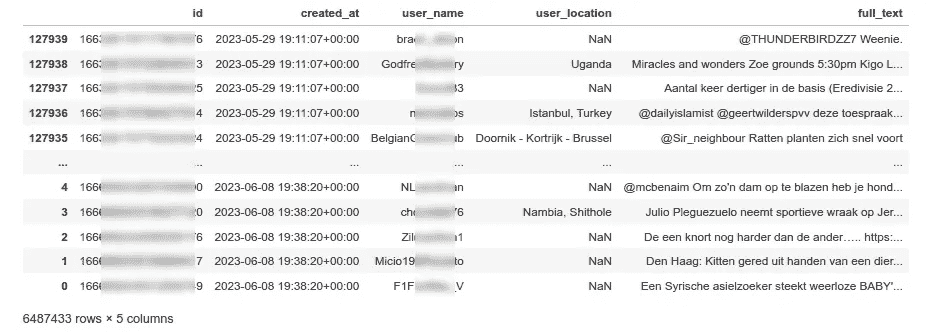

包含所有消息的数据框，作者提供的图片

文本和消息 ID 实际上并不重要；对于分析，我们只需要 “created_at” 字段。为了简化后续处理，让我们将日期、时间和小时提取为单独的列。我们还可以将时区偏移量添加到所有记录中：

```py
tz_offset_hours = 2

def update_timezone(t_utc: np.datetime64):
    """ Add timezone to the UTC time """
    return (t_utc + np.timedelta64(tz_offset_hours, 'h')).tz_convert(None)

def get_time(dt: datetime.datetime):
    """ Get time in HHMM format from the datetime """
    return dt.time().replace(
        second=0, 
        microsecond=0)

def get_date(dt: datetime.datetime):
    """ Get date from the datetime """
    return dt.date()

def get_datetime_hhmm(dt: datetime.datetime):
    """ Get date and time in HHMM format """
    return dt.to_pydatetime().replace(second=0, microsecond=0)

def get_hour(dt: datetime.datetime):
    """ Get hour from the datetime """
    return dt.hour

df["time_local"] = df['created_at'].map(update_timezone)
df["datetime_hhmm"] = df['time_local'].map(get_datetime_hhmm)
df["date"] = df['time_local'].map(get_date)
df["time"] = df['time_local'].map(get_time)
df["hour"] = df['time_local'].map(get_hour)
# Optionally, we can select only several days
df = df[(df['date'] >= datetime.date(2023, 5, 30)) & (df['date'] <= datetime.date(2023, 5, 31))].sort_values(by=['id'], ascending=True)
# Display
display(df)
```

结果如下所示：

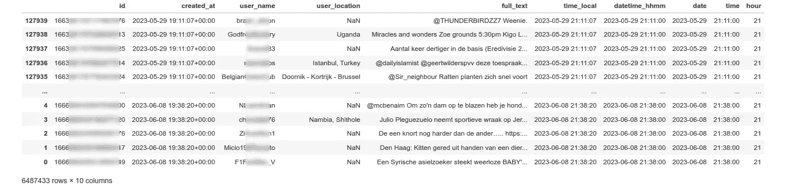

添加列的数据框，作者提供的图片

数据加载已完成。让我们看看数据的样子。

## 3\. 一般见解

本文旨在分析“时间”领域的模式。作为热身，让我们看看**单条时间线上的所有消息**。为了绘制文章中的所有图表，我将使用[Bokeh](https://github.com/bokeh/bokeh)库：

```py
from bokeh.io import show, output_notebook
from bokeh.plotting import figure
from bokeh.models import ColumnDataSource
from bokeh.models import SingleIntervalTicker, LinearAxis
from bokeh.transform import factor_cmap, factor_mark, linear_cmap
from bokeh.palettes import *
output_notebook()

def draw_summary_timeline(df_in: pd.DataFrame):
    """ Group all messages by time and draw the timline """
    print("All messages:", df_in.shape[0])
    users_total = df_in['user_name'].unique().shape[0]
    print("All users:", users_total)
    days_total = df_in['date'].unique().shape[0]
    print("Days total:", days_total)
    print()

    gr_messages = df_in.groupby(['datetime_hhmm'], as_index=False).size() # .sort_values(by=['size'], ascending=False)
    gr_messages["msg_per_sec"] = gr_messages['size'].div(60)
    datetime_hhmm = gr_messages['datetime_hhmm']
    amount = gr_messages['msg_per_sec']

    palette = RdYlBu11
    p = figure(x_axis_type='datetime', width=2200, height=500, 
               title="Messages per second")
    p.vbar(x=datetime_hhmm, top=amount, width=datetime.timedelta(seconds=50), line_color=palette[0])
    p.xaxis[0].ticker.desired_num_ticks = 30
    p.xgrid.grid_line_color = None
    show(p) 

draw_summary_timeline(df_)
```

在这种方法中，我按日期和时间对所有消息进行分组。我之前创建的时间戳具有“HH:MM”格式。每分钟消息数量不是一个方便的度量，所以我将所有值除以 60，以获得每秒消息数量。

结果如下：

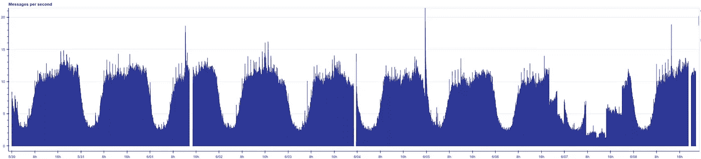

所有推特消息，图片由作者提供

代码在树莓派上运行了大约 10 天。结果收集了 1,515,139 个独特用户发送的 6,487,433 条推特消息。但在图像中，我们可以看到一些问题。某些时间间隔缺失；可能是当时没有互联网连接。另一天也有部分缺失，我不确定是什么原因；可能是免费推特账户的优先级最低。无论如何，我们不能抱怨免费 API，我的目标是至少收集一周的数据，我已经有足够的信息了。我可以在最后删除损坏的时间间隔：

```py
df = df[(df['date'] >= datetime.date(2023, 5, 30)) & \
        (df['date'] <= datetime.date(2023, 6, 5))]
```

顺便提一下，时间线上的另一个点引起了我的注意；高峰发生在 6 月 4 日，当时每秒消息数量几乎翻倍。我开始对这是什么感到好奇。我们可以轻松地过滤数据框：

```py
df_short = df[(df['datetime_hhmm'] >= datetime.datetime(2023, 6, 4, 23, 35, 0)) & \
              (df['datetime_hhmm'] <= datetime.datetime(2023, 6, 4, 23, 55, 0))]
with pd.option_context('display.max_colwidth', 80):
    display(df_short[["created_at", "full_text"]])
```

结果如下：

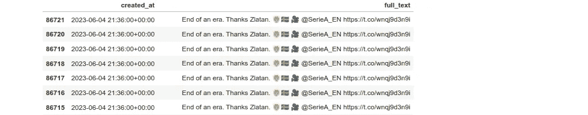

高峰期发布的推文，图片由作者提供

结果显示，著名足球运动员扎拉坦·伊布拉希莫维奇在 41 岁时宣布退役，这条消息引起了大量的推特转发：

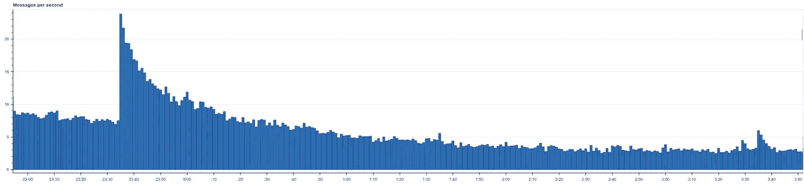

推特消息时间线，图片由作者提供

正如我们所见，高峰的持续时间大约为一个小时；可能会更长，但已较晚；根据时间线，公告是在 23:35 进行的。

不过让我们回到 Pandas。为了进一步的时间分析，让我们创建两个辅助方法来绘制**按一天中的时间分组的所有消息**：

```py
from bokeh.io import show
from bokeh.plotting import figure, output_file
from bokeh.models import ColumnDataSource
from bokeh.transform import linear_cmap
from bokeh.palettes import *

def draw_dataframe(p: figure, df_in: pd.DataFrame, color: str, legend_label: str):
    """ Draw all messages on the 00..24 timeline """
    messages_per_day = df_in.groupby(['time'], as_index=False).size()    
    days_total = df["date"].unique().shape[0]

    msg_time = messages_per_day['time']
    # Data was summarized per minute, div by 60 to get seconds
    msg_count = messages_per_day['size']/(days_total*60)  

    source = ColumnDataSource(data=dict(xs=msg_time, ys=msg_count))    
    p.vbar(x='xs', top='ys', width=datetime.timedelta(seconds=50), 
           color=color, legend_label=legend_label, source=source)        

def draw_timeline(df_filtered: pd.DataFrame, df_full: pd.DataFrame):
    """ Draw timeline as a bargraph """
    p = figure(width=1600, height=400, title="Messages per second", x_axis_type="datetime", x_axis_label='Time')

    palette = RdYlBu11
    draw_dataframe(p, df_full, color=palette[0], legend_label="All values")
    if df_filtered is not None:
        draw_dataframe(p, df_filtered, color=palette[1], legend_label="Filtered values")

    p.xgrid.grid_line_color = None
    p.x_range.start = 0
    p.x_range.end = datetime.time(23, 59, 59)
    p.xaxis.ticker.desired_num_ticks = 24
    p.toolbar_location = None
    show(p)
```

这样我们可以看到所有消息在单个 24 小时时间线上的分布：

```py
draw_timeline(df_filtered=None, df_full=df)
```

可选的“df_filtered”参数将在后续使用。结果如下：

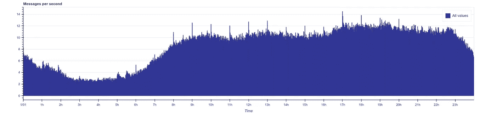

每日消息，图片由作者提供

我们可以清晰地看到昼夜差异，因此我假设大多数荷兰消息来自相同的时区是正确的。

我们还可以绘制**单个用户的时间线**。我在之前的部分已经使用了这种方法。为了方便那些可能将本文作为教程的读者，我会将代码也放在这里：

```py
def draw_user_timeline(df_in: pd.DataFrame, user_name: str):
    """ Draw cumulative messages time for specific user """
    df_u = df_in[df_in["user_name"] == user_name]

    # Group messages by time of the day
    messages_per_day = df_u.groupby(['time'], as_index=False).size()
    msg_time = messages_per_day['time']
    msg_count = messages_per_day['size']

    # Draw
    p = figure(x_axis_type='datetime', width=1600, height=150, 
               title=f"Cumulative tweets timeline: {name} ({sum(msg_count)} messages)")
    p.vbar(x=msg_time, top=msg_count, width=datetime.timedelta(seconds=30), line_color='black')
    p.xaxis[0].ticker.desired_num_ticks = 30
    p.xgrid.grid_line_color = None
    p.toolbar_location = None
    p.x_range.start = datetime.time(0,0,0)
    p.x_range.end = datetime.time(23,59,0)
    p.y_range.start = 0
    p.y_range.end = 1
    p.yaxis.major_tick_line_color = None
    p.yaxis.minor_tick_line_color = None
    p.yaxis.major_label_text_color = None
    show(p)

draw_user_timeline(df, user_name="Ell_____")
```

结果如下：

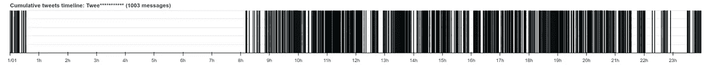

单个用户的消息时间线，图片由作者提供

## 4\. 数据转换

在上一步中，我们获得了所有用户消息的“原始”数据框。我们将找到每日模式，因此作为输入数据，让我们获取按小时分组并计算的每用户消息数量：

```py
gr_messages_per_user = df.groupby(['user_name', 'hour'], as_index=True).size()
display(gr_messages_per_user)
```

结果如下：


作为提醒，我使用了 7 天的数据。在这个例子中，我们可以看到在此时间段内，用户在早上 7 点发布了 4 条消息，在早上 8 点发布了 1 条消息，在下午 5 点发布了 3 条消息，等等。

对于分析，我决定使用三个指标：

+   用户每天进行 Twitter 发布的“繁忙小时”总数（在上一个示例中，数量是 5）。

+   每个用户的消息总数（在上一个示例中，数量是 20）。

+   一个包含 24 个数字的数组，表示按小时分组的消息数量。作为一个重要步骤，我还会将数组和标准化为 100%。

输出将是一个按用户名分组的新数据框。这个方法完成了所有的计算：

```py
def get_user_hours_dataframe(df_in: pd.DataFrame):   
    """ Get new dataframe of users """    
    busy_hours = []
    messages = []
    hour_vectors = []
    vectors_per_hour = [[] for _ in range(24)]
    gr_messages_per_user = df_in.groupby(['user_name', 'hour'], as_index=True).size()
    users = gr_messages_per_user.index.get_level_values('user_name').unique().values
    for ind, user in enumerate(users):
        if ind % 50000 == 0:
            print(f"Processing {ind} of {users.shape[0]}")
        hours_all = [0]*24
        for hr, value in gr_messages_per_user[user].items():
            hours_all[hr] = value

        busy_hours.append(get_busy_hours(hours_all))
        messages.append(sum(hours_all))
        hour_vectors.append(np.array(hours_all))
        hours_normalized = get_hours_normalized(hours_all)
        for hr in range(24):
            vectors_per_hour[hr].append(hours_normalized[hr])

    print("Making the dataframe...")
    cdf = pd.DataFrame({
        "user_name": users,
        "messages": messages,
        "hours": hour_vectors,
        "busy_hours": busy_hours
    })
    # Add hour columns to the dataframe
    for hr in range(24):
        cdf[str(hr)] = vectors_per_hour[hr]

    return cdf.sort_values(by=['messages'], ascending=False) 

def get_hours_normalized(hours_all: List) -> np.array:
    """ Normalize all values in list to 100% total sum"""
    a = np.array(hours_all)
    return (100*a/linalg.norm(a, ord=1)).astype(int)

df_users = get_user_hours_dataframe(df)
with pd.option_context('display.max_colwidth', None):
    display(df_users)
```

结果如下：

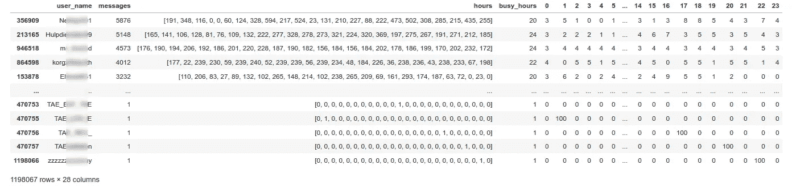

数据指标，按用户分组，作者提供的图片

现在我们有一个包含所有指标的数据框，准备开始处理这些数据。

## 5\. 分析

在最后一步中，我们将包含所有 Twitter 消息的“原始”数据框转换为按用户分组的数据。这个数据框实际上更有用。作为热身，让我们从简单的开始。让我们获取**每个用户的消息数量**。数据框已经排序，我们可以轻松看到发布最大数量消息的“前 5 名”用户：

```py
display(df_users[:5])
```

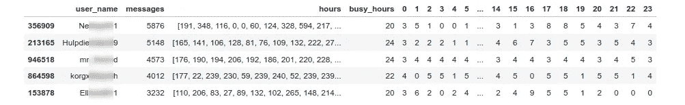

指标数据框，按用户分组，作者提供的图片

让我们还**找到百分位数**：

```py
> print(df_users["messages"].quantile([0.05, 0.1, 0.5, 0.9, 0.95]))

0.05     1.0
0.10     1.0
0.50     1.0
0.90     4.0
0.95    10.0
```

结果很有趣。这些数据是在 7 天内收集的。数据框中有 1,198,067 个唯一用户在此期间发布了至少一条消息。而 90 百分位数仅为 4，这意味着 90%的用户在这一周内仅发布了 4 条消息。与发布超过 5000 条推文的顶级用户相比，差异很大！但正如在第一部分讨论的那样，一些“顶级用户”可能是机器人。我们可以通过使用**每小时消息数量**轻松验证这一点。我已经有了按小时分组并标准化到 100%的消息数量。让我们找出连续发布消息而没有任何延迟的用户。为此，我们只需筛选出每小时发布 100/24 = 4%消息的用户：

```py
 df_users_filtered = df_users.copy()
    for p in range(24):
        df_users_filtered = df_users_filtered[(df_users_filtered[str(p)] >= 2) & \
                                              (df_users_filtered[str(p)] <= 5)]

    display(df_users_filtered)    
    for user_name in df_users_filtered["user_name"].values:
        draw_user_timeline(df, user_name)
```

这个数字可能不完全是 4%，因此我使用了 2..5%作为筛选范围。结果发现有 28 个“用户”每小时发布相同数量的消息：


发布等间隔消息的“用户”，作者提供的图片

在前一部分，我已经使用聚类算法检测到了一些机器人。在这里，我们可以看到即使使用更简单的方法，我们也可以获得类似的结果。

让我们进入更有趣的部分，**按活动时间分组用户**。由于每小时的消息总量被标准化为 100%，我们可以进行相当复杂的请求。例如，让我们添加新的列“早晨”、“白天”、“晚上”和“夜晚”：

```py
df_users["night"] = df_users["23"] + df_users["0"] + df_users["1"] + df_users["2"] + df_users["3"] + df_users["4"] + df_users["5"] + df_users["6"]
df_users["morning"] = df_users["7"] + df_users["8"] + df_users["9"] + df_users["10"]
df_users["day"] = df_users["11"] + df_users["12"] + df_users["13"] + df_users["14"] + df_users["15"] + df_users["16"] + df_users["17"] + df_users["18"]
df_users["evening"] = df_users["19"] + df_users["20"] + df_users["21"] + df_users["22"]
```

对于分析，我将只使用那些发了超过 10 条消息的用户：

```py
df_users_ = df_users[(df_users['messages'] > 10)]
df_ = df[df["user_name"].isin(df_users_["user_name"])]
```

当然，10 不是统计上显著的数字。这只是一个概念证明，对于真正的研究，建议在更长的时间间隔内收集数据。

无论如何，结果都很有趣。例如，我们可以找到**大部分消息都是早晨发出的**用户，只需一行代码。我们还可以获取所有这些消息并在时间线上绘制出来：

```py
df_users_filtered = df_users_[df_users_['morning'] >= 50]

print(f"Users: {100*df_users_filtered.shape[0]/df_users_.shape[0]}%")
df_filtered = df_[df_["user_name"].isin(df_users_filtered["user_name"])]
draw_timeline(df_filtered, df_)
```

结果如下：

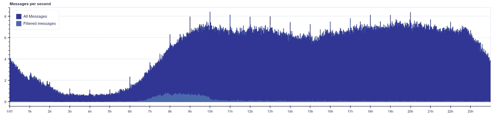

早晨发推文的用户，图片由作者提供

有趣的是，这个数字只有大约 3%。作为对比，46%的活跃用户在**白天发送超过 50%的消息**：

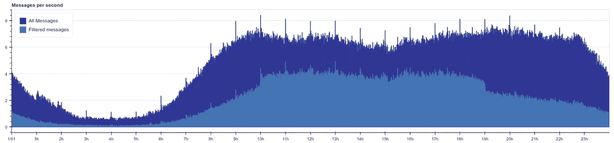

白天发推文的用户，图片由作者提供

我们可以提出其他请求；例如，让我们找出**80% 的消息都是在晚上发送的**用户：

```py
df_users_filtered = df_users_[df_users_['evening'] >= 80]
```

结果如下：

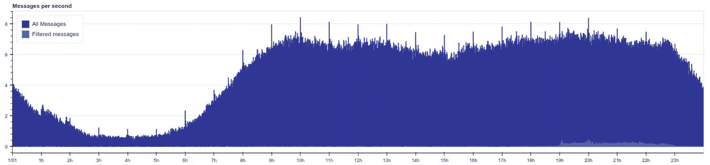

晚上发推文的用户，图片由作者提供

我们还可以显示一些用户的时间线以验证结果：

```py
for user_name in df_users_filtered[:5]["user_name"].values:
    draw_user_timeline(df_, user_name)
```

输出如下：

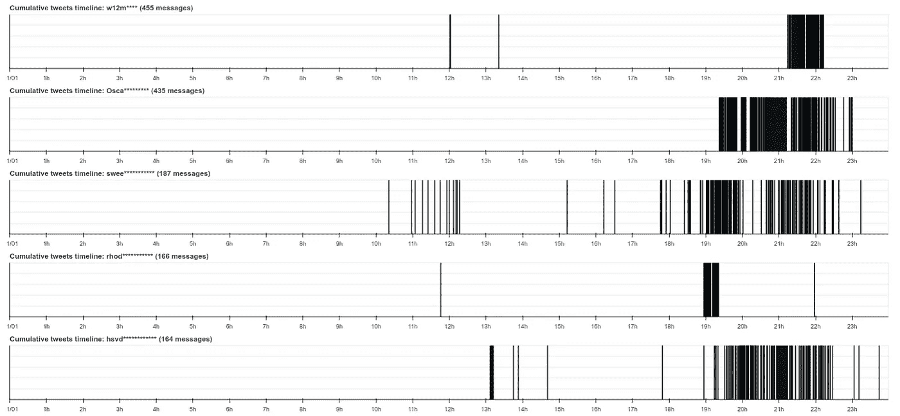

选择用户的时间线，图片由作者提供

结果可能很有趣；例如，用户“rhod***”几乎所有消息都集中在 19:00 之后发送。

我必须再次强调，这些结果不是最终的。我仅分析了在一周内发布了超过 10 条推文的较为活跃的用户。但还有大量用户发消息较少，要获得更多见解，数据应在几周甚至几个月内收集。

## 结论

在这篇文章中，我们能够获取所有用特定语言发布的 Twitter 消息——在我们的例子中是荷兰语。这种语言主要用于荷兰和比利时，这两个国家彼此接近。这使我们能够了解用户的时区，但遗憾的是，我无法从 Twitter API 中获得这一信息，至少使用免费账户是无法做到的。通过分析消息时间戳，我们可以获得很多有趣的信息；例如，可以找出用户是在早晨、工作时间还是晚上更活跃。发现用户行为的时间模式对于心理学、文化人类学甚至医学都可能有用。数百万的人在使用社交网络，了解这如何影响我们的生活、工作节奏或睡眠是很有趣的。正如文章所示，分析这种行为可以通过简单的请求完成，这实际上并不比学校数学更难。

看到社交网络可以存储如此大量的数据也很有趣。我想大多数人从未考虑过发布了多少消息。即使是相对较小的荷兰语社区（全球约 2500 万母语者），每秒钟也能生成超过 10 条推文。对于这篇文章，分析了来自 1,515,139 用户的 6,487,433 条 Twitter 消息，这些消息仅仅是 10 天内发布的！对于像德国这样的大国来说，获取所有消息可能会超出免费的 Twitter 开发账户的限制。在这种情况下，可以考虑结合不同的请求查询，并按用户位置进行过滤。

无论如何，社交网络是一个*关于我们*的有趣信息来源，我祝愿读者在自己的实验中好运。那些感兴趣的人也欢迎阅读关于使用 K-Means 算法对 Twitter 用户进行聚类的第一部分。另外，Twitter 帖子也进行了 NLP 分析。

如果你喜欢这个故事，可以[订阅](https://medium.com/@dmitryelj/membership)Medium，这样你将收到我新文章发布的通知，并可以全面访问其他作者的数千个故事。

感谢阅读。
