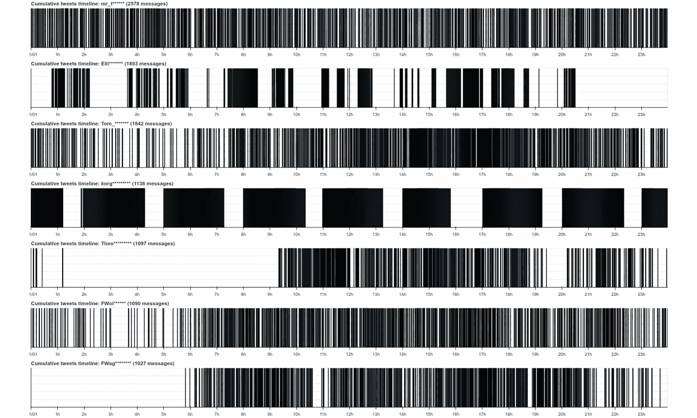

# 在 Twitter 帖子中寻找时间模式：使用 Python 的探索性数据分析（第二部分）

> 原文：[`towardsdatascience.com/finding-temporal-patterns-in-twitter-posts-exploratory-data-analysis-with-python-part-2-8eec19431c23?source=collection_archive---------6-----------------------#2023-06-12`](https://towardsdatascience.com/finding-temporal-patterns-in-twitter-posts-exploratory-data-analysis-with-python-part-2-8eec19431c23?source=collection_archive---------6-----------------------#2023-06-12)

## 使用 Python 和 Pandas 进行用户行为分析

 [Dmitrii Eliuseev](https://dmitryelj.medium.com/?source=post_page-----8eec19431c23--------------------------------)

·

[关注](https://medium.com/m/signin?actionUrl=https%3A%2F%2Fmedium.com%2F_%2Fsubscribe%2Fuser%2F65c1f6ba75db&operation=register&redirect=https%3A%2F%2Ftowardsdatascience.com%2Ffinding-temporal-patterns-in-twitter-posts-exploratory-data-analysis-with-python-part-2-8eec19431c23&user=Dmitrii+Eliuseev&userId=65c1f6ba75db&source=post_page-65c1f6ba75db----8eec19431c23---------------------post_header-----------) 发表在 [Towards Data Science](https://towardsdatascience.com/?source=post_page-----8eec19431c23--------------------------------) ·15 分钟阅读·2023 年 6 月 12 日

--

用户时间线示例，图片由作者提供

在这篇文章的第一部分中，我分析了大约 70,000 条 Twitter 帖子中的时间戳，并得出了一些有趣的结果；例如，能够检测到机器人或从克隆账户发布消息的用户。但我无法获得准确的消息时间；至少对于免费账户，Twitter API 响应没有时区，所有消息都使用 UTC 时间。如今，数百万人正在使用社交网络，用户行为的分析不仅有趣，而且可能对社会学或心理学研究至关重要。例如，了解人们是否在晚上、夜晚或白天发布更多消息可能很有意思，但没有准确时间就无法得知。最终，我找到了一个有效的解决方法，即使在免费 API 的限制下也能很好地工作。

在本文中，我将展示从数据收集到使用 Python 和 Pandas 进行分析的完整工作流程。

## 方法论

我们的数据处理流程将包括几个步骤：

+   使用[Tweepy 库](https://github.com/tweepy/tweepy)收集数据。

+   加载数据和…
