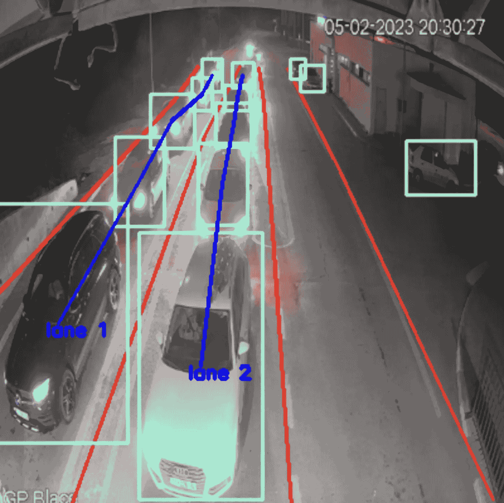
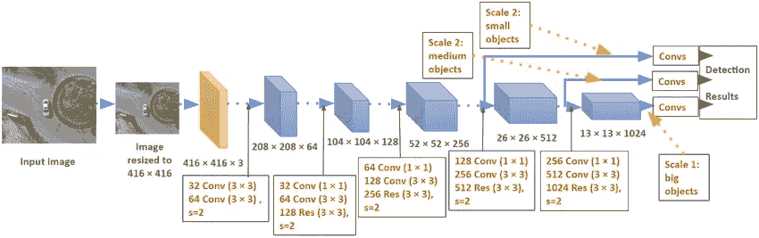
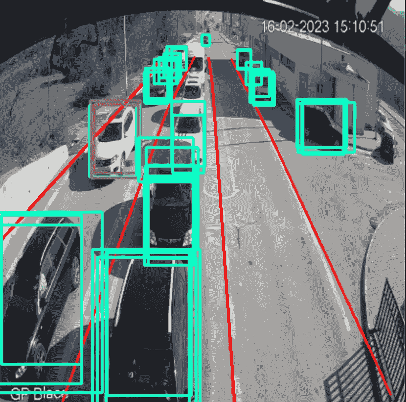
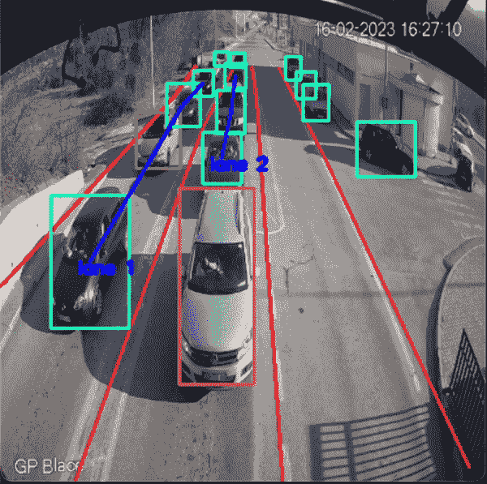
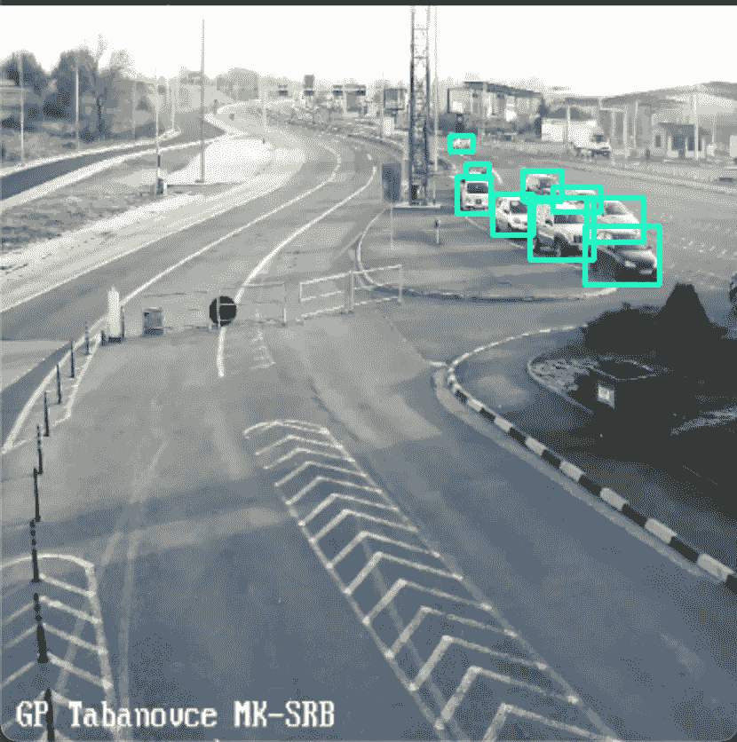

# 使用机器视觉找到边境通行的最快车道

> 原文：[`towardsdatascience.com/finding-the-fastest-lane-at-border-crossings-using-machine-vision-2e8dec6e03a3?source=collection_archive---------14-----------------------#2023-02-16`](https://towardsdatascience.com/finding-the-fastest-lane-at-border-crossings-using-machine-vision-2e8dec6e03a3?source=collection_archive---------14-----------------------#2023-02-16)

## 优化边境通行的目标检测与跟踪

[](https://medium.com/@danilo.najkov?source=post_page-----2e8dec6e03a3--------------------------------)[](https://towardsdatascience.com/?source=post_page-----2e8dec6e03a3--------------------------------) [Danilo Najkov](https://medium.com/@danilo.najkov?source=post_page-----2e8dec6e03a3--------------------------------)

·

[关注](https://medium.com/m/signin?actionUrl=https%3A%2F%2Fmedium.com%2F_%2Fsubscribe%2Fuser%2F19802d0e7d&operation=register&redirect=https%3A%2F%2Ftowardsdatascience.com%2Ffinding-the-fastest-lane-at-border-crossings-using-machine-vision-2e8dec6e03a3&user=Danilo+Najkov&userId=19802d0e7d&source=post_page-19802d0e7d----2e8dec6e03a3---------------------post_header-----------) 发表在 [Towards Data Science](https://towardsdatascience.com/?source=post_page-----2e8dec6e03a3--------------------------------) · 12 分钟阅读·2023 年 2 月 16 日[](https://medium.com/m/signin?actionUrl=https%3A%2F%2Fmedium.com%2F_%2Fvote%2Ftowards-data-science%2F2e8dec6e03a3&operation=register&redirect=https%3A%2F%2Ftowardsdatascience.com%2Ffinding-the-fastest-lane-at-border-crossings-using-machine-vision-2e8dec6e03a3&user=Danilo+Najkov&userId=19802d0e7d&source=-----2e8dec6e03a3---------------------clap_footer-----------)

--

[](https://medium.com/m/signin?actionUrl=https%3A%2F%2Fmedium.com%2F_%2Fbookmark%2Fp%2F2e8dec6e03a3&operation=register&redirect=https%3A%2F%2Ftowardsdatascience.com%2Ffinding-the-fastest-lane-at-border-crossings-using-machine-vision-2e8dec6e03a3&source=-----2e8dec6e03a3---------------------bookmark_footer-----------)

从[“Blace”边境通行相机](http://www.roads.org.mk/411/live-webcast)（公有领域）生成的图像

穿越边境可以是任何公路旅行中的激动人心的部分，但在边境通行处排长队的挫败感会迅速消磨这种兴奋感。如果我们能确定最快的车道并相应地调整位置呢？感谢机器视觉的进步，这现在已经成为可能。通过利用 OpenCV 和 YOLOv3（一个深度学习算法），现在可以实时检测和追踪移动的车辆。在这篇文章中，我们将探讨如何使用这些技术帮助人们节省时间，避免在边境通行处长时间排队的压力。

**内容**

+   问题概述

+   数据

+   目标检测

    – 汽车检测

    – 车道检测

+   目标追踪

+   协调所有内容

+   限制

+   未来工作

# 问题概述

这个任务的主要想法是处理来自边境摄像头实时流的原始图像数据，以检测和追踪移动的车辆。这个问题可以分为几个步骤：

+   从边境摄像头的直播中获取原始图像数据

+   预处理图像

+   应用算法来寻找车辆的位置

+   确定这些车辆的车道

+   应用算法来确定车辆的速度（从而确定每条车道的速度）

所有这些步骤都通过 docker-compose 结合起来，以便在多个边境视频流上运行解决方案。

# 数据

视频数据来源于对公众开放的边境摄像头。这些解决方案可以应用于任何边境/收费站摄像头的实时流媒体 *(.m3u8)*，并且可以很容易地适应其他形式的视频。几乎所有国家都有某种服务，让用户能够查看边境通行的实时情况。在这个具体的案例中，我使用了我国家摄像头的实时视频流。你可以通过这个 [链接](http://www.roads.org.mk/315/video-kameri) 找到这些视频流。

# 目标检测

在运行任何算法之前，我们需要加载视频流并对图像进行预处理。这可以通过 OpenCV2 轻松完成。我创建了一个将图像调整为 416x416 像素的函数（这是我使用的 YOLOv3 模型实现所要求的格式）。

```py
def preprocess(image):
    resized_image = cv2.resize(image, (416, 416))
    blob = cv2.dnn.blobFromImage(resized_image, 1 / 255, (416, 416), swapRB=True, crop=False)
    return resized_image, blob
```

在一个循环中，从流媒体中加载图像，并使用上述函数对其进行预处理。所有接下来的更改也将在这个循环中完成。此外，我检查是否与前一帧有所变化，因为如果没有变化，重新处理图像是没有必要的。

```py
old_frame = None
while True:
    # read the stream and get the current image
    cap = cv2.VideoCapture(BORDER_URL.m3u8)
    ret, frame = cap.read()
    if not ret:
        break

    if cv2.waitKey(1) & 0xFF == ord('q'):
        break
    # resize the image to correct formant
    image, blob = preprocess(frame)

    # check if the image is the same as the previous one by calculating the mean squared error between the two
    if old_frame is not None:
        mse = np.mean((image - old_frame) ** 2)
        if mse < 0.001:
            old_frame = image
            continue
```

## 汽车检测



YOLOv3 架构用于检测对象（感谢原始 [YOLOv3 论文](https://arxiv.org/abs/1804.02767)）

现在，我们已经准备好在图像中检测车辆。我使用了 YOLOv3 来获取模型训练过的所有类别的边界框，但只保留了车辆的边界框。加载此模型需要权重和配置文件，你可以从[官方网站](https://pjreddie.com/darknet/yolo/)下载。这一函数返回边界框、模型对检测对象的置信度、对象的类别（如汽车、卡车、行人等），以及每个边界框的中心点。

```py
def detect_cars(image, blob):
    net = cv2.dnn.readNet("./yolov3.weights", "./yolov3.cfg")
    net.setInput(blob)
    layer_names = net.getLayerNames()
    output_layers = [layer_names[i - 1] for i in net.getUnconnectedOutLayers()]
    predictions = net.forward(output_layers)
    boxes = []
    confidences = []
    class_ids = []
    centers = []
    for prediction in predictions:
        for detection in prediction:
            scores = detection[5:]
            class_id = int(np.argmax(scores))
            confidence = float(scores[class_id])

            # Filter out weak detections
            if confidence > 0.5:
                # Get detection coordinates
                x, y, w, h = (detection[0:4] * np.array(
                    [image.shape[1], image.shape[0], image.shape[1], image.shape[0]])).astype("int")
                x = int(x - w / 2)
                y = int(y - h / 2)

                center_x = int(x + w // 2)
                center_y = int(y + h // 2)

                centers.append((center_x, center_y))
                boxes.append([int(x), int(y), int(x + w), int(y + h)])
                confidences.append(float(confidence))
                class_ids.append(class_id)

    return boxes, confidences, class_ids, centers
```



算法在对[“Blace”边境检查摄像头](http://www.roads.org.mk/411/live-webcast)（公共领域）应用 NMS 之前的输出

我们有了关于边界框的所有信息，但是当我们运行应用程序时，发现有很多重叠的框需要去除。为了解决这个问题，我使用了非极大值抑制（NMS）。非极大值抑制（NMS）是一种后处理算法，用于对象检测任务，特别是用于去除同一对象的冗余或重叠的边界框。

NMS 用于过滤冗余的边界框，只保留最合适的框。NMS 的基本思路是首先根据检测置信度得分（即边界框包含对象的概率）对边界框进行排序。从置信度得分最高的边界框开始，NMS 抑制所有交并比（IoU）值大于某个阈值（例如 0.5）的重叠边界框。

以下函数执行此算法。它的参数包括边界框、边界框的置信度和我们想要过滤掉重复项的阈值。它返回我们需要保留的框的 ID。

```py
def NMS(boxes, confidences, threshold):
    if len(boxes) == 0:
        return []

    boxes = np.array(boxes)
    x1 = boxes[:, 0]
    y1 = boxes[:, 1]
    x2 = boxes[:, 2]
    y2 = boxes[:, 3]

    scores = confidences
    areas = (x2 - x1 + 1) * (y2 - y1 + 1)
    order = scores.argsort()[::-1]

    keep = []
    while order.size > 0:
        i = order[0]
        keep.append(i)
        xx1 = np.maximum(x1[i], x1[order[1:]])
        yy1 = np.maximum(y1[i], y1[order[1:]])
        xx2 = np.minimum(x2[i], x2[order[1:]])
        yy2 = np.minimum(y2[i], y2[order[1:]])

        w = np.maximum(0.0, xx2 - xx1 + 1)
        h = np.maximum(0.0, yy2 - yy1 + 1)
        inter = w * h
        ovr = inter / (areas[i] + areas[order[1:]] - inter)

        inds = np.where(ovr <= threshold)[0]
        order = order[inds + 1]

    return keep
```

使用这个算法后，每辆车只保留一个边界框。你可能需要调整阈值以找到适合你的设置。

## 车道检测

虽然有一些车道检测算法可能对这个任务有效，但它们可能不是最有效的选择。由于摄像头是固定的，车道位置不会变化，使用这些算法会浪费处理时间。为了解决这个问题，我将车道位置保存到了一个 JSON 文件中，作为点的列表。然而，在确定车道速度之前，还面临一个额外的挑战：识别每辆车所在的车道。

为此，我创建了以下函数，根据车辆的 x 坐标找到每辆车所在的位置。它返回车道的索引。如果车辆在车道之外，它返回-1。

```py
def get_x_at_y(line, y):
    loc = -1
    for segment in range(len(line)-1):
        if line[segment][1] <= y <= line[segment + 1][1] or line[segment][1] >= y >= line[segment + 1][1]:
            loc = segment
    if loc == -1:
        return None
    slope = (line[segment+1][1] - line[segment][1]) / (line[segment+1][0]-line[segment][0])
    return (y-line[segment+1][1])/slope + line[segment+1][0]

def track_lanes(car_centers, image, lanes):
    if len(car_centers) < 2:
        return []
    ccs_with_pos = []
    for cc in car_centers:
        xs = []
        for lane in lanes:
            xs.append(get_x_at_y(lane, cc[1]))
        dists = []
        if None in xs:
            ccs_with_pos.append((cc, -1))
            continue
        for x in xs:
            dists.append(x-cc[0])
        if dists[0]>0 or dists[-1]<0:
            ccs_with_pos.append((cc, -1))
            continue
        # check if x value of the car is between each two lines
        for i in range(len(dists)-1):
            if dists[i] < 0 < dists[i + 1]:
                ccs_with_pos.append((cc, i))
                break
    return ccs_with_pos
```

我们已经准备好通过实施对象跟踪来查看每个车道的变化率。

# 对象跟踪

目标跟踪是定位视频流中一个或多个特定物体并跟踪其移动过程。目标跟踪的目标是在视频的连续帧中保持物体的身份，尽管物体的位置、方向、大小和外观可能发生变化。虽然存在许多目标跟踪算法，但对于这个特定的使用案例，我决定使用光流法，因为它在较低帧率的视频流中效果相当好。

光流法是一种技术，通过分析相邻像素在连续视频帧中的强度变化来确定场景中物体的运动方向和速度。光流算法依赖于一个假设，即一个帧中的像素亮度与下一个帧中对应像素的亮度相同，从而允许计算物体在帧之间的位移。

这个算法要复杂得多，所以我不会详细解释。作为参数，它接收图像和前一图像、YOLOv3 模型中的汽车中心、车道以确定是否有运动发生在每个车道中，以及车道中的汽车以查看运动是否是由车辆运动或其他因素引起的。它返回每个车道的速度列表。

```py
def optical_flow(image, prev_image, features_to_track, lanes, cars_in_lanes):
    if len(cars_in_lanes) == 0:
        return list([-1 for el in range(len(lanes))])
    feature_params = dict(maxCorners=100,
                          qualityLevel=0.3,
                          minDistance=20,
                          blockSize=7)
    lk_params = dict(winSize=(30, 30),
                     maxLevel=5,
                     criteria=(cv2.TERM_CRITERIA_EPS | cv2.TERM_CRITERIA_COUNT, 10, 0.03))

    prev_gray = cv2.convertScaleAbs(prev_image)
    prev_gray = cv2.cvtColor(prev_gray, cv2.COLOR_BGR2GRAY)
    p0 = np.array(features_to_track).reshape((-1, 1, 2))
    p0 = np.float32(p0)
    gray = cv2.cvtColor(image, cv2.COLOR_BGR2GRAY)

    # Compute optical flow
    p1, st, err = cv2.calcOpticalFlowPyrLK(prev_gray, gray, p0, None, **lk_params)

    # Filter good points
    good_new = p1[st == 1]
    good_prev = p0[st == 1]

    # Find the speed of each lane
    lane_speeds = list([0 for el in range(len(lanes))])
    for i, (new, prev) in enumerate(zip(good_new, good_prev)):
        x_new, y_new = new.ravel()
        x_prev, y_prev = prev.ravel()
        xs_new = []
        xs_old = []
        for lane in lanes:
            xs_new.append(get_x_at_y(lane, y_new))
            xs_old.append(get_x_at_y(lane, y_prev))
        dists_new = []
        dists_old = []
        if None in xs_new or None in xs_old:
            continue
        for x in xs_new:
            dists_new.append(x - x_new)
        for x in xs_old:
            dists_old.append(x - x_prev)
        if dists_new[0] > 0 or dists_new[-1] < 0 or dists_old[0] > 0 or dists_old[-1] < 0:
            continue
        lane_new = None
        lane_old = None
        for j in range(len(dists_new) - 1):
            if dists_new[j] < 0 < dists_new[j + 1]:
                lane_new = j
                break
        for j in range(len(dists_old) - 1):
            if dists_old[j] < 0 < dists_old[j + 1]:
                lane_old = j
                break
        lane_speeds[lane_new] += math.dist([x_new, y_new],[x_prev, y_prev])

    for i, ls in enumerate(lane_speeds):
        cnt = 0
        for car in cars_in_lanes:
            if car[1] == i:
                cnt += 1
        if cnt == 0:
            lane_speeds[i] = -1
            continue
        lane_speeds[i] = lane_speeds[i]/cnt

    return lane_speeds
```

光流算法的输出被保存并与前一帧的输出进行比较。如果每个车道的光流值发生显著变化，则记录为 1 个移动点。这在以下函数中实现。

```py
def calc_movement(new_movement, old_movement, sum_movement):
    for i in range(len(new_movement)):
        if new_movement[i] > old_movement[i] + 1:
            sum_movement[i] += 1
    return sum_movement
```

现在一切都已实现，我们可以可视化结果。这个功能显示带有每辆车的边界框的图像、交通车道，并在控制台打印车道的速度。

```py
 def visualize(boxes, centers, class_ids, keep, image, colors, lanes, ccs_with_pos):
    for lane in lanes:
        cv2.polylines(image, [np.array(lane).reshape((-1, 1, 2))], False, (0,0,255), 2)
    for i, (box, c, ci) in enumerate(zip(boxes, centers, class_ids)):
        if i not in keep:
            continue
        class_list = ['car', 'motorbike', 'bus', 'truck', 'person']
        if classes[ci] in class_list:
            color = colors[class_list.index(classes[ci])]
            thickness = 2
            x, y, w, h = box
            cv2.rectangle(image, (x, y), (w, h), color, thickness)

    if ccs_with_pos is not None:
        prev_vehs = list([None for el in range(len(lanes))])
        for i in range(416, 0, -1):
            for car in ccs_with_pos:
                if car[0][1] == i and car[1] != -1:
                    if prev_vehs[car[1]] is None:
                        prev_vehs[car[1]] = car
                        cv2.putText(image, 'lane ' + str(car[1]+1), (car[0][0]-10, car[0][1]+10), cv2.FONT_HERSHEY_SIMPLEX,
                                    0.5, (255, 0, 0), 2, cv2.LINE_AA)
                    else:
                        cv2.line(image, car[0], prev_vehs[car[1]][0], (255,0,0), 2)
                        prev_vehs[car[1]] = car
    cv2.imshow("image", image)
```

在主循环中运行一切后，我们得到以下视频。程序输出显示第二车道（车道 2）的移动最多，因此速度最快。



[“Blace”边界穿越](http://www.roads.org.mk/411/live-webcast)的约 3 分钟加速 GIF（公共领域）

# 协调整个过程

尽管这个算法对于检测和跟踪单一边界穿越中的车辆已经完整，我希望将解决方案扩展到多个边界穿越，同时仍然保存速度结果。为实现这一目标，我决定将每个边界摄像头脚本作为一个独立的容器运行，该容器在 docker-compose 中进行通信。由于为每个摄像头运行单独的 YOLOv3 模型效率低下，我创建了一个带有 flask 应用程序的独立容器，用于服务其他容器。然而，为了确保多个请求不会同时使用相同的神经网络，重要的是要采用信号量或其他锁定机制。

此外，我开发了一个 .Net 网络 API，用于将每条车道的速度和汽车保存到数据库中。由于篇幅限制，这里无法包含完整的代码，但你可以在我的 [GitHub 仓库](https://github.com/dani2221/bordercount) 中找到它。通过这种实现，该解决方案可以部署到多个边境检查点，生成的数据可以高效地收集和分析，为不同地点的交通模式和拥堵情况提供有价值的见解。

```py
version: '3'
services:
  api:
    container_name: api
    build:
      context: ./api
      dockerfile: Dockerfile
    image: api:latest
    ports:
      - 80:80
    restart: always

  yolo:
    build: ./yolo_detector
    command: python script.py
    container_name: yolo
    ports:
      - 5001:5001
    restart: always

  script0:
    build: ./image_processing
    command: python count.py 0
    container_name: script0
    restart: always

  script1:
    build: ./image_processing
    command: python count.py 1
    container_name: script1
    restart: always

  ...
```

# 限制

尽管我们的算法已被证明非常有效，但重要的是要承认它的局限性。首先，我使用的目标检测模型 YOLOv3 在低光条件下（如夜间）的准确性较差。因此，检测到的车辆数量会显著减少，这可能导致对交通量的错误判断。此外，该模型在长距离检测物体时存在困难，这意味着在长队中可以检测到的车辆数量有限。

此外，考虑到边境检查点的设计可以有很大的差异也很重要。虽然大多数边境检查点可能遵循类似的布局，但也有一些具有更复杂特征，例如弯曲车道和额外障碍物。这些变化可能会导致算法在某些情况下无法使用。值得注意的是，进一步的开发和优化可能会解决这些限制，但目前在实施我们的解决方案时必须考虑这些因素。



[“Tabanovce” 检查点](http://www.roads.org.mk/411/live-webcast)（公共领域）中无法使用车道速度算法的示例边境检查点。

# 未来工作

虽然这个解决方案提供了一种有效的方式来确定边境检查点的车辆速度和交通拥堵情况，但仍有改进的空间。未来工作的一个方向是探索其他目标检测模型，看看它们在低光条件下或在检测远距离物体时是否能提供更好的准确性。

此外，调查在布局更复杂的边境检查点实施该算法的可行性也可能是有益的。这可能涉及开发新的算法，以应对弯曲车道、额外障碍物或其他特征带来的挑战。

此外，目前的解决方案可以扩展到结合机器学习技术，以适应随时间变化的交通模式。通过对长期收集的数据进行训练，模型可能会学会根据交通状况调整其参数，从而随着时间的推移提高其准确性和可靠性。

最后，可以考虑整合来自其他来源的数据，如社交媒体或交通摄像头，以提供对边境检查点交通模式的更全面理解。通过结合来自各种来源的数据，可能会发现交通模式与外部因素（如天气或公共事件）之间的关联，为交通管理和未来规划提供有价值的见解。这些数据可以帮助人们更好地规划出行，设置最少预期交通的出发时间。

# 结论

总之，通过使用机器视觉算法，我们已经开发出了一种有效的解决方案来确定边境检查点的车辆速度和交通流量。你可以在[GitHub](https://github.com/dani2221/bordercount)上试验代码，并尝试查看你附近边境检查点的结果。感谢你的阅读！
