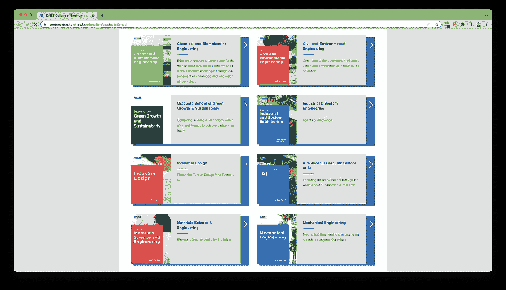

# 寻找你梦想中的人工智能硕士项目

> 原文：[`towardsdatascience.com/finding-your-dream-masters-program-in-ai-17f525c89151?source=collection_archive---------6-----------------------#2023-06-01`](https://towardsdatascience.com/finding-your-dream-masters-program-in-ai-17f525c89151?source=collection_archive---------6-----------------------#2023-06-01)

## 基于价值观的项目选择和网络建设方法。

  [Simon Aytes](https://medium.com/@saaytes?source=post_page-----17f525c89151--------------------------------)

·

[关注](https://medium.com/m/signin?actionUrl=https%3A%2F%2Fmedium.com%2F_%2Fsubscribe%2Fuser%2Ffd92cb149372&operation=register&redirect=https%3A%2F%2Ftowardsdatascience.com%2Ffinding-your-dream-masters-program-in-ai-17f525c89151&user=Simon+Aytes&userId=fd92cb149372&source=post_page-fd92cb149372----17f525c89151---------------------post_header-----------) 发表在 [Towards Data Science](https://towardsdatascience.com/?source=post_page-----17f525c89151--------------------------------) ·9 分钟阅读·2023 年 6 月 1 日

--

摄影师 [Mikael Kristenson](https://unsplash.com/@mikael_k?utm_source=medium&utm_medium=referral) 摄于 [Unsplash](https://unsplash.com/?utm_source=medium&utm_medium=referral)

去年我申请并被接受到 12 个人工智能研究生项目，包括韩国先进科学技术学院（KAIST）、哥伦比亚大学和伦敦大学学院（UCL）。

在研究申请研究生项目的最佳实践时，我发现一些资源主张仅根据大学的纸面形象来选择你的项目。虽然这可以很好地反映学校的整体地位，但这种方法没有考虑到包括你希望申请的项目类型在内的许多因素。*你*希望申请什么类型的项目非常重要。

我的解决方案是？基于价值观的决策和积极的网络建设。

在本文中，我将概述我如何找到理想的人工智能研究生项目，并与其教师建立联系，以在招生周期开始之前获得研究职位。按照这里概述的过程，我相信你也能找到理想的人工智能研究生项目。

# 基于价值观的项目选择

[基于价值观的决策](https://www.cmswire.com/leadership/making-decisions-through-the-lens-of-your-core-values/)有助于简化任何决策过程。决定申请哪些研究生项目可以帮助你快速有效地筛选众多项目。

在你开始寻找项目之前，你首先需要确定与你攻读硕士学位相关的价值观。确定我的价值观在帮助我找到与个人和职业目标一致的完美项目中发挥了重要作用。

尽管每个人的价值观不同，但有些价值观更为普遍。这些包括财务稳定性、时间承诺和社交生活等。如果你不确定从哪里开始，我建议你阅读[这篇文章](https://www.mindtools.com/a5eygum/what-are-your-values)作为起点。

我确定了自己的价值观：职业流动性、个人兴趣、教育、动力、地点和发展机会。虽然这些因素在我的最终决定中都很重要，但有三个对我来说尤为关键：动力、教育和地点。

## 动力

如果你正在阅读这篇文章，那么你很可能已经找到了你的[*why*](https://www.youtube.com/watch?v=r4C-YN7er90)并决定研究生院适合你。即便如此，在你找到硕士项目之前，你应该先确定你去研究生院的动力。

你计划攻读博士学位吗？你想要更高的起薪？更好的工作？只是更多的课堂时间？没有“好”或“不好”的研究生院动机，但缺乏动机是你应该警惕的。

我去研究生院的动力是增强我对人工智能的知识，并了解它如何在应对气候变化的斗争中得到应用。

## 教育

人工智能研究生项目通常分为三大类：MSci、MSc 和 MRes。尽管这三者都将教授与人工智能相关的相似概念，但它们也会教你不同的知识应用方式。下表展示了这些项目的高级别分类。

MSci、MSc 和 MRes 的比较。图像由作者提供。

一个重要的事情是要注意 MSc 和 MSci 学位之间的区别。有时被称为“综合硕士”的 MSci 是一个扩展的本科学位，而 MSc 是一个独立的硕士项目。

最后，我决定寻找一个人工智能硕士课程，因为这将为我提供在研究和应用人工智能方面的丰富经验。

## 位置

现在你已经知道*你想学习什么*，但现在你应该考虑*你想在哪里学习*。你想去你的母校吗？还是去国外的全新大学？

你对这些问题的回答完全取决于你的地理流动性。如果由于个人、财务或家庭原因无法远离目前的位置，那么你应该将搜索范围限制在本地的课程。或者，如果你可以灵活选择地理位置，那么你可以将搜索范围扩展到你所在国家的其他地方，甚至是国际上。

由于我可以灵活地选择地理位置，我决定同时考虑美国和国外的课程。

# 背景研究

现在，你已经确定了基于价值观的方法，是时候用它们来找到你梦寐以求的人工智能硕士课程了。

## 寻找学校

目前为止，用于识别认证大学的最佳计算机科学工具是[CSRankings.com](http://www.csrankings.com)。CSRankings 根据教职员工在计算机科学及相关领域的研究活跃程度对大学进行排名。在这个列表上排名高是行业相关性的良好指标。

为了筛选我的搜索结果，我利用上述数值来匹配我的个人标准，同时将*所有领域*菜单限制在“人工智能”和“机器学习”之间。你可以查看搜索结果[这里](https://csrankings.org/#/fromyear/2020/toyear/2022/index?ai&mlmining&world)。

虽然数量有所不同，但有一个来源建议找到[四到六个课程](https://graduate.northeastern.edu/resources/how-many-grad-schools-should-you-apply-to/#:~:text=That%20being%20said%2C%20most%20experts,a%20maximum%20of%20around%20six.)申请。然而，如果你有额外的时间和额外的资金来支付申请费用，你可以申请任意数量的课程。在我的情况下，我花了两个月的时间研究和申请 2022 年夏天的各种课程，这就是为什么我选择申请大量的课程。

浏览列表时，我确定了我想要了解的课程。其中，我最喜欢的三个是 KAIST（排名第 4）、哥伦比亚大学（排名第 41）和伦敦大学学院（排名第 59）。

## 寻找一个课程

一旦确定了学校的列表，下一步就是访问该学校的网站，查找他们的研究生课程列表。

我的首选是 KAIST，所以我浏览了工程学院的网站，找到了他们的课程列表。然后我选择了对我最相关的课程 —— 人工智能硕士学位。

KAIST 工程学院研究生课程。图片由作者提供。

你应该为列表中的每所学校重复此过程，并注意任何其他激起你兴趣的项目。例如，UCL 有两个我感兴趣的项目；MSc Data Science 和 MSc AI for Sustainable Development。然而，一些大学限制研究生申请人每个周期只能提交一个申请。在这种情况下，了解大学对多个申请的政策就显得尤为重要。

# 项目特定考虑

现在你已经找到一个符合你价值观的项目，下一步是查看项目特定信息，以确保它适合你。

最终，这些考虑因素与你选择硕士项目时的价值观同样重要，因此在申请任何项目之前进行尽职调查是个好主意。

*有疑问时，请问！* 联系学校的招生办公室通常是快速回答任何与项目相关问题的好方法。

## 重要的项目信息

寻找的最重要的事情之一是财务支持、申请截止日期和住房情况等。幸运的是，大多数大学已经为潜在学生编制了这些信息，以“申请指南”或“学生手册”的形式。

在查看上述项目页面时，我找到了[KAIST 申请指南](https://drive.google.com/file/d/1aSnsTTxXxluhBCMDDuATetTAj62xWaN4/view?usp=sharing)，其中详细列出了此处提到的所有内容。此外，一些学校，如哥伦比亚大学，将所有相关信息列在[他们的网站](https://www.gsas.columbia.edu/content/admissions)上。

## 资金筹措方式

在选择项目时，最值得注意的考虑之一是资金筹措方式。一些学校提供竞争性学费奖学金和生活补助包，而其他学校则没有。在个人情况的财务可行性方面审查学校是个好主意。

如果你计划自掏腰包支付学费，那么在选择项目时你会有更多的灵活性。然而，鉴于大多数人不会自己支付项目费用，确定资金机会对于找到合适的项目至关重要。这也是询问雇主是否有任何为员工高等教育提供资金的计划的好时机。

在美国有许多由[私人机构和政府支持的资金机会](https://www.forbes.com/advisor/student-loans/graduate-school-scholarships-grants/)。然而，其他国家也提供类似的项目，比如[韩国的 GKS](https://gksscholarship.com/)和[德国的 DAAD](https://www.daad.de/en/study-and-research-in-germany/scholarships/)。

一些大学还提供基于需求的资助机会，帮助那些无法自费完成硕士学位的人。[这里](https://cc-seas.financialaid.columbia.edu/how/aid/works#:~:text=Columbia%20meets%20100%25%20of%20the,in%20a%20need%2Dblind%20manner.) 是来自哥伦比亚大学的一个例子。

对于我来说，KAIST 提供了一个[具有竞争力的经济援助方案](https://greatyop.com/kaist-international-student-scholarship/#:~:text=The%20KAIST%20International%20Student%20Scholarship,National%20Health%20insurance.)，这在我的决策中占了很大的比重。大多数国际学生在 KAIST 可以免学费，并获得每月津贴以帮助生活开销。

# 网络建立

一旦你缩小了潜在项目的范围，主动与教师建立联系可以给你宝贵的见解，并帮助你调整申请材料。在这方面，建立网络可以采取多种形式，包括参加信息会议、参观校园或联系教师。在我的搜索中，我选择了后者。

通过这样做，我不仅能够与教授建立联系，还能*准确*了解他们在寻找什么样的学生，从而让我可以根据每个特定项目调整我的申请。虽然并非所有项目都可行，但我的目标是每所学校联系两位教师。

当我与教师网络建立联系时，我希望了解该项目超出我在线找到的内容。具体来说，每封我发送的邮件中，我想回答三个问题：

+   我可以做什么来让我的申请脱颖而出？

+   学生有哪些研究机会？

+   这位教授是否能在我的项目期间提供指导？

我浏览了我感兴趣的项目的教师页面，挑选了几位研究兴趣与我相符的教授。然后，我创建了一个模板电子邮件和一个电子表格，用于跟踪我联系了谁和何时联系。

我（匿名化的）研究生网络联系列表。图片由作者提供。

像这样主动的网络建立既费时又有益。为了加快这个过程，我将我的模板电子邮件设计成只需要关于每位教师的三条信息：他们的名字、研究兴趣以及他们所在的学校（例如计算机学院、人工智能学院）。这些信息用于填写我的模板电子邮件，并连同我的简历和非官方成绩单一起发送给他们。

> *您好，教授* ***[姓名]****，*
> 
> *我叫 Simon Aytes，是一名潜在的研究生，来自* ***[大学]****。目前，我正在寻找* ***[学期]**** 开始的全日制项目。*
> 
> *我在研究* ***[UNIVERSITY]*** *的不同项目时，在教职员工页面上发现了您。我很乐意与您进一步探讨关于* ***[UNIVERSITY]*** *和* ***[SPECIFIC RESEARCH OR TOPIC]*** *的内容。我可以根据您的时间安排来进行讨论。附件中附有我的简历和成绩单供您参考。*
> 
> *期待您的回复。感谢您的时间。*
> 
> *致意，
> 
> Simon Aytes*

这个模板可以进一步修改，以包含与教职员工有关的研究、工作经验或[活动补助](https://www.nsf.gov/awardsearch/)的信息。

通过遵循这一过程，我给我申请的 12 个项目中的 30 多位教授发送了电子邮件。其中，我通过电子邮件与 15 位教授建立了联系，并与更多教授进行了虚拟的“咖啡聊天”。正是通过这一网络努力，我成功地在我首选的大学获得了导师和研究职位。

# 最后思考

最后，基于价值观的决策和积极的社交网络仅仅是整个难题的一部分。决定您是否被感兴趣的项目录取的因素有很多。工作经验、GPA 和标准化考试成绩（如 GRE）等因素都严重影响您申请项目的资格。

找到完美的人工智能研究生项目需要自我反思、研究和积极的社交网络。通过遵循本文概述的过程，您可以在正式申请过程中为自己赢得一个强有力的开端。

*Simon Aytes 目前是首尔韩国的* [*KAIST 人工智能研究院研究生*](https://gsai.kaist.ac.kr/) *。他曾与 NASA、Penta Group 和哥伦比亚大学等组织合作过。*

*想了解更多吗？访问他的* [*网站*](http://www.saytes.io/) *或通过* [*LinkedIn*](https://www.linkedin.com/in/simonaytes/)* 与他联系吧！*
