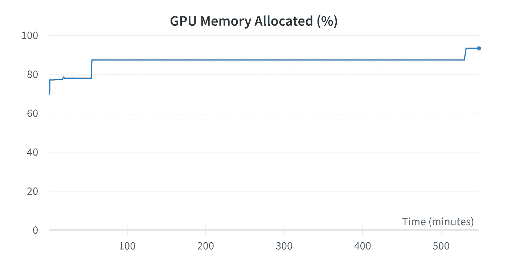
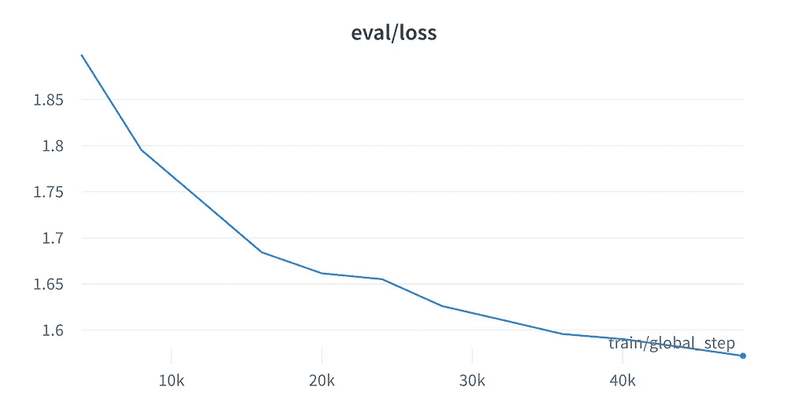
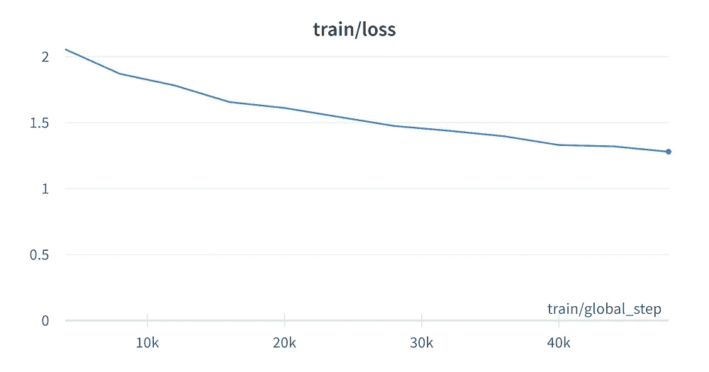
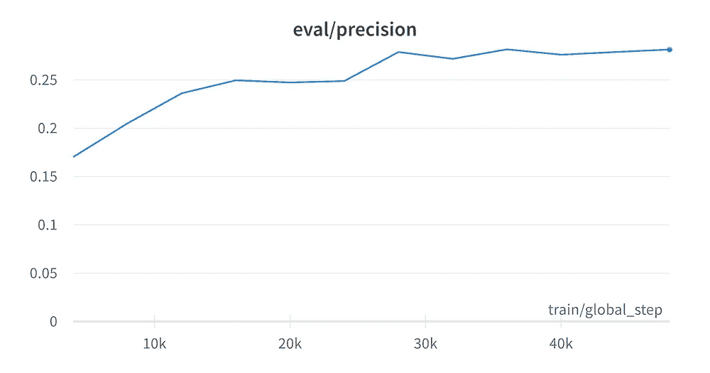
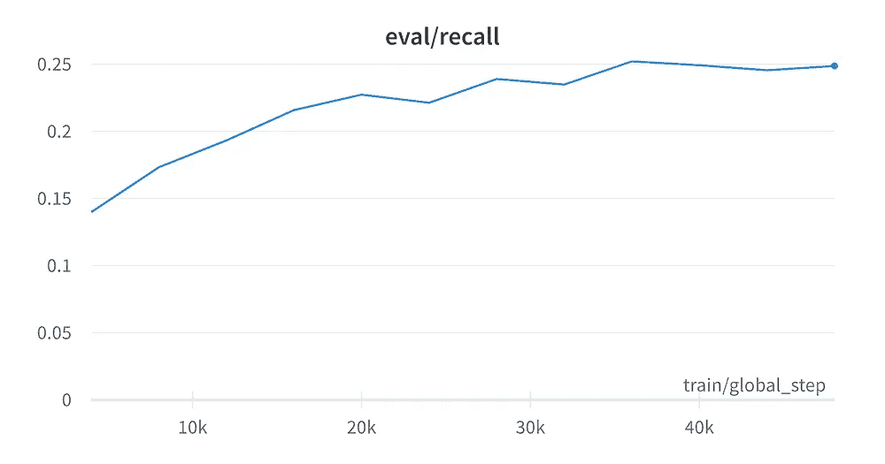
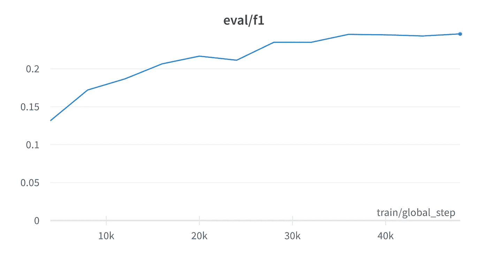

# **优化您的 LLM 而不会让 GPU 负荷过重**

> 原文：[`towardsdatascience.com/fine-tune-your-llm-without-maxing-out-your-gpu-db2278603d78`](https://towardsdatascience.com/fine-tune-your-llm-without-maxing-out-your-gpu-db2278603d78)

## 如何在有限的硬件和紧张的预算下优化您的 LLM

[](https://johnadeojo.medium.com/?source=post_page-----db2278603d78--------------------------------)[](https://towardsdatascience.com/?source=post_page-----db2278603d78--------------------------------) [John Adeojo](https://johnadeojo.medium.com/?source=post_page-----db2278603d78--------------------------------)

·发表于[数据科学前沿](https://towardsdatascience.com/?source=post_page-----db2278603d78--------------------------------) ·阅读时间 8 分钟·2023 年 8 月 1 日

--


作者提供的图片：由 Midjourney 生成

# 定制 LLM 的需求

随着 ChatGPT 的成功，我们见证了对定制大型语言模型需求的激增。

然而，采用的障碍依然存在。由于这些模型体积庞大，对于预算有限的企业、研究人员或爱好者来说，定制这些模型以适应自己的数据集是一项挑战。

现在，通过参数高效优化（PEFT）方法的创新，我们完全有可能以相对较低的成本优化大型语言模型。在本文中，我展示了如何在[Google Colab](https://colab.research.google.com/)中实现这一目标。

我预计这篇文章对从业者、爱好者、学习者甚至实践型初创企业创始人都将大有裨益。

所以，如果你需要制作一个便宜的原型、测试一个想法，或者创建一个引人注目的数据科学项目——请继续阅读。

# 为什么我们要优化？

企业通常拥有驱动其某些流程的私有数据集。

举个例子，我曾在一家银行工作，我们将客户投诉记录在 Excel 电子表格中。一名分析师负责（手动）对这些投诉进行分类以便于报告。每月处理成千上万的投诉，这一过程耗时且容易出错。

如果我们拥有足够的资源，我们可以优化一个大型语言模型来进行这一分类，从而通过自动化节省时间，并可能减少错误分类的发生率。

受到这个例子的启发，本文的其余部分展示了如何优化 LLM 以对金融产品和服务的消费者投诉进行分类。

# 数据集

数据集包含了金融服务和产品的真实消费者投诉数据。这是由[消费者金融保护局](https://www.consumerfinance.gov/complaint/data-use/)发布的公开、公开可用的数据。

数据集中有超过 12 万条匿名投诉，分类为大约 214 个“子问题”。

我在我的 Hugging Face 页面上有一个版本的[数据集](https://huggingface.co/datasets/JAdeojo/consumer_complaints_cfpb)，你可以自己探索。

# 硬件

我用于训练的硬件是通过 Google Colab 访问的 16GB RAM 的 V100 GPU。这是一种相对便宜且可访问的基础设施，通过 Google Colab Pro 以约 9.99 美元每 100 计算单元租用。

# 大型语言模型

使用的 LLM 是 RoBERTa¹（XLM），其参数约为 5.63 亿。模型及其规格的概述可以在[这里](https://huggingface.co/xlm-roberta-large)找到。

虽然目前不是最大的模型，但 RoBERTa 对于仅能访问小规模基础设施的用户来说仍然是一个挑战。这使其成为展示在小规模基础设施上训练相对较大模型可行性的理想选择。

*注意 — RoBERTa 是从* [*Hugging Face Hub*](https://huggingface.co/)*中提取的预训练模型*。

# 使用 LoRA 低成本微调

如引言中所述，PEFT 方法使得低成本微调 LLMs 成为可能。其中一种方法是 LoRA，即大型语言模型的低秩适配。

从高层次来看，LoRA 实现了两件事。首先，它冻结了 LLM 的现有权重（使其不可训练）；其次，它将可训练的“低维”层注入到架构的指定层中。

这种技术产生了一个可训练参数远少于标准微调的模型，同时保持性能。与标准微调相比，LoRA 已被证明能将 GPU 内存消耗降低三倍。

关于 LoRA 的更多详细信息，请阅读完整的[论文](https://arxiv.org/pdf/2106.09685.pdf)。

# 技术细节

过去，在有限硬件上训练大型语言模型的主要挑战是调整训练参数，以防止因超出 GPU 内存容量而导致过程崩溃。

使用 LoRA，可以通过一些调整突破硬件的限制。

## 应用 LoRA

假设你已经准备好数据集，首先需要做的是设置 LoRA 配置。

作者脚本：将 LoRA 应用于 RoBERTa

+   **task_type** — 你微调模型的任务。对于投诉分类，我们专注于序列分类。

+   **r** — 一个名为 LoRA 注意力维度的超参数，影响缩放。

+   **lora_alpha** — 另一个影响缩放的超参数。

+   **target_modules** — 在这里我们指定变换应应用于我们变换器中的注意力模块，因此我们将其设置为“query”和“value”。

+   **lora_dropout** — LoRA 层的丢弃概率。

+   **bias** — LoRA 的偏置类型。

+   **modules_to_save** — 除了 LoRA 层，我们声明希望使模型的哪些层可训练并在最终检查点保存。对于我们的目的，我们需要将分类头设置为可训练。

脚本的下一部分设置了模型本身。这里我们只是从 Hugging Face 加载预训练的 RoBERTa 模型。额外的模型参数仅仅是将字典传递给分类 ID，使得返回的标签为文本形式而非数字编码。

最后，我们希望基于 LoRA 配置转换预训练模型。这是通过 get_peft_model 函数完成的。

应用 LoRA 后，我们得到一个具有以下结构的网络：

```py
trainable params: 4,110,764 
all params: 562,951,596 
trainable%: 0.7302162440267778
```

*注意：原始的 RoBERTa 参数仍然存在于网络中；它们只是被冻结，因此不可训练。相反，我们有 LoRA 层，它们数量较少且可训练。*

## 启动训练

一旦我们有了 LoRA 模型，接下来只需设置训练器并启动训练过程。

脚本作者：LoRA 模型训练设置

脚本中的大多数方面在训练深度学习模型时都是标准的；然而，我们加入了一些额外的元素来提高 GPU 内存效率。让我们简要概述一下它们。

+   **Per_device_train_batch_size** — 将此参数设置为较低的值可以保持 GPU 的低 RAM 使用，但会降低训练速度。数值越低，完成一个 epoch 所需的训练步骤就越多。请记住，一个 epoch 是对整个训练数据集的完整运行。

+   **Per_device_eval_batch** — 设置此参数决定了每个 GPU 核心处理多少数据样本。增加此数值会提高评估速度，从而提高训练速度，但会增加 GPU 内存使用。

+   **Gradient_accumulation_steps** — 通常，在更新深度学习模型时，网络会进行前向传播并计算损失。随后，通过称为反向传播的过程，计算梯度并用以更新模型参数。使用梯度累积时，模型参数不会在一次前向传播后立即更新。相反，梯度会在指定的批次数中存储和累积。只有在所有批次通过网络后，累积的梯度才会应用于更新网络中的参数。其效果是增加有效批量大小，即模型可以有效地在更大的批量大小上进行训练，从而在 GPU 内存使用不增加的情况下，享受训练更大批量的好处。

+   **Fp16（混合精度训练）** — 将混合精度训练设置为 true 可以帮助提高训练速度，但代价是 GPU 使用量增加。本质上，网络中的一些计算以 16 位（半精度）而非 32 位（全精度）进行，以加快计算速度。然而，这种方法需要在 GPU 设备上存储 16 位和 32 位版本的模型，即 1.5 倍的 RAM 使用量。

# 模型诊断

让我们看看一切的表现。由于这涉及到在有限硬件下有效训练，让我们从 GPU RAM 诊断开始。



图片作者提供：GPU RAM 使用图表

我们能够在不超出 GPU RAM 的情况下训练模型 9 小时。这是一个不错的结果。

那么模型的表现如何？让我们看看验证和训练损失。



图片作者提供：验证和训练损失

通过检查损失图表，似乎模型尚未收敛，尽管训练过程持续了大约九小时。

考虑到模型的庞大尺寸和我们有限的基础设施，以及许多训练参数决策优先考虑内存保存而非训练速度，这可能并不令人惊讶。

模型的精准度、召回率和 F1 指标显示，它可能还没有准备好进行全面的生产使用。



图片作者提供：模型的精准度和召回率跟踪



图片作者提供：模型的 F1 跟踪

# 成本

Google 根据计算单元对通过 Colab 租用 GPU 收取费用。因此，要计算训练模型九小时的成本，我们需要确定使用的计算单元数量。我无法从 Google 获得有关这些单元计算的明确细节，但有[建议](https://help.apify.com/en/articles/3490384-what-is-a-compute-unit)计算单元的定义如下：

> 1 GB 内存 x 1 小时 = 1 个计算单元

模型训练了大约九小时，并使用了约 15 GB 的 RAM。因此，训练过程消耗了大约 135 个计算单元。以每 100 个计算单元 9.99 美元的价格，训练模型的成本大约为 13.49 美元。

为了使模型达到可用状态，收敛可能需要稍微高一点的开支。

# 结论

我们已经证明 LoRA 使得资源有限的个人能够参与 LLM 的世界。对于感兴趣的读者，我推荐探索其他[参数高效微调方法](https://huggingface.co/blog/peft)，以及改进训练过程中数据效率的策略。

+   带有完整模型运行的端到端 Colab 可以在[这里](https://colab.research.google.com/drive/1jmUPbg6G2uLkpRg7DQzPzerDLU_d9N2-?usp=sharing)获取。

+   我已托管一个演示该模型的应用程序，[Hugging Face](https://huggingface.co/spaces/JAdeojo/consumer-finance-complaints-app-demo)供你自行尝试。

+   训练运行的完整模型诊断信息可以在[这里](https://api.wandb.ai/links/data-centric-solutions/mai8vzsz)查看。

+   模型检查点的链接在[这里](https://huggingface.co/JAdeojo/xlm-roberta-large-lora-consumer-complaints-cfpb_49k)。

+   在[YouTube](https://youtu.be/HMbctCYJLbw)上观看直播教程。

感谢阅读。

如果你渴望提升在人工智能方面的技能，加入[我的课程](https://www.data-centric-solutions.com/course)的等待名单吧，在课程中我将引导你开发大型语言模型驱动的应用程序。

如果你正在寻求为你的业务进行 AI 转型，今天就预约一次发现电话吧。

[](https://www.brainqub3.com/?source=post_page-----db2278603d78--------------------------------) [## Brainqub3 | AI 软件开发

### 在 Brainqub3，我们开发定制的 AI 软件。我们使用最新的 AI 技术创建 qub3s，先进的人工智能大脑，以...

[www.brainqub3.com](https://www.brainqub3.com/?source=post_page-----db2278603d78--------------------------------)

欲获取更多关于人工智能、数据科学和大型语言模型的见解，你可以订阅[YouTube](https://www.youtube.com/channel/UCkXe-exqi25V4GnZendgEaA)频道。

# 引用

[1] Conneau, A., Khandelwal, K., Goyal, N., Chaudhary, V., Wenzek, G., Guzmán, F., Grave, E., Ott, M., Zettlemoyer, L., & Stoyanov, V. (2019). 大规模无监督跨语言表示学习。*CoRR*。取自[`arxiv.org/abs/1911.02116`](http://arxiv.org/abs/1911.02116)
