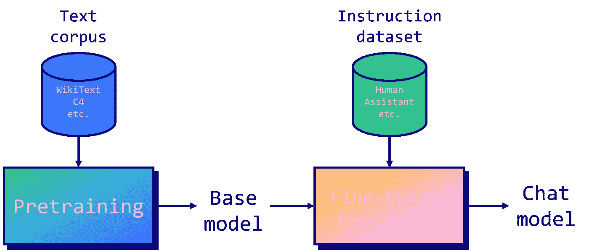
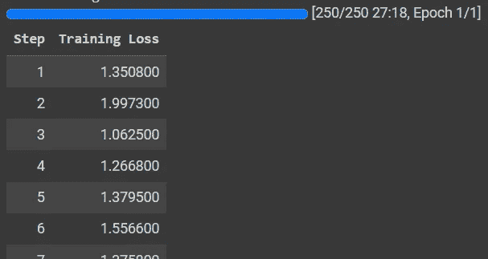
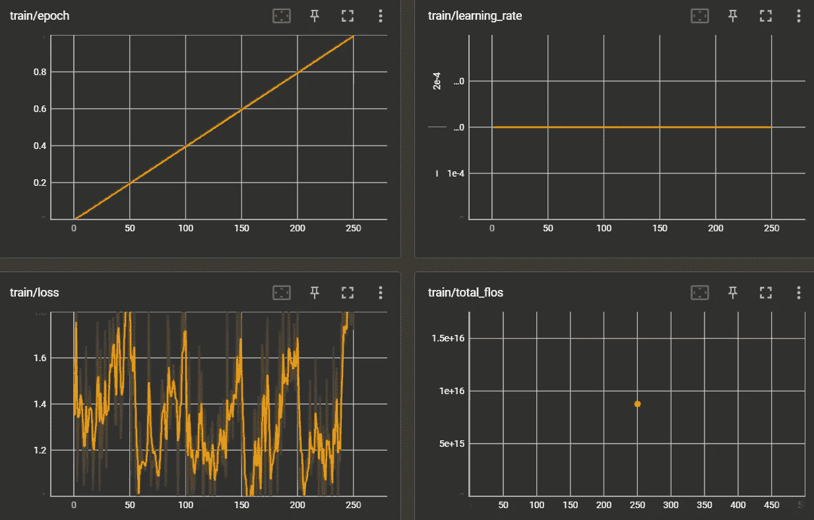

# 在 Colab 笔记本中微调你自己的 Llama 2 模型

> 原文：[`towardsdatascience.com/fine-tune-your-own-llama-2-model-in-a-colab-notebook-df9823a04a32`](https://towardsdatascience.com/fine-tune-your-own-llama-2-model-in-a-colab-notebook-df9823a04a32)

## 实用的 LLM 微调介绍

[](https://medium.com/@mlabonne?source=post_page-----df9823a04a32--------------------------------)[](https://towardsdatascience.com/?source=post_page-----df9823a04a32--------------------------------) [Maxime Labonne](https://medium.com/@mlabonne?source=post_page-----df9823a04a32--------------------------------)

·发表于 [Towards Data Science](https://towardsdatascience.com/?source=post_page-----df9823a04a32--------------------------------) ·12 分钟阅读·2023 年 7 月 25 日

--


作者提供的图片

随着 LLaMA v1 的发布，我们见证了微调模型的寒武纪大爆发，包括[Alpaca](https://github.com/tatsu-lab/stanford_alpaca)、[Vicuna](https://huggingface.co/lmsys/vicuna-13b-v1.3)和[WizardLM](https://huggingface.co/WizardLM/WizardLM-13B-V1.1)等。这一趋势促使不同的公司推出了适合商业使用的基础模型许可证，如[OpenLLaMA](https://github.com/openlm-research/open_llama)、[Falcon](https://falconllm.tii.ae/)和[XGen](https://github.com/salesforce/xgen)等。Llama 2 的发布现将两者的最佳元素结合起来：提供了**高效的基础模型和更宽松的许可证**。

在 2023 年上半年，软件领域受到了**API 的广泛使用**（如 OpenAI API）的重大影响，利用大型语言模型（LLMs）构建基础设施。[LangChain](https://python.langchain.com/docs/get_started/introduction.html)和[LlamaIndex](https://www.llamaindex.ai/)等库在这一趋势中发挥了关键作用。进入下半年，**微调（或指令调优）这些模型将成为 LLMOps 工作流中的标准流程**。这一趋势受到多种因素推动：节省成本的潜力、处理机密数据的能力，甚至是开发超越 ChatGPT 和 GPT-4 等显著模型在特定任务中的表现的模型的潜力。

在本文中，我们将探讨为什么指令调优有效，以及如何在 Google Colab 笔记本中实现它，以创建你自己的 Llama 2 模型。与往常一样，代码可在[Colab](https://colab.research.google.com/drive/1PEQyJO1-f6j0S_XJ8DV50NkpzasXkrzd?usp=sharing)和[GitHub](https://github.com/mlabonne/llm-course)上找到。

# **🔧** 微调 LLMs 的背景



图片由作者提供

LLMs 在大量文本语料库上进行预训练。以[Llama 2](https://arxiv.org/abs/2307.09288)为例，我们对训练集的组成知之甚少，除了它有 2 万亿个标记。相比之下，[BERT](https://arxiv.org/abs/1810.04805)（2018 年）“仅”在 BookCorpus（8 亿词）和英语维基百科（25 亿词）上进行过训练。从经验来看，这**是一个非常昂贵且漫长的过程**，并且有很多硬件问题。如果你想了解更多，我推荐阅读[Meta 的日志](https://github.com/facebookresearch/metaseq/blob/main/projects/OPT/chronicles/OPT175B_Logbook.pdf)，了解 OPT-175B 模型的预训练情况。

当预训练完成后，像 Llama 2 这样的自回归模型可以**预测序列中的下一个标记**。然而，这并没有使它们成为特别有用的助手，因为它们不会对指令作出回应。这就是我们采用指令调优来使它们的回答与人类期望对齐的原因。主要有两种微调技术：

+   **监督微调**（SFT）：模型在一组指令和响应的数据集上进行训练。它调整 LLM 中的权重，以最小化生成的答案与真实响应之间的差异，作为标签。

+   **来自人类反馈的强化学习**（RLHF）：模型通过与环境互动并接收反馈来学习。它们被训练以最大化奖励信号（使用[PPO](https://arxiv.org/abs/1707.06347)），这个信号通常来源于人类对模型输出的评估。

一般来说，RLHF 被证明能够捕捉到**更复杂和细致的**人类偏好，但也更难有效实施。确实，它需要精心设计奖励系统，并且对人类反馈的质量和一致性较为敏感。未来的一个可能替代方案是[直接偏好优化](https://arxiv.org/abs/2305.18290)（DPO）算法，它直接在 SFT 模型上运行偏好学习。

在我们的案例中，我们将执行 SFT，但这提出了一个问题：为什么微调在第一时间会有效？正如[Orca 论文](https://mlabonne.github.io/blog/notes/Large%20Language%20Models/orca.html)中所强调的，我们的理解是微调**利用了在预训练过程中获得的知识**。换句话说，如果模型从未见过你感兴趣的数据类型，微调将无济于事。然而，如果是这种情况，SFT 可以表现得极其优秀。

例如，[LIMA 论文](https://mlabonne.github.io/blog/notes/Large%20Language%20Models/lima.html)展示了如何通过在仅 1,000 个高质量样本上微调一个具有 65 亿参数的 LLaMA（v1）模型来超越 GPT-3（DaVinci003）。**指令数据集的质量至关重要**，以达到这种性能水平，这就是为什么许多工作集中在这个问题上（如[evol-instruct](https://arxiv.org/abs/2304.12244)、Orca 或[phi-1](https://mlabonne.github.io/blog/notes/Large%20Language%20Models/phi1.html)）。请注意，LLM 的大小（65b，而不是 13b 或 7b）对有效利用已有知识也是至关重要的。

与数据质量相关的另一个重要点是**提示模板**。提示由类似的元素组成：用于指导模型的系统提示（可选），用于提供指令的用户提示（必需），需要考虑的额外输入（可选），以及模型的回答（必需）。在 Llama 2 的情况下，作者使用了以下**聊天模型**的模板：

```py
<s>[INST] <<SYS>>
System prompt
<</SYS>>

User prompt [/INST] Model answer </s>
```

还有其他模板，比如来自 Alpaca 和 Vicuna 的模板，它们的影响还不太明确。在这个例子中，我们将重新格式化我们的指令数据集以符合 Llama 2 的模板。为了本教程的目的，我已经使用了优秀的`[timdettmers/openassistant-guanaco](https://huggingface.co/datasets/timdettmers/openassistant-guanaco)`数据集。你可以在 Hugging Face 上找到它，名称为`[mlabonne/guanaco-llama2-1k](https://huggingface.co/datasets/mlabonne/guanaco-llama2-1k)`。请注意，如果你使用的是基础版 Llama 2 模型而不是聊天版本，你不需要遵循特定的提示模板。

# 🦙 如何微调 Llama 2

在本节中，我们将使用 Google Colab（2.21 信用/小时）在配备高 RAM 的 T4 GPU 上微调一个具有 70 亿参数的 Llama 2 模型。请注意，T4 的 VRAM 仅为 16 GB，这勉强足够**存储 Llama 2–7b 的权重**（7b × 2 字节 = 14 GB 的 FP16）。此外，我们还需要考虑优化器状态、梯度和前向激活的开销（有关更多信息，请参见[这篇优秀的文章](https://huggingface.co/docs/transformers/perf_train_gpu_one#anatomy-of-models-memory)）。这意味着在这里进行全面微调是不可能的：我们需要像[LoRA](https://arxiv.org/abs/2106.09685)或[QLoRA](https://arxiv.org/abs/2305.14314)这样的参数高效微调（PEFT）技术。

为了大幅减少 VRAM 使用量，我们必须**用 4 位精度微调模型**，这就是我们在这里使用 QLoRA 的原因。好消息是我们可以利用 Hugging Face 生态系统中的`transformers`、`accelerate`、`peft`、`trl`和`bitsandbytes`库。我们将在以下代码中进行操作，基于 Younes Belkada 的[GitHub Gist](https://gist.github.com/younesbelkada/9f7f75c94bdc1981c8ca5cc937d4a4da)。首先，我们安装并加载这些库。

```py
!pip install -q accelerate==0.21.0 peft==0.4.0 bitsandbytes==0.40.2 transformers==4.31.0 trl==0.4.7
```

```py
import os
import torch
from datasets import load_dataset
from transformers import (
    AutoModelForCausalLM,
    AutoTokenizer,
    BitsAndBytesConfig,
    HfArgumentParser,
    TrainingArguments,
    pipeline,
    logging,
)
from peft import LoraConfig, PeftModel
from trl import SFTTrainer
```

让我们稍微讨论一下可以在这里调整的参数。首先，我们希望加载一个`llama-2-7b-chat-hf`模型（**chat** 模型），并在`mlabonne/guanaco-llama2-1k`（1,000 个样本）上训练它，这将生成我们微调后的模型`llama-2-7b-miniguanaco`。如果你对如何创建这个数据集感兴趣，可以查看[这个笔记本](https://colab.research.google.com/drive/1Ad7a9zMmkxuXTOh1Z7-rNSICA4dybpM2?usp=sharing)。可以随意更改：在[Hugging Face Hub](https://huggingface.co/datasets)上有很多好的数据集，比如`[databricks/databricks-dolly-15k](https://huggingface.co/datasets/databricks/databricks-dolly-15k)`。

QLoRA 将使用 64 的秩和 16 的缩放参数（有关 LoRA 参数的更多信息，请参见[这篇文章](https://rentry.org/llm-training#low-rank-adaptation-lora_1)）。我们将使用 NF4 类型以 4 位精度直接加载 Llama 2 模型，并训练一个周期。有关其他参数的更多信息，请查看[TrainingArguments](https://huggingface.co/docs/transformers/main_classes/trainer#transformers.TrainingArguments)、[PeftModel](https://huggingface.co/docs/peft/package_reference/peft_model)和[SFTTrainer](https://huggingface.co/docs/trl/main/en/sft_trainer) 文档。

```py
# The model that you want to train from the Hugging Face hub
model_name = "NousResearch/Llama-2-7b-chat-hf"

# The instruction dataset to use
dataset_name = "mlabonne/guanaco-llama2-1k"

# Fine-tuned model name
new_model = "llama-2-7b-miniguanaco"

################################################################################
# QLoRA parameters
################################################################################

# LoRA attention dimension
lora_r = 64

# Alpha parameter for LoRA scaling
lora_alpha = 16

# Dropout probability for LoRA layers
lora_dropout = 0.1

################################################################################
# bitsandbytes parameters
################################################################################

# Activate 4-bit precision base model loading
use_4bit = True

# Compute dtype for 4-bit base models
bnb_4bit_compute_dtype = "float16"

# Quantization type (fp4 or nf4)
bnb_4bit_quant_type = "nf4"

# Activate nested quantization for 4-bit base models (double quantization)
use_nested_quant = False

################################################################################
# TrainingArguments parameters
################################################################################

# Output directory where the model predictions and checkpoints will be stored
output_dir = "./results"

# Number of training epochs
num_train_epochs = 1

# Enable fp16/bf16 training (set bf16 to True with an A100)
fp16 = False
bf16 = False

# Batch size per GPU for training
per_device_train_batch_size = 4

# Batch size per GPU for evaluation
per_device_eval_batch_size = 4

# Number of update steps to accumulate the gradients for
gradient_accumulation_steps = 1

# Enable gradient checkpointing
gradient_checkpointing = True

# Maximum gradient normal (gradient clipping)
max_grad_norm = 0.3

# Initial learning rate (AdamW optimizer)
learning_rate = 2e-4

# Weight decay to apply to all layers except bias/LayerNorm weights
weight_decay = 0.001

# Optimizer to use
optim = "paged_adamw_32bit"

# Learning rate schedule (constant a bit better than cosine)
lr_scheduler_type = "constant"

# Number of training steps (overrides num_train_epochs)
max_steps = -1

# Ratio of steps for a linear warmup (from 0 to learning rate)
warmup_ratio = 0.03

# Group sequences into batches with same length
# Saves memory and speeds up training considerably
group_by_length = True

# Save checkpoint every X updates steps
save_steps = 25

# Log every X updates steps
logging_steps = 25

################################################################################
# SFT parameters
################################################################################

# Maximum sequence length to use
max_seq_length = None

# Pack multiple short examples in the same input sequence to increase efficiency
packing = False

# Load the entire model on the GPU 0
device_map = {"": 0}
```

现在我们可以加载所有内容并开始微调过程。我们依赖多个包装器，请耐心等待。

+   首先，我们要**加载我们定义的数据集**。在这里，我们的数据集已经过预处理，但通常，这时你会重新格式化提示、筛选掉不良文本、合并多个数据集等。

+   然后，我们正在配置 `bitsandbytes` 以进行 4 位量化。

+   接下来，我们正在使用相应的分词器将 Llama 2 模型以 4 位精度加载到 GPU 上。

+   最后，我们正在加载 QLoRA 配置、常规训练参数，并将所有内容传递给`SFTTrainer`。训练可以最终开始！

```py
# Load dataset (you can process it here)
dataset = load_dataset(dataset_name, split="train")

# Load tokenizer and model with QLoRA configuration
compute_dtype = getattr(torch, bnb_4bit_compute_dtype)

bnb_config = BitsAndBytesConfig(
    load_in_4bit=use_4bit,
    bnb_4bit_quant_type=bnb_4bit_quant_type,
    bnb_4bit_compute_dtype=compute_dtype,
    bnb_4bit_use_double_quant=use_nested_quant,
)

# Check GPU compatibility with bfloat16
if compute_dtype == torch.float16 and use_4bit:
    major, _ = torch.cuda.get_device_capability()
    if major >= 8:
        print("=" * 80)
        print("Your GPU supports bfloat16: accelerate training with bf16=True")
        print("=" * 80)

# Load base model
model = AutoModelForCausalLM.from_pretrained(
    model_name,
    quantization_config=bnb_config,
    device_map=device_map
)
model.config.use_cache = False
model.config.pretraining_tp = 1

# Load LLaMA tokenizer
tokenizer = AutoTokenizer.from_pretrained(model_name, trust_remote_code=True)
tokenizer.pad_token = tokenizer.eos_token
tokenizer.padding_side = "right"

# Load LoRA configuration
peft_config = LoraConfig(
    lora_alpha=lora_alpha,
    lora_dropout=lora_dropout,
    r=lora_r,
    bias="none",
    task_type="CAUSAL_LM",
)

# Set training parameters
training_arguments = TrainingArguments(
    output_dir=output_dir,
    num_train_epochs=num_train_epochs,
    per_device_train_batch_size=per_device_train_batch_size,
    gradient_accumulation_steps=gradient_accumulation_steps,
    optim=optim,
    save_steps=save_steps,
    logging_steps=logging_steps,
    learning_rate=learning_rate,
    weight_decay=weight_decay,
    fp16=fp16,
    bf16=bf16,
    max_grad_norm=max_grad_norm,
    max_steps=max_steps,
    warmup_ratio=warmup_ratio,
    group_by_length=group_by_length,
    lr_scheduler_type=lr_scheduler_type,
    report_to="tensorboard"
)

# Set supervised fine-tuning parameters
trainer = SFTTrainer(
    model=model,
    train_dataset=dataset,
    peft_config=peft_config,
    dataset_text_field="text",
    max_seq_length=max_seq_length,
    tokenizer=tokenizer,
    args=training_arguments,
    packing=packing,
)

# Train model
trainer.train()

# Save trained model
trainer.model.save_pretrained(new_model)
```



作者提供的图片

训练可能会很长时间，这取决于数据集的大小。在这里，T4 GPU 上花了不到一个小时。我们可以在 tensorboard 上检查图表，如下所示：

```py
%load_ext tensorboard
%tensorboard --logdir results/runs
```



作者提供的图片

让我们确保模型行为正确。这需要更全面的评估，但我们可以使用**文本生成管道**来提出诸如“什么是大语言模型？”这样的问题。请注意，我正在格式化输入以匹配 Llama 2 的提示模板。

```py
# Ignore warnings
logging.set_verbosity(logging.CRITICAL)

# Run text generation pipeline with our next model
prompt = "What is a large language model?"
pipe = pipeline(task="text-generation", model=model, tokenizer=tokenizer, max_length=200)
result = pipe(f"<s>[INST] {prompt} [/INST]")
print(result[0]['generated_text'])
```

模型输出了以下响应：

```py
A large language model is a type of artificial intelligence that is trained on a large dataset of text to generate human-like language. It is typically trained on a dataset of text that is much larger than the dataset used for smaller language models. The large dataset allows the model to learn more complex patterns in language, which can result in more accurate and natural-sounding language generation.Large language models are often used for tasks such as text summarization, language translation, and chatbots. They are also used for more complex tasks such as writing articles, generating creative content, and even composing music.Large language models are trained using a technique called deep learning, which involves using many layers of artificial neural networks to learn complex patterns in the data. The model is trained on a large dataset of text, and the neural networks are trained to predict the next word in a sequence of text given
```

根据经验，对于只有 70 亿参数的模型来说，它**非常一致**。你可以尝试使用评估数据集中的更难问题，如[BigBench-Hard](https://github.com/suzgunmirac/BIG-Bench-Hard)。Guanaco 是一个优秀的数据集，以前生产过高质量的模型。你可以使用`[mlabonne/guanaco-llama2](https://huggingface.co/datasets/mlabonne/guanaco-llama2)`在整个数据集上训练 Llama 2 模型。

现在我们如何存储我们新的 `llama-2-7b-miniguanaco` 模型？我们需要将 LoRA 的权重与基础模型合并。不幸的是，据我所知，没有简单的方法来做到这一点：我们需要以 FP16 精度重新加载基础模型，并使用 `peft` 库来合并所有内容。可惜的是，这也会引发 VRAM 的问题（尽管已经清空），所以我建议**重启笔记本**，重新执行前三个单元格，然后执行下一个单元格。如果你知道解决办法，请联系我！

```py
# Reload model in FP16 and merge it with LoRA weights
base_model = AutoModelForCausalLM.from_pretrained(
    model_name,
    low_cpu_mem_usage=True,
    return_dict=True,
    torch_dtype=torch.float16,
    device_map=device_map,
)
model = PeftModel.from_pretrained(base_model, new_model)
model = model.merge_and_unload()

# Reload tokenizer to save it
tokenizer = AutoTokenizer.from_pretrained(model_name, trust_remote_code=True)
tokenizer.add_special_tokens({'pad_token': '[PAD]'})
tokenizer.pad_token = tokenizer.eos_token
tokenizer.padding_side = "right"
```

我们的权重已合并并重新加载了分词器。现在我们可以将所有内容推送到 Hugging Face Hub 以保存我们的模型。

```py
!huggingface-cli login

model.push_to_hub(new_model, use_temp_dir=False)
tokenizer.push_to_hub(new_model, use_temp_dir=False)
```

现在，你可以像加载 Hub 上的其他 Llama 2 模型一样使用这个模型进行推理。也可以重新加载它以进行更多的微调——也许用另一个数据集？

如果你认真考虑微调模型，建议**使用脚本**而不是笔记本。你可以在 Lambda Labs、Runpod、Vast.ai 上以低于 0.3$/小时的价格轻松租用 GPU。一旦连接，你可以安装库、导入脚本、登录 Hugging Face 和其他工具（如 Weights & Biases 用于记录实验），然后开始微调。

`trl` 脚本目前非常有限，因此我基于之前的笔记本制作了自己的版本。你可以在[**GitHub Gist 上找到它**](https://gist.github.com/mlabonne/8eb9ad60c6340cb48a17385c68e3b1a5)。如果你在寻找全面的解决方案，可以查看来自 OpenAccess AI Collective 的 [Axolotl](https://github.com/OpenAccess-AI-Collective/axolotl)，它也原生支持多个数据集、Deepspeed、Flash Attention 等。

# 结论

在这篇文章中，我们展示了如何使用 Colab 笔记本对 Llama 2 7b 模型进行微调。我们介绍了一些 LLM 训练和微调的必要背景，以及与指令数据集相关的重要考虑因素。在第二部分，我们**成功地微调了 Llama 2 模型**，使用了其原生提示模板和自定义参数。

这些微调后的模型可以集成到 LangChain 和其他架构中，作为 OpenAI API 的有利替代方案。记住，在这个新范式中，指令数据集是新的黄金，你的模型的质量在很大程度上取决于其微调的数据。因此，祝你构建高质量数据集好运！

如果你对更多关于 LLM 的内容感兴趣，可以在 Twitter 上关注我 [@maximelabonne](https://twitter.com/maximelabonne)。

# 参考资料

+   Hugo Touvron, Thomas Scialom 等人（2023 年）。[Llama 2: Open Foundation and Fine-Tuned Chat Models](https://arxiv.org/abs/2307.09288)。

+   Philipp Schmid, Omar Sanseviero, Pedro Cuenca, & Lewis Tunstall. Llama 2 已上线——在 Hugging Face 上获取它。 [`huggingface.co/blog/llama2`](https://huggingface.co/blog/llama2)

+   罗汉·塔奥里、伊莎恩·古尔拉贾尼、张天艺、扬·杜布瓦、李雪辰、卡洛斯·盖斯特林、珀西·梁及辰野博。 (2023). [斯坦福阿尔帕卡：一种遵循指令的 LLaMA 模型](https://crfm.stanford.edu/2023/03/13/alpaca.html)。

+   雅各布·德夫林、明伟·张、肯顿·李及克里斯蒂娜·托特诺娃。 (2019). [BERT：用于语言理解的深度双向变换器的预训练](https://arxiv.org/abs/1810.04805)。

+   提姆·德特默斯、阿尔蒂多罗·帕尼奥尼、阿里·霍尔茨曼及卢克·泽特尔摩耶。 (2023). [QLoRA：高效微调量化 LLM](https://arxiv.org/abs/2305.14314)。

# 相关文章

[](/4-bit-quantization-with-gptq-36b0f4f02c34?source=post_page-----df9823a04a32--------------------------------) ## 使用 GPTQ 进行 4 位量化

### 使用 AutoGPTQ 对自己的 LLM 进行量化

towardsdatascience.com [](/decoding-strategies-in-large-language-models-9733a8f70539?source=post_page-----df9823a04a32--------------------------------) ## 大型语言模型中的解码策略

### 从束搜索到核采样的文本生成指南

towardsdatascience.com

*了解更多机器学习知识，并通过点击支持我的工作——成为 Medium 会员：*

[](https://medium.com/@mlabonne/membership?source=post_page-----df9823a04a32--------------------------------) [## 通过我的推荐链接加入 Medium - Maxime Labonne

### 作为 Medium 会员，你的会员费的一部分会支持你阅读的作者，同时你可以全面访问每一个故事……

medium.com](https://medium.com/@mlabonne/membership?source=post_page-----df9823a04a32--------------------------------)

*如果你已经是会员，你可以* [*在 Medium 上关注我*](https://medium.com/@mlabonne)*。*
